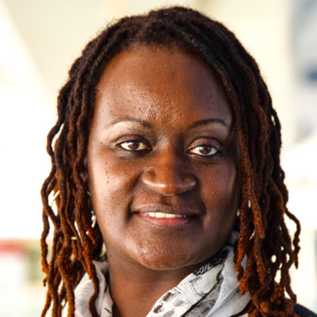

---
hide:
    - footer
    - navigation
    - toc
---
# Our story {: .center-text }

In the late summer 2022, in Palo Alto, a father wanted to mentor his son who was then in middle school at JLS. As an engineer, the father saw AI as the technology of the future and wanted to channel his son's interest and passion by teaching him what he knew. Together they began reading their [first AI paper](https://rachit-dubey.github.io/humanRL_website/) and tinkering with fun coding and [non-coding](https://cola.midtown.ai/) projects.

## Advisers {: .center-text }

To increase our impact, our aspiration is to extend our reach further than the Palo Alto School District and support AI education for teachers and students in all high schools within the Silicon Valley. Institutions such as East Palo Alto Academy, Fremont High School, Sequoia High School in Redwood City are next on our list. Join us in realizing our mission to make AI accessible to all, our vision of "AI for ALL".

-   {: width=50% height=50%}

    [Emmanuel Mayssat](https://www.linkedin.com/in/emayssat/)

    Head Coach, MBA & MSCS

-   {: width=50% height=50%}

    [Atashi Basu](https://www.linkedin.com/in/atashi-basu-079a934/)

    Research Coach, Phd Chem

-   {: width=50% height=50%}

    [Leah Symekher](https://www.linkedin.com/in/lsymek/)

    External Liaison

<!--
-   {: width=50% height=50%}

    [Kai Kam](https://www.linkedin.com/in/kaikam/)

    Engineering Coach, BCS

-   {: width=50% height=50%}

    You?
-->

Let's explore this transforming technology. Let's shape the future of AI together.

[Make a Donation](https://donate.stripe.com/00gbL46JP50K0YE9AD){ .md-button .md-button--primary style="margin: 5% 10% 5% 10%; text-align: center; width: 80%;"}

For more information, contact us at [ai4all@midtown.ai](mailto:ai4all@midtown.ai)

