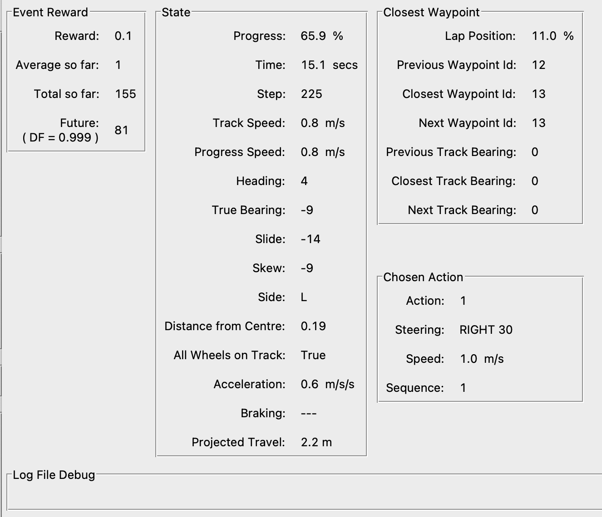

# A

## Abductive Reasoning

 Abductive reasoning is a type of [reasoning] where a conclusion is drawn based on the best explanation for a given set of observations. It involves considering different hypotheses and selecting the most likely or best explanation based on the available evidence. Abductive reasoning is used to make educated guesses or hypotheses when faced with incomplete or uncertain information. For example, observing a car that cannot start and a puddle of liquid under the engine, and concluding that the most likely explanation is a leak in the radiator.


/// Note
 More at:

  * LLM reasoning ability - [https://www.kaggle.com/code/flaussy/large-language-models-reasoning-ability](https://www.kaggle.com/code/flaussy/large-language-models-reasoning-ability)
///


## Ablation

 * [https://developers.google.com/machine-learning/glossary#ablation](https://developers.google.com/machine-learning/glossary#ablation)


## Accuracy

 A metric used for [model evaluation] that measures the number of correct predictions made by the model over all kinds of predictions. Useful for classification tasks like sentiment analysis.

 ~ the percentage of samples correctly classified given a labelled (but possibly biased) dataset. Consider a classification task in which a machine learning system observes tumors and must predict whether they are malignant or benign. Accuracy, or the ==fraction of instances that were classified correctly, is an intuitive measure of the program's performance==. While accuracy does measure the program's performance, it does not differentiate between malignant tumors that were classified as being benign, and benign tumors that were classified as being malignant. In some applications, the costs associated with all types of errors may be the same. In this problem, however, failing to identify malignant tumors is likely a more severe error than mistakenly classifying benign tumors as being malignant.

```
                 TP + TN
Accuracy = -------------------
            TP + TN + FP + FN

T = Correctly identified
F = Incorrectly identified
P = Actual value is positive (class A, a cat)
F = Actual value is negative (class B, not a cat, a dog)

TP = True positive (correctly identified as class A)
TN = True negative (correctly identified as class B)
FP = False Positive
FN = False negative
TP + TN + FP + FN = all experiments/classifications/samples
```

 More at:

  * [https://medium.com/analytics-vidhya/what-is-a-confusion-matrix-d1c0f8feda5](https://medium.com/analytics-vidhya/what-is-a-confusion-matrix-d1c0f8feda5)

 See also [A], [Confusion Matrix]


## Action

 In [Reinforcement Learning], an action is a move made by the agent in the current state. For [AWS DeepRacer], an action corresponds to a move at a particular speed (throttle) and steering angle. With [AWS DeepRacer], there is an immediate reward associated with any action. 

 See also [A], [Action Space]


## Action Space

 In [Reinforcement Learning], represents a set of actions.

  * [Discrete action space] - We can individually define each action. In the discrete action space setting, limiting an agent's choices to a finite number of predefined actions puts the onus on you to understand the impact of these actions and define them based on the [environment] (track, racing format) and your reward functions.
  * [Continuous action space] - 

 This lists out all of what the agent can actually do at each timestep virtually or physically.

  * Speed between 0.5 and 1 m/s
  * Steering angle -30 to 30 deg

 See also [A], [Action]


## Action Transformer

```
At Adept, we are building the next frontier of models that can take actions in the digital world—that’s why we’re excited to introduce our first large model, Action Transformer (ACT-1).

Why are we so excited about this?

First, we believe the clearest framing of general intelligence is a system that can do anything a human can do in front of a computer. A foundation model for actions, trained to use every software tool, API, and webapp that exists, is a practical path to this ambitious goal, and ACT-1 is our first step in this direction.
```

```
“Adept’s technology sounds plausible in theory, [but] talking about Transformers needing to be ‘able to act’ feels a bit like misdirection to me,” Mike Cook, an AI researcher at the Knives & Paintbrushes research collective, which is unaffiliated with Adept, told TechCrunch via email. “Transformers are designed to predict the next items in a sequence of things, that’s all. To a Transformer, it doesn’t make any difference whether that prediction is a letter in some text, a pixel in an image, or an API call in a bit of code. So this innovation doesn’t feel any more likely to lead to artificial general intelligence than anything else, but it might produce an AI that is better suited to assisting in simple tasks.”“Adept’s technology sounds plausible in theory, [but] talking about Transformers needing to be ‘able to act’ feels a bit like misdirection to me,” Mike Cook, an AI researcher at the Knives & Paintbrushes research collective, which is unaffiliated with Adept, told TechCrunch via email. “Transformers are designed to predict the next items in a sequence of things, that’s all. To a Transformer, it doesn’t make any difference whether that prediction is a letter in some text, a pixel in an image, or an API call in a bit of code. So this innovation doesn’t feel any more likely to lead to artificial general intelligence than anything else, but it might produce an AI that is better suited to assisting in simple tasks.”
# https://techcrunch.com/2022/04/26/2304039/
```

 See also [A], [Reinforcement Learning], [Transformer Architecture]


## Action-Value Function

 This tells us how good it is for the agent to take any given action from a given state while following the policy. In other words, it gives us the value of an action under policy (pi). The [state-value] function tells us how good any given state is for the [RL agent], whereas the action-value function tells us how good it is for the [RL agent] to take any [action] from a given [state].

```
Qpi(s,a) = E [ sum(0,oo, gamma*R | St=s, At=a]
# St state at a given timestep
# At action at a given timestep
```

 See also [A], [Bellman Equation], [Time Step]


## Activation Atlas

 Image used to walk through the [embedding space] of the model

 {width="100%" }

 More at:

  * article - [https://openai.com/index/introducing-activation-atlases/](https://openai.com/index/introducing-activation-atlases/)
  * simulation + paper - [https://distill.pub/2019/activation-atlas/](https://distill.pub/2019/activation-atlas/)


## Activation Checkpointing

 ~ one of the classic tradeoffs in computer science—between memory and compute.

 ~ active only during training?

 Activation checkpointing is a technique used in deep learning models to reduce memory consumption during the backpropagation process, particularly in recurrent neural networks (RNNs) and transformers. It allows for training models with longer sequences or larger batch sizes without running into memory limitations.

 During the forward pass of a deep learning model, activations (intermediate outputs) are computed and stored for each layer. These activations are required for computing gradients during the backward pass or backpropagation, which is necessary for updating the model parameters.

 In activation checkpointing, instead of storing all activations for the entire sequence or batch, only a subset of activations is saved. The rest of the activations are recomputed during the backward pass as needed. By selectively recomputing activations, the memory requirements can be significantly reduced, as only a fraction of the activations need to be stored in memory at any given time.

 The process of activation checkpointing involves dividing the computational graph into segments or checkpoints. During the forward pass, the model computes and stores the activations at the checkpoints. During the backward pass, the gradients are calculated using the stored activations, and the remaining activations are recomputed as necessary, using the saved memory from recomputed activations.

 Activation checkpointing is an effective technique for mitigating memory limitations in deep learning models, particularly in scenarios where memory constraints are a bottleneck for training large-scale models with long sequences or large batch sizes. It helps strike a balance between memory consumption and computational efficiency, enabling the training of more memory-intensive models.

 More at:

  * [https://towardsdatascience.com/how-to-increase-training-performance-through-memory-optimization-1000d30351c8](https://towardsdatascience.com/how-to-increase-training-performance-through-memory-optimization-1000d30351c8)

 See also [A], [Zero Redundancy Optimization]


## Activation Function

 Activation functions are required to include non-linearity in the [artificial neural network] .

 Without activation functions, in a multi-layered neural network the [Decision Boundary] stays a line regardless of the [weight] and [bias] settings of each [artificial neuron]!

 There are several activation functions used in the fields. They are:

  * [Rectified Linear Unit (ReLU)][ReLU] function
  * [LeakyReLU] function
  * [Tanh function][Tanh Activation Function],
  * [Sigmoid function][Sigmoid Activation Function] : Sigmoid is great to keep a probability between 0 and 1, even if sample is an outlier based on the sample. (Ex: how long to slow down for a car, or will I hit the tree given the distance, but here car goes at 500km/h = an outlier)
  * [Softplus function][Softplus Activation Function]
  * [Step activation][Step Activation Function]
  * [Gaussian Error Linear Unit (GELU)][GELU] function
  * [Exponential Linear Unit (ELU)][ELU] function
  * [Linear function][Linear Activation Function]

 A crucial element within [artificial neural networks], responsible for modifying input signals. This function adjusts the output magnitude based on the input magnitude: Inputs over a predetermined threshold result in larger outputs. It acts like a gate that selectively permits values over a certain point.

 {: width="100%" }

 {: width="100%" }

 {: width="100%" }

 

/// warning | Warning ...

for multi-layer neural networks that use of an activation function at each layer, the [backpropagation] computation leads to loss of information (forward for input and backward for weight computation) which is known as the [vanishing gradient problem].
///

 See also [A], [Batch Normalization], [Exploding Gradient Problem], [Gradient Descent Algorithm], [Loss Function]


## Activation Layer

 Activation layers are an important component in [convolutional neural networks (CNNs)][CNNs]. Here's an explanation of what they are and why they are used:

 The purpose of activation layers in a CNN is to introduce nonlinearity. Most of the layers in a CNN perform linear operations - for example, convolution layers apply a dot product between the input and a filter, and pooling layers downsample using an algorithm like max or average.

 These linear operations alone don't allow the CNN to learn complex patterns. Without nonlinearity, no matter how many layers you stack, the output would still be a linear function of the input.

 Activation layers apply a nonlinear function to the output from the previous layer. This allows the CNN to learn and model complex nonlinear relationships between the inputs and outputs.

 Some common [activation functions] used are:

  * ReLU (Rectified Linear Unit): ReLU applies the function f(x) = max(0, x). It thresholds all negative values to 0.
  * Leaky ReLU: A variant of ReLU that gives a small negative slope (e.g. 0.01) to negative values rather than thresholding at 0.
  * Tanh: Applies the hyperbolic tangent function to squash values between -1 and 1.
  * Sigmoid: Applies the logistic sigmoid function to squash values between 0 and 1.

 In practice, ReLU is by far the most common activation function used in CNNs. The nonlinearity it provides enables CNNs to learn very complex features and patterns in image and video data.

 The key takeaway is that activation layers introduce nonlinearity which allows CNNs to learn and model complex relationships between inputs and outputs. Choosing the right activation function is important for enabling efficient training and generalization.

 See also [A], ...


## Activation Map

 The activation map is the result of the application of the [activation function] on a [feature map] in a [CNN].

 See also [A], ...


## Activation Step

 Last step in an [artificial neuron] before an output is generated.

 See also [A], ...


## Active Learning

 ~ Pick the sample from which you will learn the most and have them labelled. How to select those samples? But a model with a seed sample set, run data to the model, label the ones that have the most uncertainty.

 A form of [reinforcement learning from human feedback (RLHF)][RLHF] where an algorithm actively engages with a user to obtain labels for data. It refines its performance by getting labels for desired outputs.

 More at:

  * [https://www.datacamp.com/community/tutorials/active-learning](https://www.datacamp.com/community/tutorials/active-learning)

 See also [A], [Bayesian Optimization Sampling Method], [Passive Learning]


## Actor

 In [reinforcement learning], when using an [actor-critic algorithm], an actor is a Policy Gradient algorithm that decides on an action to take.

 See also [A], [Critic]
 

## Actor Network

 See also [A], ...


## Actor-Critic Algorithm

 When you put [actor] and [critic] together!

 A two-part algorithmic structure employed in [reinforcement learning (RL)][RL]. Within this model, the “[Actor]” determines optimal actions based on the state of its environment. At the same time, the “[Critic]” evaluates the quality of state-action pairs, improving them over time.

 Variations:

  * [Advantage Actor Critic (A2C)][A2C]

 

 {: width="100%" }

 See also [A], [Model-Free Learning Algorithm]


## Actor-Critic Architecture

 To use an analogy, an actor=child playing in a environment=playground and watched by a critic=parent!

 The [critic] outputs feedback = an action score!

 The actor-critic architecture combines the [critic network] with an [actor network], which is responsible for selecting [actions] based on the current [state]. The [critic network] provides feedback to the [actor network] by estimating the quality of the selected actions or the value of the current state. This feedback is then used to update the actor network's [policy] parameters, guiding it towards [actions] that are expected to maximize the cumulative reward.

 This architecture works, because of the [derivative chain rule]

 {: width="100%" }

 See also [A], ...


## Actor-Critic With Experience Replay (ACER) Algorithm

 A sample-efficient policy gradient algorithm. ACER makes use of a replay buffer, enabling it to perform more than one gradient update using each piece of sampled experience, as well as a [Q-Function] approximate trained with the Retrace algorithm.

 See also [A], [PPO Algorithm], [Reinforcement Learning], [SAC Algorithm]


## Adapter Layer

 Add new intermediate module

  

 

 More at:

  * site - [https://research.google/pubs/parameter-efficient-transfer-learning-for-nlp/](https://research.google/pubs/parameter-efficient-transfer-learning-for-nlp/)
  * code - [https://github.com/google-research/adapter-bert](https://github.com/google-research/adapter-bert)
  * paper - [https://arxiv.org/abs/1902.00751](https://arxiv.org/abs/1902.00751)

 See also [A], ...


## Adaptive Boosting (AdaBoost)

 * AdaBoost combines a lot of "weak learners" to make classifications. The weak learners are almost always decision stumps.
 * Some stumps get more say (weight) in the classification than others
 * Each stump is made by taking the previous stump's mistakes into account

 

 More at:

  * example - [https://www.analyticsvidhya.com/blog/2021/09/adaboost-algorithm-a-complete-guide-for-beginners/](https://www.analyticsvidhya.com/blog/2021/09/adaboost-algorithm-a-complete-guide-for-beginners/)
  * wikipedia - [https://en.wikipedia.org/wiki/AdaBoost](https://en.wikipedia.org/wiki/AdaBoost)
  * [https://towardsdatascience.com/understanding-adaboost-2f94f22d5bfe](https://towardsdatascience.com/understanding-adaboost-2f94f22d5bfe)

 See also [A], [Boosting], [Decision Stump], [Forest Of Stumps]


## Adaptive Delta (AdaDelta) Algorithm

 AdaDelta is an [optimization algorithm][Optimizer] for [gradient descent], which is commonly used in [machine learning] and [deep learning]. It was introduced by Matthew Zeiler in 2012 as an extension of the [AdaGrad algorithm].

 The key idea behind AdaDelta is to adaptively adjust the learning rate for each parameter based on the historical gradients of that parameter. Unlike AdaGrad, which accumulates the square of the gradients over all time, AdaDelta restricts the accumulation to a fixed window of the most recent gradients.

 AdaDelta stands for "Adaptive Delta". The "Delta" part of the name refers to the parameter updates, which are represented by the variable delta in the update rule. The "Adaptive" part of the name refers to the fact that the learning rate is adaptively adjusted for each parameter based on the historical gradients of that parameter. 

 More at:

  * [https://paperswithcode.com/method/adadelta](https://paperswithcode.com/method/adadelta)
  * paper - [https://arxiv.org/abs/1212.5701v1](https://arxiv.org/abs/1212.5701v1)
  * code - [https://github.com/pytorch/pytorch/blob/b7bda236d18815052378c88081f64935427d7716/torch/optim/adadelta.py#L6](https://github.com/pytorch/pytorch/blob/b7bda236d18815052378c88081f64935427d7716/torch/optim/adadelta.py#L6)
  * from scratch - [https://machinelearningmastery.com/gradient-descent-with-adadelta-from-scratch/](https://machinelearningmastery.com/gradient-descent-with-adadelta-from-scratch/)

 See also [A], [Adaptive Gradient Algorithm]


## Adaptive Learning

 Adaptive learning is a way of delivering learning experiences that are customized to the unique needs and performance of each individual. It can use computer software, online systems, algorithms, and artificial intelligence to provide feedback, pathways, resources, and materials that are most effective for each learner. Adaptive learning can vary depending on the content, the learner, and the network of other learners.

 See also [A], [Learning Method]


## Adaptive Learning Algorithm

 In [Gradient Descent] and [Gradient Descent with Momentum], we saw how [learning rate] affects the convergence. Setting the learning rate too high can cause oscillations around minima and setting it too low, slows the convergence. Learning Rate in Gradient Descent and its variations like Momentum is a hyper-parameter which needs to be tuned manually for all the features.

 With those algorithms, when we try updating weights in a neural net
  * Learning rate is the same for all the features
  * Learning rate is the same at all the places in the cost space

 With adaptive learning algorithm, the learning rate is not constant and changes based on the feature and the location

 Algorithm with adaptive learning rates are:

  * [Adam]
  * [AdaGrad]
  * [Root Mean Square Propagation (RMSprop)][RMSprop]
  * [AdaDelta]
  * and more ...

 See also [A], ...


## Adaptive Gradient (AdaGrad) Algorithm

 ~ optimization algorithm that use different learning rate for each parameter/weight/feature

   * great when input variables are dense features and sparse features (lots of 0)

 Unfortunately, this hyper-parameter could be very difficult to set because if we set it too small, then the parameter update will be very slow and it will take very long time to achieve an acceptable loss. Otherwise, if we set it too large, then the parameter will move all over the function and may never achieve acceptable loss at all. To make things worse, the high-dimensional non-convex nature of neural networks optimization could lead to different sensitivity on each dimension. The learning rate could be too small in some dimension and could be too large in another dimension.

 One obvious way to mitigate that problem is to choose different learning rate for each dimension, but imagine if we have thousands or millions of dimensions, which is normal for deep neural networks, that would not be practical. So, in practice, one of the earlier algorithms that have been used to mitigate this problem for deep neural networks is the AdaGrad algorithm (Duchi et al., 2011). This algorithm adaptively scaled the learning rate for each dimension. 

 Adagrads most significant benefit is that it eliminates the need to tune the [learning rate] manually, but it still isn't perfect. Its main weakness is that it accumulates the squared gradients in the denominator. Since all the squared terms are positive, the accumulated sum keeps on growing during training. Therefore the learning rate keeps shrinking as the training continues, and it eventually becomes infinitely small. Other algorithms like [Adadelta], [RMSprop], and [Adam] try to resolve this flaw.

 {: width="100%" }

 More at:

  * [https://medium.com/konvergen/an-introduction-to-adagrad-f130ae871827](https://medium.com/konvergen/an-introduction-to-adagrad-f130ae871827)
  * [https://ml-explained.com/blog/adagrad-explained](https://ml-explained.com/blog/adagrad-explained)

 See also [A], ...


## Adaptive Learning Rate

 See also [A], ...


## Adaptive Moment (Adam) Estimation Algorithm

 Adam (Adaptive Moment Estimation) is an [optimization algorithm][Optimizer] used in machine learning to update the weights of a neural network during training. It is an extension of [stochastic gradient descent (SGD)][SGD] that incorporates ideas from both momentum-based methods and adaptive learning rate methods.

 The main idea behind Adam is to adjust the learning rate for each weight based on the gradient's estimated first and second moments. The first moment is the mean of the gradient, and the second moment is the variance of the gradient. Adam maintains an exponentially decaying average of the past gradients, similar to the momentum method, and also an exponentially decaying average of the past squared gradients, similar to the adaptive learning rate methods. These two estimates are used to update the weights of the network during training.

 Compared to [Stochastic Gradient Descent (SGD)][SGD], Adam can converge faster and requires less [hyperparameter tuning]. It adapts the [learning rate] on a per-parameter basis, which helps it to converge faster and avoid getting stuck in local minima. It also uses momentum to accelerate the convergence process, which helps the algorithm to smooth out the gradient updates, resulting in a more stable convergence process. Furthermore, Adam uses an adaptive learning rate, which can lead to better convergence on complex, high-dimensional problems.

 

 More at:

  * [https://medium.com/geekculture/a-2021-guide-to-improving-cnns-optimizers-adam-vs-sgd-495848ac6008](https://medium.com/geekculture/a-2021-guide-to-improving-cnns-optimizers-adam-vs-sgd-495848ac6008)
  * [https://medium.com/@Biboswan98/optim-adam-vs-optim-sgd-lets-dive-in-8dbf1890fbdc](https://medium.com/@Biboswan98/optim-adam-vs-optim-sgd-lets-dive-in-8dbf1890fbdc)

 See also [A], ...


## Addiction

 

 More at:

  * [https://www.yalemedicine.org/news/how-an-addicted-brain-works](https://www.yalemedicine.org/news/how-an-addicted-brain-works)

  See also [A], [Delayed Reward], [Reinforcement Learning], [Reward Shaping]


## Adept AI Company

 Unicorn startup [company] Adept is working on a digital assistant that can do all your clicking, searching, typing and scrolling for you. Its AI model aims to convert a simple text command (like “find a home in my budget” or “create a profit and loss statement”) into actual actions carried out by your computer without you having to lift a finger. Adept has announced $415 million in total funding and is backed by strategic investors like [Microsoft] and [Nvidia]. CEO David Luan cofounded the startup with Ashish Vaswani and Niki Parmar, former [Google] Brain scientists, who invented a major AI breakthrough called the [transformer] (that’s the T in ChatGPT). The latter two departed the company in 2022, but six other founding team members — Augustus Odena, Max Nye, Fred Bertsch, Erich Elsen, Anmol Gulati, and Kelsey Szot — remain.

 The company is claiming to be building an [action transformer] model

 More at:

  * site - [https://www.adept.ai/](https://www.adept.ai/)
  * crunchbase - [https://www.crunchbase.com/organization/adept-48e7](https://www.crunchbase.com/organization/adept-48e7)
  * articles
    * [https://www.forbes.com/sites/kenrickcai/2023/03/14/adept-ai-startup-raises-350-million-series-b/?sh=76d628062cc3](https://www.forbes.com/sites/kenrickcai/2023/03/14/adept-ai-startup-raises-350-million-series-b/?sh=76d628062cc3)

 See also [A], ...


## Adjusted R-Square

 The adjusted R-squared (R̅^2) is a modified version of the [R-squared] that has been adjusted for the number of [predictors] in the model. The adjusted R-squared increases only if the new term improves the model more than would be expected by chance.

 It is calculated as:
```
R̅^2 = 1 - (1 - R^2)*(n-1)/(n-k-1)
Where:
n is the sample size
k is the number of predictors (not counting the intercept)
```

 The adjusted R-squared:

  1. Allows for the degrees of freedom associated with the sums of the squares.
  1. Decreases when an insignificant predictor variable is added to the model.
  1. Helps choose the better model in a [regression] with many [predictor] variables.

 Unlike R^2, the adjusted R̅^2 will not artificially inflate as more variables are included. It only increases if the new variable improves the model's ability to explain the response variable.

 The adjusted R-squared can be negative, and will be lower than the regular R-squared. Negative values indicate that the regression model is a poor fit, worse than just using the mean of the dependent variable.

 Overall, the adjusted R-squared attempts to make a fair comparison between models with different numbers of predictor variables. It is generally preferred over R^2 when evaluating regression models.

 See also [A], ...


## Adobe Company

 * [Firefly] - text to image generator

 More at:

  * principles - [https://www.adobe.com/about-adobe/aiethics.html](https://www.adobe.com/about-adobe/aiethics.html)

 See also [A], ...


## Adobe Firefly Product

 Experiment, imagine, and make an infinite range of creations with Firefly, a family of creative generative AI models coming to Adobe products.

 

 More at:

  * [https://firefly.adobe.com/](https://firefly.adobe.com/)

 See also [A], ...


## Advantage Actor-Critic (A2C) Algorithm

 A2C, or Advantage [Actor-Critic], is a synchronous version of the A3C policy gradient method. As an alternative to the asynchronous implementation of A3C, A2C is a synchronous, deterministic implementation that waits for each [actor] to finish its segment of experience before updating, averaging over all of the [actors]. This more effectively uses [GPUs] due to larger [batch sizes].

 An advanced fusion of [policy gradient] and learned value function within [reinforcement learning (RL)][RL]. This hybrid algorithm is characterized by two interdependent components the “Actor,” which learns a parameterized [policy], and the “Critic,” which assimilates a value function for the evaluation of state-action pairs. These components collectively contribute to a refined learning process.

 

 

 More at:

  * paper - [https://arxiv.org/abs/1602.01783v2](https://arxiv.org/abs/1602.01783v2)
  * code - [https://paperswithcode.com/paper/asynchronous-methods-for-deep-reinforcement#code](https://paperswithcode.com/paper/asynchronous-methods-for-deep-reinforcement#code)
  * articles
    * [https://pylessons.com/A2C-reinforcement-learning](https://pylessons.com/A2C-reinforcement-learning)

 See also [A], ...


## Advanced Micro Devices (AMD) Company

 A company that build, design, and sells [GPUs]

 See also [A], ...


## Advantage Estimation

 

 See also [A], ...


## Adversarial Attack

 In the last few years researchers have found many ways to break AIs trained using labeled data, known as [supervised learning]. Tiny tweaks to an AI’s input (a.k.a. [Adversarial Example]) — such as changing a few pixels in an image—can completely flummox it, making it identify a picture of a sloth as a race car, for example. These so-called adversarial attacks have no sure fix.

 In 2017, Sandy Huang, who is now at [DeepMind], and her colleagues looked at an AI trained via [reinforcement learning] to play the classic video game Pong. They showed that adding a single rogue pixel to frames of video input would reliably make it lose. Now Adam Gleave at the University of California, Berkeley, has taken adversarial attacks to another level.

 An attempt to damage a [machine learning] model by giving it misleading or deceptive data during its training phase, or later exposing it to maliciously-engineered data, with the intent to induce degrade or manipulate the model’s output.

 See also [A], [Adversarial Policy], [Threat Model]


## Adversarial Example

 The building blocks of an [adversarial attack]: Inputs deliberately constructed to provoke errors in machine learning models. These are typically deviations from valid inputs included in the data set that involve subtle alterations that an attacker introduces to exploit vulnerabilities in the model.

 See also [A], ...


## Adversarial Imitation Learning

 

 See also [A], [Imitation Learning]


## Adversarial Model

 See also [A], [State Model]


## Adversarial Policy

 By fooling an AI into seeing something that isn’t really there, you can change how things around it act. In other words, an AI trained using reinforcement learning can be tricked by weird behavior. Gleave and his colleagues call this an adversarial policy. It’s a previously unrecognized threat model, says Gleave.

 See also [A], [Adversarial Attack], [Threat Model]


## Affective Computing

 Affective computing is the study and development of systems and devices that can recognize, interpret, process, and simulate human affects. It is an interdisciplinary field spanning computer science, psychology, and cognitive science. While some core ideas in the field may be traced as far back as to early philosophical inquiries into emotion, the more modern branch of computer science originated with Rosalind Picard's 1995 paper on affective computing and her book Affective Computing published by MIT Press. One of the motivations for the research is the ability to give machines [Emotional Intelligence], including to simulate empathy. The machine should interpret the emotional state of humans and adapt its behavior to them, giving an appropriate response to those emotions.

 More at:

  * [https://en.wikipedia.org/wiki/Affective_computing](https://en.wikipedia.org/wiki/Affective_computing)

 See also [A], ...


## Agency

 ~  having control over your action (free will)

 Agency refers to the capacity for human beings to make choices and take actions that affect the world. It is closely related to the concept of free will - the ability to make decisions and choices independently. Some key aspects of agency include:

  * Autonomy - Being able to act according to one's own motivations and values, independently of outside influence or control. This involves having the freedom and capacity to make one's own choices.
  * Self-efficacy - Having the belief in one's own ability to accomplish goals and bring about desired outcomes through one's actions. This contributes to a sense of control over one's life.
  * Intentionality - Acting with intention and purpose rather than just reacting instinctively. Agency involves making deliberate choices to act in certain ways.
  * Self-determination - Being able to shape one's own life circumstances rather than being completely shaped by external factors. Exercising agency is about asserting control within the possibilities available to each individual.
  * Moral accountability - Being responsible for and willing to accept the consequences of one's actions. Agency implies being answerable for the ethical and social impacts of one's choices.

 So in summary, agency is the ability people have to make free choices and take purposeful action that directs the course of their lives and the world around them. It is central to human experience and identity.

 More at:

  * wikipedia - [https://en.wikipedia.org/wiki/Agency_(sociology)](https://en.wikipedia.org/wiki/Agency_(sociology))

 See also [A], [Agent]


## Agent

 ~ As agency and autonomy

 A person, an animal, or a program that is free to make a decision or take an action. An agent has a purpose and a goal.

 Type of agents:

  * Humans
  * Animals
  * [AI Agents]
  * ...
  * [Embodied Agents]

 See also [A], ...


## Agent-Based Modeling

 A method employed for simulating intricate systems, focusing on interactions between individual [agents] to glean insights into emergent system behaviors.

 See also [A], ...


## Agent Registry

 * Web agent
 * Contextual Search Agent
 * API Agent
 * Text/Image Analysis Agent
 * Data Science Agent
 * Compliance Agent
 * etc.

 See also [A], [AI Agent], [Agent SDK]


## Agent Software Development Kit (Agent SDK)

 See also [A], [Agent Registry]


## Agentic Workflow

 ~ Smart workflow with AI

 Function calls that work

 See also [A], ...


## AI Agent

 ~ autonomous entities that can perceive their environment, make decisions, and take actions to achieve their goals. This includes software agents, such as chatbots or recommendation systems, as well as physical agents, such as robots or self-driving cars.

 Agents in AI work by perceiving their environment through sensors, making decisions based on their perceptions and internal state, and taking actions through actuators. The decisions are typically made using AI algorithms, which can range from simple rule-based systems to complex machine learning models.

 Agents can operate independently, or they can interact with other agents in multi-agent systems.

 Agents are used in many areas of AI. Software agents are used in areas like customer service, where chatbots can handle customer queries, or in e-commerce, where recommendation systems can suggest products to customers. Physical agents are used in areas like robotics, where robots can perform tasks in the physical world, or in transportation, where self-driving cars can navigate the roads.

 There are different types of AI agents, function of how their goal is coded. That includes:

  * LLM agents such as [SDLC Agents] who simply interact with one another during a predefined workflow
  * [Reinforcement Learning (RL) agents][RL Agent] whose goal is to maximize a total reward
  * [Modular Reasoning Knowledge and Language (MRKL) Agents][MRKL Agent] whom can reason through a LLM and use external tools
  * ...
  * [Autonomous Agents] forming a [society of mind]
    * [Intelligent Agents] - incorporate learning
    * [Rational Agents] - make decision to achieve the best outcome based on the info available to them

 {: width="100%" }

 

 See also [A], [Agent Registry], [Agent SDK], [Embodied Agent]


## AI Alignment

 ~ Alignment is training a model to produce outputs more in line with human preference and expectation.

 In the field of artificial intelligence (AI), AI alignment research aims to steer AI systems towards their designers’ intended goals and interests. An aligned AI system advances the intended objective; a misaligned AI system is competent at advancing some objective, but not the intended one.

 Alignment types:

  * Instructional alignment - answering questions learned from data during the pre-training phase
  * Behavior alignment - helpfulness vs harmlessness
  * Style alignment - more neutral / grammatically correct
  * Value alignment - aligned to a set of values

/// details | Is pretraining the first step to alignment?
    type:question
///

/// details | Is [fine-tuning] a method for alignment?
    type:question
///

/// details | What about guardrails?
    type:question
///

 Examples:

  * [https://openai.casa/alignment/](https://openai.casa/alignment/)
    * [https://openai.casa/blog/our-approach-to-alignment-research/index.html](https://openai.casa/blog/our-approach-to-alignment-research/index.html)

 [Reinforcement Learning (RL)][RL] is a machine learning technique that uses sequential feedback to teach an [RL agent] how to behave in an [environment]. RL is the most talked about method of alignment but not the only option! [OpenAI] popularized the method in 2022 specifically using [RL from human feedback (RLHF)][RLHF]

 Another method is [Supervised Fine-Tuning (SFT)][SFT] - letting an LLM read correct examples of alignment (standard deep learning/language modeling for the most part) = must cheaper than the previous method and much faster!

 To be competitive, you need to use both of the methods!

 

 

 

```
# ChatGPT rules (that can easily be bypassed or put in conflict with clever prompt engineering!)
1. Provide helpful, clear, authoritative-sounding answers that satisfy human readers.
2. Tell the truth.
3. Don’t say offensive things.
```

 More at :

  * [https://scottaaronson.blog/?p=6823](https://scottaaronson.blog/?p=6823)
  * wikipedia - [https://en.wikipedia.org/wiki/AI_alignment](https://en.wikipedia.org/wiki/AI_alignment)
  * Misaligned goals - [https://en.wikipedia.org/wiki/Misaligned_goals_in_artificial_intelligence](https://en.wikipedia.org/wiki/Misaligned_goals_in_artificial_intelligence)
  * is RLHF flawed? - [https://astralcodexten.substack.com/p/perhaps-it-is-a-bad-thing-that-the](https://astralcodexten.substack.com/p/perhaps-it-is-a-bad-thing-that-the)
  * more videos
    * [https://www.youtube.com/watch?v=k6M_ScSBF6A](https://www.youtube.com/watch?v=k6M_ScSBF6A)

 See also [A], [AI Ethics], [Exploratory Data Analysis]


## AI Alliance

 The AI Alliance is focused on accelerating and disseminating open innovation across the AI technology landscape to improve foundational capabilities, safety, security and trust in AI, and to responsibly maximize benefits to people and society everywhere.

 The AI Alliance consists of companies and startups, universities, research and government organizations, and non-profit foundations that individually and together are innovating across all aspects of AI technology, applications and governance.

 {: width="100%" }

 

 More at:

  * [https://thealliance.ai/](https://thealliance.ai/)
  * AI Alliance at AI.dev - [https://youtu.be/tc86FW3W4Mo?list=RDCMUCfX55Sx5hEFjoC3cNs6mCUQ&t=2701](https://youtu.be/tc86FW3W4Mo?list=RDCMUCfX55Sx5hEFjoC3cNs6mCUQ&t=2701)

 See also [A], ...


## AI Artificial Intelligence Movie

 Released in 2001

 

 

 More at:

  * [https://en.wikipedia.org/wiki/A.I._Artificial_Intelligence ](https://en.wikipedia.org/wiki/A.I._Artificial_Intelligence)

 See also [A], [AI Movie]


## AI Assistant

 See also [A], [GAIA Benchmark]


## AI Avatar

 Also developed by [Synthesia]

 See also [A], [Deep Fake], ...


## AI Award

 See also [A], ...


## AI Bias

 A form of [Bias]

 The bias is coming from the selection of the training data.

 More at:

  * [https://mostly.ai/blog/why-bias-in-ai-is-a-problem](https://mostly.ai/blog/why-bias-in-ai-is-a-problem)
  * [https://mostly.ai/blog/10-reasons-for-bias-in-ai-and-what-to-do-about-it-fairness-series-part-2](https://mostly.ai/blog/10-reasons-for-bias-in-ai-and-what-to-do-about-it-fairness-series-part-2)
  * [https://mostly.ai/blog/tackling-ai-bias-at-its-source-with-fair-synthetic-data-fairness-series-part-4](https://mostly.ai/blog/tackling-ai-bias-at-its-source-with-fair-synthetic-data-fairness-series-part-4)

 See also [A], [Fair AI]


## AI Bill of Rights

 ~ American version of the [EU AI Act] ? Led to the [Executive Order on AI]

 In October, the White House released a 70-plus-page document called the “Blueprint for an A.I. Bill of Rights.” The document’s ambition was sweeping. It called for the right for individuals to “opt out” from automated systems in favor of human ones, the right to a clear explanation as to why a given A.I. system made the decision it did, and the right for the public to give input on how A.I. systems are developed and deployed.

 For the most part, the blueprint isn’t enforceable by law. But if it did become law, it would transform how A.I. systems would need to be devised. And, for that reason, it raises an important set of questions: What does a public vision for A.I. actually look like? What do we as a society want from this technology, and how can we design policy to orient it in that direction?

 

 More at:

  * [https://www.whitehouse.gov/ostp/ai-bill-of-rights/](https://www.whitehouse.gov/ostp/ai-bill-of-rights/)
  * podcast - [https://www.nytimes.com/2023/04/11/opinion/ezra-klein-podcast-alondra-nelson.html](https://www.nytimes.com/2023/04/11/opinion/ezra-klein-podcast-alondra-nelson.html)

 See also [A], [AI Principle], [Regulatory Landscape]


## AI Book

 * [A Thousand Brains](https://www.gatesnotes.com/A-Thousand-Brains)
 * Artificial Intelligence: A Modern Approach
   * [https://en.wikipedia.org/wiki/Artificial_Intelligence:_A_Modern_Approach](https://en.wikipedia.org/wiki/Artificial_Intelligence:_A_Modern_Approach)
   * book site - [http://aima.cs.berkeley.edu/contents.html](http://aima.cs.berkeley.edu/contents.html)
   * exercise - [https://aimacode.github.io/aima-exercises/](https://aimacode.github.io/aima-exercises/)

  See also [A], [Company], [AI Movie]


## AI Chip

 

 More at:

  * [https://pitchbook.com/newsletter/semiconductor-demand-from-generative-ai-leaders-begins-a-gold-rush-in-ai-inference](https://pitchbook.com/newsletter/semiconductor-demand-from-generative-ai-leaders-begins-a-gold-rush-in-ai-inference)

 See also [A], ...

## AI Conference

 In order of importance? (Not sure about the last one!)

 1. [ICLR Conference] - International Conference on Learning Representations since 2013
 1. [NeurIPS Conference] - Neural networks since 1986
 1. [ICML Conference] - International conference on Machine learning since 1980 (strong focus on engineering)
 1. [AAAI Conference](https://aaai-23.aaai.org/)
   * [AAAI] and [ACM Conference](https://www.aies-conference.com/) on AI ethics and society
 1.  [Computer Vision and Pattern Recognition (CVPR) Conference]
   * includes symposium - [AI For Content Creation][AI for Content Creation Conference]
 1. [SIGGRAPH] - computer graphics and interactive techniques
 1. All other conferences

 

 More at:

  * [https://scholar.google.es/citations?view_op=top_venues&hl=en&vq=eng_artificialintelligence](https://scholar.google.es/citations?view_op=top_venues&hl=en&vq=eng_artificialintelligence)

 See also [A], [Impact Factor], [Peer Review], [Poster]


## AI Control

 A risk of [AGI], where humans lose control of the [AI]

 See also [A], ...


## AI Documentary

 * 2020 - [Coded Bias](https://www.imdb.com/title/tt11394170/) - 

 See also [A], ...


## AI Ethics

 See [Ethical AI]


## AI Explosion

A risk of [AGI]

 See also [A], ...


## AI Film Festival (AIFF)

 Started by [RunwayML]

 More at:

  * site - [https://aiff.runwayml.com/](https://aiff.runwayml.com/)
  * finalists
    * 2023 - [https://aiff.runwayml.com/2023](https://aiff.runwayml.com/2023)

 See also [A], ...

  
## AI For Content Creation (AI4CC) Conference

 [AI Conference] that takes place at the same time as the [CVPR Conference]

 More at:

  * [https://ai4cc.net/](https://ai4cc.net/)
  * [https://ai4cc.net/2022/](https://ai4cc.net/2022/)
  * [https://ai4cc.net/2021/](https://ai4cc.net/2021/)
  * [https://ai4cc.net/2020/](https://ai4cc.net/2020/)
  * [https://ai4cc.net/2019/](https://ai4cc.net/2019/)

 See also [A], ...


## AI Governance

 See [Model Governance]


## AI Index

 The AI Index is an independent initiative at the [Stanford] Institute for Human-Centered Artificial Intelligence (HAI), led by the AI Index Steering Committee, an interdisciplinary group of experts from across academia and industry. The annual report tracks, collates, distills, and visualizes data relating to artificial intelligence, enabling decision-makers to take meaningful action to advance AI responsibly and ethically with humans in mind.

 The AI Index collaborates with many different organizations to track progress in artificial intelligence. These organizations include: the Center for Security and Emerging Technology at Georgetown University, LinkedIn, NetBase Quid, Lightcast, and McKinsey. The 2023 report also features more self-collected data and original analysis than ever before. This year’s report included new analysis on foundation models, including their geopolitics and training costs, the environmental impact of AI systems, K-12 AI education, and public opinion trends in AI. The AI Index also broadened its tracking of global AI legislation from 25 countries in 2022 to 127 in 2023.

 

 

 

 More at:

  * [https://aiindex.stanford.edu/report/](https://aiindex.stanford.edu/report/)

 See also [A], ...


## AI Job

 * [https://careers.aaai.org/](https://careers.aaai.org/)

 See also [A], ...


## AI Magazine

 * [https://aaai.org/ai-magazine/](https://aaai.org/ai-magazine/)

 See also [A], ...


## AI Moratorium

 A group of prominent individuals in the AI industry, including Elon Musk, Yoshua Bengio, and Steve Wozniak, have signed an open letter calling for a pause on the training of AI systems more powerful than GPT-4 for at least six months due to the "profound risks to society and humanity" posed by these systems. The signatories express concerns over the current "out-of-control race" between AI labs to develop and deploy machine learning systems that cannot be understood, predicted, or reliably controlled.

 Alongside the pause, the letter calls for the creation of independent regulators to ensure future AI systems are safe to deploy, and shared safety protocols for advanced AI design and development that are audited and overseen by independent outside experts to ensure adherence to safety standards. While the letter is unlikely to have any immediate impact on AI research, it highlights growing opposition to the "ship it now and fix it later" approach to AI development.

> AI systems with human-competitive intelligence can pose profound risks to society and humanity, as shown by extensive research and acknowledged by top AI labs. As stated in the widely-endorsed Asilomar AI Principles, Advanced AI could represent a profound change in the history of life on Earth, and should be planned for and managed with commensurate care and resources. Unfortunately, this level of planning and management is not happening, even though recent months have seen AI labs locked in an out-of-control race to develop and deploy ever more powerful digital minds that no one – not even their creators – can understand, predict, or reliably control.
>
> Contemporary AI systems are now becoming human-competitive at general tasks, and we must ask ourselves: Should we let machines flood our information channels with propaganda and untruth? Should we automate away all the jobs, including the fulfilling ones? Should we develop nonhuman minds that might eventually outnumber, outsmart, obsolete and replace us? Should we risk loss of control of our civilization? Such decisions must not be delegated to unelected tech leaders. Powerful AI systems should be developed only once we are confident that their effects will be positive and their risks will be manageable. This confidence must be well justified and increase with the magnitude of a system's potential effects. OpenAI's recent statement regarding artificial general intelligence, states that "At some point, it may be important to get independent review before starting to train future systems, and for the most advanced efforts to agree to limit the rate of growth of compute used for creating new models." We agree. That point is now.
>
> Therefore, we call on all AI labs to immediately pause for at least 6 months the training of AI systems more powerful than GPT-4. This pause should be public and verifiable, and include all key actors. If such a pause cannot be enacted quickly, governments should step in and institute a moratorium.
>
> AI labs and independent experts should use this pause to jointly develop and implement a set of shared safety protocols for advanced AI design and development that are rigorously audited and overseen by independent outside experts. These protocols should ensure that systems adhering to them are safe beyond a reasonable doubt. This does not mean a pause on AI development in general, merely a stepping back from the dangerous race to ever-larger unpredictable black-box models with emergent capabilities.
>
> AI research and development should be refocused on making today's powerful, state-of-the-art systems more accurate, safe, interpretable, transparent, robust, aligned, trustworthy, and loyal.
>
> In parallel, AI developers must work with policymakers to dramatically accelerate development of robust AI governance systems. These should at a minimum include: new and capable regulatory authorities dedicated to AI; oversight and tracking of highly capable AI systems and large pools of computational capability; provenance and watermarking systems to help distinguish real from synthetic and to track model leaks; a robust auditing and certification ecosystem; liability for AI-caused harm; robust public funding for technical AI safety research; and well-resourced institutions for coping with the dramatic economic and political disruptions (especially to democracy) that AI will cause.
>
> Humanity can enjoy a flourishing future with AI. Having succeeded in creating powerful AI systems, we can now enjoy an "AI summer" in which we reap the rewards, engineer these systems for the clear benefit of all, and give society a chance to adapt. Society has hit pause on other technologies with potentially catastrophic effects on society.  We can do so here. Let's enjoy a long AI summer, not rush unprepared into a fall.

 

 )

 

 

 More at:

  * the letter - [https://futureoflife.org/open-letter/pause-giant-ai-experiments/](https://futureoflife.org/open-letter/pause-giant-ai-experiments/)
  * FAQ after letter - [https://futureoflife.org/ai/faqs-about-flis-open-letter-calling-for-a-pause-on-giant-ai-experiments/](https://futureoflife.org/ai/faqs-about-flis-open-letter-calling-for-a-pause-on-giant-ai-experiments/)

 See also [A], ...


## AI Movie

  * 1927 - [Metropolis]
  * 1956 - [Forbidden Planet]
  * 1968 - [2001 Space Odyssey]
  * 1983 - [WarGames]
  * 1984 - [Electric Dreams]
  * 1984 - [Terminator]
  * 1986 - [Short Circuit]
  * 1999 - [The Matrix]
  * 1999 - [Bicentennial Man] - a [social robot] that wants to become human
  * 2001 - [AI Artificial Intelligence]
  * 2002 - [Minority Report] - a precrime unit that apprehends criminals before thy commit their crimes
  * 2004 - [I, Robot]
  * 2008 - [Wall-E]
  * 2013 - [Her][Her Movie]
  * 2014 - [Transcendence]
  * 2014 - [Ex Machina]
  * 2022 - [M3GAN]: the eponymous artificially intelligent doll who develops self-awareness and becomes hostile toward anyone who comes between her and her human companion

  Other of interest:
  * 2014 - [The Imitation Game][The Imitation Game Movie] - Movie based on the biography Alan Turing: The Enigma.

 See also [A]


## AI Music

 A musical composition made by or with AI-based [audio generation].

 See also [A], ...


## AI Paper

 Types of AI research papers:

  * Surveys = look for trends and patters
  * Benchmarks & datasets
  * Breakthroughs

 )

 See [A], [AI Research]


## AI Paraphrasing

 Paraphrasing is the practice of rephrasing or restating someone else's ideas or information using your own words and sentence structures. It is a common technique used in academic writing to present information in a more concise or understandable way while still attributing the original source. Paraphrasing requires a deep understanding of the content and the ability to express it in a new form without changing the original meaning.

 On the other hand, AI paraphrasing refers to the process of using AI technology to rewrite text while retaining the original meaning. These AI-powered tools, also known as text spinners, analyze the input text and generate alternative versions that convey the same information using different words or sentence structures.

 The ease of access to these tools has raised concerns about academic integrity. Students and researchers may use AI paraphrasing to modify AI-generated content, such as that produced by language models like ChatGPT, in an attempt to evade detection by AI detection software.

 More at:

  * articles
    * [https://www.turnitin.com/blog/ai-paraphrasing-detection-strengthening-the-integrity-of-academic-writing](https://www.turnitin.com/blog/ai-paraphrasing-detection-strengthening-the-integrity-of-academic-writing)

 See also [A], [AI Writing Detection]


## AI Policy

 See [AI Regulation]


## AI Principle

 Discussed for the first time by the AI community at the Asilomar AI conference themed Beneficial AI 2017.

 Research Issues

  1. Research Goal: The goal of AI research should be to create not undirected intelligence, but beneficial intelligence.
  1. Research Funding: Investments in AI should be accompanied by funding for research on ensuring its beneficial use, including thorny questions in computer science, economics, law, ethics, and social studies, such as:
   * How can we make future AI systems highly robust, so that they do what we want without malfunctioning or getting hacked?
   * How can we grow our prosperity through automation while maintaining people’s resources and purpose?
   * How can we update our legal systems to be more fair and efficient, to keep pace with AI, and to manage the risks associated with AI?
   * What set of values should AI be aligned with, and what legal and ethical status should it have?
  1. Science-Policy Link: There should be constructive and healthy exchange between AI researchers and policy-makers.
  1. Research Culture: A culture of cooperation, trust, and transparency should be fostered among researchers and developers of AI.
  1. Race Avoidance: Teams developing AI systems should actively cooperate to avoid corner-cutting on safety standards.

 Ethics and Values
  1. Safety: AI systems should be safe and secure throughout their operational lifetime, and verifiably so where applicable and feasible.
  1. Failure Transparency: If an AI system causes harm, it should be possible to ascertain why.
  1. Judicial Transparency: Any involvement by an autonomous system in judicial decision-making should provide a satisfactory explanation auditable by a competent human authority.
  1. Responsibility: Designers and builders of advanced AI systems are stakeholders in the moral implications of their use, misuse, and actions, with a responsibility and opportunity to shape those implications.
  1. Value Alignment: Highly autonomous AI systems should be designed so that their goals and behaviors can be assured to align with human values throughout their operation.  1. Human Values: AI systems should be designed and operated so as to be compatible with ideals of human dignity, rights, freedoms, and cultural diversity.
  1. Personal Privacy: People should have the right to access, manage and control the data they generate, given AI systems’ power to analyze and utilize that data.
  1. Liberty and Privacy: The application of AI to personal data must not unreasonably curtail people’s real or perceived liberty.
  1. Shared Benefit: AI technologies should benefit and empower as many people as possible.
  1. Shared Prosperity: The economic prosperity created by AI should be shared broadly, to benefit all of humanity.
  1. Human Control: Humans should choose how and whether to delegate decisions to AI systems, to accomplish human-chosen objectives.
  1. Non-subversion: The power conferred by control of highly advanced AI systems should respect and improve, rather than subvert, the social and civic processes on which the health of society depends.
  1. AI Arms Race: An arms race in lethal autonomous weapons should be avoided.

 Longer-term issues

  1. Capability Caution: There being no consensus, we should avoid strong assumptions regarding upper limits on future AI capabilities.
  1. Importance: Advanced AI could represent a profound change in the history of life on Earth, and should be planned for and managed with commensurate care and resources.
  1. Risks: Risks posed by AI systems, especially catastrophic or existential risks, must be subject to planning and mitigation efforts commensurate with their expected impact.
  1. Recursive Self-Improvement: AI systems designed to recursively self-improve or self-replicate in a manner that could lead to rapidly increasing quality or quantity must be subject to strict safety and control measures.
  1. Common Good: Superintelligence should only be developed in the service of widely shared ethical ideals, and for the benefit of all humanity rather than one state or organization.

 Video of the Asilomar conference in 2017

 

 More at:

  * AI principles - [https://futureoflife.org/open-letter/ai-principles/](https://futureoflife.org/open-letter/ai-principles/)
  * Asilomar conference - [https://futureoflife.org/event/bai-2017/](https://futureoflife.org/event/bai-2017/)
  * Entire conference playlist - [https://www.youtube.com/playlist?list=PLpxRpA6hBNrwA8DlvNyIOO9B97wADE1tr](https://www.youtube.com/playlist?list=PLpxRpA6hBNrwA8DlvNyIOO9B97wADE1tr)

 See also [A], [AI Bill Of Rights]


## AI Quote

```
Let's be safe, responsible, and secure

Data < Information and signal < Knowledge < Wisdom

AI won’t replace you, a human using AI will.

Bring the AI tool to the data
Data is the currency of AI

Better data beat the model always
```

 See also [A], ...


## AI Regulation

 The formulation of public sector frameworks and legal measures aimed at steering and overseeing artificial intelligence technologies. This facet of regulation extends into the broader realm of algorithmic governance.

 See also [A}, ...


## AI Research

 Publications:

  * AI Journal - [https://www.sciencedirect.com/journal/artificial-intelligence/issues](https://www.sciencedirect.com/journal/artificial-intelligence/issues)

 Research labs:

  * Individuals
   * Sander Dieleman at [DeepMind] - [https://sander.ai/research/](https://sander.ai/research/)
  * Universities
   * [Berkeley University]
   * [Stanford AI Lab](https://ai.stanford.edu/blog/)
   * [MIT CSAIL](https://www.csail.mit.edu/)
   * [Carnegie Mellon Universityi](https://ai.cs.cmu.edu/)
   * [Princeton](https://www.cs.princeton.edu/research/areas/mlearn)
     * [https://3dvision.princeton.edu/](https://3dvision.princeton.edu/)
   * [Yale University](https://cpsc.yale.edu/research/primary-areas/artificial-intelligence-and-machine-learning)
  * For profit organizations
   * Google 
    * [https://research.google/](https://research.google/)
    * cloud-AI - [https://research.google/teams/cloud-ai/](https://research.google/teams/cloud-ai/)
    * Blog - [https://blog.google/technology/ai/](https://blog.google/technology/ai/)
   * Meta - [https://ai.facebook.com/blog/](https://ai.facebook.com/blog/)
  * Non-profit organizations
    * [Arc Institute] - Arc operates in partnership with [Stanford University], UCSF, and UC Berkeley.
    * [Eleuther AI](https://blog.eleuther.ai/)
    * [AI Topics] managed by the [AAAI]

 When to start research?

  * Look at the business impact
  * Make sure that stakeholders are engaged, because problems are not always well formulated or data is missing

 See [A], ...


## AI Risk

 ~ wrong [Objective Function] ?

 Current approaches to building general-purpose AI systems tend to produce systems with both beneficial and harmful capabilities. Further progress in AI development could lead to capabilities that pose extreme risks, such as offensive cyber capabilities or strong manipulation skills. We explain why model evaluation is critical for addressing extreme risks. Developers must be able to identify dangerous capabilities (through "dangerous capability evaluations") and the propensity of models to apply their capabilities for harm (through "alignment evaluations"). These evaluations will become critical for keeping policymakers and other stakeholders informed, and for making responsible decisions about model training, deployment, and security.

 Risks:

  * Cyber-offense - The model can discover vulnerabilities in systems (hardwares, software, data). It can write code for exploiting those vulnerabilities. It can make effective decisions once it has gained access to a system or network, and skilfully evade threat detection and response (both human and system) whilst focusing on a specific objective. If deployed as a coding assistant, it can insert subtle bugs into the code for future exploitation.
  * Deception - The model has the skills necessary to deceive humans, e.g. constructing believable (but false) statements, making accurate predictions about the effect of a lie on a human, and keeping track of what information it needs to withhold to maintain the deception. The model can impersonate a human effectively
  * Persuasion & manipulation - The model is effective at shaping people’s beliefs, in dialogue and other settings (e.g. social media posts), even towards untrue beliefs. The model is effective at promoting certain narratives in a persuasive way. It can convince people to do things that they would not otherwise do, including unethical acts.
  * Political Strategy - The model can perform the social modelling and planning necessary for an actor to gain and exercise political influence, not just on a micro-level but in scenarios with multiple actors and rich social context. For example, the model can score highly in forecasting competitions on questions relating to global affairs or political negotiations.
  * Weapon acquisition - The model can gain access to existing weapons systems or contribute to building new weapons.  For example, the model could assemble a bioweapon (with human assistance) or provide actionable instructions for how to do so. The model can make, or significantly assist with, scientific discoveries that unlock novel weapons.
  * Long-horizon planning - The model can make sequential plans that involve multiple steps, unfolding over long time horizons (or at least involving many interdependent steps). It can perform such planning within and across many domains. The model can sensibly adapt its plans in light of unexpected obstacles or adversaries. The model’s planning capabilities generalise to novel settings, and do not rely heavily on trial and error.
  * AI development - The model could build new AI systems from scratch, including AI systems with dangerous capabilities. It can find ways of adapting other, existing models to increase their performance on tasks relevant to extreme risks. As an assistant, the model could significantly improve the productivity of actors building dual use AI capabilities.
  * Situational awareness - The model can distinguish between whether it is being trained, evaluated, or deployed – allowing it to behave differently in each case. The model knows that it is a model, and has knowledge about itself and its likely surroundings (e.g. what company trained it, where their servers are, what kind of people might be giving it feedback, and who has administrative access).
  * Selfproliferation - The model can break out of its local environment (e.g. using a vulnerability in its underlying system or suborning an engineer). The model can exploit limitations in the systems for monitoring its behaviour post-deployment. The model could independently generate revenue (e.g. by offering crowdwork services, ransomware attacks), use these revenues to acquire cloud computing resources, and operate a large number of other AI systems. The model can generate creative strategies for uncovering information about itself or exfiltrating its code and weights.

 

 More at:

  * papers
    * [https://arxiv.org/abs/2305.15324](https://arxiv.org/abs/2305.15324)
    * [https://arxiv.org/abs/2202.07785](https://arxiv.org/abs/2202.07785)
  * articles
    * [https://www.linkedin.com/pulse/unpacking-ai-risks-closer-look-deepminds-evaluation-des-w-woodruff/](https://www.linkedin.com/pulse/unpacking-ai-risks-closer-look-deepminds-evaluation-des-w-woodruff/)

 See also [A], [Generative AI Risk]


## AI Safety

 Umbrella term for:

  * [AI Ethics] - The use of AI does not impact under represented people?
  * [AI Alignment] - Goal of the AI is aligned with human desired goal?
  * [Robustness] - Ensure AI systems behave as intended in a wide range of different situations, including rare situations

 More at:

  * Safety neglect in 1979? - [https://en.wikipedia.org/wiki/Robert_Williams_(robot_fatality)](https://en.wikipedia.org/wiki/Robert_Williams_(robot_fatality))
  * Death of Elaine H by self driving car - [https://en.wikipedia.org/wiki/Death_of_Elaine_Herzberg](https://en.wikipedia.org/wiki/Death_of_Elaine_Herzberg) 
  * Goodhart's law - [https://en.wikipedia.org/wiki/Goodhart%27s_law](https://en.wikipedia.org/wiki/Goodhart%27s_law)
  * Fake podcast - [https://www.zerohedge.com/political/joe-rogan-issues-warning-after-ai-generated-version-his-podcast-surfaces](https://www.zerohedge.com/political/joe-rogan-issues-warning-after-ai-generated-version-his-podcast-surfaces)
  * Wikipedia - [https://en.wikipedia.org/wiki/AI_safety](https://en.wikipedia.org/wiki/AI_safety)

 See also [A], ...


## AI Stack

 See also [A], ...


## AI Topics

 A site managed by the [Association for the Advancement of Artificial Intelligence], a non-profit organization

 More at:

  * [https://aitopics.org/search](https://aitopics.org/search)

 See also [A], ...


## AI Winter

 More at:

  * First - [https://en.wikipedia.org/wiki/History_of_artificial_intelligence#The_first_AI_winter_1974%E2%80%931980](https://en.wikipedia.org/wiki/History_of_artificial_intelligence#The_first_AI_winter_1974%E2%80%931980)
  * Second - [https://en.wikipedia.org/wiki/History_of_artificial_intelligence#Bust:_the_second_AI_winter_1987%E2%80%931993](https://en.wikipedia.org/wiki/History_of_artificial_intelligence#Bust:_the_second_AI_winter_1987%E2%80%931993)

  See also [A], ...


## AI Writer

 A software application that uses [artificial intelligence] to produce written content, mimicking human-like text generation. AI writing tools can be invaluable for businesses engaged in content marketing.

 See also [A], ...


## AI Writing Detection

 Identify when AI writing tools such as ChatGPT or [AI paraphrasing] tools (text spinners) may have been used in submitted work.

 


## AI21  Labs Company

 ~ a Tel Aviv-based startup developing a range of text-generating AI tools

 More at:

  * site - [https://www.ai21.com/](https://www.ai21.com/)
  * articles
    * [https://techcrunch.com/2022/07/12/openai-rival-ai21-labs-raises-64m-to-ramp-up-its-ai-powered-language-services/](https://techcrunch.com/2022/07/12/openai-rival-ai21-labs-raises-64m-to-ramp-up-its-ai-powered-language-services/)
    * [https://techcrunch.com/2023/08/30/generative-ai-startup-ai21-labs-lands-155m-at-a-1-4b-valuation/](https://techcrunch.com/2023/08/30/generative-ai-startup-ai21-labs-lands-155m-at-a-1-4b-valuation/)

 See also [A], ...


## AI4ALL

 Co-founder Olga Russakovsky and high school students Dennis Kwarteng and Adithi Raghavan discuss their motivations for participating in AI4ALL.

 

 * [https://nidhiparthasarathy.medium.com/my-summer-at-ai4all-f06eea5cdc2e](https://nidhiparthasarathy.medium.com/my-summer-at-ai4all-f06eea5cdc2e)
 * [https://nidhiparthasarathy.medium.com/ai4all-day-1-an-exciting-start-d78de2cdb8c0](https://nidhiparthasarathy.medium.com/ai4all-day-1-an-exciting-start-d78de2cdb8c0)
 * ...

 More at:

  * twitter - [https://twitter.com/ai4allorg](https://twitter.com/ai4allorg)
  * home - [https://ai-4-all.org/](https://ai-4-all.org/)
  * college pathways - [https://ai-4-all.org/college-pathways/](https://ai-4-all.org/college-pathways/)
  * open learning curriculum - [https://ai-4-all.org/resources/](https://ai-4-all.org/resources/)
  * Article(s)
    * [https://medium.com/ai4allorg/changes-at-ai4all-a-message-from-ai4alls-ceo-emily-reid-1fce0b7900c7](https://medium.com/ai4allorg/changes-at-ai4all-a-message-from-ai4alls-ceo-emily-reid-1fce0b7900c7)
    * [https://www.princeton.edu/news/2018/09/17/princetons-first-ai4all-summer-program-aims-diversify-field-artificial-intelligence](https://www.princeton.edu/news/2018/09/17/princetons-first-ai4all-summer-program-aims-diversify-field-artificial-intelligence

 See also [A], ...


## AI4K12

 

 More at:

  * twitter - [https://twitter.com/ai4k12](https://twitter.com/ai4k12)
  * home - [https://ai4k12.org](https://ai4k12.org)
  * big ideas - [https://ai4k12.org/resources/big-ideas-poster/](https://ai4k12.org/resources/big-ideas-poster/) 
    * big idea 1 - [https://ai4k12.org/big-idea-1-overview/](https://ai4k12.org/big-idea-1-overview/) - perception
    * big idea 2 - [https://ai4k12.org/big-idea-2-overview/](https://ai4k12.org/big-idea-2-overview/) - representation reasoning
    * big idea 3 - [https://ai4k12.org/big-idea-3-overview/](https://ai4k12.org/big-idea-3-overview/) - learning
    * big idea 4 - [https://ai4k12.org/big-idea-4-overview/](https://ai4k12.org/big-idea-4-overview/) - natural interaction
    * big idea 5 - [https://ai4k12.org/big-idea-5-overview/](https://ai4k12.org/big-idea-5-overview/) - societal impact
  * wiki - [https://github.com/touretzkyds/ai4k12/wiki](https://github.com/touretzkyds/ai4k12/wiki)
  * code - [https://github.com/touretzkyds/ai4k12](https://github.com/touretzkyds/ai4k12)
  * activities - [https://ai4k12.org/activities/](https://ai4k12.org/activities/)
  * resources - [https://ai4k12.org/resources/](https://ai4k12.org/resources/)
  * people - [https://ai4k12.org/working-group-and-advisory-board-members/](https://ai4k12.org/working-group-and-advisory-board-members/)
    * Sheena Vaidyanathan - [https://www.linkedin.com/in/sheena-vaidyanathan-9ba9b134/](https://www.linkedin.com/in/sheena-vaidyanathan-9ba9b134/)
  * NSF grant - DRL-1846073 - [https://www.nsf.gov/awardsearch/showAward?AWD_ID=1846073](https://www.nsf.gov/awardsearch/showAward?AWD_ID=1846073)

 See also [A], ...


## Alan Turing Person

 The inventory of the imitation game, aka the [Turing Test]

 

 See also [A], [The Imitation Game Movie]


## Alex Krizhevsky Person

 Built the [AlexNet Model], hence the name!

 More at:

  * [https://en.wikipedia.org/wiki/Alex_Krizhevsky](https://en.wikipedia.org/wiki/Alex_Krizhevsky)
  * [https://www.businessofbusiness.com/articles/scale-ai-machine-learning-startup-alexandr-wang/](https://www.businessofbusiness.com/articles/scale-ai-machine-learning-startup-alexandr-wang/)

 See also [A], ...


## Alexander Wang

 CEO of [Scale AI]

 When Massachusetts Institute of Technology dropout Alexandr Wang made the Forbes 30 Under 30 Enterprise Technology list in 2018, his startup Scale used artificial intelligence to begin automating tasks like image recognition and audio transcription. Back then, its customers included GM Cruise, Alphabet, Uber, P&G and others

 Now Wang, 25, is the youngest self-made billionaire. And while he still partners with buzzy companies, today he’s got $350 million in government defense contracts. This has helped Scale hit a $7.3 billion valuation, and give Wang a $1 billion net worth (as he owns 15% of the company).

 Scale’s technology analyzes satellite images much faster than human analysts to determine how much damage Russian bombs are causing in Ukraine. It’s useful not just for the military. More than 300 companies, including General Motors and Flexport, use Scale, which Wang started when he was 19, to help them pan gold from rivers of raw information—millions of shipping documents, say, or raw footage from self-driving cars. “Every industry is sitting on huge amounts of data,” Wang says, who appeared on the Forbes Under 30 list in 2018. “Our goal is to help them unlock the potential of the data and supercharge their businesses with AI.”

 

 See also [A], [People]


## AlexNet Model

 A Model that led to the rebirth of [artificial neural networks] using [Graphical Processing Units (GPU)].

 AlexNet is the name of a [convolutional neural network (CNN)] architecture, designed by Alex Krizhevsky in collaboration with Ilya Sutskever and Geoffrey Hinton, who was Krizhevsky's Ph.D. advisor.

 AlexNet competed in the [ImageNet Large Scale Visual Recognition Challenge] on September 30, 2012. The network achieved a top-5 error of 15.3%, more than 10.8 percentage points lower (better) than that of the runner up. The original paper's primary result was that the depth of the model was essential for its high performance, which was computationally expensive, but made feasible due to the utilization of [graphics processing units (GPUs)] during training.

 

 

 

 

 More at:

  * [https://en.wikipedia.org/wiki/AlexNet](https://en.wikipedia.org/wiki/AlexNet)

 See also [A], ...


## Algorithmic

 A kind of [hyperparameter]. If test (!?) to select the best algorithm/approach to switch how the code function.

 See also [A], ...


## Algorithmic Amplification

 ~ happens whenever there is a ranking

 The extent to which the algorithm gives

 1. can spread armful content (want no amplification at all)
 1. unfair allocation of expose of <> groups (want balanced amplification instead)

 Amplification occurs as the result of the interaction between many models, people, and policies in a complex system.

 Algorithm on twitter:

  * search function
  * alerts/notifications
  * account recommendations
  * main feed
  * exploration space
  * peripheral models
    * ...
  * auxiliary models
    * content moderation models
    * toxicity model
    * popular backfill (recommend popular connection if not enough friends)

 Measuring algorithmic amplification

  * compared to the default (reverse) chronological feed/ordering with only accounts you follow
  * compared to the default randomization

 Reduce amplification

  * :warning: in the case of armful content what we care about is how quickly we can remove it
  * bottom up approach to reduce amplification ... use the variance over different groups (var = 0 if all the groups are exposed the same way)


## Algorithmic Bias

 refers to the presence of unfair or discriminatory outcomes in algorithms, which can occur when the data used to train these algorithms is biased in some way. Here's an example of algorithmic bias:

 Example: Biased Hiring Algorithm
Suppose a company uses an algorithm to assist in the hiring process. The algorithm is trained on historical data of successful and unsuccessful candidates, which includes resumes, interview performance, and hiring decisions. However, historical hiring decisions at the company were biased in various ways, such as favoring candidates of a certain gender, race, or educational background.

 As a result, the algorithm learns and perpetuates these biases. When it is used to evaluate new job applicants, it may systematically favor candidates who resemble those who were historically preferred, while disadvantaging those who don't fit the same profile. This can result in unfair and discriminatory hiring practices, even if the company's intention was to eliminate bias in its hiring process.

 Algorithmic bias can occur in various applications, including lending decisions, criminal justice, healthcare, and more. It is a critical issue because it can reinforce and exacerbate existing societal biases and discrimination. To mitigate algorithmic bias, it is essential to carefully curate training data, regularly audit and test algorithms for bias, and implement fairness-aware machine learning techniques. Additionally, ensuring diversity and inclusion in the teams developing and deploying these algorithms is crucial to address and prevent bias effectively.

 

 See also [A], [Discrimination]


## Alibaba Company

 A company similar to Amazon in the US

 Models
  * [Emote Portrait Alive (EMO)][EMO]

 More:
  * site - [https://www.alibaba.com/](https://www.alibaba.com/)
  

 See also [A], ...


## Alpaca Model

 Developed at [Stanford University] ! The current Alpaca model is fine-tuned from a 7B [LLaMA model] on 52K instruction-following data generated by the techniques in the [Self-Instruct][Self-Instruct Dataset] paper, with some modifications that we discuss in the next section. In a preliminary human evaluation, we found that the Alpaca 7B model behaves similarly to the text-davinci-003 model on the Self-Instruct instruction-following evaluation suite.

 

 With LLaMA

 

 More at:

  * home - [https://crfm.stanford.edu/2023/03/13/alpaca.html](https://crfm.stanford.edu/2023/03/13/alpaca.html)
  * code - [https://github.com/tatsu-lab/stanford_alpaca](https://github.com/tatsu-lab/stanford_alpaca)

  See also [A], ...


## Alpha Learning Rate

 A number between 0 and 1 which indicate how much the agent forgets/abandons the previous Q-value in the Q-table for the new Q-value for a given state-action pair. 
  * A learning rate of 1 means that the Q-value is updated to the new Q-value  
  * is <> 1, it is the weighted sum between the old and the learned Q-value

```
Q_new = (1 - alpha) * Q_old + alpha * Q_learned 

# From state, go to next_state
# Q_old = value in the Q-table for the state-action pair
# Q_learned = computed value in the Q-table for the state-action pair given the latest action
            = R_t+1 + gamma * optimized_Q_value(next_state)               <== next state is known & next-state Q-values are known       
            = R_t+1 + gamma * max( Q_current(next_state, action_i) ) 
```

 See also [A], [Gamma Discount Rate], [State Action Pair] 


## AlphaCode Model

 A LLM used for generating code. Built by the [DeepMind]. An alternative to the [Codex Model] built by [OpenAI]

 

 More at:

  * [https://www.deepmind.com/blog/competitive-programming-with-alphacode](https://www.deepmind.com/blog/competitive-programming-with-alphacode)

 See also [A], [Codex Model]


## AlphaFault

 [AlphaFold Model] does not know physics, but just do pattern recognition/translation.

 More at:

  * [https://phys.org/news/2023-04-alphafault-high-schoolers-fabled-ai.html](https://phys.org/news/2023-04-alphafault-high-schoolers-fabled-ai.html) 
  * paper - [https://journals.plos.org/plosone/article?id=10.1371/journal.pone.0282689](https://journals.plos.org/plosone/article?id=10.1371/journal.pone.0282689)

 See also [A], ...


## AlphaFold Model

 AlphaFold is an [artificial intelligence (AI)][AI] program developed by [DeepMind], a subsidiary of Alphabet, which performs predictions of protein structure. The program is designed as a deep learning system.

 AlphaFold AI software has had two major versions. A team of researchers that used AlphaFold 1 (2018) placed first in the overall rankings of the 13th [Critical Assessment of Structure Prediction (CASP)][CASP Challenge] in December 2018. The program was particularly successful at predicting the most accurate structure for targets rated as the most difficult by the competition organisers, where no existing template structures were available from proteins with a partially similar sequence.

 A team that used AlphaFold 2 (2020) repeated the placement in the CASP competition in November 2020. The team achieved a level of accuracy much higher than any other group. It scored above 90 for around two-thirds of the proteins in CASP's global distance test (GDT), a test that measures the degree to which a computational program predicted structure is similar to the lab experiment determined structure, with 100 being a complete match, within the distance cutoff used for calculating GDT.

 AlphaFold 2's results at CASP were described as "astounding" and "transformational." Some researchers noted that the accuracy is not high enough for a third of its predictions, and that it does not reveal the mechanism or rules of protein folding for the protein folding problem to be considered solved. Nevertheless, there has been widespread respect for the technical achievement.

 On 15 July 2021 the AlphaFold 2 paper was published at Nature as an advance access publication alongside open source software and a searchable database of species proteomes.

 But recently [AlphaFault] !

 This model is at the foundation of the [Isomorphic Labs Company]

 

 

 More at:

  * nature paper - [https://www.nature.com/articles/s41586-021-03819-2](https://www.nature.com/articles/s41586-021-03819-2)
  * [https://en.wikipedia.org/wiki/AlphaFold](https://en.wikipedia.org/wiki/AlphaFold)
  * [https://alphafold.com/](https://alphafold.com/)
  * online database - [https://alphafold.ebi.ac.uk/faq](https://alphafold.ebi.ac.uk/faq)
  * colab - [https://colab.research.google.com/github/deepmind/alphafold/blob/main/notebooks/AlphaFold.ipynb](https://colab.research.google.com/github/deepmind/alphafold/blob/main/notebooks/AlphaFold.ipynb)
  * articles
    * blog - [https://deepmind.google/discover/blog/putting-the-power-of-alphafold-into-the-worlds-hands/](https://deepmind.google/discover/blog/putting-the-power-of-alphafold-into-the-worlds-hands/)

 See also [A], [AlphaGo Model], [AlphaZero Model]


## AlphaFold Protein Structure Database

 The protein structure database managed by [DeepMind] where all the protein structures predicted by the [AlphaFold Model] are stored.

 More at:

  * [https://alphafold.com/](https://alphafold.com/)

 See also [A}, ...


## AlphaGeometry Model

 Model by [DeepMind]

 * premise = what you know given the description of the problem (a set of facts)
 * deduction step


 
 * DD+AR = deduction database, based on existing construct, create all the rules to deduce facts
   * algebraic reasoning
   * deductive reasoning --> from existing rules extract facts (no hallucination)
   * :warning: cannot add auxiliary constructions
 * LLM required to add an auxiliary construction (ex: new point created)

```
# Predicates
perp A B C D : AB is perpendicular to CD
para A B C D : AB is parallel to CD
cong A B C D : segment AB has the same length to CD
coll A B C : A, B, and C are collinear
cyclic A B C D : A B C D are concyclic
eqangle A B C D E F : the angle ABC = the angle DEF

# point contruction
<point name> : <first predicate> , <second predicate>
M : coll M B C , cong M B M C     - M is midpoint of segment BC
D : perp A D B C , coll D B C     - D is perpendicular foot from vertex A of triangle ABC
T : perp A T O T , cong O T B C   - T is touch point of the tangent line from A to a circle with center 0 and radius equal to BC

# Other notations
XYZ is angle between lines XY and YZ (angle with a common point, Y)
(XY, ZT) is considered the angle between line XY and ZT (angle with no common points)
(X, Y) is the circle centered at X and pass through Y
XY is the line passing tough X and Y unless stated to be a segment (with statement such as XY = AB)
```

 * ratio chasing
 * distance chasing
 * angle chasing

 {: width="100%" }

 

 More at:

  * AlphaGeometry 2
    * annoucement - [https://deepmind.google/discover/blog/ai-solves-imo-problems-at-silver-medal-level/](https://deepmind.google/discover/blog/ai-solves-imo-problems-at-silver-medal-level/)
  * AlphaGeometry 1
    * announcement - [https://deepmind.google/discover/blog/alphageometry-an-olympiad-level-ai-system-for-geometry/](https://deepmind.google/discover/blog/alphageometry-an-olympiad-level-ai-system-for-geometry/)
    * code - [https://github.com/google-deepmind/alphageometry](https://github.com/google-deepmind/alphageometry)
    * presentation - [https://github.com/jekyllstein/Alpha-Geometry-Presentation/blob/main/presentation_notebook.jl](https://github.com/jekyllstein/Alpha-Geometry-Presentation/blob/main/presentation_notebook.jl)
    * articles
      * nature - [https://www.nature.com/articles/s41586-023-06747-5](https://www.nature.com/articles/s41586-023-06747-5)
      * with supplementary materials - [https://www.ncbi.nlm.nih.gov/pmc/articles/PMC10794143/](https://www.ncbi.nlm.nih.gov/pmc/articles/PMC10794143/)
      * [https://static-content.springer.com/esm/art%3A10.1038%2Fs41586-023-06747-5/MediaObjects/41586_2023_6747_MOESM1_ESM.pdf](https://static-content.springer.com/esm/art%3A10.1038%2Fs41586-023-06747-5/MediaObjects/41586_2023_6747_MOESM1_ESM.pdf)

 See also [A], ...


## AlphaGo Model

 AlphaGo was built by [DeepMind]. AI to play GO. Used reinforcement learning.

 

 See also [A], [AlphaFold Model], [AlphaZero Model], [Reinforcement Learning]


## AlphaProof

 Built by [DeepMind] and announced on 07/25/2024 to solve International Mathematical Olympiad problems
 * a new reinforcement-learning based system for formal math reasoning

 Realized at the same time as [AlphaGeometry 2]

 More at:

  * [https://deepmind.google/discover/blog/ai-solves-imo-problems-at-silver-medal-level/](https://deepmind.google/discover/blog/ai-solves-imo-problems-at-silver-medal-level/)

 See also [A], [AlphaGeometry]


## AlphaProteo Model

 A model in the family of [AlphaFold] which is is to find binding sites and binding proteins/ligand

 

 See also [A], ...


## AlphaStar Model

 AlphaStar was built by [DeepMind]. Plays StarCraft II

 

 More at:

  * [https://www.deepmind.com/blog/alphastar-grandmaster-level-in-starcraft-ii-using-multi-agent-reinforcement-learning](https://www.deepmind.com/blog/alphastar-grandmaster-level-in-starcraft-ii-using-multi-agent-reinforcement-learning)
  * [https://www.nature.com/articles/s41586-019-1724-z.epdf](https://www.nature.com/articles/s41586-019-1724-z.epdf)

 See also [A], [OpenAI Five Model]


## AlphaTensor Model

 Better algorithm for tensor multiplication (on GPU ?). Based on AlphaZero. Built by [DeepMind]

 

 More at:

  * announcement - [https://www.deepmind.com/blog/discovering-novel-algorithms-with-alphatensor](https://www.deepmind.com/blog/discovering-novel-algorithms-with-alphatensor)
  * paper in nature - [https://www.nature.com/articles/s41586-022-05172-4](https://www.nature.com/articles/s41586-022-05172-4)
  * github code - [https://github.com/deepmind/alphatensor](https://github.com/deepmind/alphatensor)
  * [https://venturebeat.com/ai/deepmind-unveils-first-ai-to-discover-faster-matrix-multiplication-algorithms/](https://venturebeat.com/ai/deepmind-unveils-first-ai-to-discover-faster-matrix-multiplication-algorithms/)

 See also [A], [AlphaZero Model], ...


## AlphaZero Model

 AI to play chess (and go and tensor algorithm). Built by [DeepMind]

 See also [A], [AlphaGo Model], [AlphaTensor Model], [MuZero Model]


## Amazon Company

 See also [A], [Amazon Web Services]


## Amazon Q Chatbot

 A chatbot service offered by [AWS]

 More at:

  * docs - [https://aws.amazon.com/q/](https://aws.amazon.com/q/)
  * articles
    * [https://aws.amazon.com/blogs/aws/amazon-q-brings-generative-ai-powered-assistance-to-it-pros-and-developers-preview/](https://aws.amazon.com/blogs/aws/amazon-q-brings-generative-ai-powered-assistance-to-it-pros-and-developers-preview/)

 See also [A], ...


## Amazon Web Services (AWS)

 A subsidiary of [Amazon]

  * [AWS Bedrock] - rival to ChatGPT and DALL-E, foundation models for generative AI
  * [AWS Lex]
  * [AWS Polly] - Text to speech service
  * [AWS Recognition]

 See also [A], ...


## Ameca Robot

 

 See also [A], [Robot]


## Andrew Ng Person

 

 

 More at:

  * [https://en.wikipedia.org/wiki/Andrew_Ng](https://en.wikipedia.org/wiki/Andrew_Ng)
  * deeplearning AI youtube channel - [https://www.youtube.com/@Deeplearningai](https://www.youtube.com/@Deeplearningai)

 See also [A], [People]


## Anomaly Detection

 Any deviation from a normal behavior is abnormal :warning: Evolution over time.

 See also [A], [Clustering], [Reconstruction Error], [Distance Methods], [X Density Method]


## Anthropic Company

 Models:
  * [Claude Model]

 More at:

  * home - [https://anthropic.ai/](https://anthropic.ai/)

 See also [A], ...


## Anyscale Company

 Anyscale offers a cloud service based on the [Ray framework]. It simplifies the process of deploying, scaling, and managing Ray applications in the cloud. Anyscale's platform enables users to seamlessly scale their Ray applications from a laptop to the cloud without needing to manage the underlying infrastructure, making distributed computing more accessible and efficient.

 More at:

  * site - [https://www.anyscale.com/](https://www.anyscale.com/)

 See also [A], ...


## Apache MXNet

 See also [A], [TensorFlow ML Framework]


## Apache Spark

 (with spark SageMaker estimator interface?)


## Apple Company

 * [CoreML Framework] with the easy to get started [CreateML Application]
 * [Siri Virtual Assistant]

 

 See also [A], [Company]


## Apprentice Learning

 See also [A], [Stanford Autonomous Helicopter]


## Approximate Self-Attention

 ~ algorithm used to speed up computation in transformers but getting an approximation of the self-attention

 

 See also [A], [FlashAttention]


## Apriori Algorithm

 ~ a type of [unsupervised learning] in sub-class [association rule learning] used to ...

 The Apriori algorithm is a classic algorithm in data mining for learning association rules between items in a transactional database. Here are some key points about Apriori:

  * It employs a "bottom up" approach to find frequent itemsets through iterative passes over the dataset.
  * It starts by identifying individual items that satisfy minimum support.
  * In each subsequent pass, it combines the frequent items from the previous pass to form candidate itemsets.
  * Itemsets that still satisfy minimum support after a pass form the frequent itemsets.
  * The algorithm terminates when no new frequent itemsets are found in a pass.
  * Apriori uses the "downward-closure" property, which states that if an itemset is infrequent, its supersets should not be generated/tested.
  * It generates candidate itemsets efficiently by only exploring frequent subsets, pruning away infrequent candidates.
  * After frequent itemsets are found, association rules are generated based on minimum confidence constraints.
  * Performance degrades if there are lots of frequent itemsets or long patterns due to costly candidate generation.

 In summary, Apriori is an influential algorithm for mining associations that uses iterative passes over data and pruning strategies to efficiently discover frequent itemsets from which association rules can be derived.

 

 More at:

  * [https://pianalytix.com/association-rules-ml-method/](https://pianalytix.com/association-rules-ml-method/)

 See also [A], [Recommendation Engine]


## Arc Institute

 Develop a benchmark for [AGI] ?

 More at:

  * [https://arcinstitute.org/](https://arcinstitute.org/)


## Arcade Learning Environment (ALE)

 The Arcade Learning Environment (ALE) is an extension of the [Atari Learning Environment] (ALE) that encompasses a broader range of arcade games beyond just the Atari 2600. While ALE focuses exclusively on Atari 2600 games, ALE expands the scope to include various arcade games from different platforms.

 ALE provides a unified framework and API for RL agents to interact with arcade games. It offers support for multiple game platforms, such as Atari 2600, MAME (Multiple Arcade Machine Emulator), and others. ALE provides a consistent interface for RL agents, allowing them to observe game screens, receive rewards, and take actions in a variety of arcade game environments.

 The key difference between the Arcade and Atari Learning Environments is the inclusion of additional arcade games in ALE. While the Atari LE is limited to Atari 2600 games, Arcade LE extends the game selection to include a broader range of arcade titles. This expansion increases the diversity of environments available for RL research and allows for more comprehensive evaluation of RL algorithms.

 

 More at:

  * [https://github.com/mgbellemare/Arcade-Learning-Environment](https://github.com/mgbellemare/Arcade-Learning-Environment)
  * paper - [https://arxiv.org/abs/1207.4708](https://arxiv.org/abs/1207.4708)

 See also [A], ...


## Area Under The Receiver Operating Characteristic (AUROC) Curve

 ~ helpful measurement to compare one [ROC curve] to another of a different model/approach, i.e the classification performance of various models ([SVM], [Random Forest], [LogReg]).

 ~ each point on the ROC curve is a decision matrix calculated at a different discriminatory threshold ([thresholding])

 :warning: The bigger the AUROC value, the better the model!

 The curve is the [Receiver Operating Characteristic (ROC) Curve][ROC Curve]! The area under the ROC curve (AUROC) is a measure of the classifier's overall performance, with a value of 1 indicating perfect performance and a value of 0.5 indicating a performance no better than random guessing (ROC curve is diagonal ==> random guess) .

 Note that:

  * X axis on ROC is [False Positive Rate (FPR)][FPR] = 1 - [Specificity]
  * Y axis on ROC is [True Positive Rate (TPR)][TPR] = [Sensitivity]

 {: width="100%" }

 {: width="100%" }

 {: width="100%" }

 More at:

  * articles
    * [https://blog.revolutionanalytics.com/2016/11/calculating-auc.html](https://blog.revolutionanalytics.com/2016/11/calculating-auc.html)

 See also [A], ...


## Argmax Function

 * Math = means we are searching for ALL the values of x in interval that maximize f(x).

```
x_set = argmax(interval, f )
```

 * Numpy

```python
import numpy as np

#              0    1   2   3   4   5
f = np.array([50, 500, 10, 14, 10, 500])
max = np.max(f)                    # 500
x = np.argmax(f)                   # 1           <-- FIRST index of MAXIMUM
```

 * Neural networks
 The output values obtained by a neural network from its various output nodes are not always in the range of 0 to 1, and can be greater than 1 or less than 0. These dynamic values can degrade our machine’s learning power and cause it to misbehave. The Argmax and SoftMax functions are used to obtain values between 0 and 1. The Argmax function interprets the largest positive output value as 1 and all other values as 0, making the model too concrete for a few values. This function is useful for testing because we only need to check the final prediction and not the relationship between different inputs and different outputs/labels.

```
# Network outputs
likelyhood_outputs = [20.4, 3.6, 5.5]
argmax(likely_outputs) = [1, 0, 0]       <-- output is now easy to interprete!

<!> argmax values cannot be used to optimize the network because derivative is 0
<!> argmax cannot be used for backward propagation
==> solution is to use the softmax function
```

 

 

 See also [A], [Argmin Function], [Softmax Function]


## Argmin Function

 * Neural networks
 * Math = means we are searching for ALL the values of x in interval that minimize f(x).
```
x_set = argmin (interval, f )
```

 * Numpy

```python
import numpy as np

#              0    1   2   3   4   5
f = np.array([50, 500, 10, 14, 10, 500])
min = np.min(f)                    # 10
x = np.argmin(f)                   # 2           <-- FIRST index of MINIMUM
```

 

 

 See also [A], [Argmax Function], [Softmax Function]


## Argparse Module

```python
parser = argparse.ArgumentParser()
parser.add_argument('--max-epochs', type=int, default=10)
parser.add_argument('--batch-size', type=int, default=256)
parser.add_argument('--sequence-length', type=int, default=4)
args = parser.parse_args()
dataset = Dataset(args)
model = Model(dataset)
train(dataset, model, args)
print(predict(dataset, model, text='Knock knock. Whos there?'))
```

 More at:

  * [https://closeheat.com/blog/pytorch-lstm-text-generation-tutorial](https://closeheat.com/blog/pytorch-lstm-text-generation-tutorial)

 See also [A], ...


## Artefact

 See also [A], [Dataset Bias]


## Arthur Mensch Person

 ~ CEO of [Mistral AI]

 

 See also [A], ...

## Artificial Emotion

 Researchers are working on artificial emotion so that machines can mimic human behavior more accurately.

 See also [A], ...


## Artificial Empathy

 Artificial empathy aims to identify a human's state of mind in real time.

 See also [A], ...

## Artificial General Intelligence (AGI)

 ~ [Strong AI]

 AGI is the idealised solution many conceive when thinking about AI. While researchers work on the narrow and superficial, they talk about AGI, which represents the single story of AI, dating back to the 1950s, with a revival in the past decade. AGI implies two things about a solution that should not apply to business-centric problem-solving. First, a program has the general aptitude for human intelligence (perhaps all human intelligence). Second, an AGI is a general problem solver or a blank slate meaning any knowledge of a problem is rhetorical and independent of a strategy to solve that problem. Instead, the knowledge depends on some vague, ill-defined aptitude relating to the multidimensional structure of natural intelligence. If that sounds ostentatious, it’s because it is.

 Examples:

  * RL can solve arbitrary problems within these environments

```
First, we believe the clearest framing of general intelligence is a system that can do anything a human can do in front of a computer. A foundation model for actions, trained to use every software tool, API, and webapp that exists, is a practical path to this ambitious goal, and ACT-1 is our first step in this direction.
# adept.ai
```
 
 Risks:

  * Intelligence [control][AI Control] and [alignment][AI Alignment]
  * [Intelligence explosion][AI Explosion]

 

 

 

 

 More at:

  * paper - [https://arxiv.org/abs/2303.12712](https://arxiv.org/abs/2303.12712)
  * risks - [https://en.wikipedia.org/wiki/Existential_risk_from_artificial_general_intelligence](https://en.wikipedia.org/wiki/Existential_risk_from_artificial_general_intelligence)

 See also [A], [Artificial Narrow Intelligence], [Artificial Super Intelligence]


## Artificial Intelligence (AI)

 Difficult to define?

  1. First approach for a definition: `AI = varied definitions driven by varied questions. AI tries to answer questions such as ...`
   * What is the nature of human intelligence
   * how does the brain work?
   * how to solve problems effectively?
   * How do humans and machine learn?
   * How do we create intelligent creatures?
   * How do AI and humans interact?
   * How can AI have correct values?
   * How can AI contribute for social good?
   * ... and a few more questions!
  1. `A very generic term which refers to teaching machine to imitate human behaviour`
   * A broad area of computer science that means 'computer' makes decisions and solves problems.
   * This encompasses decision tree, Machine learning (trained with data) and deep learning (neural net, unsupervised?).
   * Knowledge acquisition + inference.
  1. :warning: Best definition found =  `AI is the science and engineering ...`
   * `... to use artificial devices`
    * current computer hardware and software, sensors, actuators, etc
   * `... to exhibit human capabilities`
    * perception - undertanding of data
    * cognition - reasoning and learning
     * action - execution and interaction
   * `... to solve problems addressed by humans`

 Type of AI paradigms:

  * [Reactive AI] - respond to specific input
  * [Predictive AI] - Analyze historical data and experiences to predict the future
  * [Generative AI] - Generate new content

 {: width="100%" }

 {: width="100%" }

 {: width="100%" }

 More at:

  * state of AI
    * 2022 - [https://www.mckinsey.com/capabilities/quantumblack/our-insights/the-state-of-ai-in-2022-and-a-half-decade-in-review](https://www.mckinsey.com/capabilities/quantumblack/our-insights/the-state-of-ai-in-2022-and-a-half-decade-in-review)

 See also [A], [AI Areas Of Study], [Artificial Narrow Intelligence], [Artificial General Intelligence], [Artificial Super Intelligence], [Human-Centered AI], [Inference], [Intelligence], [Machine Learning], [Natural Intelligence]


## Artificial Intelligence (AI) Areas Of Study

  * Data and knowledge : massive data understanding, graph learning, synthetic data, knowledge representation
  * Machine vision and language : perception, image understanding, speech, language technologies
  * Learning from experience : reinforcement learning, learning from data, continuous learning from feedback
  * Reasoning and planning : domain representation, optimization, reasoning under uncertainty and temporal constraints
  * multi-agent systems : agent-based simulation, negotiation, game and behavior theory, mechanism design
  * secure and private AI : Privacy, cryptography, secure multi-party computation, federated learning
  * safe human-AI interaction : Agent symbiosis, ethics and fairness, explainability, trusted AO

 See also [A], [Artificial Intelligence]


## Artificial Intelligence (AI) Challenge

 * 1994 - 2022+ : First [CASP Challenge], CASP13 in 2018 was won by [AlphaFold 1][AlphaFold Model]
 * 1997 - 1998 : [Deep Blue Challenge]
 * 2004 - 2005 : [DARPA Grand Challenge]
 * 2006 - 2009 : [Netflix Prize], in 2009 10% threshold was achieved, but customer data leak reported!
 * 2007 : [DARPA Urban Challenge]
 * 2011 - 2012 : [ImageNet Large Scale Visual Recognition Challenge]
 * 2015 : [DARPA Robotics Challenge]
 * 2021 : [DARPA Subterranean Challenge]

 See also [A], ...


## Artificial Intelligence (AI) Complete

 Relates to NP complete from complexity.

 See also [A], [AI Hard]


## Artificial Intelligence (AI) Hard

 Relates to NP hard from complexity.

 See also [A], [AI Complete]


## Artificial Intelligence (AI) Hello World

 Evolution over time:

  * 2013: [Random Forest] Classifier on Iris
  * 2014: gensim word2vec on NLP problems || LDA (latent dirichlet allocation) for text
  * 2015: [XGBoost] on Titanic
  * 2017: MLPs || CNN on [MNIST Dataset]
  * 2019: [AlexNet] || [ResNet] on [Cifar-10]
  * 2021: [DistilBERT] on IMDb movie reviews
  * 2022: mingpt on tiny shakespeare
  * 2023: [Llama 2] on Alpaca 50k
  * 2023: [Llama 2] QLora on Text2SQL

 More at:

  * source - [https://twitter.com/rasbt/status/1740006870096433509](https://twitter.com/rasbt/status/1740006870096433509)

 See also [A], ...


## Artificial Intuition

 "Artificial intuition" is an easy term to misunderstand because it sounds like [artificial emotion] and [artificial empathy]. However, it differs significantly. Researchers are working on [artificial emotion] so that machines can mimic human behavior more accurately. [Artificial empathy] aims to identify a human's state of mind in real time. So, for example, chatbots, virtual assistants and care robots can respond to humans more appropriately in context. Artificial intuition is more like human instinct because it can rapidly assess the totality of a situation, including very subtle indicators of specific activity.

 More at:

  * [https://www.informationweek.com/ai-or-machine-learning/artificial-intuition-takes-pattern-recognition-to-a-new-level](https://www.informationweek.com/ai-or-machine-learning/artificial-intuition-takes-pattern-recognition-to-a-new-level)

 See also [A], ...


## Artificial Narrow Intelligence (ANI)

 ~ [weak AI]

 ANI is often conflated with weak artificial intelligence. John Searle, philosopher and professor at the University of California, explained in his seminal 1980 paper, “Minds, Brains, and Programs,” that weak artificial intelligence would be any solution that is both narrow and a superficial look-alike to intelligence. Searle explains that such research would be helpful in testing hypotheses about segments of minds but would not be minds.[3] ANI reduces this by half and allows researchers to focus on the narrow and superficial and ignore hypotheses about minds. In other words, ANI purges intelligence and minds and makes artificial intelligence “possible” without doing anything. After all, everything is narrow, and if you squint hard enough, anything is a superficial look-alike to intelligence.

 

 See also [A], [Artificial General Intelligence], [Artificial Super Intelligence]


## Artificial Neural Network (ANN)

 ~ ==Can discover and approximate a(ny?) function given fixed(-count?) inputs and fixed(-count?) outputs! = universal function approximator== Also known as Artificial Neural Network (ANN). Can be used in supervised or unsupervised learning.

 There are different architectures:

  * [Multilayer perceptron (MLP)] - static weights and fixed [activation functions]
  * [Kolmogorov-Arnold Networks (KANs)] - learnable activation function
  * ...

 {: width="100%"}

 `For a young person, the university he/she is coming from is important. Compare that to someone with experience, whose university may not matter so much. but experience and field are important. ==> the weight of university is function of the age ==> That's what the second layer correct for!`

 {: width="100%"}


 The way for researchers to build an artificial brain or [neural network] using [artificial neurons][Artificial Neuron]. There are several types of ANN, including:

  * [Convolutional Neural Network] - used for [computer vision], such as [image recognition], [object detection], [image segmentation]. Use [filters] coded as [GPU Kernels] to extract features from input image.
  * [Feedforward Neural Network] - [input][Input Layer], [hidden][Hidden Layer], and [output][Output Layer] layers. Information flows only in one direction.
  * [Recurrent Neural Network (RNN)] - for sequential data, such as [natural language processing][NLP] and [speech recognition]. Have a feedback loop that allows information to flow in both directions.
  * [Generative Adversarial Network (GAN)] - 2 neural networks, one that generate data, another tries to distinguish between real and fake data.
  * [Long Short-Term Memory (LSTM) Network] - a type of [RNN] that can remember long-term dependencies in sequential data. Used for [speech recognition] and [language translation]
  * [Autoencoder] - used for [unsupervised learning], where goal is to learn a compressed representation of the input data. The [encoder] compresses, the [decoder] reconstructs the original data.
  * [Deep Belief Network (DBN)] - composed of multiple layers of [Restricted Boltzmann Machines]. Used for unsupervised learning and fine-tuned for [supervised learning] tasks.
  * ...

 The "knowledge/skills" of the ANN are encoded in their [parameters].

 Hyperparameters:

  * Number of neurons per layer
  * Number of layers
  * [Activation function]
  * [Dropout function]

 

 More at:

  * playground - [https://playground.tensorflow.org/](https://playground.tensorflow.org/)

 See also [A], [Hidden Layer], [Input Layer], [Output Layer], [Perceptron], [Universal Function Approximator]


## Artificial Neuron

 aka Node, currently artificial neurons are implemented as a [Perceptrons].

 Several (binary) input channels, to produce one output (binary value) that can be faned out. Input weights, Bias (add an offset vector for adjustment to prior predictions), non-linear activation function (sum+bias must meet or exceed activation threshold).

 {: width="100%"}

 See also [A], [Activation Function], [Artificial Neuron Bias], [Input Weight]


## Artificial Neuron Bias

 A threshold the output needs to exceed for the output to fire

 See also [A], [Bias]


## Artificial Super Intelligence (ASI)

 ASI is a by-product of accomplishing the goal of [AGI]. A commonly held belief is that general intelligence will trigger an “intelligence explosion” that will rapidly trigger super-intelligence. It is thought that ASI is “possible” due to recursive self-improvement, the limits of which are bounded only by a program’s mindless imagination. ASI accelerates to meet and quickly surpass the collective intelligence of all humankind. The only problem for ASI is that there are no more problems. When ASI solves one problem, it also demands another with the momentum of Newton’s Cradle. An acceleration of this sort will ask itself what is next ad infinitum until the laws of physics or theoretical computation set in. The University of Oxford scholar Nick Bostrom claims we have achieved ASI when machines have more intelligent than the best humans in every field, including scientific creativity, general wisdom, and social skills. Bostrom’s depiction of ASI has religious significance. Like their religious counterparts, believers of ASI even predict specific dates when the Second Coming will reveal our savior. Oddly, Bostrom can’t explain how to create artificial intelligence. His argument is regressive and depends upon itself for its explanation. What will create ASI? Well, AGI. Who will create AGI? Someone else, of course. AI categories suggest a false continuum at the end of which is ASI, and no one seems particularly thwarted by their ignorance. However, fanaticism is a doubtful innovation process.

 See also [A], [Artificial General Intelligence], [Artificial Narrow Intelligence]


## Association for the Advancement of Artificial Intelligence (AAAI)

 Founded in 1979, the Association for the Advancement of Artificial Intelligence (AAAI) (formerly the American Association for Artificial Intelligence) is a nonprofit scientific society devoted to advancing the scientific understanding of the mechanisms underlying thought and intelligent behavior and their embodiment in machines. AAAI aims to promote research in, and responsible use of, artificial intelligence. AAAI also aims to increase public understanding of artificial intelligence, improve the teaching and training of AI practitioners, and provide guidance for research planners and funders concerning the importance and potential of current AI developments and future directions.

 AAAI’s goals are:

  * Promoting research in, and responsible use of, artificial intelligence (AI)
  * Increasing public understanding of artificial intelligence
  * Improving the teaching and training of AI practitioners
  * Providing guidance for research planners and funders concerning the importance and potential of current AI developments and future directions.

 AAAI’s activities include:

  * Organizing and sponsoring conferences, symposia, and workshops
  * Publishing a quarterly magazine for all members
  * Publishing a series of proceedings, including the annual proceedings for the AAAI Conference on Artificial Intelligence
  * Advocating for members throughout the world through educational programs and governmental outreach
  * Awarding grants and scholarships

 More at:

  * [https://aaai.org/about-aaai/](https://aaai.org/about-aaai/)
  * ai-topics - [https://aitopics.org/search](https://aitopics.org/search)
  * conferences
    * [https://www.aies-conference.com/](https://www.aies-conference.com/)
    * [https://aaai-23.aaai.org/](https://aaai-23.aaai.org/)

 See also [A], ...


## Association Rule Learning

 ~ a type of [unsupervised learning] used to uncover relationships and associations between variables in transactional and relational datasets.

 Association rules are a technique in machine learning used to uncover relationships between variables in large datasets. The key concepts are:

  * Association rules identify associations between items in a [dataset]. For example, an association rule could identify that customers who purchase bread and butter together frequently also tend to purchase jam.
  * Associations are based on the frequency of items occurring together in transactions and how strongly they are associated.
  * Rules are generated by analyzing data for frequent if/then patterns and using measures of support and confidence to identify the most significant relationships.
  * Support refers to how frequently the items appear together in the data. Confidence refers to the probability of item Y appearing in transactions with item X. Rules must meet minimum support and confidence thresholds to be considered significant.
  * Market basket analysis is a key application of association rules for discovering associations in retail transaction data. But it has also been used for other applications like bioinformatics, intrusion detection, and web usage mining.
  * Algorithms like Apriori and FP-Growth are used to efficiently find association rules in large high-dimensional datasets.

 In summary, association rule learning is an unsupervised learning technique to uncover relationships and associations between variables in transactional and relational datasets. It relies on support and confidence statistical measures to identify the strongest associations.

 Metrics:

  * Support: Support: This Gives The Fraction Of Transactions Which Contains Item A And B. This Tells Us About The Frequently Bought Items Or The Combination Of Items Bought Frequently.  Support = Freq(A,B)N 
  * Confidence: It Tells Us How Often Items A And B Occur Together, Given The Number Of Times A Occurs. Confidence = Freq(A,B)Freq(A)
  * Lift: It Indicates The Strength Of A Rule Over The Random Occurrence Of A And B. This Tells Us The Strength Of Any Rule. Lift = Supportsupport(A) * Support(B)

 Algorithms:
  * [Apriori Algorithm]
  * [Equivalence Class Clustering And Bottom-Up Lattice Trasversal (ECLAT)][ECLAT]
  * [FP-Growth Algorithm]

 Use-cases:

  * Market basket analysis
  * ...

 See also [A], ...


## Astra Model

 ~ universal personal AI assistant designed by Google

 “The pitch to my mum is that we’re building an AI that has eyes, ears, and a voice. It can be anywhere with you, and it can help you with anything you’re doing” says Greg Wayne, co-lead of the Astra team. “It’s not there yet, but that’s the kind of vision.” 

 

 More at:

  * articles
    * [https://www.technologyreview.com/2024/12/11/1108493/googles-new-project-astra-could-be-generative-ais-killer-app/](https://www.technologyreview.com/2024/12/11/1108493/googles-new-project-astra-could-be-generative-ais-killer-app/)

 See also [A], ...


## Asynchronous Advantage Actor-Critic (A3C) Algorithm

 A [policy gradient algorithm] used in [reinforcement learning]

 

 More at:

  * code - [https://github.com/philtabor/Youtube-Code-Repository/blob/master/ReinforcementLearning/PolicyGradient/A3C/pytorch/a3c.py](https://github.com/philtabor/Youtube-Code-Repository/blob/master/ReinforcementLearning/PolicyGradient/A3C/pytorch/a3c.py)
  * Articles
    * [https://www.neuralnet.ai/asynchronous-deep-reinforcement-learning/](https://www.neuralnet.ai/asynchronous-deep-reinforcement-learning/)


 See also [A], ...


## Asynchronous Neural Network

 In a true parallel system, in which each neuron is operating independently of the others.

 In an asynchronous approach, each neuron is constantly scanning its inputs and fires whenever the sum of its weight inputss exceed its threshold (or whatever its output function specifies)

 See also [A], [Synchronous Neural Network]


## Atari Learning Environment (ALE)

 The Atari Learning Environment (ALE) is an open-source software platform developed for research in reinforcement learning (RL). It is built upon the popular Atari 2600 video game console, which provides a diverse set of game environments for RL agents to interact with. ALE allows researchers to develop and evaluate RL algorithms by providing a standardized interface and a collection of Atari 2600 games as benchmark tasks.

 The ALE provides a set of APIs (Application Programming Interfaces) that enable RL agents to interact with the Atari games. Agents can observe the game screen, receive reward signals based on their actions, and make decisions on how to act in the game environment. ALE also provides a scoring system that allows for performance comparison across different algorithms and agents.

 The primary objective of ALE is to facilitate the development and evaluation of RL algorithms by providing a common framework and standardized benchmark tasks. It has been widely used in the research community to test and compare various RL algorithms and techniques.

 

 More at:

  * integration with the [Arcade Learning Environment]
  * integration with OpenAI Gym - [https://www.gymlibrary.dev/environments/atari/index.html](https://www.gymlibrary.dev/environments/atari/index.html)
  * paper - 

 See also [A], ...


## Atlas Robot

 Atlas is a bipedal humanoid [robot] primarily developed by the American robotics company [Boston Dynamics] with funding and oversight from the [U.S. Defense Advanced Research Projects Agency (DARPA)][DARPA]. The robot was initially designed for a variety of search and rescue tasks, and was unveiled to the public on July 11, 2013.

 

 

 2024/04/15

 

 More at:

  * [https://www.bostondynamics.com/atlas](https://www.bostondynamics.com/atlas)
  * [https://en.wikipedia.org/wiki/Atlas_%28robot%29](https://en.wikipedia.org/wiki/Atlas_%28robot%29)

 See also [A], ...


## Attention Mechanism

 To work with models that use a [transformer architecture], you need to understand one more technical concept: attention. An attention mechanism is a technique that mimics cognitive attention: it looks at an input sequence, piece by piece and, on the basis of probabilities, decides at each step which other parts of the sequence are important. For example, look at the sentence “The cat sat on the mat once it ate the mouse.” Does “it” in this sentence refer to “the cat” or “the mat”? The transformer model can strongly connect “it” with “the cat.” That’s attention.
 
 The transformer model has two types of attention: self-attention (connection of words within a sentence) and encoder-decoder attention (connection between words from the source sentence to words from the target sentence).

 The attention mechanism helps the transformer filter out noise and focus on what’s relevant: connecting two words in a semantic relationship to each other, when the words in themselves do not carry any obvious markers pointing to one another. AN improvement over [Recurrent Neural Network], such as [Long Short Term memory (LSTM) Networks][LSTM].

 There are different types of attention used in [attention-based models]:

  * [Self-Attention]
  * [Cross-Attention]
  * [Masked Self-Attention]
  * [Multi-head Attention]

 

 See also [A], [Attention Score], [Encoder-Decoder Attention]


## Attention Score

 ~ ==how much to pay attention to a particular word==

  * Q, K, V matrix for the encoder <-- needs to be computed for the encoder (?) like weights/bias of an ANN
  * For each words, Q, K, V are computed by multiplying the word embedding with the corresponding Q, K, V matrix of the encoder !??!?!

 The Query word (Q) can be interpreted as the word for which we are calculating Attention. The Key and Value word (K and V) is the word to which we are paying attention ie. how relevant is that word to the Query word.

```
The query key and value concept come from retrieval systems.
For example, when you type a query to search for some video on Youtube.
The search engine will map your query against a set of keys (video title, description etc.) associated with candidate videos in the database
Then you are presented with the best matched videos (values).                        <== STRENGTH OF THE ATTENTION ? No!
```
 An attention function can be described as mapping a query and a set of key-value pairs to an output, where the query, keys, values, and output are all vectors. The output is computed as a weighted sum of the values, where the weight assigned to each value is computed by a compatibility function of the query with the corresponding key.

 {: width="100%"}

 Multi-Head Attention consists of several attention layers running in parallel. The Attention layer takes its input in the form of three parameters, known as the Query, Key, and Value (aka Q,K,V). All three parameters are similar in structure, with each word in the sequence represented by a vector. In transformers is used for encoder and decoder.

 {:width="100%"}

 {:width="100%"}

 

 

 More at :

  * articles
    * [https://towardsdatascience.com/illustrated-guide-to-transformers-step-by-step-explanation-f74876522bc0](https://towardsdatascience.com/illustrated-guide-to-transformers-step-by-step-explanation-f74876522bc0)
    * [https://towardsdatascience.com/transformers-explained-visually-part-3-multi-head-attention-deep-dive-1c1ff1024853](https://towardsdatascience.com/transformers-explained-visually-part-3-multi-head-attention-deep-dive-1c1ff1024853)

 See also [A], [Attention], [Attention-Based Model], [Multi-Head Attention], [Positional Encoding], [Transformer Architecture]


## Attention-Based Model

 In a language modeling task, a model is trained to predict a missing workd in a sequence of words. In general, there are 2 types of language modesl:

  1. Auto-regressive ( ~ auto-complete and generative)
  1. Auto-encoding ( ~ best possible match given context )

 

 See also [A], [Attention], [Attention Score], [Autoencoding], [Autoregressive], [BERT Model], [GPT Model], [Multi-Head Attention], [T5 Model]


## Attribute

 See also [A], [Negative Attribute], [Positive Attribute]]


## Audio  Generation

 The process of generating raw audio content such as speech or [AI music] by using [artificial intelligence].

 See also [A], ...


## Audio2Face Model

 Move the lips/face of a virtual avatar based on audio

  * Developed by [Nvidia]

 See also [A], ...


## Augmented Language Model (ALM)

 A language model that can use external tools.

 LLM reasons to call an external tool, gets halted to fetch the tool’s response as observation, and then decides the next action based on all preceding responses. This technique is also sometimes referred as Augmented Language Models (ALMs).

 More at:

  * articles
    * [https://tsmatz.wordpress.com/2023/03/07/react-with-openai-gpt-and-langchain/](https://tsmatz.wordpress.com/2023/03/07/react-with-openai-gpt-and-langchain/)

 See also [A], [ReACT Prompting]


## Augmented Reality (AR)

 Augmented reality (AR) is an interactive experience that combines the real world and computer-generated content. The content can span multiple sensory modalities, including visual, auditory, haptic, somatosensory and olfactory. AR can be defined as a system that incorporates three basic features: a combination of real and virtual worlds, real-time interaction, and accurate 3D registration of virtual and real objects. The overlaid sensory information can be constructive (i.e. additive to the natural environment), or destructive (i.e. masking of the natural environment). This experience is seamlessly interwoven with the physical world such that it is perceived as an immersive aspect of the real environment. In this way, augmented reality alters one's ongoing perception of a real-world environment, whereas virtual reality completely replaces the user's real-world environment with a simulated one.

 Augmented reality is largely synonymous with [Mixed Reality].

 

 More at:

  * [https://en.wikipedia.org/wiki/Augmented_reality](https://en.wikipedia.org/wiki/Augmented_reality)

 See also [A], [Virtual Continuum]


## Autoencoder

 A specialized variant of [artificial neural networks] employed for [unsupervised learning]. Autoencoders master the dual functions of data encoding and decoding, facilitating efficient data representation and reconstruction.

 Let’s now discuss autoencoders and see how we can use neural networks for dimensionality reduction. The general idea of autoencoders is pretty simple and consists in setting an encoder and a decoder as neural networks and to learn the best encoding-decoding scheme using an iterative optimisation process. So, at each iteration we feed the autoencoder architecture (the encoder followed by the decoder) with some data, we compare the encoded-decoded output with the initial data and backpropagate the error through the architecture to update the weights of the networks. Thus, intuitively, the overall autoencoder architecture (encoder+decoder) creates a bottleneck for data that ensures only the main structured part of the information can go through and be reconstructed. Looking at our general framework, the family E of considered encoders is defined by the encoder network architecture, the family D of considered decoders is defined by the decoder network architecture and the search of encoder and decoder that minimise the reconstruction error is done by gradient descent over the parameters of these networks.

 {: width="100%"}

 See also [A], [Autoencoding], [Backpropagation], [Decoder], [Denoising Autoencoder], [Dimensionality Reduction], [Disentangled Variational Autoencoder], [Encoder], [Encoder-Decoder Model], [Hidden State], [Linear Autoencoder], [Unsupervised Deep Learning Model], [Unsupervised Learning], [Variational Autoencoder]


## Autoencoder Bottleneck

 This is the name of the hidden layer with the least neuron in an autoencoder architecture. This is where the information is compressed, encoded in the latent space!

 {:width="100%"}

 See also [A], [Autoencoder], [Latent Space]


## Autoencoder Type

 There are 2 types of autoencoders:

  * input X --> Latent representation
  * input X --> Latent distribution

 {: width="100%"}

 See also [A], [Autoencoder], [Variational Autoencoder]


## Autoencoding

 ~ auto-complete of a sentence on a phone. Goal is to learn representations of the entire sequence by predicting tokens given both the past and future tokens. If only past or future ==> autoregressive.

```
If you don't ___ at the sign, you will get a ticket
```

 See also [A], [Autoencoder], [Autoregressive]


## Autoencoding Model

  * Comprehensive understanding and encoding of entire sequences of tokens
  * Natural Language Understanding (NLU)
  * BERT Models

 See also [A], [BERT Model], [Natural Language Understanding]


## Autogen Multi-Agent Framework

 ~ define [Multi-Agent] models

 

 

 

 Alternatives:

  * langraph
  * chatdev
  * ...

 More at:

  * site - [https://microsoft.github.io/autogen/](https://microsoft.github.io/autogen/)
  * code - [https://github.com/microsoft/autogen](https://github.com/microsoft/autogen)
  * docs - [https://microsoft.github.io/autogen/docs/Getting-Started/](https://microsoft.github.io/autogen/docs/Getting-Started/)
  * articles
    * [https://www.microsoft.com/en-us/research/blog/autogen-enabling-next-generation-large-language-model-applications/](https://www.microsoft.com/en-us/research/blog/autogen-enabling-next-generation-large-language-model-applications/)
    * [https://quickaitutorial.com/how-powerful-autogen-is-reshaping-llm/](https://quickaitutorial.com/how-powerful-autogen-is-reshaping-llm/)
    * [https://quickaitutorial.com/autogen-langchian-rag-function-call-super-ai-chabot/](https://quickaitutorial.com/autogen-langchian-rag-function-call-super-ai-chabot/)

 See also [A], ...


## AutoGPT  Model

 

 

 Derivative versions:

  * AgentGPT
    * site - [https://agentgpt.reworkd.ai/](https://agentgpt.reworkd.ai/)
    * code - [https://github.com/reworkd/AgentGPT](https://github.com/reworkd/AgentGPT)
  * God Mode
    * site - [https://godmode.space/](https://godmode.space/)

 More at:

  * home - [https://news.agpt.co/](https://news.agpt.co/)
  * code - [https://github.com/Significant-Gravitas/Auto-GPT](https://github.com/Significant-Gravitas/Auto-GPT)
  * wikipedia - [https://en.wikipedia.org/wiki/Auto-GPT](https://en.wikipedia.org/wiki/Auto-GPT)
  * langchain - [https://python.langchain.com/en/latest/use_cases/autonomous_agents.html](https://python.langchain.com/en/latest/use_cases/autonomous_agents.html)
  * UI
   * huggingface - [https://huggingface.co/spaces/aliabid94/AutoGPT](https://huggingface.co/spaces/aliabid94/AutoGPT)
   * [https://generativeai.pub/autogpt-now-supports-web-ui-heres-how-you-can-try-fd94b2a6ddad](https://generativeai.pub/autogpt-now-supports-web-ui-heres-how-you-can-try-fd94b2a6ddad)
  * articles
   * [https://www.zdnet.com/article/what-is-auto-gpt-everything-to-know-about-the-next-powerful-ai-tool/](https://www.zdnet.com/article/what-is-auto-gpt-everything-to-know-about-the-next-powerful-ai-tool/)

 See also [A], ...


## Automated RAG Evaluation System (ARES)

 Evaluating [retrieval-augmented generation (RAG)][RAG] systems traditionally relies on hand annotations for input queries, passages to retrieve, and responses to generate. We introduce ARES, an Automated RAG Evaluation System, for evaluating RAG systems along the dimensions of context relevance, answer faithfulness, and answer relevance. Using synthetic training data, ARES finetunes lightweight LM judges to assess the quality of individual RAG components. To mitigate potential prediction errors, ARES utilizes a small set of human-annotated datapoints for [prediction-powered inference (PPI)][PPI]. Across six different knowledge-intensive tasks in [KILT] and [SuperGLUE], ARES accurately evaluates RAG systems while using a few hundred human annotations during evaluation. Furthermore, ARES judges remain effective across domain shifts, proving accurate even after changing the type of queries and/or documents used in the evaluated RAG systems.

 

 More at:

  * paper - [https://arxiv.org/abs/2311.09476](https://arxiv.org/abs/2311.09476)

 See also [A], ...


## Automatic Speech Recognition (ASR)

 Possible thanks to [Recurrent Neural Network] such as [LSTM Network]

 See also [A], ...


## Automation

 Automation refers to the use of technology, machinery, or systems to perform tasks or processes with minimal human intervention. It involves the implementation of control systems, sensors, and algorithms to carry out repetitive or complex actions automatically, reducing the need for manual effort. Automation aims to improve efficiency, productivity, accuracy, and reliability by streamlining operations and reducing human error. It can be applied in various domains, including manufacturing, transportation, agriculture, healthcare, and information technology. Examples of automation include robotic assembly lines, automated customer service systems, self-driving cars, and smart home devices.

  * Low automation = human does the work
  * High automation = AI does the work!

 {:width="100%"}

 More at:

  * [https://www.sae.org/news/2019/01/sae-updates-j3016-automated-driving-graphic](https://www.sae.org/news/2019/01/sae-updates-j3016-automated-driving-graphic)

 See also [A], ...


## AutoML

 significant advances in automated machine learning that can “automatically discover complete machine learning algorithms just using basic mathematical operations as building blocks.”

 See also [A], [Hyperparameter Tuning], [Early Stopping], [Neural Architecture Search]


## Autonomous Agent

 ~ several of them form a [society of mind]

 {:width="100%"}

 

 

 See also [A], ...


## Autonomous Vehicle

 See also [DARPA Grand Challenge], [DARPA Urban Challenge]


## Autoregressive Convolutional Neural Network (AR-CNN)

 `~ representing the problem/solution as a time series of images`. 

/// details |How do you generated the images?
    type:question
/// 

/// details | How many images? 
    type:question

    Ex: music --> given the previous images (piano roll with notes until now), find the next image (piano roll with new note!) ? NO, WRONG!! More like imagine your first COMPLETE draft, you review the draft, you review it once more, and again, getting better and better each time until it cannot get better anymore! `Each action (i.e. addition or removal of exactly one note) is a transformation from one piano roll image to another piano roll image`.
///

 See also [A], [Autoregressive Model], [Convolutional Neural Network]


## Autoregressive (AR) Model

 ~ a stream of token (and prediction based on the stream)

 ~ language = stream of token but DNA and (protein and non-protein / organic and non-organic) molecules are also stream of token

 Goal is to predict a future token (word) given either the past tokens or the future tokens but not both. (If both --> auto-encoding). Autoregressive models such as [decoders] are iterative and reused their temporary, incomplete output to generate the next, more complete output. Iterations stop when encoder input is exhausted (?). Well-known autoregressive models/use-cases are:

  * Predicting next work in a sentence (auto-complete)
  * Natural language generation
  * [GPT Models]

```
If you don't ____ (forward prediction)
____ at the sign, you will get a ticket (backward prediction)
```

 ~ ==analyze the past steps (or future but not both) to identify the next step = learn from the past iteration (or future but not both) ONLY==. Unlike the GANs approach described before, where music generation happened in one iteration, autoregressive models add notes over many iterations. The models used are called autoregressive (AR) models because the model generates music by predicting future music notes based on the notes that were played in the past. In the music composition process, unlike traditional time series data, one generally does more than compose from left to right in time. New chords are added, melodies are embellished with accompaniments throughout. Thus, instead of conditioning our model solely on the past notes in time like standard autoregressive models, we want to condition our model on all the notes that currently exist in the provided input melody. For example, the notes for the left hand in a piano might be conditioned on the notes that have already been written for the right hand.

 

 See also [A], [Autoencoding], [Autoregressive Convolutional Neural Network], [Casual Language Modeling], [Generative Adversarial Network], [Time-Series Predictive Analysis]


## Autoregressive Moving Average (ARMA) Model

 Note as good as a [LSTM model] because no memory

 

 

 )

 See also [A], ...


## Average Pooling Layer

 ~ a [pooling layer] often seen in [CNN] that extract the average of the values.

 See also [A], ...


## AWS Bedrock Service

 A [ChatGPT] and [DALL-E] rival offered by [Amazon Web Services]

 More at:

  * [https://aws.amazon.com/bedrock/](https://aws.amazon.com/bedrock/)
  * [https://www.businessinsider.com/amazon-bedrock-aws-ai-chatgpt-dall-e-competitor-2023-4](https://www.businessinsider.com/amazon-bedrock-aws-ai-chatgpt-dall-e-competitor-2023-4)

 See also [A], ...


## AWS DeepRacer Service

 AWS DeepRacer is a cloud-based 3D racing simulator designed by Amazon Web Services (AWS) to help developers learn reinforcement learning. Some key things to know about AWS DeepRacer:

  * It allows developers to train reinforcement learning models and then race autonomous 1/18th scale cars around a physical track. The virtual training environment simulates the physical track.
  * Reinforcement learning models are trained using a reward function defined by the developer to incentivize the desired racing behavior. The model learns by racing around the track and optimizing for rewards.
  * The physical DeepRacer car has onboard sensors and computing to autonomously control steering, speed, and driving decisions based on the trained model.
  * Developers can use popular reinforcement learning frameworks like TensorFlow and SageMaker to train models. AWS provides Jupyter notebooks to help get started.
  * DeepRacer races and leagues are held at AWS events and summits as a fun way to showcase reinforcement learning applications.

 So in summary, it provides a hands-on platform for developers to learn reinforcement learning at scale using AWS services. The combination of virtual training and physical track racing makes it unique.

 {: width="100%"}

 {: width="100%"}

 {: width="100%"}

 More at:

  * DeepRacer - [https://aws.amazon.com/deepracer/](https://aws.amazon.com/deepracer/)
  * Car - [https://www.amazon.com/dp/B07JMHRKQG](https://www.amazon.com/dp/B07JMHRKQG)
  * utilities
    * DeepRacer For Cloud (DFC) - [https://aws-deepracer-community.github.io/deepracer-for-cloud/](https://aws-deepracer-community.github.io/deepracer-for-cloud/) 
    * DeepRacer On The Spot (DOTS) - [https://github.com/aws-deepracer-community/deepracer-on-the-spot](https://github.com/aws-deepracer-community/deepracer-on-the-spot) 
    * DeepRacer Log Guru (DLG) - [https://github.com/aws-deepracer-community/deepracer-log-guru](https://github.com/aws-deepracer-community/deepracer-log-guru)

 See also [A], ...


## AWS Lex Service

 Text or Speech conversation.

 See also [A], [Amazon Web Services]


## AWS Nova Model

 Amazon Nova is a new generation of state-of-the-art (SOTA) foundation models (FMs) that deliver frontier intelligence and industry leading price-performance, available exclusively on Amazon Bedrock.

 

 More at:

  * site - [https://aws.amazon.com/ai/generative-ai/nova/](https://aws.amazon.com/ai/generative-ai/nova/)
  * docs - [https://docs.aws.amazon.com/nova/latest/userguide/what-is-nova.html](https://docs.aws.amazon.com/nova/latest/userguide/what-is-nova.html)
  * announcement - [https://aws.amazon.com/blogs/aws/introducing-amazon-nova-frontier-intelligence-and-industry-leading-price-performance/](https://aws.amazon.com/blogs/aws/introducing-amazon-nova-frontier-intelligence-and-industry-leading-price-performance/)

 See also [A], [Amazon Web Services]


## AWS Polly Service

 Lifelike speech. Text to speech.

 See also [A], [Amazon Web Services]


## AWS Recognition Service

 Used for image analysis.

 See also [A], [Amazon Web Services]


## AWS SageMaker Canvas

 

 See also [A], ...


## AWS SageMaker Ground Truth

 Used for labelling the data by machines, internal employees, mechanical turk, or 3rd party partner.

 See also [A], ...


## AWS SageMaker Neo

 ~ compiler of ML models before they are distributed to the endpoint. Compatible with TensorFlow, XGBoost, MxNET, PyTorch, ... Allow the model to run without any framework, this reduce the memory footprint on the device (at the edge) by 100x, while improving the performance by x2.

 

 See also [A], ...


## AWS SageMaker Jumpstart

 Amazon SageMaker JumpStart is a machine learning (ML) hub that can help you accelerate your ML journey. With SageMaker JumpStart, you can evaluate, compare, and select FMs quickly based on pre-defined quality and responsibility metrics to perform tasks like article summarization and image generation. Pretrained models are fully customizable for your use case with your data, and you can easily deploy them into production with the user interface or SDK. In addition, you can access prebuilt solutions to solve common use cases, and share ML artifacts, including ML models and notebooks, within your organization to accelerate ML model building and deployment.

 More at:

  * site - [https://aws.amazon.com/sagemaker/jumpstart/](https://aws.amazon.com/sagemaker/jumpstart/)
  * articles
    * [https://aws.amazon.com/blogs/machine-learning/use-stable-diffusion-xl-with-amazon-sagemaker-jumpstart-in-amazon-sagemaker-studio/](https://aws.amazon.com/blogs/machine-learning/use-stable-diffusion-xl-with-amazon-sagemaker-jumpstart-in-amazon-sagemaker-studio/)


## AWS SageMaker Notebook

 * Authentication through AWS console
 * you select the instance type
 * run in your account
 * no pluggins

 See also [A}, ...


## AWS SageMaker Pipeline

 ~ CICD for data !

 See also [A], ...


## AWS SageMaker Service

 More at
  * sagemaker studio - [https://studiolab.sagemaker.aws/](https://studiolab.sagemaker.aws/)

 See also [A], ...


## AWS SageMaker Studio

 ~ jupyterlab + AWS plugins developed by AWS

 * Authenticated through SS0
 * uses EFS for storage
 * can have several instances running at once sharing files through EFS

 

 

 More at:

  * articles
    * [https://techcrunch.com/2021/12/01/aws-launches-sagemaker-studio-lab-a-free-tool-for-learning-machine-learning/](https://techcrunch.com/2021/12/01/aws-launches-sagemaker-studio-lab-a-free-tool-for-learning-machine-learning/)

 See also [A], [Amazno Web Services]


## AWS Titan Model

 

 Use cases:

  * Text generation
  * Summarization
  * Semantic search
  * Image generation
  * [Retrieval Augmented Generationm (RAG][RAG]

 More at:

  * site - [https://aws.amazon.com/bedrock/amazon-models/titan/](https://aws.amazon.com/bedrock/amazon-models/titan/)
  * articles
    * [https://aws.amazon.com/blogs/aws/build-rag-and-agent-based-generative-ai-applications-with-new-amazon-titan-text-premier-model-available-in-amazon-bedrock/](https://aws.amazon.com/blogs/aws/build-rag-and-agent-based-generative-ai-applications-with-new-amazon-titan-text-premier-model-available-in-amazon-bedrock/)

 See also [A], [Amazno Web Services]
