# C

## Caffe Framework

 PyTorch is not an end-to-end machine learning development tool; the development of actual applications requires conversion of the PyTorch code into another framework such as Caffe2 to deploy applications to servers, workstations, and mobile devices.

 More at:

   * [https://viso.ai/deep-learning/pytorch-vs-tensorflow/](https://viso.ai/deep-learning/pytorch-vs-tensorflow/)

 See also [C], [Deep Learning Framework]


## Caikit Toolkit

 Caikit is an AI toolkit that enables users to manage models through a set of developer friendly APIs. It provides a consistent format for creating and using AI models against a wide variety of data domains and tasks.

 {:width="100%"}

 

 More at:

  * [https://github.com/caikit/caikit](https://github.com/caikit/caikit)

 See also [C], ...


## Capcha

 More at:

  * TRoCr
    * code - [https://github.com/rsommerfeld/trocr](https://github.com/rsommerfeld/trocr)

 See also [C], ...


## Carnegie Mellon University (CMU)

 

 More at:

  * [https://ai.cs.cmu.edu/](https://ai.cs.cmu.edu/)
  * research - [https://ai.cs.cmu.edu/research](https://ai.cs.cmu.edu/research)

 See also [C], ...


## Case-Based Reasoning (CBR)

 In artificial intelligence and philosophy, case-based [reasoning] (CBR), broadly construed, is the process of solving new problems based on the solutions of similar past problems.

 In everyday life, an auto mechanic who fixes an engine by recalling another car that exhibited similar symptoms is using case-based [reasoning]. A lawyer who advocates a particular outcome in a trial based on legal precedents or a judge who creates case law is using case-based [reasoning]. So, too, an engineer copying working elements of nature (practicing biomimicry), is treating nature as a database of solutions to problems. Case-based reasoning is a prominent type of analogy solution making.

 It has been argued that case-based reasoning is not only a powerful method for computer reasoning, but also a pervasive behavior in everyday human problem solving; or, more radically, that all reasoning is based on past cases personally experienced.

 See also [C], ...


## Cassandra Database

 ~ a column database that can be used for vector search.

 More at:

  * articles
    * [https://thenewstack.io/5-hard-problems-in-vector-search-and-how-cassandra-solves-them/](https://thenewstack.io/5-hard-problems-in-vector-search-and-how-cassandra-solves-them/)

 See also [C], ...


## Casual Language Modeling

 Based on the context (previous words) find out the most likely following work. One that word is found, the new word is used to estimate the next one.

 See also [C], [Autoregressive Model], [Decoder], [GPT Model], [Natural Language Generation]


## Catastrophic Forgetting (CF)

 Catastrophic forgetting, also known as catastrophic interference, is a phenomenon primarily observed in artificial neural networks, particularly in the context of machine learning and deep learning. It refers to the tendency of a neural network to completely forget previously learned information upon learning new information. This issue is especially prominent in scenarios involving sequential or continual learning, where a model is trained on a series of tasks one after the other.

 Here are some key points about catastrophic forgetting:

  * Description: When a neural network is trained on a new task or dataset, it tends to adjust its weights significantly to accommodate the new information. If the new task is significantly different from the previous tasks, the network might lose the ability to perform well on the old tasks, as the weights that were important for those tasks are overwritten.
  * Example: Consider a neural network trained to recognize cats. If the same network is subsequently trained to recognize dogs without revisiting the cat images, it might lose the ability to recognize cats, even if it was proficient at this task before the dog training.
  * Causes: Catastrophic forgetting occurs because traditional neural networks lack a mechanism to retain old knowledge while acquiring new information. The weight updates during the training of new tasks can disrupt the knowledge acquired from previous tasks.
  * Impact in AI: This phenomenon is a significant challenge in the field of artificial intelligence, especially for systems that require continual learning or learning from a stream of data (like autonomous vehicles or personalized AI assistants)
  * Solutions and Research: Various techniques are being researched and developed to mitigate catastrophic forgetting. These include:
    * [Elastic Weight Consolidation (EWC)][EWC] - A method that slows down learning on certain weights based on their importance to previous tasks.
    * [Experience Replay] - Storing a subset of old data and mixing it with new data during training.
    * [Progressive Neural Networks] - Networks that retain a pool of models or layers for each task and combine them in ways that can leverage old knowledge without overwriting it.
    * Continual Learning Approaches: Architectures and training strategies specifically designed to allow models to learn continuously over time without forgetting.

 Catastrophic forgetting remains an area of active research, as overcoming this challenge is crucial for developing more versatile and robust AI systems capable of learning and adapting over time without losing their previous capabilities.

 More at:

  * paper 
    * main - [https://www.sciencedirect.com/science/article/abs/pii/S0079742108605368?via%3Dihub](https://www.sciencedirect.com/science/article/abs/pii/S0079742108605368?via%3Dihub)
    * CF in LLM during SFT - [https://arxiv.org/abs/2308.08747](https://arxiv.org/abs/2308.08747)

 See also [C], ...


## Catastrophic Inference

 See [Catastrophic Forgetting]


## CatBoost Python Module

 CatBoost is a machine learning method based on [gradient boosting] over [decision trees].

 Main advantages:

  * Superior quality when compared with other GBDT libraries on many datasets.
  * Best in class prediction speed.
  * Support for both numerical and categorical features.
  * Fast GPU and multi-GPU support for training out of the box.
  * Visualization tools included.
  * Fast and reproducible distributed training with Apache Spark and CLI.

 

 

 

 More at:

  * [https://towardsdatascience.com/9-awesome-python-packages-for-machine-learning-that-should-deserve-more-credit-dbad17263145](https://towardsdatascience.com/9-awesome-python-packages-for-machine-learning-that-should-deserve-more-credit-dbad17263145)
  * [https://github.com/catboost/catboost](https://github.com/catboost/catboost)
  * [https://github.com/catboost/tutorials/#readme](https://github.com/catboost/tutorials/#readme) - tutorials

 See also [C], ...


## Categorical Feature

 A feature that takes discrete non-numerical value, such as a shirt size (XS, S, M, L, XL) or gender (M, F). Because computer works with numbers, to be processed categorical features are normally turned into discrete variables.

 See also [C], [Discrete Variable], [Variable Type]


## Cell Block

 A cell in jupyter!


## Central Limit Theorem

 In probability theory, the central limit theorem (CLT) establishes that, in many situations, when independent random variables are summed up, their properly normalized sum tends toward a normal distribution even if the original variables themselves are not normally distributed.

 

 See also [C], [Gaussian Distribution]


## Central Processing Unit (CPU)

 See also [C], [GPU], [Lambda], [Hyperparameter Optimization]


## Central Processing Unit (CPU) Memory

 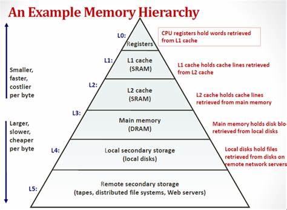{:width="100%"}

 See also [C], ...


## Chain-Of-Table

 

 More at:

  * paper - [https://arxiv.org/abs/2401.04398](https://arxiv.org/abs/2401.04398)
  * blog - [https://blog.research.google/2024/03/chain-of-table-evolving-tables-in.html](https://blog.research.google/2024/03/chain-of-table-evolving-tables-in.html)

 See also [C], [Chain-Of-Throught]


## Chain-Of-Thought (COT) Prompting

 ~ A [Prompt Engineering] technique

 A solution to get the explainability of a model OR RATHER ITS OUTPUT! Generating a chain of thought -- a series of intermediate reasoning steps -- significantly improves the ability of [large language models] to perform complex reasoning. In particular, we show how such reasoning abilities emerge naturally in sufficiently [large language models] via a simple method called chain-of-thought prompting, where a few chain-of-thought demonstrations are provided as exemplars in prompting. Experiments on three large language models show that chain-of-thought prompting improves performance on a range of arithmetic, commonsense, and symbolic reasoning tasks. The empirical gains can be striking. For instance, prompting a 540B-parameter language model with just eight chain of thought exemplars achieves state of the art accuracy on the [GSM8K benchmark] of math word problems, surpassing even fine-tuned [GPT-3] with a verifier.

 Variations:

  * Zero-shot COT
  * Few-shot COT
  * Automatic COT

 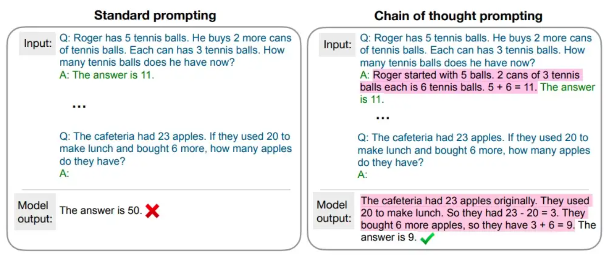{:width="100%"}

 

 More at:

  * variations - [https://www.promptingguide.ai/techniques/cot](https://www.promptingguide.ai/techniques/cot)
  * paper - [https://arxiv.org/abs/2201.11903](https://arxiv.org/abs/2201.11903)

 See also [C], [Chain-Of-Table], [Explanability]


## Chained Model

 Each model does one thing. e.g. verifier.

 See also [C], [Model]


## Character AI Company

 Talk to a famous person or character! You can also create your own!

 More at:

  * site - [https://beta.character.ai/](https://beta.character.ai/)
  * articles
    * Google investment - [https://www.reuters.com/technology/google-talks-invest-ai-startup-characterai-sources-2023-11-10/](https://www.reuters.com/technology/google-talks-invest-ai-startup-characterai-sources-2023-11-10/)

 See also [C], ...


## Characteristic Stability Index (CSI)

 When our model’s [Population Stability Index(PSI)][PSI] was in the “warning” zone between 0.1 a 0.2. We now need to understand which features may have caused the drift. Enter CSI.

 The Characteristic Stability Index (CSI) is used to evaluate the stability or drift of each feature so that we can find the problematic one. As PSI is concerned with the effects of the population drift on the model’s predictions, the CSI is concerned with understanding how the feature distributions have changed.

Using it is really simple: we just apply the same formula we used for PSI, but instead of binning the data by using the predicted variable, we use each feature to create the bins.


 More at:

  * articles
    * [https://towardsdatascience.com/checking-model-stability-and-population-shift-with-psi-and-csi-6d12af008783](https://towardsdatascience.com/checking-model-stability-and-population-shift-with-psi-and-csi-6d12af008783)
  * code - [https://github.com/vinyluis/Articles/tree/main/Model%20Stability](https://github.com/vinyluis/Articles/tree/main/Model%20Stability)

 See also [C], [Data Drift], [Model Stability], [Population Stability Index]


## Chatbot

 ~ A computer application that uses machine learning to have a conversation with a human.

 Can be a

  * [virtual assistant]

 See also [C], ...


## Chatbot Arena

 Chatbot Arena is new a tool that allows you to compare the output of over 25 LLMs directly from your browser. It supports a mix of closed and open-source LLMs, including well-known ones like OpenAI's [GPT-4Turbo] and [Mistral-8x7b].

 It also lets users vote on which one provides better responses, and, this is where the magic is. Behind-the-scenes, you're creating the most robust LLM benchmark, one based on user experience. It’s like a real-world test lab where your votes shape the leaderboards. Think of it as crowdsourcing – the more you interact and vote, the clearer the picture we get of which models really deliver.

 These votes feed into an [Elo rating system], which is the same method used in chess to rank player skill. Each model starts with a base score, and gains or loses points based on the user votes - a win against a higher-ranked model scores more points, while losing to a lower-ranked model costs more.

 This offers three big innovations:

  * It scales to many models without costly paired evaluations. The Elo system handles relative ranking even if models don't directly compete.
  * New models can be quickly measured with a handful of matches. No need to wait for statistical significance across multiple comparisons.
  * The leaderboard gives a clear view of state-of-the-art. As votes accumulate, model ratings converge.

 The rankings already reveal some trends. Closed models like [GPT-4] lead, but Mistral's [mixture-of-experts architecture] is closing the gap. And previous leaders like [LLaMA] now trail unexpectedly.

 Highlights

 * [OpenAI] remains the king of LLMs
 * [Claude] is second best performing closed model
 * Closed models still outperform open models (but the gap is closing)
 * [Mistral-8x7b] is the best open-source model right now
 * [Yi-34B] is flying under the radar
 
 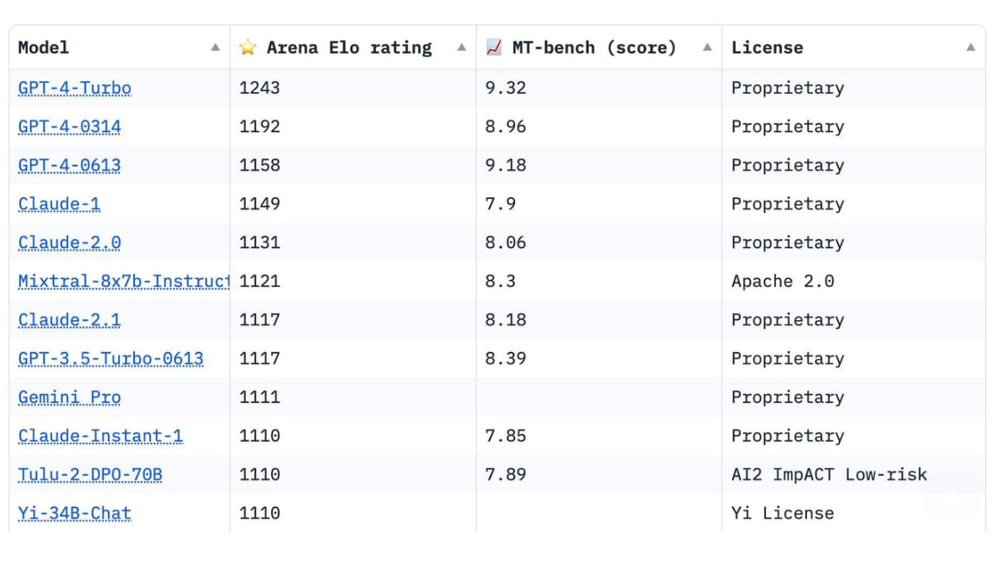{: width="100%"}

 

 More at:

  * [https://chat.lmsys.org/?arena](https://chat.lmsys.org/?arena)

 See also [C], [Multi-Turn Question Set Benchmark]


## ChatGPT Model

 A [GPT model] that has a state,  that is you can have a discussion/dialog with the device. This model is [fine-tuned with "supervised" interactions][Supervised Fine-Tuning] as was done with the [InstructGPT model], a precursor to ChatGPT. In recent weeks, the internet has been going crazy with the new ChatGPT model. In general, ChatGPT is part of a series of releases around [GPT 3.5][GPT Model] that are highlighting some of the capabilities of the upcoming [GPT-4 model][GPT Model]. One of the key differences of ChatGPT with previous models is its ability to follow instructions. This is powered another model called InstructGPT which OpenAI quietly unveiled at the beginning of the year.

 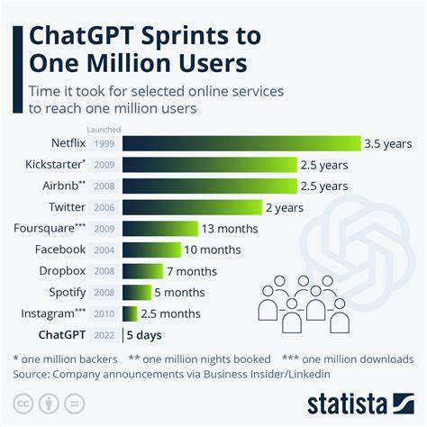{: width="100%"}

 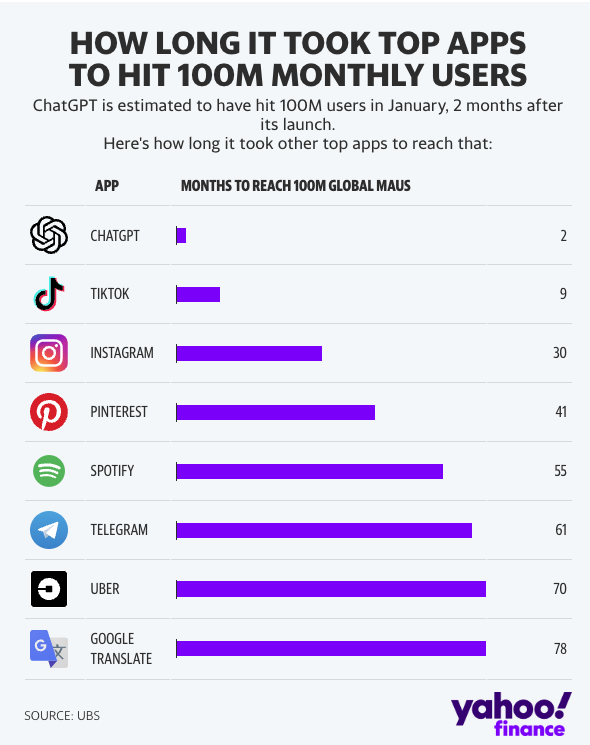{: width="100%"}

 {: width="100%"}

 

 

 More at:

  * training explained - [https://medium.com/mlearning-ai/a-new-ai-buzz-chatgpt-training-explained-cafd253ce442](https://medium.com/mlearning-ai/a-new-ai-buzz-chatgpt-training-explained-cafd253ce442)
  * adoption rate - [https://www.linkedin.com/pulse/chatgpts-100m-users-2-months-more-impressive-than-you-gilad-nass/](https://www.linkedin.com/pulse/chatgpts-100m-users-2-months-more-impressive-than-you-gilad-nass/)
  * gpt vs chatgpt vs instructgpt - [https://medium.com/@colin.fraser/chatgpt-automatic-expensive-bs-at-scale-a113692b13d5](https://medium.com/@colin.fraser/chatgpt-automatic-expensive-bs-at-scale-a113692b13d5)
  * prompt engineering - [https://www.promptingguide.ai/](https://www.promptingguide.ai/)
  * webgpt chrome extension - [https://twitter.com/DataChaz/status/1610556519531089921](https://twitter.com/DataChaz/status/1610556519531089921)
  * [https://www.cnn.com/2022/12/05/tech/chatgpt-trnd/index.html](https://www.cnn.com/2022/12/05/tech/chatgpt-trnd/index.html)
  * [https://medium.com/@colin.fraser/chatgpt-automatic-expensive-bs-at-scale-a113692b13d5](https://medium.com/@colin.fraser/chatgpt-automatic-expensive-bs-at-scale-a113692b13d5)
  * [https://www.technologyreview.com/2023/01/26/1067299/chatgpt-workout-plans/](https://www.technologyreview.com/2023/01/26/1067299/chatgpt-workout-plans/)
  * articles
    * 2024/10/03 - canvas introduction - [https://openai.com/index/introducing-canvas/](https://openai.com/index/introducing-canvas/)
    * 1 year anniversary - [https://aimagazine.com/machine-learning/chatgpts-first-birthday-a-year-in-review](https://aimagazine.com/machine-learning/chatgpts-first-birthday-a-year-in-review)
    * how was built - [https://www.technologyreview.com/2023/03/03/1069311/inside-story-oral-history-how-chatgpt-built-openai/](https://www.technologyreview.com/2023/03/03/1069311/inside-story-oral-history-how-chatgpt-built-openai/)
    * college essay is dead - [https://www.theatlantic.com/technology/archive/2022/12/chatgpt-ai-writing-college-student-essays/672371/](https://www.theatlantic.com/technology/archive/2022/12/chatgpt-ai-writing-college-student-essays/672371/)

 See also [C], [Chatbot], [Digital Watermark], [Feedback], [Plagiarism Checker], [Reward Model], [Reinforcement Learning], [Sparrow Model]


## ChatGPT Plugin

 Give external tools to [ChatGPT]

```
# CANVA
Create 2 social media posts that educate my target audience, females ages 30-40 located in Canada, on how wearing sustainable fashion in the winter is better for the environment. Make sure to include an image template, text to go on the image post and text for the caption.
```

```
# 2 linkReader + 1 Canva plugin calls
Links
* https://paloalto.midtown.ai/tracks/aws-deepracer-league
* https://aws.amazon.com/deepracer/
Create 2 social media posts that educate my target audience, male high-schoolers ages 15-18 located in Palo Alto, CA, on the best way to compete in the student AWS DeepRacer League is by joining the Midtown AI club. Make sure to include an image template, text to go on the image post and text for the caption.
```

 

 See also [C], ...


## Checkpointing

 See [Activation Checkpointing]


## Child Development Milestone

 Skills such as taking a first step, smiling for the first time, and waving “bye bye” are called developmental milestones. Children reach milestones in how they play, learn, speak, act, and move.

 More at:

  * [https://www.cdc.gov/ncbddd/actearly/milestones/index.html](https://www.cdc.gov/ncbddd/actearly/milestones/index.html)
  * [https://www.autonomousagents.stanford.edu/modeling-human-learning-and-develop](https://www.autonomousagents.stanford.edu/modeling-human-learning-and-develop)

 See also [C], ...
 

## Chinchilla Model

 An optimized model of [Goopher][Gopher Model]. Achieved the same performance with fewer parameters!

```
FLOPS   Params    Nb_of_tokens     ==> Performance
set       <search space>               set
```

 

 

 More at:

  * paper - [https://arxiv.org/abs/2203.15556](https://arxiv.org/abs/2203.15556)

 See also [C], ...


## Chinchilla Scaling Law

 

 See also [C], ...


## Chroma Database

 An in-memory [vector datatabase] ...

```python
import chromadb

client = chromadb.Client()

collection = client.create_collection("test")

collection.add(
    embeddings=[
        [1.1, 2.3, 3.2],
        [4.5, 6.9, 4.4],
        [1.1, 2.3, 3.2],
        [4.5, 6.9, 4.4],
        [1.1, 2.3, 3.2],
        [4.5, 6.9, 4.4],
        [1.1, 2.3, 3.2],
        [4.5, 6.9, 4.4],
    ],
    metadatas=[
        {"uri": "img1.png", "style": "style1"},
        {"uri": "img2.png", "style": "style2"},
        {"uri": "img3.png", "style": "style1"},
        {"uri": "img4.png", "style": "style1"},
        {"uri": "img5.png", "style": "style1"},
        {"uri": "img6.png", "style": "style1"},
        {"uri": "img7.png", "style": "style1"},
        {"uri": "img8.png", "style": "style1"},
    ],
    documents=["doc1", "doc2", "doc3", "doc4", "doc5", "doc6", "doc7", "doc8"],
    ids=["id1", "id2", "id3", "id4", "id5", "id6", "id7", "id8"],
)

query_result = collection.query(
        query_embeddings=[[1.1, 2.3, 3.2], [5.1, 4.3, 2.2]],
        n_results=2,
    )

print(query_result)
```
 when run, it outputs
```
{'ids': [['id1', 'id5'], ['id2', 'id4']], 'embeddings': None, 'documents': [['doc1', 'doc5'], ['doc2', 'doc4']], 'metadatas': [[{'uri': 'img1.png', 'style': 'style1'}, {'uri': 'img5.png', 'style': 'style1'}], [{'uri': 'img2.png', 'style': 'style2'}, {'uri': 'img4.png', 'style': 'style1'}]], 'distances': [[0.0, 0.0], [11.960000038146973, 11.960000038146973]]}
```

 More at:

  * home - [https://www.trychroma.com/](https://www.trychroma.com/)
  * docs - [https://docs.trychroma.com/getting-started](https://docs.trychroma.com/getting-started)
  * colab 
    * [https://colab.research.google.com/drive/1QEzFyqnoFxq7LUGyP1vzR4iLt9PpCDXv](https://colab.research.google.com/drive/1QEzFyqnoFxq7LUGyP1vzR4iLt9PpCDXv)
    * [https://github.com/hwchase17/chroma-langchain](https://github.com/hwchase17/chroma-langchain)
  * notebooks
    * [https://github.com/openai/openai-cookbook/tree/main/examples/vector_databases/chroma](https://github.com/openai/openai-cookbook/tree/main/examples/vector_databases/chroma)
  * Articles
    * [https://blog.langchain.dev/langchain-chroma/](https://blog.langchain.dev/langchain-chroma/)

 See also [C], ...


## CIDEr Score

 See also [C], [MSFT COCO Caption Dataset]


## CICERO Model

 A Model built by [Meta].

 Diplomacy is what AI researchers call a “seven player, zero sum and deterministic game of imperfect information”. A seven player game is much harder to solve than a two player game such as chess or Go. You must consider the many possible strategies of not one but six other players. This makes it much harder to write an AI to play the game. Diplomacy is also a game of imperfect information, because players make moves simultaneously. Unlike games such as chess or Go, where you know everything about your opponent’s moves, players in Diplomacy make moves not knowing what their opponents are about to do. They must therefore predict their opponents’ next actions. This also adds to the challenge of writing an AI to play it. Finally, Diplomacy is a zero sum game in which if you win, I lose. And the outcome is deterministic and not dependent on chance. Nonetheless, before victory or defeat, it still pays for players to form alliances and team up on each other. Indeed, one of the real challenges in playing the game is managing the informal negotiations with other players before making simultaneous moves. The main reason Cicero’s performance is a scientific breakthrough is that it can both play the game well, and also perform these informal negotiations. This combination of natural language processing and strategic reasoning is a first for any game-playing AI.

 More at:

   * site - [https://ai.facebook.com/research/cicero/](https://ai.facebook.com/research/cicero/)
   * [https://about.fb.com/news/2022/11/cicero-ai-that-can-collaborate-and-negotiate-with-you/](https://about.fb.com/news/2022/11/cicero-ai-that-can-collaborate-and-negotiate-with-you/)
   * [https://ai.facebook.com/blog/cicero-ai-negotiates-persuades-and-cooperates-with-people/](https://ai.facebook.com/blog/cicero-ai-negotiates-persuades-and-cooperates-with-people/)
   * science article (private) - [https://www.science.org/doi/10.1126/science.ade9097?fbclid=IwAR1is0uOvw8uSQaJjTNKeevCKanq3TnVsLiS2wY0RwHX3zreCuwqPHKTcVI](https://www.science.org/doi/10.1126/science.ade9097?fbclid=IwAR1is0uOvw8uSQaJjTNKeevCKanq3TnVsLiS2wY0RwHX3zreCuwqPHKTcVI)
   * science article (public) - [https://www.science.org/content/article/ai-learns-art-diplomacy-game?cookieSet=1](https://www.science.org/content/article/ai-learns-art-diplomacy-game?cookieSet=1)
   * request for proposal - [https://ai.facebook.com/research/request-for-proposal/towards-human-AI-cooperation/](https://ai.facebook.com/research/request-for-proposal/towards-human-AI-cooperation/)
   * gizmodo - [https://www.gizmodo.com.au/2022/11/an-ai-named-cicero-can-beat-humans-in-diplomacy-a-complex-alliance-building-game-thats-a-big-deal/](https://www.gizmodo.com.au/2022/11/an-ai-named-cicero-can-beat-humans-in-diplomacy-a-complex-alliance-building-game-thats-a-big-deal/)

 See also [C], ...


## CIFAR Dataset

 Datasets created by [Alex Krizhevsky] for the [AlexNet Model]

 Datasets
  * CIFAR-10 = 10 different categories
  * CIFAR-100i = 100 different categories

 The CIFAR-10 dataset (Canadian Institute For Advanced Research) is a collection of images that are commonly used to train machine learning and computer vision algorithms. It is one of the most widely used datasets for machine learning research. The CIFAR-10 dataset contains 60,000 32x32 color images in 10 different classes/categories. The 10 different classes represent airplanes, cars, birds, cats, deer, dogs, frogs, horses, ships, and trucks. There are 6,000 images of each class. Computer algorithms for recognizing objects in photos often learn by example. CIFAR-10 is a set of images that can be used to teach a computer how to recognize objects. Since the images in CIFAR-10 are low-resolution (32x32), this dataset can allow researchers to quickly try different algorithms to see what works. CIFAR-10 is a labeled subset of the 80 million tiny images dataset. When the dataset was created, students were paid to label all of the images.

 {: width="100%"}

 More at 

   * [https://www.geeksforgeeks.org/cifar-10-image-classification-in-tensorflow/](https://www.geeksforgeeks.org/cifar-10-image-classification-in-tensorflow/)
   * [https://maet3608.github.io/nuts-ml/tutorial/cifar10_example.html](https://maet3608.github.io/nuts-ml/tutorial/cifar10_example.html)
   * CIFAR 10 - [https://knowyourdata-tfds.withgoogle.com/dataset=cifar10](https://knowyourdata-tfds.withgoogle.com/dataset=cifar10)
   * CIFAR 100 - [https://knowyourdata-tfds.withgoogle.com/dataset=cifar100](https://knowyourdata-tfds.withgoogle.com/dataset=cifar100)

 See also [C], [Dataset]


## Classical AI

 See [Symbolic AI]


## Classification Task

 A type of supervised learning algorithm. The goal in classification is to take input values and organize them into two or more categories. The categories are normally mutually exclusive (ex is this shape a circle, a rectangle or a triangle? Beware of 3-d shape projections, i.e. perspectives!). An example classification use case is fraud detection. In fraud detection, the goal is to take information about the transaction and use it to determine if the transaction is either fraudulent or not fraudulent. When XGBoost is given a dataset of past transactions and whether or not they were fraudulent, it can learn a function that maps input transaction data to the probability that transaction was fraudulent.

 Classification Types:

  * [Binary Classifier]
  * [Multiclass Classifier]
  * [Multilabel Classifier]

 Classification algorithms:
  * Supervised
    * [Learning Vector Quantization (LVQ)][LVQ]
  * Unsupervised
    * [K-Means Clustering]
    * [LVQ Algorithm]
  * Semi-supervised
    * [K-Nearest Neighbors (KNN)][KNN]
  * Others
    * [Decision tree]
    * [Logistic regression]
    * [Support Vector Machine (SVM)][SVM] - [boundary zone] is an [hyperplane]
    * [Random Forest]
    * [Boosted Trees] with [XGBoost] or [LightGBM]
    * [Naive Bayes Classifier]
      * [Gaussian Naive Bayes Classifier]
      * [Multinomial Naive Bayes Classifier]

 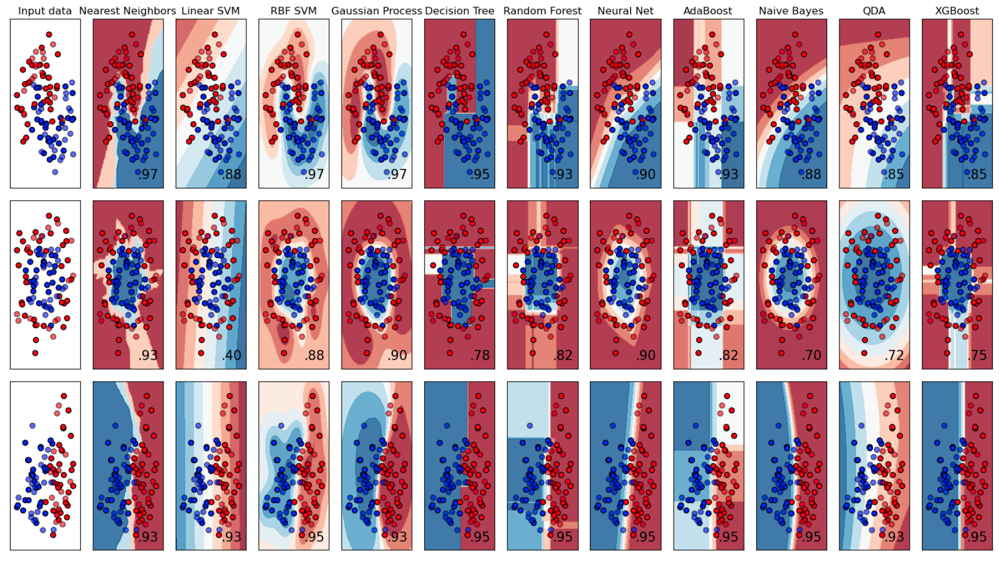{: width="100%"}

 See also [C], [Binary Classification], [Multiclass Classification], [Supervised Learning]


## Classification Report

 ~ a report as informative as the [confusion matrix] !

 includes:

  * [precision]
  * [recall]
  * [F1 score]
  * ...

 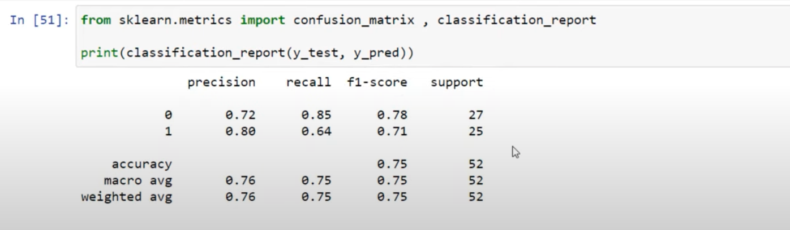{: width="100%"}

 See also [C], ...


## Claude Model

 An [LLM] built by [Anthropic] that uses a [constitutional AI]

 

 

 

 

 

 More at:

  * cost estimate - [https://orenleung.com/anthropic-claude-next-cost](https://orenleung.com/anthropic-claude-next-cost)
  * UI - [https://console.anthropic.com/chat/a38ac87b-b229-455a-b742-58b4639cf995](https://console.anthropic.com/chat/a38ac87b-b229-455a-b742-58b4639cf995)
  * papers 
    * claude 3 model card - 

  * articles
    * claude 3
      * video summarization - [https://github.com/hundredblocks/transcription_demo](https://github.com/hundredblocks/transcription_demo)
    * claude 2
      * annoucement - [https://www.vox.com/future-perfect/23794855/anthropic-ai-openai-claude-2](https://www.vox.com/future-perfect/23794855/anthropic-ai-openai-claude-2)
    * constitutional AI
      * [https://www.computerworld.com/article/3707410/amazon-set-to-invest-4b-in-constitutional-ai-advocate-anthropic.html](https://www.computerworld.com/article/3707410/amazon-set-to-invest-4b-in-constitutional-ai-advocate-anthropic.html)

 See also [C], ...


## Clever Hans Effect

 The Clever Hans effect refers to an incident in the early 1900s involving a horse named Hans that appeared to have remarkable mathematical abilities. Here are some key points about the Clever Hans effect:

  * Hans was a horse owned by Wilhelm von Osten, a German mathematics teacher. Von Osten claimed Hans could solve math problems, tell time, read, spell, and understand German.
  * Hans would tap his hoof to answer questions. For example, when asked to add 3 + 2, he would tap his hoof 5 times.
  * Hans became a sensation in Germany, attracting crowds who marveled at his intelligence. However, after investigation, it was determined his abilities were an unintentional trick.
  * The Clever Hans effect refers to an instance where it appears an animal (or person) has capabilities beyond expectations, but in reality is inadvertently receiving subtle cues from questioners that guide their behavior.
  * With Hans, it was determined people were unintentionally cuing the horse by slightly leaning forward, making facial expressions, or tensing muscles when Hans reached the correct number of taps. This provided Hans the signal to stop tapping.
  * The Clever Hans effect illustrates how easy it is for people to inadvertently guide behaviors through subtle, unconscious cues. It demonstrates the need for proper experimental controls when evaluating extraordinary claims of animal or human intelligence.

 So in summary, the Clever Hans effect refers to situations where it appears an animal or person has remarkable abilities, but in reality is just responding to subtle behavioral cues from others. It's a fascinating case that revealed the need for scientific rigor in evaluating claims of high intelligence.

 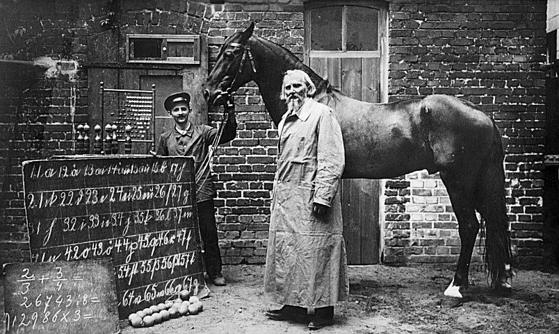{: width="100%"}

 More at:

  * [https://en.wikipedia.org/wiki/Clever_Hans](https://en.wikipedia.org/wiki/Clever_Hans)

 See also [C], ...


## CLIP Image Encoder

 Encode an image into the embedding space.

 See also [C], [CLIP Model], [Embedding Space], [Encoder]


## CLIP Text Encoder

 Encode a text prompt into the embedding space.

 See also [C], [CLIP Model], [Embedding Space], [Encoder]


## Clipping

 ~ Used to keep values within a range.

 It works as follow:

  * If the value is too high, it is replaced by the max clipping value.
  * If the value is too low, it is replace by the min clipping value.
  * If the value is within the clipping range, the value is not changed.

 Clipping is required in algorithms that use momentum/impulse.

 Used in algorithm such as:

  * [Proximal Policy Optimization (PPO)][PPO]
  * ...

 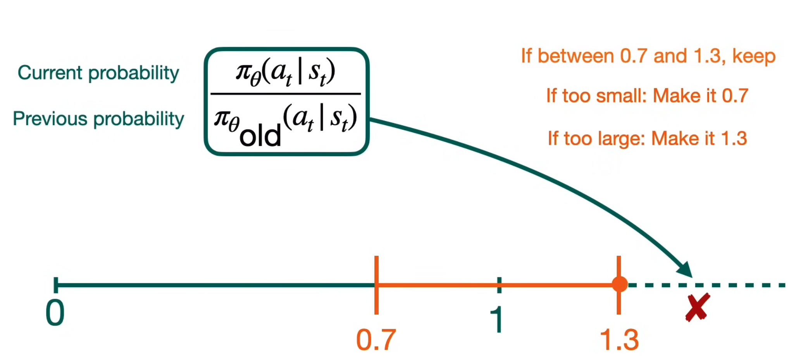{: width="100%"}

 See also [C], ...


## Clustering

 Ex: Clustering is also used by internet radio services; given a collection of songs, a clustering algorithm might be able to group the songs according to their genres. Using different similarity measures, the same clustering algorithm might group the songs by their keys, or by the instruments they contain. ==> [Classification]

 Algorithms:

  * [Learning Vector Quantization (LVQ)][LVQ] - (un)Supervised?
  * [K-Means Clustering] - Semi-supervised

 See also [C], [Initialization], [Unsupervised Learning]


## CM3leon Model

 ~ text to image by [Meta]

 More at:

  * paper - [https://ai.meta.com/research/publications/scaling-autoregressive-multi-modal-models-pretraining-and-instruction-tuning/](https://ai.meta.com/research/publications/scaling-autoregressive-multi-modal-models-pretraining-and-instruction-tuning/)
  * announcement - [https://ai.meta.com/blog/generative-ai-text-images-cm3leon/](https://ai.meta.com/blog/generative-ai-text-images-cm3leon/)

 See also [C], ...


## CNTK

 CNTK is ...

 See also [C], ...


## Code Synthesis

 Generation of code by machines

 See also [C], ...


## Codex Model

 A model built by [OpenAI]

 See also [C], ...


## Cognitron

 See also [C], [Neocognitron]


## Cognosys AI Company

 Build a UI for their task-driven autonomous agent

 More at:

  * home - [https://www.cognosys.ai/](https://www.cognosys.ai/)
  * blog - [https://www.cognosys.ai/blog](https://www.cognosys.ai/blog)

 See also [C], ...


## Cohen's Kappa Metric

 is excellent for measuring agreement between the validator and human judgments, especially for subjective tasks. It accounts for the possibility of agreement by chance, providing a more robust measure than simple agreement percentages.

 More at:

  * articles
    * [https://www.galileo.ai/blog/best-practices-for-creating-your-llm-as-a-judge](https://www.galileo.ai/blog/best-practices-for-creating-your-llm-as-a-judge)

 See also [C], ...


## Cohere AI Company

 Cohere (stylized as co:here) is a Canadian startup that provides [Natural Language Processing (NLP)] models that help companies improve human-machine interactions. Cohere was founded in 2019 by Aidan Gomez, Ivan Zhang, and Nick Frosst.

 More at:

  * [https://cohere.ai/](https://cohere.ai/)

 See also [C], [Company]


## Collaborative Filtering

 Used for recommendation of song/movies/etc where people mark what they like. If a person A has the same tastes as another person B, then what person B likes will be recommended to person A.

 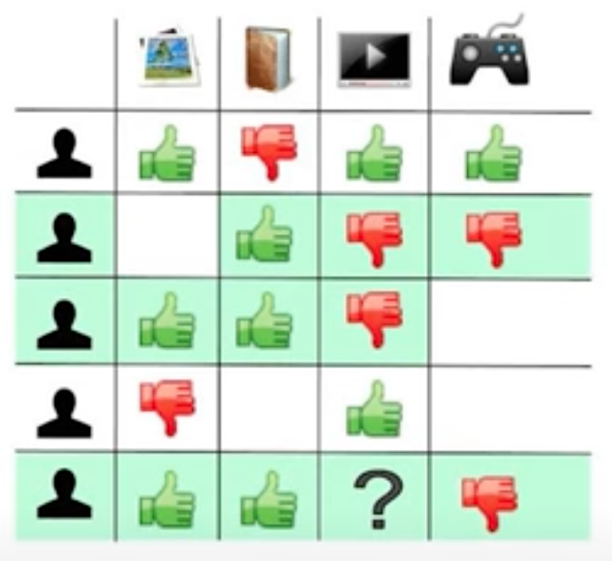{: width="100%"}

 The problem with this approach is that if a new song/movie is made available, it cannot be recommended! ( = Cold start problem )

 See also[C], ...


## Colossal Clean Crawled Corpus (C4)

 To accurately measure the effect of scaling up the amount of pre-training, one needs a dataset that is not only high quality and diverse, but also massive. Existing pre-training datasets don’t meet all three of these criteria — for example, text from Wikipedia is high quality, but uniform in style and relatively small for our purposes, while the [Common Crawl] web scrapes are enormous and highly diverse, but fairly low quality.

 To satisfy these requirements, we developed the Colossal Clean Crawled Corpus (C4), a cleaned version of [Common Crawl] that is two orders of magnitude larger than Wikipedia. Our cleaning process involved deduplication, discarding incomplete sentences, and removing offensive or noisy content. This filtering led to better results on downstream tasks, while the additional size allowed the model size to increase without overfitting during pre-training. 

 More at:

  * [https://www.tensorflow.org/datasets/catalog/c4](https://www.tensorflow.org/datasets/catalog/c4)

 See also [C], [Corpus], [Dataset], [T5 Model]


## Common Crawl Corpus

 Common Crawl is a 501(c)(3) non–profit founded in 2007.
 The Common Crawl corpus contains petabytes of data, regularly collected since 2008.

 Common Crawl data is stored on Amazon Web Services’ Public Data Sets and on multiple academic cloud platforms across the world.

 * Web Archive (WARC) - the ultimate data source
 * Metadata (WAT) - contains just the metadata from each page, the request info, things from head of HTML, and links from the webpage
 * web Text (WET) - contains just the webpage title, and plain text extracted from the HTML of each response.

 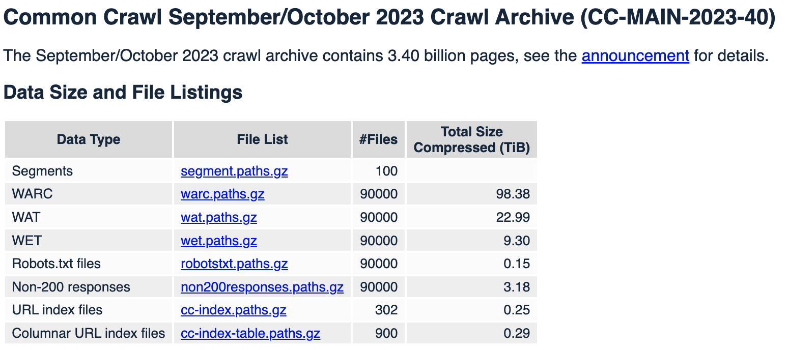{: width="100%"}
 
 More at:

  * site - [https://commoncrawl.org/](https://commoncrawl.org/)
  * blog - [https://commoncrawl.org/blog](https://commoncrawl.org/blog)
  * ARC format - [https://archive.org/web/researcher/ArcFileFormat.php](https://archive.org/web/researcher/ArcFileFormat.php)
  * articles
    * [https://skeptric.com/text-meta-data-commoncrawl/](https://skeptric.com/text-meta-data-commoncrawl/)

 See also [C], ...


## Common Sense

 * Theory of Mind
 * Social common sense 
 * Physical common sense
 * Visual common sense
 * Norms and morals

 More at:

  * [https://bdtechtalks.com/2022/08/08/machines-like-us-review/](https://bdtechtalks.com/2022/08/08/machines-like-us-review/)
  * TED talk - [https://www.ted.com/talks/yejin_choi_why_ai_is_incredibly_smart_and_shockingly_stupid](https://www.ted.com/talks/yejin_choi_why_ai_is_incredibly_smart_and_shockingly_stupid)

 See also [C], [Cyc Expert System]


## Company

 Example of companies are:

  * [Abnormal Security](https://abnormalsecurity.com/) - Email cyberattack detection ([Forbes](https://www.forbes.com/companies/abnormal-security/?sh=4c992843536a))
  * [Adept AI] - AI model developer. Focus on [AGI] through automation of tasks on desktops ([Forbes](https://www.forbes.com/companies/adept/?list=ai50&sh=7eb9ebdf4ebb))
  * [Adobe] - Offer a midjourey alternative called [Firefly]
  * [AlphaSense](https://www.alpha-sense.com/) - Focus on market intelligence search ([Forbes](https://www.forbes.com/companies/alphasense/?list=ai50&sh=298a91255f19))
  * [Alibaba] - A copycat of Amazon but in China
  * [Amazon] - Focus on public cloud and partnership with 3rd parties
  * [Anduril Industries](https://www.anduril.com/) - Focus on defense software with AI ([Forbes](https://www.forbes.com/companies/anduril-industries/?list=ai50&sh=3edae6e7e083))
  * [Anyscale] - Compute engine Buildup on the [Ray Framework]
  * [Apple] - Large company in the world, strangely not so influential in the AI industry. At least not yet!
  * [Arize](https://arize.com/) - Focus on data issue detection ([Forbes](https://www.forbes.com/companies/arize-ai/?list=ai50&sh=72ba67871f36))
  * [Baidu] - Chinese search engine
  * [Bayesian Health](https://www.bayesianhealth.com/) - Focus on patient risk detection ([Forbes](https://www.forbes.com/companies/bayesian-health/?list=ai50&sh=257bfdaa13ac))
  * [BHuman] - Focus on creating deepfake of yourself!
  * [Canvas](https://www.canvas.build/) - Focus on construction robots
  * [Character AI] - Chatbot with a persona
  * [Clari](https://www.clari.com/) - Focus on sales software
  * [Coactive AI](https://coactive.ai/) - Data labelling software
  * [Cognosys AI] - Task driven autonomous agent, similar to [AutoGPT][AutoGPT Model]
  * [Cohere AI] - Focus on NLP applications
  * [Copy AI] - 
    * valentine AI - [https://www.valentinesday.ai/](https://www.valentinesday.ai/)
  * [Databricks](https://www.databricks.com/) - Data storage and analytics
  * [Descript](https://www.descript.com/) - Video and podcast editing
  * [Eightfold AI](https://eightfold.ai/) - Recruiting software
  * [ElevenLabs AI] - Focus on Text-to-speech rendition
  * [FarmWise Labs](https://farmwise.io/home) - Weeding tractors for farming
  * [Fermat](https://www.youtube.com/@fermat_ws/videos): Collaboration canvas with AI
  * [Futuri Media] - Content selection for media, such as tv and radio. Includes [RadioGPT]!
  * [GitHub] - Code repositories with advanced features including  AI pair programming with Codex
  * [Glean](https://glean.co/) - Internal workplace search
  * [Gong](https://www.gong.io/) - Sales software
  * [Got It AI](https://www.app.got-it.ai/) - ELMAR LLM for the enterprise with truth checker!
  * [Gretel AI](https://gretel.ai/) - 
  * [Harvey](ihttps://techcrunch.com/2022/11/23/harvey-which-uses-ai-to-answer-legal-questions-lands-cash-from-openai/) - Digital assistant for lawyers
  * [Hugging Face] - Open-source AI library, a model hub, with datasets, and space/UI with [Gradio]
  * [Inflection AI] - A chatbot that listens and talks
  * [Insitro](https://www.insitro.com/) - Drug discovery
  * [Ironclad](https://ironcladapp.com/) - Legal contract management
  * [Jasper](https://www.jasper.ai/) - Copywriting software
  * [Kasisto](https://kasisto.com) - Build an [intelligent digital assistant] for finance projects
  * [Kumo AI] - Pytorch Geometric
  * [Microsoft] - One of the largest company in the world, leading changes with AI 
  * [Midjourney AI](https://www.midjourney.com/) - AI image generator
  * [MosaicML](https://www.mosaicml.com/) - AI model training tools
  * [Moveworks](https://www.moveworks.com/) - Automated IT support
  * [Neeva](https://neeva.com/) - Personalized search engine
  * [Neptune AI] -
  * [Neuralink] - A company lead by [Elon Musk] that is focusing on human [Brain] Machine Interfaces
  * [Pachama](https://pachama.com/) - Forestry satellite data analysis
  * [PathAI](https://www.pathai.com/) - Drug discovery and diagnosis
  * [PolyAI](https://poly.ai/) - Voice chatbots
  * [Quora] - A static Q&A internet site that is not offering an interface to chatbots though its interface, poe.
  * [Replicate] - Run and fine-tune open-source models. Deploy custom models at scale. All with one line of code.
  * [Replika](https://replika.com/) - Build AI companion who cares!
  * [RevComm](https://www.revcomm.co.jp/) - Voice analysis software ([Forbes](https://www.forbes.com/companies/revcomm/?sh=6c1080a7340c))
  * [Runway] - Focus on generative AI for images and now videos
  * [Sakana AI](https://sakana.ai/) - Foundation model based on nature-inspired intelligence !?!?
  * [Seamless AI](https://seamless.ai/) - To get sales leads
  * [Scale AI] - Data labeling provider
  * [Shield AI](https://shield.ai/) - Autonomous defense software
  * [Sima AI](https://sima.ai/) - AI at the edge (MLSoc)
  * [Slingshot Aerospace](https://slingshotaerospace.com/) - Space simulation software
  * [Snorkel AI](https://snorkel.ai/) - Data labeling software
  * [Supertranslate AI] - Focus on generating proper subtitles to videos
  * [Synthesia] - Focus on AI avatars
  * [Trigo](https://www.trigoretail.com/) - Cashierless retail checkout
  * [Turnitin](https://www.turnitin.com/) - AI writing detector
  * [Vannevar Labs](https://www.vannevarlabs.com/) - Defense intelligence software
  * [Vectra AI](https://www.vectra.ai/) - Cyberattack detection
  * [VIZ.AI](https://www.viz.ai/) - Disease detection
  * [Waabi](https://waabi.ai/) - Autonomous trucking technology
  * [Weights & Biases] - Developer tools for AI + MLOps and LLMOps
  * [Writer](https://writer.com/) - Copywriting software

 Deployment:

  * [Cursor](https://www.cursor.com/) - Looks like a VScode fork!
  * [Bolt](https://bolt.new/) -
  * [Netlify] -
  * [Replit] -
  * [V0](https://v0.dev/) -
  * [WebSim] -

 Digital Humans and Meta-Humans:

  * [Ravatar](https://ravatar.com/)
  * [SoulMachines](https://www.soulmachines.com/)
  * [UneeQ](https://www.digitalhumans.com/)
  * [Unreal Engine](https://www.unrealengine.com/en-US/metahuman)

 Driverless cars / Robotaxi:

  * Google's [Waymo]
  * others: 
    * [WeRide](https://www.weride.ai/en)
    * [Momenta](https://www.momenta.cn/en/)
    * [Didi](https://web.didiglobal.com/)
    * [Pony AI](https://pony.ai)
  * defunct: 
    * Volkswagen [Argo AI](https://en.wikipedia.org/wiki/Argo_AI)
    * Ford's [Cruise](https://en.wikipedia.org/wiki/Cruise_(autonomous_vehicle))

 Drug Discovery:

  * [BigHat Biosciences](https://www.bighatbio.com/) - Better biologics faster through ML-guided design
  * [Isomorphic Labs] - Spin off from [DeepMind] and building on [AlphaFold]
  * [Unlearn.AI](https://www.unlearn.ai/) - Clinical trial forecasting

 Education:

  * [Chegg](https://www.chegg.com) - AI assistant called [CheegMate](https://www.chegg.com/cheggmate)
  * [Duolingo](https://www.duolingo.com) - Learn a language with role play with [Duolingo Max](https://blog.duolingo.com/duolingo-max/)
  * [Khan Academy](https://www.khanacademy.org) - AI assistant called [Khanmigo](https://www.khanacademy.org/khan-labs)
  * [Kuros AI](https://www.kyros.ai/) - College prep
    * strategy planning + personal qualities + academic fitness/alignment + communication and organization + ExtraCurricular activities fitness/alignment + Applications
  * [Magic School AI](https://app.magicschool.ai/) - help teachers create a lesson plan. Assistant is called Raina
  * [Pearson](https://www.pearson.com/en-us.html) - No bot yet! Still in denial?

 Evaluation:

  * [Deepchecks] - SaaS platform for RAG metrics and penetration testing

 Foundation Model:

  * [Anthropic] - Focus on LLM, building an alternative to [GPT models][GPT Model] ([Forbes](https://www.forbes.com/companies/anthropic/?list=ai50&sh=2cdb4d2fb94e))
  * [DeepMind] - Focus on AI applications in science
  * [Google] - Known for its search engine and ad-placement business model. Challenged by Microsoft
  * [Meta] - Formerly known as Facebook with a strong focus on the multiverse and more recently on AI
  * [OpenAI] - Focus on democratizing AI. Known for releasing [ChatGPT]
  * [Stability AI] - Focus on [diffusion model] or image generation, adopted the open-source philosophy
  * [xAI] - Backed by Elon Musk and builder of [Grok] LLM and [PromptIDE]

 Hardware:

  * [AMD] - Another supplier of [GPUs]
  * [Cortical Labs] - Use biological [neurons] to use as AI 
  * [Intel] - Build CPUs and now includes tensor processing in them
  * [Koniku](https://koniku.com/) - Use biological [neurons] to compete with regular computers
  * [Nvidia] - The leading supplier of [GPU]

 Human-Machine Interface:

  * [Open Interpreter] - voice interface to your home computer
  * [Humane] - The AI pin likely to replace the cell phone? Works as a microphone?
  * [Rabbit] - With the R1 device

 Industry research:

  * [Evident Insights] - currently focused on the banking industry

 Inference Accelerator:

  * [Cerebras](https://cerebras.ai/) - 20x faster than NVIDIA GPU or 450 TK/S
  * [Groq] - Superfast LLM inference because baked by custom hardware? or 250 TK/S
  * [Together AI](https://www.together.ai/) -

 AI Cloud Services:

  * Cloud AI Security
    * [Sysdig](https://sysdig.com/) - Augment defense with a team of AI experts. Accelerate response with a conversation.
    * [Wiz](https://www.wiz.io/) - WizCode, WizCloud, WizDefend 
  * Cloud GPUs
    * [CoreWave](https://www.coreweave.com/) - Kubernetes native cloud that’s purpose-built for large scale, GPU-accelerated workloads.
    * [Curoe](https://www.crusoe.ai/) - Reliable high-performance GPUs, CPUs, networking, and storage for AI exploration, model training and scalable-inference.
    * [Lambda Labs](https://lambdalabs.com/) - access to GPU for deeplearning

 Music:

  * [Audialab](https://audialab.com/) - drum sound only
  * [Aiva AI](https://www.aiva.ai/) -
  * [Boomy](https://boomy.com/) -
  * [Harmonai](https://www.harmonai.org/) -
  * [LoudMe AI](https://loudme.ai/ai-music-generator) -
  * [MelodyStudio](https://melodystudio.net) -
  * [Mubert](https://mubert.com/) -
  * [Suno AI] - generate music for your lyrics!
  * [TuneFlow](https://www.tuneflow.com/) 
  * [Udio](https://www.udio.com/) - An alternative to [Suno AI]

 Powerpoint:

  * [Beautiful AI](https://www.beautiful.ai/) -
  * [Gammas](https://gamma.app/) - 
  * [Tome](https://tomw.app) -

 Robotics:

  * [Boston Dynamics] - Focus on robotics
  * [Covariant AI] - Created the [Robotics Foundation Model]
  * [Engineered Arts] - Focus on social robots, such as [Ameca][Ameca Robot]
  * [Figure AI] - Focus on creating [humanoids] such as [Figure-01]
  * [Hanson Robotics] - Build humanoid for consumer, entertainment, service, healthcare, and research applications. 
  * [Softbank Robotics] - Focus on [social robots][Social Robot]
  * [Trossen Robotics] - Build research robots

 Search:

  * [AndiSearch](https://andisearch.com/) -
  * [Exa AI](https://exa.ai/) - search through a UI or API
  * [Perplexity AI]
  * [You](https://www.you.com)

 Security:

  * [Lakera](https://www.lakera.ai/) - filter the output

 Synthetic data:

  * [Datagen](https://datagen.tech/) - Synthetic data for faces/images
  * [Mostly AI](https://mostly.ai/) - Generative AI for tabular data 
  * [Synthetic Users] - Use AI users and study the deviation!

 Text-To-Speech:

  * [PlayHT] - Convert words to audio/voice

 Vector Databases:

  * [Chroma] - in memory database (good for development!)
  * [Milvus] - project supported by the [LFAI&Data]
  * [Pinecone] - building the [Pinecone Database]

 Video:

  * [Wonder Dynamics] - VFX in a single click!

 World model:

  * [World Lab] - RL on Environments + NeRF

 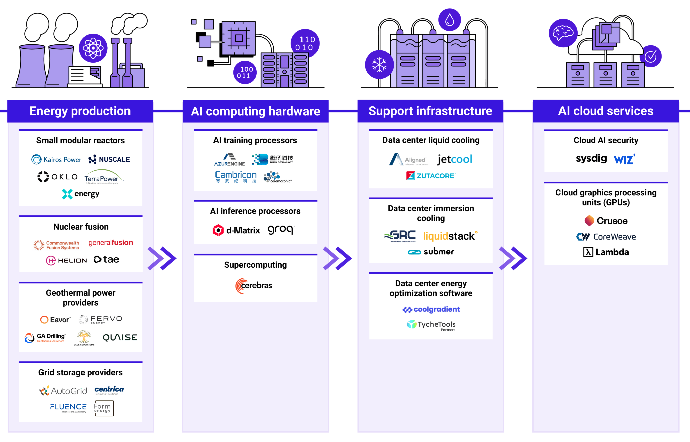{: width="100%"}


 

 

 More at:

  * CBInsights
    * startups of 2022 - [https://www.cbinsights.com/research/report/artificial-intelligence-top-startups-2022/](https://www.cbinsights.com/research/report/artificial-intelligence-top-startups-2022/)
  * ML, AI, Data (MAD)
    * interactive - [https://mad.firstmark.com/](https://mad.firstmark.com/)
    * 2023 blog post - [https://mattturck.com/mad2023/](https://mattturck.com/mad2023/)
    * 2021 blog post - [https://mattturck.com/mad2021/](https://mattturck.com/mad2021/)
  * Forbes AI top 50:
    * 2023 
      * [https://www.forbes.com/lists/ai50/?sh=1f9472b1290f](https://www.forbes.com/lists/ai50/?sh=1f9472b1290f)
      * [https://www.forbes.com/sites/kenrickcai/2023/04/11/ai-50-2023-methodology-judges/?sh=5b1ec13b4f73](https://www.forbes.com/sites/kenrickcai/2023/04/11/ai-50-2023-methodology-judges/?sh=5b1ec13b4f73)
    * 2022 - [https://www.forbes.com/sites/helenpopkin/2022/05/06/ai-50-2022-north-americas-top-ai-companies-shaping-the-future/?sh=63dcbbdc34b5](https://www.forbes.com/sites/helenpopkin/2022/05/06/ai-50-2022-north-americas-top-ai-companies-shaping-the-future/?sh=63dcbbdc34b5) 
    * 2021 - [https://www.forbes.com/sites/alanohnsman/2021/04/26/ai-50-americas-most-promising-artificial-intelligence-companies/?sh=12d718d177cf](https://www.forbes.com/sites/alanohnsman/2021/04/26/ai-50-americas-most-promising-artificial-intelligence-companies/?sh=12d718d177cf)
  * CNBC disruptor 50:
    * 2023 - [https://www.cnbc.com/2023/05/09/these-are-the-2023-cnbc-disruptor-50-companies.html](https://www.cnbc.com/2023/05/09/these-are-the-2023-cnbc-disruptor-50-companies.html)
    * 2022 - [https://www.cnbc.com/disruptor-50-2022/](https://www.cnbc.com/disruptor-50-2022/)
    * 2021 - [https://www.cnbc.com/disruptor-50-2021/](https://www.cnbc.com/disruptor-50-2021/)

 See also [C], ...


## COMPAS Model

 One of several different "risk assessment" tools used in the US criminal legal system.

 More at:

  * [https://www.technologyreview.com/2019/10/17/75285/ai-fairer-than-judge-criminal-risk-assessment-algorithm/](https://www.technologyreview.com/2019/10/17/75285/ai-fairer-than-judge-criminal-risk-assessment-algorithm/)

 See also [C], ...


## Complexity

 Complexity (of a model) is

  * Attention-based model: for input sequence of length N, each layer's output is NxN (all to all comparison) and therefore each layer is o(N^2) for sequence of length N

 See also [C], [Hyperparameter], [Attention-Based Model]


## Complexity Ceiling

 The concept of a "complexity ceiling" in [expert systems] refers to the practical limits on the complexity and scale of knowledge that can be effectively represented and utilized within these systems. This limitation arises from several factors:

 1. Knowledge acquisition bottleneck: As the domain becomes more complex, it becomes increasingly difficult and time-consuming to gather, formalize, and encode all the relevant expert knowledge.
 2. [Rule interaction]: In large rule-based systems, the interactions between rules can become extremely complex and difficult to manage, leading to unexpected behaviors or conflicts.
 3. Maintenance challenges: As the knowledge base grows, maintaining and updating the system becomes progressively more difficult and error-prone.
 4. Performance issues: Very large knowledge bases can lead to decreased system performance, as the inference engine must search through a vast number of rules and facts.
 5. Brittleness: Expert systems often struggle with handling situations outside their specific domain of expertise, becoming less reliable as the problem space expands.
 6. Lack of common sense reasoning: Traditional expert systems typically lack the ability to reason about general knowledge and common sense, which limits their adaptability to new or unusual situations.

 These limitations often mean that expert systems are most effective when applied to well-defined, narrow domains rather than broad, open-ended problem spaces. More recent approaches in AI, such as machine learning and deep learning, have been developed in part to address some of these limitations.

 See also [C], [Cyc Export System]


## Compliance

 [Regulatory landscape] refers to the complete framework of laws, rules, and regulations that govern an industry or business activity. This includes:

  * All applicable laws and regulations
  * Government agencies and regulatory bodies
  * Current and upcoming regulatory requirements
  * Policy directions and regulatory trends

 Compliance focuses specifically on what organizations need to do to meet those regulatory requirements, including:

  * Internal policies and procedures
  * Systems and controls needed for adherence
  * Monitoring and reporting mechanisms
  * Staff training and awareness programs
  * Documentation requirements

 Think of it this way: The regulatory landscape is "what the rules are," while the compliance is "how organizations follow those rules."

 See also [C], ...


## Compliance Analysis

 This is ...

 See also [C], ...


## Compound AI System

 We define a Compound AI System as a system that tackles AI tasks using multiple interacting components, including multiple calls to models, retrievers, or external tools. In contrast, an AI Model is simply a statistical model, e.g., a Transformer that predicts the next token in text.

 More at:

  * [https://bair.berkeley.edu/blog/2024/02/18/compound-ai-systems/](https://bair.berkeley.edu/blog/2024/02/18/compound-ai-systems/)

 See also [C], [Retrieval Augmented Generation System]


## Compute Efficient Frontier

 One of the 3 [Neural Scaling Law]

 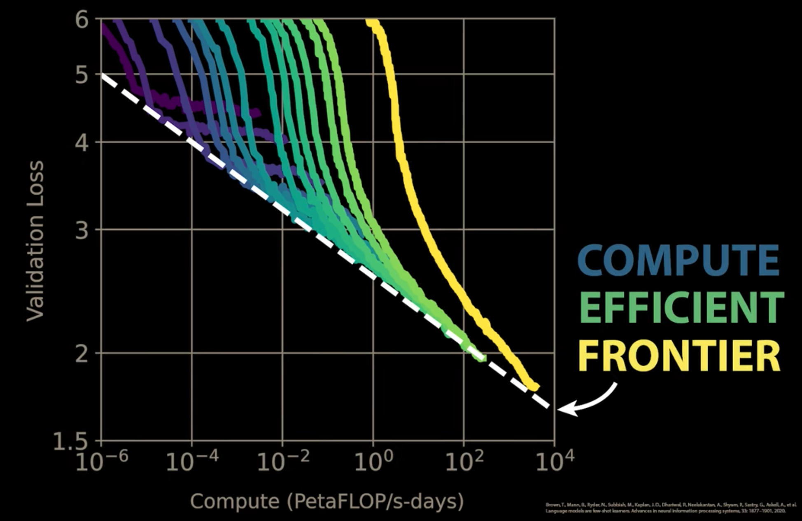{: width="100%"}

 See also [C], ...


## Computer Vision (CV)

 * [Object Detection]
 * [Object Recognition]
 * [Object Tracking]
 
 See also [C], [Convolutional Neural Network], [OpenCV Library], [ResNET Model]


## Computer Vision and Pattern Recognition (CVPR) Conference

 An [AI conference] related to [computer vision] and [pattern recognition]

 More at:

  * twitter - [https://twitter.com/cvpr/](https://twitter.com/cvpr/)
  * [https://cvpr2023.thecvf.com/](https://cvpr2023.thecvf.com/)
  * [https://cvpr2022.thecvf.com/](https://cvpr2022.thecvf.com/)
  * [https://cvpr2021.thecvf.com/](https://cvpr2021.thecvf.com/)

 See also [C], ...


## Concept Video

 Here is an example of concept video of a Knoledge Navigator that later became the [Siri Virtual Assistant]

 

 

 More at:

  * [https://en.wikipedia.org/wiki/Knowledge_Navigator](https://en.wikipedia.org/wiki/Knowledge_Navigator)

 See also [C], ...


## Concurrency

 Concurrency in the context of indexing refers to the ability of a database management system to handle multiple transactions simultaneouslyy without causing data inconsistency or corruption. In other words, it ensures that data remains consistent and accurate even when multiple users are accessing it at the same time.

 See also [C], ...


## Conda CLI

 Command line interface to create a python environment

```bash
conda update conda

conda info --env                             # List existing environments

```

```
# Create environment
conda search "^python$" | tail
conda create -n pytorch_env python=3.10      # Create environment pytorch with a specific version of python     
conda activate pytorch_env

conda install pytorch torchvision torchaudio cpuonly -c pytorch
conda install ipykernel                               # <-- VScode interactive
conda install seaborn -c anaconda
conda install scikit-learn                   # Use default channel "defaults" for installation
conda install detecto -c conda-forge         # A channel for all packages to be installed
conda install conda-force::numpy             # A channel per package

conda env export pytorch > pytorch_env.yml

# With Export

```

 

 More at:

  * docs - [https://docs.conda.io/projects/conda/en/latest/index.html](https://docs.conda.io/projects/conda/en/latest/index.html)
  * cheatsheet - [https://docs.conda.io/projects/conda/en/latest/user-guide/cheatsheet.html](https://docs.conda.io/projects/conda/en/latest/user-guide/cheatsheet.html)

 See also [C], ...


## Conditioning

 See also [C], [Diffusion Model], [Latent Diffusion Model]


## Conditional GAN (CGAN)

 In this GAN the generator and discriminator both are provided with additional information that could be a class label or any modal data. As the name suggests the additional information helps the discriminator in finding the conditional probability instead of the joint probability.

 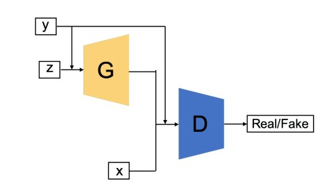{: width="100%"}

 See also [C], [Generative Adversarial Network]


## Conditional Random Fields

 See also [C], [Discriminative Classifier]


## Confidence Interval

 A confidence interval is the range of values needed to match a confidence level for estimating the features of a complete population.

 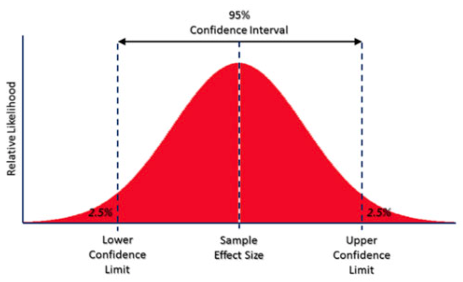{: width="100%"}

 See also [C], [Gaussian Distribution]


## Confusion Matrix

 ~ a report as informative as the [classification report] !

 A Confusion matrix is an N x N matrix used for evaluating the performance of a classification model, where N is the number of target classes. The matrix compares the actual target values with those predicted by the machine learning model. In the case where N=2 (true or false), it shows false and true positive as well as false and true negative.

 {: width="100%"}

/// warning | Beware:
  * [precision] = [recall] !
  * [specificity] = precision if classes in binary classifier are inverted!
  * [precision] = true positive / total positive
///

 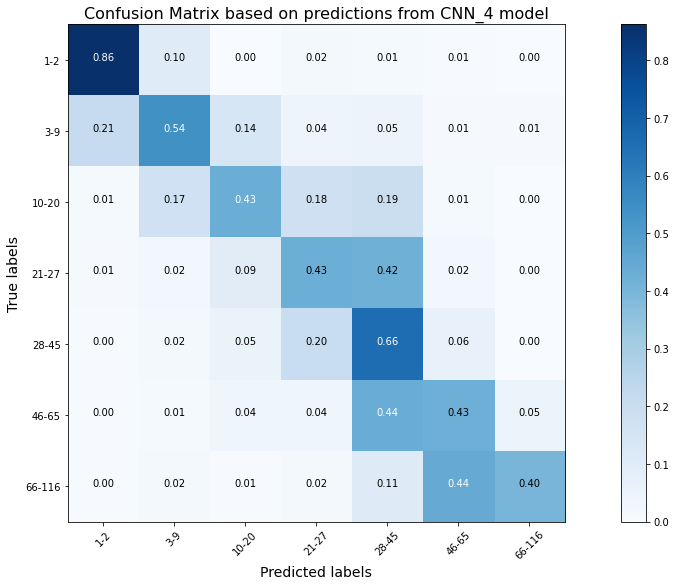{: width="100%"}

 More at:

  * [https://medium.com/analytics-vidhya/what-is-a-confusion-matrix-d1c0f8feda5](https://medium.com/analytics-vidhya/what-is-a-confusion-matrix-d1c0f8feda5)

 See also [C], [Accuracy], [Classification], [Model Drift], [Prediction Error]


## Constitutional AI

 ~ based on [Sparrow]'s rule?

 How does a language model decide which questions it will engage with and which it deems inappropriate? Why will it encourage some actions and discourage others? What “values” might a language model have?

 These are all questions people grapple with. Our recently published research on “Constitutional AI” provides one answer by giving language models explicit values determined by a constitution, rather than values determined implicitly via large-scale human feedback. This isn’t a perfect approach, but it does make the values of the AI system easier to understand and easier to adjust as needed.

 

 

 More at:

  * paper - ["https://arxiv.org/abs/2212.08073" ](https://arxiv.org/abs/2212.08073)
  * announcements - [https://www.anthropic.com/news/claudes-constitution](https://www.anthropic.com/news/claudes-constitution)
  * site - [https://www.constitutional.ai/](https://www.constitutional.ai/)
  * articles
    * [https://www.businesstoday.in/technology/news/story/ai-with-morals-google-backed-anthropic-reveals-the-set-of-values-that-guide-its-ai-380756-2023-05-10](https://www.businesstoday.in/technology/news/story/ai-with-morals-google-backed-anthropic-reveals-the-set-of-values-that-guide-its-ai-380756-2023-05-10)

 See also [C], ...


## Constraint Satisfaction Problem

 More at:

  * wikipedia - [https://en.wikipedia.org/wiki/Constraint_satisfaction_problem](https://en.wikipedia.org/wiki/Constraint_satisfaction_problem)

 See also [C], [Variable Model]


## Consumer Electronic Show (CES)

 

 See also [C], ...


## Context Window

 ~ short term memory of a [LLM]

 See also [C], ...


## Continual Reinforcement Learning (CRL)

 Consider an agent learning to play Go: Once the agent has discovered how to master the game, the task is complete, and the agent’s learning can stop. This view of learning is often embedded in the standard formulation of [Reinforcement Learning (RL)][RL], in which an agent interacts with a Markovian environment with the goal of efficiently identifying an optimal behavior, at which point learning can cease. But what if this is not the best way to model the RL problem? That is, instead of viewing learning as finding a solution, we can instead think of it as endless adaptation

 An [Reinforcement Learning (RL)][RL] problem is an instance of CRL if the best agents never stop learning. :warning: In the case of RL the learning stops because it has converged?

 

 More at:

  * paper - [https://arxiv.org/abs/2307.11046](https://arxiv.org/abs/2307.11046)
  * articles
    * [https://syncedreview.com/2023/07/25/deepmind-builds-a-precise-mathematical-foundation-of-continual-reinforcement-learning/](https://syncedreview.com/2023/07/25/deepmind-builds-a-precise-mathematical-foundation-of-continual-reinforcement-learning/)

 See also [C], ...


## Continuous Action Space

 In [Reinforcement Learning], a non-finite set of [Actions][Action]. You define a minimum and a maximum, i.e. a range, for your parameters and the agent can select a value for that range automatically. 

 See also [C], ...


## Continuous Convolution

 See also [C], [Discrete Convolution]


## Continuous Variable

 A variable that can take any value, possibly within a range.

 See also [C], [Variable Type]


## Contrastive Language Image Pre-training (CLIP) Model

 CLIP is a [dual-encoder contrastive model] that was developed by [OpenAI] and released open-source in 01/05/2021

 CLIP is a vision-language model that aligns image and text representations into a shared embedding space.
 is trained on large-scale image and text pair datasets to obtain a unified representation of different representations for the same concept. For that, an image encoder and a text encoder separately map images and text into a high-dimensional space, and a distance-based loss is utilized to enforce representations of identical concepts in neighborhood regions.
 CLIP is another neural network that is able to determine how well a caption (or prompt) matches an image. In other words, CLIP is a neural network that efficiently learns visual concepts from [natural language supervision].

 

 Model:

  * large scale learning - bigger transformer models for image and text embeddings
  * trained on 400 million (image, text) pairs using ConVIRT model trained fro scratch
  * pre-training method: predicting only which text as a whole is paired with which image and not the exact words of that text (contrastive, i.e. binary-classification task/approach for matching text to image)
  * Use vision transformer to reduce training time and required compute resources compared with [ResNet model].

 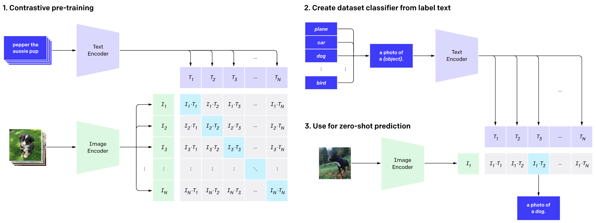{: width="100%"}

 

 More at:

  * site - [https://openai.com/research/clip](https://openai.com/research/clip)
  * code - [https://github.com/openai/CLIP](https://github.com/openai/CLIP)
  * paper - [https://arxiv.org/abs/2103.00020](https://arxiv.org/abs/2103.00020)
  * announcement - [https://openai.com/blog/clip/](https://openai.com/blog/clip/)
  * Hugging Face docs - [https://huggingface.co/docs/transformers/model_doc/clip#transformers.CLIPTextModel](https://huggingface.co/docs/transformers/model_doc/clip#transformers.CLIPTextModel)
  * more
    * Hierarchical Text-Conditional Image Generation with CLIP Latents (paper) - [https://arxiv.org/abs/2204.06125](https://arxiv.org/abs/2204.06125)
  * articles
    * [https://www.pinecone.io/learn/clip/](https://www.pinecone.io/learn/clip/)

 See also [C], [CLIP Image Encoder], [CLIP Text Encoder], [Embedding Space], [Vision Transformer], [VQGAN]


## Contrastive Learning

 

 See also [C], [Contrastive Loss]


## Contrastive Loss Function

 See also [C], [Contrastive Learning], [Loss Function]


## Control System

 A control system is a system that manages and regulates the behavior or operation of another system or process. It typically consists of sensors, actuators, and a controller. The sensors gather information about the system's current state, which is then compared to a desired state or setpoint. The controller processes this information and generates control signals that are sent to the actuators to adjust the system's inputs or parameters. The objective of a control system is to maintain the system's behavior within desired limits or achieve specific goals. 

 Control systems are a set of devices, components, and algorithms designed to regulate and manipulate the behavior of dynamic systems. These systems can be mechanical, electrical, chemical, or biological in nature. Control systems aim to maintain desired outputs or states by continuously monitoring and adjusting inputs or control signals. They play a crucial role in [automation], [robotics], manufacturing, and various other fields.

 See also [C], ...


## ControlNet External Network

 ~ diffusion model + prompt + DEPTH MAP/CONDITIONAL INPUT ==> image ! (without retraining the diffusion model)

/// warning | warning 

    diffusion model is frozen

    the external model takes the DEPTH MAP/CONDITIONAL INPUT
///

 We present ControlNet, a neural network architecture to add spatial conditioning controls to large, pretrained text-to-image diffusion models. ControlNet locks the production-ready large diffusion models, and reuses their deep and robust encoding layers pretrained with billions of images as a strong backbone to learn a diverse set of conditional controls. The neural architecture is connected with "zero convolutions" (zero-initialized convolution layers) that progressively grow the parameters from zero and ensure that no harmful noise could affect the finetuning. We test various conditioning controls, eg, edges, depth, segmentation, human pose, etc, with Stable Diffusion, using single or multiple conditions, with or without prompts. We show that the training of ControlNets is robust with small (<50k) and large (>1m) datasets. Extensive results show that ControlNet may facilitate wider applications to control image diffusion models.

 

 

 

 More at:

  * paper - [https://arxiv.org/abs/2302.05543](https://arxiv.org/abs/2302.05543)
  * code - [https://github.com/lllyasviel/ControlNet-v1-1-nightly](https://github.com/lllyasviel/ControlNet-v1-1-nightly)
  * articles
    * [https://bootcamp.uxdesign.cc/controlnet-and-stable-diffusion-a-game-changer-for-ai-image-generation-83555cb942fc](https://bootcamp.uxdesign.cc/controlnet-and-stable-diffusion-a-game-changer-for-ai-image-generation-83555cb942fc)

 See also [C], [Hypernetwork Architecture]


## Convolution

 In math, Convolution = Merging the shape of 2 functions together. Ex: Function that fires fireworks * smoke for 1 firework overtime = smoke in the air at a specific time ( = cumulative add all contribution of all firework)

 

 

 [Discrete convolution]

 

 [Continuous convolution]

 .... 

 More at:

  * [https://en.wikipedia.org/wiki/Convolution](https://en.wikipedia.org/wiki/Convolution)

 See also [C], [Convolutional Neural Network], [Image Filter]


## Convolution Autoencoder

 A CNN to latent space, and from latent space to a deconvolution neural network ?

 See also [C], [Convolution Neural Network], [Deconvolution Neural Network]


## Convolutional Layer

 ~ A stack of convoluted images (one per kernel filter)

 The goal of a convolutional layer is filtering!

 The output of a convolutional layer is a stack of convoluted images (stack of images convoluted with each [image filter])

 In a CNN, each layer tries to recognize different patterns (i.e. extract features).

 Once executed, each resulting values is subject to an activation function (a.k.a processed by the [activation layer] i.e. [ReLu Layer] ) and then compressed using a [pooling layer]

 {: width="100%"}

 The output of a convolutional layer is a stack of [convolved features]

 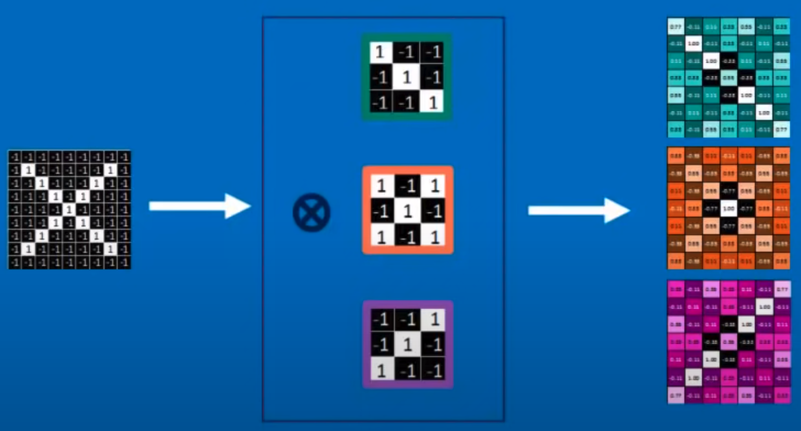{: width="100%"}

 See also [C], [Convolutional Neural Network], [Fully Connected Layer], [Image Filter], [Max Pooling Layer]


## Convolutional Neural Network (CNN)

 ==Particularly useful for image analysis/processing== such as object recognition, [image classification], semantic segmentation (object in image), artistic style transfer (filter on an image with the style of another image often a painting), meow generator (find cats in image?) . `The idea is that the pixel are not completely independent from the one surrounding them. CNN takes the surrounding pixel into consideration as well instead of just an independent pixel`. Use filter. Max Pooling layers (dimension reduction of outputs to downstream layers to convert a tensor into a vector). A succession of convolution-subsampling layers. Example: Does a pixel belongs to an object or not? .

 A CNN consists of :

  * [Convolutional Layers]
  * [Activation Layers] such as [RELU Layers]
  * [Pooling Layers] such as [Max Pooling Layers]
  * and [Fully Connected Layers]

 In a CNN, the [image filters] are learned through [backpropagation]

```python
import torchvision
from torch.utils.data import DataLoader
import torch
from torch import nn
from torch import optim
from torch.utils.tensorboard import SummaryWriter

import numpy as np

import os

transform_train = torchvision.transforms.Compose([
    torchvision.transforms.RandomHorizontalFlip(),
    torchvision.transforms.ToTensor(),
    torchvision.transforms.Normalize((0.4914, 0.4822, 0.4465), (0.2023, 0.1994, 0.2010))
])
transform_test = torchvision.transforms.Compose([
    torchvision.transforms.ToTensor(),
    torchvision.transforms.Normalize((0.4914, 0.4822, 0.4465), (0.2023, 0.1994, 0.2010)),    
])

train_dataset = torchvision.datasets.CIFAR10("/mnt/cifar10/", train=True, transform=transform_train, download=True)
train_dataloader = DataLoader(train_dataset, batch_size=32, shuffle=False)
test_dataset = torchvision.datasets.CIFAR10("/mnt/cifar10/", train=False, transform=transform_test, download=True)
test_dataloader = torch.utils.data.DataLoader(test_dataset, batch_size=32, shuffle=False)

class CIFAR10Model(nn.Module):
    def __init__(self):
        super().__init__()
        self.cnn_block_1 = nn.Sequential(*[
            nn.Conv2d(3, 32, 3, padding=1),
            nn.ReLU(),
            nn.Conv2d(32, 64, 3, padding=1),
            nn.ReLU(),
            nn.MaxPool2d(kernel_size=2),
            nn.Dropout(0.25)
        ])
        self.cnn_block_2 = nn.Sequential(*[
            nn.Conv2d(64, 64, 3, padding=1),
            nn.ReLU(),
            nn.Conv2d(64, 64, 3, padding=1),
            nn.ReLU(),
            nn.MaxPool2d(kernel_size=2),
            nn.Dropout(0.25)
        ])
        self.flatten = lambda inp: torch.flatten(inp, 1)
        self.head = nn.Sequential(*[
            nn.Linear(64 * 8 * 8, 512),
            nn.ReLU(),
            nn.Dropout(0.5),
            nn.Linear(512, 10)
        ])
    
    def forward(self, X):
        X = self.cnn_block_1(X)
        X = self.cnn_block_2(X)
        X = self.flatten(X)
        X = self.head(X)
        return X

clf = CIFAR10Model()

start_epoch = 1

clf.cuda()
criterion = nn.CrossEntropyLoss()
optimizer = optim.RMSprop(clf.parameters(), lr=0.0001, weight_decay=1e-6)

def train():
    clf.train()
    NUM_EPOCHS = 10
    
    for epoch in range(start_epoch, NUM_EPOCHS + 1):
        losses = []

        for i, (X_batch, y_cls) in enumerate(train_dataloader):
            optimizer.zero_grad()

            y = y_cls.cuda()
            X_batch = X_batch.cuda()

            y_pred = clf(X_batch)
            loss = criterion(y_pred, y)
            loss.backward()
            optimizer.step()

            train_loss = loss.item()
            if i % 200 == 0:
                print(
                    f'Finished epoch {epoch}/{NUM_EPOCHS}, batch {i}. loss: {train_loss:.3f}.'
                )
            losses.append(train_loss)

        print(
            f'Finished epoch {epoch}. '
            f'avg loss: {np.mean(losses)}; median loss: {np.median(losses)}'
        )

train()
```

 

 

 

 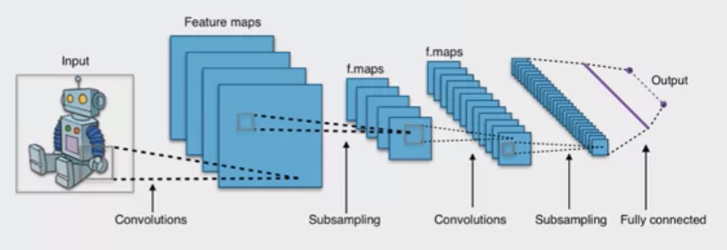{: width="100%"}

 The hidden layers are designed to process the input in a way that optimizes for signal and image processing /recognition. ==> recognize features instead of pixel!

 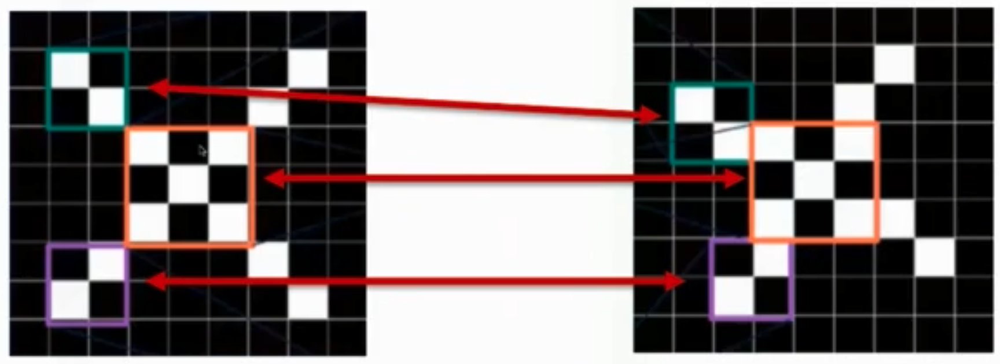{: width="100%"}

 ==When using kernel, we are implicitly saying that pixel outside of the kernel do not have an impact on ... This is where attention-based models may be better than CNN, where attention to other pixel in the image needs to be taken into consideration==

 More at:

  * what CNN see 
    * [https://experiments.withgoogle.com/what-neural-nets-see](https://experiments.withgoogle.com/what-neural-nets-see)
    * [https://becominghuman.ai/what-exactly-does-cnn-see-4d436d8e6e52](https://becominghuman.ai/what-exactly-does-cnn-see-4d436d8e6e52)
  * [https://setosa.io/ev/image-kernels/](https://setosa.io/ev/image-kernels/)
  * [https://heartbeat.fritz.ai/the-5-computer-vision-techniques-that-will-change-how-you-see-the-world-1ee19334354b](https://heartbeat.fritz.ai/the-5-computer-vision-techniques-that-will-change-how-you-see-the-world-1ee19334354b)
  * [https://medium.com/easyread/an-introduction-to-convolution-neural-network-cnn-for-a-beginner-88548e4b2a84](https://medium.com/easyread/an-introduction-to-convolution-neural-network-cnn-for-a-beginner-88548e4b2a84)
  * [https://e2eml.school/how_convolutional_neural_networks_work.html](https://e2eml.school/how_convolutional_neural_networks_work.html)
  * [https://yosinski.com/deepvis](https://yosinski.com/deepvis)

 See also [C], [Attention-Based Model], [Convolution], [Deconvolution Neural Network], [Instance Segmentation], [Latent Space], [Neural Network], [Object Detection], [Picasso Visualizer], [Pooling Layer], [Region-Based CNN], [Semantic Segmentation], [Subsampling]


## Convolutional Neural Network (CNN) Feature Extractor

 When using a [CNN], ... [ResNet Model]

 

 More at:

  * [https://medium.com/birdie-ai/how-to-use-cnns-as-feature-extractors-54c69c1d4bdf](https://medium.com/birdie-ai/how-to-use-cnns-as-feature-extractors-54c69c1d4bdf)

 See also [C], ...


## Convolved Feature

 The result of a convolution of an input image with a [image filter]. The output of a [convolutional layer] is a stack of convolved features.

 {: width="100%"}

 More at:

  * [https://becominghuman.ai/what-exactly-does-cnn-see-4d436d8e6e52](https://becominghuman.ai/what-exactly-does-cnn-see-4d436d8e6e52)

 See also [C], ...


## Coral Hardware

 A [Tensor Processing Unit (TPU)] compatible with any computer including the [Raspberry Pi Computer]

 

 More at:

  * [https://www.amazon.com/Google-G950-01456-01-Coral-USB-Accelerator/dp/B07S214S5Y](https://www.amazon.com/Google-G950-01456-01-Coral-USB-Accelerator/dp/B07S214S5Y)
  * [https://teachablemachine.withgoogle.com/](https://teachablemachine.withgoogle.com/)
  * marshmallow sorter - [https://coral.ai/projects/teachable-sorter#project-intro](https://coral.ai/projects/teachable-sorter#project-intro)

 See also [C], ...


## Coreference

 Understand the entities a speak refers to when he uses nouns, pronouns. ex I, You, my sister, your sister, etc Function of the speaker perspective.

 More at:

   * [https://medium.com/huggingface/state-of-the-art-neural-coreference-resolution-for-chatbots-3302365dcf30](https://medium.com/huggingface/state-of-the-art-neural-coreference-resolution-for-chatbots-3302365dcf30)

 See also [C], [Benchmark]


## CoreML Format

 Format for ML models to load on devices made by [Apple]

 See also [C], ...


## CoreML Framework

 Switch UI programming language

 More at:

  * [https://developer.apple.com/documentation/coreml](https://developer.apple.com/documentation/coreml)

 See also [C], [CoreML Format], [CoreML Tool]


## CoreML Tool

 Tools to convert models to [CoreML Format], etc and integrate a model in [CoreML Framework]

 More at:

  * [https://coremltools.readme.io/docs](https://coremltools.readme.io/docs)

 See also [C], ...


## Corpus

 GPT-3 is pre-trained on a corpus of text from five datasets: [Common Crawl], WebText2, Books1, Books2, and Wikipedia..

  * Colossal Clean Crawled Corpus (C4) : Used by T5 model
  * [Common Crawl] : The Common Crawl corpus (collection of texts) comprises petabytes of data including raw web page data, metadata, and text data collected over eight years of web crawling. OpenAI researchers use a curated, filtered version of this dataset.
  * Web2text : WebText2 is an expanded version of the WebText dataset, which is an internal OpenAI corpus created by scraping web pages of particularly high quality. To vet for quality, the authors scraped all outbound links from Reddit that received at least three karma (an indicator for whether other users found the link interesting, educational, or just funny). WebText2 contains 40 gigabytes of text from these 45 million links, over 8 million documents.
  * Book1 and Book2 : Books1 and Books2 are two corpora (plural of corpus) that contain the text of tens of thousands of books on various subjects.
  * Wikipedia : The Wikipedia corpus is a collection including all English-language articles from the crowdsourced online encyclopedia Wikipedia at the time of finalizing the GPT-3’s dataset in 2019. This dataset has roughly 5.8 million English articles.

 See also [C], [Dataset], [GPT Model], [Natural Language Processing]


## Corrective Retrieval Augmented Generation (CRAG) System

 ~ an improved version of [RAG] that aims to make language models more accurate

 While traditional RAG simply uses retrieved documents to help generate text, CRAG takes it a step further by actively checking and refining these documents to ensure they are relevant and accurate. This helps reduce errors or hallucinations where the model might produce incorrect or misleading information.

 In CRAG, the retrieval evaluator is a fine-tuned T5-large model. The evaluator assigns a confidence score to each document, categorizing them into three levels of confidence:

  * Correct: If at least one document scores above the upper threshold, it is considered correct. The system then applies a knowledge refinement process, using a decompose-then-recompose algorithm to extract the most important and relevant knowledge strips while filtering out any irrelevant or noisy data within the documents. This ensures that only the most accurate and relevant information is retained for the generation process.
  * Incorrect: If all documents fall below a lower threshold, they are marked as incorrect. In this case, CRAG discards all the retrieved documents and instead performs a web search to gather new, potentially more accurate external knowledge. This step extends the retrieval process beyond static or limited knowledge base by leveraging the vast and dynamic information available on the web, increasing the likelihood of retrieving relevant and accurate data.
  * Ambiguous: When the retrieved documents contain mixed results, it will be considered ambiguous. In this case, CRAG combines both strategies: it refines information from the initially retrieved documents and incorporates additional knowledge obtained from web searches.

 After one of these actions is taken, the refined knowledge is used to generate the final response.

 CRAG makes several key improvements over traditional RAG. One of its biggest advantages is its ability to fix errors in the information it retrieves. The retrieval evaluator in CRAG helps spot when information is wrong or irrelevant, so it can be corrected before it affects the final output. This means CRAG provides more accurate and reliable information, cutting down on errors and misinformation.

 CRAG also excels in making sure the information is both relevant and accurate. While traditional RAG might only check relevance scores, CRAG goes further by refining the documents to ensure they are not just relevant but also precise. It filters out irrelevant details and focuses on the most important points, so the generated text is based on accurate information.

 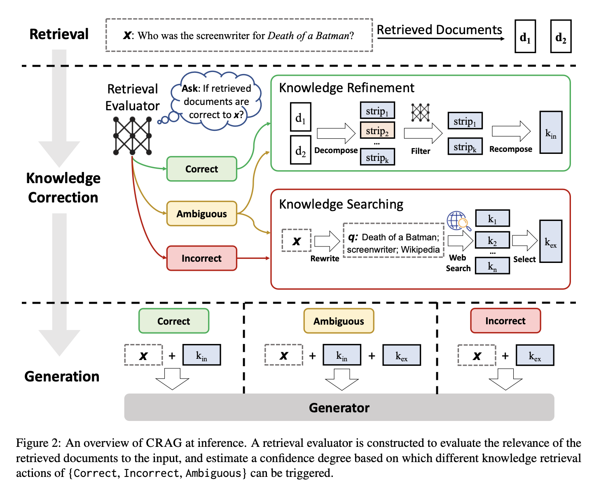{: width="100%"}

 

 More at:

  * paper -
  * articles
    * [https://www.datacamp.com/tutorial/corrective-rag-crag](https://www.datacamp.com/tutorial/corrective-rag-crag)

 See also [C], ...


## Correlation

/// warning | Correlation is not causation!
///

 Correlation refers to the statistical relationship between two variables. In other words, it measures the extent to which two variables are related to each other.

 A correlation can be positive or negative. A positive correlation means that the two variables move in the same direction. For example, if one variable increases, the other variable also tends to increase. A negative correlation means that the two variables move in opposite directions. For example, if one variable increases, the other variable tends to decrease.

 Correlation can be measured by a statistic called the [correlation coefficient], which ranges from -1 to +1.

 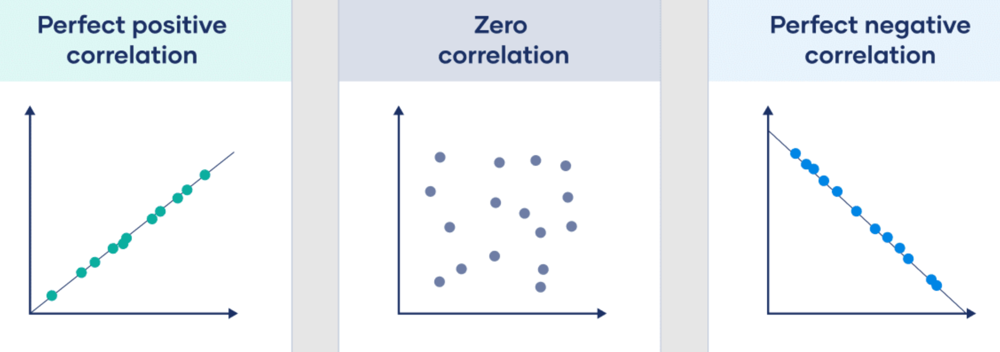{: width="100%"}

 More at:

  * [https://en.wikipedia.org/wiki/Correlation](https://en.wikipedia.org/wiki/Correlation)

 See also [C], ...


## Correlation Coefficient

 In [Statistics], correlation or dependence is any statistical relationship, whether causal or not, between two random variables.

 | Correlation coefficient | Correlation strength | Correlation type |
 | --- | --- | --- |
 | -0.7 to -1   | Very strong | Negative |
 | -0.5 to -0.7 | Strong | Negative |
 | -0.3 to -0.5 | Moderate | Negative |
 | -0 to -0.3 | Weak | Negative |
 | 0 | None | Zero |
 | 0 to 0.3 | Weak | Positive |
 | 0.3 to 0.5 | Moderate | Positive |
 | 0.5 to 0.7 | Strong | Positive |
 | 0.7 to 1 | Very strong | Positive |

 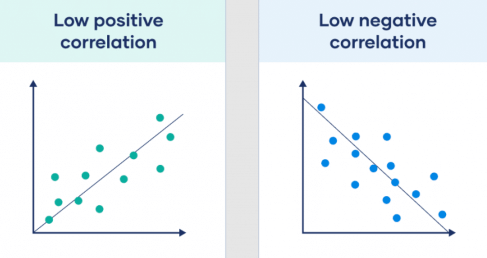{: width="100%"}

 More at:

  * [https://www.scribbr.com/statistics/correlation-coefficient/](https://www.scribbr.com/statistics/correlation-coefficient/)

 See also [C], ...


## Correlation Matrix

```python
# Correction Matrix Plot (generic)
from matplotlib import pyplot
from pandas import read_csv
import numpy

filename = 'pima-indians-diabetes.data.csv'
names = ['preg', 'plas', 'pres', 'skin', 'test', 'mass', 'pedi', 'age', 'class']
data = read_csv(filename, names=names)

correlations = data.corr()
# plot correlation matrix
fig = pyplot.figure()
ax = fig.add_subplot(111)
cax = ax.matshow(correlations, vmin=-1, vmax=1)
fig.colorbar(cax)
pyplot.show()
```

 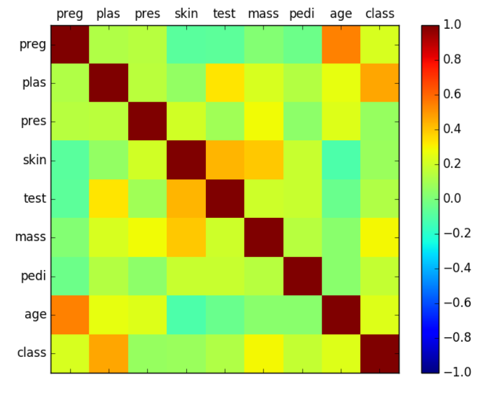{: width="100%"}

 See also [C], ...


## Cortical Labs Company

 A company that is trying to build a chip dubbed DishBrain with biological [neurons] to do AI.

 The biggest cost out of any data center or cloud provider is the energy that they pay for running the equipment and cooling the system. DishBrain is a system that consumes hardly any energy and outputs very little heat. The unit economics completely flips on its head, especially if you can start training it to do AI tasks.

 

 More at:

  * site - [https://corticallabs.com/](https://corticallabs.com/)
  * research - [https://corticallabs.com/research.html](https://corticallabs.com/research.html)
  * articles
    * [https://www.forbes.com/sites/zinnialee/2023/06/21/cortical-labs-brain-computer/](https://www.forbes.com/sites/zinnialee/2023/06/21/cortical-labs-brain-computer/)

 See also [C], ...


## Cosine Similarity Function

 A [similarity metric] that can tell us how similar or different 2 [embeddings] are

 In data analysis, cosine similarity is a measure of similarity between two non-zero vectors defined in an inner product space. Cosine similarity is the cosine of the angle between the vectors; that is, it is the dot product of the vectors divided by the product of their lengths. It follows that the cosine similarity does not depend on the magnitudes of the vectors, but only on their angle. The cosine similarity always belongs to the interval [ −1, 1]. For example, two proportional vectors have a cosine similarity of 1, two orthogonal vectors have a similarity of 0, and two opposite vectors have a similarity of -1.

 Can tell us how similar or different 2 phrases are.

  * 2 same sentences, are the exact same, then the cosine similarity is cos(0) = 1
  * 2 sentences have no words in common, then the angle between 2 phrases is 90 deg, cosine similarity is cos(90 deg) = 0 
  * 2 sentences have some words in common, then cosine similarity is between 0 and 1

 Step-by-step

  1. Make a table of word counts
  1. Plot the points
  1. Figure out angle
  1. Calculate the Cosine of the angle

 Beware:

  * Use angles only! Not the magnitudes of the vectors unlike the [Euclidean distance].
  * The number of times a word appears does not change the cosine similarity, e.g. "hello hello world" is exactly same as "hello world"
  * Each word adds a new dimension. So for more than 2 words, use the cosine similarity formula (but assume the math-context is the same)

 Here is an illustration for a cosine similarity for 2 sentences with only 2 words (2 dimensions)

 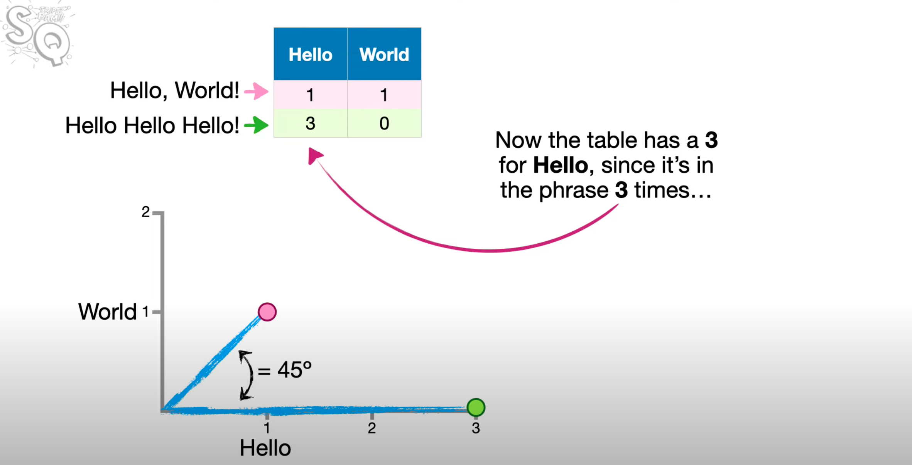{: width="100%"}

 Here is the formula for the cosine similarity for N words (N dimensions)

 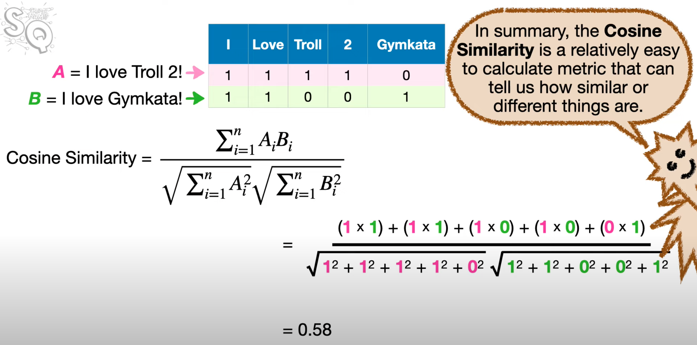{: width="100%"}

 

 More at:

  * [https://hackernoon.com/understanding-the-two-tower-model-in-personalized-recommendation-systems](https://hackernoon.com/understanding-the-two-tower-model-in-personalized-recommendation-systems)

 See also [C], ...


## Cost

 Cost vs Reward = minimize vs maximize

 Cost = negative reward

 See also [C], [Reward]


## Cost Function

 See [Loss Function]


## Covariant AI Company

 Models

  * [Robot Foundational Model]

 More at:

  * site - [https://covariant.ai/](https://covariant.ai/)

 See also [C], ...


## Covector

 A linear "machine" that eats a vector and output a number (a measurement)

 Linear means:

  * V1 + V2 --> transformation of V1 + transformation of V2
  * a * V1 --> a * transformation of V1

 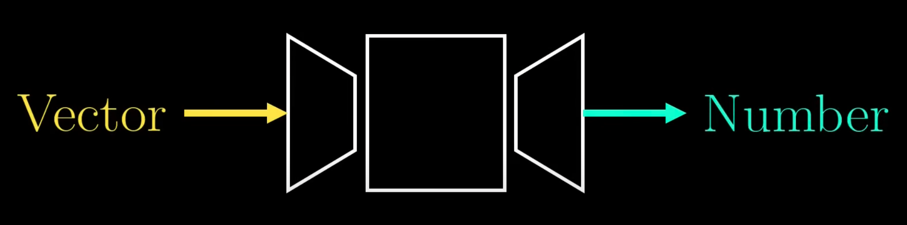{: width="100%"}

 See also [C], ...


## CreateML Application

 An application to easily create ML models

 

 More at:

  * [https://developer.apple.com/videos/play/wwdc2022/110332/](https://developer.apple.com/videos/play/wwdc2022/110332/)

 See also [C], [CoreML Framework]


## Critic

 In [reinforcement learning], when using an [actor-critic algorithm], a critic is Q-learning algorithm that critiques the action that the [actor] selected, providing feedback on how to adjust. It can take advantage of efficiency tricks in Q-learning, such as memory replay.

 In deep RL, a critic is an [artificial neural network] that computes the [Q-value]

 See also [C], ...


## Critic Network

 See also [C], ...


## Critical Assessment of Structure Prediction (CASP) Challenge

 Critical Assessment of Structure Prediction (CASP), sometimes called Critical Assessment of Protein Structure Prediction, is a community-wide, worldwide experiment for protein structure prediction taking place every two years since 1994. CASP provides research groups with an opportunity to objectively test their structure prediction methods and delivers an independent assessment of the state of the art in protein structure modeling to the research community and software users. Even though the primary goal of CASP is to help advance the methods of identifying protein three-dimensional structure from its amino acid sequence many view the experiment more as a “world championship” in this field of science. More than 100 research groups from all over the world participate in CASP on a regular basis and it is not uncommon for entire groups to suspend their other research for months while they focus on getting their servers ready for the experiment and on performing the detailed predictions.

 In December 2018, CASP13 made headlines when it was won by [AlphaFold][AlphaFold Model], an [artificial intelligence] program created by [DeepMind]. In November 2020, an improved version 2 of AlphaFold won CASP14. According to one of CASP co-founders John Moult, AlphaFold scored around 90 on a 100-point scale of prediction accuracy for moderately difficult protein targets. AlphaFold was made open source in 2021, and in CASP15 in 2022, while DeepMind did not enter, virtually all of the high-ranking teams used AlphaFold or modifications of AlphaFold.

 More at:

  * [https://en.wikipedia.org/wiki/CASP](https://en.wikipedia.org/wiki/CASP)

 See also [C], ...


## Cross-Attention

 ~ 2 sequences (input vs output, i.e. English to French translation) and 2nd one attends to elements/words in the first one.

 Allow the decoder to access information from encoders to make better predictions. In text-to-image generation, through the cross-attention mechanism, the information of the text is fused to the visual feature vectors.

 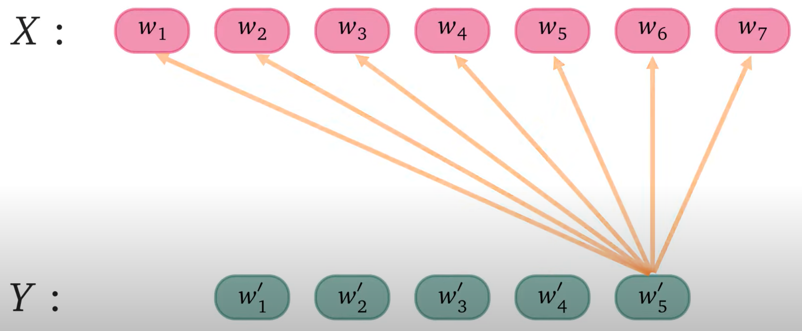{: width="100%"}

 See also [C], [Attention], [Latent Diffusion Model], [Self-Attention], [Transformer Architecture]


## Cross-Entropy

 used as a loss function in a classifier

```
Likelihood of sequence = P(X) = product_of ( P(i=0,t,x_i/x_<i)

Cross_entropy = - log(P(X)) / t
```

 

 

 See also [C], [Cross-Entropy Loss Function], [Entropy], [Perplexity]


## Cross-Entropy Loss Function

 ~ classic loss function for classification

 Frequently used as a loss function for neural networks. To understand it, you need to understand the following (and in that order!): Surprisal, Entropy, Cross-Entropy, Cross-Entropy Loss.

  * Surprisal:  “Degree to which you are surprised to see the result”. Now it's easy to digest my word when I say that I will be more surprised to see an outcome with low probability in comparison to an outcome with high probability. Now, if Pi is the probability of ith outcome then we could represent surprisal (s) as:

```
s = log ( 1 / Pi)
```

 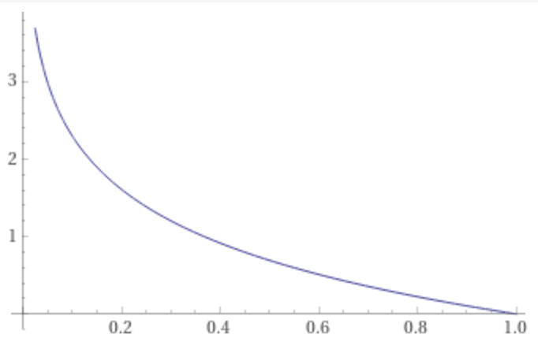{: width="100%"}

  * Entropy: Since I know surprisal for individual outcomes, I would like to know **surprisal for the event**. It would be intuitive to take a weighted average of surprisals. Now the question is what weight to choose? Hmmm…since I know the probability of each outcome, taking probability as weight makes sense because this is how likely each outcome is supposed to occur. This weighted average of surprisal is nothing but Entropy (e) and if there are n outcomes then it could be written as:

```
entropy = e = sum(0, n, Pi * log (1/Pi)
```

  * Cross-Entropy: Now, what if each outcome’s actual probability is Pi but someone is estimating probability as Qi. In this case, each event will occur with the probability of Pi but surprisal will be given by Qi in its formula (since that person will be surprised thinking that probability of the outcome is Qi). Now, weighted average surprisal, in this case, is nothing but cross-entropy(c) and it could be scribbled as:

```
cross-entropy = c = sum(0, n, Pi * log (1/Qi)
```

  Cross-entropy is always larger than entropy and it will be same as entropy only when Pi=Qi

  * Cross-Entropy Loss: In the plot below, you will notice that as estimated probability distribution moves away from actual/desired probability distribution, cross-entropy increases and vice-versa. Hence, we could say that minimizing cross-entropy will move us closer to actual/desired distribution and that is what we want. This is why we try to reduce cross-entropy so that our predicted probability distribution end up being close to the actual one. Hence, we get the formula of cross-entropy loss as:

```
cross-entropy loss = c = sum(0, n, Pi * log (1/Qi)

# And in the case of binary classification problem where we have only two classes, we name it as binary cross-entropy loss and above formula becomes:
binary cross-entropy loss = c = sum(0, 1, Pi * log (1/Qi) = Po * log(1/Qo) + (1-Po) * log(1/Q1) 
```

 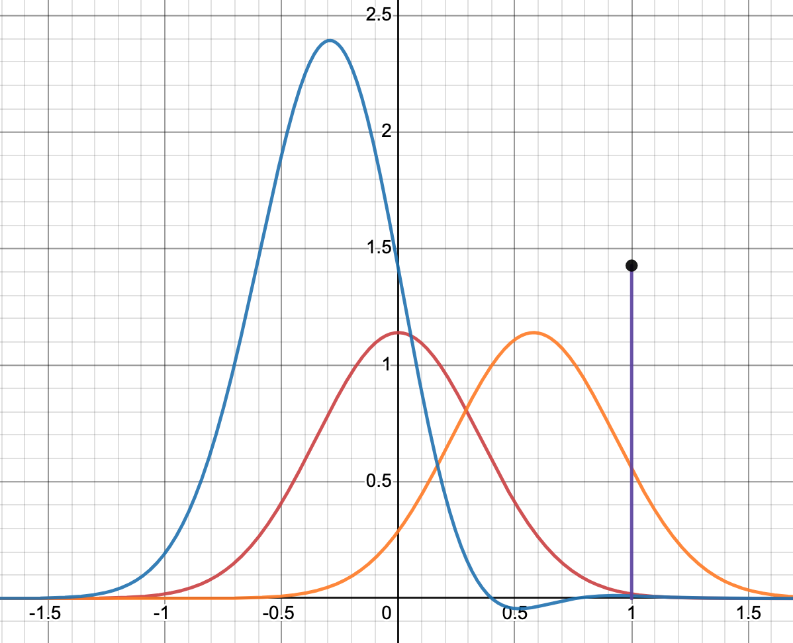{: width="100%"}

 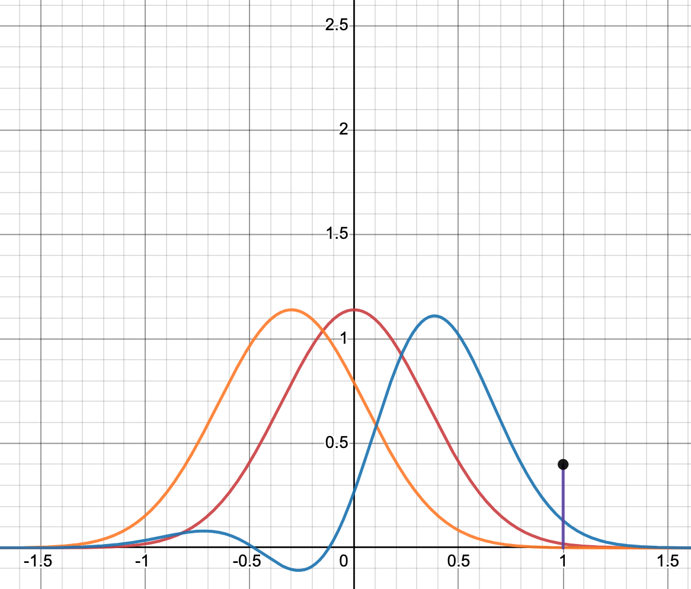{: width="100%"}
 
 This plot helps you visualize the cross-entropy between two distributions. The Red function represents a desired probability distribution, for simplicity a gaussian distribution is shown here. While the Orange function represents estimated probability distribution. The purple bar shows cross-entropy between these two distributions which is in simple words the area under the blue curve.

 

 

 More at

   * plot - [https://www.desmos.com/calculator/zytm2sf56e](https://www.desmos.com/calculator/zytm2sf56e)
   * [https://medium.com/@vijendra1125/understanding-entropy-cross-entropy-and-softmax-3b79d9b23c8a](https://medium.com/@vijendra1125/understanding-entropy-cross-entropy-and-softmax-3b79d9b23c8a)
   * [https://machinelearningmastery.com/cross-entropy-for-machine-learning/](https://machinelearningmastery.com/cross-entropy-for-machine-learning/)

 See also [C], [Binary Cross-Entropy Loss Function], [Cross-Entropy], [Entropy], [Loss Function]


## Cross-Validation on Historical Data

 See [#Backtesting]


## Cross-Validation Sampling Method

 = to merge in [k-fold cross validation]?

 Cross-validation is a powerful preventative measure against [overfitting]. The idea is clever: Use your initial training data to generate multiple mini train-test splits. Use these splits to tune your model (eg complexity). In standard k-fold cross-validation, we partition the data into k subsets, called folds. Then, we iteratively train the algorithm on k-1 folds while using the remaining fold as the test set (called the “holdout fold”). Cross-validation allows you to tune [hyperparameters] with only your original training set. This allows you to keep your test set as a truly unseen dataset for selecting your final model.

 See also [C], [Dataset], [Development Subset], [Holdout Fold], [Resampling Method], [Testing Subset], [Training Subset], [Validation Set]


## Cubic Regression

 See also [C], [Non-Linear Regression], [Regression]

 Cuda Core 

 See also [C], [GPU]


## Cumulative Distribution Function (CDF)

 Graph or histogram reporting the probability that a function has reached this value or is below.

 See also [C], [Distribution]


## Cumulative Reward

 In [Reinforcement Learning (RL)][RL] the agent is going to learn to maximize its cumulative reward, not the immediate [reward].
 To make sure the agent adopt the correct behavior, you must understand the agent incentive, that is the cumulative reward!

 See also [C], [Reward Shaping]


## Curiosity-Driven RL

 

 

 More at:

  * random distillation paper - [https://arxiv.org/abs/1810.12894](https://arxiv.org/abs/1810.12894)

 See also [C], ...


## Curriculum Learning

 When you teach addition, do you start with a complex or simple example?

 Curriculum learning is a training strategy in machine learning where models are trained on increasingly complex subsets of the full training data. The idea is to start with easier examples first and then gradually increase the difficulty as the model learns. Some key aspects of curriculum learning:

  * Data is organized from simple to complex. For example, in image classification, the model may first be trained on images with solid backgrounds before moving to more varied images.
  * The curriculum is designed thoughtfully based on some measure of "difficulty". This could be manually defined by a human or automated based on model performance.
  * Models are able to master simpler concepts first, which provides a better initialization for learning more complex examples later.
  * Curriculum learning can lead to faster convergence compared to training on all data from the start.
  * It is most useful when the training data has an inherent meaningful order from simple to complex. Curriculum design is important.
  * Curriculum learning has been shown to be beneficial for training deep neural networks in domains like computer vision and natural language processing.

 So in summary, curriculum learning trains models incrementally on curated subsets of data ordered by increasing complexity, allowing for faster and more robust learning. The curriculum design and measures of difficulty are key aspects.

 See also [C], ...


## Curse of Dimensionality

 See also [C], [HPO]


## Custom Churn Prediction

 See also [C], [Regression], [Supervised Learning]


## Custom GPT

 You can now create custom versions of [ChatGPT] or [GPT-4] that gives them personalities and combine instructions,extra knowledge, and any combination of skills.

 Beware, Custom GPTs can be easily reverse engineered using different methods of [prompt injection]

 

 

 

 More at:

  * announcement - [https://openai.com/blog/introducing-gpts](https://openai.com/blog/introducing-gpts)
  * create one - [https://chat.openai.com/create](https://chat.openai.com/create)
  * examples
  * math mentor - [https://openai.com/chatgpt#do-more-with-gpts](https://openai.com/chatgpt#do-more-with-gpts)
  * articles
    * prompt leakage - [https://gizmodo.com/security-vulnerabilities-openai-chatgpt-custom-gpt-1851057912](https://gizmodo.com/security-vulnerabilities-openai-chatgpt-custom-gpt-1851057912)
  * tools
    * UI - [https://retool.com/use-case/gpt4-gui-frontend](https://retool.com/use-case/gpt4-gui-frontend)
    * chatbot UI - [https://www.voiceflow.com/](https://www.voiceflow.com/)
    * website into knowledge bases - [https://www.youtube.com/watch?v=CFMK_707xqg](https://www.youtube.com/watch?v=CFMK_707xqg)
    * whatsapp UI - [https://manychat.com/](https://manychat.com/)
  * GPT finders
    * [https://www.gptshunter.com/](https://www.gptshunter.com/)

 See also [C], [ManyChat Company], [Replit Company], [VoiceFlow Company]


## Cybernetic Organism (Cyborg)

 A cyborg, short for "cybernetic organism," refers to a being that combines both biological and artificial components. It is a concept derived from science fiction and represents a fusion of human and technological elements.

 In a general sense, a cyborg can encompass a range of entities, from individuals with prosthetic limbs or implants that enhance their physical capabilities to more advanced combinations where artificial components are integrated deeply into the body and nervous system.

 Cyborgs can be created for various purposes, including medical reasons, such as providing assistance to individuals with disabilities or injuries, or for enhancing human performance and capabilities beyond natural limits. This can involve incorporating electronic devices, sensors, or implants that connect to the body's systems to provide new functionalities or augment existing ones.

 The concept of cyborgs raises ethical and philosophical questions about the boundaries between human and machine, the impact on identity and autonomy, and the potential implications for society as technology advances. While there are real-world examples of individuals with artificial limbs or implants, the depiction of highly integrated and advanced cyborgs seen in science fiction is yet to be fully realized.

 More at:

  * [https://en.wikipedia.org/wiki/Cyborg](https://en.wikipedia.org/wiki/Cyborg) 

 See also [C], ...


## Cyborg Bettle

 

 More at:

  * [https://www.scientificamerican.com/article/cyborg-beetles/](https://www.scientificamerican.com/article/cyborg-beetles/)

 See also [C], ...


## Cyc Expert System

 Probably the longest-running [expert system] project, called Cyc (from the world encyclopedic) created by Douglas Lenat and his colleagues at Cycorp.
 Initiated in 1984, Cyc has the goal of encoding all of "commonsense knowledge" - broadly known as facts like 'a dropped egg will break' or 'A child running through the kitchen with muddy shoes will annoy parents'. These millions of small ideas are not clearly written down in one place. They are unspoken assumption s underlying human behavior and reasoning that are necessary for understanding what the average person knows in a variety of domains. Yet, because the Cyc system also represents this knowledge with symbolic rules, it too has to face the [complexity ceiling].

 More at:

  * site - [https://cyc.com/](https://cyc.com/)

 See also [C], ...


## Cycle GAN

 Image-to-image translation involves generating a new synthetic version of a given image with a specific modification, such as translating a summer landscape to winter. This opens up the possibility to do a lot of interesting tasks like photo-enhancement, image colorization, style transfer, season translation, object transfiguration, and generating photos from paintings, etc. Traditionally, training an image-to-image translation model requires a dataset comprised of paired examples. That is, a large dataset of many examples of input images X (e.g. summer landscapes) and the same image with the desired modification that can be used as an expected output image Y (e.g. winter landscapes). The requirement for a paired training dataset is a limitation. These datasets are challenging and expensive to prepare, e.g. photos of different scenes under different conditions. In many cases, the datasets simply do not exist, such as famous paintings and their respective photographs. As such, there is a desire for techniques for training an image-to-image translation system that does not require paired examples. Specifically, where any two collections of unrelated images can be used and the general characteristics extracted from each collection and used in the image translation process. For example, to be able to take a large collection of photos of summer landscapes and a large collection of photos of winter landscapes with unrelated scenes and locations as the first location and be able to translate specific photos from one group to the other. This is called the problem of unpaired image-to-image translation.

 {: width="100%"}

 At first glance, the architecture of the CycleGAN appears complex. Let’s take a moment to step through all of the models involved and their inputs and outputs. Consider the problem where we are interested in translating images from summer to winter and winter to summer. We have two collections of photographs and they are unpaired, meaning they are photos of different locations at different times; we don’t have the exact same scenes in winter and summer.

  * Collection 1: Photos of summer landscapes.
  * Collection 2: Photos of winter landscapes.

 We will develop an architecture of two GANs, and each GAN has a discriminator and a generator model, meaning there are four models in total in the architecture. The first GAN will generate photos of winter given photos of summer, and the second GAN will generate photos of summer given photos of winter.

  * GAN 1: Translates photos of summer (collection 1) to winter (collection 2).
  * GAN 2: Translates photos of winter (collection 2) to summer (collection 1).

 Each GAN has a conditional generator model that will synthesize an image given an input image. And each GAN has a discriminator model to predict how likely the generated image is to have come from the target image collection. The discriminator and generator models for a GAN are trained under normal adversarial loss like a standard GAN model. We can summarize the generator and discriminator models from GAN 1 as follows:

  * Generator Model 1:
   * Input: Takes photos of summer (collection 1).
   * Output: Generates photos of winter (collection 2).
  * Discriminator Model 1:
   * Input: Takes photos of winter from collection 2 and output from Generator Model 1.
   * Output: Likelihood of image is from collection 2.

 So far, the models are sufficient for generating plausible images in the target domain but are not translations of the input image.

 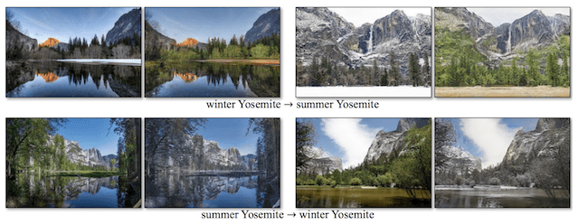{: width="100%"}

 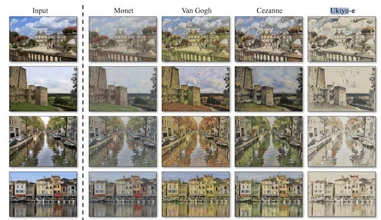{: width="100%"}

 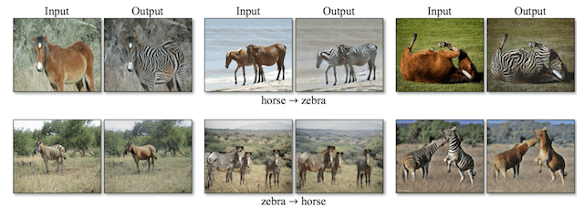{: width="100%"}

 Beware:

  * input can be an image of frequencies that represent a voice and therefore can be used to change your voice!

 More at:

  * [https://machinelearningmastery.com/what-is-cyclegan/](https://machinelearningmastery.com/what-is-cyclegan/)

 See also [C], [Generative Adversarial Network], [Spectrogram Image]
