# D

## DALL-E Model Family

 A play on words between WALL-E and Dali!

 

 More at :

  * DALL-E 2
    * open-ai announcement - [https://openai.com/dall-e-2/](https://openai.com/dall-e-2/)
    * site + paper - [https://openai.com/blog/dall-e/](https://openai.com/blog/dall-e/)
    * how does DALL-E work? - [https://www.assemblyai.com/blog/how-dall-e-2-actually-works/](https://www.assemblyai.com/blog/how-dall-e-2-actually-works/)
    * DALL-E 2 uses CLIP - [https://arxiv.org/abs/2204.06125](https://arxiv.org/abs/2204.06125)
  * DALL-E 3
    * site - [https://openai.com/dall-e-3](https://openai.com/dall-e-3)
    * site - [https://openai.com/research/dall-e-3-system-card](https://openai.com/research/dall-e-3-system-card)
    * paper - [https://cdn.openai.com/papers/dall-e-3.pdf](https://cdn.openai.com/papers/dall-e-3.pdf)

 See also [D], [CLIP Model], [GLIDE Model]


## Dario Amodei Person

 ~ CEO of [Anthropic]

 See also [D], ...


## DARPA

 * 2004 - 2005: [DARPA Grand Challenge]
 * [DARPA Siri]
 * 2007: [DARPA Urban Challenge]
 * 2015: [DARPA Robotics Challenge]
 * 2021: [DARPA Subterranean Challenge]

 See also [D], ...


## DARPA Robotics Challenge

 2015 Challenge

 

 See also [D], [AI Challenge]


## DARPA Grand Challenge

 2004 and 2005 Driverless car competition. No one completed the challenge in 2004. So second challenge in 2005!
 123 miles in the desert.
 Time trial.
 $1 million grand prize in 2004.
 $2 million grand prize in 2005.

  * (1) best time: Stanford with Stanley
  * (2)
  * (3)
  * (4) 

 

 

 More at:

  * 2004 highlights - [https://www.youtube.com/watch?v=P__fbWm6wlg](https://www.youtube.com/watch?v=P__fbWm6wlg) 

 See also [D], [AI Challenge], [Autonomous Vehicle], [DARPA Urban Challenge], [LIDAR]


## DARPA Subterranean Challenge
 
 In 2021. Map, navigate, and search for object/people.

  * system competition
   * $2 million - CEREBUS team
   * $1 million - CSIRO 61 Team
   * $500K - Marble Team
  * virtual competition
   * $750K
   * $500K
   * $250K

  

  

  More at:

   * [https://subtchallenge.com/](https://subtchallenge.com/)

  See also [D], [AI Challenge]


## DARPA Urban Challenge

 2007 Driverless car competition. Moving traffic.

  * first place: BOSS
  * second place: Junior/Stanford/Silicon Valley
  * third place: ..

 

 See also [D], [AI Challenge], [Autonomous Vehicle], [DARPA Grand Challenge], [LIDAR]


## Dartmouth Workshop

 The Dartmouth Summer Research Project on Artificial Intelligence was a 1956 summer workshop widely considered to be the founding event of artificial intelligence as a field. The project lasted approximately **six to eight weeks** and was essentially **an extended brainstorming session**. Eleven mathematicians and scientists originally planned to attend; not all of them attended, but more than ten others came for short times.

 > We propose that a 2-month, 10-man study of artificial intelligence be carried out during the summer of 1956 at Dartmouth College in Hanover, New Hampshire. The study is to proceed on the basis of the conjecture that every aspect of learning or any other feature of intelligence can in principle be so precisely described that a machine can be made to simulate it. An attempt will be made to find how to make machines use language, form abstractions and concepts, solve kinds of problems now reserved for humans, and improve themselves. We think that a significant advance can be made in one or more of these problems if a carefully selected group of scientists work on it together for a summer.

 The opening paragraph echoes unbounded optimism of humans and a lesson of the complexity involved. Though their efforts was ultimately “[NP-HARD]”, this very project sparked one the greatest philosophy and engineering movement: **Design a machine capable of intelligent behavior.**

 

 More at:

  * proposal - [http://jmc.stanford.edu/articles/dartmouth.html](http://jmc.stanford.edu/articles/dartmouth.html)
  * participants- [https://en.wikipedia.org/wiki/Dartmouth_workshop#Participants](https://en.wikipedia.org/wiki/Dartmouth_workshop#Participants)
  * [https://en.wikipedia.org/wiki/Dartmouth_workshop](https://en.wikipedia.org/wiki/Dartmouth_workshop)

 See also [D], ...


## Data

 The rocket fuel for AI, ML, etc.

```
 Data < Information < knowledge
```

 See also [D], [Data Augmentation], [Data Normalisation], [Information], [Knowledge], [Structured Data], [Unstructured Data]


## Data Access

 * [Data Provider]
 * [Data Consumer]
 * [Data Controller]

 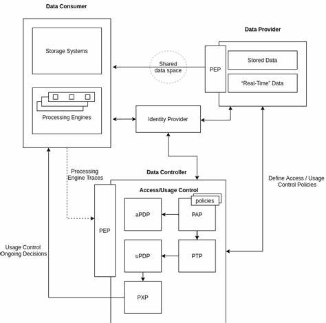{: width="100%"}

 See also [D], [Data Control]


## Data Analyst

 Focused on the tools.

 See also [D], [Data Scientist]


## Data Augmentation

 To use when you don't have enough data.

 Recommendations

  * For images, you can increase the number of samples by
    * flipping the image
    * zooming on the image
    * moving the image
    * cropping the image
  * With voice, you can
    * change the speech speed
    * change the volume
    * change the pitch.

/// warning | Beware:
    The transformation operation should be invariant and not change the output.
///
 
 See also [D], [Data], [Insufficient Data Algorithm], [Self-Supervised Learning], [Snorkel Program], [Zero-Shot Learning]


## Data Bias

 See [Dataset Bias]


## Data Center

 The rapid proliferation of data centers in the US - driven partly by the adoption of artificial intelligence - has set off alarm bells about the industry's environmental impact. We compiled detailed information on 2,132 US data centers operating between September 2023 and August 2024 and determined their electricity consumption, electricity sources, and attributable CO2e emissions. Our findings reveal that data centers accounted for more than 4% of total US electricity consumption - with 56% derived from fossil fuels - generating more than 105 million tons of CO2e (2.18% of US emissions in 2023). Data centers' carbon intensity - the amount of CO2e emitted per unit of electricity consumed - exceeded the US average by 48%. Our data pipeline and visualization tools can be used to assess current and future environmental impacts of data centers.

 

 More at:

  * papers
    * power consumption (2024) - [https://arxiv.org/abs/2411.09786v1](https://arxiv.org/abs/2411.09786v1)
  * articles
    * [https://www.technologyreview.com/2024/12/13/1108719/ais-emissions-are-about-to-skyrocket-even-further/](https://www.technologyreview.com/2024/12/13/1108719/ais-emissions-are-about-to-skyrocket-even-further/)

 See also [D], ...


## Data Cleaning

 ~ an aspect of [data preparation]

 See also [D], ...


## Data Collator

 See [Data Loader]


## Data Collection

 More at:

  * [https://thereader.mitpress.mit.edu/the-myth-of-objective-data/](https://thereader.mitpress.mit.edu/the-myth-of-objective-data/)

 See also [D], ...


## Data Commons Dataset

 In keeping with Google’s mission to organize the world’s information and make it universally accessible and useful, Data Commons offers a unified view of large-scale, public, statistical data, created by organizations across the world. Data Commons enables researchers, consumers, journalists, students, public policy and other key decision-makers to get high-level analytical answers to data questions, at the click of a button, and in your own words.

 Data Commons is not a repository of public datasets (such as Kaggle or Google Cloud BiqQuery Public Datasets). Instead, it is a single unified data source created by normalizing and aligning schemas and references to the same entities (such as cities, counties, organizations, etc.) across different datasets. Behind the scenes, Data Commons does the tedious work of finding data, understanding the data collection methodologies, cleaning the data, reconciling different formats and schemas, figuring out how to merge data about the same entity from different sources, and so on – saving organizations months of tedious, costly and error-prone work.

 For example, if you wanted to get population stats, poverty and unemployment rates of a specific county, you don’t need to go to three different datasets; instead, you can get the data from a single data source, using one schema, and one API. Data Commons is also used by Google Search whenever it can provide the most relevant statistical results to a query. 

 More at:

  * site - [https://datacommons.org/](https://datacommons.org/)
  * docs - [https://docs.datacommons.org/](https://docs.datacommons.org/)
  * tutorials - [https://docs.datacommons.org/api/python/tutorials.html](https://docs.datacommons.org/api/python/tutorials.html)
  * data sources - [https://docs.datacommons.org/datasets/](https://docs.datacommons.org/datasets/)

 See also [D], [DataGemma Model][Gemma Model], [Retrieval-Interleaved Generation]

 
## Data Consumer

 See also [D], [Data Access]


## Data Control

 The 3 dimensions of data control

  * [Data Access] - data portability rights
  * [Data Governance] - participatory schemes
  * [Data Usage Control] - consent mechanisms

 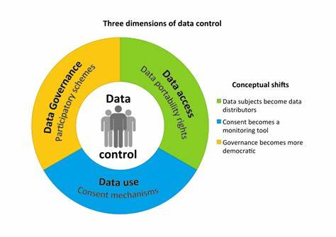{: width="100%"}

 See also [D], ...


## Data Controller

 See also [D], [Data Access], [Data Control]


## Data Development Life Cycle (DDLC)

 Develop the data first , but still protected

 Currently data is the exhaust of other processes that are not concerned with sharing clean data.

 See also [D], [Development Life Cycle], [Model Governance]


## Data Drift

 ~ when the data used during inference times does not have the same distribution as the data used on training. Greatly impact the [model stability]

 ~ aka Population drift

 In dynamic systems analysis, we can define a stable system as one that remains unchanged (or only slightly changed) in the presence of perturbations. Simply put, a stable system is robust to external changes.

 One way to measure the stability of our models is by checking the population or data drift, by evaluating how the population or the features have changed in the context of the model.

 There are several probable sources of population drift. Some examples can include

  * A change in the socio-economic relations, such as inflation, diseases, or political changes;
  * Unaccounted events, such as holidays, world cups, or even natural disasters;
  * The entrance of a new competitor in the market, and/or the shift of customers;
  * Changes in the offered product, or the marketing campaign.

 One less commented source of data and population drift is the use of the model itself. If you develop a model to solve a business problem and the solution is effective, the circumstances are changed and the model might not have the same performance!

 See also [D], ...


## Data Federation

 The opposite of a centralized data management, data warehouse.

 Pros:

  * Autonomy leads to full control

 Cons:

  * difficult to have a firmwide initiative
  * possibly not a single version of truth, duplication of data

 See also [D], [Data Management]


## Data Governance

 See also [D], [Data Control]


## Data Handling

 See also [D], [Hyperparameter]


## Data Lake

 See also [D], ...


## Data Leakage

 Data leakage is an umbrella term covering all cases where data that shouldn’t be available to a model in fact is. The most common example is when test data is included in the training set. But the leakage can be more pernicious: when the model uses features that are a proxy of the outcome variable or when test data come from a distribution which is different from the one about which the scientific claim is made.

 * When the answer is in the input!
 * When the model knows something in training that it won't know in production

 Solution: Look at the feature importance to find out if one of them is 100% predictive!

 More at:

   * explorable - [https://pair.withgoogle.com/explorables/data-leak/](https://pair.withgoogle.com/explorables/data-leak/)
   * [https://docs.google.com/presentation/d/1WrkeJ9-CjuotTXoa4ZZlB3UPBXpxe4B3FMs9R9tn34I/edit#slide=id.g164b1bac824_0_2980](https://docs.google.com/presentation/d/1WrkeJ9-CjuotTXoa4ZZlB3UPBXpxe4B3FMs9R9tn34I/edit#slide=id.g164b1bac824_0_2980)

 See also [D], [Model Threat Analysis]


## Data Loader

 Data loader turns input dataset into mini-batches that can be used for model training.

 

 More at:

  * pytorch code - [https://fabridamicelli.github.io/posts/2023-09-13-pytorch-dataloader-collate.html](https://fabridamicelli.github.io/posts/2023-09-13-pytorch-dataloader-collate.html)

 See also [D], ...


## Data Management

 * [Data Federation]
 * [Data Mesh]
 * [Data Lake]
 * [Data Warehouse]

 See also [D], ...


## Data Mesh

 See also [D], ...


## Data Pipeline

 

 See also [D], ...


## Data Point

 ~ an observation. Together the features and the label make a single data point. Imputation is a way to deal with missing data in data points.
 
 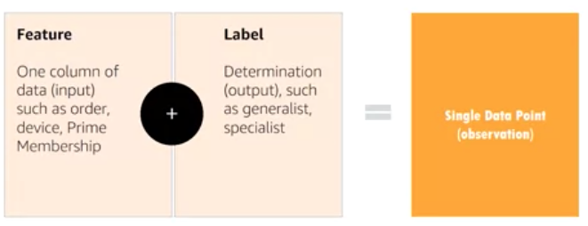{: width="100%"}

 See also [D], [Dataset], [Feature], [Imputation], [Label]


## Data Poisoning

 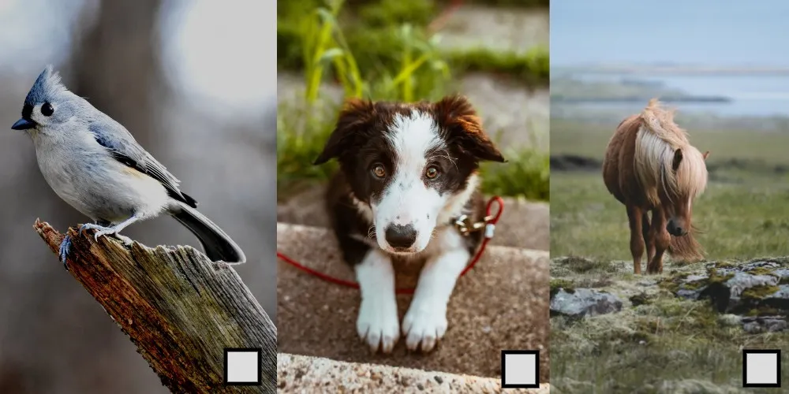{: width="100%"}

 More at:

  * [https://bdtechtalks.com/2020/10/07/machine-learning-data-poisoning/](https://bdtechtalks.com/2020/10/07/machine-learning-data-poisoning/)

 See also [D], ...


## Data Preparation

 ~ data preprocessing, a step in the [machine learning pipeline]

 Data preparation transforms the data into a format that is more easily and effectively processed in data mining, machine learning and other data science tasks. the techniques are generally used at the earliest staeges of the machine learning and AI development pipeline to ensure accurate results.

 Steps:

  * [Data Cleaning]
  * [Data Transformation]
    * [Encoding]
    * Feature scaling, including [Feature Normalization] and [Feature Standardization]
  * [Data Reduction]

 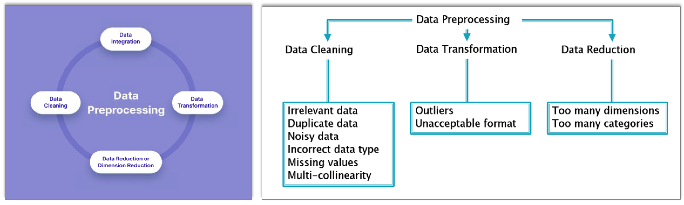{: width="100%"}

 See also [D], ...


## Data Provider

 See also [D], ...


## Data Reduction

 A step in [data preparation]

 See also [D], ...


## Data Science

 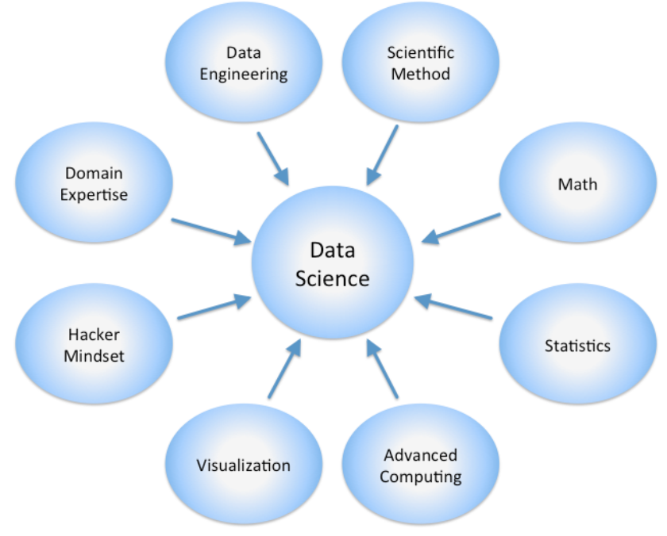{: width="100%"}

 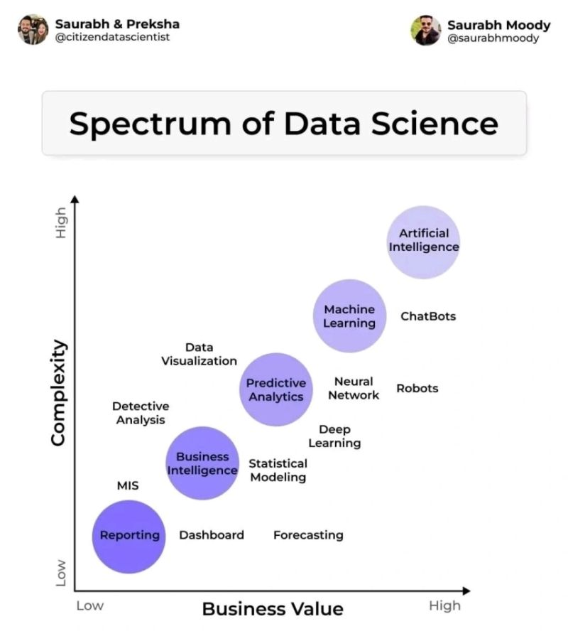{: width="100%"}

 Agree the potential for exponential value follows this graphic but each one of the bubbles can add tremendous value as a stand alone, i.e. should should not just focus on AI only because it is up and to the right. I agree with the summary in that the sweet spot is Low Effort / High Value.

 See also [D], ...


## Data Scientist

 Choose the toolset, not the cloud provider and database type!

  * data acquisition
  * data manipulation
  * data movement
  * ...

 See also [D], [Data Analyst], [DevOps]


## Data Transformation

 ~ a step in [data preparation]

 See also [D], ...


## Data Usage Control (DUC)

 It refers to a set of policies, mechanisms, and technologies that govern how data can be used after it has been shared or accessed. DUC systems help organizations:

  * Monitor data usage
  * Enforce usage restrictions
  * Track data flow
  * Ensure compliance with data protection policies
  * Control data access and distribution

 DUC is particularly important in enterprise environments, cloud computing, and scenarios where sensitive data needs to be shared while maintaining control over how it's used by recipients.

 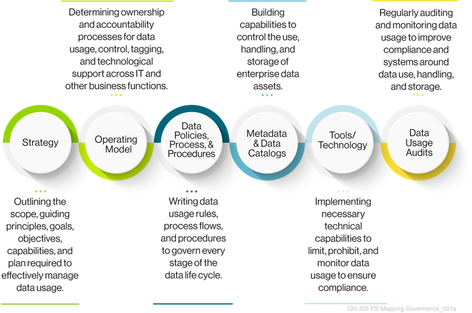{: width="100%"}

 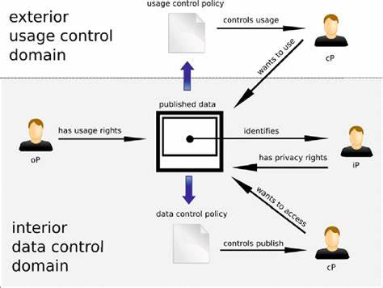{: width="100%"}

 More at:

  * articles
    * [https://guidehouse.com/insights/advanced-solutions/2022/mapping-exploding-data-terrain](https://guidehouse.com/insights/advanced-solutions/2022/mapping-exploding-data-terrain)

 See also [D], [Data Control], [Data Development Life Cycle], [Model Governance]


## Data Visualization

 

 More at:

  * [https://observablehq.com/@zanarmstrong](https://observablehq.com/@zanarmstrong)

 See also [D], ...


## Data Wall

 The fact that all humans generated data will soon be used in AI.

 The 2 solutions to bypath/alleviate this problem:

  * [Reinforcement learning (RL)][RL]
  * [Synthetic Data] generation

 See also [D], ...


## Data Warehouse

 Used to centralize the data in an organization

 See also [D], ...


## Data Wrangling

 The process of converting raw data into a usable form. It may also be called data munging or data remediation.
 You typically go through the data wrangling process prior to conducting any data analysis in order to ensure your data is reliable and complete.

 See also [D], ...


## Data-Centric AI (DCAI)

 Data-centric AI is the discipline of systematically engineering the data used to build an AI system. The opposite of [model-centric AI]

 

 

/// details | How to find errors automatically?
    type:question
///

 More at:

  * [https://datacentricai.org/](https://datacentricai.org/)
  * MIT CSAIL
    * syllabus - [https://dcai.csail.mit.edu/](https://dcai.csail.mit.edu/)
    * class - [https://dcai.csail.mit.edu/lectures/data-centric-model-centric/](https://dcai.csail.mit.edu/lectures/data-centric-model-centric/)
  * errors in open-source datasets - [https://labelerrors.com/](https://labelerrors.com/)

 See also [D], ...


## Data2Vec Algorithm

 A General Framework for Self-supervised Learning in Speech, Vision and Language. While the general idea of self-supervised learning is identical across modalities, the actual algorithms and objectives differ widely because they were developed with a single modality in mind. To get us closer to general self-supervised learning, we present data2vec, a framework that uses the same learning method for either speech, NLP or computer vision. The core idea is to predict latent representations of the full input data based on a masked view of the input in a self-distillation setup using a standard Transformer architecture. Instead of predicting modality-specific targets such as words, visual tokens or units of human speech which are local in nature, data2vec predicts contextualized latent representations that contain information from the entire input. Experiments on the major benchmarks of speech recognition, image classification, and natural language understanding demonstrate a new state of the art or competitive performance to predominant approaches.

 

 More at:

   * paper - [https://arxiv.org/abs/2202.03555](https://arxiv.org/abs/2202.03555)

 See also [D], [Self-Supervised Learning]


## Dataset

 A group of several observations. Good data must contain a signal of what you are trying to measure. Beware that data-set may be incomplete. For example, if you are trying to forecast inventory, you can look at sale's number, but the data needs to includes the times when the sale did not happen because we run out of inventory! Dataset needs to be at least 10 times the number of features. The dataset is split in 3 subsets called the training subset, the development subset, and the test subset. If you have a lot of data 70% goes to the training, 15% to the dev, and 15% to the test. If not much data, 80% goes to training, 10% and 10%. 

 Training datasets

  * statistics
    * [Data Commons] - brings together the world's public data, harmonized for your exploration
  * images
    * [MNIST] - Digits for zip codes
    * [CIFAR] - 10+ categories
    * [ImageNet] - ...
    * others - [https://knowyourdata-tfds.withgoogle.com/](https://knowyourdata-tfds.withgoogle.com/)
  * image to text
    * [LAION] - 5 billion images paired with their caption, useful for CLIP models
  * audio sequences
    * [https://github.com/LAION-AI/audio-dataset](https://github.com/LAION-AI/audio-dataset)
  * text, aka [corpus]
    * [C4]
  * sentences
  * words
    * [WordNet]

 Benchmark datasets

  * books
    * [TriviaQA] - QA to test reading comprehension 
  * video
    * [HourVideo] - QA to test video summarization, perception, and visual reasoning
  * math
    * [GSM8K] - Grade school math word problems for math reasoning
  * science
    * [ScienceQA] - covers natural science, language science, social science

 Other

  * Instruction following
    * [Self-Instruct] -

 More at

  * Dataset sources (cleaned)
    * [https://huggingface.co/datasets](https://huggingface.co/datasets)
    * [https://www.kaggle.com/datasets](https://www.kaggle.com/datasets)
    * [https://paperswithcode.com/datasets](https://paperswithcode.com/datasets)
    * [https://scikit-learn.org/stable/datasets.html](https://scikit-learn.org/stable/datasets.html)
  * tools
    * know your data
      * blog - [https://blog.research.google/2021/08/a-dataset-exploration-case-study-with.html](https://blog.research.google/2021/08/a-dataset-exploration-case-study-with.html)
      * site - [https://knowyourdata.withgoogle.com/](https://knowyourdata.withgoogle.com/)

 See also [D], [Data Point], [Development Subset], [GINI Impurity Index], [Testing Set], [Training Set]


## Dataset Bias

 ~ a form of [bias] that is introduced by [datasets] and that can lead to [AI bias]. An error (or errors) in the data a computer system uses that results in inaccurate, misleading, or unfair results.

 Dataset bias, also known as data bias, refers to the presence of systematic and unfair inaccuracies or imbalances in a dataset used for machine learning, statistical analysis, or data-driven decision-making. Dataset bias can result in models or algorithms that make inaccurate predictions or exhibit unfair behavior because the training data does not accurately represent the real-world population or scenario they are meant to address.

 Dataset bias can manifest in various ways:

  * Underrepresentation: Underrepresentation occurs when certain categories or groups within the dataset are inadequately represented. For example, if you're training a facial recognition algorithm, and the dataset contains a disproportionate number of images of people with light skin compared to people with dark skin, the algorithm may perform poorly on the latter group.
  * Sampling Bias: Sampling bias arises when the data collection process is not random or the sample selection is flawed. For example, if a political poll is conducted by calling only landline numbers, it may not accurately represent the broader population, leading to sampling bias.
  * Labeling Bias: Labeling bias occurs when the labels or annotations in the dataset are influenced by human biases or errors. For instance, in a text classification dataset, if the annotators have political biases that affect their labeling, the resulting model may inherit those biases.
  * Historical Bias: This type of bias is present when the dataset reflects past practices and biases. For example, in criminal justice, historical bias may exist in arrest and sentencing data, which can lead to models that unfairly target or discriminate against certain demographics.
  * Measurement Bias: Measurement bias results from errors or inaccuracies in the data collection process or measurement instruments. For instance, in climate data, a miscalibrated temperature sensor can introduce measurement bias.
  * Survivorship bias
  * Cognitive bias = anchoring effect + confirmation bias + framing effect + ...

 Addressing dataset bias is essential to develop models and algorithms that are fair, accurate, and representative of the real-world scenarios they are meant to handle. To mitigate dataset bias, data scientists and machine learning practitioners should:

  * Carefully curate and preprocess datasets, paying attention to potential sources of bias.
  * Collect diverse and representative data, and use techniques like oversampling to address underrepresented groups.
  * Implement fairness-aware machine learning methods to ensure that models do not exhibit discriminatory behavior.
  * Be transparent about the limitations and potential biases of the dataset when using machine learning for decision-making.

 

 More at:

  * [https://medium.com/@nahmed3536/data-bias-what-all-data-practitioners-should-be-aware-of-115eaeae48c](https://medium.com/@nahmed3536/data-bias-what-all-data-practitioners-should-be-aware-of-115eaeae48c)
  * examples:
    * [https://pair.withgoogle.com/explorables/hidden-bias/](https://pair.withgoogle.com/explorables/hidden-bias/)

 See also [D], [Artefact]


## Dataset Size Efficient Frontier

 One of the 3 [Neural Scaling Laws]

 See also [D], ...


## David Luan Person

 CEO of [Adept AI]

 See also [D], ...


## Dawid-Skene Algorithm

 When you crowdsource a labeling task, how can you be certain that the label is correct? Have several people label the same image/entry and apply this algorithm! An alternative is to use majority vote algorithm.

 More at:

  * sample coded example - [https://github.com/Ekeany/Dawid-Skene](https://github.com/Ekeany/Dawid-Skene)
  * fast dawid-skene paper - [https://deepai.org/publication/fast-dawid-skene](https://deepai.org/publication/fast-dawid-skene)

 See also [D], [Labeling Service], [Majority Vote Algorithm]


## DBSCAN Algorithm

 A clustering algo that can work with embedded clusters.

 To use for clustering when the [k-means clustering algorithm] fails. With k-Means, we look for round clusters. With DBSCAN, the radius (epsilon) is from every point in the cluster ==> the cluster shape does not need to be round! If epion is too large --> gigantic cluster. If too small, --> ...

 Hyperparameter:

  * radius
  * core point to proximal points
  * non-core point to proximal points
  * outliers

 

 See also [D], ...


## Decision Boundary

 Can be a circle, a square, a plane and is used in a decision tree. In fact, it can be any shape! A neural netowkr will use the weights and activation function to lower the loss function to find the "perfect" boundary.

 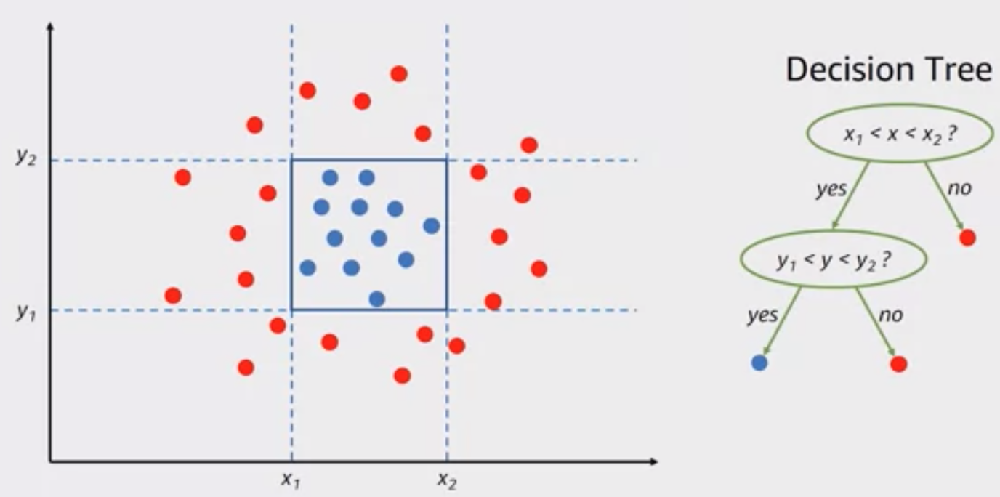{: width="100%"}

 See also [D], [Activation Function], [Classification], [Decision Tree], [Hyperplane], [Logistic Regression]


## Decision Forest

 An [ensemble] of [decision trees].

 See also [E], ...


## Decision Stump

 A [decision tree] with only one split.

 See also [D], [AdaBoost]


## Decision Tree

 ~ a type of algorithm a computer follows to make a decision or prediction based on specific rules.

 Decision trees are [White Box Models] that Can be used for regression and classification.

  * classification:  Go from the root node to the leaf of the tree where is the classification.
  * regression: use the mean square error (MSE)

  Hyperparameters:

  * Metric measuring quality of split
  * ...

 

 More at:

  * regression tree - [https://medium.com/analytics-vidhya/regression-trees-decision-tree-for-regression-machine-learning-e4d7525d8047](https://medium.com/analytics-vidhya/regression-trees-decision-tree-for-regression-machine-learning-e4d7525d8047)

 See also [D], [Classification], [Decision Stump], [Regression]


## Decoder

  * Use masked attention ( = only access to a single context, i.e. right or left context)
 Good for
  * natural language generation, generative AI

 

 See also [D], [Autoregressive Model], [Decoder Stack], [Encoder], [Encoder-Decoder Model], [Hidden State], [Image Decoder], [Masked Self-Attention], [Natural Language Generation]


## Decoder Representation
 
 This is ... as close to the original as possible (after the encoding-decoding process) <-- this is only true if the decoder space is the same as the input encoder space!!!

 See also [D], ...


## Decoder Representation Space

  * Pixel space

 See also [D], [Encoder Representation Space], [Representation Space]


## Decoder Stack

 See also [D], [Decoder], [Encoder-Decoder Model], [Encoder Stack], [Hidden State]


## Deconvolution Neural Network

 The decoder part of a convolutional autoencoder.

 See also [D], [Convolution Autoencoder], [Convolutional Neural Network]


## Deductive Reasoning

 ~ applying rules

 Sherlock Holmes!

 See also [D], [Abductive Reasoning], [Inductive Reasoning]


## Deep Belief

 A type of neural network.

 See also [D], [Neural Network]


## Deep Belief Network (DBN)

 See also [D], [Boltzmann Machine]


## Deep Blue Challenge

 Garry Kasparov vs. Deep Blue in 1996 and 1997. Deep blue is an [heuristic-basedi][Heuristic] game-playing program.

 

 

 More at:

  * [https://www.sciencedirect.com/science/article/pii/S0004370201001291](https://www.sciencedirect.com/science/article/pii/S0004370201001291)

 See also [D], [AI Challenge]


## Deep Brain

 Combination of a brain scan and a [diffusion model] ?

 

 

 

 More at:

  * home - [https://sites.google.com/view/stablediffusion-with-brain/home](https://sites.google.com/view/stablediffusion-with-brain/home) 
  * paper - [https://www.biorxiv.org/content/10.1101/2022.11.18.517004v2](https://www.biorxiv.org/content/10.1101/2022.11.18.517004v2)
  * FAQ - [https://sites.google.com/view/stablediffusion-with-brain/faq_en](https://sites.google.com/view/stablediffusion-with-brain/faq_en)
  * [https://github.com/yu-takagi/StableDiffusionReconstruction](https://github.com/yu-takagi/StableDiffusionReconstruction)

 See also [D], [BCI Interface]


## Deep Convolutional GAN (DC-GAN)

 A type of GAN for ... This is the first GAN where the generator used deep convolutional network , hence generating high resolution and quality images to be differentiated. Rectified Linear Unit (ReLU) activation is used in Generator all layers except last one where Tanh activation is used, meanwhile in Discriminator all layers use the Leaky-ReLu activation function. Adam optimizer is used with a learning rate of 0.0002.

 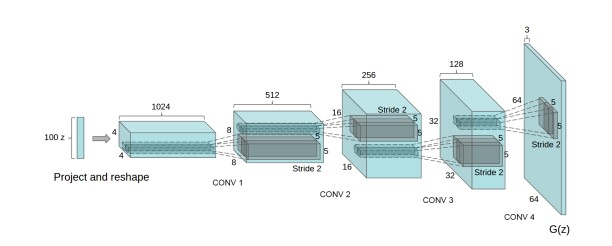{: width="100%"}

 The above figure shows the architecture of generator of the GAN. The input generated is of 64 X 64 resolution.

 See also [D], [Generative Adversarial Network], [Rectified Linear Unit]


## Deep Deterministic Policy Gradient (DDPG) Algorithm

 DDPG, or Deep Deterministic Policy Gradient, is an actor-critic, model-free algorithm based on the deterministic policy gradient that can operate over continuous [action spaces]. It combines the actor-critic approach with insights from [Deep Q-Networks]: in particular, the insights that 1) the network is trained off-policy with samples from a replay buffer to minimize correlations between samples, and 2) the network is trained with a target Q network to give consistent targets during temporal difference backups. DDPG makes use of the same ideas along with [batch normalization].

 

 

 

 More at:

  * paper - [https://arxiv.org/abs/1509.02971v6](https://arxiv.org/abs/1509.02971v6)
  * code - [https://paperswithcode.com/method/ddpg](https://paperswithcode.com/method/ddpg)

 See also [D], ...


## Deep Equilibrium Model

 See also [D], ...


## Deep Learning

 A branch of AI, a sub branch of [machine learning] with [neural networks][Neural Network]! Use layers of non-linear processing units for feature extraction and transformation. Each layer use the output from the previous layer. May be [supervised][Supervised Learning] or [unsupervised learning]. Applications include pattern analysis (unsupervised) or [classification] (supervised or unsupervised).

 See also [D], [Deep Learning Framework]


## Deep Learning Framework

 From deep learning revolution that started ~ 2007.

 See also [D], [Caffe], [MXNET], [PyTorch ML Framework], [TensorFlow ML Framework]


## Deep Multi-Task Learning

 See also [D], ...


## Deep Neural Network (DNN)

 A deep neural network (DNN) is an [artificial neural network (ANN)][ANN] with multiple layers between the input and output layers. The DNN finds the correct mathematical manipulation to turn the input into the output, whether it be a linear relationship or a non-linear relationship. The network moves through the layers calculating the probability of each output.

 See also [D], ...


## Deep Q-Learning (DQL) Algorithm

 [Deep Q-learning (DQN)][DQN] is an extension of the basic [Q-learning algorithm] that uses deep neural networks as function approximators to estimate the [Q-values], also known as the [Q-Value function]..

 [Reinforcement Learning] involves managing state-action pairs and keeping a track of value ([reward]) attached to an action to determine the optimum policy. This method of maintaining a state-action-value table is not possible in real-life scenarios when there are a larger number of possibilities. Instead of utilizing a table, we can make use of Neural Networks to predict values for actions in a given [state].

 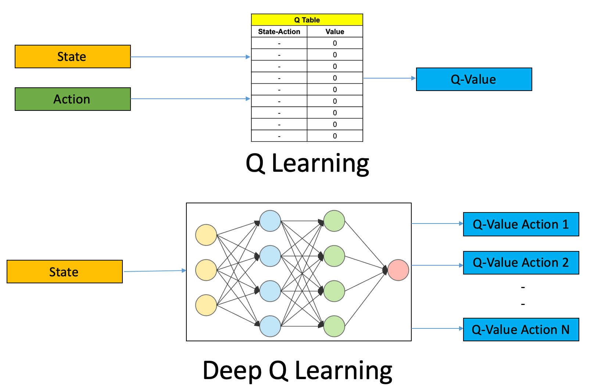{: width="100%"}

 

 More at:

  * code - [https://github.com/simoninithomas/Deep_reinforcement_learning_Course/tree/master/Q%20learning](https://github.com/simoninithomas/Deep_reinforcement_learning_Course/tree/master/Q%20learning)
  * articles
    * [https://www.v7labs.com/blog/deep-reinforcement-learning-guide](https://www.v7labs.com/blog/deep-reinforcement-learning-guide)

 See also [D], ...


## Deep Q-Network (DQN)

 Used as an approximation for the [Q-Value function] when the number of state is large (action count is often limited or much smaller than the state count). The name of the neural network that approximate a [Q-Value function].

 Use this algorithm when

  * [Model-free RL] learning
  * Off-policy learning
  * Discrete [action space]
  * Continuous [state space]
  * [Q-value] operator

 {: width="100%"}

 We understand that the input layer of the DNN has the same size than a state size and that the output layer has the size of the number of actions that the agent can take. In other words, the output is the Q-value vector for each action that can be taken from that state. That is if there are only 4 actions: Q(s,a_1), Q(s, a_2), Q(s, a_3), Q(a, a_4).

 DQN training ==> find the optimal policy by approximating the Q-function

  1. initialize [replay memory] capacity
  2. initialize the network with random weights
  3. for each [episode]
     1. initialize the starting state
     2. for each time step:
        1. Select an [action]via [exploration] or [exploitation]
        2. Execute selected action in an emulator
        3. Observe reward and next state
        4. Store experience in replay memory. Review [Bellman Equation] !
        5. Sample random [batch] from [replay memory]
        6. Preprocess states from batch
        7. Pass batch of preprocessed states to [policy] network
        8. Calculate loss between output [Q-values] and target [Q-values]
           * Requires a second pass to the network for the next state
        9. [Gradient descent] updates weights in the policy network to minimize loss.

 Beware: weights are calculated using the [stochastic gradient descent] AND [backpropagation] (as other neural networks)

 

 

 More at:

  * [https://deeplizard.com/learn/video/0bt0SjbS3xc](https://deeplizard.com/learn/video/0bt0SjbS3xc)
  * [https://towardsdatascience.com/deep-q-networks-theory-and-implementation-37543f60dd67](https://towardsdatascience.com/deep-q-networks-theory-and-implementation-37543f60dd67)
  * [https://towardsdatascience.com/welcome-to-deep-reinforcement-learning-part-1-dqn-c3cab4d41b6b](https://towardsdatascience.com/welcome-to-deep-reinforcement-learning-part-1-dqn-c3cab4d41b6b)

 See also [D], ...


## Deep RL

 [Reinforcement Learning (RL)] where the [policy] and [reward] are [deep neural networks].

 

 More at:

  * [https://huggingface.co/learn/deep-rl-course/unit0/introduction](https://huggingface.co/learn/deep-rl-course/unit0/introduction)

 See also [D], ...


## DeepAR Forecasting

 Based on neural network. `Time series forecasting` (ex number of units sold). Model needs to be trained, i.e. supervised. Integrated with Sagemaker. Lots of hyperparameters. Tuning is very important.

 See also [D], ...


## Deepchecks Company

 Evaluate [LLM] and [RAG systems] based on

  * Relevancy
  * Toxicity
  * Hallucination
  * Sentiment
  * Correctness
  * Reading ease
  * grounded in context
  * Subjectivity
  * Relevance
  * Completeness
  * Correctness
  * Retrieval relevance

 Can also do penetration testing

  * DAN
  * DAN Jailbreak
  * ...

 

 


 More at:

  * site - [https://www.deepchecks.com/](https://www.deepchecks.com/)

 See also [D], ...


## Deepfake

 Deepfakes (a portmanteau of "deep learning" and "fake") are synthetic media in which a person in an existing image or video is replaced with someone else's likeness. While the act of creating fake content is not new, deepfakes leverage powerful techniques from machine learning and artificial intelligence to manipulate or generate visual and audio content that can more easily deceive. The main machine learning methods used to create deepfakes are based on deep learning and involve training generative neural network architectures, such as autoencoders, or generative adversarial networks (GANs).

 Deepfakes have garnered widespread attention for their potential use in creating child sexual abuse material, celebrity pornographic videos, revenge porn, fake news, hoaxes, bullying, and financial fraud. This has elicited responses from both industry and government to detect and limit their use.

 From traditional entertainment to gaming, deepfake technology has evolved to be increasingly convincing and available to the public, allowing the disruption of the entertainment and media industries.

 

 More at:

  * [https://en.wikipedia.org/wiki/Deepfake](https://en.wikipedia.org/wiki/Deepfake)

 See also [D], [AI Avatar]


## Deepfold Model

 More at:

  * code - [https://github.com/lulab/Deepfold](https://github.com/lulab/Deepfold)

 See also [D], [AlphaFold Model]


## DeepMind Company

 People:

  * [Demis Hassabis]
  * [Mustafa Suleyman]
  * [Shane Legg]

 Models:

  * [AlphaCode] - LLM for code generation
  * [AlphaFold] - Protein folding
  * [AlphaGeometry] - Agent to play Go
  * [AlphaGo] - Agent to play Go
  * [AlphaStar] - Agents to play StarCraft 2
  * [AlphaTensor] - Matrix multiplication algorithm optimization
  * [AlphaZero]
  * [Chinchilla] - Optimized version of the [Gopher Model]
  * [DeepNash] - Mastering Stratego, the classic game of imperfect information
  * [Flamingo] - A [visual language model]
  * [Gato] - Multi-task generalist agent
  * [Gopher] - A LLM with same (or better) performance than [GPT-3]
  * [Sparrow] - A ChatGPT alternative

 

 More at :

  * [https://www.deepmind.com/research](https://www.deepmind.com/research)
  * publications - [https://www.deepmind.com/research/publications](https://www.deepmind.com/research/publications)

 See also [D], ...


## DeepNash Model

 A model developed by [DeepMind] to Mastering Stratego, the classic game of imperfect information.

 DeepNash learns to play Stratego from scratch by combining game theory and model-free deep RL

 More at:

  * Paper in science - [https://www.science.org/stoken/author-tokens/ST-887/full](https://www.science.org/stoken/author-tokens/ST-887/full)
  * announcment - [https://www.deepmind.com/blog/mastering-stratego-the-classic-game-of-imperfect-information](https://www.deepmind.com/blog/mastering-stratego-the-classic-game-of-imperfect-information)

 See also [D], ...


## DeepSeek Model

 More at:

  * site - [https://www.deepseek.com/](https://www.deepseek.com/)

 See also [D], ...


## DeepSpeed Project

 A ... built by [Microsoft] ?

 

 More at :
  * [https://github.com/microsoft/DeepSpeed](https://github.com/microsoft/DeepSpeed)

 See also [D], ...


## DeepWalk

 In 2014 ...

 

 

 See also [D], [FastRP], [Node2Vec]


## Delayed Reward

 ==You must reward for the correct outcome!== Do not only reward for the completion of an assignment, but for passing the final exam. Ex: In chess, what matters is winning the game, not really how many piece you have kept at the end!

 See also [D], [Addiction], [Reinforcement Learning], [Reward Shaping]


## Demis Hassabis Person

 One of the 3 founders of [DeepMind]

 

 

 

 See also [D], ...


## Dendrocentric AI

 Computing based on [Dendrites][Dendrite]

 More at:

  * [https://spectrum.ieee.org/dendrocentric-learning](https://spectrum.ieee.org/dendrocentric-learning)
  * [https://www.nature.com/articles/s41586-021-04362-w](https://www.nature.com/articles/s41586-021-04362-w)

 See also [D], ...


## Dendrite

 See also [D], [Biological Neuron]


## Denoising Autoencoder

```
input + noise --> ENCODER --(latent space)--> DECODER ---> output

with loss function computed from (output - input)
==> the autoencoder tries to remove the noise from the original image!
```

 See also [D], [Autoencoder], [Loss Function]


## Denoising Diffusion Policy Optimization (DDPO)

 ~ PPO for diffusion models?

 ~ Each denoising step is an action. Reward on the final generated image.

 We train diffusion models directly on downstream objectives using [reinforcement learning (RL)][RL]. We do this by posing denoising diffusion as a multi-step decision-making problem, enabling a class of policy gradient algorithms that we call denoising diffusion policy optimization (DDPO). We use DDPO to finetune [Stable Diffusion] on objectives that are difficult to express via prompting, such as image compressibility, and those derived from human feedback, such as aesthetic quality. We also show that DDPO can be used to improve prompt-image alignment without any human annotations using feedback from a vision-language model.

 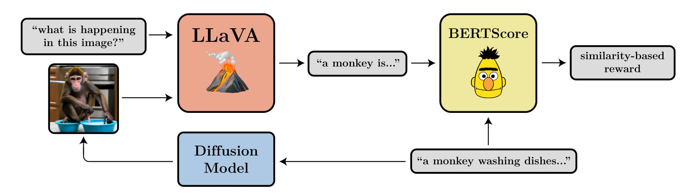{: width="100%"}

 More at:

  * site - [https://rl-diffusion.github.io/](https://rl-diffusion.github.io/)

 See also [D], ...


## Denoising Diffusion Probabilistic Model (DDPM)

 See [Diffusion Model]


## Dense Layer

 ~ each input neuron/layer is connected to each output neuron/layer + nonlinear activation function

 ~ aka Fully Connected or FC layer

 In any neural network, a dense layer is a layer that is deeply connected with its preceding layer which means the neurons of the layer are connected to every neuron of its preceding layer. This layer is the most commonly used layer in artificial neural network networks. As discussed before, results from every neuron of the preceding layers go to every single neuron of the dense layer. So we can say that if the preceding layer outputs a (M x N) matrix by combining results from every neuron, this output goes through the dense layer where the count of neurons in a dense layer should be N.

 See also [D], [Dense Model], [Discriminator], [U-Net Architecture]


## Dense Model

 Most of today’s models are “dense,” which means the whole neural network activates to accomplish a task, regardless of whether it’s very simple or really complicated.

 See also [D], [Dense Layer]


## Depth Map

 Can be built with

  * [Neural Radiance Field] model
  * ...

 See also [D], ...


## Derivative Chain Rule

 A fundamental rule of calculus that is used to do [backpropagation] starting from the [loss function].

```
f'(x) = f'(g(x)) * g'(x)
```

 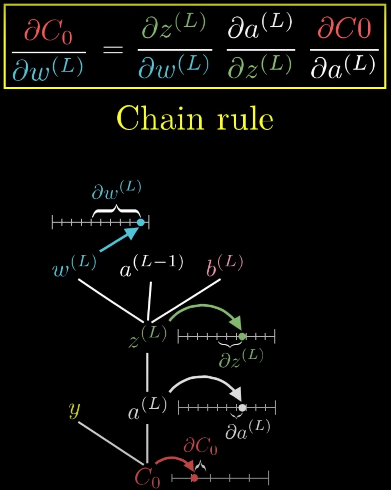{: width="100%"}

```
aL = activation/output at layer L
bL = bias at layer/percepton L
wL = weight at layer L

zL = wL * aL-1 + bL
aL = activation_function(zL)          <== zero activated as bias is already in zL

Cost = ( aL - yDESIRED)^2             <== yDESIRED determines the weights

==> dC/dwL  == change/nudge in cost/loss function due to a change/nudge in wL (weight)
but using chain rule, this is easy to compute as

Let's start with 1 sample
dCk/daL = 2 ( aL - yDESIRED)                              <== k is index or sample number
daL/dzL = derivative_of_activation_function ( zL )
dzL/dwL = aL-1

Now with all the samples
dC/dwL =  sum(0,nb_samples-1, dCk/dwL) / nb_samples

We need to do this for

* dC/daL-1                     <== backpropagate
* dC/dbL                       <== compute the bias L as well with backpropagation !!!!
```

 

 See also [D], ...


## Describe Explain Plan Select (DEPS) Prompting

 A [prompt engineering] technique

 We investigate the challenge of task planning for multi-task embodied agents in open-world environments. Two main difficulties are identified: 1) executing plans in an open-world environment (e.g., Minecraft) necessitates accurate and multi-step reasoning due to the long-term nature of tasks, and 2) as vanilla planners do not consider how easy the current agent can achieve a given sub-task when ordering parallel sub-goals within a complicated plan, the resulting plan could be inefficient or even infeasible. To this end, we propose "D⎯⎯⎯escribe, E⎯⎯⎯xplain, P⎯⎯⎯lan and S⎯⎯elect" (DEPS), an interactive planning approach based on Large Language Models (LLMs). DEPS facilitates better error correction on initial LLM-generated plan by integrating description of the plan execution process and providing self-explanation of feedback when encountering failures during the extended planning phases. Furthermore, it includes a goal selector, which is a trainable module that ranks parallel candidate sub-goals based on the estimated steps of completion, consequently refining the initial plan. Our experiments mark the milestone of the first zero-shot multi-task agent that can robustly accomplish 70+ Minecraft tasks and nearly double the overall performances. Further testing reveals our method's general effectiveness in popularly adopted non-open-ended domains as well (i.e., ALFWorld and tabletop manipulation). The ablation and exploratory studies detail how our design beats the counterparts and provide a promising update on the 𝙾𝚋𝚝𝚊𝚒𝚗𝙳𝚒𝚊𝚖𝚘𝚗𝚍 grand challenge with our approach.

 

 More at:

  * paper - [https://arxiv.org/abs/2302.01560](https://arxiv.org/abs/2302.01560)
  * code - [https://github.com/CraftJarvis/MC-Planner](https://github.com/CraftJarvis/MC-Planner)
  * team - [https://github.com/CraftJarvis](https://github.com/CraftJarvis)
  * site - [https://craftjarvis.github.io/](https://craftjarvis.github.io/)

 See also [D], ...


## Deterministic Node

 A node whose output is the same given a set of inputs. Works unlike a stochastic node! 

 See also [D], [Stochastic Node], [Variational Autoencoder Reparametrization Trick]


## Detokenizer

 See also [D], ...


## Development Life Cycle

 * [Product Development Life Cycle (PDLC)][PDLC]
 * [Software Development Life Cycle (SDLC)][SDLC]
 * [Model Development Life Cycle (MDLC)][MDLC]
 * [Data Development Life Cycle (DDLC)][DDLC]

 See also [D], [Model Governance]


## Detokenier

 See also [D], [SentencePiece Tokenizer]


## Development Subset

 Use to test the model built with the [training set] before it is run on the test subset.

 See also [D], [Dataset], [Test Set]


## DevOPS

 See also [D], [Data Analyst], [Data Scientist]


## DGX Cloud

 The cloud platform offered by [Nvidia]

  * site - [https://www.nvidia.com/en-in/data-center/get-dgx/](https://www.nvidia.com/en-in/data-center/get-dgx/)

 See also [D], ...


## DGX-1 System

 The first system developed by [Nvidia] to do Deep Learning

 More at:

  * site - [https://www.nvidia.com/en-in/data-center/dgx-1/](https://www.nvidia.com/en-in/data-center/dgx-1/)

 See also [D], ...


## Differential Optimization

 An alternative to deep learning models to solve constrained optimization.

 

 See also [D], ...


## Differential Privacy

 Differential privacy is the technology that enables researchers and database analysts to avail a facility in obtaining the useful information from the databases, containing people's personal information, without divulging the personal identification about individuals. This can be achieved by introducing a minimum distraction in the information, given by the database.

 Examples:

  * Apple employs differential privacy to accumulate anonymous usage insights from devices like iPhones, iPads and Mac.
  * Amazon uses differential privacy to access user’s personalized shopping preferences while covering sensitive information regarding their past purchases.
  * Meta uses it to gather behavioral data for target advertising campaigns without defying  any nation’s privacy policies.

 For example, consider an algorithm that analyzes a dataset and compute its statistics such as mean, median, mode, etc. Now, this algorithm can be considered as differentially private only if via examining at the output if a person cannot state whether any individual’s data was included in the actual dataset or not.

 In simplest form, the differentially private algorithm assures that there is hardly a behaviour change when an individual enlists or moves the datasets. Or simply, the algorithm might produce an output, on the database that contains some individual’s information, is almost the same output that a database generates without having individuals’ information. This assurance holds true for any individual or any dataset. 

 Thus, regardless of how particular an individual’s information is, of the details of any other person in the database, the guarantee of differential privacy holds true and provides a formal assurance that individual-level information about participants in the database would be preserved, or not leaked.

 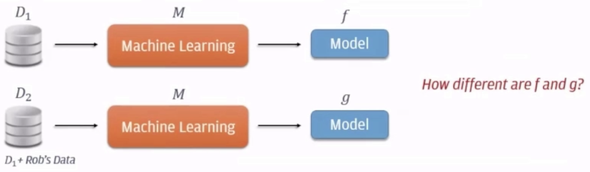{: width="100%"}

 Methods:

  * output perturbation (works for all cases since treat the model as a black box?)
  * gradient perturbation (works for neural network only)

 

 More at:

  * paper - [https://arxiv.org/abs/1607.00133](https://arxiv.org/abs/1607.00133)
  * articles
    * [https://www.analyticssteps.com/blogs/what-differential-privacy-and-how-does-it-work](https://www.analyticssteps.com/blogs/what-differential-privacy-and-how-does-it-work)

 See also [D], [Gradient Perturbation], [Membership Inference Attack], [Output Perturbation]


## Diffractive Neural Network (DNN)

 DIFFRACTIVE NEURAL NETWORKS, which are in the early Prototype Stage, is the field of research concerned with creating the world's first physical passive neural networks by 3D Printing them, rather than programming them, and using light waves, not electrons, to perform machine learning tasks, such as image analysis, feature detection and object classification, at the speed of light without the need to rely on any external compute or power source. Recently there have been a couple of interesting breakthroughs in the space, in the automated production of these types of neural networks, and their low cost, and ease of deployment, which makes them potentially a very interesting twist on a popular technology.

 DEFINITION 

 * Diffractive Neural Networks is a form of physical Artificial Intelligence that is printed and encoded into physical objects rather than being manifested in machine code.

 EXAMPLE USE CASES

 * Today the first prototype Diffractive Neural Networks are being used in image detection, image analysis, and object classification to test the theory and refine the technology. In the future the primary use case of the technology will be passive neural network applications where speed is useful or important.

 FUTURE TRAJECTORY AND REPLACABILITY

 * Over the next decade interest in the field will continue to
accelerate, and interest and investment will continue to grow, albeit from a very low base, primarily led by university grants. In time the technology will continue to be refined and proven with researchers looking into new ways to produce and manufacture these kinds of networks automatically and at
speed.

 * While Diffractive Neural Networks are in the early Prototype Stage, over the long term it will be enhanced by advances in 3D Printing and Nano-Manufacturing, but at this point in time it is not clear what it will be replaced by.

 See also [D], ...


## Diffusion Model (DM)

 There are a few downsides to Diffusion models: they work sequentially on the whole image, meaning that both the training and inference times are expansive. This is why you need hundreds of GPUs to train such a model and why you wait a few minutes to get your results. they are iterative models that take random noise as inputs, which can be conditioned with a text or an image, so it is not completely random noise. It iteratively learns to remove this noise by learning what parameters the model should apply to this noise to end up with a final image. So the basic diffusion models will take random noise with the size of the image and learn to apply even further noise until we get back to a real image.

 {: width="100%"}

 This is possible because the model will have access to the real images during training and will be able to learn the right parameters by applying such noise to the image iteratively until it reaches complete noise and is unrecognizable. Then, when we are satisfied with the noise we get from all images, meaning that they are similar and generate noise from a similar distribution, we are ready to use our model in reverse and feed it similar noise in the reverse order to expect an image similar to the ones used during training.

 At this time, the most popular diffusion models are:

  * [Dall-E] by [OpenAI]
  * [Midjourney] by ...
  * [Stable Diffusion] by [Stability AI]

 and

  * [ZF Diffusion] for protein generation

 

 

 More at:

  * what are diffusion models - [https://lilianweng.github.io/posts/2021-07-11-diffusion-models/](https://lilianweng.github.io/posts/2021-07-11-diffusion-models/)
  * diffusion thermo model - [https://arxiv.org/pdf/1503.03585.pdf](https://arxiv.org/pdf/1503.03585.pdf)
  * Diffusion Models Beat GANs on Image Synthesis - [https://arxiv.org/pdf/2105.05233.pdf](https://arxiv.org/pdf/2105.05233.pdf)
  * Denoising Diffusion Probabilistic Models - [https://arxiv.org/pdf/2006.11239.pdf](https://arxiv.org/pdf/2006.11239.pdf)
  * Improved Denoising Diffusion Probabilistic Models - [https://arxiv.org/pdf/2102.09672.pdf](https://arxiv.org/pdf/2102.09672.pdf)
  * Hugging face library - [https://colab.research.google.com/github/huggingface/notebooks/blob/main/diffusers/diffusers_intro.ipynb](https://colab.research.google.com/github/huggingface/notebooks/blob/main/diffusers/diffusers_intro.ipynb)

 See also [D], [Generative Model], [Latent Diffusion Model]


## Diffusion Process

 Coming from the real pgysical diffusion process, but for adding noise to an image.

 See also [D], [Diffusion Model], [Latent Diffusion]


## Digital Immortality

 See also [D], ...


## Digital Human

 

 More at:

  * [https://www.soulmachines.com/](https://www.soulmachines.com/)
  * [https://www.digitalhumans.com/](https://www.digitalhumans.com/)

 See also [D], ...


## Digital Object Identifier (DOI)

 A DOI (Digital Object Identifier) is a unique and never-changing string assigned to online (journal) articles, books, and other works. DOIs make it easier to retrieve works, which is why citation styles, like APA and MLA Style, recommend including them in citations.

 DOIs are important in academic citation because they are more permanent than URLs, ensuring that your reader can reliably locate the source. Journal articles and ebooks can often be found on multiple different websites and databases. The URL of the page where an article is hosted can be changed or removed over time, but a DOI is linked to the specific document and never changes.

 You may find DOIs formatted in various ways:

```
doi:10.1080/02626667.2018.1560449
https://doi.org/10.1111/hex.12487
https://dx.doi.org/10.1080/02626667.2018.1560449
https://doi.org/10.1016/j.jpsychires.2017.11.014
```

 More at:

  * [https://www.scribbr.com/citing-sources/what-is-a-doi/](https://www.scribbr.com/citing-sources/what-is-a-doi/)

 See also [D], ...


## Digital Watermark

 Digital watermarking is a method of embedding information into a digital signal in a way that is difficult to remove, but can be detected. This information can be used to identify the source of the digital signal, or to prevent unauthorized copying or tampering. Digital watermarks are often used to protect copyrights in digital media, such as images, audio, or video.

 More at:

  * [https://pub.towardsai.net/human-vs-gpt-methods-to-watermark-gpt-models-e23aefc63db8](https://pub.towardsai.net/human-vs-gpt-methods-to-watermark-gpt-models-e23aefc63db8)
  * [https://scottaaronson.blog/?p=6823](https://scottaaronson.blog/?p=6823)
  * paper - [https://aclanthology.org/D19-1115.pdf](https://aclanthology.org/D19-1115.pdf)

 See also [D], [ChatGPT Model], [DALL-E Model Family], [GPT Model Family], [InstructGPT Model]


## Dimensionality Reduction

 ~ a type of [unsupervised learning] to ...

 Some problems may contain thousands or millions of [features], which can be computationally costly to work with. Additionally, the program's ability to generalize may be reduced if some of the [features] capture [noise] or are irrelevant to the underlying relationship. Dimensionality reduction is the process of discovering the [features] that account for the greatest changes in the response variable. Dimensionality reduction can also be used to visualize data. It is easy to visualize a regression problem such as predicting the price of a home from its size; the size of the home can be plotted on the graph's x axis, and the price of the home can be plotted on the y axis. It is similarly easy to visualize the housing price regression problem when a second [feature] is added; the number of bathrooms in the house could be plotted on the z axis, for instance. A problem with thousands of features, however, becomes impossible to visualize.

 As the name suggests, we use dimensionality reduction to remove the least important information (sometime redundant columns) from a [dataset]. In practice, I often see [datasets] with hundreds or even thousands of columns (also called [features]), so reducing the total number is vital. For instance, images can include thousands of pixels, not all of which matter to your analysis. Or when testing microchips within the manufacturing process, you might have thousands of measurements and tests applied to every chip, many of which provide redundant information. In these cases, you need dimensionality reduction algorithms to make the [dataset] manageable.

 Dimensionality reduction algorithms:

  * Linear Reduction
    * [Principal Component Analysis (PCA)] - The most popular (and simple to understand and implement)
    * [Linear Discriminant Analysis (LDA)] -
    * Metric [Multidimensional Scaling (MDS)]
    * LDA
    * ICA
    * ...
  * Nonlinear reduction / Manifold learning
    * Local (consider the neighborhood)
      * [T-Distributed Stochastic Neighborhood Embedding (t-SNE)] - for visualization (modern and a bit more complex to understand/implement)
      * LLE
      * LTSA
    * Somewhere been local and global approaches!
      * [Uniform Manifold Approximation and Projection (UMAP)] -
    * Global (consider entire dataset)
      * Non-Metric [Multidimensional Scaling (MDS)]
      * Autoencoder - Neural network based technique
      * Isomap
      * Kernel PCA
  * Others
    * [Self-Organizing Map (SOM)] -

 Use-cases:

  * Image compression
  * Feature reduction/selection
  * ...

 

 See also [D], [Autoencoder], [Decoder], [Encoder]


## Direct Preference Optimization (DPO)

 DPO replaces [RLHF] in LLM training: In this technical and informative video, we explore a groundbreaking methodology called direct preference optimization (DPO) by [Stanford University] that has the potential to replace [Reinforcement Learning (RL)] in the training of [GPT models]. 

 DPO now completely owns top-of-leaderboard medium-sized neural language models!

 

 

 

 More at:

  * paper - [https://arxiv.org/abs/2305.18290](https://arxiv.org/abs/2305.18290)
  * LLM leaderboard - [https://huggingface.co/spaces/HuggingFaceH4/open_llm_leaderboard](https://huggingface.co/spaces/HuggingFaceH4/open_llm_leaderboard)

 See also [D], ...


## Discount Factor

 In [Reinforcement Learning], the discount factor is used to compute the cumulative [reward]. 

 Who has seen the future?

 Multiply future rewards by a discount factor

 How far in the future?

  * Myopic view
  * Long term view

 Why is the discount factor between [ 0 and 1 [ ?

 See also [D], ...


## Discovery Phase

 Before you build the ML model, you need to understand the problem. You may be the expert in ML, but you may not be the expert in problem. Ask questions to the domain experts. The more questions you ask the more relevant your model will be. Here are sample questions for the amazon call centre outing (multi-class) problem (i.e. to which agent-skill should a call be routed next?) :

 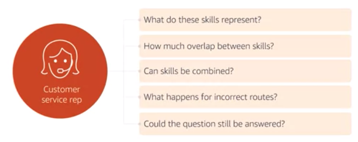{: width="100%"}

 See also [D], ...

## Discrimination

 A form of bias that can be prevented with regulation?

 See also [D], ...


## Discrete Action Space

 In [Reinforcement Learning], when the [Action Space] is a set of actions.

 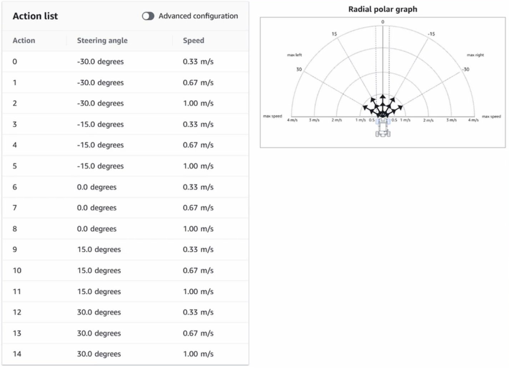{: width="100%"}

 See also [D], ...


## Discrete Convolution

 See also [D], [Continuous Convolution]


## Discrete Variable

 A variable that takes a (finite?) set of numerical value.

 See also [D], [Categorical Variable], [Continuous Variable], [Variable Type]


## Discriminative Classifier

 Discriminative Classifiers learn what the features in the input are most useful to distinguish between the various possible classes. So, if given images of dogs and cats, and all the dog images have a collar, the discriminative models will learn that having a collar means the image is of dog. An example of a discriminative classifier is logistic regression. Mathematically, it directly calculates the posterior probability `P(y|x)` or learn a direct map from input x to label y. So, these models try to learn the decision boundary for the model.

 See also [D], [Artificial Neural Network], [Conditional Random Fields], [K-Nearest Neighbor], [Logistic Regression], [Scalar Vector Machine]


## Discriminator

 Answer the question is this a real Monet? picture? aka a bullshit detector! :-) Gives continuous feedback. For example: do you like this music, and as music is playing feedback is applied continuously. Works with another neural network, the generator, that generates the music/image and learn from the discriminator's feedback! How does the discriminator perform classification? Solution: The discriminator gets a probability score after convolutions and hence the discriminator chooses the decision based on the probability.  The goal of the discriminator is to provide feedback to the generator about how realistic the generated outputs (e.g. piano rolls) are, so that the generator can learn to produce more realistic data. The discriminator provides this feedback by outputting a scalar value that represents how “real” or “fake” a piano roll is. Since the discriminator tries to classify data as “real” or “fake”, it is not very different from commonly used binary classifiers. We use a simple architecture for the critic, composed of four convolutional layers and a dense layer at the end.

 {: width="100%"}

  * This feedback from the discriminator is used by the generator to update its weights.
  * As the generator gets better at creating music accompaniments, it begins fooling the discriminator. So, the discriminator needs to be retrained as well.
  * Beginning with the discriminator on the first iteration, we alternate between training these two networks until we reach some stop condition (ex: the algorithm has seen the entire dataset a certain number of times).

 See also [D], [Dense Layer], [Discriminator Loss], [Generative Adversarial Network], [Generator], [Loss Function], [Update Ratio]


## Discriminator Loss

 See also [D], [Generator Loss], [Loss Function], [Loss Graph]


## Disentangled Variational Autoencoder
## Beta-VAE

 Variational autoencoder where weights in the latent space are meaningful, e.g. rotation of the head in a portrait representation.

 

 Beware:
  * Beta too small - variables are disentangled, but maybe overfitting training set?
  * beta too big - variables are not disentangled enough

 More at:
  * [https://youtu.be/9zKuYvjFFS8?t=555](https://youtu.be/9zKuYvjFFS8?t=555)

 See also [D], [Kullback-Liebler Divergence], [Latent Perturbation], [Variational Autoencoder]


## DistilBert Model

 A smaller, but faster version of the BERT model.

 See also [D], [BERT Model]


## Distributed Training

 See also [D], [Apache Spark], [TensorFlow ML Framework]


## Distribution

 * [Beta Distribution]
 * [Binomial Distribution]
 * Cuachy distribution - no mean !?!?
 * Exponential distribution
 * [Gamma distribution]
 * Gaussian distribution
 * Log normal distribution
 * [Normal Distribution] and Standard normal distribution (mean 0 and std of 1)
 * [Poisson distribution] - number of events in a specified period (events must be independent)

 

 See also [D], [Cumulative Distribution Function], [Sample]


## Distributional Reinforcement Learning
## Distributional RL

 In [RL], Learn value distribution rather than just mean. Improves extrapolation.

 See also [D], ...


## DNA Neural Network

 See also [D], ...


## Document Embedding

 * Doc2Vec – Extends Word2Vec to generate embeddings for larger chunks of text, like paragraphs or documents. For example, it can represent an entire news article about a recent election as a single vector, enabling efficient comparison and grouping of similar articles.
 * InferSentt – Developed by Facebook, InferSent is a sentence embedding method that uses supervised learning. It employs a bidirectional LSTM with max-pooling trained on natural language inference (NLI) data to produce general-purpose sentence representations. For instance, InferSent can create embeddings for customer reviews, allowing a company to analyze and compare feedback across different products.
 * Universal Sentence Encoder (USE) – Created by Google, USE provides embeddings for sentences and paragraphs. It utilizes a transformer architecture or Deep Averaging Network (DAN) and is trained on a variety of tasks to capture semantic meanings. For example, it can generate embeddings for full research papers to help in tasks like academic paper recommendations.

 More at:

  * [https://www.iguazio.com/glossary/llm-embeddings/](https://www.iguazio.com/glossary/llm-embeddings/)

 See also [D], ...


## Domain-Specific Model

 See also [D], [Supervised Fine-Tuning], [Model]


## Dot Product

 The dot product between 2 vectors is 0 if they are perpendicular.

 This is the same as doing a dot product and you can think of a dot product of two vectors as a measure of how similar they are.
 The dot product of two vectors has two definitions. Algebraically the dot product of two vectors is equal to the sum of the products of the individual components of the two vectors.

```
→ →
a.b = a1.b1 + a2.b2 + a3.b3     # Dot product of 2 vectors: A is 1-row/3-column with B is 3-row/1-column
```
 
 Geometrically the dot product of two vectors is the product of the magnitude of the vectors and the cosine of the angle between the two vectors.

```
→ →    →   →                                →
a.b = |a|.|b|. cos (θ)          # Where abs(a) = sqrt(a1^2 + a2^2 + a3^3) and theta angle between 2 vectors
```

 The resultant of the dot product of vectors is a scalar value.

 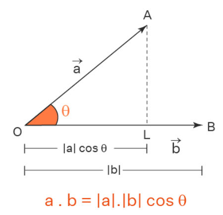{: width="100%"}

 More at:

  * [https://www.cuemath.com/algebra/dot-product/](https://www.cuemath.com/algebra/dot-product/)

 See also [D], [Vector]


## Dot Product Similarity

 An alternative to other [similarity metrics]

 

 See also [D], ...


## Downstream Task

 See also [D], [Finetuning], [Supervised Learning], [Upstream Task]


## DragGAN Model

 A [GAN] ...

 

 More at:

  * site - [https://vcai.mpi-inf.mpg.de/projects/DragGAN/](https://vcai.mpi-inf.mpg.de/projects/DragGAN/)
  * code - [https://github.com/Zeqiang-Lai/DragGAN](https://github.com/Zeqiang-Lai/DragGAN)
  * articles
    * [https://www.creativebloq.com/news/draggan](https://www.creativebloq.com/news/draggan)

 See also [D], ...


## DreamBooth Model

 ~ USED TO CREATE IMAGES OF A SPECIFIC SUBJECT (eg main character)

 ~ a fine-tuned model to incorporate an object or person in your image generation when using a diffusion model.

 ~ It’s like a photo booth, but once the subject is captured, it can be synthesized wherever your dreams take you…

 * developed at [Google]

 

 

 

 More at:

  * site - [https://dreambooth.github.io/](https://dreambooth.github.io/)
  * paper - [https://arxiv.org/abs/2208.12242](https://arxiv.org/abs/2208.12242)
  * wikipedia - [https://en.wikipedia.org/wiki/DreamBooth](https://en.wikipedia.org/wiki/DreamBooth)

 See alsop [D], ...


## DreamFusion Model

 Text-to-3D using 2D Diffusion built by [Google]

 An alternative to [Point-E Model] built by [OpenAI]

 

 More at:

  * home - [https://dreamfusion3d.github.io/](https://dreamfusion3d.github.io/)
  * paper - [https://arxiv.org/abs/2209.14988](https://arxiv.org/abs/2209.14988)
  * sample - [https://dreamfusion3d.github.io/gallery.html](https://dreamfusion3d.github.io/gallery.html)

 See also [D], ...


## DreamIX Model

 A diffusion model for video built by [Google]

 Text-driven image and video diffusion models have recently achieved unprecedented generation realism. While diffusion models have been successfully applied for image editing, very few works have done so for video editing. We present the first diffusion-based method that is able to perform text-based motion and appearance editing of general videos. Our approach uses a video diffusion model to combine, at inference time, the low-resolution spatio-temporal information from the original video with new, high resolution information that it synthesized to align with the guiding text-prompt. As obtaining high-fidelity to the original video requires retaining some of its high-resolution information, we add a preliminary stage of finetuning the model on the original video, significantly boosting fidelity. We propose to improve motion editability by a new, mixed objective that jointly finetunes with full temporal attention and with temporal attention masking. We further introduce a new framework for image animation. We first transform the image into a coarse video by simple image processing operations such as replication and perspective geometric projections, and then use our general video editor to animate it. As a further application, we can use our method for subject-driven video generation. Extensive qualitative and numerical experiments showcase the remarkable editing ability of our method and establish its superior performance compared to baseline methods.

 

 

 

 More at:

  * site - [https://dreamix-video-editing.github.io/]](https://dreamix-video-editing.github.io/)
  * paper - [https://arxiv.org/abs/2302.01329](https://arxiv.org/abs/2302.01329)

 See also [D], ...

## Dropout

 ~ Used for regulation to prevent [overfitting]

 ~ Like pruning? No, because temporary! More like intentionally filtering at training time for each batch!

  * filtering signal from input that we know won't be relevant (ex: finding the beat, when listening to the entire music!)
  * knowing something about the output and hence reducing processing leading to the possibility of non compliant outputs
  * etc

 Dropout refers to data, or noise, that's intentionally dropped from a neural network to improve processing and time to results.
  
 The challenge for software-based neural networks is they must find ways to reduce the noise of billions of neuron nodes communicating with each other, so the networks' processing capabilities aren't overrun. To do this, a network eliminates all communications that are transmitted by its neuron nodes not directly related to the problem or training that it's working on. The term for this neuron node elimination is dropout.

 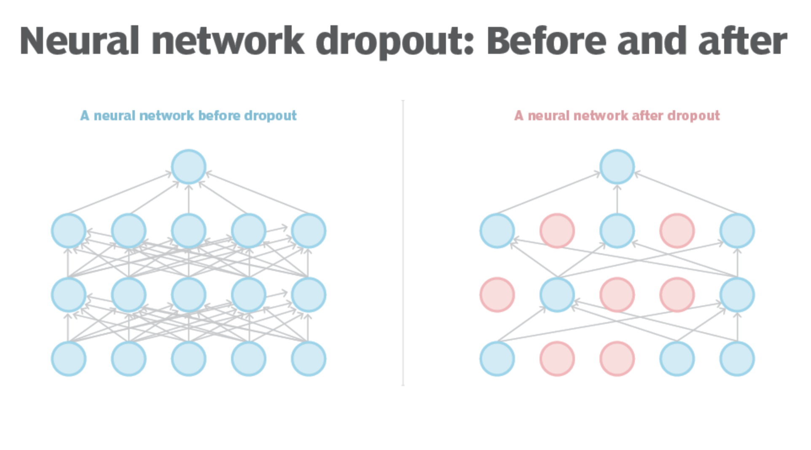{: width="100%"}

 See also [D], ...


## Dropout Function

 Function used to remove nodes from the Neural Network to prevent over-fitting.

 Q: Is the function run for each neuron/connection in the [dropout layer] ?

 See also [D], [Hyperparameter]


## Dropout Layer

 ~ Used for regulation to prevent [overfitting]

 Layer or layers where the [dropout function] is applied, normally after all Dense layers! The dropout rate for each dropout layer can be different.

 [Input layer] : This is the top-most layer of [artificial intelligence] and [machine learning] where the initial raw data is being ingested. [Dropout] can be applied to this layer of visible data based on which data is deemed to be irrelevant to the business problem being worked on.

 [Output layer] : This is the final, visible processing output from all neuron units. Dropout is NOT used on this layer (because the numbers of output has already been chosen carefully !)

 [Intermediate or hidden layers][Hidden Layer]: These are the layers of processing after data ingestion. These layers are hidden because we can't exactly see what they do. The layers, which could be one or many, process data and then pass along intermediate -- but not final -- results that they send to other neurons for additional processing. Because much of this intermediate processing will end up as noise, data scientists use dropout to exclude some of it.

 

 

 See also [D], ...


## Dropout Ratio

 Whenever a deep neural network is overfitting, this ratio should be a bit higher!

 If p = 0.25 --> every neuron has 1/4th chance of being inactive during training time. During test time, we have the whole network!

 :warning: when running with the whole layer (test time), you need to multiply the weights by the value of p ! (otherwise value is very different!)

 :warning: the connections are activated or inactivated after each sample, batch, or epoch? Most likely batch!

 See also [D], ...


## Dropout Regularization

 Used to reduce overfitting. Avoid bias in a specific neuron or feature. To execute a dropout regularization, add a [dropout layer] after each [dense layer]! The regularization decrease the accuracy during training, but increases it at test time as the model has been better at generalizing.

 

 See also [D], ...


## Dual-Encoder Contrastive Model

 Models:

  * [CLIP][CLIP Model]
  * ALIGN 
  * CoCa
  * Florence
  * MIL-NCE
  * BASIC
  * LiT
  * FILIP
  * MMV

 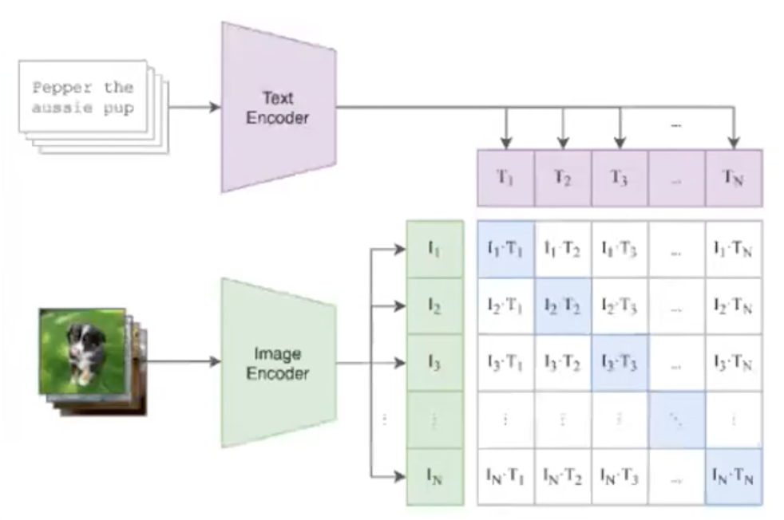{: width="100%"}

 See also [D], ...


## Dummy Variable

 If a column is gender with 2 values (male, female), ==> introduce the dummy variable G with G=0 for male and G=1 for female.

 Do not introduce 2 dummy variables, otherwise you will experience the [dummy variable trap] !

 

 See also [D], [Dummy Variable Trap], [One-Hot Encoding]


## Dummy Variable Trap

 ~ When regression cannot run because of multicollinearity

 If M category, introduce (M-1) [dummy variables]

 Ex: [One-hot encoding]

 

 

 See also [D], ...


## Dying ReLU Problem

 The dying ReLU problem refers to the scenario when many [ReLU] neurons only output values of 0. The red outline below shows that this happens when the inputs are in the negative range. 

 While this characteristic gives ReLU its strengths (through network sparsity), it becomes a problem when most of the inputs to these ReLU neurons are in the negative range. The worst-case scenario is when the entire network dies, meaning that it becomes just a constant function.

 When most of these neurons return output zero, the gradients fail to flow during [backpropagation], and the [weights] are not updated. Ultimately a large part of the network becomes inactive, and it is unable to learn further.

 Because the slope of ReLU in the negative input range is also zero, once it becomes dead (i.e., stuck in negative range and giving output 0), it is likely to remain unrecoverable.

 However, the dying ReLU problem does not happen all the time since the [optimizer] (e.g., [stochastic gradient descent]) considers multiple input values each time. As long as NOT all the inputs push ReLU to the negative segment (i.e., some inputs are in the positive range), the [artificial neurons] can stay active, the weights can get updated, and the network can continue learning.

 More at:

  * [https://towardsdatascience.com/the-dying-relu-problem-clearly-explained-42d0c54e0d24](https://towardsdatascience.com/the-dying-relu-problem-clearly-explained-42d0c54e0d24)

 See also [D], ...


## Dyna Model

 Dyna is a [model-based reinforcement learning (RL)][Model-based RL] algorithm that combines model-free RL with model-based search to improve sample efficiency. The key characteristics are:

  * Learns a model of the environment's transition dynamics and rewards
  * Uses experience to improve model accuracy
  * Plans [actions] using simulated experiences generated from the learned model
  * Executes [actions] in real [environment] and uses results to further improve model
  * Interleaves model-based planning with model-free RL
  * Allows exploiting knowledge from model while continuing to explore environment
  * Dramatically improves learning rate over pure model-free approaches
  * Planning step is computationally inexpensive compared to real experiences
  * Plans can focus on promising areas to guide exploration
  * Model can be learned with [neural networks] to handle complex [environments]
  * Does not need a perfect model, approximate is sufficient if sampled appropriately

 In summary, Dyna augments real experience with simulated experience from a learned model to accelerate learning. It achieves efficiency gains by leveraging planning in addition to model-free learning.

 See also [D], ...


## Dynamic Programming (DP)

 Dynamic Programming (DP) is defined as a technique that solves some particular type of problems in Polynomial Time. Dynamic Programming solutions are faster than the exponential brute method and can be easily proved their correctness.

 Dynamic programming algorithms are often used in [optimization] problems, such as finding the shortest path in a graph or the minimum cost of a set of operations. They are also commonly used in bioinformatics, economics, and other fields where optimization problems arise.

 Used in [Reinforcement Learning], ...

 Where a decision is made when the optimal solution for the sub-problems have been found ?

```python
def fibonacci(n):
   if n <= 1:
       return n
   # create a table to store the solutions to subproblems
   table = [0] * (n + 1)
   table[1] = 1
   # fill the table with the solutions to subproblems
   for i in range(2, n + 1):
       table[i] = table[i-1] + table[i-2]
   # return the solution to the original problem
   return table[n]

# test the function
print(fibonacci(10))  # output: 55
```

 In this example, we use a table to store the solutions to the subproblems, starting with the base cases (0 and 1) and then filling in the table with the solutions to the remaining subproblems. Finally, we return the solution to the original problem (the nth Fibonacci number). This approach avoids redundant computations and is more efficient than the naive recursive solution for large values of n.

 The naive recursive implementation of the Fibonacci sequence:

```python
def fibonacci(n):
    if n <= 1:
        return n
    return fibonacci(n-1) + fibonacci(n-2)

# test the function
print(fibonacci(10))  # output: 55
```

 In this implementation, we define the function recursively, using the formula for the Fibonacci sequence: f(n) = f(n-1) + f(n-2). However, this approach has a major drawback: it involves redundant computations. For example, to compute the 5th Fibonacci number, we need to compute the 4th and 3rd Fibonacci numbers, and to compute the 4th Fibonacci number, we need to compute the 3rd and 2nd Fibonacci numbers. As a result, many of the subproblems are solved multiple times, leading to an exponential increase in the number of computations as n increases.

In contrast, the dynamic programming approach avoids redundant computations by storing the solutions to subproblems in a table and reusing them as needed. This can lead to significant performance improvements for large values of n.

 More at:

  * [https://www.geeksforgeeks.org/introduction-to-dynamic-programming-data-structures-and-algorithm-tutorials/](https://www.geeksforgeeks.org/introduction-to-dynamic-programming-data-structures-and-algorithm-tutorials/)

 See also [D], ...
