# E

## Early Stopping

 There is a challenge in training a [neural network] long enough for it to learn the mapping, but not so long that it overfits the training data. One way to accomplish this is to train on the training dataset, but to stop training at the point when performance on a validation dataset starts to degrade. In the world of training neural networks, this is what is known as “early stopping”. `A key challenge with [overfitting], and with machine learning in general, is that we can’t know how well our model will perform on new data until we actually test it"`.

 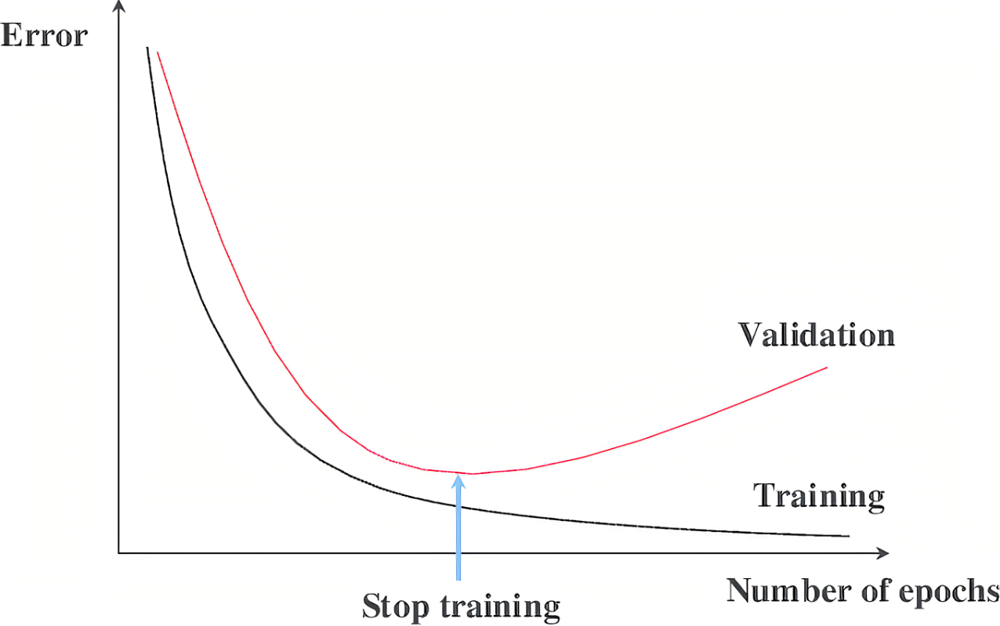{: width="100%"}

 See also [E], [AutoML], [Balanced Fitting], [Early Stopping Epoch], [Underfitting]


## Early Stopping Epoch

 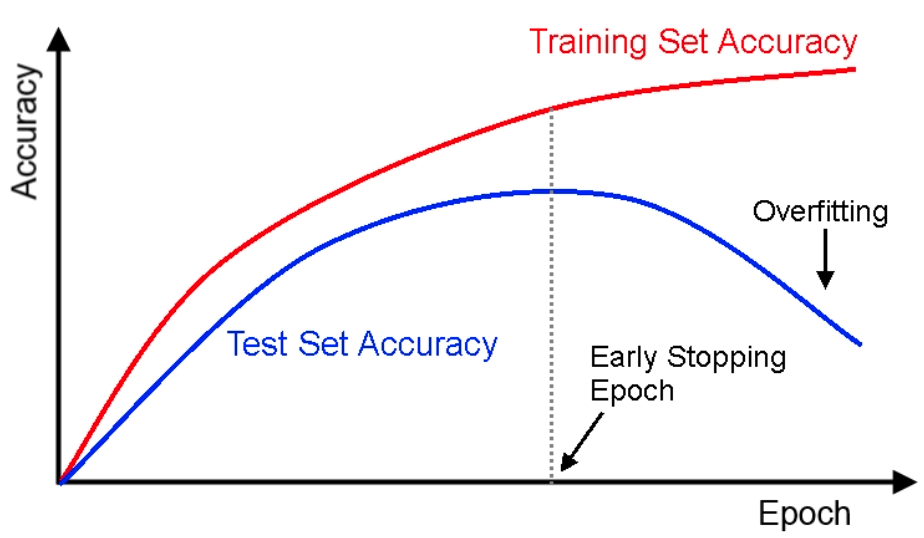{: width="100%"}

 See also [E], [Early Stopping], [Overfitting], [Underfitting]


## Edge AI

 Why edge AI matters: Edge computing brings data processing closer to where it’s created. Instead of sending information to a central server miles away, the system processes data directly on local edge devices. So what? This reduces lag time, so decisions and actions can happen instantly. 

 See also [E], ...


## Edge Detection

 Used for image [segmentation] and ...

 See also [E], ...


## Eigenvalue

 Each [eigenvector] has a eigenvalue

 The eigenvalue is the ratio by which the [eigenvector] is scaled during the linear transformation (matrix multiplication).

 If eigenvalue (v) is 

  * 0 < v : After transformation, the eigenvector keeps the same direction
  * v < 0 : After transformation, the eigenvector changes direction
  * 1 < v : After transformation, the eigenvector is stretched (elongated)
  * -1 < v < 1 : After transformation, the eigenvector is shrunken, scaled shorter

 {: width="100%"}

 {: width="100%"}

 More at:

  * [https://setosa.io/ev/eigenvectors-and-eigenvalues/](https://setosa.io/ev/eigenvectors-and-eigenvalues/)

 See also [E], [Synthesized Variable]


## Eigenvector

 After a linear transformation (matrix multiplication), while every other vector deviates from their initial direction, the eigenvectors stay on the their original line despite the distortion from the matrix.

/// warning | beware

but their length can be stretched or direction can be inverted (the opposite) (?), but the direction stays the same (?) before and after the transformation.

All vectors on the same direction as the eigenvector is also an eigenvector, because their direction stays the same. The eigenvector is the one of unit length.

Eigenvector for matrix A is probably not the eigenvector for matrix B

A 2x2 matrix can have 0, 1, or 2 eigenvectors!
///

 During the transformation, each eigenvector is scaled during the linear transformation (matrix multiplication). That scaling factor is the [eigenvalue]!

 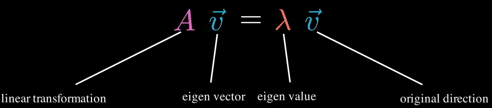{: width="100%"}

 {: width="100%"}

 More at:

  * [https://setosa.io/ev/eigenvectors-and-eigenvalues/](https://setosa.io/ev/eigenvectors-and-eigenvalues/)

 See also [E], [Eigenvalue], [Matrix], [Synthesized Variable]


## Elastic Net Regression

 Used in [Regularization] when you have tons/millions of parameters and you don't know whether to choose the [ridge regression] or the [lasso regression]

 Great when dealing with correlated parameters!

 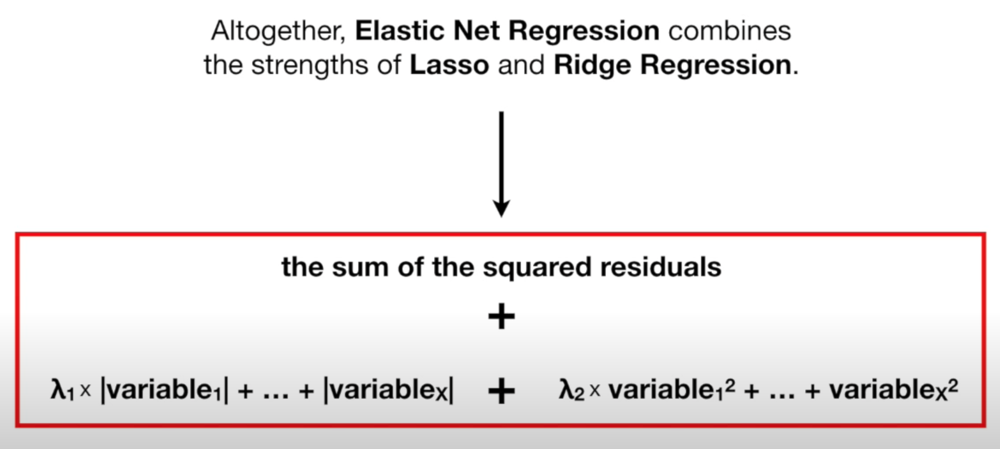{: width="100%"}

 

 {% pdf "https://hastie.su.domains/Papers/B67.2%20(2005)%20301-320%20Zou%20&%20Hastie.pdf" %}

 More at:

  * paper - [https://hastie.su.domains/Papers/B67.2%20(2005)%20301-320%20Zou%20&%20Hastie.pdf](https://hastie.su.domains/Papers/B67.2%20(2005)%20301-320%20Zou%20&%20Hastie.pdf)
  * [https://www.geeksforgeeks.org/lasso-vs-ridge-vs-elastic-net-ml/](https://www.geeksforgeeks.org/lasso-vs-ridge-vs-elastic-net-ml/)
 
 See also [E], ...


## Elastic Net Regression Penalty

 ~ In an elastic net regression, is the term/bias added to the loss function that is equal to the sum of the [ridge regression penalty] and the [lasso regression penalty]

 See also [E], ...


## Elastic Weight Consolidation (EWC)

 A method that slows down learning on certain weights based on their importance to previous tasks.

 Useful to prevent [catastrophic forgetting]

 See also [E], ...


## Electric Dreams Movie

 Electric Dreams is a 1984 science fiction romantic comedy film directed by Steve Barron (in his feature film directorial debut) and written by Rusty Lemorande. The film is set in San Francisco and depicts a love triangle among a man, a woman, and a personal computer. It stars Lenny Von Dohlen, Virginia Madsen, Maxwell Caulfield, and the voice of Bud Cort.

 

 

 More at:

  * [https://en.wikipedia.org/wiki/Electric_Dreams_(film)](https://en.wikipedia.org/wiki/Electric_Dreams_(film))

 See also [E], [AI Movie]


## Elevenlabs AI Company

 An AI startup that lets anyone clone a target’s voice in a matter of seconds.

 

 

 Alternatives

  * [play.ht](https://play.ht/)
  * [coqui.ai](https://coqui.ai/about)

 More at:

  * [https://beta.elevenlabs.io/about](https://beta.elevenlabs.io/about)
  * [https://beta.elevenlabs.io/speech-synthesis](https://beta.elevenlabs.io/speech-synthesis)
  * [https://www.theverge.com/2023/1/31/23579289/ai-voice-clone-deepfake-abuse-4chan-elevenlabs](https://www.theverge.com/2023/1/31/23579289/ai-voice-clone-deepfake-abuse-4chan-elevenlabs)
  * [https://twitter.com/ramsri_goutham/status/1619620737509396483](https://twitter.com/ramsri_goutham/status/1619620737509396483)
  * [https://ramsrigoutham.medium.com/create-ai-powered-personalized-meditation-videos-d2f76fee03a5](https://ramsrigoutham.medium.com/create-ai-powered-personalized-meditation-videos-d2f76fee03a5)
  * articles
    * AI girlfriend - [https://www.ai-jason.com/learning-ai/build-ai-companion](https://www.ai-jason.com/learning-ai/build-ai-companion)

 See also [E], ...


## ELIZA Chatbot

 ~ the first bot at making significant strides in the [turing test]

 ELIZA is an early natural language processing computer program created from 1964 to 1967 at MIT by Joseph Weizenbaum. Created to explore communication between humans and machines, ELIZA simulated conversation by using a pattern matching and substitution methodology that gave users an illusion of understanding on the part of the program, but had no representation that could be considered really understanding what was being said by either party.

 {: width="100%"}

 More at:

  * wikipedia - [https://en.wikipedia.org/wiki/ELIZA](https://en.wikipedia.org/wiki/ELIZA)
  * ELiza vs ChatGPT - [https://arstechnica.com/information-technology/2023/12/real-humans-appeared-human-63-of-the-time-in-recent-turing-test-ai-study/](https://arstechnica.com/information-technology/2023/12/real-humans-appeared-human-63-of-the-time-in-recent-turing-test-ai-study/)

 See also [E], ...


## Elo Rating System

 The Elo rating system is a method for calculating the relative skill levels of players in zero-sum games such as chess. It is named after its creator Arpad Elo, a Hungarian-American physics professor.

 The Elo system was invented as an improved chess-rating system over the previously used Harkness system, but is also used as a rating system in association football, American football, baseball, basketball, pool, table tennis, various board games and esports, and more recently [large language models] in the [chatbot arena].

 The difference in the ratings between two players serves as a predictor of the outcome of a match. Two players with equal ratings who play against each other are expected to score an equal number of wins. A player whose rating is 100 points greater than their opponent's is expected to score 64%; if the difference is 200 points, then the expected score for the stronger player is 76%.

 A player's Elo rating is represented by a number which may change depending on the outcome of rated games played. After every game, the winning player takes points from the losing one. The difference between the ratings of the winner and loser determines the total number of points gained or lost after a game. If the higher-rated player wins, then only a few rating points will be taken from the lower-rated player. However, if the lower-rated player scores an upset win, many rating points will be transferred. The lower-rated player will also gain a few points from the higher rated player in the event of a draw. This means that this rating system is self-correcting. Players whose ratings are too low or too high should, in the long run, do better or worse correspondingly than the rating system predicts and thus gain or lose rating points until the ratings reflect their true playing strength.

 Elo ratings are comparative only, and are valid only within the rating pool in which they were calculated, rather than being an absolute measure of a player's strength.

 More at:

  * wikipedia - [https://en.wikipedia.org/wiki/Elo_rating_system](https://en.wikipedia.org/wiki/Elo_rating_system)

 See also [E], [LMSys Elo Rating]


## Elon Musk Person

 Founder of Tesla, SpaceX, the Boring company, and early investor in [OpenAI]

 

 See also [E], ...


## Embedding

 An embedding is a rich representation for any entity via d-dimensional latent variables; these entities include, but are not limited to: stores, eaters, items, drivers, locations, and so on.  It generally transforms human-friendly features, such as store menu, store price, store review, item title and description, item price, location’s full address, eater preference cuisine and past orders, rider preferred drop-offs and so on, to machine-learning-friendly dense vectors. These vectors can be directly used in any ML task (such as clustering, nearest neighbor search, classification, and so on) without too much feature engineering.

 Embedding types:

  * [Word Embeddings] such as [Word2Vec], [GloVE], [FastText]
  * [Sentence Embeddings] such as [Universal Sentence Encoder (USE)], [Sentence-BERT (SBERT)]
  * [Document Embeddings] such as [Doc2Vec], [InferSentt], [Universal Sentence Encoder (USE)]
  * Many others!
    * [Painting Embeddings](https://dimensionality-reduction-293e465c2a3443e8941b016d.vercel.app/)

 More at:

  * [https://www.uber.com/blog/innovative-recommendation-applications-using-two-tower-embeddings/](https://www.uber.com/blog/innovative-recommendation-applications-using-two-tower-embeddings/) 
  * [https://frankzliu.com/blog/a-gentle-introduction-to-vector-databases](https://frankzliu.com/blog/a-gentle-introduction-to-vector-databases)
  * articles
    * LLM Embeddings - [https://www.iguazio.com/glossary/llm-embeddings/](https://www.iguazio.com/glossary/llm-embeddings/)

 See [E], [Embedding Projector], [Sentence Embedding], [Word Embedding]


## Embedding Projector

 4D visualization of for ...

  * [T-SNE]
  * [Principal Component Analysis (PCA)]
  * [UMAP]
  * custom

 More at:

  * [https://projector.tensorflow.org/](https://projector.tensorflow.org/)

 See also [E], [Embedding]


## Embedding Space

 A high dimensional semantic space.

 See also [E], [CLIP Model], [Embedding]


## Embodied Agent

 See also [E], [World Model]


## Emergent Ability

> Emergence is what happens when a simple change in input triggers a major output change. Ex: Temperature of water going from -1 to 1 deg Celsius

> An ability is emergent if it is not present in smaller models but is present in larger models


 Initially (11 billion parameters)

  * Arithmetic
  * Language Understanding
  * Question answering

 Emerging abilities (62+ billion parameters) include

  * Code completion
  * Common sense reasoning
  * Summarization
  * [Theory Of Mind]
  * [Translation]
  * Word unscramble
  * Math word problems
  * Basic math operations
  * Instruction following

 Emerging abilities (517+ billion parameters) include

  * Physics QA
  * Joke explanations
  * Semantic parsing
  * Dialogue
  * Pattern recognition
  * Logical inference chains
  * proverbs
  * general knowledge
  * reading comprehension

 Emergence is when quantitative changes in a system result in qualitative changes in behavior. An ability is emergent if it is not present in smaller models but is present in larger models. For example Theory of Mind would be an example of a spontaneous emergence of an ability in AI. As far as we know, OpenAI engineers did not deliberately implement ToM in GPT. Instead, ToM has emerged spontaneously as a byproduct of GPT being trained to achieve its task: Predict a next word in a sentence. This means that AI can develop surprising abilities without humans explicitly trying to design them. We should think about what abilities may come next! Finally, our study shows the usefulness of applying psychological methods to studying AI. AI models’ increasing complexity prevents us from understanding their functioning and deriving their capabilities directly from their design. This echoes the challenges faced by psychologists and neuroscientists in studying the original black box: the human brain. We hope that psychological science will help us to stay abreast of rapidly evolving AI.

 Are not read?

  * Multi-step reasoning can explain why the sudden emergence because last step of many can be executed
  * ...?

 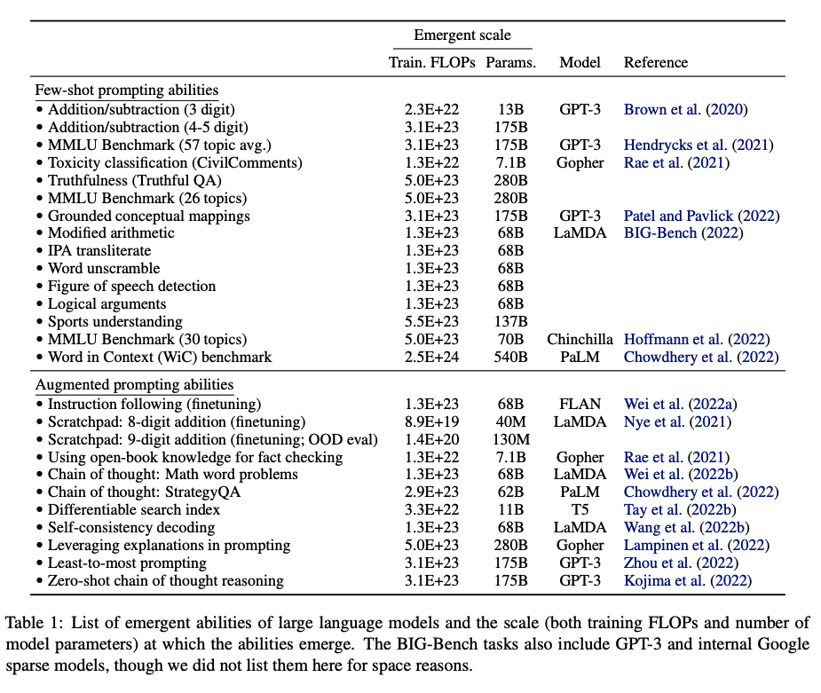{: width="100%"}

 

 

 

 More at:

  * paper 
    * emergent paper - [https://arxiv.org/abs/2206.07682](https://arxiv.org/abs/2206.07682)
    * not emergent paper - [https://arxiv.org/abs/2304.15004](https://arxiv.org/abs/2304.15004)
  * openreview - [https://openreview.net/forum?id=yzkSU5zdwD](https://openreview.net/forum?id=yzkSU5zdwD)
  * articles
    * [https://www.jasonwei.net/blog/emergence](https://www.jasonwei.net/blog/emergence)

 See also [E], [BIG Bench], [Emergent Ability Distillation], [GPT Model], [Large Language Model]


## Emergent Ability Distillation

 A [knowledge distillation] method that seeks to extract a specific ability that the teacher model has learned and transfer it to the student model. [Emergent abilities] are capabilities that are present in large models but not in smaller ones. For example, you can gather prompts and responses on mathematics or reasoning problems from GPT-4 and try to transfer them to a smaller model like Vicuna. The advantage of EA distillation is that it is much easier to measure because it focuses on a narrow set of tasks. However, it’s crucial to remember that there are limits to the abilities of LLMs that mimic the emergent behaviors of larger models.

 More at:

  * [https://bdtechtalks.com/2023/09/18/what-is-llm-compression/](https://bdtechtalks.com/2023/09/18/what-is-llm-compression/)

 See also [E], [Model Compression], [Standard Knowledge Distillation]


## Emote Portrait Alive Model
## EMO Model

 Researchers at [Alibaba]‘s Institute for Intelligent Computing have developed a new artificial intelligence system called “EMO,” short for Emote Portrait Alive, that can animate a single portrait photo and generate videos of the person talking or singing in a remarkably lifelike fashion.

 The system, described in a research paper published on arXiv, is able to create fluid and expressive facial movements and head poses that closely match the nuances of a provided audio track. This represents a major advance in audio-driven talking head video generation, an area that has challenged AI researchers for years.

 

 More at:

  * site - [https://humanaigc.github.io/emote-portrait-alive/](https://humanaigc.github.io/emote-portrait-alive/)
  * paper - [https://arxiv.org/abs/2402.17485](https://arxiv.org/abs/2402.17485)
  * code - [https://github.com/HumanAIGC/EMO](https://github.com/HumanAIGC/EMO)
  * articles
    * [https://venturebeat.com/ai/alibabas-new-ai-system-emo-creates-realistic-talking-and-singing-videos-from-photos/](https://venturebeat.com/ai/alibabas-new-ai-system-emo-creates-realistic-talking-and-singing-videos-from-photos/)

 See also [E], ...


## Emotion

 Emotions are mental states brought on by neurophysiological changes, variously associated with thoughts, feelings, behavioral responses, and a degree of pleasure or displeasure. There is currently no scientific consensus on a definition. Emotions are often intertwined with mood, temperament, personality, disposition, or creativity.

Research on emotion has increased over the past two decades with many fields contributing including psychology, medicine, history, sociology of emotions, and computer science. The numerous attempts to explain the origin, function and other aspects of emotions have fostered intense research on this topic. Theorizing about the evolutionary origin and possible purpose of emotion dates back to Charles Darwin. Current areas of research include the neuroscience of emotion, using tools like PET and fMRI scans to study the affective picture processes in the brain.

 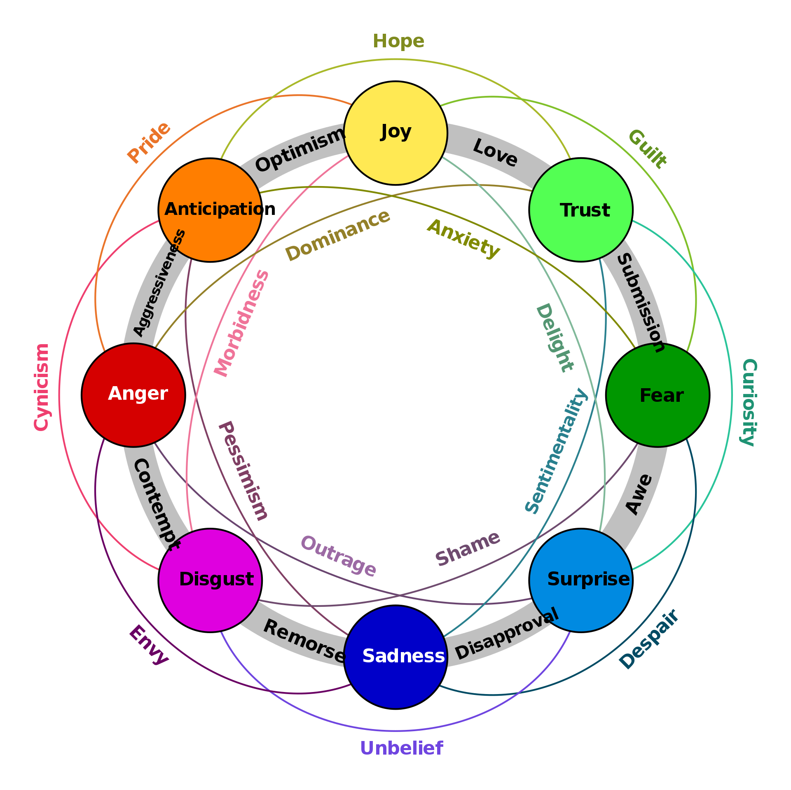{: width="100%"}

 More at:

  * [https://en.wikipedia.org/wiki/Emotion](https://en.wikipedia.org/wiki/Emotion)

 See also [E], [Emotional Intelligence]

## Emotional Intelligence (EI)

 Emotional intelligence (EI) is most often defined as the ability to perceive, use, understand, manage, and handle [emotions][Emotion]. People with high emotional intelligence can recognize their own emotions and those of others, use emotional information to guide thinking and behavior, discern between different feelings and label them appropriately, and adjust emotions to adapt to environments. Although the term first appeared in 1964, it gained popularity in the 1995 best-selling book Emotional Intelligence, written by science journalist Daniel Goleman.

 More at:

  * Book - [https://www.amazon.com/Emotional-Intelligence-Matter-More-Than/dp/055338371X](https://www.amazon.com/Emotional-Intelligence-Matter-More-Than/dp/055338371X)

 See also [E], [Affective Computing], [Emotional Intelligence Benchmark]


## Emotional Intelligence Benchmark (EQ-Bench)

 A [benchmark] to measure LLM's [emotional intelligence]

 

 More at:

  * paper - [https://arxiv.org/abs/2312.06281](https://arxiv.org/abs/2312.06281)
  * code - [https://github.com/EQ-bench/EQ-Bench](https://github.com/EQ-bench/EQ-Bench)
  * leaderboard - [https://eqbench.com/](https://eqbench.com/)
  * articles
    * source - [https://twitter.com/N8Programs/status/1752441060133892503](https://twitter.com/N8Programs/status/1752441060133892503)

 See also [E], ...


## Emotional Quotient (EQ)

 EQ typically stands for Emotional Quotient, also known as [Emotional Intelligence (EI)]. It refers to a person's ability to:

  1. Recognize, understand, and manage their own emotions.
  1. Recognize, understand, and influence the emotions of others.

 Components of EQ (Daniel Goleman’s Model):

  1. Self-awareness: Understanding your own emotions and how they affect your thoughts and behavior.
  1. Self-regulation: Controlling your impulses, adapting to change, and managing stress effectively.
  1. Motivation: Using emotional factors to achieve goals, remain positive, and persist in the face of challenges.
  1. Empathy: Understanding and sharing the feelings of others.
  1. Social skills: Managing relationships, inspiring others, and resolving conflicts constructively.

/// details | Why EQ is Important?
    type: question

  * Personal Relationships: Helps in fostering better communication and understanding.
  * Professional Success: Important for leadership, teamwork, and managing workplace dynamics.
  * Mental Well-being: Promotes resilience, adaptability, and a positive mindset.
///

 See also [E], ...


## Encoder
 
 ~ Let’s call encoder the process that produce the “new features” representation from the input or “old features” representation (by selection or by extraction) and decoder the reverse process. Dimensionality reduction can then be interpreted as data compression where the encoder compress the data (from the initial space to the encoded space, also called latent space) whereas the decoder decompress them. Of course, depending on the initial data distribution, the latent space dimension and the encoder definition, this compression/representation can be lossy, meaning that a part of the information is lost during the encoding process and cannot be recovered when decoding.

 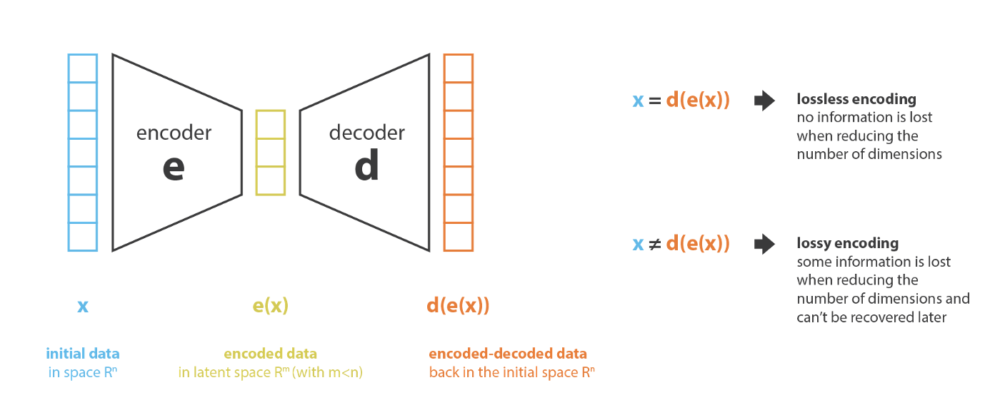{: width="100%"}

 For each input, the encoder representation (hidden state) is up to the architecture of the model.

 

 Maybe the most famous encoder is BERT. To be useful, BERT needs to be matched with a classifier or a decoder.

 See also [E], [BERT Model], [Decoder], [Encoder Representation], [Hidden State], [Image Encoder], [One-Shot Learning], [Principal Component Analysis], [Encoder Representation], [Encoder Representation Space], [Image Encoder], [Similarity Metric], [Variational Autoencoder], [Voice Encoder]


## Encoder Representation

 The output of the encoder given an input! The dimension on the output representation is smaller or equal to the dimension of the input. :warning: Same or smaller element count (i.e. length), but the dimension of output  elements can be larger than the dimension of an input element. Ex with NLP: input-element = word/token/integer ---> output-element = contextualised-word matrix/list (of length 768 in BERT) = meaning of word within the text .

 See also [E], [Encoder Representation Space]


## Encoder Representation Space

  * Latent Space
  * Word embedding space
  * Semantic space

/// warning | How do we chose the dimension in the representation space? WITH THE LOSS FUNCTION ! ===> |Y - Yest |, we set the ground truth of Y !!!!!
///

 See also [E], [Decoder Representation Space], [Latent Space], [Loss Function], [Semantic Space], [Word Embeddings Space]


## Encoder Stack
 
 A sequence of encoders when the output of one feeds on the following one.

 See also [E], [Decoder], [Decoder Stack], [Encoder], [Transformer Model]


## Encoder-Decoder Attention

 See also [E], [Attention-Based Model]


## Encoder-Decoder Model

 The best way to understand the concept of an encoder-decoder model is by playing Pictionary. The rules of the game are very simple, player 1 randomly picks a word from a list and needs to sketch the meaning in a drawing. The role of the second player in the team is to analyse the drawing and identify the word which it describes. In this example we have three important elements player 1(the person that converts the word into a drawing), the drawing (rabbit) and the person that guesses the word the drawing represents (player 2). This is all we need to understand an encoder decoder model.

 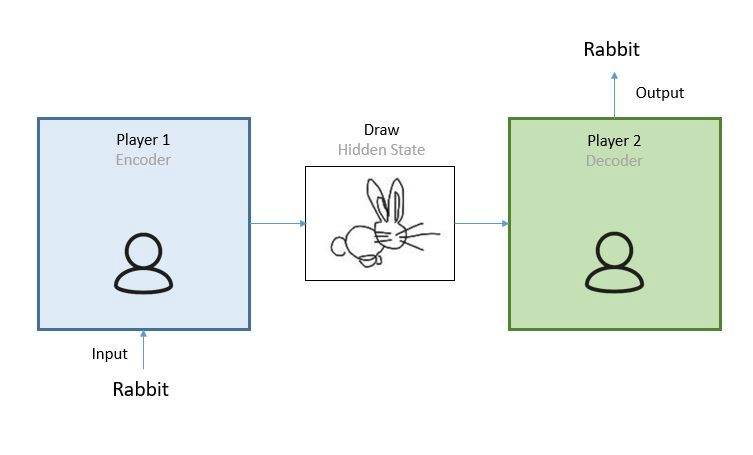{: width="100%"}

 More at:

  * [https://towardsdatascience.com/what-is-an-encoder-decoder-model-86b3d57c5e1a](https://towardsdatascience.com/what-is-an-encoder-decoder-model-86b3d57c5e1a)

 See also [E], [Autoencoder], [Decoder], [Decoder Stack], [Encoder], [Encoder Stack], [Hidden State], [U-Net Architecture]


## Encoding

 Often used in data preparation to turn categorical features into numbers.

 Methods:

  * [One-Cold Encoding]
  * [One-Hot Encoding]
  * [Ordinal Encoding]

 See also [E], ...


## Endpoint

 After the model has been built, we create an endpoint in docker to make it available for queries. An endpoint has a URL which can be queried directly. `You don't have SSH access to the endpoint`.

 See also [E], ...


## Engineered Arts Company

 The designer and manufacturer of the [Ameca Robot]

 Engineered Arts is an English engineering, designer and manufacturer of humanoid robots based in Cornwall, United Kingdom. It was founded in October 2004 by Will Jackson.

More at:

  * [https://en.wikipedia.org/wiki/Engineered_Arts](https://en.wikipedia.org/wiki/Engineered_Arts)

 See also [E], ...


## Ensemble

 Ensembles are a software analog of [wisdom of the crowd]. Even if individual models make wildly inaccurate predictions, averaging the predictions of many models often generates surprisingly good predictions. For example, although an individual [decision tree] might make poor predictions, a [decision forest] often makes very good predictions.

 See also [E], ...


## Ensemble Method

 ~ Ensemble methods consist of joining several [weak learners] to build a [strong learner]. 

 ~ average the output of several models, such as decision trees?. Ex: aver Ensemble methods, meaning that they use a number of weak classifiers/learner to produce a strong classifier, which usually means better results. Imagine you’ve decided to build a bicycle because you are not feeling happy with the options available in stores and online. You might begin by finding the best of each part you need. Once you assemble all these great parts, the resulting bike will outshine all the other options.

 Ensemble methods use this same idea of combining several predictive models (supervised ML) to get higher quality [predictions] than each of the models could provide on its own. For example, the [Random Forest] algorithms is an ensemble method that combines many [Decision Trees] trained with different samples of the [datasets]. As a result, the quality of the predictions of a [Random Forest] is higher than the quality of the predictions estimated with a single Decision Tree.

 Think of ensemble methods as a way to reduce the [variance] and [bias] of a single [machine learning] model. That’s important because any given model may be accurate under certain conditions but inaccurate under other conditions. With another model, the relative [accuracy] might be reversed. By combining the two models, the quality of the predictions is balanced out. The great majority of top winners of [Kaggle competitions] use ensemble methods of some kind. The most popular ensemble algorithms are [Random Forest], [XGBoost] and [LightGBM]. 

 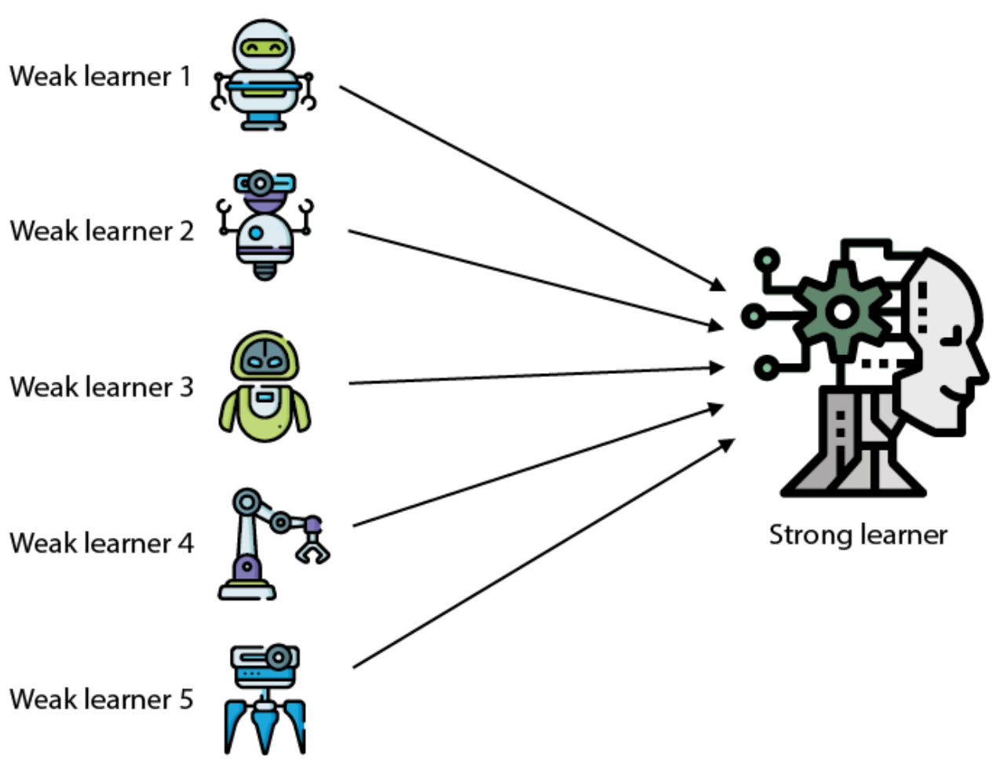{: width=20%}

 More at:

  * explorable - [https://pair.withgoogle.com/explorables/uncertainty-ood/](https://pair.withgoogle.com/explorables/uncertainty-ood/)

 See also [E], [Gradient Bagging], [Gradient Boosting], [Isolation Forest]


## Entity

 A node in a knowledge graph.

 See also [E], [Knowledge Graph]


## Entity Extraction

 Extract entities from text or image to build a scene graph. Methods:

  * text input
   * Rule-based approach
   * Sequence labeling
   * Language models  <== recommended
  * image input
   * ? face detection ?
   * ? object detection?
   * ???

 See also [E], [Entity], [Name Entity Recognition], [Relation Extraction], [Scene Graph]


## Entropy

/// warning | Beware ...

    Entropy in RL (DeepRacer) is not a probability unlike [Epsilon]. An entropy of 1 => uniform distribution. An entropy of 0 => peak distribution (clear value, not randomness)

    When a loss function hit the Shannon entropy, the model has learned everything there is to know, the model is predict everything as well as possible. So perfect algorithm and the model knows everything there is to know.
///

 Shannon entropy is a measure of the amount of uncertainty or randomness in a system. It was introduced by Claude Shannon in 1948 as a way to quantify the amount of information in a message or signal.

The entropy of a system is defined as the negative sum of the probabilities of each possible outcome multiplied by the logarithm of those probabilities. Mathematically, it can be expressed as:

```
H(X) = -∑(p(x) * log2 p(x))

# H(X) is the entropy of the system (given the observed state),
# sum for all x ( or actions | state)
# p(x) is the probability of a particular outcome x, (ex: Proba(action | state)  )
# and log2 is the base-2 logarithm.

<!> If proba(action|state) are all equal, then entry is 1
<!> If probab(action|state) are all 0, but 1, then the entropy is 0!!!
```

 The entropy is measured in bits, and it represents the minimum number of bits required to encode the information in the system. A system with high entropy has more uncertainty and randomness, and therefore requires more bits to encode the information. Conversely, a system with low entropy has less uncertainty and randomness, and requires fewer bits to encode the information.

 Shannon entropy has applications in various fields, including information theory, cryptography, and data compression. It is a fundamental concept in the study of communication and information processing.

 

 More at:

  * [https://en.wikipedia.org/wiki/Entropy_(information_theory)](https://en.wikipedia.org/wiki/Entropy_(information_theory))

 See also [E], [Cross-Entropy], [Kullback-Leibler Divergence]


## Environment

 In [reinforcement learning], the space in which the [RL agent] operates such as the physical worl (for robots and drones) or a digital space (for trading algorithms and game AI agents). The environment provides [states] or observations of current [state], and [rewards] ([supervised feedback]).

 In a RL environment,

  * you cannot use [backpropagation] through an environment (Reward <-- Action <-- State) because too complicated and we cannot compute the derivative!
  * you cannot change its [parameters] as it is fixed!
  * but you can use the [reward] to signal (intensity and direction) to identify which [action] is preferred over the others and update the [RL agent]'s [policy] weights

 Environments can be

  * deterministic = where the next state and reward are completely determined by the current state and action taken by the agent. In other words, there is no randomness.
  * stochastic = there is randomness involved in the state transition and reward functions. The next state and reward are not solely determined by the current state and action. (Ex: a car/agent on an icy road)
  * fully observable = agent can directly observe the complete state of the environment at each time step
  * partially observable = agent cannot directly observe the full state, only partial observation. (Ex: a self-driving car has sensors that can only give it information about its immediate surroundings, not the full map/city/world) ==> agent needs memory to remember past observations and actions. Agents also use techniques like [Bayesian inference] to maintain a [belief distribution] over possible current states.

 Examples of Environments:

  * [Isaac Gym]
  * [OpenAI Gym]

 {: width="100%"}

 See also [E], [PyBullet], [RobotSchool]


## Episode

 In DeepRacer, an episode terminal state is reached when the car:

  * exits the track (or crash) - trial and error
  * finishes the track - trial and success (but tries to optimize speed)

 In [reinforcement learning], an episode refers to a single complete run of the [agent] interacting with the [environment]. Here are some key points:

  * An episode begins when the agent observes the initial state of the environment.
  * The agent then selects actions which lead to new states, continuing until the terminal state is reached, ending the episode.
  * A terminal state signifies the end of an episode. This could be due to success, failure or a set time limit.
  * Starting a new training episode resets the environment and begins a new independent run. The initial state is sampled again.
  * Episodes allow the reinforcement learning agent to have multiple attempts at the task to gain experience and improve over time.
  * The agent implements the policy it has learned so far to try and maximize reward during each episode.
  * Metrics like episode reward and length track performance across episodes to monitor learning progress.
  * In a continuing task without terminal states, episodes may be defined by fixed timeouts rather than end states.

 Training processes often iterate through a large number of episodes, learning from the experience gained in each one.

 So in summary, episodes are complete simulations used to train and evaluate reinforcement learning agents in a repeatable manner. Multiple episodes build up the agent's experience.

 Episode types:

  * Continuous task = no end
  * Episodic task = has at least one final state (time, goal, etc)

```
In the context of DeepRacer, an episode refers to a single complete race around the track. Here are some key details:

  * Each episode starts with the agent (the car) placed at the starting line and ends when it crosses the finish line or goes off course.
  * During an episode, the agent observes the track environment through its onboard camera and selects actions (steering angle and speed) to try to complete the lap.
  * Episodes initially last only a few seconds as the untrained agent goes off track quickly. As learning progresses, episode duration increases.
  * When an episode ends, the car is reset to the start and a new episode begins - like restarting a race in a game.
  * Over many episodes, DeepRacer gradually learns how to navigate the turns and terrain of the track to improve lap time and completion rate.
  * Metrics like time per episode, progress (distance traveled), and reward per episode are tracked to monitor learning across episodes.
  * Good hyperparameter tuning is required so the agent can learn effectively across episodes without overfitting or getting stuck.
 
 So in summary, each full lap of the track is considered a distinct episode for the DeepRacer agent to gain experience and improve its policy. Multiple laps make up the full training.
```

 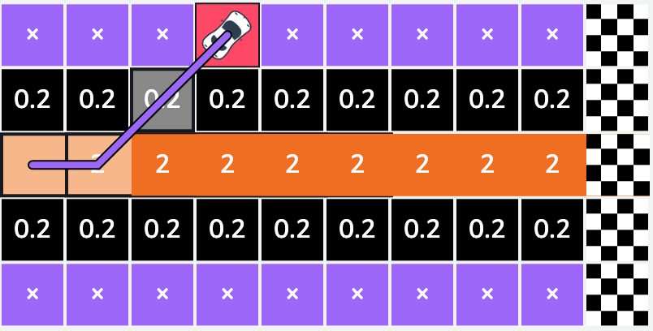{: width="100%"}

 The vehicle will start by exploring the grid until it moves out of bounds or reaches the destination. As it drives around, the vehicle accumulates rewards from the scores we defined. This process is called an episode. The interaction of the agent from an initial state to a terminal state is called an episode. An episode starts with the agent somewhere on the race track and finishes when the agent either goes off-track or completes a lap.

 In this episode, the vehicle accumulates a total reward of 2.2 before reaching a stop state.
 After each episode, the epsilon used in the epsilon greedy strategy decays (is reduced) and hence the likelihood of exploitation vs exploration increases. 

 Episode Status:

  * prepare
  * in_progress
  * off_track
  * auto_terminated = when the episode does not reach a terminate condition, it is auto-terminated based on the number of steps.

 See also [E], ...


## Episodic Task

 Task that have an end state. When end state is reached, you then have completed the [episode]. There are non-episodic tasks!

 See also [E], ...


## Epoch

 Number of Epochs = Number of passes on the training dataset

/// warning | The parameters of the model are usually updated many times during each epoch. The model is updated after each batch of data. This is known as [batch training] or mini-batch training.
///

 An epoch is complete whenever every point in the training set (N) has already been used in all steps: forward pass, computing loss, computing gradients, and updating parameters.

 During one epoch, we perform at least one update, but no more than N updates.

 The number of updates (N/n) will depend on the type of gradient descent being used:

  * For batch (n = N) gradient descent, this is trivial, as it uses all points for computing the loss. One epoch is the same as one update.
  * For stochastic (n = 1) gradient descent, one epoch means N updates since every individual data point is used to perform an update.
  * For mini-batch (of size n), one epoch has N/n updates since a mini-batch of n data points is used to perform an update.

 

 One epoch means that every training sample has been fed through the model at least once. If your epochs are set to 50, for example, it means that the model you are training will work through the entire training dataset 50 times.

 ==A complete pass on the dataset ~ 1 iteration!==. A complete dataset can be large in which case it is broken in [batches][Batch] and processed in many [iteration] (one per batch). Why use more than one Epoch? It may not look correct that passing the entire dataset through an ML algorithm or neural network is not enough, and we need to pass it multiple times to the same algorithm. So it needs to be kept in mind that to optimize the learning, we use gradient descent, an iterative process. Hence, it is not enough to update the weights with a single pass or one epoch. Moreover, one epoch may lead to [overfitting] in the model. In other words, when the training loop has passed through the entire training dataset once, we call that one epoch. Training for a higher number of epochs will mean your model will take longer to complete its training task, but it may produce better output if it has not yet converged.

  * Training over more epochs will take longer but can lead to a better output (e.g. sounding musical output)
  * Model training is a trade-off between the number of epochs (i.e. time) and the quality of sample output.

 Typically, the number of epochs is a hyperparameter that is set prior to training, and the model is trained for a fixed number of epochs. The optimal number of epochs depends on the complexity of the problem, the amount of training data, and other factors specific to the particular machine learning task.

 After training is complete, the model can be evaluated on a separate validation dataset to assess its performance. If the model is [overfitting] the training data, the validation loss will start to increase while the training loss continues to decrease, indicating that the model is starting to memorize the training data rather than learning to generalize to new data. In this case, [early stopping] or other regularization techniques can be used to prevent overfitting.

 The number of epochs used during neural network training impacts model performance. Both using too few or too many epochs can lead to problems:

 Too Few Epochs:

  * Underfitting: With too few epochs, the model does not have enough opportunities to learn from the training data. This can lead to underfitting, where the model fails to capture important patterns in the data.
  * Suboptimal metrics: Validation metrics like accuracy and loss will be worse than their optimum if training is stopped too early. The model has not had enough iterations to converge on better weights.

 Too Many Epochs:

  * [Overfitting] - With too many epochs, the model may end up overfitting to the training data. This causes it to memorize noise and details instead of learning generalizable patterns.
  * Long training time - Additional epochs extend training time significantly, especially for large datasets. The model may have already converged, so extra epochs are wasteful.
  * Performance plateau - After a point, more epochs do not improve validation metrics like accuracy and loss. The model stops generalizing better.

 The ideal number of epochs involves stopping after the validation loss has plateaued - this indicates the model has fit the training data as well as possible without overfitting. The exact number depends on the size and complexity of the dataset and model. Setting up early stopping callbacks helps prevent both [underfitting] and [overfitting].

 

 See also [E], [Batch], [Gradient Descent Algorithm], [Mini-Batch]


## Epsilon

 Overview:

  * [Exploration] refers to the agent trying new actions to gather more information about the environment. [Exploitation] refers to the agent leveraging knowledge gained so far to obtain the maximum reward.
  * But the [agent] also takes a random exploratory [action] with some probability epsilon. This ensures the [agent] continues to explore new [actions].
  * The epsilon value controls the chance of taking a random action instead of the greedy action. It is typically decays over time from a higher starting value like 1 or 0.5 to a small value like 0.01.
  * With higher epsilon initially, the agent explores more. As epsilon decays, the [agent] shifts focus to [exploitation] by taking actions with the highest observed rewards.
  * The schedule for decaying epsilon balances short-term and long-term returns - explore more initially to find good [policies], exploit more later to maximize [cumulative reward].
  * Setting epsilon scheduling requires tuning - faster decay for simple [environments], slower for complex ones.

 See also [E], [Epsilon Decay], [Epsilon-Greedy Exploration Strategy]


## Epsilon Decay

 Epsilon's decay factor is another important hyperparameter that controls how quickly the exploration rate epsilon decays over time in epsilon-greedy reinforcement learning. Here are some key points:

  * The decay factor determines the rate at which epsilon will decrease from its initial value towards its minimum value.
  * It impacts the exploration schedule - how quickly the agent shifts focus from exploration to exploitation.
  * Common decay functions involving the decay factor include:
    * Linear decay: et = et-1 - decay_factor
    * Exponential decay: et = e^(-decay_factor * t)
    * Inverse sigmoid decay: et = 1 / (1 + decay_factor * t)
  * The decay factor is a tunable scalar hyperparameter typically in the range of 0.001 to 1.0.   <-- learning rate in [AWS DeepRacer] ?
  * Lower decay values cause epsilon to decrease slowly, enabling more thorough exploration over many episodes.
  * Higher decay leads to faster decrease in epsilon and quicker shift to exploitation. Better for simple environments.
  * The optimal decay factor balances initial exploration to find optimal actions with subsequent exploitation to maximize cumulative reward.
  * Setting the decay factor requires empirical tuning over multiple training runs and evaluating the impact on metrics like cumulative rewards, losses, and training stability.
  * It interacts closely with other hyperparameters like initial epsilon and number of episodes.

 See also [E], [Epsilon], [Epsilon-Greedy Exploration Strategy]


## Epsilon-Greedy Exploration Strategy

 The epsilon-greedy exploration strategy is a commonly used approach in [reinforcement learning] for balancing [exploration] and [exploitation] during training. Here's an overview:

  * In epsilon-greedy strategy, the agent chooses the greedy or exploitative [action] most of the time - i.e. the action with the highest expected [reward] based on past [experience].
  * Epsilon-greedy strikes a good balance between simple random [exploration] and pure greedy [exploitation].

 So in summary, epsilon-greedy exploration defines how often an agent should choose random exploratory actions instead of exploitative actions to balance discovering new information with maximizing rewards through past knowledge.

 The [exploration rate] (epsilon) and epsilon-greedy strategy are closely related, but refer to slightly different aspects of the reinforcement learning process:

  * Exploration rate (epsilon): This is a hyperparameter that determines the probability of choosing a random action instead of the greedy action during training. It controls the degree of exploration.
  * Epsilon-greedy strategy: This is the overall exploration strategy that makes use of the epsilon parameter to balance exploration and exploitation. It chooses greedy actions with probability (1 - epsilon) and random actions with probability epsilon.


 So in summary, the decay factor controls the epsilon decay rate in an epsilon-greedy strategy. Tuning this hyperparameter is key to achieving the right exploration-exploitation trade-off.

 See also [E], ...


## Equivalence Class Clustering And Bottom-Up Lattice Traversal (ECLAT) Algorithm

 ~ an [unsupervised learning] method that is classified as a [association rule learning] ...

 Equivalence class clustering and bottom-up lattice traversal are related techniques for hierarchical conceptual clustering. The key ideas are:

  * Equivalence class clustering groups objects into clusters based on equivalence relations between object attributes.
  * Objects are placed in the same cluster if they have identical values for the clustering attributes.
  * This creates a set of equivalence classes (clusters) partitioned by attribute values.
  * Bottom-up lattice traversal builds a concept hierarchy from these equivalence classes in a bottom-up manner.
  * Starting from the most specific concepts (individual objects), clusters are iteratively merged up the hierarchy.
  * Similar concepts are merged based on a similarity measure like overlap of attribute values.
  * This forms a lattice structure with most general concepts at the top and most specific at the bottom.
  * The lattice represents a concept hierarchy where each node is a cluster of similar objects.
  * Traversing the lattice bottom-up reveals the conceptual relationships between objects in a hierarchical fashion.

 In summary, equivalence class clustering creates discrete groupings of similar objects, while lattice traversal organizes these groupings into a hierarchical conceptual structure that reveals relationships in the data.

 More at:

  * [https://pianalytix.com/association-rules-ml-method/](https://pianalytix.com/association-rules-ml-method/)

 See also [E], ...


## Eric Schmidt Person

 CEO of [Google] between 2001 and 2011, Chairman of Alphabet.

 

 More at:

  * [https://en.wikipedia.org/wiki/Eric_Schmidt](https://en.wikipedia.org/wiki/Eric_Schmidt)

 See also [E], [People]


## Ernie Bot

 An alternative to [ChatGPT Model] developed by [Baidu]

 

 More at:

  * [https://www.pcmag.com/news/openai-has-nothing-to-fear-from-chinas-chatgpt-rival-ernie-bot](https://www.pcmag.com/news/openai-has-nothing-to-fear-from-chinas-chatgpt-rival-ernie-bot)

 See also [E], ...


## Error

 See [Prediction Error]


## ESM Metagenomic Atlas

 The ESM Metagenomic Atlas will enable scientists to search and analyze the structures of [metagenomic proteins] at the scale of hundreds of millions of proteins. This can help researchers to identify structures that have not been characterized before, search for distant evolutionary relationships, and discover new proteins that can be useful in medicine and other applications.

 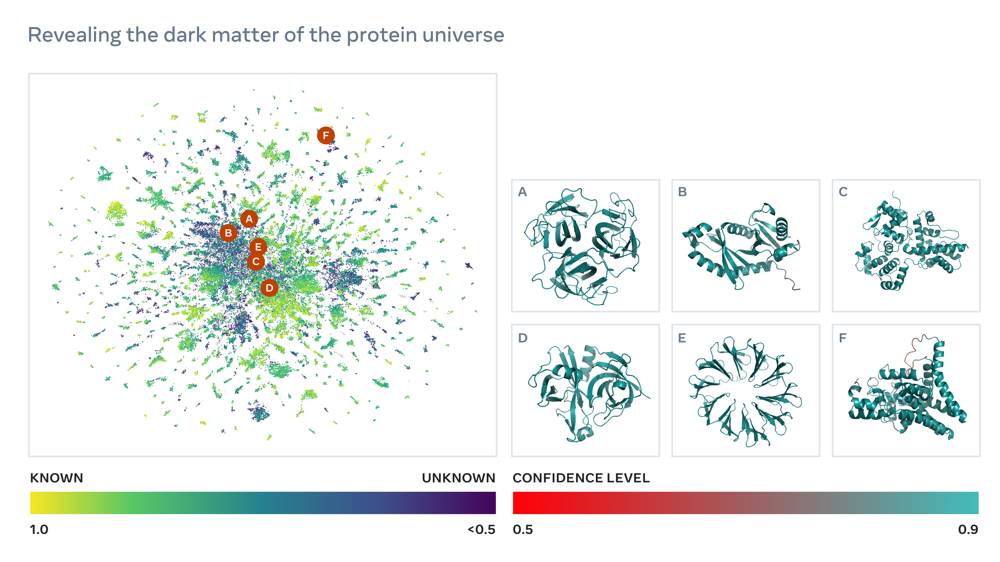{: width="100%"}

 More at:

  * [https://ai.facebook.com/blog/protein-folding-esmfold-metagenomics/](https://ai.facebook.com/blog/protein-folding-esmfold-metagenomics/)

 See also [E], [AlphaFold Model], [OpenFold Model]


## ESMFold Model Family

 See also [E], ...


## Estimator

 ~ a model to draw estimation from. `Estimators predict a value based on observed data`. Estimation is a statistical term for finding some estimate of unknown parameter, given some data. Point Estimation is the attempt to provide the single best prediction of some quantity of interest. Quantity of interest can be: A single parameter, A vector of parameters — e.g., weights in linear regression, A whole function.

 See also [E], [Function Estimation], [Point Estimator]


## Ethical AI

 Examples of ethical problems with AI

  * About the model
    * Bias
  * About the industry
    * Concentration
  * About use of the output
    * Fake media
    * Deep fake

 5 Key ethical concepts in [Responsible AI] :

 1. Accountability
  * When one is accountable, then one has to account for something
  * An accountability framework refers to the formal and codified system for holding someone accountable within a specific social or organization context
  * It can include processes for managing or explaining decision making in an organization. It also involves establishing clear roles, responsibilities and transparency with respect to who is responsible for what and how to rectify mistakes

 1. Fairness
  * When something is fair, then people are given what they are due or deserve
  * In law, fairness generally entails goals like non-discrimination, equality before the law, and procedural fairness.
  * Statistical notions of fairness vary as well, and it is not possible to satisfy simultaneous all these definitions of fairness
  * Many efforts to promote fairness in AI address the issue of [bias]
  * In [Responsible AI], fairness is a socio-technical concept

 1. Understanding
  * To understand means to grasp the core meaning or to comprehend
  * In the field of [Responsible AI], understanding is closely connected to [explainability]
  * [Explainability] means being able to explain the internal mechanisms of a system in human terms. While [explainability] is necessary for understanding, it is not sufficient
  * Understanding is audience-specific and contextual
  * Understanding matters because our stakeholders need to understand how and why AI is being used to make decisions that impact their lives

 1. Data stewardship
  * Stewardship is an ethical concept that means responsible management or care
  * Data stewardship necessitates that ethical data practices are in place to not only ensure data quality, integrity, and protection, but also to preserve customer's right to privacy and meaningful, informed consent
  * Machine learning is driven by data
  * Data is tangible asset in the information-based economy and ethical data practices are an important element of [Responsible AI]

 1. Safety
  * Being safe means being protected from harm or threats
  * Commonly, people think of physical safety, but there are other forms of safety, such as emotional, psychological, and financial safety
  * Safety is also a cluster-concept in [Responsible AI]
  * From a technical perspective, safety often means that an AI system's outputs are accurate, secure from hostile actors, robust, and reliable in different settings and over time
  * From a social and ethical perspective, safety is more robust concept that includes consideration of how an AI system will affect people's well-being, rights, and interests, as well as the broader safety of social institutions and the natural environment

 

 

 More at:

  * kaggle course - [https://www.kaggle.com/code/var0101/introduction-to-ai-ethics](https://www.kaggle.com/code/var0101/introduction-to-ai-ethics)
  * [https://hbr.org/2020/10/a-practical-guide-to-building-ethical-ai](https://hbr.org/2020/10/a-practical-guide-to-building-ethical-ai)
  * ethics card - [https://www.ideo.com/blog/ai-needs-an-ethical-compass-this-tool-can-help](https://www.ideo.com/blog/ai-needs-an-ethical-compass-this-tool-can-help)
  * [https://scottaaronson.blog/?p=6823](https://scottaaronson.blog/?p=6823)
  * comic and copyright - [https://aibusiness.com/nlp/ai-generated-comic-book-keeps-copyright-well-some-of-it](https://aibusiness.com/nlp/ai-generated-comic-book-keeps-copyright-well-some-of-it)
  * AAAI ethics and diversity - [https://aaai.org/about-aaai/ethics-and-diversity/](https://aaai.org/about-aaai/ethics-and-diversity/)

 See also [E], ...


## Euclidean Geometry

 Euclid is said to be the father of geometry, not the first one that studied geometry!

 Axioms (or postulates)

  1. A straight line segment can be drawn joining any two points
  2. Any straight line segment can be extended indefinitely in a straight line
  3. A circle can be drawn with any center and any radius
  4. All right angles are congruent
  5. If two lines are drawn which intersect a third in such a way that the sum of the inner angles on one side is less than two right angles, then the two lines inevitably must intersect each other on that side if extended far enough

 This 5th postulate is known as the parallel postulate

 What was revolutionary in his thinking was that from those postulates, he was able to prove many concepts in geometry.

 

 

 More at:

  * [https://en.wikipedia.org/wiki/Euclidean_geometry](https://en.wikipedia.org/wiki/Euclidean_geometry)

 See also [E], ...


## Euclidean Distance

 ~ distance using Pythagoras theorem (hypothenus of a triangle)

 A [similarity metric] used to compute the distance between 2 [embeddings]!

 * the output is within the range [-oo, +oo]
 * the closer the output is to 0, the mode similar inputs are 
 * unlike the [cosine similarity], this one is sensitive to the absolute distance in the space

 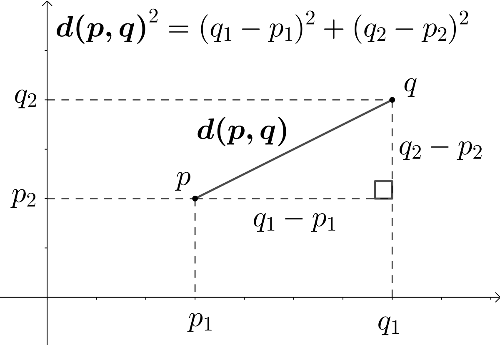{: width="100%"}

```
The biggest difference is that Cosine similarity is insensitive to the absolute distance in the space, only directional difference matters. What does this mean? Let’s use one example to illustrate. Let’s say that we have user A who rates 2 movies as (4,4) and user B who rates 2 moves as (5,5). If we compute Cosine similarity and Euclidean similarity separately for these two users, it’s obvious that Cosine similarity is 1, which means that there is no difference between these two users. However, the Euclidean similarity is 1.4, which means that user A and user B are still different from each other. Thus Euclidean similarity is more strict than Cosine similarity because Euclidean similarity not only requires users to have the same taste in movies but also to have the same level of ‘like’ for every movie.
```

 More at:

  * wikipedia - [https://en.wikipedia.org/wiki/Euclidean_distance](https://en.wikipedia.org/wiki/Euclidean_distance)
  * articles
    * [https://hackernoon.com/understanding-the-two-tower-model-in-personalized-recommendation-systems](https://hackernoon.com/understanding-the-two-tower-model-in-personalized-recommendation-systems)

 See also [E], ...


## European Union (EU) AI Act

 * doc 1 - [https://eur-lex.europa.eu/resource.html?uri=cellar:e0649735-a372-11eb-9585-01aa75ed71a1.0001.02/DOC_1&format=PDF](https://eur-lex.europa.eu/resource.html?uri=cellar:e0649735-a372-11eb-9585-01aa75ed71a1.0001.02/DOC_1&format=PDF)
 * doc 2 - [https://eur-lex.europa.eu/resource.html?uri=cellar:e0649735-a372-11eb-9585-01aa75ed71a1.0001.02/DOC_2&format=PDF](https://eur-lex.europa.eu/resource.html?uri=cellar:e0649735-a372-11eb-9585-01aa75ed71a1.0001.02/DOC_2&format=PDF)

 

 

 More at:

  * [https://eur-lex.europa.eu/legal-content/EN/TXT/?uri=celex%3A52021PC0206](https://eur-lex.europa.eu/legal-content/EN/TXT/?uri=celex%3A52021PC0206)
  * decoding - [https://hai.stanford.edu/news/analyzing-european-union-ai-act-what-works-what-needs-improvement](https://hai.stanford.edu/news/analyzing-european-union-ai-act-what-works-what-needs-improvement)

 See also [E], [AI Bill Of Rights], [ISO 42001], [Regulatory Landscape]


## Evident AI Index

 ~ A flagship publication by [Evident Insights]

 

 More at:

  * [https://www.evidentinsights.com/ai-index/](https://www.evidentinsights.com/ai-index/)

 See also [E], ...


## Evident AI Innovation Report

 ~ A flagship publication by [Evident Insights]

 In a time of rapid AI advancement, how are leading banks keeping up with the pace of AI innovation? And what are the secrets of their success?

 This report covers the developments of in-house AI research teams; the pros and cons of patents; how leading banks are engaging with academia and the open source ecosystem; and addresses long-standing questions about when to 'build' and when to 'buy'.

 

 More at:

  * [https://www.evidentinsights.com/insights/](https://www.evidentinsights.com/insights/)

 See also [E], ...


## Evident AI Leadership Report

 ~ A flagship publication by [Evident Insights]

 Becoming an AI-first bank requires strong top-down leadership, strategic prioritisation, and clear and consistent messaging to various stakeholders.

 This report examines the extent to which AI is positioned at the heart of a bank’s external narrative across mainstream media, press releases, social media, and investor relations. It further assesses where and how senior leadership is amplifying that message.

 

 More at:

  * [https://www.evidentinsights.com/insights/](https://www.evidentinsights.com/insights/)

 See also [E], ...


## Evident AI Outcomes Report

 ~ A flagship publication by [Evident Insights]

 As the race for AI adoption in banking intensifies, the Evident AI Outcomes Report examines how banks are setting themselves up to drive, and accelerate, value from AI.

 It marks the first step towards benchmarking AI outcomes across the sector. Our ambition is to provide a common framework which will enable banks to evaluate and compare their AI outcomes vs peers.

 

 More at:

  * [https://www.evidentinsights.com/insights/](https://www.evidentinsights.com/insights/)

 See also [E], ...


## Evident AI Talent Report

 ~ A flagship publication by [Evident Insights]

 Our biannual in-depth analysis of AI talent trends in the banking sector.

 This report examines why talent is central to the coming AI transformation of the banking industry, what banks are doing to develop their talent, and where they stand in the race to recruit and retain the brightest minds working in AI today.

 

 More at:

  * [https://www.evidentinsights.com/insights/](https://www.evidentinsights.com/insights/)

 See also [E], ...


## Evident Insights Company

 Evident provides the most in-depth and up-to-date analysis of AI adoption across the banking sector. We map best practice and help banks to benchmark their progress against their peers.

 Flagship publications:

  * [Evident AI Index] - 
  * [Evident AI Innovation Report] - research, patents, ventures, ecosystem
  * [Evident AI Leadership Report] - coms, executive positioning, operating model, strategy
  * [Evident AI Outcomes Report] - use cases, ROI, ideation, delivery
  * [Evident AI Talent Report] - Acquisition, staffing, development, retention

 More at:

  * [https://www.evidentinsights.com/insights/](https://www.evidentinsights.com/insights/)
  * twitter - [https://twitter.com/evident_hq](https://twitter.com/evident_hq)

 See also [E], ...


## Evolution Strategy (ES)

 Evolution Strategies (ES) is a type of [reinforcement learning algorithm] based on principles of biological evolution. The key characteristics are:

  * Optimization is performed through a population of parameter vectors (genotypes).
  * Each parameter vector encodes the policy/solution, analogous to a genome.
  * The population is mutated to produce new candidate solutions.
  * Solutions are evaluated on the task and assigned a fitness score.
  * Higher scoring solutions are more likely to be selected for the next generation through a selection operator.
  * Mutations and selection applied over generations gradually improves the solutions.
  * ES methods only need the scalar reward signal, not gradients.
  * Key parameters to tune are population size, mutation strength & type, selection pressure.
  * Compared to [deep RL], ES can optimize policies with larger parameter spaces but is [sample inefficient].
  * Modern ES methods incorporate recombination and adaptive mutation rates.
  * ES is simpler to implement than backprop-based methods and trivially parallelizable.
  * ES has shown successes in robotics, game AI, neuroevolution, and optimization.
 
 In summary, evolution strategies mimic biological evolution to train policies and optimize solutions through mutations, fitness evaluation, and selection over generations. It provides a gradient-free alternative to deep RL.

 See also [E], ...


## Evolutionary AI

 See also [E], ...


## Evolutionary Scale AI Company

 A spin-off from Facebook focusing on life-science

 Models:

  * [Evolutionary Scale Models]

 More at:

  * [https://github.com/facebookresearch/esm](https://github.com/facebookresearch/esm)

 See also [E], ...


## Evolutionary Scale Model (ESM) Family

 

 

 More at:

  * ESM3 
    * site - [https://www.evolutionaryscale.ai/blog/esm3-release](https://www.evolutionaryscale.ai/blog/esm3-release)
    * paper - [https://www.openread.academy/en/paper/reading?corpusId=504814170](https://www.openread.academy/en/paper/reading?corpusId=504814170)

 See also [E], ...


## Ex Machina Movie

 Ex Machina is a 2014 science fiction film written and directed by Alex Garland in his directorial debut. 
 In the film, programmer Caleb Smith (Gleeson) is invited by his CEO (Isaac) to administer the Turing test to an intelligent humanoid robot (Vikander).

 

 More at:

  * [https://en.wikipedia.org/wiki/Ex_Machina_(film)](https://en.wikipedia.org/wiki/Ex_Machina_(film)) 

 See also [E], [AI Movie]


## Example

 The values of one row of features and possibly a label. Examples in supervised learning fall into two general categories:

  * A labeled example consists of one or more features and a label. Labeled examples are used during training.
  * An unlabeled example consists of one or more features but no label. Unlabeled examples are used during inference.

 For instance, suppose you are training a model to determine the influence of weather conditions on student test scores. Here are three labeled examples:

 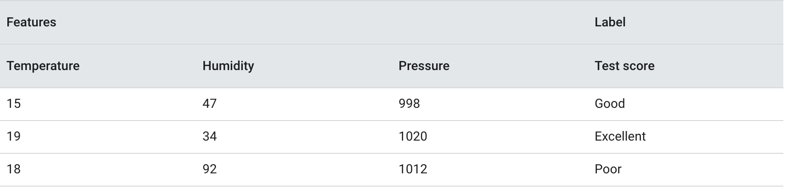{: width="100%"}

  Here are three unlabeled examples:

 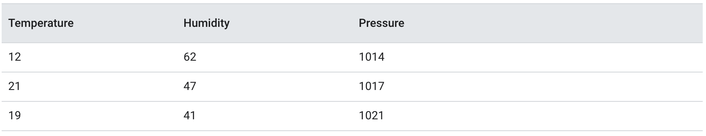{: width="100%"}

 The row of a [dataset] is typically the raw source for an example. That is, an example typically consists of a subset of the columns in the dataset. Furthermore, the features in an example can also include [synthetic features], such as [feature crosses].

 See also [E], ...


## Example-Based Machine Translation (EBMT)

 Example-based machine translation (EBMT) is a method of [machine translation] often characterized by its use of a bilingual [corpus] with parallel texts as its main knowledge base at run-time. It is essentially a translation by analogy and can be viewed as an implementation of a [case-based reasoning] approach to [machine learning].

 More at:

  * [https://en.wikipedia.org/wiki/Example-based_machine_translation](https://en.wikipedia.org/wiki/Example-based_machine_translation)

 See also [E], ...


## Executive Order (EO) on AI

 EO 14110 based on the [AI Bill Of Rights]

 The Executive Order directs actions:

  * New standards for AI safety
  * Protecting Americans' privacy
  * Advancing equity and civil rights
  * Standing up for consumers, patients, and students
  * Supporting workers
  * Promoting innovation and competition
  * Advancing American leadership abroad
  * Ensuring responsible and effective government use of AI

```
Shape AI’s potential to transform education by creating resources to support educators deploying AI-enabled educational tools, such as personalized tutoring in schools.
```

 

 

 

 

 More at:

  * Oct 30th 2023 - Federal Government
    * Fact sheet - [https://www.whitehouse.gov/briefing-room/statements-releases/2023/10/30/fact-sheet-president-biden-issues-executive-order-on-safe-secure-and-trustworthy-artificial-intelligence/](https://www.whitehouse.gov/briefing-room/statements-releases/2023/10/30/fact-sheet-president-biden-issues-executive-order-on-safe-secure-and-trustworthy-artificial-intelligence/)
    * EO - [https://www.whitehouse.gov/briefing-room/presidential-actions/2023/10/30/executive-order-on-the-safe-secure-and-trustworthy-development-and-use-of-artificial-intelligence/](https://www.whitehouse.gov/briefing-room/presidential-actions/2023/10/30/executive-order-on-the-safe-secure-and-trustworthy-development-and-use-of-artificial-intelligence/)
    * wikipedia - [https://en.wikipedia.org/wiki/Executive_Order_14110](https://en.wikipedia.org/wiki/Executive_Order_14110)
  * Sept 06 2023 - Office of Governor
    * [https://www.gov.ca.gov/2023/09/06/governor-newsom-signs-executive-order-to-prepare-california-for-the-progress-of-artificial-intelligence/](https://www.gov.ca.gov/2023/09/06/governor-newsom-signs-executive-order-to-prepare-california-for-the-progress-of-artificial-intelligence/)

 See also [E], ...


## ExecuTorch

 ~ framework to run torch model on edge devices

 

 See also [E], ...


## Expected Value

 

 See also [E], ...


## Experience

 In [reinforcement learning], an experience is a sample of data that an agent observes when interacting with the environment in order to learn. An experience typically contains:

  * The state (S) - The representation of the environment's condition when the agent selected an action. This captures relevant details about the situation.
  * The action (A) - The specific action the agent took in that state. Drawn from the set of possible actions.
  * The reward (R) - The feedback signal the agent received after taking that action in that state. Indicates the desirability of the resulting state.
  * The next state (S') - The new state of the environment triggered by the action. Represents the consequences of the action.
  * Done - A boolean indicating if S' is a terminal state ending the episode.

 So a full experience would be represented as (S, A, R, S', Done). The sequence of states, actions and rewards make up the agent's trajectory in the environment.

 These experiences are stored in the agent's experience memory. Algorithms like deep Q-learning then sample from this memory to train the neural network policy and value functions. The diverse experiences allow the agent to learn how actions connect states and rewards.

 In summary, experiences are the atomic pieces of observed data that the reinforcement learning agent collects through environmental interaction to learn the optimal policy. They capture the state transitions, actions and rewards.

 See also [E], ...


## Experience Batch

 A set of experiences, most likely sampled randomly from the [replay memory].

 See also [B], ...


## Experience Replay

 ~ In [reinforcement learning], a [DQN] technique used to reduce temporal correlations in training data. The [RL agent] stores state transitions in a [replay buffer], and then samples transitions from the replay buffer to create training data.

 Experience replay, a common RL technique, used in [Deep Q-Networks] amongst others, is another in-between approach ([Offline learning] vs [Online Learning]). Although you could store all the [experience] necessary to fully train an [agent] in theory, typically you store a rolling history and sample from it. It's possible to argue semantics about this, but I view the approach as being a kind of "[buffered online learning]", as it requires low-level components that can work online (e.g. neural networks for [DQN]).

 Experience is stored in the [replay memory]. To train the [DQN] network, the training algorithm sample from the experiences from that memory! So experience replay is

  * sampling from the replay memory that stores the last-N experiences
  * to gain experience (i.e. be trained)
  * Take random sample from the replay memory

 :warning: Do not use consecutive experiences to prevent correlation between consecutive samples to manifest and lead to inefficient learning!

 

 More at:

  * [https://ai.stackexchange.com/questions/10474/what-is-the-relation-between-online-or-offline-learning-and-on-policy-or-off](https://ai.stackexchange.com/questions/10474/what-is-the-relation-between-online-or-offline-learning-and-on-policy-or-off)

 See also [E], [Actor-Critic with Experience Replay Algorithm]


## Experience Replay Buffer

 See also [E], ...


## Experiment

 In AI/ML, an experiment refers to a structured process of testing and evaluating different models, algorithms, or configurations to achieve a particular goal, like maximizing accuracy or minimizing loss. Each experiment typically involves a unique combination of data preprocessing steps, model architectures, hyperparameters, training techniques, and other configurations. By running experiments, data scientists and machine learning engineers test hypotheses about how changes to these components affect performance on specific tasks.

 See also [E], [Experiment Tracking]


## Experiment Tracking

 Experiment tracking is the practice of systematically recording and organizing the details of each experiment. This includes tracking parameters, code versions, datasets, metrics (e.g., accuracy, loss), and even environment details (like software and hardware specifications) used in the experiment. Effective experiment tracking allows for:

  * Reproducibility: So results can be verified or re-created.
  * Comparability: Allowing researchers to evaluate which configurations yield the best results.
  * Collaboration: Making it easier for team members to understand past experiments and build on each other's work.
  * Optimization: By maintaining a detailed history, researchers can observe trends and make informed decisions on improving models over time.

 Tools like [MLflow], [Weights & Biases], and [Neptune] are commonly used for experiment tracking in ML workflows.

 See also [E], ...


## Expert System

 In [artificial intelligence], an expert system is a computer system emulating the decision-making ability of a human expert. Expert systems are designed to solve complex problems by reasoning through bodies of knowledge, represented mainly as if–then rules rather than through conventional procedural code. The first expert systems were created in the 1970s and then proliferated in the 1980s. Expert systems were among the first truly successful forms of artificial intelligence (AI) software. An expert system is divided into two subsystems: the inference engine and the knowledge base. The knowledge base represents facts and rules. The inference engine applies the rules to the known facts to deduce new facts. Inference engines can also include explanation and debugging abilities.

 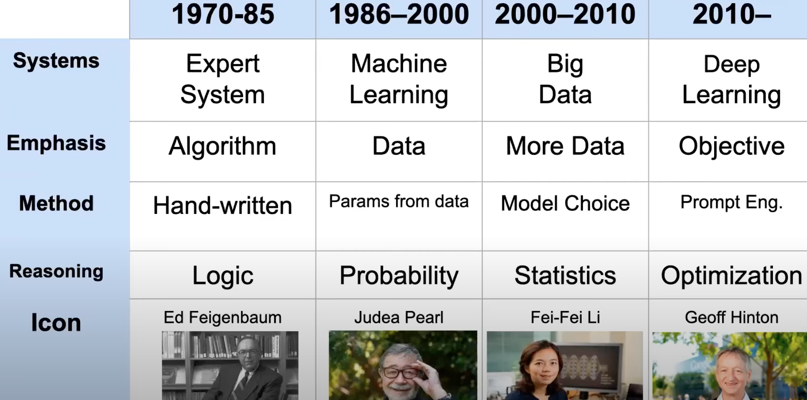{: width="100%"}

 More at:

  * [https://en.wikipedia.org/wiki/Expert_system](https://en.wikipedia.org/wiki/Expert_system)

 See also [E], [Big Data], [Deep Learning], [Logical Reasoning], [Machine Learning], [Optimization], [Statistics]


## Explainability

 How to explain the output of the AI or the inner working of an AI model (Neural network)

 

 See also [E], [Model Governance]


## Explainability Spectrum

 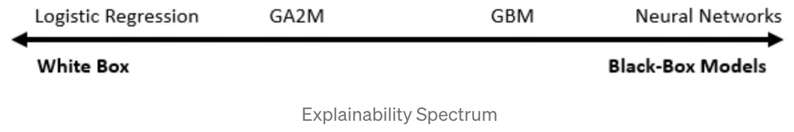{: width="100%"}

 More at:

  * LLM can explain neurons - [https://openai.com/research/language-models-can-explain-neurons-in-language-models](https://openai.com/research/language-models-can-explain-neurons-in-language-models)

 See also [E], [Chain-Of-Thought Prompting]


## Explainability

 See also [E], ...


## Explainable AI (XAI)

 As more and more companies embed AI and advanced analytics within a business process and automate decisions, there needs to have transparency into how these models make decisions grows larger and larger. How do we achieve this transparency while harnessing the efficiencies AI brings. This is where the field of Explainable AI (XAI) can help. 

 

 More at:

  * whitepaper - [https://storage.googleapis.com/cloud-ai-whitepapers/AI%20Explainability%20Whitepaper.pdf](https://storage.googleapis.com/cloud-ai-whitepapers/AI%20Explainability%20Whitepaper.pdf)
  * [https://towardsdatascience.com/what-is-explainable-ai-xai-afc56938d513](https://towardsdatascience.com/what-is-explainable-ai-xai-afc56938d513)
  * [https://en.wikipedia.org/wiki/Explainable_artificial_intelligence#](https://en.wikipedia.org/wiki/Explainable_artificial_intelligence#)

 See also [E], [Black Box Model], [White Box Model]


## Explanatory Variable

 We will refer to inputs as features, and the phenomena they represent as explanatory variables. Other names for explanatory variables include "predictors", "regressors", "controlled variables", and "exposure variables".

 See also [E], [Feature], [Response Variable]


## Exploding Gradient Problem

 Activation that are large trends to become larger and larger! The solution for this is to use activation functions such as the sigmoid or the tanh ones. Unfortunately using such activation function leads to the vanishing gradient problem experienced during backpropagation. Another solution is to use gradient clipping in backpropagation.

 See also [E], [Activation Function], [Gradient Clipping], [Recurrent Neural Network], [Vanishing Gradient Problem]


## Exploitation

 When exploiting, unlike exploration the goal is to maximize the reward. During exploitation, the agent choose for a given state the action corresponding to the state optimal [Q-value]. ( = the highest Q-value = the highest expected total reward) :warning: Before exploiting an environment to the max, you need to explore it! 

 In [reinforcement learning], when we refer to "exploration", it typically means the agent is exploring the environment's [action space] and [state space], rather than the [environment] itself being explored.

 Specifically:

  * The [environment] is the problem or world the [agent] is interacting with and trying to maximize [rewards] in. The environment itself is fixed.
  * The agent explores by taking various actions in different states to discover which actions yield the highest rewards in which states.
  * It is exploring the [action space] by trying different available actions to see their outcomes.
  * It is exploring the [state space] by visiting new states it has not encountered before.
  * The key tradeoff is between [exploration] of uncharted actions and states vs. exploitation of known rewarding actions in familiar states.
  * The goal is to build an optimal policy mapping states to actions that maximizes long-term [cumulative reward] through a balance of [exploration] and exploitation.

 So in essence, "exploration" refers to the agent's activity of exploring the search space of possible actions and states within a fixed environment, in order to learn an optimal policy for collecting rewards in that environment. The environment itself does not change or get explored.

 See also [E], ... 


## Exploration

 In [reinforcement learning], when an agent performs "exploration", it is exploring the [action] and [state] spaces of the environment, not the [environment] itself. Specifically:

  * The [environment] refers to the external world or system the [agent] is interacting with and trying to perform a task in. The [environment] itself does not change during the learning process.
  * The agent explores by taking different actions in different states to discover which actions yield the highest rewards in which situations.
  * The agent is exploring the [action space] - the set of possible actions the agent can take at any given state. It tries various actions to learn their outcomes.
  * It is also exploring the [state space] - the set of possible states the environment can be in. It visits new states it has not encountered before.
  * The goal of exploration is to build up [experience] about which actions maximizes long-term reward in different states. This is used to learn an [optimal policy].
  * Balancing exploration and exploitation of known rewards is key in reinforcement learning.

 So in summary, the agent explores the action and state spaces within a fixed environment to learn how to maximize [cumulative reward]. The environment itself does not change or get explored in the learning process. The search spaces being explored are the actions available to the agent and states the environment can be in.

 See also [E], ... 


## Exploration Rate

 The exploration rate, often represented by the Greek letter epsilon (ε), is a key [hyperparameter] used in [reinforcement learning algorithms] that employ an [epsilon-greedy exploration strategy]. Here are some key points about the exploration rate:

  * It controls the balance between exploration and exploitation during training. Exploration involves trying new actions randomly, while exploitation is taking the best known action based on past experience.
  * The exploration rate (epsilon) determines the probability that the agent will take a random exploratory action instead of the best exploitative action at any given time step.
  * Typically, epsilon starts closer to 1 early in training to encourage more random exploration. It is then decayed towards 0 as training progresses to focus more on exploitation.
  * Higher epsilon values force the agent to explore more. Lower epsilon values make it exploit learned knowledge more.
  * Setting the initial epsilon value and decay rate allows controlling this tradeoff between exploration and exploitation. Faster decay can be used for simpler environments.
  * Common decay functions include linear decay, exponential decay, or inverse sigmoid decay. The schedule can be based on number of timesteps or episodes.
  * Too little exploration can lead to the agent getting stuck in suboptimal policies. Too much exploration becomes inefficient if random actions are taken when better ones are known.
  * The optimal exploration rate schedule is environment-specific and must be tuned through multiple training iterations. Exploration is critical in the early learning phases.

 So in summary, the epsilon exploration rate is a key RL hyperparameter that controls the degree of exploration vs exploitation by determining the probability of taking random actions during training.

 See also [E], ...


## Exploratory Data Analysis (EDA)

 Exploratory Data Analysis (EDA) refers to the critical process of performing initial investigations on data to discover patterns, spot anomalies, test hypotheses and check assumptions.

 The key aspects of EDA include:

  * It is an open-ended data analysis approach aimed at finding the key characteristics and relationships in a [dataset] without any preconceived notions.
  * It relies heavily on [data visualization], i.e. visual methods like histograms, scatter plots, and other graphical techniques to provide overviews of data.
  * Summary statistics such as means, [variances], correlations are used to spotlight distribution characteristics.
  * It may employ methods like [clustering], [dimensionality reduction], [segmentation], and [outlier detection] to identify structure.
  * It explores whether the dataset is an imbalanced  or a [balanced dataset]
  * The goal is to learn what the data can tell us and extract important variables, identify underlying assumptions, and develop models/hypotheses for further analysis.
  * It is ultimately about developing an intuitive understanding of the dataset, the relations between variables, and informing next steps in formal modeling or hypothesis testing.
  * EDA is an iterative cycle as new insights and questions emerge throughout the analysis process.

 ==> [Data preprocessing]

 In summary, EDA is an critical first step in analyzing an unfamiliar dataset to discover patterns, anomalies, form hypotheses and develop intuition about a dataset prior to more formal modeling, inference or predictive analysis.

 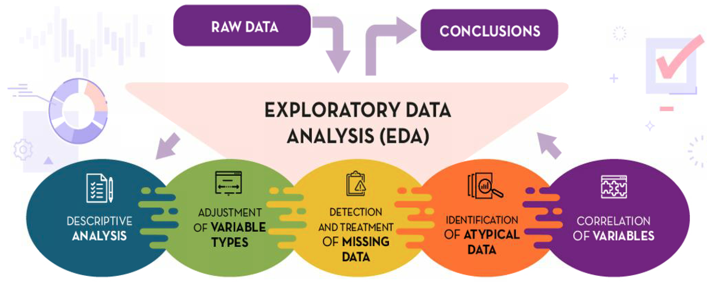{: width="100%"}

 See also [E], [AI Alignment]


## Exponential Linear Unit (ELU) Activation Function

 The ELU output for positive input is the input (identity). If the input is negative, the output curve is slightly smoothed towards the (minus) alpha constant (α). The higher the alpha constant, the more negative the output for negative inputs gets.

 ELU and ReLU are the most popular activation functions used. Here are the advantages and disadvantages of using it when compared to other popular activation functions.

 Advantages of ELU

  * Tend to converge faster than ReLU (because mean ELU activations are closer to zero)
  * Better generalization performance than ReLU
  * Fully continuous
  * Fully differentiable
  * Does not have a [vanishing gradient problem]
  * Does not have an [exploding gradient problem]
  * Does not have a [dying relu problem]

 Disadvantages of ELU

  * Slower to compute (because of non-linearity for negative input values)

 ELU is slower to compute, but ELU compensates this by faster convergence during training. During test time ELU is slower to compute than ReLU though.

```python
m = nn.ELU()
input = torch.randn(2)
output = m(input)
```

```python
import torch
from torch import nn
class Model(nn.Module):
    def __init__(self, dataset):
        super(Model, self).__init__()
        self.layer1 = nn.Sequential(
            nn.Conv3d(in_channels=4, out_channels=2, kernel_size=2),
            nn.ELU(alpha=2.0)
        )
    def forward(self, x):
        return self.layer1(x)
```

```python
import numpy as np
import matplotlib.pyplot as plt


def elu(x, u):
    if x >= 0:
        return x
    else:
        return u*(np.exp(x) - 1)


def elu_prime(x, u):
    if x >= 0:
        return 1
    else:
        return elu(x, u) + u


# For alpha = 1, 2, 3, 4
for u in range(1, 5):
    inputs = [x for x in range(-10, 11)]
    outputs = [elu(x, u) for x in inputs]
    output_prime = [elu_prime(x, u) for x in inputs]
    plt.plot(inputs, outputs)
    # plt.plot(inputs, output_prime)


plt.ylim(-1, 5)
plt.title("ELU outputs for inputs between -10 to 10")
plt.title("Derivative function of inputs between -10 to 10")
plt.ylabel("Outputs")
plt.xlabel("Inputs")
plt.show()
```

 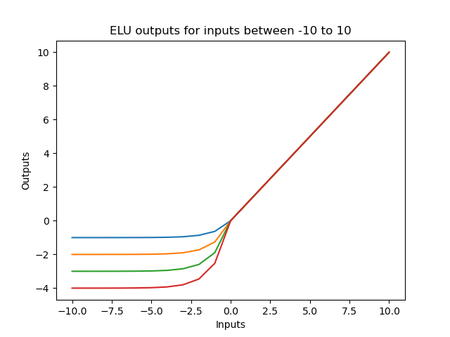{: width="100%"}

 More at:

  * [https://closeheat.com/blog/elu-activation-function](https://closeheat.com/blog/elu-activation-function)
  * pytorch docs - [https://pytorch.org/docs/master/generated/torch.nn.ELU.html](https://pytorch.org/docs/master/generated/torch.nn.ELU.html)

 See also [E], ...


## Exponential Technology

 Includes

  * Intelligence
    * [Artificial General Intelligence]
    * [Artificial Narrow Intelligence]
    * [Artificial Super Intelligence]
    * [Cognitive Computing]
    * [Creative Machine]
    * [Diffractive Neural Networks]
    * [DNA Neural Networks]
    * [Evolutionary Artificial Intelligence]
    * [Explainable Artificial Intelligence]
    * [Federated Artificial Intelligence]
    * [Machine Vision]
    * [Meta Artificial Intelligence]
    * [Natural Language Processing]
    * [Open Ended AI]
    * [Quantum Artificial Intelligence]
    * [Quantum Language Processing]
    * [Shallow Neural Networks]
    * [Simulation Engines]
    * [Swarm Artificial Intelligence]
  * Robotics
    * [Androids]
    * [Bio-Hybrid Robots]
    * [Cyborgs]
    * [DNA Robots]
    * [Drones]
    * [Evolutionary Robotics]
    * [Exo-Suits]
    * [General Purpose Robots]
    * [Inflatable Robots]
    * [Living Robots]
    * [Molecular Robots]
    * [Nano-Machines]
    * [Neurobiotics]
    * [Robots]
    * [Shape Shifting Robots]
    * [Soft Robots]
    * [Swarm robots]
    * [Syncell Robots]
  * User Interfaces
    * [AI Symbiosis]


 

 

 {% pdf "https://www.311institute.com/codexes/311%20Institute%20-%20The%20Future%20of%20Exponential%20Technology.pdf" %}

 More at:

  * [https://www.311institute.com/fanaticalfuturist-codex-of-the-future/](https://www.311institute.com/fanaticalfuturist-codex-of-the-future/)

 See also [E], ...


## Expressiveness

 See also [E], [Hyperparameter]


## Extreme Gradient Boosting (XGBoost)

 An ensemble method, XGBoost (extreme gradient boosting) is a popular and efficient open-source implementation of the gradient-boosted trees algorithm. Gradient boosting is a machine learning algorithm that attempts to accurately predict target variables by combining the estimates of a set of simpler, weaker models (several decision trees?). By applying gradient boosting to decision tree models in a highly scalable manner, XGBoost does remarkably well in machine learning competitions. It also robustly handles a variety of data types, relationships, and distributions. It provides a large number of hyperparameters—variables that can be tuned to improve model performance. This flexibility makes XGBoost a solid choice for various [supervised machine learning] tasks/problems such as [classifications] and [regressions].

 Example image recognition of a car: Before you recognize the car, does the thing have wheels, are they door, etc... if it has all of those features then it must be a car.

 Here's why XGBoost stands out:

  * Efficiency and Speed: XGBoost is highly optimized for speed and performance. It uses efficient memory usage and parallel processing, making it suitable for large datasets and often faster than many other algorithms.
  * Regularization: XGBoost has built-in regularization terms (L1 and L2) that help prevent overfitting, giving it an advantage over other gradient-boosting frameworks by enhancing generalization.
  * Handling Missing Data: XGBoost can automatically learn best values for missing data, which makes it more flexible for real-world data with incomplete entries.
  * Tree Pruning: It uses a "maximum depth" parameter to prevent trees from growing too complex and overfitting, as well as a "min_child_weight" parameter to ensure each leaf node has a minimum amount of data, improving overall robustness.
  * Cross-Validation Support: XGBoost has built-in support for cross-validation, helping optimize model parameters during training.
  * Wide Application: Due to its effectiveness, XGBoost is widely used in machine learning competitions and is a go-to model for structured/tabular data, where its performance often outshines simpler algorithms.

 XGBoost has been applied in various fields, from finance to healthcare, and is especially popular in competitions like Kaggle due to its high accuracy and flexibility.

 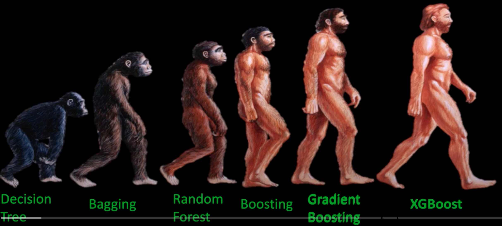{: width="100%"}

```python
# Import necessary libraries
import xgboost as xgb
from sklearn.model_selection import train_test_split
from sklearn.datasets import load_iris
from sklearn.metrics import accuracy_score

# Load the Iris dataset
data = load_iris()
X = data.data
y = data.target

# Split the data into training and testing sets
X_train, X_test, y_train, y_test = train_test_split(X, y, test_size=0.2, random_state=42)

# Create the XGBoost model
# XGBClassifier is the classification model from the XGBoost library.
# We specify parameters, such as objective='multi:softmax' for multi-class classification and eval_metric='mlogloss' to track log-loss during training.
model = xgb.XGBClassifier(objective='multi:softmax', num_class=3, eval_metric='mlogloss', use_label_encoder=False)

# Train the model
model.fit(X_train, y_train)

# Make predictions on the test set
y_pred = model.predict(X_test)

## Evaluate the model
accuracy = accuracy_score(y_test, y_pred)
print(f"Accuracy: {accuracy * 100:.2f}%")
```

 

 

 
  
 

 

 

 See also [E], [Bagging], [Boosting], [Classification], [Ensemble Method], [Hyperparameters], [Machine Learning], [Random Forest], [Ranking], [Regression]
