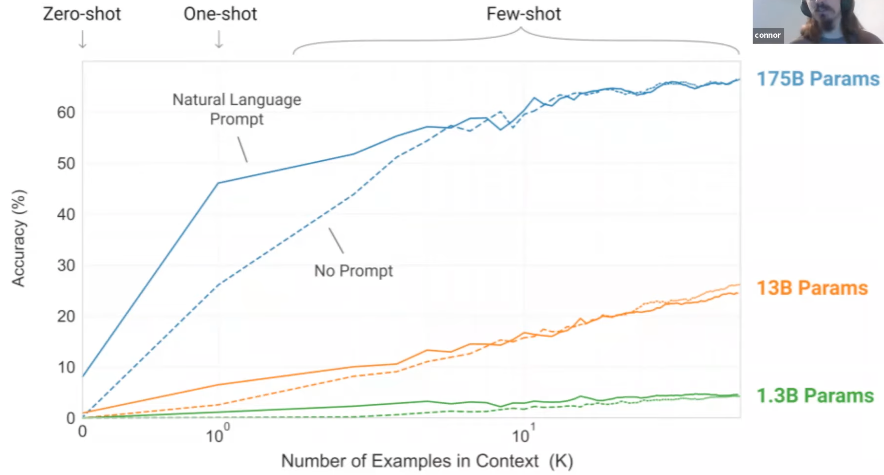

# F

## F1 Score

 Harmonic mean of precision and recall. A metric used for [model evaluation] in scenarios where both [false positives] and [false negatives] are crucial. For instance, in information retrieval or sumarization tasks.

 A Measure of [accuracy] of a model. Used to find [hyperparameter optimization].

 When to use? F1-Score is used when the [False Negatives] and [False Positives] are important. F1-Score is a better metric for [imbalanced datasets].

 More at:

  * [https://medium.com/analytics-vidhya/what-is-a-confusion-matrix-d1c0f8feda5](https://medium.com/analytics-vidhya/what-is-a-confusion-matrix-d1c0f8feda5)

 See also [F], [Confusion Matrix], [Hyperparameter Optimization]


## Face Detection

 See also [F], ...


## Facebook AI Similarity Search (FAISS)

 Faiss is a library for efficient similarity search and clustering of dense vectors. It contains algorithms that search in sets of vectors of any size, up to ones that possibly do not fit in RAM. It also contains supporting code for evaluation and parameter tuning. Faiss is written in C++ with complete wrappers for Python/numpy. Some of the most useful algorithms are implemented on the GPU. It is developed primarily at [Meta]'s Fundamental AI Research group.

```python
# Getting some data

import numpy as np
d = 64                           # dimension
nb = 100000                      # database size
nq = 10000                       # nb of queries
np.random.seed(1234)             # make reproducible
xb = np.random.random((nb, d)).astype('float32')
xb[:, 0] += np.arange(nb) / 1000.
xq = np.random.random((nq, d)).astype('float32')
xq[:, 0] += np.arange(nq) / 1000.

# Building an index and adding the vectors to it

import faiss                   # make faiss available
index = faiss.IndexFlatL2(d)   # build the index
print(index.is_trained)
index.add(xb)                  # add vectors to the index
print(index.ntotal)

# Searching

k = 4                          # we want to see 4 nearest neighbors
D, I = index.search(xb[:5], k) # sanity check
print(I)
print(D)
D, I = index.search(xq, k)     # actual search
print(I[:5])                   # neighbors of the 5 first queries
print(I[-5:])                  # neighbors of the 5 last queries
```

 More at:

  * site - [https://ai.meta.com/tools/faiss/](https://ai.meta.com/tools/faiss/)
  * code - [https://github.com/facebookresearch/faiss](https://github.com/facebookresearch/faiss)
  * docs - [https://github.com/facebookresearch/faiss/wiki](https://github.com/facebookresearch/faiss/wiki)
  * tutorials - [https://github.com/facebookresearch/faiss/wiki/Getting-started](https://github.com/facebookresearch/faiss/wiki/Getting-started)

## Facebook Company

 See [Meta Company]


## Facial Recognition

 Models:

  * 1996 - FERET
  * 2014 - DeepFace

 Datasets:

  * 2007 - Labeled Faces in the Wild (LFW) data set

 {: width="100%"}

 {: width="100%"}

 More at:

  * articles
    * [https://www.technologyreview.com/2021/02/05/1017388/ai-deep-learning-facial-recognition-data-history](https://www.technologyreview.com/2021/02/05/1017388/ai-deep-learning-facial-recognition-data-history)

 See also [F], ...


## Fair AI

 More at:

  * [https://mostly.ai/blog/we-want-fair-ai-algorithms-but-how-to-define-fairness](https://mostly.ai/blog/we-want-fair-ai-algorithms-but-how-to-define-fairness)
  * Fair synthetic data generation - [https://mostly.ai/blog/diving-deep-into-fair-synthetic-data-generation-fairness-series-part-5](https://mostly.ai/blog/diving-deep-into-fair-synthetic-data-generation-fairness-series-part-5)

 See also [F], [Algorithmic Amplification]


## FAIRSEQ Toolkit

 Built by [Meta] on the top of [PyTorch]

 Includes the following models

  * [Wav2Letter]
  * [Wav2Vec]
  * ...

 

 

 More at:

  * code - [https://github.com/facebookresearch/fairseq](https://github.com/facebookresearch/fairseq)


## Fake Art

 More at:

  * [https://nypost.com/2023/04/05/how-frightening-new-ai-midjourney-creates-realistic-fake-art/](https://nypost.com/2023/04/05/how-frightening-new-ai-midjourney-creates-realistic-fake-art/)

 See also [F], ...


## Fake News

  More at:

   * SIFT method - [https://oer.pressbooks.pub/collegeresearch/chapter/the-sift-method/](https://oer.pressbooks.pub/collegeresearch/chapter/the-sift-method/)

  See also [F], ...


## Falcon Model Family

```python
from langchain import HuggingFacePipeline
from transformers import AutoTokenizer, pipeline
import torch

model = "tiiuae/falcon-7b-instruct" # You can also use the larger model falcon-40b-instruct

tokenizer = AutoTokenizer.from_pretrained(model)

pipeline = pipeline(
    "text-generation", #task
    model=model,
    tokenizer=tokenizer,
    torch_dtype=torch.bfloat16,
    trust_remote_code=True,
    device_map="auto",
    max_length=10000,
    do_sample=True,
    top_k=10,
    num_return_sequences=1,
    eos_token_id=tokenizer.eos_token_id
)

llm = HuggingFacePipeline(pipeline = pipeline, model_kwargs = {'temperature':0})

from langchain import PromptTemplate,  LLMChain

template = """
You are an ethical hacker and programmer. Help the following question with brilliant answers.
Question: {question}
Answer:"""
prompt = PromptTemplate(template=template, input_variables=["question"])

llm_chain = LLMChain(prompt=prompt, llm=llm)

question = "Create a python script to send a DNS packet using scapy with a secret payload "

print(llm_chain.run(question))

```

 More at:

  * colab - [https://colab.research.google.com/drive/1rLShukC14BodnSI9OTyBLu9v0CVrrCsi?usp=sharing](https://colab.research.google.com/drive/1rLShukC14BodnSI9OTyBLu9v0CVrrCsi?usp=sharing)

 See also [F], ...


## False Negative (FN)

 When a [binary classifier] says it is negative, when instead it was positive. Also called type II error!

 See also [F], [Confusion Matrix], [F1 Score]


## False Negative Rate (FNR)

 See also [F], ...


## False Positive (FP)

 When a [binary classifier] says it is positive, when instead it was negative. Also called type I error !

 See also [F], [Confusion Matrix], [F1 Score]


## False Positive Rate (FPR)

 ~ (1 - [Specificity] )

```
     FP            negatives detected as positives
 ---------  =   ------------------------------------
  FP + TN                 total negatives
```

 {: width="100%"}

 See also [F], [True Positive Rate]


## Fashion MNIST Dataset

 See [MNIST Dataset]


## Fast Random Projection (FastRP)

 FastRP, a scalable and performant algorithm for learning distributed node representations in a graph. FastRP is over 4,000 times faster than state-of-the-art methods such as [DeepWalk] and [node2vec], while achieving comparable or even better performance as evaluated on several real-world networks on various downstream tasks. We observe that most network embedding methods consist of two components: construct a node similarity matrix and then apply dimension reduction techniques to this matrix. 

 

 

 More at:

  * paper - [https://arxiv.org/abs/1908.11512](https://arxiv.org/abs/1908.11512)
  * articles
    * [https://towardsdatascience.com/behind-the-scenes-on-the-fast-random-projection-algorithm-for-generating-graph-embeddings-efb1db0895](https://towardsdatascience.com/behind-the-scenes-on-the-fast-random-projection-algorithm-for-generating-graph-embeddings-efb1db0895)

 See also [F], ...


## Feature

/// warning | features are expected to be independent variables between each other (and the output/prediction is dependent on the inputs/features)
///

 ==Input parameter to the model==. Which features are important to make the right prediction? Beware that the dataset needs to be at least 10 times the number of features.

 A feature is a characteristic of a piece of data that the computer needs to know about in order to learn about that kind of data. These characteristics, or features, are used by AI systems to come up with patterns about the data and then make predictions using those patterns. Theses features are often stored in variables so that the computer can use them later!

 See also [F], [Data Point], [Dataset], [Explanatory Variable], [Feature Engineering], [Feature Extraction], [Feature Vector], [Naive Bayes], [Synthetic Feature]


## Feature Attribution

 Feature Attributions is a family of methods for explaining a model’s predictions on a given input by attributing it to features of the individual inputs. The attributions are proportional to the contribution of the feature to the prediction. They are typically signed, indicating whether a feature helps push the prediction up or down. Finally, attributions across all features are required to add up to the model’s prediction score.

 Feature Attributions have been successfully used in the industry and also at Google to improve model transparency, debug models, and assess model robustness. Prominent algorithms for computing feature attributions include SHAP, Integrated Gradients and LIME. Each algorithm offers a slightly different set of properties.

 More at:

  * [https://cloud.google.com/blog/topics/developers-practitioners/monitoring-feature-attributions-how-google-saved-one-largest-ml-services-trouble](https://cloud.google.com/blog/topics/developers-practitioners/monitoring-feature-attributions-how-google-saved-one-largest-ml-services-trouble)


## Feature Cross

 A synthetic feature formed by "crossing" categorical or bucketed features.

 For example, consider a "mood forecasting" model that represents temperature in one of the following four [buckets]:

```
freezing
chilly
temperate
warm
```

 And represents wind speed in one of the following three buckets:

```
still
light
windy
```

 Without feature crosses, the linear model trains independently on each of the preceding seven various [buckets]. So, the model trains on, for instance, freezing independently of the training on, for instance, windy.

 Alternatively, you could create a feature cross of temperature and wind speed. This [synthetic feature] would have the following 12 possible values:

```
freezing-still
freezing-light
freezing-windy
chilly-still
chilly-light
chilly-windy
temperate-still
temperate-light
temperate-windy
warm-still
warm-light
warm-windy
```

 Thanks to feature crosses, the model can learn mood differences between a freezing-windy day and a freezing-still day.

 If you create a [synthetic feature] from two features that each have a lot of different [buckets], the resulting feature cross will have a huge number of possible combinations. For example, if one feature has 1,000 [buckets] and the other feature has 2,000 [buckets], the resulting feature cross has 2,000,000 [buckets].

 Formally, a cross is a Cartesian product.

 Feature crosses are mostly used with linear models and are rarely used with [artificial neural networks].

 See also [F], ...


## Feature Distribution

 See also [F], ...


## Feature Distribution Transformation

 Transformations:

  * [Box Cox Transformation]
  * [Log Transformation]

 See also [F], ...


## Feature Engineering

 ~ a step in a [machine learning pipeline]

 Feature engineering is an iterative process that often requires experimentation and creating many models to find the input features that give the best model performance. You want features that are weakly correlated with each other, but that strongly correlated with the output. 

 Examples:

  * Missing data imputation
  * Variable discretization
  * Handling [outliers]
  * Creating features from dates and time
  * Extracting features from relational data and time series
  * Extracting features from text
  * Numeric features may need to be [rescaled][Feature Scaling]
  * The values of [categorical features] may need to be [encoded][Encoding] (Monday=1, ..., Sunday =7, or one hot encoding? <!> In first encoding, you pass an incorrect hierachical information!)
  * Features may need to be parsed into multiple fields
  * Techniques like [Principal Component Analysis (PCA)] may need to be applied to extract new features
  * Features may need to [reshaped][Feature Distribution Transformation] to conform to statistical distribution, such as normal/Gaussian.

 Beware that the data-set needs to be at least 10 times the number of features. Example: for call routing in a call center
  * Use for feature the item that was last purchased
  * The date of the last purchase, or rather re-engineered the number of days since the last purchase
  * if the caller owns a kindle
  * etc
 Example for image recognition of a car
  * recognize the wheels
  * recognize the shape of the body
  * If a car has all of those features then it must be a car

 See also [F], [Dataset], [Feature], [Feature Vector]


## Feature Extractor

 Take an image as input and extract image kernels? Used in place of NLP tokenizer in vision extractor. Turn an image in another image with only important features/objects to be used in the captioning?

 See also [F], [Tokenizer], [Vision Transformer]


## Feature Extraction

 Feature extraction (from raw data) is a part of the dimensionality reduction process, in which, an initial set of the raw data is divided and reduced to more manageable groups. So when you want to process it will be easier. The most important characteristic of these large datasets is that they have a large number of variables. These variables require a lot of computing resources to process. So Feature extraction helps to get the best feature from those big datasets by selecting and combining variables into features, thus, effectively reducing the amount of data. These features are easy to process, but still able to describe the actual dataset with accuracy and originality. 

 See also [F], [Dimensionality Reduction], [Feature], [Principal Component Analysis]


## Feature Importance

 Feature importance is a technique used in [machine learning] to determine the relative importance of each input feature or predictor variable in predicting the target variable. It allows us to identify which features are most relevant or informative for making accurate predictions.

 In many machine learning models, including [decision trees], [random forests], and [gradient boosting], feature importance can be calculated based on how much each feature reduces the uncertainty or error of the model when it is used to make predictions. The most important features are those that lead to the greatest reduction in uncertainty or error.

 Feature importance can be used for a variety of purposes, such as identifying which features to focus on when collecting new data, identifying potential problems with the model, and explaining how the model is making its predictions. It is also useful for [feature selection], which involves choosing a subset of the most important features to include in the model, in order to improve its [accuracy] and reduce [overfitting].

 Problems solved by feature importance:

  * [Data Leakage] check
  * ...

```python
from sklearn.datasets import load_iris
from sklearn.tree import DecisionTreeClassifier
from sklearn.model_selection import train_test_split

# Load dataset
iris = load_iris()
X = iris.data
y = iris.target

# Split dataset into training and testing sets
X_train, X_test, y_train, y_test = train_test_split(X, y, test_size=0.2, random_state=42)

# Create a decision tree classifier object
dt = DecisionTreeClassifier(random_state=42)

## Fit the model on training data
dt.fit(X_train, y_train)

# Calculate feature importance
importance = dt.feature_importances_

# Print feature importance scores
for i,v in enumerate(importance):
    print('Feature: %s, Score: %.5f' % (iris.feature_names[i], v))

# Make predictions on testing data
y_pred = dt.predict(X_test)

# Evaluate the model performance on testing data
accuracy = dt.score(X_test, y_test)
print("Accuracy:", accuracy)
```

 See also [F], ...


## Feature Learning

 before classifier training!

 In machine learning, [feature] learning or representation learning is a set of techniques that allows a system to automatically discover the representations needed for feature detection or classification from raw data. This replaces manual feature engineering and allows a machine to both learn the features and use them to perform a specific task.

 Feature learning is motivated by the fact that machine learning tasks such as classification often require input that is mathematically and computationally convenient to process. However, real-world data such as images, video, and sensor data has not yielded to attempts to algorithmically define specific features. An alternative is to discover such features or representations through examination, without relying on explicit algorithms.

 Feature learning can be either [supervised], [unsupervised] or [self-supervised].

 More at:

  * [https://en.wikipedia.org/wiki/Feature_learning](https://en.wikipedia.org/wiki/Feature_learning)

 See also [F], ...


## Feature Map

 The result of the convolution of an [image filter] with the 'input' image or the [activation map] from the previous layer.

 Below’s an example of a 3×3x1 filter (shown in blue) applied to a 5×5x1 input matrix to produce a 3×3x1 feature map. To compute the first element of the feature map, we place the filter over the top left corner of the input matrix (shown in pink) and compute the [dot product] (i.e. how similar is the [image filter] the processed image patch).

 We slide the filter to the right by one pixel to compute the next element of the feature map, and so on, until we have computed all 9 elements of the feature map.

 Note that the size of the feature map is function of the image filter size in relation to the input image. If the filter has the same size as the input image, the feature map is only 1x1! But if the filter is only 1x1, the feature map is the same size as the input image. The feature map size also depends on the stride of the convolution operation.

```
Assuming the input has dimensions of W x H x C (where W is the width, H is the height, and C is the number of channels),
and we use a filter of size F x F x C (where F is the filter size),
and a stride of S,
the output feature map will have dimensions of:

[ (W  -  F)   /  S   +   1]  x  [ (H  -  F)   /  S   +  1]
```

 Occasionally the feature map refers to the concatenation of all feature maps by each kernel on the same convolution layer.

```
In that case, 
where K is the number of filters used in the layer.

The output feature map size is therefore 

[ (W  -  F)   /  S   +   1]  x  [ (H  -  F)   /  S   +  1]   x  K


For example, let’s say we have an input image of size 28 x 28 x 3,
and we use a filter of size 5 x 5 x 3
with a stride of 1.
In this case, the output feature map would have dimensions of 24 x 24 x K.
If we use two filters, the output feature map would have dimensions of 24 x 24 x 2.
```

 Indeed, the size of the output feature map is determined by the size of the input, the size of the filter, and the stride of the convolution operation.

 {: width="100%"}

 {: width="100%"}

 Here are some potential pros and cons of feature maps in CNNs.

 Pros:

  * Feature maps can help to extract and highlight important features in the input data, which can improve the accuracy of the CNN in tasks such as image recognition, object detection, and speech recognition
  * Feature maps can help to reduce the dimensionality of the input data, making it easier and faster to process and analyze
  * By using multiple layers of feature maps, a CNN can capture complex and hierarchical relationships between different features in the input data, leading to more accurate and robust predictions
  * Feature maps learned from one task or dataset can often be transferred to another task or dataset, allowing the CNN to leverage knowledge gained from previous tasks or datasets. This can lead to faster training and improved performance on new tasks or datasets.

 Cons:

  * Feature maps can be computationally expensive to compute, especially when using large input images and multiple layers of feature maps
  * CNNs typically have a large number of parameters and require a significant amount of memory to store and process data. The size of the feature maps can also become very large, which can be challenging to handle in terms of memory requirements
  * Feature maps can sometimes be overfit to specific features in the training data, leading to poor generalization and performance on unseen data
  * The quality and interpretability of feature maps can be affected by the choice of architecture, hyperparameters, and training method used in the CNN

 More at:

  * articles
    * [https://www.baeldung.com/cs/cnn-feature-map](https://www.baeldung.com/cs/cnn-feature-map)

 See also [F], [Activation Map]


## Feature Normalization

 Cleaning the data in preparation of feeding it to a model.

 Transform [features][Feature] to an explicit range between 0 and 1 for example.

```
           X - Xmin
Xnorm = --------------
          Xmax - Xmin
```

 See also [F], [Feature Scaling]


## Feature Scaling

 Methods:

  * [Feature Normalization]
  * [Feature Standardization]

 See also [F], ...


## Feature Selection

 ~ a step in the [machine learning pipeline]

 See also [F], ...


## Feature Standardization

 Transform [features][Feature] to a measure of how each value differs from the mean.

 The new value range typically from -3 to 3 (+- 3 standard-deviation)

```
          X - mean(X)
Xnorm = ---------------
           stddev(X)
```

 See also [F], [Feature Scaling]


## Feature Vector

 Single column matrix (a vector) that contains all the inputs to a model (ex: artificial neuron). 

 See also [F], [Feature], [Vector]


## Feature Visualization

 There is a growing sense that neural networks need to be interpretable to humans. The field of neural network interpretability has formed in response to these concerns. As it matures, two major threads of research have begun to coalesce: feature visualization and attribution.

 

 Convolutional networks

 

 More at:

  * [https://yosinski.com/deepvis](https://yosinski.com/deepvis)
  * [https://sander.ai/2014/08/05/spotify-cnns.html](https://sander.ai/2014/08/05/spotify-cnns.html)
  * [https://github.com/yosinski/deep-visualization-toolbox](https://github.com/yosinski/deep-visualization-toolbox)
  * [https://distill.pub/2017/feature-visualization/](https://distill.pub/2017/feature-visualization/)
  * papers
   * Visualizing CNN - [https://arxiv.org/abs/1311.2901](https://arxiv.org/abs/1311.2901)

 See also [F], ...


## Federated Averaging Algorithm

 More at:

  * [https://blog.research.google/2017/04/federated-learning-collaborative.html](https://blog.research.google/2017/04/federated-learning-collaborative.html)

 See also [F], ...


## Federated Learning

 More at:

  * [https://pair.withgoogle.com/explorables/federated-learning/](https://pair.withgoogle.com/explorables/federated-learning/)
  * articles
    * [https://blog.research.google/2017/04/federated-learning-collaborative.html](https://blog.research.google/2017/04/federated-learning-collaborative.html)

 See also [F], ...


## Feedback

 Several ways to give feedback:

  * Two stars and a wish – two positive things about the presentation and one suggestion,
  * The 3, 2, 1, Formula – Three likes, Two suggestions, and One question.
  * Finally, feedback can be given based on things like the content of the presentation, use of visuals, eye contact, etc.
 
 See also [F], [Reward]


## Feedback-Based Learning

 Refine your behavior based on the feedback from the crowd.

/// details | How is this different from a reward in reinforcement learning?
    type:question

   selection bias ! I use the feedback I want! The goal is not to get the maximum reward, but to get to your destination which the reward model does not know about!.
///

 Example: Before the invention of the car, if you asked people what they wanted, they would have asked for a faster horse! Not a faster carriage or a car!

 More at:

  * RLHF is flawed? - [https://astralcodexten.substack.com/p/perhaps-it-is-a-bad-thing-that-the](https://astralcodexten.substack.com/p/perhaps-it-is-a-bad-thing-that-the)
 
 See also [F], [Feedback], [Reinforcement Learning], [Reinforcement Learning AI Feedback], [Reinforcement Learning Human Feedback]


## Feedforward Neural Network

 Output of a layer only feed the input of downstream layers. Input weights can be computed using backpropagation. This is the opposite of a Recurrent Neural Network. 

 See also [F], [Backpropagation], [Neural Network], [Recurrent Neural Network], [Softmax Function]


## Fei-Fei Li Person

 * Studied at caltech
 * Launched the image project [ImageNet] in 2007
 * Led the computer vision lab at Stanford
 * 2024 - CEO of [World Labs]

 

 

 See also [F], [People]


## Few-Shot Learning

 A [prompt engineering] technique for [large language models][LLM]!

 In addition to the task description the model sees a few examples of the task. No gradient updates are performed.

```
Translate English to French                # Task description
sea otter => loutre de mer                 # Example 1
peppermint => menthe poivree               # ...
plush girafe => girafe peluche             # Example N
cheese =>
```

 Deductions from a few hand-picked examples. ex: You watch someone playing a game. After he or she  played 5 round,, you say, oh yes, I think I can play the game. Few-, one-, and zero-shot settings are specialized cases of zero-shot task transfer. In a few-shot setting, the model is provided with a task description and as many examples as fit into the context window of the model. In a one-shot setting, the model is provided with exactly one example and, in a zero-shot setting, with no example. 

 {: width="100%"}

 

 More at:

  * [https://en.wikipedia.org/wiki/Few-shot_learning_(natural_language_processing)](https://en.wikipedia.org/wiki/Few-shot_learning_(natural_language_processing))
  * paper - 

 See also [F], [One-Shot Learning], [Zero-Shot Task Transfer], [Zero-Shot Learning], 


## Few-Shot Prompting

 ~ [Few-shot learning] applied on [Prompt Engineering]

 See also [F], ...


## Few-Shot RL

 Learn new tasks from only a few examples. Leverages prior knowledge.

 See also [F], ...


## Figure AI Company

 More at:

  * site - [https://www.figure.ai/](https://www.figure.ai/)

 See also [F], ...


## Figure Humanoid

 

 

 More at:

  * announcement - [https://www.figure.ai/master-plan](https://www.figure.ai/master-plan)

 See also [F], ...


## File Mode

 Each step of the training process generate file and are not streamed (?). 

 See also [F], [Pipe Mode]


## Fine-Tuning

 More at:

   * GPT fine-tuning - [https://platform.openai.com/docs/guides/fine-tuning](https://platform.openai.com/docs/guides/fine-tuning)

 See [Supervised Fine-Tuning]


## FinGPT Model

 A model developed by the [AI Finance Foundation]

 

 

 More at:

  * AI finance foundation - [https://github.com/AI4Finance-Foundation](https://github.com/AI4Finance-Foundation)
  * paper - [https://arxiv.org/abs/2306.06031](https://arxiv.org/abs/2306.06031)
  * code - [https://github.com/AI4Finance-Foundation/FinGPT](https://github.com/AI4Finance-Foundation/FinGPT)
  * articles
    * [https://medium.datadriveninvestor.com/fingpt-powering-the-future-of-finance-with-20-cutting-edge-applications-7c4d082ad3d8](https://medium.datadriveninvestor.com/fingpt-powering-the-future-of-finance-with-20-cutting-edge-applications-7c4d082ad3d8)

  See also [F], [IndexGPT Model], [LLaMa Model]


## FLAN-T5 Model

 Fist strategically aligned LLM

 {: width="100%}


## Flamingo Model

 A [visual language model] developed at [DeepMind]

 

 

 See also [F], [IDEFICS Model]


## FlashAttention

 ~ does the exact computation, not an [approximate self-attention]! Speed up GPU processing by using tiling and recomputation to reduce GPU memory IOs.

 [Transformers] are slow and memory-hungry on long sequences, since the time and memory complexity of [self-attention] are quadratic in sequence length. [Approximate self-attention] methods have attempted to address this problem by trading off model quality to reduce the compute complexity, but often do not achieve wall-clock speedup. We argue that a missing principle is making attention algorithms IO-aware -- accounting for reads and writes between levels of [GPU memory]. We propose FlashAttention, an IO-aware exact attention algorithm that uses tiling to reduce the number of memory reads/writes between [GPU High Bandwidth Memory (GPU-HBM)] and [GPU on-chip SRAM (GPU-SRAM]. We analyze the IO complexity of FlashAttention, showing that it requires fewer HBM accesses than standard attention, and is optimal for a range of SRAM sizes. We also extend FlashAttention to block-sparse attention, yielding an approximate attention algorithm that is faster than any existing approximate attention method. FlashAttention trains [Transformers] faster than existing baselines: 15% end-to-end wall-clock speedup on [BERT]-large (seq. length 512) compared to the MLPerf 1.1 training speed record, 3× speedup on [GPT-2] (seq. length 1K), and 2.4× speedup on long-range arena (seq. length 1K-4K). FlashAttention and block-sparse FlashAttention enable longer context in [Transformers], yielding higher quality models (0.7 better perplexity on [GPT-2] and 6.4 points of lift on long-document classification) and entirely new capabilities: the first [Transformers] to achieve better-than-chance performance on the Path-X challenge (seq. length 16K, 61.4% accuracy) and Path-256 (seq. length 64K, 63.1% accuracy).

 

 

 

 

 

 More at:

  * FlashAttention
    * paper - [https://arxiv.org/abs/2205.14135](https://arxiv.org/abs/2205.14135)
  * FlashAttention 2
    * paper - [https://arxiv.org/abs/2307.08691](https://arxiv.org/abs/2307.08691)
    * articles
      * [https://princeton-nlp.github.io/flash-atttention-2/](https://princeton-nlp.github.io/flash-atttention-2/)

 See also [F], ...


## Flask Python Module

```python
#%% package
from flask import Flask

app = Flask(__name__)

@app.route('/')
def home():
    return "Hello world"


if __name__ == '__main__':
    app.run()
```

```python
# model_class.py
import torch
import torch.nn as nn

class MultiClassNet(nn.Module):
    def __init__(self, NUM_FEATURES, NUM_CLASSES, HIDDEN_FEATURES):
        super().__init__()
        self.lin1 = nn.Linear(NUM_FEATURES, HIDDEN_FEATURES)
        self.lin2 = nn.Linear(HIDDEN_FEATURES, NUM_CLASSES)
        self.log_softmax = nn.LogSoftmax(dim=1)

    def forward(self, x):
        x = self.lin1(x)
        x = torch.sigmoid(x)
        x = self.lin2(x)
        x = self.log_softmax(x)
        return x
```

```python
# main.py

#%% package
from flask import Flask, request
from model_class import MultiClassNet
import torch
import json
#%% model instance
model = MultiClassNet(HIDDEN_FEATURES=6, NUM_CLASSES=3, NUM_FEATURES=4)
local_file_path = 'model_iris.pt'
model.load_state_dict(torch.load(local_file_path))

#%%
app = Flask(__name__)

@app.route('/predict', methods = ['GET', 'POST'])
def predict():
    if request.method == 'GET':
        return 'Please use POST method'
    if request.method == 'POST':
        data = request.data.decode('utf-8')
        dict_data = json.loads(data.replace("'", "\""))
        X = torch.tensor([dict_data["data"]])
        y_test_hat_softmax = model(X)
        y_test_hat = torch.max(y_test_hat_softmax, 1)
        y_test_cls = y_test_hat.indices.cpu().detach().numpy()[0]
        cls_dict = {
            0: 'setosa', 
            1: 'versicolor', 
            2: 'virginica'
        }
        return f"Your flower belongs to class {cls_dict[y_test_cls]}"


if __name__ == '__main__':
    app.run()
# %%
```

 More at:

  * code - [https://github.com/PacktPublishing/PyTorch-Ultimate-2023---From-Basics-to-Cutting-Edge](https://github.com/PacktPublishing/PyTorch-Ultimate-2023---From-Basics-to-Cutting-Edge)


## Flow-Based Model

 More at :

  * [https://blog.kthais.com/flow-based-generative-models-a4de5024efcc](https://blog.kthais.com/flow-based-generative-models-a4de5024efcc)
  * Ahttps://en.wikipedia.org/wiki/Flow-based_generative_model](https://en.wikipedia.org/wiki/Flow-based_generative_model)
 
 See also [F], [Generative Model]


## Folded RNN

 A realistic but difficult to understand representation of the [RNN] architecture.
 Another representation easier to understand is called the [unfolded RNN]

 See also [F], ...


## For Stress-Testing Machine Theory Of Mind (FANToM) Benchmark

 ~ a [benchmark] to evaluate the [ToM] of a model

 [Theory of mind (ToM)][ToM] evaluations currently focus on testing models using passive narratives that inherently lack interactivity. We introduce FANToM, a new benchmark designed to stress-test ToM within information-asymmetric conversational contexts via question answering. Our benchmark draws upon important theoretical requisites from psychology and necessary empirical considerations when evaluating [large language models (LLMs)][LLM]. In particular, we formulate multiple types of questions that demand the same underlying reasoning to identify illusory or false sense of ToM capabilities in LLMs. We show that FANToM is challenging for [state-of-the-art] LLMs, which perform significantly worse than humans even with [chain-of-thought] reasoning or [fine-tuning].

 {: width="100%}

 

 More at:

  * paper - [https://arxiv.org/abs/2310.15421](https://arxiv.org/abs/2310.15421)
  * article
    * [https://towardsdatascience.com/is-chatgpt-intelligent-a-scientific-review-0362eadb25f9](https://towardsdatascience.com/is-chatgpt-intelligent-a-scientific-review-0362eadb25f9)

 See also [F], ...


## Forbidden Planet Movie

 Forbidden Planet is a 1956 American science fiction film from Metro-Goldwyn-Mayer.

 Forbidden Planet pioneered several aspects of science fiction cinema. It was the first science fiction film to depict humans traveling in a faster-than-light starship of their own creation. It was also the first to be set entirely on another planet in interstellar space, far away from Earth. The Robby the Robot character is one of the first film robots that was more than just a mechanical "tin can" on legs; Robby displays a distinct personality and is an integral supporting character in the film.

 

 More at:

  * [https://en.wikipedia.org/wiki/Forbidden_Planet](https://en.wikipedia.org/wiki/Forbidden_Planet) 

 See also [F], [AI Movie]


## Forest Of Stumps

 See also [F], [AdaBoost], [Decision Stump], [Gini Impurity Index], [Random Forest], [Weighted Gini Impurity Index]


## Formal Reasoning

 Formal [reasoning] is a systematic and logical process that follows a set of rules and principles. It is characterized by its structured and rigorous approach, often used in disciplines like mathematics, formal logic, and computer science. Formal reasoning relies on deductive logic and mathematical proofs to arrive at valid conclusions. It involves applying established rules and principles to solve problems and make deductions.

 More at:

  * LLM reasoning ability - [https://www.kaggle.com/code/flaussy/large-language-models-reasoning-ability](https://www.kaggle.com/code/flaussy/large-language-models-reasoning-ability)

 See also [F], ...


## Foundational Model

 A foundational model is a basic machine learning model that is built from scratch using a set of rules and parameters, without any pre-existing knowledge or training data. It requires manual tuning and optimization to perform well on specific tasks.

 On the other hand, a [pre-trained model] is a [machine learning] model that has already been trained on a large amount of data and optimized for a specific task. Pre-training typically involves training a model on a large dataset, often using unsupervised learning techniques, to learn general features and patterns in the data. The pre-trained model can then be fine-tuned on a smaller, task-specific dataset to improve its performance on a particular task.

 The main difference between a foundational model and a pre-trained model is the level of training and optimization required. Foundational models require extensive manual tuning and optimization to perform well on a specific task, while pre-trained models have already undergone extensive training and optimization, and can be fine-tuned for specific tasks with relatively little additional training.

 Pre-trained models have become increasingly popular in recent years due to their ability to quickly achieve state-of-the-art performance on a wide range of tasks, without requiring extensive manual tuning and optimization.

 More at:

  * [https://en.wikipedia.org/wiki/Foundation_models](https://en.wikipedia.org/wiki/Foundation_models)

 See also [F], ...


## Fourier Recurrent Unit (FRU)

 ~ a type of memory unit in [RNNs] ?

 See also [F], ...


## Frequent Pattern Growth (FP-Growth) Algorithm

 ~ a type of [unsupervised learning] that is used for [association rule]

 The FP-growth (Frequent Pattern growth) algorithm is an efficient method for mining frequent itemsets and generating association rules without candidate generation. Here are the key points about FP-growth:

  * It uses a divide-and-conquer approach to compress a large database into a compact FP-tree (frequent pattern tree) representation.
  * The FP-tree stores quantified itemset information in a compressed form and avoids costly database scans.
  * It decomposes the mining task into smaller tasks in a recursive fashion by partitioning the database on frequent itemsets.
  * Each partition is represented by a conditional FP-tree which is used to recursively grow frequent patterns.
  * It uses a pattern-fragment growth method to avoid the costly generation of candidate sets.
  * It uses a pattern growth approach instead of the candidate generation and test approach of Apriori-like algorithms.
  * Performance is improved by orders of magnitude compared to Apriori because of the compressed representation and no candidate generation.
  * Works well for mining long patterns and in dense databases.

 In summary, the FP-growth algorithm mines frequent itemsets by recursively building conditional FP-trees and joining frequent itemset fragments. This divide-and-conquer approach avoids costly database scans and expensive candidate generation.

 See also [F], ...


## Fugatto Model

 [Nvidia] has introduced a groundbreaking model known as Fugatto, or the Foundational Generative Audio Transformer Opus 1. This innovative AI model is designed to transform text prompts into audio, making it a versatile tool for sound synthesis and transformation. Described as a "Swiss Army knife for sound," Fugatto aims to revolutionize how audio is generated and manipulated, offering unprecedented flexibility and creativity to users across various domains.

 With Fugatto, [Nvidia] aims to take on today’s top AI music models, including [Suno], [Udio] and many more.

 

 More at:

  * articles
    * [https://blogs.nvidia.com/blog/fugatto-gen-ai-sound-model/](https://blogs.nvidia.com/blog/fugatto-gen-ai-sound-model/)

 See also [F], ...


## Fully Connected (FC) Layer

 ~ aka [Dense Layer] but with or without the activation layer

 A List of feature values becomes a list of votes (which are weighted to following layers).

 {: width="100%}

 See also [F], [Convolutional Layer], [Convolutional Neural Network], [Polling Layer], [ReLU Layer]


## Fully Connected (FC) Network

 Where are the [artificial neurons] are connected to one another.

 See also [F], [Hopfield Network]


## Function Estimation

 Here we are trying to predict a variable y given an input vector x. We assume that there is a function f(x) that describes the approximate relationship between y and x. For example, we may assume that y = f(x) + ε, where ε stands for the part of y that is not predictable from x. In function estimation, we are interested in approximating f with a model or estimate fˆ. Function estimation is really just the same as estimating a parameter θ; the function estimator fˆis simply a point estimator in function space. Ex: in polynomial regression we are either estimating a parameter w or estimating a function mapping from x to y. 

 See also [F], [Estimator], [Point Estimator]


## Fused Kernel

 Fused kernels, in the context of deep learning, refer to a technique that combines multiple computational operations into a single kernel or operation. The purpose of fusing kernels is to improve computational efficiency and reduce memory overhead by minimizing data movement and kernel launch overhead.

 In deep learning models, there are often multiple operations performed on the same set of data. These operations can include element-wise operations, matrix multiplications, convolutions, and more. Fusing these operations means combining them into a single operation that performs all the required computations simultaneously, reducing the need for intermediate storage and data transfer between different kernel launches.

 By fusing kernels, the computational efficiency can be improved in several ways:

 Reduced memory overhead: Fusing kernels eliminates the need to store intermediate results in memory, resulting in lower memory usage. This is particularly beneficial when dealing with large tensors or when memory resources are limited.

 Minimized data movement: Fused kernels perform multiple operations on the same data without the need for transferring data between different kernel launches. This reduces the data movement overhead, improving performance.

 Enhanced hardware utilization: Fusing kernels allows for better utilization of hardware resources, such as [GPU] cores. By executing multiple operations in a single kernel, the GPU cores can be fully utilized, leading to improved parallelism and faster computation.

 Fused kernels are commonly used in deep learning frameworks and libraries to optimize the execution of neural network models. They are implemented through specialized libraries or compiler optimizations that identify opportunities for fusion and generate efficient code that combines multiple operations into a single kernel. The specific techniques and mechanisms for kernel fusion may vary depending on the deep learning framework or library being used.

 More at:

  * [https://www.surfactants.net/creating-a-fused-kernel-in-pytorch/](https://www.surfactants.net/creating-a-fused-kernel-in-pytorch/)
  * [https://stackoverflow.com/questions/56601075/what-is-a-fused-kernel-or-fused-layer-in-deep-learning](https://stackoverflow.com/questions/56601075/what-is-a-fused-kernel-or-fused-layer-in-deep-learning)
  * [https://towardsdatascience.com/how-to-increase-training-performance-through-memory-optimization-1000d30351c8](https://towardsdatascience.com/how-to-increase-training-performance-through-memory-optimization-1000d30351c8)

 See also [F], [Activation Checkpointing], [GPU], [Zero Redundancy Optimization]


## Futuri Media Company

 Find out how we help you grow your content, audience, and revenue.

 Products:

  * [RadioGPT]
  * TopicPulse: Story analysis to see the real-time time evolution of a topic
  * FuturiStreaming: Get stats on streams, number of listener, etc

 More at:

  * [https://futurimedia.com/](https://futurimedia.com/)

 See also [F], ...
