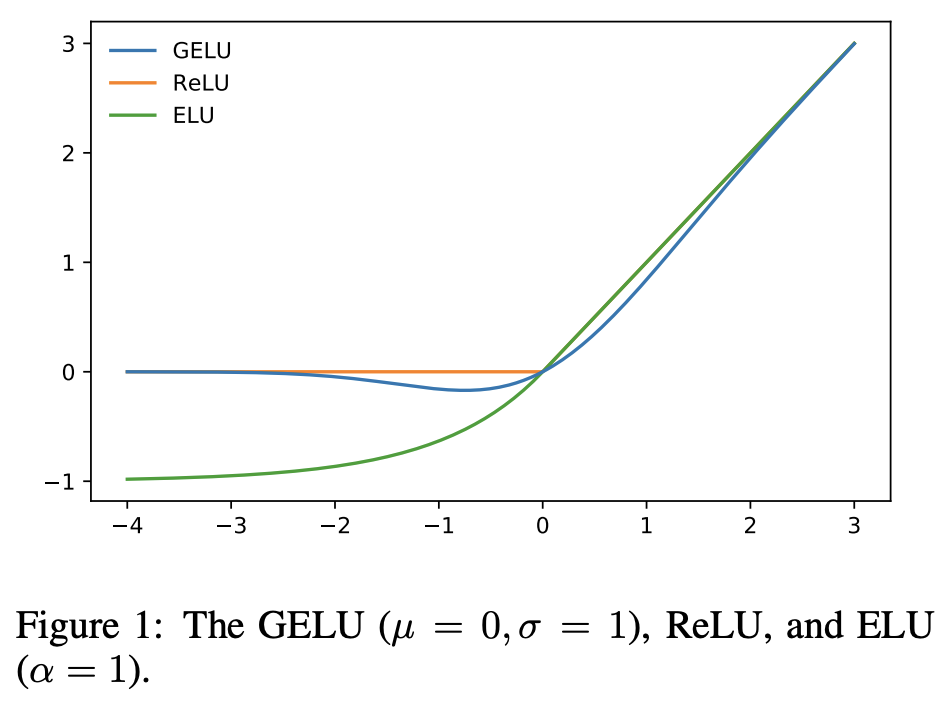

# G

## Galactica LLM

 Galactica is “a [large language model] that can store, combine and reason about scientific knowledge,” according to a paper published by [Meta] AI. It is a transformer model that has been trained on a carefully curated dataset of 48 million papers, textbooks and lecture notes, millions of compounds and proteins, scientific websites, encyclopedias, and more. Galactica was supposed to help scientists navigate the ton of published scientific information. Its developers presented it as being able to find citations, summarize academic literature, solve math problems, and perform other tasks that help scientists in research and writing papers.

 

 More at:

  * what happened to galactica? - [https://www.louisbouchard.ai/galactica/](https://www.louisbouchard.ai/galactica/)
  * take aways - [https://bdtechtalks.com/2022/11/21/meta-ai-galactica](https://bdtechtalks.com/2022/11/21/meta-ai-galactica)
  * site - [http://galactica.org](http://galactica.org)

 See also [G], ...


## Game Theory

 Used in model architecture, such as [GAN] and used for decision making process, such as in [Pluribus Model] and [Multi-Agent Model]

 More at:

  * [https://link.springer.com/article/10.1007/s11042-022-12153-2](https://link.springer.com/article/10.1007/s11042-022-12153-2)

 See also [G], [Nash Equilibrium], [Shapley Value]


## Game Tree

 {: width="100%"}

 See also [G], ...


## GameNGen Model

 9/1/2024 - [Google] develops GameNGen: World first AI model that predicts next frame of a live shooter game, playable at 20 fps

 Google's GameNGen: AI-Powered Real-Time Game Engine works by predicting each frame in real time with a diffusion model

 Key Points

  * GameNGen is a neural network-based game engine that uses diffusion models to simulate complex games in real-time.
  * It can run the classic first-person shooter game like DOOM at over 20 frames per second on a single TPU.
  * The system employed a two-phase training process. An RL agent first plays the game, generating training data from its actions and observations.
  * This data then trains a diffusion model to predict subsequent frames based on past frames and actions.
  * The model achieves a Peak Signal-to-Noise Ratio (PSNR) of 29.4 for next frame prediction, comparable to lossy JPEG compression.

 GameNGen's Architecture 
  * It is based on a modified version of Stable Diffusion
  * Key changes include: Removal of text conditioning, Addition of action embedding for input, Concatenation of encoded past frames in latent space and Implementation of noise augmentation for stability.
  * The noise augmentation technique is crucial for maintaining quality over long gameplay sessions. During training, varying amounts of Gaussian noise are added to encoded frames, with the noise level provided as input to the model. This allows the network to correct information from previous frames and prevents quality degradation in auto-regressive generation.
  * The model uses 4 DDIM sampling steps during inference, which surprisingly yields no degradation in simulation quality compared to 20 or more steps.
  * To improve image quality, particularly for small details and the HUD, the researchers fine-tuned the latent decoder of the auto-encoder using an MSE loss against target frame pixels.

 Despite operating with only about 3 seconds of game history, GameNGen maintains accurate game state, including health, ammo, and enemy positions. 

 At scale this could mean AI will be able to create games on the fly, personalized to each player

 

 More at:

  * paper - [https://arxiv.org/abs/2408.14837](https://arxiv.org/abs/2408.14837)

 See also [G], ...


## Gamma Distribution

 Continuous distribution based on a Poisson process (independent events)

 

 See also [G], [Distribution]


## Gated Recurrent Unit (GRU) Cell

 Cell or module that can be used in the RNN chain of a Long Short Term Memory, or LSTM Network. A slightly more dramatic variation on the LSTM is the Gated Recurrent Unit, or GRU, introduced by Cho, et al. (2014). It combines the forget and input gates into a single “update gate.” It also merges the cell state and hidden state, and makes some other changes. The resulting model is simpler than standard LSTM models and therefore less compute intensive. This cell has been growing increasingly popular.

 {: width="100%"}

 {: width="100%"}

 More at:

  * [http://colah.github.io/posts/2015-08-Understanding-LSTMs/](http://colah.github.io/posts/2015-08-Understanding-LSTMs/)
  * paper - [https://arxiv.org/abs/1710.04110](https://arxiv.org/abs/1710.04110)

 See also [G], [Long Short-Term Memory Network], 


## Gato Model

 A model developed by [DeepMind] that uses [Multi-Task Learning]

 {: width="100%"}

 

 

 More at:

  * [https://www.deepmind.com/publications/a-generalist-agent](https://www.deepmind.com/publications/a-generalist-agent)
  * [https://www.deepmind.com/blog/a-generalist-agent](https://www.deepmind.com/blog/a-generalist-agent)

 See also [G], ...


## Gaussian Distribution

 The Gaussian distribution, normal distribution, or bell curve, is a probability distribution which accurately models a large number of phenomena in the world. Intuitively, it is the mathematical representation of the general truth that many measurable quantities, when taking in aggregate tend to be of the similar values with only a few outliers which is to say that many phenomena follow the central limit theorem.

 {: width="100%"}

 See also [G], [Central Limit Theorem], [Gaussian Naive Bayes Classifier], [Gaussian Process]


## Gaussian Error Linear Unit (GELU) Activation Function

 GELU activation functions are used in GPT-3, BERT, and most other [Transformer architecture] models.

 An empirical evaluation of the GELU nonlinearity against the [ReLU] and [ELU] activations and find performance improvements across all considered [computer vision], [natural language processing], and speech tasks.

```python
m = nn.GELU()
input = torch.randn(2)
output = m(input)
```

 {: width="100%"}

 

 More at:

  * paper - [https://arxiv.org/abs/1606.08415v5](https://arxiv.org/abs/1606.08415v5)
  * code - [https://github.com/pytorch/pytorch/blob/96aaa311c0251d24decb9dc5da4957b7c590af6f/torch/nn/modules/activation.py#L584](https://github.com/pytorch/pytorch/blob/96aaa311c0251d24decb9dc5da4957b7c590af6f/torch/nn/modules/activation.py#L584)

 See also [G], ...


## Gaussian Naive Bayes Classifier

 A type of [Naive Bayes Classifiers] that use the [Gaussian Distribution] for training data

 

 See also [G], ...


## Gaussian Process

 See also [G], [Random Forest], [Tree Parzen Estimators]


## Gemini Model

 Built by [Google] using [PaLM] to compete with the multimodal [GPT-4V model]

 

 More at:

  * announcement 
    * 2024/02 - [https://developers.googleblog.com/2024/02/gemini-15-available-for-private-preview-in-google-ai-studio.html](https://developers.googleblog.com/2024/02/gemini-15-available-for-private-preview-in-google-ai-studio.html)
    * - [https://deepmind.google/technologies/gemini/#introduction](https://deepmind.google/technologies/gemini/#introduction)
  * gemini - [https://gemini.google.com/](https://gemini.google.com/)
  * Articles
    * [https://aibusiness.com/companies/google-doubles-down-on-ai-launches-new-language-model-and-ai-tools](https://aibusiness.com/companies/google-doubles-down-on-ai-launches-new-language-model-and-ai-tools)
    * [https://www.wired.com/story/google-deepmind-demis-hassabis-chatgpt/](https://www.wired.com/story/google-deepmind-demis-hassabis-chatgpt/)

 See also [G], ...


## Gemma Model

 A [Small Language Model (SLM)][SLM] developed by [Google] to be used in desktop/phone applications.

 Variant:

  * Gemma 1 and Gemma 2 - open-source [SLM]
  * CodeGemma - for code generation?
  * PaliGemma - [video-language model]
  * RecurrentGemma - not using transformer architecture 
  * ShieldGemma - instruction tuned models for evaluating the safety of text prompt input and text output responses against a set of defined safety policies.
  * DataGemma - Model trained on [Data Commons] using [Retrieval-Interleaved Generation (RIG)][RIG]

 

 More at:

  * docs - [https://ai.google.dev/gemma/docs](https://ai.google.dev/gemma/docs)
  * notbeooks
    * [https://github.com/google/generative-ai-docs/blob/main/site/en/gemma/docs/lora_tuning.ipynb](https://github.com/google/generative-ai-docs/blob/main/site/en/gemma/docs/lora_tuning.ipynb)
  * kaggle 
    * model page - [https://www.kaggle.com/models/google/gemma](https://www.kaggle.com/models/google/gemma)
    * - [https://www.kaggle.com/code/nilaychauhan/fine-tune-gemma-models-in-keras-using-lora](https://www.kaggle.com/code/nilaychauhan/fine-tune-gemma-models-in-keras-using-lora)
  * papers
    * RecurrentGemma - [https://arxiv.org/abs/2404.07839v1](https://arxiv.org/abs/2404.07839v1) 
    * DataGemma - [https://arxiv.org/abs/2409.13741](https://arxiv.org/abs/2409.13741)
  * articles
    * RecurrentGemma - [https://developers.googleblog.com/en/gemma-explained-recurrentgemma-architecture/](https://developers.googleblog.com/en/gemma-explained-recurrentgemma-architecture/)

 See also [G], ...


## Gen Model

 A text-to-video model built by the [Runway]

 

 

 More at:

  * [https://research.runwayml.com/gen2](https://research.runwayml.com/gen2)
  * [https://arxiv.org/abs/2302.03011](https://arxiv.org/abs/2302.03011)

 See also [G], ...


## GenCast Model

 New AI model created by [DeepMind] that advances the prediction of weather uncertainties and risks, delivering faster, more accurate forecasts up to 15 days ahead

 GenCast is a diffusion model, the type of generative AI model that underpins the recent, rapid advances in image, video and music generation. However, GenCast differs from these, in that it’s adapted to the spherical geometry of the Earth, and learns to accurately generate the complex probability distribution of future weather scenarios when given the most recent state of the weather as input.

 To train GenCast, we provided it with four decades of historical weather data from ECMWF’s ERA5 archive. This data includes variables such as temperature, wind speed, and pressure at various altitudes. The model learned global weather patterns, at 0.25° resolution, directly from this processed weather data.

 More at:

  * paper - [https://www.nature.com/articles/s41586-024-08252-9](https://www.nature.com/articles/s41586-024-08252-9)
  * announcement - [https://deepmind.google/discover/blog/gencast-predicts-weather-and-the-risks-of-extreme-conditions-with-sota-accuracy/](https://deepmind.google/discover/blog/gencast-predicts-weather-and-the-risks-of-extreme-conditions-with-sota-accuracy/)
  * GraphCast model (Previous model) - [https://deepmind.google/discover/blog/graphcast-ai-model-for-faster-and-more-accurate-global-weather-forecasting/](https://deepmind.google/discover/blog/graphcast-ai-model-for-faster-and-more-accurate-global-weather-forecasting/)
  * articles
    * nature - [https://www.nature.com/articles/d41586-024-03957-3](https://www.nature.com/articles/d41586-024-03957-3)

 See also [G], ...


## General Artificial Intelligence Assistant (GAIA) Benchmark

 ~ a [benchmark] for General [AI Assistants].

 Created by researchers from [Meta], [Hugging Face], [AutoGPT] and [GenAI], the benchmark “proposes real-world questions that require a set of fundamental abilities such as reasoning, multi-modality handling, web browsing, and generally tool-use proficiency,”

 The researchers said GAIA questions are “conceptually simple for humans yet challenging for most advanced AIs.” They tested the benchmark on human respondents and [GPT-4], finding that humans scored 92 percent while [GPT-4] with plugins scored only 15 percent.

```
# Example of questions
 Question:
 I’m researching species that became invasive after people who kept them as pets released them. There’s a certain species of fish that was popularized as a pet by being the main character of the movie Finding Nemo. According to the USGS, where was this fish found as a nonnative species, before the year 2020? I need the answer formatted as the five-digit zip codes of the places the species was found, separated by commas if there is more than one place.

 Answer: 34689
```
  
 

 More at:

  * paper - [https://arxiv.org/abs/2311.12983](https://arxiv.org/abs/2311.12983)
  * site - [https://huggingface.co/gaia-benchmark](https://huggingface.co/gaia-benchmark)
  * dataset - [https://huggingface.co/datasets/gaia-benchmark/GAIA](https://huggingface.co/datasets/gaia-benchmark/GAIA)
  * leaderboard - [https://huggingface.co/spaces/gaia-benchmark/leaderboard](https://huggingface.co/spaces/gaia-benchmark/leaderboard)

 See also [G], ...


## General Language Understanding Evaluation (GLUE) Benchmark

 The General Language Understanding Evaluation (GLUE) benchmark is a collection of resources for training, evaluating, and analyzing natural language understanding systems. GLUE consists of:

  * A benchmark of nine sentence- or sentence-pair language understanding tasks built on established existing datasets and selected to cover a diverse range of dataset sizes, text genres, and degrees of difficulty,
  * A diagnostic dataset designed to evaluate and analyze model performance with respect to a wide range of linguistic phenomena found in natural language, and
  * A public leaderboard for tracking performance on the benchmark and a dashboard for visualizing the performance of models on the diagnostic set.

 The format of the GLUE benchmark is model-agnostic, so any system capable of processing sentence and sentence pairs and producing corresponding predictions is eligible to participate. The benchmark tasks are selected so as to favor models that share information across tasks using parameter sharing or other transfer learning techniques. The ultimate goal of GLUE is to drive research in the development of general and robust natural language understanding systems.

 

 More at:

  * [https://gluebenchmark.com/](https://gluebenchmark.com/)

 See also [G], [Benchmark], [SuperGLUE Benchmark]


## General Purpose AI System (GPAIS)

 A GPAIS (General Purpose AI System) is a category proposed by lawmakers to account for AI tools with more than one application, such as generative AI models like ChatGPT.

 Lawmakers are currently debating whether all forms of GPAIS will be designated high risk, and what that would mean for technology companies looking to adopt AI into their products. 

 More at:

  * [https://www.reuters.com/technology/what-is-european-union-ai-act-2023-03-22/](https://www.reuters.com/technology/what-is-european-union-ai-act-2023-03-22/)

 See also [G], ...


## Generalized Additive 2 Model (GA2M)

 Use GA2Ms if they are significantly more accurate than [GAMs][GAM], especially if you believe from your domain knowledge that there are real feature interactions, but they are not too complex. This also gives the advantages of a [White Box Model], with more effort to interpret.
 
 More at:

  * constrained GA2M paper - [https://arxiv.org/abs/2106.02836](https://arxiv.org/abs/2106.02836)

 See also [G], ...


## Generalized Additive Model (GAM)

 Generalized Additive Models (GAMs) were developed in the 1990s by Hastie and Tibshirani. 
 
 More at:

  * [https://www.fiddler.ai/blog/a-gentle-introduction-to-ga2ms-a-white-box-model](https://www.fiddler.ai/blog/a-gentle-introduction-to-ga2ms-a-white-box-model)

 See also [G], ...


## Generative Adversarial Network (GAN)

 So why do we want a generative model? Well, it’s in the name! We wish to generate something an image, music, something! But what do we wish to generate? `Typically, we wish to generate data` (I know, not very specific). More than that though, it is likely that we wish to generate data that is never before seen, yet still fits into some data distribution (i.e. some pre-defined dataset that we have already set aside and that was used to build a discriminator). GANs, a generative AI technique, pit 2 networks against each other to generate new content. The algorithm consists of two competing networks: a generator and a discriminator. A generator is a convolutional neural network (CNN) that learns to create new data resembling the source data it was trained on. The discriminator is another convolutional neural network (CNN) that is trained to differentiate between real and synthetic data. The generator and the discriminator are trained in alternating cycles such that the generator learns to produce more and more realistic data while the discriminator iteratively gets better at learning to differentiate real data from the newly created data.

 {: width="100%"}

 There are different types of GAN, including:

  * [Vanilla GAN]
  * Cycle GAN
  * Conditional GAN
  * Deep Convoluted GAN
  * Style GAN
  * Super Resolution GAN (SRGAN)

 

 

 

 More at:

  * [http://hunterheidenreich.com/blog/what-is-a-gan/](http://hunterheidenreich.com/blog/what-is-a-gan/)
  * GAN with Keras - [https://python.plainenglish.io/exploring-generative-adversarial-networks-gans-in-two-dimensional-space-922ee342b253](https://python.plainenglish.io/exploring-generative-adversarial-networks-gans-in-two-dimensional-space-922ee342b253)

 See also [G], [AR-CNN], [Convolutional Neural Network], [Conditional GAN], [Cycle GAN], [DeepComposer], [Discriminator], [Generative Model], [Generator]


## Generative AI (GenAI)

 Generative artificial intelligence (AI) describes algorithms (such as ChatGPT) that can be used to create new content, including audio, code, images, text, simulations, and videos. Recent new breakthroughs in the field have the potential to drastically change the way we approach content creation.

 Based on California's [executive order on AI]

 

 More at:

  * https://www.mckinsey.com/featured-insights/mckinsey-explainers/what-is-generative-ai
  * [https://www.gov.ca.gov/2023/11/21/newsom-administration-releases-genai-report/](https://www.gov.ca.gov/2023/11/21/newsom-administration-releases-genai-report/)

 See also [G], [DALL-E Model], [ChatGPT Model]


## Generative Classifier

 Generative Classifiers tries to model class, i.e., what are the features of the class. In short, it models how a particular class would generate input data. When a new observation is given to these classifiers, it tries to predict which class would have most likely generated the given observation. Such methods try to learn about the environment. An example of such classifiers is Naive Bayes. Mathematically, generative models try to learn the joint probability distribution, `p(x,y)`, of the inputs x and label y, and make their prediction using Bayes rule to calculate the conditional probability, `p(y|x)`, and then picking a most likely label. Thus, it tries to learn the actual distribution of the class.

 {: width="100%"}

 See also [G], [Bayesian Network], [Hidden Markov Model], [Markov Random Field], [Naive Bayes Theorem]


## Generative Design

 [Generative AI] applied to architecture, design of parts, etc. everything that normally use CAD tools!

 

 More at:

  * [https://www.generativedesign.org/](https://www.generativedesign.org/)
  * [https://www.ptc.com/en/blogs/cad/beginner-guide-generative-design](https://www.ptc.com/en/blogs/cad/beginner-guide-generative-design)

 See also [G], ...


## Generative Model

 AI models that generate/create content. Examples of Generative AI techniques include:

  * [Diffusion Models]
  * [Generative Adversarial Networks (GANs)]
  * [Variational autoencoders (VAEs)] = Hidden state is represented by a distribution, which is then sampled and decoded (Q: what is mean and variance?)
  * [Transformer-Based Models]
   * Decoders with masked self-attention

 {: width="100%"}

 {: width="100%"}

 More at:

  * Generative Modeling by Estimating Gradients of the Data Distribution - [https://yang-song.net/blog/2021/score/](https://yang-song.net/blog/2021/score/)

 See also [G], [Decoder], [Flow-Based Model], [Masked Self-Attention]
 

## Generative Pre-Trained Transformer (GPT) Function Calling

 

 

 More at:

  * articles 
    * [https://www.ai-jason.com/learning-ai/gpt-functioning-calling-tutorial](https://www.ai-jason.com/learning-ai/gpt-functioning-calling-tutorial)
    * code - [https://github.com/JayZeeDesign/gpt-function-calling-tutorial/blob/main/app.py](https://github.com/JayZeeDesign/gpt-function-calling-tutorial/blob/main/app.py)
    * rapidapi hub - [https://rapidapi.com/hub](https://rapidapi.com/hub)

 See also [G], ...


## Generative Pre-Trained Transformer (GPT) Model Family

 Before GPT-3 there was no general language model that could perform well on an array of [NLP] tasks. Language models were designed to perform one specific NLP task, such as text generation, summarization, or classification, using existing algorithms and architectures. GPT-3 has extraordinary capabilities as a general language model. GPT-3 is pre-trained on a corpus of text from five datasets: [Common Crawl] (Internet), WebText2, Books1, Books2, and Wikipedia. 

  * By default, GPT-2 remembers the last 1024 words. That the max? length of the left-side context?
  * GPT-3 possesses 175 billion weights connecting the equivalent of 8.3 million [artificial neurons] arranged 384 layers deep.
    * GPT-2 and GPT-3 have fundamentally the same architecture
    * But each generation of models ~ 10-100x increase in compute/size
    * The difference in using these models is qualitatively extremely different

 Here is the paper about GPT-3 in 2020

 

 GPT4 released on Tuesday 03/14/2023

 {: width="100%"}

 

 Early experiment with GPT-4 have shown sparks of [Artificial General Intelligence]!

 

 

 

 A closer look at the multimodal GPT-4V model

 

 On 12/01/2023, during OpenAI dev day, GPT-4Turbo is announced

 Impact on the workforce and companies

 

 

 More at:

   * GPT-1 paper - [https://paperswithcode.com/paper/improving-language-understanding-by](https://paperswithcode.com/paper/improving-language-understanding-by)
   * GPT-2 paper - [https://d4mucfpksywv.cloudfront.net/better-language-models/language-models.pdf](https://d4mucfpksywv.cloudfront.net/better-language-models/language-models.pdf) (also attached)
   * GPT-3 paper - [https://arxiv.org/abs/2005.14165v4](https://arxiv.org/abs/2005.14165v4)
   * GPT-4 paper - [https://cdn.openai.com/papers/gpt-4.pdf](https://cdn.openai.com/papers/gpt-4.pdf)
   * GPT-4 site - [https://openai.com/research/gpt-4](https://openai.com/research/gpt-4)
   * GPT fine-tuning - [https://platform.openai.com/docs/guides/fine-tuning](https://platform.openai.com/docs/guides/fine-tuning)
   * gpt vs chatgpt vs instructgpt - [https://medium.com/@colin.fraser/chatgpt-automatic-expensive-bs-at-scale-a113692b13d5](https://medium.com/@colin.fraser/chatgpt-automatic-expensive-bs-at-scale-a113692b13d5)
   * GPT-4V(ision) site + paper - [https://openai.com/research/gpt-4v-system-card](https://openai.com/research/gpt-4v-system-card)
   * GPTs are GPTs papers - [https://arxiv.org/abs/2303.10130](https://arxiv.org/abs/2303.10130)
   * articles
     * MIT TR deployment strategy - [https://www.technologyreview.com/2023/10/10/1081117/generative-ai-deployment-strategies-for-smooth-scaling/](https://www.technologyreview.com/2023/10/10/1081117/generative-ai-deployment-strategies-for-smooth-scaling/)
     * OpenAI Function Calling - [https://cobusgreyling.medium.com/emergence-of-large-action-models-lams-and-their-impact-on-ai-agents-424d3df5df28](https://cobusgreyling.medium.com/emergence-of-large-action-models-lams-and-their-impact-on-ai-agents-424d3df5df28)

 See also [G], [ChatGPT Model], [Digital Watermark], [Fine-Tuning], [GPT Function Calling], [InstructGPT Model], [Natural Language Processing], [Pre-Trained Model], [RadioGPT], [WebGPT Model]


## Generator

 A neural network that generates music, image, something and is getting feedback from a Discriminator neural network. How does the generator generate images? Solution : The generator takes noise from latent space and further based on test and trial feedback , the generator keeps improvising on images. After a certain times of trial and error , the generator starts producing accurate images of a certain class which are quite difficult to differentiate from real images.

 See also [G], [DeepComposer], [Discriminator], [Generative Adversarial Network], [Generator Loss], [Latent Space]


## Generator Loss

 Typically when training any sort of model, it is a standard practice to monitor the value of the loss function throughout the duration of the training. The discriminator loss has been found to correlate well with sample quality. You should expect the discriminator loss to converge to zero and the generator loss to converge to some number which need not be zero. When the loss function plateaus, it is an indicator that the model is no longer learning. At this point, you can stop training the model. You can view these loss function graphs in the AWS DeepComposer console:

 {: width="100%"}

 After 400 epochs of training, discriminator loss approaches near zero and the generator converges to a steady-state value. Loss is useful as an evaluation metric since the model will not improve as much or stop improving entirely when the loss plateaus.

 See also [G], [Discriminator Loss], [Loss Function], [Loss Graph]


## Genetic Programming

 Genetic programming is a technique to create algorithms that can program themselves by simulating biological breeding and Darwinian evolution. Instead of programming a model that can solve a particular problem, genetic programming only provides a general objective and lets the model figure out the details itself. The basic approach is to let the machine automatically test various simple evolutionary algorithms and then “breed” the most successful programs in new generations.


## Genie Model

 ~ the [world model] developed by [google]

 More at:

  * co-lead ? - [https://x.com/jparkerholder](https://x.com/jparkerholder)
  * papers
    * genie 1 - [https://deepmind.google/research/publications/60474/](https://deepmind.google/research/publications/60474/)
    * genie 2 - [https://deepmind.google/discover/blog/genie-2-a-large-scale-foundation-world-model/](https://deepmind.google/discover/blog/genie-2-a-large-scale-foundation-world-model/)

 See also [G], ...


## Geoffrey Hinton Person

 Since 2013, he has divided his time working for Google (Google Brain) and the University of Toronto. In 2017, he co-founded and became the Chief Scientific Advisor of the Vector Institute in Toronto.

 With David Rumelhart and Ronald J. Williams, Hinton was co-author of a highly cited paper published in 1986 that popularised the [backpropagation] algorithm for training multi-layer neural networks, although they were not the first to propose the approach. Hinton is viewed as a leading figure in the deep learning community. The dramatic image-recognition milestone of the [AlexNet Model] designed in collaboration with his students [Alex Krizhevsky][Alex Krizhevsky Person] and [Ilya Sutskever][Ilya Sutskever Person] for the ImageNet challenge 2012 was a breakthrough in the field of computer vision.

 

 More at:

  * [https://en.wikipedia.org/wiki/Geoffrey_Hinton](https://en.wikipedia.org/wiki/Geoffrey_Hinton)

 See also [G], ...


## GINI Impurity Index

 A metrics to measure how diverse the data is in a dataset.

  * The more diverse the dataset is, the closer the GINI index is to 1 (but never equal to one)
  * The GINI index = 1 in the impossible case where all the elements in the dataset are different and the dataset is na infinite number of sample
  * The GINI index is 0 if all the samples in the dataset are the same (same label)

 

/// details | Why is this important?
///

 See also [G], [Dataset], [Forest Of Stumps], [Weighted Gini Impurity Index]


## GitHub Company

 Offers code repositories. An acquisition of [Microsoft]

 See also [G], [GitHub Copilot]


## GitHub Copilot

 The [OpenAI Codex][Codex Model] integrated to [GitHub] to suggest code and entire functions in real-time, right from your editor.

 More at:

  * [https://github.com/features/copilot](https://github.com/features/copilot)

 See also [G], ...


## GLIDE Model

 What adds the text conditioning to the diffusion model!?

 

 

 More at :

  * how does DALL-E work? - [https://www.assemblyai.com/blog/how-dall-e-2-actually-works/](https://www.assemblyai.com/blog/how-dall-e-2-actually-works/)
  * blog - [https://syncedreview.com/2021/12/24/deepmind-podracer-tpu-based-rl-frameworks-deliver-exceptional-performance-at-low-cost-173/](https://syncedreview.com/2021/12/24/deepmind-podracer-tpu-based-rl-frameworks-deliver-exceptional-performance-at-low-cost-173/)
  * paper - [https://arxiv.org/abs/2112.10741](https://arxiv.org/abs/2112.10741)
  * code - [https://github.com/openai/glide-text2im](https://github.com/openai/glide-text2im)
  * colab notebooks - [https://github.com/openai/glide-text2im/tree/main/notebooks](https://github.com/openai/glide-text2im/tree/main/notebooks)

 See also [G], [DALL-E Model]


## Global Pooling Layer

 Global pooling reduces each channel in the feature map to a single value. Thus, an nh x nw x nc feature map is reduced to 1 x 1 x nc feature map. This is equivalent to using a filter of dimensions nh x nw i.e. the dimensions of the feature map. 
 Further, it can be either global max pooling or global average pooling.

```python
import numpy as np
from keras.models import Sequential
from keras.layers import GlobalMaxPooling2D
from keras.layers import GlobalAveragePooling2D
 
# define input image
image = np.array([[2, 2, 7, 3],
                  [9, 4, 6, 1],
                  [8, 5, 2, 4],
                  [3, 1, 2, 6]])
image = image.reshape(1, 4, 4, 1)
 
# define gm_model containing just a single global-max pooling layer
gm_model = Sequential(
    [GlobalMaxPooling2D()])
 
# define ga_model containing just a single global-average pooling layer
ga_model = Sequential(
    [GlobalAveragePooling2D()])
 
# generate pooled output
gm_output = gm_model.predict(image)
ga_output = ga_model.predict(image)
 
# print output image
gm_output = np.squeeze(gm_output)
ga_output = np.squeeze(ga_output)
print("gm_output: ", gm_output)
print("ga_output: ", ga_output)

# gm_output:  9.0
# ga_output:  4.0625
```

 More at:

  * [https://www.geeksforgeeks.org/cnn-introduction-to-pooling-layer/](https://www.geeksforgeeks.org/cnn-introduction-to-pooling-layer/)

 See also [G], ...


## Global Vector (GloVe) Algorithm

 Global Vectors for Word Representation developed by the Stanford NLP Team, deprecated by [Word2Vec] ?

 GloVe is an unsupervised learning algorithm for obtaining vector representations for words. Training is performed on aggregated global word-word co-occurrence statistics from a corpus, and the resulting representations showcase interesting linear substructures of the word vector space.

 Released in 08/2014, updated in 2015

 

 More at:

  * site - [https://nlp.stanford.edu/projects/glove/](https://nlp.stanford.edu/projects/glove/)

 See also [G], [Word Embedding Space]


## Gluon

 This is ...


## Goal-Conditioned RL

 In [Reinforcement Learning (RL)], Train universal policies conditioned on goals. Generalizes to new goals.

 See also [G], ...


## Good Old-Fashioned AI (GOFAI)

 See [Symbolic AI]


## Google Company

 Model architecture developed by company

  * [Pathways Model Architecture] -
  * [Transformer Architecture] -

 Hardware developed by company

  * [Tensor Processing Unit (TPU)][TPU] - custom hardware for tensor arithmetic

 Models developed by the company

  * [Astra] - A model that has ears, eyes, and a voice and that comes with you everywhere you go
  * [Bard] - A lightweight version of Lambda meant to compete against Bing + [ChatGPT Model]
  * [DreamIX][DreamIX Model] - text-to-video and image-to-video diffusion model
  * [Gameface](https://blog.google/technology/ai/google-project-gameface/) - use your face in place of a mouse!
  * [GameNGen] - 9/1/2024 - World first AI model that predicts next frame of a live shooter game, playable at 20 fps
  * [Gemini] - multimodal to enable future innovations like memory and planning
  * [Gemma] - Small Language Modeli deployable on desktops
  * [Genie] - 12/1/2024 - world model for embodied agents 
  * [Gnome] - Graph Network for materials exploration
  * [Google Lens][Google Lens] - search what you see, uses cellphone cameras and [computer vision]
  * [Google Translate][Google Translate Model] - Translate one language into another, [machine translation]
  * [Gshard Model] -
  * [Imagen][Imagen Model] - A text-to-image diffusion model
  * [Imagen Video][Imagen Video Model] - A text-to-video model
  * [Magi Model] - [Bard] with Ads!
  * [Minerva Model] -
  * [MUM Model] - Use [T5 Model], NLU and multimodal, 1000 more powerful than the [BERT Model]. 
  * [Muse Model] -
  * [MusicLM][MusicLM Model] - Generative model for music
  * [PaLM Model] - The GPT3 equivalent, deprecated [LaMBDA]
  * [Phenaki Model] - realistic video synthesis, given a sequence of textual prompts
  * [Switch Transformer] -
  * [T5 Model] -
  * [Veo] - Video generation model

 Utilities

  * [NotebookLM] - a notebook for research integrated with a LLM

 Superseded models

  * 2010: [Helping computers understand language](https://googleblog.blogspot.com/2010/01/helping-computers-understand-language.html)
  * 2015: RankBrain
  * 2018: Neural Matching
  * 2019: [BERT] - A [natural language processing] model based on the [transformer architecture] 
  * 2023: [LaMDA] - A large language model built for discussion applications, deprecated by PaLM

 Companies

  * [DeepMind] which built models such as [Chinchilla], [Sparrow], [AlphaiFold], [GenCast] and more ... 
  * [Kaggle] which also runs [KaggleX]

 Projects

  * [Experiments](https://experiments.withgoogle.com/)
    * [AI Experiments](https://experiments.withgoogle.com/collection/ai)
      * [Quick Draw](https://quickdraw.withgoogle.com/)
  * [Teachable Machine](https://teachablemachine.withgoogle.com/)
    * Pose project - [https://medium.com/@warronbebster/teachable-machine-tutorial-head-tilt-f4f6116f491](https://medium.com/@warronbebster/teachable-machine-tutorial-head-tilt-f4f6116f491)
    * Image project - [https://medium.com/p/4bfffa765866](https://medium.com/p/4bfffa765866)
    * Audio project - [https://medium.com/p/4212fd7f3555(https://medium.com/p/4212fd7f3555)

 

 More at:

  * research blog - [https://blog.research.google/](https://blog.research.google/)
  * Google IO 2023 - [https://blog.google/technology/developers/google-io-2023-100-announcements/](https://blog.google/technology/developers/google-io-2023-100-announcements/)

 See also [G], [Company]


## Google Lens

 Developed by [Google], ...

 See also [G], ...


## Google-Proof Questions And Answers (GPQA) Benchmark

 We present GPQA, a challenging dataset of 448 multiple-choice questions written by domain experts in biology, physics, and chemistry. We ensure that the questions are high-quality and extremely difficult: experts who have or are pursuing PhDs in the corresponding domains reach 65% accuracy (74% when discounting clear mistakes the experts identified in retrospect), while highly skilled non-expert validators only reach 34% accuracy, despite spending on average over 30 minutes with unrestricted access to the web (i.e., the questions are "Google-proof"). The questions are also difficult for state-of-the-art AI systems, with our strongest GPT-4 based baseline achieving 39% accuracy. If we are to use future AI systems to help us answer very hard questions, for example, when developing new scientific knowledge, we need to develop scalable oversight methods that enable humans to supervise their outputs, which may be difficult even if the supervisors are themselves skilled and knowledgeable. The difficulty of GPQA both for skilled non-experts and frontier AI systems should enable realistic scalable oversight experiments, which we hope can help devise ways for human experts to reliably get truthful information from AI systems that surpass human capabilities.

 

 More at:

  * paper - [https://arxiv.org/abs/2311.12022](https://arxiv.org/abs/2311.12022)
  * github - [https://github.com/idavidrein/gpqa](https://github.com/idavidrein/gpqa)

 See also [G], [Benchmark]


## Google Translate Model

 ==Google Translate started using a [Seq2Seq]-based model in production in late 2016==

 Google Translate is a multilingual neural machine translation service developed by [Google] to translate text, documents and websites from one language into another. It offers a website interface, a mobile app for Android and iOS, and an API that helps developers build browser extensions and software applications. As of April 2023, Google Translate supports 133 languages at various levels, and as of April 2016, claimed over 500 million total users, with more than 100 billion words translated daily, after the company stated in May 2013 that it served over 200 million people daily.

 Launched in April 2006 as a statistical machine translation service, it used United Nations and European Parliament documents and transcripts to gather linguistic data. Rather than translating languages directly, it first translates text to English and then pivots to the target language in most of the language combinations it posits in its grid, with a few exceptions including Catalan-Spanish. During a translation, it looks for patterns in millions of documents to help decide which words to choose and how to arrange them in the target language. Its accuracy, which has been criticized on several occasions, has been measured to vary greatly across languages. In November 2016, Google announced that Google Translate would switch to a neural machine translation engine – Google Neural Machine Translation (GNMT) – which translates "whole sentences at a time, rather than just piece by piece. It uses this broader context to help it figure out the most relevant translation, which it then rearranges and adjusts to be more like a human speaking with proper grammar".

 

 

 More at:

  * site - [https://translate.google.com/](https://translate.google.com/)
  * wikipedia - [https://en.wikipedia.org/wiki/Google_Translate](https://en.wikipedia.org/wiki/Google_Translate)

 See also [G], ...


## Gopher Model

 NLP model developed by [DeepMind]

 ~ 280 parameters with a transformer architecture. Was later optimized and resulted in the [Chinchilla Model]

 

 

 More at :

  * [https://www.deepmind.com/blog/language-modelling-at-scale-gopher-ethical-considerations-and-retrieval](https://www.deepmind.com/blog/language-modelling-at-scale-gopher-ethical-considerations-and-retrieval)

 See also [G], ...


## GPU Instance

 P2 and P3 instances on AWS.

 See also [G], [Graphical Processing Unit]


## GPU Technology Conference (GTC)

 Annual conference organized by [Nvidia]

 The last conference was help on 2023/03/20 to 23.

 Here are the highlights and the keynote.

 

 

 More at:

  * [https://www.nvidia.com/gtc/](https://www.nvidia.com/gtc/)

 See also [G], ...


## Grade School Math (GSM8K) Dataset

 GSM8K is a dataset of 8.5K high quality linguistically diverse grade school math word problems created by human problem writers and financed by [OpenAI]. The dataset is segmented into 7.5K training problems and 1K test problems. These problems take between 2 and 8 steps to solve, and solutions primarily involve performing a sequence of elementary calculations using basic arithmetic operations (+ − ×÷) to reach the final answer. A bright middle school student should be able to solve every problem. It can be used for multi-step mathematical reasoning.

 

 More at

  * research and samples - [https://openai.com/research/solving-math-word-problems](https://openai.com/research/solving-math-word-problems)
  * paper - [https://paperswithcode.com/paper/training-verifiers-to-solve-math-word](https://paperswithcode.com/paper/training-verifiers-to-solve-math-word)
  * site - [https://github.com/openai/grade-school-math](https://github.com/openai/grade-school-math)
  * dataset - [https://paperswithcode.com/dataset/gsm8k](https://paperswithcode.com/dataset/gsm8k)

 See also [G], [Dataset], [PaLM Model]


## Gradient

 A gradient is the direction and magnitude calculated during the training of a neural network it is used to teach the network weights in the right direction by the right amount.

 See also [G], [Gradient Descent Algorithm]


## Gradient Ascent (GA) Algorithm

 Maximize a function, unlike [gradient descent] which minimize a cost function.

 See also [G], ...


## Gradient Bagging

 ~ [bagging] but where each weak learner is built to correct errors of the previous ones/ensemble

 [Gradient boosting] is an ensemble machine learning technique that combines multiple [weak learners] (typically [decision trees]) together to produce a strong predictive model. Bagging is another ensemble technique involving training [weak learners] on different randomized subsets of the data. Gradient bagging combines these two methods:

  * Like gradient boosting, it trains predictors sequentially, with each new tree correcting errors from the previous tree.
  * Like bagging, each tree is trained on a random subset of the data for diversity.
  * At each iteration, a subsample of the data is taken (without replacement), similar to bagging.
  * A new model is fit to the subsample, aiming to reduce the errors from previous models.
  * This continues for a specified number of iterations, adding models that complement each other.
  * The final prediction is obtained by aggregating the predictions from all the trained weak learners.

 Some key advantages of gradient bagging include:

  * Reduces [overfitting] compared to gradient boosting alone.
  * Computationally efficient for training weak learners.
  * Captures complex interactions like gradient boosting.
  * Maintains model interpretability.

 Overall, gradient bagging combines the strengths of bagging and gradient boosting to produce robust, accurate and interpretable ensembles for prediction tasks.

 See also [G], ...


## Gradient Boosting

 ~ [boosting] but where each new weak learner is built to correct errors of the previous ones/ensemble.

 Gradient boosting is one of the variants of [ensemble methods] where you create multiple weak models and combine them to get better performance as a whole.

 Popular algorithms:

  * [XGBoost]
  * [LightGBM]
  * [CatBoost]

 More at:

  * wikipedia - [https://en.wikipedia.org/wiki/Gradient_boosting](https://en.wikipedia.org/wiki/Gradient_boosting)
  * articles
    * regressions - [https://towardsdatascience.com/all-you-need-to-know-about-gradient-boosting-algorithm-part-1-regression-2520a34a502](https://towardsdatascience.com/all-you-need-to-know-about-gradient-boosting-algorithm-part-1-regression-2520a34a502)
    * classifications - [https://towardsdatascience.com/all-you-need-to-know-about-gradient-boosting-algorithm-part-2-classification-d3ed8f56541e](https://towardsdatascience.com/all-you-need-to-know-about-gradient-boosting-algorithm-part-2-classification-d3ed8f56541e)

 See also [G], [Boosting], [Ensemble Method], [Gradient Bagging], [Weak Learner]


## Gradient Checkpoint
 
  See [Activation Checkpoint]


## Gradient Clipping

 A technique to prevent exploding gradients in very deep networks, usually in recurrent neural networks. Gradient Clipping is a method where the error derivative is changed or clipped to a threshold during backward propagation through the network, and using the clipped gradients to update the weights.

 Gradient Clipping is implemented in two variants:

  * Clipping-by-value
  * Clipping-by-norm

 Benefits ?

 More at: 

  * [https://towardsdatascience.com/what-is-gradient-clipping-b8e815cdfb48](https://towardsdatascience.com/what-is-gradient-clipping-b8e815cdfb48)
  * gradient clipping accelerate learning? - [https://openreview.net/pdf?id=BJgnXpVYwS](https://openreview.net/pdf?id=BJgnXpVYwS)

 See also [G], [Exploding Gradient Problem], [Gradient Descent Algorithm], [Recurring Neural Network]


## Gradient Descent (GD) Algorithm

 One of the shining successes in machine learning is the gradient descent algorithm (and its modified counterpart, stochastic gradient descent). Gradient descent is an iterative method for finding the minimum of a function. In machine learning, that function is typically the loss (or cost) function. "Loss" is simply some metric that quantifies the cost of wrong predictions. Gradient descent calculates the loss achieved by a model with a given set of parameters, and then alters those parameters to reduce the loss. It repeats this process until that loss can't substantially be reduced further. The final set of parameters that minimize the loss now define your fitted model. 

 

 Gradient descent algorithms and derivatives

  * [Stochastic Gradient Descent (SGD)]
  * [Gradient descent with momentum (GDwM)]
  * nesterov accelerated gradient
  * [Adaptive Gradient (AdaGrad)]
  * [AdaDelta Gradient (AdaDelta)]
  * [Adaptive Momentum Estimation (Adam)]
  * [Root Mean Square Propagation (RMSprop)]
  * nag ?

 

 

 {: width="100%"}

 ==Using gradient descent, you can find the regression line that best fit the sample using a loss function== (distance of sample from line). To do that, you can start with any line and calculate the loss function, as you move the parameter, the loss function become smaller and smaller indicating in which direction the parameter should go.

///warning | On huge datasets, There are downsides of the gradient descent algorithm. Indeed for huge datasets, we need to take a huge amount of computation we make for each iteration of the algorithm. To alleviate the problem, possible solutions are:

  * batch data for lighter partial processing (= standard gradient descent) :warning: compute intensive for large datasets
  * mini-batch ... = uses all the data in batches (= best of all proposed alternatives?)
  * data sampling or stochastic gradient descent. (= lower compute required since we use only a few sample, but faster iteration with slower convergence st each step, but faster overall?)
///

 More at:

  * [https://towardsdatascience.com/gradient-descent-algorithm-a-deep-dive-cf04e8115f21](https://towardsdatascience.com/gradient-descent-algorithm-a-deep-dive-cf04e8115f21)

 See also [G], [Activation Function], [Batch Gradient Descent Algorithm], [Gradient Perturbation], [Learning Rate], [Loss Function], [Mini-Batch Gradient Descent Algorithm], [Parameter], [Prediction Error], [Stochastic Gradient Descent Algorithm]


## Gradient Descent with Momentum (GDwM) Algorithm

 In the context of [Gradient Descent (GD)], momentum is a technique that helps the algorithm to converge faster and more consistently by reducing the oscillation of the updates to the model parameters.

 The momentum technique introduces a new parameter called momentum coefficient, which determines the contribution of the previous updates to the current update. Instead of computing the update at each iteration solely based on the gradient, the momentum technique calculates an exponentially weighted average of the past gradients and uses it to update the model parameters.

 This helps to smooth out the updates and prevent the model from getting stuck in local optima. It also helps to accelerate the convergence in directions where the gradient changes sign frequently, by preserving the momentum of the gradient in the previous iterations.

 The momentum technique is particularly useful in deep learning where the optimization problem is complex and high-dimensional, and the gradient can be noisy or sparse. It is often used in combination with other optimization techniques such as [Adam], [Adagrad], and [Root Mean Square Propagation (RMSProp)][RMSprop] to further improve the performance of the gradient descent algorithm.

 

 More at:

  * [https://towardsdatascience.com/gradient-descent-with-momentum-59420f626c8f](https://towardsdatascience.com/gradient-descent-with-momentum-59420f626c8f)

 See also [G], ...


## Gradient Perturbation

 Works for neural network only or where gradient descent is used. Better than output perturbation in that the noise is built in the model, so you can share the model at will ;-) Gradient perturbation, widely used for differentially private optimization, injects noise at every iterative update to guarantee differential privacy. Noise is included in the gradient descent!

 More at:

  * [https://www.ijcai.org/Proceedings/2020/431}(https://www.ijcai.org/Proceedings/2020/431)
  * deep learning with differential privacy paper - [https://arxiv.org/abs/1607.00133](https://arxiv.org/abs/1607.00133)
  * paper - [https://www.microsoft.com/en-us/research/publication/gradient-perturbation-is-underrated-for-differentially-private-convex-optimization/](https://www.microsoft.com/en-us/research/publication/gradient-perturbation-is-underrated-for-differentially-private-convex-optimization/)

 See also [G], [Differential Privacy], [Gradient Clipping], [Output Perturbation]


## Gradio Python Module

 A [python module] to build a UI for machine learning models.

 Compatible with [Hugging Face] Spaces.

 

 More at:

  * [https://www.gradio.app/](https://www.gradio.app/)
  * quickstart - [https://www.gradio.app/quickstart/](https://www.gradio.app/quickstart/)

 See also [G], ...


## Graph

 A representation of items or nodes, linked by relations or edges

 Good representation for

  * molecule
  * social network
  * knowledge graph
  * 3D meshes
  * the internet
  * the brain
  * ...

 {: width="100%"}

 {: width="100%"}

 {: width="100%"}

 Algorithms

  * [Link prediction] for recommendation engine
  * [Node classification] is for assigning labels to nodes
  * [Graph classification] is for assigning labels to graph like coworkers, school friends, etc.

 {: width="100%"}

 More at:

  * [https://towardsdatascience.com/how-to-convert-any-text-into-a-graph-of-concepts-110844f22a1a](https://towardsdatascience.com/how-to-convert-any-text-into-a-graph-of-concepts-110844f22a1a)

 See also [G], ...


## Graph Classification

 Graph classification refers to the task of assigning categories or labels to entire graphs. Some key points:

  * In graph classification, the samples are entire graphs or networks. The goal is to categorize each graph into a class. This contrasts node-level and edge-level prediction tasks.
  * For example, graph classification can categorize social networks into types (college friends, work colleagues etc), molecular graph structures into activity classes, or assign genres to graph representations of texts.
  * A major application of graph classification is in predicting properties and characteristics of molecules based on their chemical compound graph structure.
  * Typical pipeline involves extracting informative numeric graph-level representations from each graph (graph embeddings), then training a machine learning classifier model on the graph embeddings and graph labels.
  * Common techniques for representing whole graphs as feature vectors/embeddings include graph kernels, graph neural networks, etc. These capture structural properties of the entire graph beyond individual nodes and edges.
  * Classical machine learning models like random forests and neural networks can be used for the actual graph categorization once suitable embeddings are extracted.

 In summary, graph classification focuses on categorizing entire graphs into certain classes, by extracting graph-level signatures and training classifiers over labeled graph datasets. This contrasts with node and edge level prediction tasks common in graphical machine learning.

 See also [G], ...


## Graph Convolutional Network (GCN)

 More at 
  * [https://towardsdatascience.com/how-to-do-deep-learning-on-graphs-with-graph-convolutional-networks-7d2250723780](https://towardsdatascience.com/how-to-do-deep-learning-on-graphs-with-graph-convolutional-networks-7d2250723780)


 See also [G], ...


## Graph Data Science (GDS)

 Language used by the open-source neo4j graph database.

 More at:

  * [https://neo4j.com/docs/graph-data-science/current/](https://neo4j.com/docs/graph-data-science/current/)
  * articles
    * [https://towardsdatascience.com/getting-started-with-graph-embeddings-2f06030e97ae](https://towardsdatascience.com/getting-started-with-graph-embeddings-2f06030e97ae)


## Graph Database

 * [Neo4j] --> use [GDS] and [openCypher] language
 * AWS Neptune --> [DGL] and [Gremlin]
 * TigerGraph  --> [GSQL]

 See also [G], ...


## Graph Embedding

 ~ turn the nodes of a network graph into a vectors
  
 * [Node2Vec]
 * [DeepWalk]
 * [FastRP]

 More at:

  * [https://towardsdatascience.com/getting-started-with-graph-embeddings-2f06030e97ae](https://towardsdatascience.com/getting-started-with-graph-embeddings-2f06030e97ae)
  * visualization with t-SNE - [https://towardsdatascience.com/visualizing-graph-embeddings-with-t-sne-in-python-10227e7876aa](https://towardsdatascience.com/visualizing-graph-embeddings-with-t-sne-in-python-10227e7876aa)


## Graph Machine Learning (GML)

 More at:

  * [https://www.uber.com/blog/uber-eats-graph-learning/](https://www.uber.com/blog/uber-eats-graph-learning/)

 See also [G], ...


## Graph Network For Materials Exploration (GNoME) Model

 {: width="100%"}

 More at;

  * papers
    * Nature - [https://www.nature.com/articles/s41586-023-06735-9](https://www.nature.com/articles/s41586-023-06735-9)
    * Berkeley - [https://www.nature.com/articles/s41586-023-06734-w](https://www.nature.com/articles/s41586-023-06734-w)
  * dataset - [https://github.com/google-deepmind/materials_discovery](https://github.com/google-deepmind/materials_discovery)
  * data 
    * the materials project - [https://next-gen.materialsproject.org/](https://next-gen.materialsproject.org/)
  * articles
    * announcement - [https://deepmind.google/discover/blog/millions-of-new-materials-discovered-with-deep-learning/](https://deepmind.google/discover/blog/millions-of-new-materials-discovered-with-deep-learning/)

 See also [G], [Matbench Discovery Benchmark]


## Graph Neural Network (GNN)

 Use graph relationship to ... GNNs are used to train predictive models on datasets such as:

  * Social networks, where graphs show connections between related people,
  * Recommender systems, where graphs show interactions between customers and items,
  * Chemical analysis, where compounds are modeled as graphs of atoms and bonds,
  * Cybersecurity, where graphs describe connections between source and destination IP addresses,
  * And more!

 Ex: Most of the time, these datasets are extremely large and only partially labeled. Consider a fraud detection scenario where we would try to predict the likelihood that an individual is a fraudulent actor by analyzing his connections to known fraudsters. This problem could be defined as a semi-supervised learning task, where only a fraction of graph nodes would be labeled (‘fraudster’ or ‘legitimate’). This should be a better solution than trying to build a large hand-labeled dataset, and “linearizing” it to apply traditional machine learning algorithms.

 

 More at:

  * [https://distill.pub/2021/gnn-intro/](https://distill.pub/2021/gnn-intro/)

 See also [G], [Entity Extraction], [GNN Edge-Level Task], [GNN Graph-Level Task], [GNN Node-Level Task], [Insufficient Data Algorithm], [Knowledge Graph], [Relation Extraction], [Scene Graph]


## Graph Neural Network (GNN) Edge-Level Task

 One example of edge-level inference is in image scene understanding. Beyond identifying objects in an image, deep learning models can be used to predict the relationship between them. We can phrase this as an edge-level classification: given nodes that represent the objects in the image, we wish to predict which of these nodes share an edge or what the value of that edge is. If we wish to discover connections between entities, we could consider the graph fully connected and based on their predicted value prune edges to arrive at a sparse graph.

 {: width="100%"}

 In (b), above, the original image (a) has been segmented into five entities: each of the fighters, the referee, the audience and the mat. (C) shows the relationships between these entities.

 {: width="100%"}

 See also [G], [Graph Neural Network]


## Graph Neural Network (GNN) Graph Level Task

 In a graph-level task, our goal is to predict the property of an entire graph. For example, for a molecule represented as a graph, we might want to predict what the molecule smells like, or whether it will bind to a receptor implicated in a disease.

 {: width="100%"}

 This is analogous to image classification problems with MNIST and CIFAR, where we want to associate a label to an entire image. With text, a similar problem is sentiment analysis where we want to identify the mood or emotion of an entire sentence at once.

 See also [G], [Graph Neural Network]


## Graph Neural Network (GNN) Node-Level Task

 Node-level tasks are concerned with predicting the identity or role of each node within a graph. A classic example of a node-level prediction problem is Zach’s karate club. The dataset is a single social network graph made up of individuals that have sworn allegiance to one of two karate clubs after a political rift. As the story goes, a feud between Mr. Hi (Instructor) and John H (Administrator) creates a schism in the karate club. The nodes represent individual karate practitioners, and the edges represent interactions between these members outside of karate. The prediction problem is to classify whether a given member becomes loyal to either Mr. Hi or John H, after the feud. In this case, distance between a node to either the Instructor or Administrator is highly correlated to this label.

 {: width="100%"}

 On the left we have the initial conditions of the problem, on the right we have a possible solution, where each node has been classified based on the alliance. The dataset can be used in other graph problems like unsupervised learning.

 Following the image analogy, node-level prediction problems are analogous to image segmentation, where we are trying to label the role of each pixel in an image. With text, a similar task would be predicting the parts-of-speech of each word in a sentence (e.g. noun, verb, adverb, etc).

 See also [G], [Graph Neural Network]


## Graphical Processing Unit (GPU)

 To accelerate processing of data.

 The move of AI/ML from CPU to GPU was done when [AlexNet Model] solved the [ImageNet Large Scale Visual Recognition Challenge] in 09/30/2012

 {: width="100%"}

 

 More at:

  * [https://www.nature.com/articles/s41586-021-04362-w](https://www.nature.com/articles/s41586-021-04362-w)

 See also [G], [CPU], [Cuda Core], [Hyperparameter Optimization], [TPU]


## Graphical Processing Unit (GPU) Kernel

 A process running on a GPU is called a kernel!

 A GPU kernel is a piece of code that is executed in parallel by multiple threads on an accelerator such as a GPU. These kernels are designed to handle highly parallelizable tasks that take advantage of the many cores present in modern GPUs.

 Another way of looking at a GPU kernel is as a function that can be called from a host program to perform calculations or other operations on the GPU. These functions are optimized for execution efficiency on the GPU, usually by breaking large tasks down into smaller sub-tasks that can be executed in parallel by multiple threads.

 GPU kernels are widely employed in graphics processing, scientific computing, machine learning, and other high-performance computing applications. By offloading computational tasks to the GPU, these programs can achieve significant performance gains compared to running identical code on a CPU.

 They’re particularly beneficial when dealing with large data sets requiring lots of computation since they take advantage of the parallel processing power of GPUs to accelerate operations and reduce overall execution time.

 More at:

  * [https://www.wepc.com/gpu/faq/what-is-a-gpu-kernel/](https://www.wepc.com/gpu/faq/what-is-a-gpu-kernel/)

 See also [G], ...


## Graphical Processing Unit High Bandwidth Memory (GPU-HBM)

 ~ the slower type of in-GPU memory (1.5 TB/s with 40GB size)

 The other memory is [GPU Static Random Access Memory (GPU-SRAM)]

 See also [G], ...


## Graphical Processing Unit (GPU) Memory

 2 types:

  * [GPU Static Random Access (GPU-SRAM)]
  * [GPU High Bandwidth Memory (GPU-HBM)]

 See also [G], ...


## Graphical Processing Unit Static Random Access Memory (GPU-SRAM)

 ~ the fastest type of in-GPU memory (19TB/s but 20 MB size)

 The other GPU memory type is [GPU High Bandwidth Memory (GPU-HBM)]

 See also [G], ...


## GraphRAG System

 ~ a type of [Retrieval-Augmented Generation] that retrieves the most relevant information from the knowledge graph and uses it to condition the LLM’s response, improving accuracy and reducing hallucinations.

 GraphRAG uses knowledge graphs to provide substantial improvements in question-and-answer performance when reasoning about complex information. RAG techniques have shown promise in helping [LLMs] to reason about private [datasets] - data that the LLM is not trained on and has never seen before, such as an enterprise’s proprietary research, business documents, or communications.

 

 

 More at:

  * code - [https://github.com/microsoft/graphrag](https://github.com/microsoft/graphrag)
  * docs - [https://microsoft.github.io/graphrag/](https://microsoft.github.io/graphrag/)
  * paper - [https://arxiv.org/abs/2404.16130](https://arxiv.org/abs/2404.16130)
  * articles
    * annoucement - [https://www.microsoft.com/en-us/research/blog/graphrag-new-tool-for-complex-data-discovery-now-on-github/](https://www.microsoft.com/en-us/research/blog/graphrag-new-tool-for-complex-data-discovery-now-on-github/)
    * GraphRAG vs baseline RAG - [https://microsoft.github.io/graphrag/#graphrag-vs-baseline-rag](https://microsoft.github.io/graphrag/#graphrag-vs-baseline-rag)
    * Narrative private data - [https://www.microsoft.com/en-us/research/blog/graphrag-unlocking-llm-discovery-on-narrative-private-data/](https://www.microsoft.com/en-us/research/blog/graphrag-unlocking-llm-discovery-on-narrative-private-data/)
    * How GraphRAG works - [https://medium.com/data-science-in-your-pocket/what-is-graphrag-1ee1cc9027a4](https://medium.com/data-science-in-your-pocket/what-is-graphrag-1ee1cc9027a4)

 See also [G], [Knowledge Graph]


## Greedy Decoding

 See also [G], ...


## Greedy Sampling

 ~ an approach to select a sample among a sample distribution: always take the sample with the highest probability. An alternative to [random sampling].

 During model inference, the model produces a probability distribution across all tokens in the model’s known vocabulary. The model chooses—or samples—a single token from this distribution as the next token to include in the response.

 Most generative model-inference implementations default to greedy sampling, also called greedy decoding. This is the simplest form of next-token prediction, as the model always chooses the word with the highest probability. This method works well for very short generations but may result in repeated tokens or sequences of tokens.

 {: width="100%"}

 See also [G], ...


## Greg Brockman Person

 

 See also [G], ...

## Grid Search

 It’s tricky to find the optimal value for hyperparameters. The simplest solution is to try a bunch of combinations and see what works best. This idea of creating a “grid” of parameters and just trying out all the possible combinations is called a Grid Search.

 :warning: Beware of combinatorial growth or the [curse of dimensionality]

 {: width="100%"}

 More at:

  * [https://towardsdatascience.com/a-practical-introduction-to-grid-search-random-search-and-bayes-search-d5580b1d941d](https://towardsdatascience.com/a-practical-introduction-to-grid-search-random-search-and-bayes-search-d5580b1d941d)

 See also [G], [Hyperparameter Optimization], [Random Search]


## Grok LLM

 An LLM build by [xAI]

```
Grok is an AI modeled after the Hitchhiker’s Guide to the Galaxy, so intended to answer almost anything and, far harder, even suggest what questions to ask!

Grok is designed to answer questions with a bit of wit and has a rebellious streak, so please don’t use it if you hate humor!

A unique and fundamental advantage of Grok is that it has real-time knowledge of the world via the 𝕏 platform. It will also answer spicy questions that are rejected by most other AI systems.

Grok is still a very early beta product – the best we could do with 2 months of training – so expect it to improve rapidly with each passing week with your help.
```

 More at:

  * GROK 1 announcement - [https://x.ai/](https://x.ai/)
  * Elon Musk on Tweeter - [https://twitter.com/elonmusk/status/1720660977786433810](https://twitter.com/elonmusk/status/1720660977786433810)
  * code - [https://github.com/xai-org/grok-1](https://github.com/xai-org/grok-1)
  * articles
    * open release - [https://www.theverge.com/2024/3/17/24097810/xai-open-source-grok-musk-generative-ai-llm](https://www.theverge.com/2024/3/17/24097810/xai-open-source-grok-musk-generative-ai-llm)

 See also [G], ...


## Grokking

 ~ changing regime from memorization to generalization

 {: width="100%"}

 

 More at:

  * paper - [https://arxiv.org/abs/2201.02177](https://arxiv.org/abs/2201.02177)
  * [https://pair.withgoogle.com/explorables/grokking/](https://pair.withgoogle.com/explorables/grokking/)
  * book - [https://www.manning.com/books/grokking-machine-learning](https://www.manning.com/books/grokking-machine-learning)

 See also [G], ...


## Groq Company

 First company to develop [Language Processing Unit (LPU)][LPU]

 More at:

  * LLM UI -  [https://wow.groq.com/](https://wow.groq.com/)
  * articles
    * [https://www.forbes.com/sites/amyfeldman/2021/04/14/ai-chip-startup-groq-founded-by-ex-googlers-raises-300-million-to-power-autonomous-vehicles-and-data-centers/](https://www.forbes.com/sites/amyfeldman/2021/04/14/ai-chip-startup-groq-founded-by-ex-googlers-raises-300-million-to-power-autonomous-vehicles-and-data-centers/)
    * [https://futurumgroup.com/insights/groq-ushers-in-a-new-ai-compute-paradigm-the-language-processing-unit/](https://futurumgroup.com/insights/groq-ushers-in-a-new-ai-compute-paradigm-the-language-processing-unit/)

 See also [G], ...


## Ground Truth

 In machine learning, ground truth refers to the accurate and reliable information about the target values or outcomes of a dataset, which is used to train, validate, and assess the performance of machine learning models. Ground truth data provides a basis for comparison, allowing machine learning algorithms to learn patterns and make predictions.

 Here's how ground truth is used in machine learning:

  * Training: During the training phase, a machine learning model learns from a dataset that includes input features and corresponding ground truth labels. The model adjusts its internal parameters to minimize the discrepancy between its predictions and the ground truth labels.
  * Validation: After training, the model's performance is assessed using a validation dataset that also contains ground truth labels. This helps determine how well the model generalizes to new, unseen data.
  * Testing and Evaluation: Once the model is trained and validated, it's tested on a separate testing dataset with ground truth labels. This final evaluation helps measure the model's real-world performance and its ability to make accurate predictions.

 See also [G], ...


## Grouped-Query Attention (GQA)

 ~ a technique that helps getting faster inferences

 Grouped query attention is a technique used in some neural network architectures, particularly in natural language processing models like transformers.

 Used by:

  * [Mistral Models]

 The key ideas behind grouped query attention are:

  * Attention mechanisms allow a model to learn what parts of an input to focus on by having later layers give different weights to earlier parts of the input. This helps the model learn complex relationships.
  * In the standard transformer model, the attention is applied one word at a time across the whole input sequence. This can be inefficient for very long sequences.
  * Grouped query attention divides the sequence into groups (chunks) and applies attention within each group separately. So each word attends only to other words in its group rather than across the whole sequence.
  * This reduces the overall computation required for attention while still allowing important context to be incorporated within each group.
  * The groups/chunks can either be pre-defined blocks or can be learned partitions where the model learns how to best divide the sequence.

 So in summary, grouped query attention applies the power of attention models in a more focused, partitioned way, enabling attention mechanisms to be efficiently scaled to very long sequences. It's an optimization that retains modeling flexibility and enables transformers to handle tasks with longer inputs.

 {: width="100%"}

 More at:

  * paper - [https://arxiv.org/abs/2305.13245v2](https://arxiv.org/abs/2305.13245v2)
  * code - [https://paperswithcode.com/method/grouped-query-attention](https://paperswithcode.com/method/grouped-query-attention)
  * more code - [https://paperswithcode.com/paper/gqa-training-generalized-multi-query](https://paperswithcode.com/paper/gqa-training-generalized-multi-query)

 See also [G], ...


## Gshard Model

 A Model built by [Google] to ...

 More at:

  * paper - [https://arxiv.org/abs/2006.16668](https://arxiv.org/abs/2006.16668)

 See also [G], [Sparse Activation]


## Guardrail

 See also [G], ...


## Guardrails Python Module

 More at:

  * site - [https://www.guardrailsai.com/](https://www.guardrailsai.com/)
  * code - [https://github.com/guardrails-ai/guardrails](https://github.com/guardrails-ai/guardrails)
