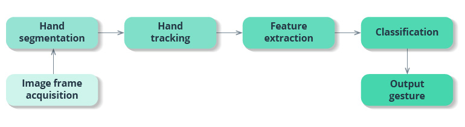
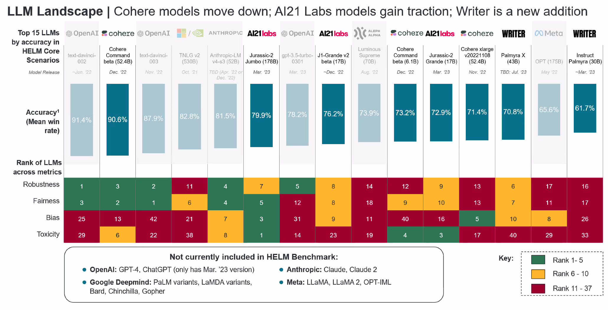
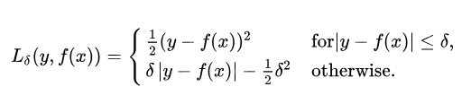
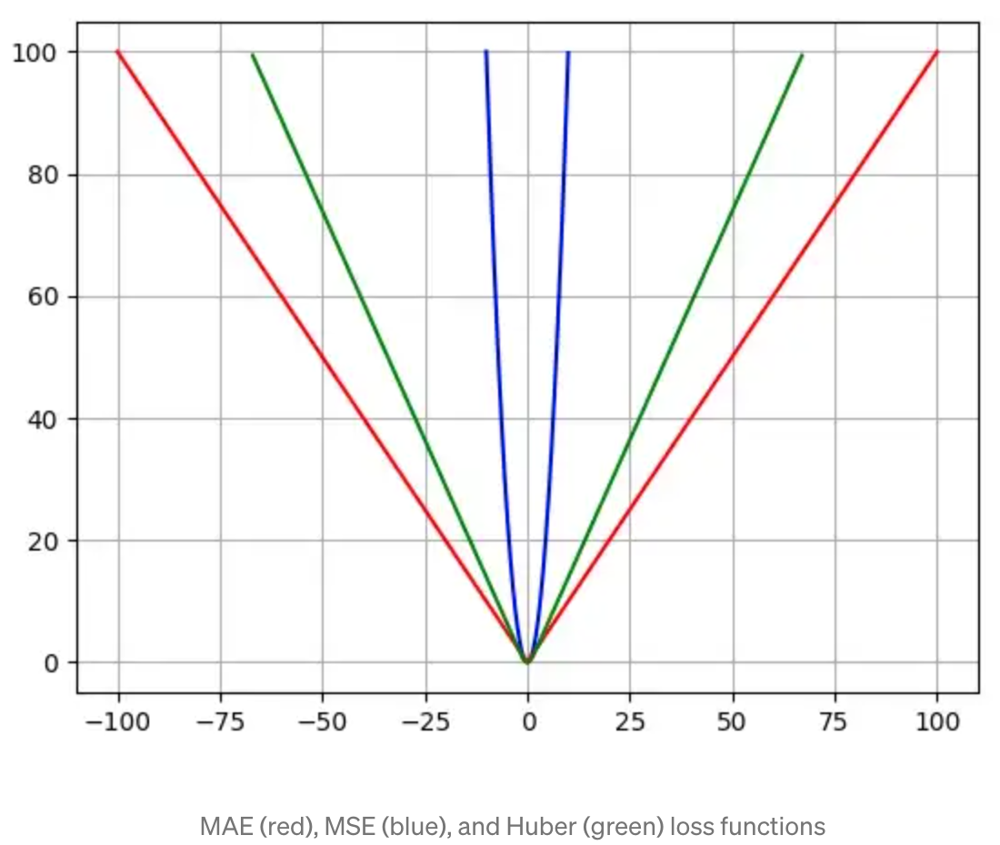
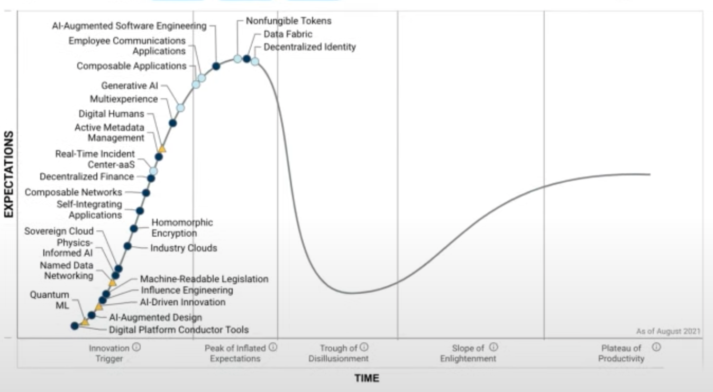
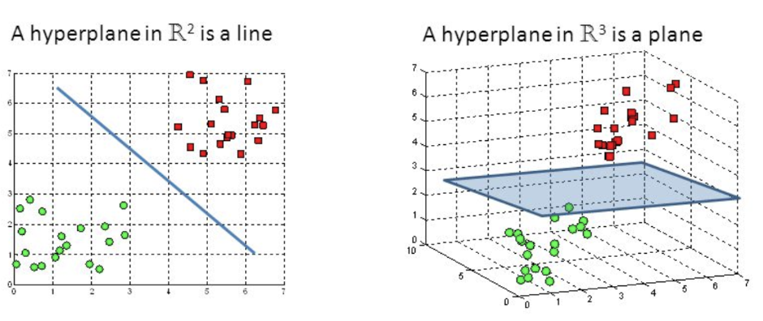

# H

## Hallucination

 To reduce hallucination, look at [RAG]

 More at:

  * articles
    * Air Canada - [https://arstechnica.com/tech-policy/2024/02/air-canada-must-honor-refund-policy-invented-by-airlines-chatbot/](https://arstechnica.com/tech-policy/2024/02/air-canada-must-honor-refund-policy-invented-by-airlines-chatbot/)
    * [https://venturebeat.com/ai/whats-next-in-large-language-model-llm-research-heres-whats-coming-down-the-ml-pike/](https://venturebeat.com/ai/whats-next-in-large-language-model-llm-research-heres-whats-coming-down-the-ml-pike/)

 See also [H], [Large Language Model]


## Hand Gesture Recognition (HGR)

 Gesture recognition provides real-time data to a computer to make it fulfill the user’s commands. Motion sensors in a device can track and interpret gestures, using them as the primary source of data input. A majority of gesture recognition solutions feature a combination of 3D depth-sensing cameras and infrared cameras together with machine learning systems. Machine learning algorithms are trained based on labeled depth images of hands, allowing them to recognize hand and finger positions.

 Gesture recognition consists of three basic levels:
  * Detection. With the help of a camera, a device detects hand or body movements, and a machine learning algorithm segments the image to find hand edges and positions.
  * Tracking. A device monitors movements frame by frame to capture every movement and provide accurate input for data analysis.
  * Recognition. The system tries to find patterns based on the gathered data. When the system finds a match and interprets a gesture, it performs the action associated with this gesture. Feature extraction and classification in the scheme below implements the recognition functionality.

 {: width="100%"}

 Many solutions use vision-based systems for hand tracking, but such an approach has a lot of limitations. Users have to move their hands within a restricted area, and these systems struggle when hands overlap or aren’t fully visible. With sensor-based motion tracking, however, gesture recognition systems are capable of recognizing both static and dynamic gestures in real time.

 In sensor-based systems, depth sensors are used to align computer-generated images with real ones. Leap motion sensors are also used in hand tracking to detect the number and three-dimensional position of fingers, locate the center of the palm, and determine hand orientation. Processed data provides insights on fingertip angles, distance from the palm center, fingertip elevation, coordinates in 3D space, and more. The hand gesture recognition system using image processing looks for patterns using algorithms trained on data from depth and leap motion sensors:
  1. The system distinguishes a hand from the background using color and depth data. The hand sample is further divided into the arm, wrist, palm, and fingers. The system ignores the arm and wrist since they don’t provide gesture information.
  1. Next, the system obtains information about the distance from the fingertips to the center of the palm, the elevation of the fingertips, the shape of the palm, the position of the fingers, and so on.
  1. Lastly, the system collects all extracted features into a feature vector that represents a gesture. A hand gesture recognition solution, using AI, matches the feature vector with various gestures in the database and recognizes the user’s gesture.

 Depth sensors are crucial for hand tracking technology since they allow users to put aside specialized wearables like gloves and make HCI more natural.

 More at:

  * [https://intellias.com/hand-tracking-and-gesture-recognition-using-ai-applications-and-challenges/](https://intellias.com/hand-tracking-and-gesture-recognition-using-ai-applications-and-challenges/)

 See also [H], ...


## Hand Tracking

 

 More at:

  * [https://ai.googleblog.com/2019/08/on-device-real-time-hand-tracking-with.html](https://ai.googleblog.com/2019/08/on-device-real-time-hand-tracking-with.html)

 See also [H], [Hand Gesture Recognition]


## Hanson Robotics Company

 Hanson Robotics Limited is a Hong Kong-based engineering and robotics company founded by David Hanson, known for its development of human-like robots with artificial intelligence (AI) for consumer, entertainment, service, healthcare, and research applications. The robots include Albert HUBO, the first walking robot with human-like expressions; BINA48, an interactive humanoid robot bust; and Sophia, the world's first robot citizen. The company has 45 employees.

 Hanson Robotics’ robots feature a patented spongy elastomer skin called Frubber that resembles human skin in its feel and flexibility. Underneath the Frubber are proprietary motor control systems by which the robots mimic human expressions.

 

 More at:

  * [https://www.hansonrobotics.com/](https://www.hansonrobotics.com/) 
  * [https://en.wikipedia.org/wiki/Hanson_Robotics](https://en.wikipedia.org/wiki/Hanson_Robotics)

 See also [H], [Company], [Sophia Robot]


## Harvard University

 More at:

  * LIT or Learning, Innovation, and Tech Lab - [https://lit.gse.harvard.edu/](https://lit.gse.harvard.edu/)
  * MMLA - [https://mmla.gse.harvard.edu/](https://mmla.gse.harvard.edu/)

 See also [H], ...


## Hebbian Learning

 "Neurons that fire together, wire together" Linked to learning and neural mechanism. Repeated or persistent firing changes synaptic weight due to increased efficiency. Synaptic modifications can be hebbian, anti-hebbian, or non-hebbian.

 More at :

  * [https://anthony-tan.com/Supervised-Hebbian-Learning/](https://anthony-tan.com/Supervised-Hebbian-Learning/)

 See also [H], 


## Her Movie

 Her (stylized in lowercase) is a 2013 American science-fiction romantic drama film written, directed, and co-produced by Spike Jonze. It marks Jonze's solo screenwriting debut. The film follows Theodore Twombly (Joaquin Phoenix), a man who develops a relationship with Samantha (Scarlett Johansson), an artificially intelligent virtual assistant personified through a female voice. The film also stars Amy Adams, Rooney Mara, Olivia Wilde, and Chris Pratt.

 

 More at:

  * [https://en.wikipedia.org/wiki/Her_(film)](https://en.wikipedia.org/wiki/Her_(film))

 See also [H], [AI Movie]
 

## Heuristic

 A heuristic is a mental shortcut that allows an individual to make a decision, pass judgment, or solve a problem quickly and with minimal mental effort. While heuristics can reduce the burden of decision-making and free up limited cognitive resources, they can also be costly when they lead individuals to miss critical information or act on unjust [biases][Bias].

 The study of heuristics was developed by renowned psychologists Daniel Kahneman and Amos Tversky. Starting in the 1970s, Kahneman and Tversky identified several different kinds of heuristics, most notably the availability heuristic and the anchoring heuristic. Since then, researchers have continued their work and identified many different kinds of heuristics, including:

  * Familiarity heuristic
  * Fundamental attribution error
  * Representativeness heuristic
  * Satisficing

```
What is the anchoring heuristic?
The anchoring heuristic, or anchoring bias, occurs when someone relies more heavily on the first piece of information learned when making a choice, even if it's not the most relevant. In such cases, anchoring is likely to steer individuals wrong.

What is the availability heuristic?
The availability heuristic describes the mental shortcut in which someone estimates whether something is likely to occur based on how readily examples come to mind. People tend to overestimate the probability of plane crashes, homicides, and shark attacks, for instance, because examples of such events are easily remembered.

What is the representativeness heuristic?
People who make use of the representativeness heuristic categorize objects (or other people) based on how similar they are to known entities—assuming someone described as "quiet" is more likely to be a librarian than a politician, for instance.

What is satisficing?
Satisficing is a decision-making strategy in which the first option that satisfies certain criteria is selected, even if other, better options may exist.

What is the fundamental attribution error?
Sometimes called the attribution effect or correspondence bias, the term describes a tendency to attribute others’ behavior primarily to internal factors—like personality or character—while attributing one’s own behavior more to external or situational factors.
```

 When are heuristic wrong?

```
What is an example of the fundamental attribution error?
If one person steps on the foot of another in a crowded elevator, the victim may attribute it to carelessness. If, on the other hand, they themselves step on another’s foot, they may be more likely to attribute the mistake to being jostled by someone else.

Listen to your gut, but don’t rely on it. Think through major problems methodically—by making a list of pros and cons, for instance, or consulting with people you trust. Make extra time to think through tasks where snap decisions could cause significant problems, such as catching an important flight.
```

 More at:

  * examples
    * [https://www.kaggle.com/code/alexisbcook/one-step-lookahead](https://www.kaggle.com/code/alexisbcook/one-step-lookahead)
  * [https://www.psychologytoday.com/us/basics/heuristics](https://www.psychologytoday.com/us/basics/heuristics)
  * [https://www.investopedia.com/terms/h/heuristics.asp](https://www.investopedia.com/terms/h/heuristics.asp)

 See also [H], [Deep Blue Challenge]


## Hidden Layer
 
 A layer of neurons in an [artificial neural network] between the input and the final output or label.

 See also [H], [Dropout Layer]


## Hidden Markov Model (HMM)

 

 

 More at:

  * [https://en.wikipedia.org/wiki/Hidden_Markov_model ](https://en.wikipedia.org/wiki/Hidden_Markov_model )

 See also [H], [Generative Classified], [Hidden State]


## Hidden State

  * Memory from previous RNN stages = representation of previous input
  * In Encoder-decoder = latent state/space?

 See also [H], [H], [Encoder-Decoder Model], [Hidden Markov Model], [Recurrent Neural Network]


## Hindsight Experience Replay

 In [RL], Learn from failed episodes by pretending any state reached was the goal.

 See also [H], ...


## Hierarchical Navigable Small World (HNSW) Function

 a state-of-the-art algorithm used for an approximate search of nearest neighbours. Under the hood, HNSW constructs optimized graph structures

 {: width="100%"}

 

 More at:

  * paper - [https://arxiv.org/abs/1603.09320](https://arxiv.org/abs/1603.09320)
  * [https://towardsdatascience.com/similarity-search-part-4-hierarchical-navigable-small-world-hnsw-2aad4fe87d37](https://towardsdatascience.com/similarity-search-part-4-hierarchical-navigable-small-world-hnsw-2aad4fe87d37)
  * small world network - [https://en.wikipedia.org/wiki/Small-world_network](https://en.wikipedia.org/wiki/Small-world_network)
  * vector search engine with HNSW - [https://esteininger.medium.com/building-a-vector-search-engine-using-hnsw-and-cosine-similarity-753fb5268839](https://esteininger.medium.com/building-a-vector-search-engine-using-hnsw-and-cosine-similarity-753fb5268839)

 See also [H], ...


## Hierarchical RL

 Decomposes problem into hierarchy of sub-policies over different timescales.

 See also [H], ...


## Hinge Loss Function

 The use of hinge loss is very common in binary classification problems where we want to separate a group of data points from those from another group. It also leads to a powerful machine learning algorithm called [Support Vector Machines (SVMs)] Let’s have a look at the mathematical definition of this function.

 More at:

  * [https://www.baeldung.com/cs/hinge-loss-vs-logistic-loss](https://www.baeldung.com/cs/hinge-loss-vs-logistic-loss)

 See also [H], [Loss Function]


## High-Order Polynomial Projection Operators (HiPPO) Framework

 ~ a precursor of the [S4 Model]

 

 More at:

  * paper - [https://arxiv.org/abs/2008.07669](https://arxiv.org/abs/2008.07669)
  * code - [https://github.com/HazyResearch/hippo-code](https://github.com/HazyResearch/hippo-code)
  * articles
    * [https://hazyresearch.stanford.edu/blog/2020-12-05-hippo](https://hazyresearch.stanford.edu/blog/2020-12-05-hippo)

 See also [H], ...


## Histogram Of Oriented Gradients (HOG)

 Inspired by the [Neocognitron]

 The histogram of oriented gradients (HOG) is a feature descriptor used in computer vision and image processing for the purpose of object detection. The technique counts occurrences of gradient orientation in localized portions of an image. This method is similar to that of edge orientation histograms, [scale-invariant feature transform] descriptors, and shape contexts, but differs in that it is computed on a dense grid of uniformly spaced cells and uses overlapping local contrast normalization for improved accuracy.

 
  
 More at:

  * [https://en.wikipedia.org/wiki/Histogram_of_oriented_gradients](https://en.wikipedia.org/wiki/Histogram_of_oriented_gradients)

 See also [H], ...


## Holdout Fold

 See also [H], [Cross-Validation Sampling Method]


## Holistic Evaluation of Language Model (HELM) Benchmark

 A language model takes in text and produces text. Despite their simplicity, language models are increasingly functioning as the foundation for almost all language technologies from question answering to summarization. But their immense capabilities and risks are not well understood. Holistic Evaluation of Language Models (HELM) is a living benchmark that aims to improve the transparency of language models.

 {: width="100%"}

 More at:

  * [https://crfm.stanford.edu/helm/latest/](https://crfm.stanford.edu/helm/latest/)
  * [https://github.com/stanford-crfm/helm](https://github.com/stanford-crfm/helm)
  * [https://crfm.stanford.edu/2022/11/17/helm.html](https://crfm.stanford.edu/2022/11/17/helm.html)

 See also [H], ...


## Homography

 ~ image stitching = relates 2 images from the same camera center

 Map a picture to another ---> using the [RANSAC Algorithm] ?

 

 More at:

  * [https://en.wikipedia.org/wiki/Homography](https://en.wikipedia.org/wiki/Homography)

 See also [H], ...


## Hopfield Network

 ~ a model of associative memory, not generative. Can only recall what has been memorized (unlike [Boltzmann machines] )

 A paradigm for information retrieval developed by John Hopfield in 1982

 Ex: protein folding that search / fold its most stable configuration ==> Folding is favorable for energy (capacity to do work or cause change) 

  * Energy landscape (protein minimize its potential energy)
  * Protein follow its steepest path to the valley (guided by the energy landscape) following the process of energy minimization

 Connections can be 

  * Direction
    * Symmetric = bidirectional, or same weight in both direction (Hopfield)
    * Asymmetric = unidirectional, or weight in one direction (Brain)
  * Neighbor
    * Excitatory = weight is positive, neuron are positively coupled. The state of one neuron pushes the other in the same state (-1 or +1)
    * Inhibitive = weight is negative. Neurons are negatively correlated. The state of one pushes the other in the opposite state (i.e. misalignment between neurons)
    * Non-existent = weight is 0

 Happiness of the edge (i,j) = w(i,j).Xi.Xj      <-- = weight . state

 Happiness of the network = sum(i, j, Happiness of edge(i, j))

 Goal = maximize network happiness = minimize network unhappiness

 Adjusting weights w(i,j) = sculpting energy landscape, creating minima at memory locations = act of learning

 Adjusting states Xi = evolve the system towards local minima by descending along the surface = act of inference/recalling

 Update the neuron state one at a time to minimize the energy. Until network reach a stable configuration.

 /!\ The number of patterns you can store in a vanilla Hopfield network --> [Boltzmann Machines]

 

 

 See also [H], [Full Connected Network], [Hebbian Learning Rule]


## HourVideo Dataset

 The recent introduction of the HourVideo dataset heralds a transformative step in the development of AI technologies, particularly in the realm of understanding long-duration videos in conjunction with language processing. Created by a team at Stanford University led by renowned AI researcher Fei-Fei Li, this dataset promises to challenge existing models and expand the frontiers of multimodal AI.

 HourVideo is a specialized dataset designed for assessing video-language understanding, comprising 500 egocentric videos ranging from 20 to 120 minutes, along with nearly 13,000 multiple-choice questions. The dataset includes tasks such as summarization, perception, visual reasoning, and navigation, each testing different aspects of how AI can comprehend and interact with video content. Initial evaluations reveal that current leading models like GPT-4 and Gemini Pro 1.5 perform significantly below human experts, indicating a pressing need for advancements in AI capabilities regarding long-context video understanding.

 

 More at:

  * site - [https://hourvideo.stanford.edu/](https://hourvideo.stanford.edu/)
  * paper - [https://arxiv.org/abs/2411.04998](https://arxiv.org/abs/2411.04998)

 See also [H], ...


## Huber Loss Function

 Now we know that the [Mean Square Error (MSE)][MSE] is great for learning [outliers] while the [Mean Absolute Error (MAE)] is great for ignoring them. But what about something in the middle? Consider an example where we have a [dataset] of 100 values we would like our model to be trained to predict. Out of all that data, 25% of the expected values are 5 while the other 75% are 10. An MSE loss wouldn’t quite do the trick, since we don’t really have “[outliers]”; 25% is by no means a small fraction. On the other hand we don’t necessarily want to weight that 25% too low with an MAE. Those values of 5 aren’t close to the median (10 — since 75% of the points have a value of 10), but they’re also not really [outliers]. Our solution? The Huber Loss Function. The Huber Loss offers the best of both worlds by balancing the [MSE] and [MAE] together. We can define it using the following piecewise function:

 {: width="100%"}

 {: width="100%"}

 What this equation essentially says is: for loss values less than delta, use the [MSE]; for loss values greater than delta, use the [MAE]. This effectively combines the best of both worlds from the two [loss functions]! Using the [MAE] for larger loss values mitigates the weight that we put on [outliers] so that we still get a well-rounded model. At the same time we use the [MSE] for the smaller loss values to maintain a quadratic function near the centre. This has the effect of magnifying the loss values as long as they are greater than 1. Once the loss for those data points dips below 1, the quadratic function down-weights them to focus the training on the higher-error data points.

```python
import numpy as np

def huber_loss(y_pred, y, delta=1.0):
    huber_mse = 0.5*(y-y_pred)**2
    huber_mae = delta * (np.abs(y - y_pred) - 0.5 * delta)
    return np.where(np.abs(y - y_pred) <= delta, huber_mse, huber_mae)
```

 Pros and Cons:

  * Advantages : Best of the MSE and the MAE ?
  * Disadvantages
   * For cases where [outliers] are very important to you, use the [MSE]! 
   * For cases where you don’t care at all about the [outliers], use the [MAE]!

 See also [H], [Loss Function], [Mean Absolute Error Loss Function], [Mean Square Error Loss Function]


## Hugging Face Company

 Hugging Face is a company that offers a range of products and services related to natural language processing (NLP). Some of their main offerings include:

  * Transformers: Hugging Face has developed a popular open-source library called Transformers, which provides a wide range of pre-trained models for various NLP tasks, such as language translation, sentiment analysis, and question answering. This library is widely used in industry and academia and has helped make NLP more accessible to developers.
  * Hugging Face Hub: This is a cloud-based platform for sharing and collaborating on NLP models and datasets. It allows developers to easily upload, download, and fine-tune models, as well as access a range of pre-trained models contributed by the community.
  * Hugging Face Spaces: This is a new product from Hugging Face that allows users to create and share virtual meeting spaces for remote collaboration. Spaces is designed to be a more immersive and interactive alternative to traditional video conferencing tools.
  * Hugging Face API (50K models): This is a REST API that allows developers to quickly integrate NLP models into their applications. The API supports a range of tasks, including sentiment analysis, text classification, and entity recognition.
  * Endpoints (Pay per hour with SLA?)

 Overall, Hugging Face's products and services are designed to make NLP more accessible and easier to use for developers and researchers.

 {% youtube "https://www.youtube.com/watch?v=O7KbwmaK9Ck" $}

 More at:

  * site - [https://huggingface.co/](https://huggingface.co/)
  * docs - [https://huggingface.co/docs](https://huggingface.co/docs)
  * services
    * inference API - [https://huggingface.co/inference-api](https://huggingface.co/inference-api)
    * endpoints - [https://ui.endpoints.huggingface.co/](https://ui.endpoints.huggingface.co/)
    * spaces - [https://huggingface.co/spaces](https://huggingface.co/spaces)
  * repositories/registries
    * datasets - [https://huggingface.co/datasets](https://huggingface.co/datasets)
    * model hub - [https://huggingface.co/models](https://huggingface.co/models)

 See also [H], ...


## Hugging Face Hub

 See also [H], ...


## Human-Centered AI

  * Understand human intelligence more deeply and more broadly
  * Connect to neuroscience, cognitive psychology, etc
  * Collaborates with humans
  * Enhances, not replaces humans; gives humans appropriate control
  * Aware of human preferences (value discovery/alignment)
  * Aware of human abilities and limitations
  * Accountable, explainable, understandable, and trustworthy
  * Focused on what is good for humanity (health, environment)
  * Bridges to policy world, other academic disciplines, industry
  * Respects ethics (animal-centered AI? Earth-centered AI?) 

 

 

 More at:

  * stanford HAI - [https://hai.stanford.edu/](https://hai.stanford.edu/)

 See also [H], [Artificial Intelligence]


## Human-Centered Design (HCD)

 When applied to AI, gives rise to [Human-Centered AI]

 More at:

  * [https://www.kaggle.com/code/var0101/human-centered-design-for-ai/tutorial#Introduction](https://www.kaggle.com/code/var0101/human-centered-design-for-ai/tutorial#Introduction)

 See also [H], ...


## Humane Company

 ~ $700 with $25/month subscription

 

 

 More:

  * site - [https://humane.com/](https://humane.com/)
  * articles
    * sales vs daily returns - [https://www.theverge.com/2024/8/7/24211339/humane-ai-pin-more-daily-returns-than-sales](https://www.theverge.com/2024/8/7/24211339/humane-ai-pin-more-daily-returns-than-sales)

 See also [H], ...


## Humanoid Robot

 A robot that is meant to resemble a human. 

 Examples:

  * [Figure-01]

 See also [H], [Robot]


## Hybrid AI

 More at:

  * [https://www.mckinsey.com/about-us/new-at-mckinsey-blog/hybrid-intelligence-the-future-of-artificial-intelligence](https://www.mckinsey.com/about-us/new-at-mckinsey-blog/hybrid-intelligence-the-future-of-artificial-intelligence)

 See also [H], ...


## Hybrid AI System

 More at:

  * articles
    * [https://www.solulab.com/hybrid-ai/](https://www.solulab.com/hybrid-ai/)

 See also [H], ...


## Hype Cycle

 Where is AI on the hype cycle?

 

 Each Hype Cycle drills down into the five key phases of a technology’s life cycle.

  * Innovation Trigger: A potential technology breakthrough kicks things off. Early proof-of-concept stories and media interest trigger significant publicity. Often no usable products exist and commercial viability is unproven.
  * Peak of Inflated Expectations: Early publicity produces a number of success stories — often accompanied by scores of failures. Some companies take action; many do not.
  * Trough of Disillusionment: Interest wanes as experiments and implementations fail to deliver. Producers of the technology shake out or fail. Investments continue only if the surviving providers improve their products to the satisfaction of early adopters.
  * Slope of Enlightenment: More instances of how the technology can benefit the enterprise start to crystallize and become more widely understood. Second- and third-generation products appear from technology providers. More enterprises fund pilots; conservative companies remain cautious.
  * Plateau of Productivity: Mainstream adoption starts to take off. Criteria for assessing provider viability are more clearly defined. The technology's broad market applicability and relevance are clearly paying off.

 

 More at:

  * [https://www.gartner.com/en/research/methodologies/gartner-hype-cycle](https://www.gartner.com/en/research/methodologies/gartner-hype-cycle)
  * articles
    * [https://www.wired.com/story/ai-hype-cycle-burnout/](https://www.wired.com/story/ai-hype-cycle-burnout/)

 See also [H], ...


## Hypernetwork Architecture

 ~ an alternative to [supervised fine-tuning (SFT)][SFT] and [preft] with [lora] which consist of using an external model!

 This architecture has been used by [ControlNet]

 

 See also [H], [ControlNet External Network]


## Hyperparameter

 * Parameters not directly learned by learning algorithm
 * specified outside of training procedure
 * control the capacity of the model i.e. flexibility of model to fit the data
 * prevent overfittting
 * improve the convergence of the gradient descent (training time)

 `~ parameters to tune the performance of the ML model`. Any decision the algorithm author can't make for you. In machine learning, we use the term hyperparameter to distinguish from standard model parameters. So, it is worth to first understand what those are. A machine learning model is the definition of a mathematical formula with a number of parameters that need to be learned from the data. That is the crux of machine learning: fitting a model to the data. This is done through a process known as model training. In other words, by training a model with existing data, we are able to fit the model parameters. `However, there is another kind of parameters that cannot be directly learned from the regular training process`. These parameters express “higher-level” properties of the model such as its complexity or how fast it should learn. They are called hyperparameters. Hyperparameters are usually fixed before the actual training process begins. So, how are hyperparameters decided? That is probably beyond the scope of this question, but suffice to say that, broadly speaking, this is done by setting different values for those hyperparameters, training different models, and deciding which ones work best by testing them.

 So, to summarize. Hyperparameters:

  * Define higher level concepts about the model such as complexity, or capacity to learn.
  * Cannot be learned directly from the data in the standard model training process and need to be predefined.
  * Can be decided by setting different values, training different models, and choosing the values that test better

 Some examples of hyperparameters:

  * Number of leaves or depth of a tree
  * Number of trees
  * Number of latent factors in a matrix factorization
  * Learning rate (in many models)
  * Number of hidden layers in a deep neural network
  * Number of hidden nodes in network layers
  * Number of clusters in a k-means clustering
  * [Drop out function]
  * Regularization
  * Boosting step size
  * Initialization of clustering algorithm

 Beware often you have 1 hyperparameter that is more impactful than the other. Also beware of correlation between parameters. Hyperparameters can take a continuous, integer, or categorical value (ex learning rate 0.1, epochs:20, optimizer: sgd). 

 See also [H], [Algorithmic], [Boosting Step Size], [Complexity], [Data Handling], [Drop Out], [Expressiveness], [Hyperparameter Optimization], [Learning Rate], [Parameter], [Regularization], [XGBoost]


## Hyperparameter Optimization (HPO)

 Process used to tune the [hyperparameters][Hyperparameter] to get the best prediction (best is defined by a function!)

 Tuning strategies:

  1. Trial and Error, defaults, guess, experience, intuition, heuristics 
  1. Try everything using one of the 3 most popular HPO techniques:
   * [Random search] or the derived [Sobol Search]
   * [Grid search]
   * [Bayes Search]
  1. Meta model ... Required to avoid over-fitting and under-fitting.

/// warning | High dimensional grid search, = the [curse of dimensionality]
///

 In general, if the number of combinations is limited enough, we can use the [Grid Search] technique. But when the number of combinations increases, we should try [Random Search] or [Bayes Search] as they are less computationally expensive.

 See also [H], [AutoML], [CPU], [F1 Score], [GPU], [Hyperparameter], [Meta Model], [Overfitting], [Underfitting]


## Hyperparameter Tuning

 See [Hyperparameter Optimization]


## Hyperplane

 The boundary between TWO classification classes? Yes, in a real or latent dimension! For example in a 3D space, a 2-D plane could be an hyperplane where on one side you have the elements of class A and on the other side you have the elements of class B. Used as a decision boundary. A hyperplane is a subspace that has one dimension less than the ambient space that contains it. In simple linear regression, there is one dimension for the response variable and another dimension for the explanatory variable, for a total of two dimensions. The regression hyperplane thus has one dimension; a hyperplane with one dimension is a line. In mathematics, a hyperplane H is a linear subspace of a vector space V such that the basis of H has cardinality one less than the cardinality of the basis for V.  In other words, if V is an n-dimensional vector space than H is an (n-1)-dimensional subspace.  Examples of hyperplanes in 2 dimensions are any straight line through the origin. In 3 dimensions, any plane containing the origin.  In higher dimensions, it is useful to think of a hyperplane as member of an affine family of (n-1)-dimensional subspaces (affine spaces look and behavior very similar to linear spaces but they are not required to contain the origin), such that the entire space is partitioned into these affine subspaces. This family will be stacked along the unique vector (up to sign) that is perpendicular to the original hyperplane.  This "visualization" allows one to easily understand that a hyperplane always divides the parent vector space into two regions.

 {: width="100%"}

 See also [H], [Classification], [Decision Boundary], [Support Vector Machine]
