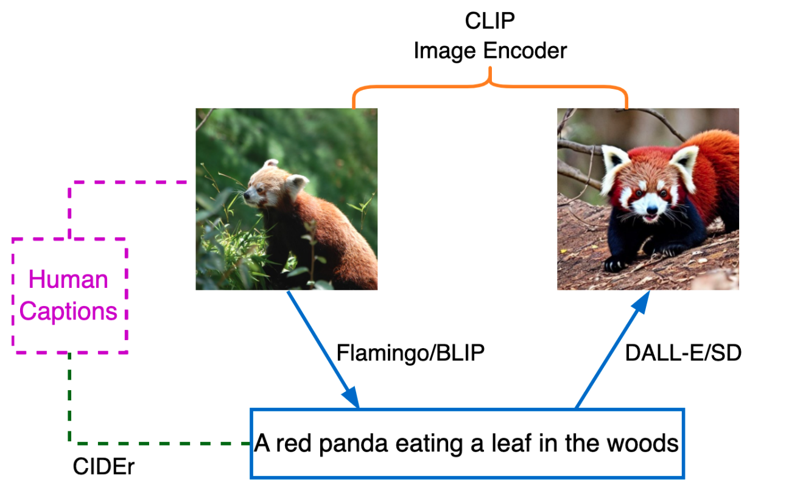
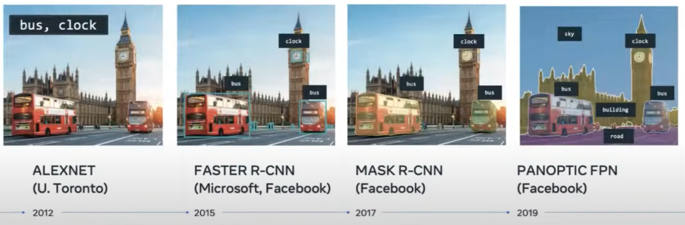
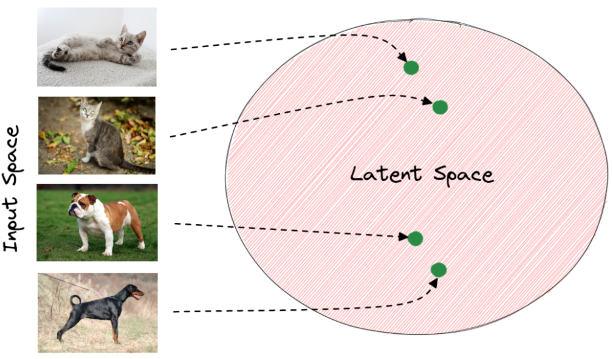
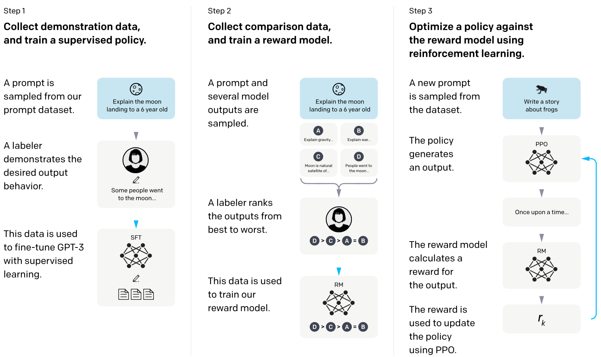
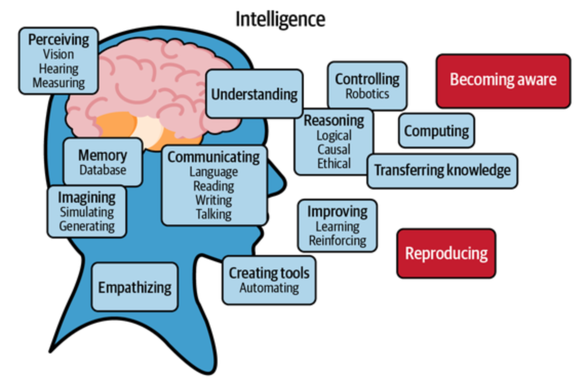

# I

## I, Robot Movie

 I, Robot is a 2004 American science fiction action film directed by Alex Proyas. 
 In 2035, highly intelligent robots fill public service positions throughout the dystopian world, operating under three rules to keep humans safe. Detective Del Spooner (Smith) investigates the alleged suicide of U.S. Robotics founder Alfred Lanning (Cromwell) and believes that a human-like robot called Sonny (Tudyk) murdered him.

 

 More at:

  * [https://en.wikipedia.org/wiki/I,_Robot_(film)](https://en.wikipedia.org/wiki/I,_Robot_(film))

 See also [AI Movie]


## IBM Company

 See also [I], [Company]


## IBM Watson

 IBM Watson is a question-answering computer system capable of answering questions posed in natural language, developed in IBM's DeepQA project by a research team led by principal investigator David Ferrucci. Watson was named after IBM's founder and first CEO, industrialist Thomas J. Watson.

 The computer system was initially developed to answer questions on the quiz show Jeopardy! and, in 2011, the Watson computer system competed on Jeopardy! against champions Brad Rutter and Ken Jennings, winning the first place prize of $1 million.

 

 

 More at:

  * site - [https://www.ibm.com/watson](https://www.ibm.com/watson)
  * wikipedia - [https://en.wikipedia.org/wiki/IBM_Watson](https://en.wikipedia.org/wiki/IBM_Watson)

 See also [I], [IBM]

## Ilya Sutskever Person

 [OpenAI] Co-founder.

 

 

 See also [I], [People]


## Image Analysis

 See also [I], [Amazon Recognition]


## Image Classifier

 A component that does image classification.

 See also [I], [Image Classification]


## Image Classification

 [Convolutional Neural Network] such as [ResNet]. Supervised algorithm.

```python
 # Load YOLOv8n-cls, train it on mnist160 for 3 epochs and predict an image with it
from ultralytics import YOLO

model = YOLO('yolov8n-cls.pt')  # load a pretrained YOLOv8n classification model
model.train(data='mnist160', epochs=3)  # train the model
model('https://ultralytics.com/images/bus.jpg')  # predict on an image
```

 

 More at:

   * [https://heartbeat.fritz.ai/the-5-computer-vision-techniques-that-will-change-how-you-see-the-world-1ee19334354b](https://heartbeat.fritz.ai/the-5-computer-vision-techniques-that-will-change-how-you-see-the-world-1ee19334354b)
   * colab - [https://colab.research.google.com/github/ultralytics/ultralytics/blob/main/examples/tutorial.ipynb](https://colab.research.google.com/github/ultralytics/ultralytics/blob/main/examples/tutorial.ipynb)

 See also [I], ...


## Image Compression

 A type of [image processing] used to improve the appearance of an image by adjusting brightness, contrast, or reducing noise.

 See also [I], ...


## Image Decoder

 See also [I], [Decoder], [Image Encoder]


## Image Encoder

 ~ data compression where the encoder compress the data (not always) Ex: 2 images of lions. Instead of a comparing pixel to pixel, first encode the image to extract similarities and then compare the similarities. The translation from pixels to similarities is done by an encoder. First, let’s call encoder the process that produce the “new features” representation from the “old features” representation (by selection or by extraction) and decoder the reverse process. Dimensionality reduction can then be interpreted as data compression where the encoder compress the data (from the initial space to the encoded space, also called latent space) whereas the decoder decompress them. Of course, depending on the initial data distribution, the latent space dimension and the encoder definition, this compression/representation can be lossy, meaning that a part of the information is lost during the encoding process and cannot be recovered when decoding.

 See also [I], [Encoder], [Image Decoder]


## Image Enhancement

 A type of [image processing] used to improve the appearance of an image by adjusting brightness, contrast, or reducing noise.

 See also [I], ...


## Image Filter

 ~ in a [Convolutional Neural Network (CNN)][CNN], this is a [feature] detector!

/// details | Is an image filter related to a [GPU kernel] ?
    type: question

    Yes!
///

 A small matrix which you can use to multiply to the pixel area of the same size. The filter is applied to or convoluted with the same image for every area possible. As represented below, we can use a 2x2x1 filter, but we recommend a 3x3x1 filter.

 {: width="100%"}

 Where is the pattern of each filter coming from? Just like weights in a neural network, it comes from Backpropagation !
 
/// details | What are low, medium, and high frequency patterns?
    type:question

    That seems to be referring to 'contrast' or difference in values of the pixel in the kernel
///

 Questions

  * number of filters?
    * that's a hyperparameter!
    * the output of a convolution of one filter with the input is called a [feature map]
    * applying an [activation function] on the [feature maps] result in an [activation map]
  * filter size?
    * 3x3 as chained 3x3 (2 Conv2D) gives you the same 5x5 receptive field (or patch) as a single 5x5 convolution! --> important because fewer weights/parameters = less/faster computation! ( 2 3x3 conv uses 72% of the param and computation of a 5x5 conv, 3 3x3 conv uses 55% of the params of a 7x7)
    * very first input conv can be <> because input only has 3 channels ==> 5x5x3 or 7x7x3 on first layer
    * 1x1 because it is the most easy way to change the number of features in the [feature map] (!?!?)
    * filters have a height, width, and a number of channels. The number of channels must match the number of channels of the input to be processed. That is why the number of channels of the filter is never specified as an input!!!

```python
import keras

from keras.layers import Conv2D     # <== 2D is how the filter moves!
                                    # <!> 1D is used for time-series
                                    # <!> 3D is used for videos or stacked images seen in medical imaging

model = keras.models.Sequential()

model.add(Conv2D(1, kernel_size=(3,3), input_shape = (128, 128, 3))) # <== filter is really 3x3x3!

model.summary()
```

 

 More at:

  * [https://setosa.io/ev/image-kernels/](https://setosa.io/ev/image-kernels/)
  * [https://medium.com/codex/kernels-filters-in-convolutional-neural-network-cnn-lets-talk-about-them-ee4e94f3319](https://medium.com/codex/kernels-filters-in-convolutional-neural-network-cnn-lets-talk-about-them-ee4e94f3319)

 See also [I], [Convolutional Layer]


## Image Generator

 AI image generators leverage advanced machine learning algorithms to transform text descriptions into images. These tools are trained on extensive datasets, allowing them to interpret prompts and create anything from simple illustrations to highly detailed, photorealistic scenes. The technology powering these generators often includes neural networks like [Generative Adversarial Networks (GANs)][GAN] or [Diffusion Models].

 More at:

  * DALL-E - [https://openai.com/index/dall-e-3/](https://openai.com/index/dall-e-3/) 
  * Flux - [https://aitubo.ai/flux-image-generator/](https://aitubo.ai/flux-image-generator/) 
  * Ideogram - [https://ideogram.ai/](https://ideogram.ai/)
  * midjourney - [https://www.midjourney.com/home](https://www.midjourney.com/home)
  * openArt - [https://openart.ai/home](https://openart.ai/home)
  * unstability.ai - [https://www.unstability.ai/history](https://www.unstability.ai/history)
  * Stable diffusion - [https://www.diffus.me/](https://www.diffus.me/ )
  * articles
    * [https://anakin.ai/blog/flux-midjourney-dalle-stable-diffusion-comparison/](https://anakin.ai/blog/flux-midjourney-dalle-stable-diffusion-comparison/)

 See also [I], ...


## Image Joint-Embedding Predictive Architecture (I-JEPA)

 A method for [Joint-Embedding Predictive Architecture (JEPA)] based on image

 

 More at:

  * [https://ai.meta.com/blog/yann-lecun-ai-model-i-jepa/](https://ai.meta.com/blog/yann-lecun-ai-model-i-jepa/)
  * paper - [https://arxiv.org/abs/2301.08243](https://arxiv.org/abs/2301.08243)

 See also [I], ...


## Image Inpainting

 Masking of an area of an image and having it reconstructed by going through an autoencoder.

 See also [I], [Masked Language Learning Model]


## Image Processing

 Image processing involves various techniques to manipulate and analyze images to enhance their quality, extract useful information, or prepare them for further analysis or computer vision tasks. This field is widely used in applications like medical imaging, facial recognition, computer graphics, and digital photography.

 The primary goals in image processing include:

  1. [Image Enhancement] - Improving the appearance of an image by adjusting brightness, contrast, or reducing noise.
  2. [Image Restoration] - Removing distortions or artifacts (like blurring) that may have occurred during the image capture process.
  3. [Image Segmentation] - Dividing an image into distinct regions or objects (at the pixel level) to make it easier to analyze specific areas.
  4. [Object Detection] and [Object Recognition] - Identifying specific objects, patterns, or features within an image.
  5. [Image Compression] - Reducing the file size for storage and transmission without compromising image quality significantly.

 Techniques in image processing range from basic filters and transformations to complex algorithms involving machine learning and deep learning, especially for tasks like recognition and classification.

 See also [I], ...


## Image Reconstruction

 {: width="100%"}

 Above is a pipeline for image reconstruction. The input image is fed to Flamingo/BLIP to generate a caption, which is fed to DALL-E/SD to reconstruct an image. The generated image is compared with the input image using the CLIP image encoder in the embedding space. Each input image has human-annotated captions which can be used to evaluate the generated caption.

 See also [I], [BLIP Model], [CLIP Image Encoder], [Text Reconstruction]


## Image Restoration

 A type of [image processing] used to remove distortions or artifacts (like blurring) that may have occurred during the image capture process.

 See also [I], ...


## Image Segmentation

 ~ Dividing an image into distinct regions or objects (at the pixel level) to make it easier to analyze specific areas.

 Image segmentation is a process of dividing an image into multiple segments or regions, each of which corresponds to a different object or part of the image. The goal of image segmentation is to simplify or change the representation of an image into something that is more meaningful and easier to analyze. It is a fundamental task in computer vision and is used in various applications, such as [object recognition], [object tracking], and image editing.

 Image segmentation can be performed using a variety of methods, including [thresholding], clustering, [edge detection], and machine learning algorithms. These methods typically involve grouping pixels or regions of pixels in an image based on similarities in color, texture, or other visual features.

 The output of image segmentation is a set of labeled regions that can be used for further processing or analysis. For example, in object recognition, the segmented regions can be used to identify and classify objects in an image. In medical imaging, image segmentation can be used to identify and isolate specific structures or organs in a patient's body.

 Overall, image segmentation is an essential step in many computer vision applications and is an active area of research in the field.

 Algorithms:

  * [AlexNet]
  * Faster [R-CNN]
  * Mask [R-CNN]
  * Panoptic FPN

 Models:

  * [Segment Anything Model]

 {: width="100%"}

 More at:

  * colab - [https://colab.research.google.com/github/ultralytics/ultralytics/blob/main/examples/tutorial.ipynb](https://colab.research.google.com/github/ultralytics/ultralytics/blob/main/examples/tutorial.ipynb)

 See also [I], [Object Detection]


## Image-aware Decoder Enhanced a la Flamingo with Interleaved Cross-attentionS (IDEFICS) Model

 IDEFICS is based on [Flamingo], a state-of-the-art visual language model initially developed by [DeepMind], which has not been released publicly. Similarly to GPT-4, the model accepts arbitrary sequences of image and text inputs and produces text outputs. IDEFICS is built solely on publicly available data and models ([LLaMA] v1 and OpenCLIP) and comes in two variants—the base version and the instructed version. Each variant is available at the 9 billion and 80 billion parameter sizes.

 More at:
  * site - [https://huggingface.co/HuggingFaceM4/idefics-80b-instruct](https://huggingface.co/HuggingFaceM4/idefics-80b-instruct)
  * articles
    * [https://huggingface.co/blog/idefics](https://huggingface.co/blog/idefics)

 See also [I], ...


## Imagen Model Family

 Imagen, a text-to-image diffusion model with an unprecedented degree of photorealism and a deep level of language understanding. Imagen builds on the power of large transformer language models in understanding text and hinges on the strength of diffusion models in high-fidelity image generation. Our key discovery is that generic large language models (e.g. T5), pretrained on text-only corpora, are surprisingly effective at encoding text for image synthesis: increasing the size of the language model in Imagen boosts both sample fidelity and image-text alignment much more than increasing the size of the image diffusion model.

 

 

 More at:

   * [https://imagen.research.google/](https://imagen.research.google/)
   * [https://www.louisbouchard.ai/google-brain-imagen/](https://www.louisbouchard.ai/google-brain-imagen/)

 See also [I], [Latent Diffusion Model]


## Imagen Video Model

 Imagen Video, a text-conditional video generation system based on a cascade of video diffusion models. Given a text prompt, Imagen Video generates high definition videos using a base video generation model and a sequence of interleaved spatial and temporal video super-resolution models. 

 

 More at:

  * [https://imagen.research.google/video/](https://imagen.research.google/video/)

 See also [I], ...


## ImageNet Dataset

 ~ 1.2 million images with 1000 label each (= used for supervised learning, or not!) ImageNet is an image dataset organized according to the WordNet hierarchy. Each meaningful concept in WordNet, possibly described by multiple words or word phrases, is called a "synonym set" or "synset". There are more than 100,000 synsets in WordNet; the majority of them are nouns (80,000+). In ImageNet, we aim to provide on average 1000 images to illustrate each synset. Images of each concept are quality-controlled and human-annotated. In its completion, we hope ImageNet will offer tens of millions of cleanly labeled and sorted images for most of the concepts in the WordNet hierarchy. The ImageNet project was inspired by two important needs in computer vision research. The first was the need to establish a clear North Star problem in computer vision. While the field enjoyed an abundance of important tasks to work on, from stereo vision to image retrieval, from 3D reconstruction to image segmentation, object categorization was recognized to be one of the most fundamental capabilities of both human and machine vision. Hence there was a growing demand for a high quality object categorization benchmark with clearly established evaluation metrics. Second, there was a critical need for more data to enable more generalizable machine learning methods. Ever since the birth of the digital era and the availability of web-scale data exchanges, researchers in these fields have been working hard to design more and more sophisticated algorithms to index, retrieve, organize and annotate multimedia data. But good research requires good resources. To tackle this problem at scale (think of your growing personal collection of digital images, or videos, or a commercial web search engine’s database), it was critical to provide researchers with a large-scale image database for both training and testing. The convergence of these two intellectual reasons motivated us to build ImageNet.

 

 More at:

   * wikiepedia - [https://en.wikipedia.org/wiki/ImageNet](https://en.wikipedia.org/wiki/ImageNet)
   * [https://image-net.org/challenges/LSVRC/index.php](https://image-net.org/challenges/LSVRC/index.php)
   * know-your-data - [https://knowyourdata-tfds.withgoogle.com/#tab=STATS&dataset=imagenet2012](https://knowyourdata-tfds.withgoogle.com/#tab=STATS&dataset=imagenet2012)

 See also [I], [AlexNet Model], [Fei-Fei Li Person], [Supervised Learning], [Transfer Learning], [WordNet Dataset]


## ImageNet Large Scale Visual Recognition (ILSVRC) Challenge

 The ImageNet Large Scale Visual Recognition Challenge (ILSVRC) is a benchmark in object category classification and detection on hundreds of object categories and millions of images. The challenge has been run annually from 2010 to present, attracting participation from more than fifty institutions.

 

 More at:

  * [https://arxiv.org/abs/1409.0575](https://arxiv.org/abs/1409.0575)

 See also [I], [AlexNet Model] 

## Imitation Learning (IL)

 In imitation learning (IL), an agent is given access to samples of expert behavior (e.g. videos of humans playing online games or cars driving on the road) and it tries to learn a policy that mimics this behavior. This objective is in contrast to reinforcement learning (RL), where the goal is to learn a policy that maximizes a specified reward function. A major advantage of imitation learning is that it does not require careful hand-design of a reward function because it relies solely on expert behavior data, making it easier to scale to real-world tasks where one is able to gather expert behavior (like video games or driving). This approach of enabling the development of AI systems by data-driven learning, rather than specification through code or heuristic rewards, is consistent with the key principles behind Software 2.0.

 

 More at:

  * [https://ai.stanford.edu/blog/learning-to-imitate/](https://ai.stanford.edu/blog/learning-to-imitate/)
  * [https://www.technologyreview.com/2022/11/25/1063707/ai-minecraft-video-unlock-next-big-thing-openai-imitation-learning/](https://www.technologyreview.com/2022/11/25/1063707/ai-minecraft-video-unlock-next-big-thing-openai-imitation-learning/) (blocked?)

 See also [I], [Adversarial Imitation Learning], [Behavioral Cloning], [IQ-Learn Model], [Learning Method], [Reinforcement Learning], [Software 2.0]


## Imbalanced Dataset

 Imbalanced data refers to a situation in which the distribution of classes in a dataset is not equal. In a binary classification problem, where there are two classes (positive and negative), imbalanced data occurs when one class significantly outnumbers the other. This imbalance can lead to challenges when training machine learning models, as the model may become biased towards the majority class and perform poorly on the minority class.

 For example, consider a medical diagnosis scenario where you are trying to predict whether a patient has a rare disease. If only a small percentage of the population has the disease, the dataset may be imbalanced, with the majority of examples belonging to the class of "non-disease" cases. In such cases, a model might achieve high [accuracy] by simply predicting the majority class for every instance, but it would fail to identify the minority class effectively.

 Addressing imbalanced data is important because it can affect the performance of [machine learning] models. Various techniques can be employed to handle imbalanced datasets, including:

  * Resampling: This involves either oversampling the minority class, undersampling the majority class, or a combination of both to create a more balanced dataset.
  * Synthetic Data Generation: Techniques such as SMOTE (Synthetic Minority Over-sampling Technique) involve generating synthetic examples of the minority class to balance the dataset.
  * Cost-sensitive learning: Assigning different misclassification costs to different classes to make the model more sensitive to errors on the minority class.
  * [Ensemble Methods]: Using ensemble methods like Random Forests or boosting algorithms, which can be more robust to imbalanced data.
  * Different Evaluation Metrics: Instead of relying solely on [accuracy], using metrics such as [precision], [recall], [F1 score], or [Area Under the ROC (AUROC) curve][AUROC Curve] can provide a more comprehensive understanding of model performance on imbalanced datasets.

 It's crucial to carefully choose and implement these techniques based on the specific characteristics of the dataset and the goals of the machine learning task.

 

 See also [I], ...


## Impact Factor

 * of an [AI conference]
 * of an [AI publication]

 See also [I], ...


## Imputation

 A way to deal with missing/incomplete data. Instead of eliminating the data point, insert the average or another value to use the other attributes of the samples.

 See also [I], [Data Point]


## Incentive

 What is the incentive to reach the goal with shortest route? [Reward Shaping]

 See also [I], ...


## IndexGPT Model

 More at:

  * trademark - [https://tsdr.uspto.gov/documentviewer?caseId=sn9793153](https://tsdr.uspto.gov/documentviewer?caseId=sn9793153)
  * articles
    * [https://www.cnbc.com/2023/05/25/jpmorgan-develops-ai-investment-advisor.html](https://www.cnbc.com/2023/05/25/jpmorgan-develops-ai-investment-advisor.html)

 See also [I], ...


## Inductive Bias

 ~ bias coming from the assumptions made during [inductive reasoning]

 Inductive bias is fundamentally related to the [bias-variance tradeoff] because it influences the learning algorithm's tendency to [underfit] or [overfit] the data. A well-chosen inductive bias will help the model generalize well from the training data to unseen data by finding a good balance between [bias] and [variance].

 Examples:

  * [Linear regression] - The inductive bias is that the target variable can be expressed as a linear combination of the input features. This is a strong assumption about the nature of the relationship between inputs and outputs.
  * [Decision tree] - The inductive bias is that the data can be segmented into smaller and smaller subsets based on feature values, often assuming that the data has a hierarchical structure.
  * [Artificial neural networks] - These have a more complex inductive bias, often assuming that real-world phenomena can be captured through layers of abstraction and representation.

 See also [I], ...


## Inductive Reasoning

 ~ figuring out patterns

 Coming up with `rules to explain the current observation`. Sometimes the truth can be learned ;-)

 Type of inductive reasoning:

  * Generalized induction: From observation, you infer a general rule.
  * Statistical induction: Based on the frequency of an occurrence in sampled instances, you infer the probability of that occurrence in general. For example, if 9 out of 10 sampled apples are red, you might infer a high probability that the next apple you see will be red.
  * Causal inference: Observing a consistent association between two events and inferring a causal relationship. For example, noticing that the ground is wet every time it rains and inferring that rain causes the ground to become wet.
  * Predictive induction: Observing a pattern or trend and predicting that it will continue. For example, observing that a company's stock has risen in the past few hours and predicting that it will keep rising in the next hour.

 See also [I], [Abductive Reasoning], [Deductive Reasoning], [Truth]


## Industrial Robot

 A kind of [robots] that ...

 See also [R], ...


## Inertial Measurement Unit (IMU)

 See also [I], [SLAM Algorithm]


## Inference

 An inference means running your machine learning model on new data). A prediction/action/complex plan that is devised/based on acquired knowledge. That is based on deductive reasoning (sherlock holmes!).

 See also [I], [Inference Point]


## Inference Configuration Parameter

 * Max New Token
 * [Top-K Random Sampling]
 * [Top-P Random Sampling]
 * [Temperature]

 See also [I], ...


## Inference Point

 An endpoint to connect to behind which your model is running.

 See also [I], [Model]


## Inflection AI Company

 A start-up [company] that is launching Pi, a chatbot as a personal assistant. The Pi name comes from "Personal Intelligence".

 More at:

  * home - [https://inflection.ai/](https://inflection.ai/)
  * hey pi - [https://heypi.com/talk](https://heypi.com/talk)
  * articles
    * v1 - [https://www.forbes.com/sites/alexkonrad/2023/05/02/inflection-ai-ex-deepmind-launches-pi-chatbot/?sh=a14f4343d6dd](https://www.forbes.com/sites/alexkonrad/2023/05/02/inflection-ai-ex-deepmind-launches-pi-chatbot/?sh=a14f4343d6dd)
    * v2.5 - [https://venturebeat.com/ai/inflection-ai-launches-new-model-for-pi-chatbot-nearly-matches-gpt-4/](https://venturebeat.com/ai/inflection-ai-launches-new-model-for-pi-chatbot-nearly-matches-gpt-4/)

 See also [I], ...


## Informal Reasoning

 Informal Reasoning is a less structured approach to [reasoning] that relies on intuition, experience, and common sense. It is used in everyday life situations where strict formal rules may not apply. Informal reasoning allows for more flexibility and open-ended thinking. It often involves making decisions or drawing conclusions based on personal experiences, heuristics, and contextual factors. Informal reasoning is more adaptable but may also be less reliable compared to formal reasoning.

 More at:

  * LLM reasoning ability - [https://www.kaggle.com/code/flaussy/large-language-models-reasoning-ability](https://www.kaggle.com/code/flaussy/large-language-models-reasoning-ability)

 See also [I], ...


## Information

```
Data < Information < Knowledge < Use knowledge < Mastery
```

 See also [I], [Data], [Knowledge]


## Information Retrieval (IR)

 Information Retrieval (IR) is the process of obtaining relevant information or documents from a large collection of data in response to a user's query or information need. The goal of information retrieval is to effectively locate and present information that is most relevant to the user's request, enabling users to find the information they are looking for efficiently and accurately.

 The main components of an information retrieval system include:

  * User Query: The user provides a query, which is a set of keywords, phrases, or questions that describe their information need. This query is used to search for relevant documents.
  * Document Collection: This is the set of documents or data that the information retrieval system searches through. Documents can be text, images, audio, video, or any other type of data.
  * Indexing: To speed up the retrieval process, an index is created from the document collection. The index contains information about the terms (words or phrases) present in the documents and their locations.
  * Ranking: When a user submits a query, the information retrieval system retrieves documents that are relevant to the query. These documents are ranked based on their relevance to the query. The ranking is typically done using various algorithms that consider factors like term frequency, document frequency, and other relevance metrics.
  * Retrieval: The system retrieves a set of documents that are considered relevant to the user's query, based on the ranking process.
  * Presentation: The retrieved documents are presented to the user in a way that makes it easy for them to review and select the information they are interested in. This can involve displaying snippets of text, document titles, and other relevant information.

 Information retrieval systems are used in various applications, including:
  * Search Engines: Web search engines like Google, Bing, and Yahoo use information retrieval techniques to provide users with relevant search results from the vast amount of content available on the internet.
  * Document Management Systems: Organizations use information retrieval systems to manage and retrieve documents from their internal databases.
  * Digital Libraries: Libraries and archives use IR systems to help users find books, articles, and other resources.
  * Recommendation Systems: E-commerce platforms and streaming services use IR to recommend products, movies, music, and other content to users based on their preferences and behavior.
  * Question Answering Systems: IR is used to find relevant answers to user questions, either by searching for relevant documents or by generating answers directly.

 Information retrieval is an essential component of modern technology, enabling users to access and make sense of the vast amount of information available in digital form.

 See also [I], ...


## Initialization

 Initialization (of clustering algorithm)

 See also [I], [Hyperparameter]


## Inlier

 The opposite of [Outlier]. Check the [RANSAC Algorithm] for separation!

 See also [I], ...


## Input Layer

 See also [I], [Artificial Neural Network], [Dropout Layer], [Feature]


## Input Space

 Ex: raw pixel values. After training, the last layer of the model has captured the important patterns of the input that are needed for the image classification task. In the latent space, images that depict the same object have very close representations. Generally, the distance of the vectors in the latent space corresponds to the semantic similarity of the raw images. Below, we can see how the latent space of an animal classification model may seem. The green points correspond to the latent vector of each image extracted from the last layer of the model. We observe that vectors of the same animals are closer to the latent space. Therefore, it is easier for the model to classify the input images using these feature vectors instead of the raw pixel values:

 {: width="100%"}

 See also [I], [Encoder], [Latent Space], [Latent Vector], [Word Embedded Space]


## Input Weight

 See also [I], [Artificial Neuron], [Backpropagation]


## Instance Segmentation

 Along with pixel level classification, we expect the computer to classify each instance of class separately. It is called instance segmentation.That is different instances of the same class are segmented individually in instance segmentation. Once an instance is given a name, it becomes an entity!

  {: width="100%"}

 More at:

  * [https://heartbeat.fritz.ai/the-5-computer-vision-techniques-that-will-change-how-you-see-the-world-1ee19334354b](https://heartbeat.fritz.ai/the-5-computer-vision-techniques-that-will-change-how-you-see-the-world-1ee19334354b)

 See also [I], [Convoluted Neural Network], [Entity Extraction], [Semantic Segmentation], [U-Net Architecture]


## InstructGPT Model

 A model that is a pre-trained GPT model and is fine tuned using reinforcement learning based on human feedback. A precursor of the [ChatGPT model]. [Large language models] like GPT-3 are often used to follow instructions to execute user’s tasks. However, quite often, these models generate toxic or untruthful outputs that are not related to the input instructions. This is mostly due to the fact that models like GPT-3 are trained to predict the next word in a sentence rather than to execute a specific task. This is precisesly the problem OpenAI tried to address with InstructGPT, a language model that builds upon GPT-3 language capabilities but improves it its ability to follow instructions.

 

 The InstructGPT is build in three steps.

  1. The first step fine-tunes pretrained GPT-3 using 13k dataset. This dataset is from two sources:
    1. The team hired human labelers, who were asked to write and answer prompts — think NLP tasks. For example the human labeler was tasked to create an instruction and then multiple query & response pairs for it.
    1. The prompts by the end users in the Open.ai API, Playground. These prompts included various NLP tasks — text generation, Q&A, summarization etc.
   Supervised learning is used for the fine-tuning of the pretrained GPT-3. The dataset includes both inputs, but as well corresponding human labeled output.
  1. The second step and third step rely on reinforcement learning. Let’s first review the second step — the reward model.
    * The reward model is trained with 50k additional prompts. Prompt and multiple model outputs are generated. Model outputs are ranked by human from best to worse. The reward model is then trained to predict the human preferred output.
    * The third step is to optimize the policy using the reward model with 31k dataset. The data is purely from the Playground tool without any labeler written prompts. Therefore it differs from the first two steps.

  A prompt is generated. An output is generated by the policy. Reward is given for the output based on the reward model. The achieved reward is then used to optimize the policy using [PPO algorithm].

 {: width="100%"}

 There is a difference between the way the GPT-3 and the InstructGPT generate outputs. GPT-3 was designed to predict next token. This is important to keep in mind. Despite GPT-3 is able to predict the next word — the output could be unhelpful. Think for example toxic speech in end-user application. The misalignment refers in NLP — to the issue of outputs not matching user’s intent. `The InstructGPT is fine-tuned to human preference using reinforcement learning`. This means, that rather than just predicting next token, it tries instead to respond with an output — preferred by human labeler. The InstructGPT model is optimized differently from the GPT-3. It rewards human preference. Therefore it is better able to solve user tasks.

 More at:

  * paper - [https://arxiv.org/abs/2203.02155](https://arxiv.org/abs/2203.02155)
  * announcement - [https://openai.com/research/instruction-following](https://openai.com/research/instruction-following)
  * model card - [https://github.com/openai/following-instructions-human-feedback](https://github.com/openai/following-instructions-human-feedback)
  * articles
    * blog post - [https://tmmtt.medium.com/the-instructgpt-e25797d8f4df](https://tmmtt.medium.com/the-instructgpt-e25797d8f4df)
    * gpt vs chatgpt vs instructgpt - [https://medium.com/@colin.fraser/chatgpt-automatic-expensive-bs-at-scale-a113692b13d5](https://medium.com/@colin.fraser/chatgpt-automatic-expensive-bs-at-scale-a113692b13d5)

 See also [I], [ChatGPT Model], [Digital Watermark], [GPT Model], [Reinforcement Learning], [Reinforcement Learning Human Feedback], [Reward Model]


## Instruction Tuned (IT) Model

 These versions of the model are trained with human language interactions and can respond to conversational input, similar to a chat bot.

 See also [I], [Pretrained Model]


## Insufficient Data Algorithm

 Algorithms to deal with small datasets.

 See also [I], [Data Augmentation], [Graph Neural Network], [Meta Learning], [Multi-Task Leaning], [One-Shot Learning], [Transfer Learning], [Zero-Shot Learning]


## Intel Company

 A [company] that builds CPU and is about to integrate GPU/tensor computing in it.

 

 See also [I], ...


## Intelligence

 (Prompt) What is intelligence?

 [ChatGPT Answer] :

  * Intelligence refers to the ability to learn, understand, and make judgments or have opinions that are reasonable.
  * It can also refer to the ability to acquire and apply knowledge and skills.
  * It is a complex trait that is influenced by both genetic and environmental factors.

 {: width="100%"}

 See also [I], [Artificial Intelligence]


## Intelligence Augmentation

 See also [I], ...


## Intelligence Explosion

 See also [I], ...


## Intelligent Agent

 Intelligent agents are a specialized subset of autonomous agents. They differentiate themselves by incorporating learning and adaptation into their decision-making processes, enabling them to improve performance over time. Intelligent agents use data to refine their actions, allowing them to solve novel or complex problems that require more than rigid, rule-based approaches.

 While all intelligent agents are autonomous, not all autonomous agents are intelligent. Some operate based on pre-defined, rigid rules without learning or adapting. Similarly, not all intelligent agents are rational – an agent may learn and adapt but still not make the most optimal decisions due to imperfect information or computational constraints. Rational agents strive to make the best decisions within the limits of their knowledge and capabilities.

 More at:

  * [https://www.turingpost.com/p/agentsvocabulary](https://www.turingpost.com/p/agentsvocabulary)

 See also [I], ...


## Intelligent Digital Assistant (IDA)

 {% pdf "https://5691986.fs1.hubspotusercontent-na1.net/hubfs/5691986/Cornerstone%20Report/CORNERSTONE%20-%20KASISTO%20Chatbot%20Journey.pdf" %}

 More at:

  * source - [https://pages.kasisto.com/cornerstone-report?submissionGuid=8401e085-4f2d-46ed-8bf4-cb9c5afe4046](https://pages.kasisto.com/cornerstone-report?submissionGuid=8401e085-4f2d-46ed-8bf4-cb9c5afe4046)

 See also [I], ...


## Intent Analysis

 See also [I], [AWS Lex]


## Interactive Planning

 Used for the completion of an agent's task in an environment , such as [Open-World]

 Decision

  * [DEPS]

 See also [I], ...


## International Conference on Learning Representations (ICLR) Conference

 The International Conference on Learning Representations (ICLR) is a machine learning conference typically held in late April or early May each year. The conference includes invited talks as well as oral and poster presentations of refereed papers. Since its inception in 2013, ICLR has employed an open peer review process to referee paper submissions (based on models proposed by [Yann LeCun][Yann LeCun Person]). In 2019, there were 1591 paper submissions, of which 500 accepted with poster presentations (31%) and 24 with oral presentations (1.5%). In 2021, there were 2997 paper submissions, of which 860 were accepted (29%).

 More at:

  * [https://iclr.cc/](https://iclr.cc/)
  * [https://en.wikipedia.org/wiki/International_Conference_on_Learning_Representations](https://en.wikipedia.org/wiki/International_Conference_on_Learning_Representations)

 See also [I], ...


## International Conference on Machine Learning (ICML) Conference

 The International Conference on Machine Learning (ICML) is the leading international academic [conference][AI Conference] in [machine learning]. Along with [NeurIPS][NeurIPS Conference] and [ICLR][ICLR Conference], it is one of the three primary conferences of high impact in machine learning and artificial intelligence research.

 More at:

  * Home - [https://icml.cc/](https://icml.cc/)
  * [https://en.wikipedia.org/wiki/International_Conference_on_Machine_Learning](https://en.wikipedia.org/wiki/International_Conference_on_Machine_Learning)

 See also [I], ...


## InterpretML

 Developed by [Microsoft] as an open source project, InterpretML is “a toolkit to help understand models and enable responsible machine learning”. 

 More at:

  * [https://towardsdatascience.com/9-awesome-python-packages-for-machine-learning-that-should-deserve-more-credit-dbad17263145](https://towardsdatascience.com/9-awesome-python-packages-for-machine-learning-that-should-deserve-more-credit-dbad17263145)

 See also [I], ...


## Inverse Document Frequency (IDF)

 IDF measures how important a term is. While computing TF, all terms are considered equally important. However it is known that certain terms, such as "is", "of", and "that", may appear a lot of times but have little importance. Thus we need to weigh down the frequent terms while scale up the rare ones, by computing the following:

```
IDF(t) = log_e(Total number of documents / Number of documents with term t in it).
```

 See also [I], [TF-IDF]


## Inverse Dynamics Model (IDM)

 OpenAI gathered 2,000 hours of video labeled with mouse and keyboard actions and trained an inverse dynamics model (IDM) to predict actions given past and future frames – this is the PreTraining part.
 
 See also [I], [Video Pre-Trained Model]


## Inverse Q-Learning

 See also [I], [Imitation Learning], [IQ-Learn Model]


## Inverse RL (IRL)

 Learn reward function from expert demonstrations. Allows mimicking behavior without rewards.

 See also [I], [Behavioural Cloning], [Imitation Learning], [IQ-Learn Model], [Reinforcement Learning], [Reward Function]


## Inverted File Index (IVD)

 ~ Used in [similarity search]

 More at;

  * [https://medium.com/towards-data-science/similarity-search-knn-inverted-file-index-7cab80cc0e79](https://medium.com/towards-data-science/similarity-search-knn-inverted-file-index-7cab80cc0e79)

 See also [I], ...


## IQ-Learn Model

 

 More at:

  * blog - [https://ai.stanford.edu/blog/learning-to-imitate/](https://ai.stanford.edu/blog/learning-to-imitate/)
  * site - [https://div99.github.io/IQ-Learn/](https://div99.github.io/IQ-Learn/)
  * code - [https://github.com/Div99/IQ-Learn](https://github.com/Div99/IQ-Learn)

 See also [I], [Imitation Learning], [Inverse Q-Learning]


## Isaac Gym Environment

 In [reinforcement learning], a physics-based [environment] built by [Nvidia]

 More at :

  * [https://developer.nvidia.com/isaac-gym](https://developer.nvidia.com/isaac-gym)

 See also [I], ...


## ISO 42001 Standard

 ~ Manage risk and use AI responsibly while balancing innovation, governance, and ethics.

 * ethical practice
 * treat individuals fairly
 * make decision based on accurate information

 It prepares companies for additional regulations that will be introduced in the next years, including the [EU AI Act] published in 2024.

 More at:

  * [https://kpmg.com/ch/en/insights/artificial-intelligence/iso-iec-42001.html](https://kpmg.com/ch/en/insights/artificial-intelligence/iso-iec-42001.html)

 See also [I], [Model Governance]

 
## Isolation Forest (IF)

 The Isolation Forest works a bit differently than a [Random Forest]. It also creates a bunch of decision trees, but then it calculates the path length necessary to isolate an observation in the tree. The idea being that isolated observations, or anomalies, are easier to isolate because there are fewer conditions necessary to distinguish them from the normal cases. Thus, the anomalies will have shorter paths than normal observations and reside closer to the root of the tree.

 See also [I], [Ensemble Method], [Local Outlier Factor]


## Isomorphic Labs Company

 Spin off from [Deepmind] also founded by [Demis Hassabis] to continue working on [AlphaFold] extensions

 More at:

  * [https://www.isomorphiclabs.com/](https://www.isomorphiclabs.com/)
  * articles
    * [https://endpts.com/isomorphic-labs-ceo-demis-hassabis-bets-on-biotechs-ai-future/](https://endpts.com/isomorphic-labs-ceo-demis-hassabis-bets-on-biotechs-ai-future/)

 See also [I], ...


## Istio
 
 

 See also [I], [MLOps]


## Iteration

 Each time a batch is processed is called an iteration. Note that the processing of the entire dataset, called an epoch, may require several iterations. This is particularly the case in the case of a large / very-large dataset.

 In DeepRacer, an iteration refers to one full pass through the training data to update the [reinforcement learning] (policy) model. Each iteration consists of multiple [episodes] (1 episode = car crash or complite an entire track) :

  * One iteration involves running a specified number of [episodes] on the track.
  * For example, 10 episodes per iteration.
  * During each episode, the agent races around the track, gathering experience about taking actions in different states.
  * After completing the specified number of episodes, the reinforcement learning (policy) model is updated once based on the experience gathered.
  * This completes one full iteration. The episodes are reset and the process repeats for the next iteration.
  * Multiple iterations are run consecutively to train the (policy) model over time with more and more experience from the track.
  * The number of episodes per iteration and number of total iterations are key hyperparameters to configure the training.
  * More episodes per iteration gather more diverse experience for each update but reduce update frequency.
  * Running many iterations is needed for the agent to converge to a good policy. Hundreds of iterations are common.

 So in summary, one iteration involves multiple episodes followed by one model update. Multiple iterations drive the learning process over time to optimize the policy.

 The concepts of iteration and epoch are sometimes used interchangeably, but they have some subtle differences in the context of reinforcement learning:

 Iteration:

  * In reinforcement learning, one iteration typically refers to running through a batch of experience data and updating the model once.
  * For example, Running 10 episodes to generate new experience data, then using that to improve the policy once.

 Epoch:

  * Epoch usually refers to the number of complete passes through the full dataset to train the model.
  * For example, setting epoch=5 would mean passing through ALL available experience data 5 times, updating the model each time.

 So the key differences are:

  * Iteration - Single update based on a batch of new experience (episodes).
  * Epoch - Full pass through all past experience with multiple updates.
  * Iterations happen sequentially, gathering new data over time.
  * Epochs reuse the same dataset multiple times.
  * In DeepRacer, iterations happen continuously as the car gathers more experience. Epochs are less common.

 So in reinforcement learning, iterations drive learning over time from new experience, while epochs reuse experience for regularization. But the terms are sometimes conflated.

 Here is a concrete example to illustrate the differences between epoch and iteration:

 Let's say we are training a DeepRacer model. We configure the following:

  * Episodes per iteration: 10
  * Iterations: 100
  * Epochs: 5

 This means:

  * During each iteration, the agent will run 10 episode races to generate experience data.
  * There will be 100 iterations, so 100 batches of 10 episodes.
  * 1000 total episodes (10 * 100).
  * The experience from each iteration's episodes will be used to update the model weights once.
  * After the 100 iterations complete, representing gathering new experience over time, we will then run 5 epochs.
  * For each epoch, the agent will replay through ALL past 1000 episodes to further train the model.

 So:

  * Iterations = New data gathered over time, single update per batch.
  * Epochs = Multiple passes over full past data for further training.

 This example highlights how iterations drive sequential learning, while epochs refine training on existing experience. The terms have distinct meanings in reinforcement learning.

 There are a few key reasons why having both the notion of iterations and epochs can be useful in reinforcement learning:

  * Iterations allow for sequential learning - New data is gathered over time through agent-environment interaction, and the policy is updated incrementally. This is crucial for online RL.
  * Epochs complement this by allowing offline refinement on past experience. The policy can be smoothed and regularized by replaying old episodes.
  * In the early stages of training, iterations quickly evolve the policy using fresh data. Epochs are less critical.
  * But epochs become more useful later. As sample efficiency increases, replay and reuse of past experience is helpful.
  * Epochs also help deal with correlated sequential experience. Random reshuffling during epoch replays helps de-correlate the data.
  * Multiple epochs can expose the model to a wider variety of transitions rather than just recent frequent ones.
  * Too many epochs can however lead to overfitting. The balance with iterations should be tuned.
  * For continuous training, iterations naturally align with expanding the dataset over time.

 So in essence, iterations drive continuous learning while epochs refine and generalize the behavior through experience replay. Their complementary strengths improve overall learning.

 See also [I], ...
