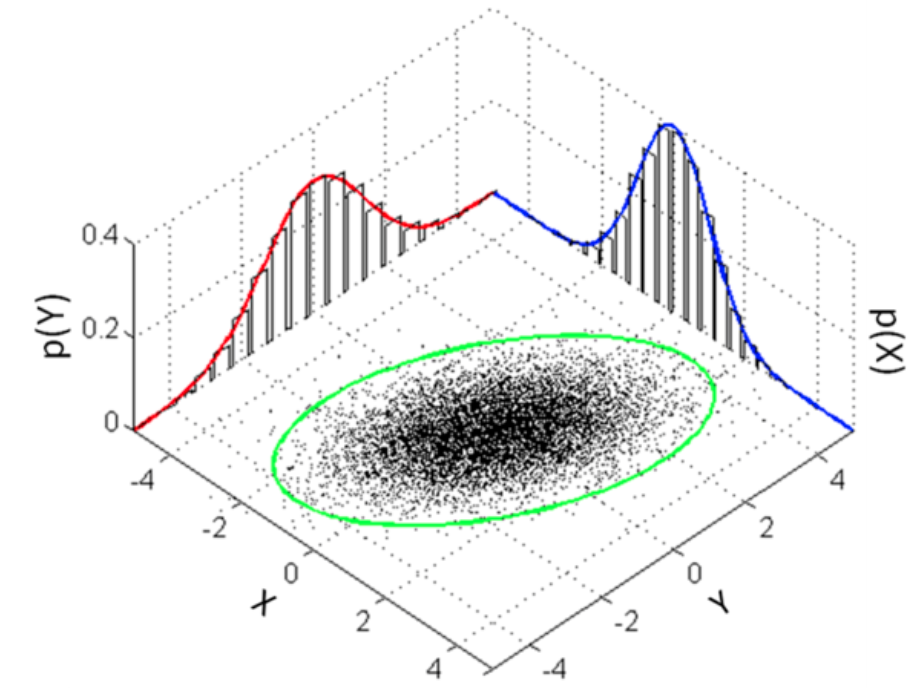

# J


## Jackknife Sampling Method

 A large number of samples are obtained by removing one data point at a time from the original dataset, and the model is trained and tested on these samples. This method is used to estimate the sensitivity of a model's performance to individual observations in the dataset.

 See also [J], [Resampling Method]


## Jailbreaking

 Similar to [Red Teaming], but also encompass every method to bypass controls for the model's generated output.

 

 See [J], [Red Teaming]


## JAX Python Module

 A [python module] that


## Jensen Huang Person

 Founder and CEO of [NVidia]

 

 More at:

  * Wikipedia - 

 See also [J], ...


## Joblib Python Module

 A [python module] to save models in files

 Create a model and save it in a file

```python
import joblib
import ...

df = pd.read_csv('/home/Data/transformed_airbnb_NYC_2019.csv')

y = df['price']
X = df.drop(columns = ['price', 'host_id', 'neighbourhood'])
X_train, X_test, y_train, y_test = train_test_split(X,y, test_size=0.2, random_state=123)

lr_classifier = LinearRegression()
lr_classifier.fit(X_train, y_train)

joblib.dump(lr_classifier, 'airbnb_lr_classifier.joblib')
```

 Load model

```python
from flask import Flask

app = Flask(__name__)

@app.route('/predict', methods=['POST'])
def predict():
     json_ = request.json
     query_df = pd.DataFrame(json_)
     query = pd.get_dummies(query_df)

     classifier = joblib.load('airbnb_lr_classifier.joblib')
     prediction = classifier.predict(query)
     return jsonify({'prediction': list(prediction)})


if __name__ == '__main__':
     #app.run(port=8080)
     from gevent.pywsgi import WSGIServer
     web_server = WSGIServer(('', 5000), app)
     web_server.serve_forever()
     print('Success! Server available at http://127.0.0.1:5000')
```

 More at:

  * [https://joblib.readthedocs.io/en/latest/](https://joblib.readthedocs.io/en/latest/)

 See also [J], ...


## Join Distribution

 Joint distribution is based on joint probability, which can be simply defined as the probability of two events (variables) happening together. These two events are usually coined event A and event B, and can formally be written as:

```
p(A and B)
```

 Joint distribution, or joint probability distribution, shows the probability distribution for two or more random variables. Hence:

```
f(x,y) = P(X = x, Y = y)
```

 {: width="100%"}


## Joint-Embedding Predictive Architecture (JEPA)

 Our goal is to build advanced machine intelligence that can learn more like humans do, forming internal models of the world around them to learn, adapt, and forge plans efficiently in the service of completing complex tasks.

 * [Image JEPA (I-JEPA)]
 * [Video JEPA (V-JEPA)]


 More at:

  * [https://ai.meta.com/blog/v-jepa-yann-lecun-ai-model-video-joint-embedding-predictive-architecture/](https://ai.meta.com/blog/v-jepa-yann-lecun-ai-model-video-joint-embedding-predictive-architecture/)

 See also [J], ...


## Jukebox Model

 Generative model for music built by [OpenAI]

 

 More at:

  * www - [https://openai.com/research/jukebox](https://openai.com/research/jukebox)
  * code - [https://github.com/openai/jukebox/](https://github.com/openai/jukebox/)
  * paper - [https://arxiv.org/abs/2005.00341](https://arxiv.org/abs/2005.00341)
  * samples - [https://openai.com/research/jukebox](https://openai.com/research/jukebox) 
  * articles
   * [https://venturebeat.com/ai/openais-jukebox-ai-produces-music-in-any-style-from-scratch-complete-with-lyrics/](https://venturebeat.com/ai/openais-jukebox-ai-produces-music-in-any-style-from-scratch-complete-with-lyrics/)

 See also [J], ...


## Jupyter Notebook

 See also [J], ...


## Jupyter Server

 See also [J], ...


## JupyterLab

 

 

 See also [J], [Jupyter Notebook]
