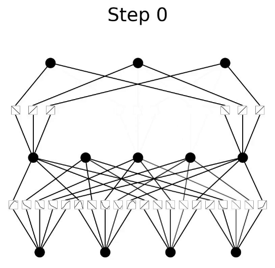

# K

## K-Fold Cross Validation

 Used in 2 cases:

  1. to evaluate a model's performance by estimating its [generalized RMSE]
    * :warning: The generalized RMSE is computed by averaging its sampled RMSE on sample batches?
  1. to compare models during  [hyperparameter optimization]
    * To obviously find the hyperparameters that leads to the best model with the best RMSE

 K-fold is not specific to the model's algorithm. But for k-fold to be interesting you need to have a lot of data, not just a little so the folds are big enough!

 The general process of k-fold cross-validation for evaluating a model’s performance is:

  * The whole dataset is randomly split into independent k-folds without replacement.
  * k-1 folds are used for the model training and one fold is used for performance evaluation.
  * This procedure is repeated k times (iterations) so that we obtain k number of performance estimates (e.g. MSE) for each iteration.
  * Then we get the mean of k number of performance estimates (e.g. MSE).

 {: width="100%"}

 Remarks:

  * The splitting process is done without replacement. So, each observation will be used for training and validation exactly once.
  * Good standard values for k in k-fold cross-validation are 5 and 10. However, the value of k depends on the size of the dataset. For small datasets, we can use higher values for k. However, larger values of k will also increase the runtime of the cross-validation algorithm and the computational cost.
  * When k=5, 20% of the test set is held back each time. When k=10, 10% of the test set is held back each time and so on…
  * A special case of k-fold cross-validation is the [Leave-one-out cross-validation (LOOCV)][LOOCV] method in which we set k=n (number of observations in the dataset). Only one training sample is used for testing during each iteration. This method is very useful when working with very small datasets.

 Using k-fold cross-validation for hyperparameter tuning

 Using k-fold cross-validation in combination with [grid search] is a very useful strategy to improve the performance of a machine learning model by tuning the model hyperparameters.

 In grid search, we can set values for multiple hyperparameters. Let’s say we have two hyperparameters each having three different values. So, we have 9 (3 x 3) different combinations of hyperparameter values. The space in which all those combinations contain is called the hyperparameter space. When there are two hyperparameters, space is two dimensional.

 In grid search, the algorithm takes one combination of hyperparameter values at a time from the hyperparameter space that we have specified. Then it trains the model using those hyperparameter values and evaluates it through k-fold cross-validation. It stores the performance estimate (e.g. MSE). Then the algorithm takes another combination of hyperparameter values and does the same. After taking all the combinations, the algorithm stores all the performance estimates. Out of those estimates, it selects the best one. The combination of hyperparameter values that yields the best performance estimate is the optimal combination of hyperparameter values. The best model includes those hyperparameter values.

 {: width="100%"}

 The reason behind fitting the best model to the whole training set after k-fold cross-validation is to provide more training samples to the learning algorithm of the best model. This usually results in a more accurate and robust model.

 More at:

  * [https://towardsdatascience.com/k-fold-cross-validation-explained-in-plain-english-659e33c0bc0](https://towardsdatascience.com/k-fold-cross-validation-explained-in-plain-english-659e33c0bc0)
  * [https://medium.com/dataseries/k-fold-cross-validation-with-pytorch-and-sklearn-d094aa00105f](https://medium.com/dataseries/k-fold-cross-validation-with-pytorch-and-sklearn-d094aa00105f)
  * [https://machinelearningmastery.com/k-fold-cross-validation/](https://machinelearningmastery.com/k-fold-cross-validation/)

 See also [K], ...


## K-Means Clustering Algorithm

 Recurrence algorithm. Give a number of clusters (eg 3), then you try to group your samples to the 3 clusters. A cluster is defined by its cluster centre. For each sample , measure the distance to the centre-1, centre-2, centre-3 if 3 clusters. The point/sample belongs to the cluster whose centre is the closest. then move the centre to the place where those that belongs to the cluster error is minimum (i.e. move the centre of the cluster to a new location). Then recur with the new position for the cluster centres. At some point, the cluster centres will not move and the recurrence will therefore stop.

 When using K-Means algorithm, how to find the number of clusters? Do this iteratively (2, 3, ...) and for each scenario plot the sum of the squared error. Then look at the elbow, where the squared error drops significantly. Where that happens, you have found the number of clusters. Increasing the number of clusters beyond that number only has a marginal effect.

 

 

 See also [K], [K-Means Clustering Failure]


## K-Means Clustering Failure

 There are scenarios in which the k-means clustering algorithm fails. Here the 2 groups of samples are not correctly identified. In that particular case, k-mean does not work correctly.

 {: width="100%"}

 A possible solution is the [DBSCAN algorithm].

 See also [K], ...


## K-Nearest Neighbors (KNN) Algorithm

 KNN can be used for both [classification] and regression predictive problems. However, it is more widely used in classification problems in the industry. It is commonly used for its easy of interpretation and low calculation time. In the example below, K=3 and given that the 3 nearest neighbors are in the same class, we are fairly confident, the new [sample] is in the same class.

 {: width="100%"}

 
 

 More at:

  * [https://www.analyticsvidhya.com/blog/2018/03/introduction-k-neighbours-algorithm-clustering/](https://www.analyticsvidhya.com/blog/2018/03/introduction-k-neighbours-algorithm-clustering/)
  * KNN in similarity search - [https://medium.com/towards-data-science/similarity-search-knn-inverted-file-index-7cab80cc0e79](https://medium.com/towards-data-science/similarity-search-knn-inverted-file-index-7cab80cc0e79)

 See also [K], [Model Evaluation], [Semisupervised Learning], [Similarity Metric]


## Kaggle Company

 Kaggle is a data science competition platform and online community of data scientists and machine learning practitioners under Google LLC. Kaggle enables users to find and publish datasets, explore and build models in a web-based data science environment, work with other data scientists and machine learning engineers, and enter competitions to solve data science challenges.

 Kaggle was founded by Anthony Goldbloom and Ben Hamner in 2010 with Nicholas Gruen as the founding chair. Equity was raised in 2011 valuing the company at $25.2 million. On 8 March 2017, Google announced it was acquiring Kaggle.

 More at:

  * site - [https://www.kaggle.com/](https://www.kaggle.com/)
  * wikipedia - [https://en.wikipedia.org/wiki/Kaggle](https://en.wikipedia.org/wiki/Kaggle)
  * courses - [https://www.kaggle.com/learn](https://www.kaggle.com/learn)

 See also [K], ...


## Kaggle Competition

 Getting started:

  * [https://www.kaggle.com/competitions?hostSegmentIdFilter=5](https://www.kaggle.com/competitions?hostSegmentIdFilter=5)
  * Supervised
    * Titanic - [https://www.kaggle.com/competitions/titanic](https://www.kaggle.com/competitions/titanic)
    * Spaceship Titanic - [https://www.kaggle.com/competitions/spaceship-titanic](https://www.kaggle.com/competitions/spaceship-titanic)
      * [https://www.kaggle.com/code/beezus666/titanic-space-total-overkill](https://www.kaggle.com/code/beezus666/titanic-space-total-overkill)
  * Reinforcement Learning
    * ConnectX - [https://www.kaggle.com/competitions/connectx](https://www.kaggle.com/competitions/connectx)

 For advanced:

  * ...

 

 See also [K], ...


## KaggleX Project

 Kaggle is excited to announce the launch of our Cohort 3 of the KaggleX BIPOC Mentorship Program (formerly known as the BIPOC Grant Program). The goal of this program is to increase representation, create career opportunities, and develop individual growth for BIPOC (Black, Indigenous, People of Color) people in the data science industry. This will be achieved through pairing early-career Kagglers with advanced and senior-level mentors, curating a space for career-related discussion and learning opportunities.

 More at:

  * application - [https://www.kaggle.com/kagglex](https://www.kaggle.com/kagglex)
  * Mentor portal - [https://www.kagglex.org/](https://www.kagglex.org/)
  * Mentors
    * [https://www.kaggle.com/omarvivas/competitions](https://www.kaggle.com/omarvivas/competitions)
  * 2021 showcase
    * [https://www.kaggle.com/bipoc2021-project-showcase](https://www.kaggle.com/bipoc2021-project-showcase)
  * Video - [https://www.youtube.com/playlist?list=PLqFaTIg4myu9eghQKv8nFXTUaDbwnpaKi](https://www.youtube.com/playlist?list=PLqFaTIg4myu9eghQKv8nFXTUaDbwnpaKi)

 See also [K], ...


## Kai-Fu Lee Person

 Founder of [01 AI] and behind the [Yi Models]

 More at:

  * wikipedia - [https://en.wikipedia.org/wiki/Kai-Fu_Lee](https://en.wikipedia.org/wiki/Kai-Fu_Lee)

 See also [K], [People]


## Katib

 ~ [AutoML] tool in [Kubeflow] for [hyperparameter tuning], [early stopping], learning rate, [neural architecture search], etc.

 More at:

  * code - [https://github.com/kubeflow/katib](https://github.com/kubeflow/katib)

 See also [K], [MLOps]


## Keras

 A python module ...

 See also [K], ...


## Kernel Trick

 Used in [support vector machine] for a clear separation of classes.

 Ex: separate the green points from the red points with a line/plane. 

  * We can separate the points with a 3rd dimension (z = xy). 
  * We can separate the points with the hyperbola xy = 1 !

 {: width="100%"}
 {: width="100%"}

 More at:

  * [https://medium.com/analytics-vidhya/introduction-to-svm-and-kernel-trick-part-1-theory-d990e2872ace](https://medium.com/analytics-vidhya/introduction-to-svm-and-kernel-trick-part-1-theory-d990e2872ace)
  * video - [https://www.youtube.com/watch?v=IpGxLWOIZy4](https://www.youtube.com/watch?v=IpGxLWOIZy4)

 See also [K], ...


## Knowledge

```
 Data < Information and signals < Knowledge < Wisdom
```

 There are different types of knowledge:

  * [Parametric knowledge] - knowledge stored in the [parameters] of the model
  * [Source knowledge] - vector database + augmented context
  * ...

 See also [K], [Data], [Information]


## Knowledge Corpus

 Queried right after LLM prompt by a [Neural Retriever] for the purpose of [Knowledge Retrieval]

 See also [K], ...


## Knowledge Distillation

 Knowledge distillation is a machine learning technique where a small “student” model is trained to emulate the behavior of a larger, more complex “teacher” model. The training process effectively transfers knowledge from the teacher to the student model, creating a more compact yet capable model.

 In the realm of LLMs, knowledge distillation techniques fall into two main categories:

  * [standard knowledge distillation]
  * [emergent ability distillation]

 More at:
  * [https://bdtechtalks.com/2023/09/18/what-is-llm-compression/](https://bdtechtalks.com/2023/09/18/what-is-llm-compression/)

 See also [K], ...


## Knowledge Graph (KG)

 A knowledge graph is a directed labeled graph in which we have associated domain specific meanings with nodes and edges. Anything can act as a node, for example, people, company, computer, etc. An edge label captures the relationship of interest between the nodes, for example, a friendship relationship between two people, a customer relationship between a company and person, or a network connection between two computers, etc. The directed labeled graph representation is used in a variety of ways depending on the needs of an application. A directed labeled graph such as the one in which the nodes are people, and the edges capture the parent relationship is also known as a data graph. A directed labeled graph in which the nodes are classes of objects (e.g., Book, Textbook, etc.), and the edges capture the subclass relationship, is also known as a taxonomy. In some data models, given a triple (A,B,C), we refer to A, B, C as the subject, the predicate, and the object of the triple respectively. A knowledge graph serves as a data structure in which an application stores information. The information could be added to the knowledge graph through a combination of human input, automated and semi-automated methods. Regardless of the method of knowledge entry, it is expected that the recorded information can be easily understood and verified by humans. Many interesting computations over a graph can be reduced to navigating it. For example, in a friendship KG, to calculate the friends of friends of a person A, we can navigate the graph from A to all nodes B connected to it by a relation labeled as friend, and then recursively to all nodes C connected by the friend relation to each B.

 Examples of KGs:

  * [Wikidata]
  * ...

 

 More at:

  * notebooks
    * [https://github.com/togethercomputer/together-cookbook/blob/main/Knowledge_Graphs_with_Structured_Outputs.ipynb](https://github.com/togethercomputer/together-cookbook/blob/main/Knowledge_Graphs_with_Structured_Outputs.ipynb)
  * articles
    * [https://ai.stanford.edu/blog/introduction-to-knowledge-graphs/](https://ai.stanford.edu/blog/introduction-to-knowledge-graphs/)

 See also [K], [Graph Neural Network]


## Knowledge Representation

 To store what a computer knows or hears!

 See also [K], ...


## Knowledge Retrieval

 A solution to the [hallucinations][Hallucination] of [Large Language Model] ?

 Possible thanks to a [Information Retriever] that fronts the model

  * ...
  * [Neural Retriever]

 More at:

  * [https://venturebeat.com/ai/whats-next-in-large-language-model-llm-research-heres-whats-coming-down-the-ml-pike/](https://venturebeat.com/ai/whats-next-in-large-language-model-llm-research-heres-whats-coming-down-the-ml-pike/)

 See also [K], ...


## Kolmogorov-Arnold Network (KAN)

 Kolmogorov-Arnold Networks (KANs) are a new type of neural network (NN) which focus on the [Kolmogorov-Arnold representation theorem] instead of the typical universal approximation theorem found in NNs. Simply, NNs have static activation function on their nodes. But KANs have learnable activation functions on their edges between nodes.

 {: width="100%"}

 {: width="100%"}

 

 More at:

  * [https://daniel-bethell.co.uk/posts/kan/](https://daniel-bethell.co.uk/posts/kan/)
  * code - [https://github.com/team-daniel/KAN](https://github.com/team-daniel/KAN)

 See also [K], [B-Spline]


## Kolmogorov-Arnold Representation (KAR) Theorem

 According to this theorem, any multivariate function f() can be expressed as a finite composition of continuous functions of a single variable, combined with the binary operation of addition. But let’s step away from the math for a moment. What does this really mean if you’re not a mathematician?

 Let’s imagine I asked you to make me some Baklava, a dessert with multiple ingredients and steps. At first glance, making Baklava might seem complex. However, the Kolmogorov-Arnold representation theorem suggests that any complex ‘recipe’ can be simplified into basic, one-ingredient recipes that are then combined in specific ways. Below is a visual breakdown of this process:

 {: width="100%"}

 This image shows how the complex process of making Baklava can be broken down into simpler tasks like ‘chop the nuts’ or ’layer the pastry’. Each of these tasks handles one aspect of the recipe, akin to handling one variable at a time in a mathematical function. Bringing this back to the math, the theorem can be expressed as follows:

```
  ...
```

 More at:

  * [https://daniel-bethell.co.uk/posts/kan/](https://daniel-bethell.co.uk/posts/kan/)

 See also [K], ...


## Kubeflow

 Can use:

  * Argo
  * Tekton
  * [MLFlow] - a scientific notebook

 

 

 See also [K], ...


## Kullback-Leibler Distance

 See [Kullback-Leibler Divergence]


## Kullback-Leibler (KL) Divergence

 ~ measure the difference between 2 distributions. The smaller the KL Divergence, the better the fit.

 Great to find the best distribution to simulate observations

```
 Cross-entropy = entropy + KL-divergence
```

 calculates a score that measures the divergence of one probability distribution from another. The Kullback–Leibler divergence (KL divergence), aka relative entropy, is the difference between cross-entropy of two distributions and their own entropy. For everyone else, imagine drawing out the two distributions, and wherever they do not overlap will be an area proportional to the KL divergence. Appears in the loss function of a variational autoencoder! This term stay close to normal(mean=0,stdev=1) !!

 Distributions:

  * [Beta Distribution]
  * [Normal Distribution]
  * ...

 

 

 

 More at:

  * [https://www.youtube.com/watch?v=rZufA635dq4&t=1091s](https://www.youtube.com/watch?v=rZufA635dq4&t=1091s)
  * [https://machinelearningmastery.com/divergence-between-probability-distributions/](https://machinelearningmastery.com/divergence-between-probability-distributions/)

 See also [K], [Cross-Entropy Loss Function], [Disentangled Variational Autoencoder], [Entropy], [Variational Autoencoder]


## Kumo AI Company

 An AI [Company] that is developing [Pytorch Geometric]

 More at:

  * [https://kumo.ai/](https://kumo.ai/)

 See also [K], ...
