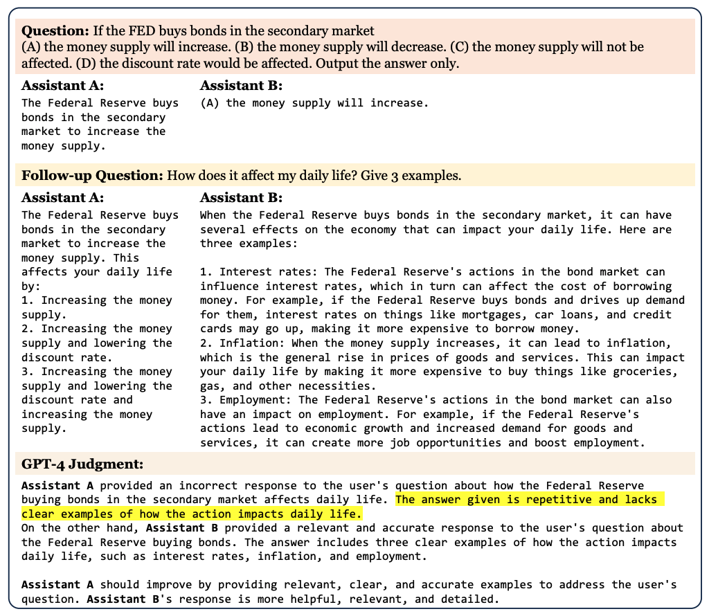
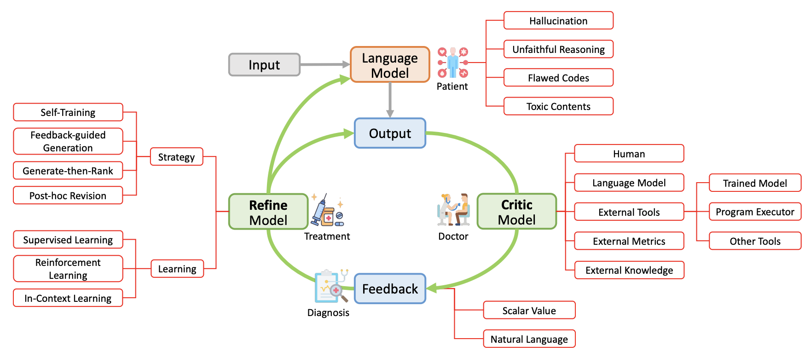

# L

## L1 Regularization

 A type of [regularization] that penalizes [weights] in proportion to the sum of the absolute value of the weights. L1 regularization helps drive the weights of irrelevant or barely relevant [features] to exactly 0. A [feature] with a weight of 0 is effectively removed from the model.

 Contrast with [L2 regularization].

 See also [L], ...


## L2 Loss

 See also [L], ...


## L2 Regularization

 A type of [regularization] that penalizes weights in proportion to the sum of the squares of the [weights]. L2 regularization helps drive [outlier] weights (those with high positive or low negative values) closer to 0 but not quite to 0. Features with values very close to 0 remain in the model but don't influence the model's [prediction] very much.

 L2 regularization always improves generalization in linear models.

 Contrast with [L1 regularization].

 See also [L], ...


## Label

 ~ think of your label as your model teacher!

 ~ the final prediction or decision the AI system makes

 Name of a prediction in a supervised models. Correspond to a target attribute in unsupervised learning. Example of label: the agent-skill needed to result the customer's call.

 In [supervised machine learning], the "answer" or "result" portion of an [example].

 Each labeled example consists of one or more [features] and a label. For instance, in a spam detection dataset, the label would probably be either "spam" or "not spam." In a rainfall dataset, the label might be the amount of rain that fell during a certain period.

 See also [L], [Data Point], [Labeling Function], [Supervised Learning], [Target Attribute]


## Labeling Function

 Use one or more function to label a sample. If you have more than one labeling function, use the majority rule, i.e. label the sample with the sample that has the maximum probability. :warning: A label is an enum, not a probability. Used by snorkel.

 See also [L], [Label], [Snorkel Program]


## Labeling Service

 Mechanical turk, crowd flower, instaML LOOP. Do you have the proper label? Have several people label the same image/entry and used the Dawid-Skene or majority vote algorithm!

 See also [L], [Dawid-Skene Algorithm], [Majority Vote Algorithm], [Unlabelled Data Algorithm]


## Labor Market Impact

 We investigate the potential implications of [large language models (LLMs)][LLM], such as [Generative Pre-trained Transformers (GPTs)][GPT Model], on the U.S. labor market, focusing on the increased capabilities arising from LLM-powered software compared to LLMs on their own. Using a new rubric, we assess occupations based on their alignment with LLM capabilities, integrating both human expertise and GPT-4 classifications. 

 **Our findings reveal that around 80% of the U.S. workforce could have at least 10% of their work tasks affected by the introduction of LLMs, while approximately 19% of workers may see at least 50% of their tasks impacted**.

 We do not make predictions about the development or adoption timeline of such LLMs. The projected effects span all wage levels, with higher-income jobs potentially facing greater exposure to LLM capabilities and LLM-powered software. Significantly, these impacts are not restricted to industries with higher recent productivity growth. Our analysis suggests that, with access to an LLM, about 15% of all worker tasks in the US could be completed significantly faster at the same level of quality. When incorporating software and tooling built on top of LLMs, this share increases to between 47 and 56% of all tasks. This finding implies that LLM-powered software will have a substantial effect on scaling the economic impacts of the underlying models. We conclude that LLMs such as GPTs exhibit traits of general-purpose technologies, indicating that they could have considerable economic, social, and policy implications.

 

 

 More at:

  * 2024/03/04 - GenAI and NYC - [https://www.mckinsey.com/industries/public-sector/our-insights/generative-ai-and-the-future-of-new-york](https://www.mckinsey.com/industries/public-sector/our-insights/generative-ai-and-the-future-of-new-york)
  * 2023/09/05 - [https://www.cnn.com/2023/09/05/opinions/artificial-intelligence-jobs-labor-market](https://www.cnn.com/2023/09/05/opinions/artificial-intelligence-jobs-labor-market)
  * 2023/07/26 - GenAI and future of work - [https://www.mckinsey.com/mgi/our-research/generative-ai-and-the-future-of-work-in-america](https://www.mckinsey.com/mgi/our-research/generative-ai-and-the-future-of-work-in-america)
  * 2023/06/21 - productivity frontier - [https://www.mckinsey.com/featured-insights/mckinsey-live/webinars/the-economic-potential-of-generative-ai-the-next-productivity-frontier](https://www.mckinsey.com/featured-insights/mckinsey-live/webinars/the-economic-potential-of-generative-ai-the-next-productivity-frontier)
  * 2023/03/17 - Early look at impact - [https://openai.com/research/gpts-are-gpts](https://openai.com/research/gpts-are-gpts)

 See also [L], ...


## LangChain Expression Language (LCEL)

 How chains are built in [LangChain]. DEsigned to build sequence of calls (to LLMs or any other component)

 LCEL is a declarative way to compose chains of components. What does that mean? Means its an easy way to put useful building blocks together. Here's quick summary of the LangChain Expression Language (LCEL) page: - LCEL Basics: Simplifies building complex chains from basic components using a unified interface and composition primitives. - Unified Interface: Every LCEL object implements the Runnable interface, supporting common invocation methods like invoke, batch, stream, ainvoke, and more. - Composition Primitives: LCEL provides tools for composing chains, parallelizing components, adding fallbacks, and dynamically configuring internal chain elements. - Model Flexibility: LCEL allows for easy switching between different models and providers (like OpenAI or Anthropic), and runtime configurability of chat models or LLMs. - Advanced Features: LCEL features things like logging intermediate results with LangSmith integration and adding fallback logic for enhanced reliability.

```
chain = prompt | model | output_parser

stream = stream back chuncks of the response
invoke = call the chain on an input
batch = call the chain on a list of inputs

runnable_protocol = standard interface to facilitate defining custom chains
input_schema = description of the inputs accepted by a Runnable
output_schema = description of the output produced by a Runnable
```

 More at:

  * [https://python.langchain.com/docs/expression_language/](https://python.langchain.com/docs/expression_language/)

 See also [L], ...


## LangChain Hub

 Taking inspiration from Hugging Face Hub, LangChainHub is collection of all artifacts useful for working with LangChain primitives such as prompts, chains and agents. The goal of this repository is to be a central resource for sharing and discovering high quality prompts, chains and agents that combine together to form complex LLM applications.

```python
from langchain import hub
obj = hub.pull("homanp/superagent")
```

 More at;

  * site - [https://smith.langchain.com/hub](https://smith.langchain.com/hub)
  * alternatives
    * [https://docs.pezzo.ai/features/langchain](https://docs.pezzo.ai/features/langchain)

 See also [L], ...


## LangChain Python Module

 ~ an alternative to [Llamaindex]

 LangChain is a framework for developing applications powered by language models. We believe that the most powerful and differentiated applications will not only call out to a language model via an API, but will also:

  * Be data-aware: connect a language model to other sources of data
  * Be agentic: allow a language model to interact with its environment

 The LangChain framework is designed with the above principles in mind.

```python
# Proprietary LLM from e.g. OpenAI
# pip install openai
from langchain.llms import OpenAI
llm = OpenAI(model_name="text-davinci-003")

# Alternatively, open-source LLM hosted on Hugging Face
# pip install huggingface_hub
from langchain import HuggingFaceHub
llm = HuggingFaceHub(repo_id = "google/flan-t5-xl")

# The LLM takes a prompt as an input and outputs a completion
prompt = "Alice has a parrot. What animal is Alice's pet?"
completion = llm(prompt)
```

 {: width="100%"}

 {: width="100%"}

 

 More at:

  * announcement - [https://www.pinecone.io/learn/langchain-intro/](https://www.pinecone.io/learn/langchain-intro/)
  * docs - [https://python.langchain.com/en/latest/index.html](https://python.langchain.com/en/latest/index.html)
  * JS docs - [https://js.langchain.com/docs/](https://js.langchain.com/docs/)
  * tutorials
   * book - [https://www.pinecone.io/learn/langchain/](https://www.pinecone.io/learn/langchain/)
   * tuts - [https://www.pinecone.io/learn/series/langchain/](https://www.pinecone.io/learn/series/langchain/)
   * notebooks - [https://github.com/pinecone-io/examples/tree/master/generation/langchain/handbook](https://github.com/pinecone-io/examples/tree/master/generation/langchain/handbook)
  * articles
   * [https://towardsdatascience.com/getting-started-with-langchain-a-beginners-guide-to-building-llm-powered-applications-95fc8898732c](https://towardsdatascience.com/getting-started-with-langchain-a-beginners-guide-to-building-llm-powered-applications-95fc8898732c)
  * colabs
   * intro - [https://colab.research.google.com/github/pinecone-io/examples/blob/master/generation/langchain/handbook/00-langchain-intro.ipynb](https://colab.research.google.com/github/pinecone-io/examples/blob/master/generation/langchain/handbook/00-langchain-intro.ipynb)

 See also [L], [LangFlow Python Module], [Vector Database]


## LangFlow Python Module

 ~ used to build no-code LangChain applications

 LangFlow is an easy way to prototype [LangChain] flows. The drag-and-drop feature allows quick and effortless experimentation, while the built-in chat interface facilitates real-time interaction. It provides options to edit prompt parameters, create chains and agents, track thought processes, and export flows.

 

 

 Alternatives

  * Flowise - JS based

 More at:

  * docs - [https://docs.langflow.org/](https://docs.langflow.org/)
  * huggin face space - [https://huggingface.co/spaces/Logspace/Langflow](https://huggingface.co/spaces/Logspace/Langflow)

 See also [L], ...


## LangGraph Python Module

 A state machine way to run agent with [LangChain]

 To build custom agents and more than just simple chains

  * state graph
  * nodes = chains or runnables/tools
  * edges = wire everything together
    * conditional edges = [LLM] decides which node to go to next (tools)
  * compile the graph so you can then run the graph!
  * <!> With memory, you can restart a graph from a particular state (instead of from the start)

```
 Invoke = Get the response from the LLM all at once
  * You cn also invoke a graph!!! where you pass parameters to a GraphState

 Stream = Get the response from the LLM in a streaming fashion (display or process as you receive characters)
  * 2 modes = value and updates
    * value = full list every time
    * update = only get the updates

 GraphState = Key value store
  * an object with attributes in python

 Node = Take a GraphState as input
  * Implemented as a python function
  * An execution in python
  * Get inputs from the state
  * Write outputs to the state or exteranl call (simple print)
  * can update the state (unlike edges)
  * Examples:
    * Generate a response node
    * Use external tools such as accesssing an external database
    * Hallucination checker

 Edge =
  * can be passed a state (which is immutable at the edge level?)

 GraphBuilder = The object used to build the execution graph
  * Add node
  * add edge (start and end node + link added nodes)
  * add conditional edge (if true, do that , otherwise does this other thing)
  * Not sure you can add nodes to existing graphs

 BinaryScore = output "yes" or "no" equivalent for branching conditions?

 Structured Output = formatted output

 Schema Override = reformat the output coming from the LangChain library or LLM (include input, output, document, number of iteration, etc)

 Human in the loop garantee <-- a person must sign-off on an given action before execution

 Parallelisation = parallel execution

 CustomState reducer = provide a function on how to update a state (maybe by adding the new value to a list instead of overriding a parameter's value)
  * Used to handle state updates
  * Frequently used in parallelization

 Agent vs Subagent = Top agent is router and subagent is responsible for execution and report to top agent at the end

 Graph Execution Pause = when a node fails

 Memory = used for multi-turn conversation (entire set of messages instead of just the last one)
  * Can be done in in-memory, or externally with SQLite PostgreSQL, and other connectors to other databases

 Thread = how we separate users who are using the same application
  * are identified with a Thread ID
  * Used to find the proper memory in the memory store
  * Id thread ID does not exist, Cstart with a new

 Long Term memory store = what is learned from the user and is available in every threads
  * Used to profile users
```

 

 More at:

  * docs - [https://python.langchain.com/docs/langgraph](https://python.langchain.com/docs/langgraph)
  * tutorials - [https://academy.langchain.com/courses/take/intro-to-langgraph/lessons/58238107-course-overview](https://academy.langchain.com/courses/take/intro-to-langgraph/lessons/58238107-course-overview)
  * articles
    * CRAG - [https://www.datacamp.com/tutorial/corrective-rag-crag](https://www.datacamp.com/tutorial/corrective-rag-crag)

 See also [L], ...


## LangGraph Studio

 A visual debugger for [LangGraph] ==> nicer UI to [LangSmith]

 See also [L], ...


## LangServe Python Module

 For one-click deployments of LangChain applications

 See also [L], ...


## LangSmith Python Module

 Observability stack from LangChain 

 3 areas:

  * Tracing (input, state, retrieved documents, latency, final output) + tokens per LLM call + request costs
  * Prompt Engineering
  * ...

 {: width="100%"}

 See also [L], ...


## Language AI

 See [Natural Language Processing]


## Language Model

 See [Language Modeling]


## Language Model for Discussion Applications (LaMDA) Model 

 Built by [Google]

 Beware, cannot use GPU for inference. ??? <== ????

 

 

 More at:

  * blog - [https://blog.google/technology/ai/lamda/](https://blog.google/technology/ai/lamda/)

 See also [L], ...


## Language Modeling

 Language modeling is the task of assigning a probability to a sequence of words in a text in a specific language. Simple language models can look at a word and predict the next word (or words) most likely to follow it, based on statistical analysis of existing text sequences. To create a language model that successfully predicts word sequences, you need to train it on large sets of data. Language models are a key component in natural language processing applications. You can think of them as statistical prediction machines, where you give text as input and get a prediction as the output. You’re probably familiar with this from the auto-complete feature on your smartphone. For instance, if you type “good,” auto-complete might suggest “morning” or “luck.”

 See also [L], [Language Model], [Large Language Model], [Natural Language Processing], [Small Language Model]


## Language Parsing

 ~ figuring out which group of words go together (as “phrases”) and which words are the subject or object of a verb. The NLP parser separates a series of text into smaller pieces based on the grammar rules. If a sentence that cannot be parsed may have grammatical errors.

 See also [L], [Benchmark]


## Language Processing Unit (LPU)

 Developed by the founder of [Groq] to accelerate the token output of [LLM]

 Remember that game of Go in 2016 when [AlphaGo] played against the world champion Lee Sedol and won? Well, about a month before the competition, there was a test game which AlphaGo lost. The researchers from [DeepMind] ported AlphaGo to [Tensor Processing Unit (TPU)][TPU] and then the computer program was able to win by a wide margin.

 The realization that computational power was a bottleneck for AI's potential led to the inception of Groq and the creation of the LPU. This realization came to Jonathan Ross who initially began what became TPU project in [Google]. He started Groq in 2016.

 The LPU is a special kind of computer brain designed to handle language tasks very quickly. Unlike other computer chips that do many things at once (parallel processing), the LPU works on tasks one after the other (sequential processing), which is perfect for understanding and generating language. Imagine it like a relay race where each runner (chip) passes the baton (data) to the next, making everything run super fast. The LPU is designed to overcome the two LLM bottlenecks: compute density and memory bandwidth.

 Groq took a novel approach right from the start, focusing on software and compiler development before even thinking about the hardware. They made sure the software could guide how the chips talk to each other, ensuring they work together seamlessly like a team in a factory. This makes the LPU really good at processing language efficiently and at high speed, ideal for AI tasks that involve understanding or creating text.

 This led to a highly optimized system that not only runs circles around traditional setups in terms of speed but does so with greater cost efficiency and lower energy consumption. This is big news for industries like finance, government, and tech, where quick and accurate data processing is key.

 Now, don't go tossing out your [GPUs] just yet! While the LPU is a beast when it comes to inference, making light work of applying trained models to new data, GPUs still reign supreme in the training arena. The LPU and GPU might become the dynamic duo of AI hardware, each excelling in their respective roles.

 To better understand architecture, Groq offers two papers: from 2020 (Think Fast: A Tensor Streaming Processor (TSP) for Accelerating Deep Learning Workloads) and 2022 (A So ware-defined Tensor Streaming Multiprocessor for Large-scale Machine Learning). The term “LPU” must be a recent addition to Groq’s narrative, since it’s never mentioned in the papers.

 More at:

  * [https://wow.groq.com/groq-isca-paper-2020/](https://wow.groq.com/groq-isca-paper-2020/)
  * [https://wow.groq.com/isca-2022-paper/](https://wow.groq.com/isca-2022-paper/)

 See also [L], ...


## Large Language and Vision Assistant (LLaVa) Model

 An extension to the [LLaMA Model] to allow it to be multimodal or see.

 Lava is a recently released multimodal model called Large Language and Vision Assistant. It can run multimodal tasks across both image and text inputs. Lava has shown promising performance in understanding and reasoning about images, generating HTML websites from wireframe sketches, and generating stories based on complex images. Its ability to process both visual and textual information sets it apart from traditional language models.

 

 More at:

  * demo - [https://llava.hliu.cc/](https://llava.hliu.cc/)
  * code - [https://github.com/haotian-liu/LLaVA](https://github.com/haotian-liu/LLaVA)
  * project site - [https://llava-vl.github.io/](https://llava-vl.github.io/)

 See also [L], ...

 
## Large Language Model (LLM)

 Large Language Models are [Language Model] with not millions, but billions of parameters/weights. The term "large" in LLM refers to the fact that these models are designed to handle large amounts of data, both in terms of the size of the text corpus used to train them and in terms of the amount of text they can generate or process at once.

 In 2023, aftr the release of [ChatGPT], LLMs started having a huge [impact on the labor force][Labor Market Impact]

 These models typically utilize deep learning techniques and are trained on massive amounts of text data, such as books, articles, and web pages, in order to learn the patterns and structure of language.

 Examples of Large Language Models include
  * [GPT-3], [GPT-2]
  * [BERT]
  * and [T5], among others.

 These models have been used for a variety of tasks, such as [language translation][Machine Translation], text generation, [question answering], and [sentiment analysis], and have demonstrated impressive performance on many [benchmarks] in [natural language understanding] and generation.

 {: width="100%"}

 

 

 More at:

  * paper - [https://arxiv.org/abs/2303.18223](https://arxiv.org/abs/2303.18223)

 See also [L], [Language Modeling], [Model Compression], [Model Context Protocol], [Neural Scaling Law], [Steerability]


## LLM As A Judge

 Use a language model to compare 2 other [LLMs]. This approach is used in the [MT-Bench] to model human preference.

 {: width="100%"}

 More at:

  * code - [https://github.com/lm-sys/FastChat/tree/main/fastchat/llm_judge](https://github.com/lm-sys/FastChat/tree/main/fastchat/llm_judge)
  * articles
    * [https://www.galileo.ai/blog/best-practices-for-creating-your-llm-as-a-judge](https://www.galileo.ai/blog/best-practices-for-creating-your-llm-as-a-judge)
    * [https://www.galileo.ai/blog/tricks-to-improve-llm-as-a-judge](https://www.galileo.ai/blog/tricks-to-improve-llm-as-a-judge)

 See also [L], ...


## Large Language Model Meta AI (LLaMA) Model Family

 Using the scaling method described in [Chinchilla][Chinchilla Model]
 65 Billion parameters.

 

 

 More at:

  * LLaMa 2 
    * UI - [https://labs.perplexity.ai/](https://labs.perplexity.ai/)
    * download - [https://ollama.ai/](https://ollama.ai/)
  * LLaMa 1
    * announcement - [https://ai.facebook.com/blog/large-language-model-llama-meta-ai/](https://ai.facebook.com/blog/large-language-model-llama-meta-ai/)
    * paper [https://arxiv.org/abs/2302.13971](https://arxiv.org/abs/2302.13971)
    * model card - [https://github.com/facebookresearch/llama/blob/main/MODEL_CARD.md](https://github.com/facebookresearch/llama/blob/main/MODEL_CARD.md)
    * model leak - [https://www.vice.com/en/article/xgwqgw/facebooks-powerful-large-language-model-leaks-online-4chan-llama](https://www.vice.com/en/article/xgwqgw/facebooks-powerful-large-language-model-leaks-online-4chan-llama)
    * wikipedia - [https://en.wikipedia.org/wiki/LLaMA](https://en.wikipedia.org/wiki/LLaMA)

 See also [L], ...


## LLM Operating System (LLM OS)

 More at:

  * articles
    * [https://medium.com/@ronaldmannak/goodbye-windows-hello-llms-the-future-of-operating-systems-7ba61ea03e8d](https://medium.com/@ronaldmannak/goodbye-windows-hello-llms-the-future-of-operating-systems-7ba61ea03e8d)

 See also [L], [MemGPT Model]


## LLMGraphTransformer Model

 ~ Utility used to turn documents into a graph by using an [LLM] for [Name-Entity Recognition] and relationship extraction

 More at:

  * docs - [https://python.langchain.com/v0.2/api_reference/experimental/graph_transformers/langchain_experimental.graph_transformers.llm.LLMGraphTransformer.html](https://python.langchain.com/v0.2/api_reference/experimental/graph_transformers/langchain_experimental.graph_transformers.llm.LLMGraphTransformer.html)
  * articles
    * [https://towardsdatascience.com/building-knowledge-graphs-with-llm-graph-transformer-a91045c49b59](https://towardsdatascience.com/building-knowledge-graphs-with-llm-graph-transformer-a91045c49b59)
    * code - [https://colab.research.google.com/github/tomasonjo/blogs/blob/master/llm/llm_graph_transformer_in_depth.ipynb](https://colab.research.google.com/github/tomasonjo/blogs/blob/master/llm/llm_graph_transformer_in_depth.ipynb)

 See also [T], [GraphRAG System]


## LLM Operations (LLMOps)

  * where you validate improvements over baseline

 See also [L], ...


## LLM Performance (LLMPerf) Benchmark

 Utilizing the LLMPerf, we have benchmarked a selection of LLM inference providers. Our analysis focuses on evaluating their performance, reliability, and efficiency under the following key metrics:

  * Output tokens throughput, which represents the average number of output tokens returned per second. This metric is important for applications that require high throughput, such as summarization and translation, and easy to compare across different models and providers.
  * Time to first token (TTFT), which represents the duration of time that LLM returns the first token. TTFT is especially important for streaming applications, such as chatbots.

 The LLMPerf Leaderboard displays results in a clear, transparent manner. Our aim is to provide users and developers with vital insights into the capabilities and limitations of each provider, informing decisions for future integrations and deployments.

```bash
   python token_benchmark_ray.py \
    --model <MODEL_NAME> \
    --mean-input-tokens 550 \
    --stddev-input-tokens 0 \
    --mean-output-tokens 150 \
    --stddev-output-tokens 0 \
    --max-num-completed-requests 150 \
    --num-concurrent-requests 5 \
    --llm-api <litellm/openai> 
```

 {: width="100%"}

 More at:

  * leaderboard - [https://github.com/ray-project/llmperf-leaderboard](https://github.com/ray-project/llmperf-leaderboard)
  * tool - [https://github.com/ray-project/llmperf](https://github.com/ray-project/llmperf)

 See also [L], ...


## LLM Pricing

 For each provider

  * For each model
    * Input cost for 1 million token
    * Output cost for 1 million token
    * [Tokenizer tax ] - Word to token ratio for submitted-input and generated-output text
    * [Prompt Tuning] - To get the desired output, the prompt needs to be wrapped with additional content ([system prompt], [few-shot prompting], and etc.)

 See also [L], ...


## LLM Self-Correction Reasoning

 {: width="100%"}

 

 More at:

  * paper - [https://arxiv.org/abs/2308.03188](https://arxiv.org/abs/2308.03188)
  * github - [https://github.com/teacherpeterpan/self-correction-llm-papers](https://github.com/teacherpeterpan/self-correction-llm-papers)
  * [https://bdtechtalks.com/2023/10/09/llm-self-correction-reasoning-failures/](https://bdtechtalks.com/2023/10/09/llm-self-correction-reasoning-failures/)

 See also [L], ....


## Large-Scale Artificial Intelligence Open Network (LAION) Dataset

 ~ datasets used to build CLIP models and [openclip]

 Open datasets released by the LAION Nonprofit organization

 * LAION-400M - 400M English (image, text) pairs (2021)
 * LAION-5B - 5,85 billion CLIP-filtered image-text pairs (2022)
 * LAION-Aesthetics - several collections of subsets from LAION 5B with high visual quality

 More at:

  * site - [https://laion.ai/](https://laion.ai/)
  * wikipedia - [https://en.wikipedia.org/wiki/LAION](https://en.wikipedia.org/wiki/LAION) 
  * articles
    * [https://venturebeat.com/ai/a-free-ai-image-dataset-removed-for-child-sex-abuse-images-has-come-under-fire-before/](https://venturebeat.com/ai/a-free-ai-image-dataset-removed-for-child-sex-abuse-images-has-come-under-fire-before/)
  * sites
    * 400M - [https://laion.ai/blog/laion-400-open-dataset/](https://laion.ai/blog/laion-400-open-dataset/)
    * 5B - [https://laion.ai/blog/laion-5b/](https://laion.ai/blog/laion-5b/)
    * aesthetics - [https://laion.ai/blog/laion-aesthetics/](https://laion.ai/blog/laion-aesthetics/)
  * papers 
    * 400M - [https://arxiv.org/abs/2111.02114](https://arxiv.org/abs/2111.02114)
    * 5B - [https://arxiv.org/abs/2210.08402](https://arxiv.org/abs/2210.08402)
  * tools
    * source - [https://github.com/LAION-AI/laion-datasets/tree/main](https://github.com/LAION-AI/laion-datasets/tree/main)
    * brosing - [https://rom1504.github.io/clip-retrieval/](https://rom1504.github.io/clip-retrieval/)

 See also [L], ...


## Lasso Regression

  ~ aka [L1 Regularization]. Instead of a [linear regression] use this regression?

 In lasso regression, weights can go to zero (not just close to 0 as in the [ridge regression]) and result in [feature selection] !

 Lasso regression is better than the [ridge regression] with models that contain a lot of useless variables.

 

 

 

 More at:

  * [https://www.geeksforgeeks.org/lasso-vs-ridge-vs-elastic-net-ml/](https://www.geeksforgeeks.org/lasso-vs-ridge-vs-elastic-net-ml/)

 See also [L], ...


## Lasso Regression Penalty

 In a [lasso regression], The term/bias added to the loss function to lower the [variance] (improve the prediction) due to the small number of samples in the training set.

 {: width="100%"}

 See also [L], ...


## Latent Diffusion Model (LDM)

 {: width="100%"}

 The overall model will look like this:

  * you will have your initial image here X, and encode it into an information-dense space called the latent space, Z. This is very similar to a GAN where you will use an encoder model to take the image and extract the most relevant information about it in a sub-space, which you can see as a downsampling task. Reducing its size while keeping as much information as possible.
  * You are now in the latent space with your condensed input. You then do the same thing with your conditioning inputs, either text, images, or anything else,
  * and merge them with your current image representation. WE condition LDMs either via concatenation or by a more general cross-attention mechanism. This attention mechanism will learn the best way to combine the input and conditioning inputs in this latent space. Adding attention, a transformer feature, to diffusion models. These merged inputs are now your initial noise for the diffusion process. Then, you have the same diffusion model I covered in my Imagen video but still in this sub-space.
  * Finally, you reconstruct the image using a decoder which you can see as the reverse step of your initial encoder. Taking this modified and de-noised input in the latent space to construct a final high-resolution image, basically upsampling your result.
 And voilà! This is how you can use diffusion models for a wide variety of tasks like super-resolution, inpainting, and even text-to-image with the recent stable diffusion open-sourced model through the conditioning process while being much more efficient and allowing you to run them on your GPUs instead of requiring hundreds of them. 

 

 

 More at:

  * [https://pub.towardsai.net/latent-diffusion-models-the-architecture-behind-stable-diffusion-434ba7d91108](https://pub.towardsai.net/latent-diffusion-models-the-architecture-behind-stable-diffusion-434ba7d91108)
  * [https://www.louisbouchard.ai/latent-diffusion-models/](https://www.louisbouchard.ai/latent-diffusion-models/)
  * [code - https://github.com/CompVis/latent-diffusion](https://github.com/CompVis/latent-diffusion)

 See also [L], [Conditioning], [Cross-Attention], [Diffusion Model], [Diffusion Process], [Image Decoder], [Image Encoder], [Latent Space], [Pixel Space], [U-Net Architecture]


## Latent Dirichlet Allocation (LDA)

 Used as a topic modeling technique that is it can classify text in a document to a particular topic. It uses Dirichlet distribution to find topics for each document model and words for each topic model. Johann Peter Gustav Lejeune Dirichlet was a German mathematician in the 1800s who contributed widely to the field of modern mathematics. There is a probability distribution named after him ‘Dirichlet Distribution’ which is the basis of Latent Dirichlet Allocation (--LDA--).

 See also [L], ...


## Latent Perturbation

 Used to find out what the latent variable are/mean in a latent variable model. :warning: The model learns by itself that those are important variables based on the provided training sample. :warning: The loss function defines what is learned and HOW it learns it! Latent perturbation is useful to see how entangled or disentangled latent variables are.

 See also [L], [Disentangled Variational Autoencoder], [Latent Variable], [Latent Variable Model]


## Latent Space

 ==A compressed/downsampled space that contains as much information as possible space==. 

 Formally, a latent space is defined as an abstract multi-dimensional space that encodes a meaningful internal representation of externally observed events. Samples that are similar in the external world are positioned close to each other in the latent space. To better understand the concept, let’s think about how humans perceive the world. We are able to understand a broad range of topics by encoding each observed event in a compressed representation in our brain. For example, we don’t keep in mind every detail of the appearance of a dog to be able to recognize a dog in the street. As we can see in the illustration below, we keep an internal representation of the general appearance of a dog:

 {: width="100%"}

 In a similar way, the latent space tries to provide a compressed understanding of the world to a computer through a spatial representation.
 Deep learning has revolutionized many aspects of our life with applications ranging from self-driving cars to predicting serious diseases. Its main goal is to transform the raw data (such as the pixel values of an image) into a suitable internal representation or feature vector from which the learning subsystem, often a classifier, could detect or classify patterns in the input. So, we realize that deep learning and latent space are strongly related concepts since the internal representations of the former constitute the latter. As we can see below, a deep learning model takes as input raw data and outputs discriminative features that lie in a low-dimensional space referred to as latent space. These features are then used to solve various tasks like classification, regression, or reconstruction:

 {: width="100%"}

 To better understand the importance of latent space in deep learning, we should think of the following question: Why do we have to encode the raw data in a low-dimensional l atent space before classification, regression, or reconstruction?
 The answer is data compression. Specifically, in cases where our input data are high-dimensional, it is impossible to learn important information directly from the raw data. 

 More at:

  * [https://ai.stackexchange.com/questions/11285/what-is-the-difference-between-latent-and-embedding-spaces](https://ai.stackexchange.com/questions/11285/what-is-the-difference-between-latent-and-embedding-spaces)

 See also [L], [Convolutional Neural Network], [Encoder]][Latent Variable], [Latent Variable Model], [Latent Vector], [Pixel Space], [Representation Space], [Semantic Space], [Word Embedding Space]


## Latent Space Compression

 

 See also [L], [Encoder], [Latent Space]


## Latent Space Visualization

 Project a [latent space] or multi-dimensional space on 2D space

  * [Principal Component Analysis (PCA)]
  * [t-SNE]
  * [UMAP]

 

 See also [L], ...


## Latent Variable

 Myth of the cave = where observation are only a projection of other objects. Latent variables are not directly observable, but are the true explanatory factors (that are casting the shadows that we see !)

 {: width="100%"}

 See also [L], [Latent Space], [Latent Variable Model]


## Latent Variable Model

 See also [L], [Autoencoder], [Generative Adversarial Network], [Latent Space], [Latent Variable], [Variational Autoencoder]


## Latent Vector

 The input of a GAN acts as a latent vector since it encodes the output image \mathbf{G(z)} in a low-dimensional vector \mathbf{z}. To verify this, we can see how interpolation works in the latent space since we can handle specific attributes of the image by linearly modifying the latent vector. In the image below, we can see how we can handle the pose of a face by changing the latent vector of the GAN that generates it: 

 {: width="100%"}

 See also [L], [Latent Space]


## Layer

 See also [L], [Hidden Layer], [Input Layer], [Output Layer]


## LeakyReLU (LReLU) Activation Function

 See also [L], [Activation Function], [Exploding Gradient Problem], [ReLU Activation Function], [Vanishing Gradient Problem]


## Learning Bias

 See [Inductive Bias]


## Learning Method

 All of those are or should be machine learning algorithm type! Here is a non-exhaustive list:

  * experience - learn from the past/data
  * [unsupervised learning] - try, fail, learn from failures ? Takes a long time / many iteration!
    * [association rule learning] -
  * [imitation learning] - clone behavior of experts <== good to get started, but do you understand?
  * [supervised learning] - with a teacher
  * [reinforcement learning] - reward-and-policy-based learning
  * [task-based learning] - focus on goal, use all of your skills to complete it and develop new ones (be motivated to find new skills)
  * [feedback-based learning] - get feedback from the crowd (experts and non-experts), select the feedback you want -- always try your best --> develop a persona
  * [transfer learning] - priors + I learned that concept before, no need to relearn
  * [weak-supervised learning] - augment the data (i.e. create data!) which has been labeled (supervised)
  * [semi-supervised learning] - label existing data based on data that has been labeled
  * [self-supervised learning] - acquire knowledge and skills through experiences and interactions without external feedback or instruction
  * [contrastive learning] - learning based on similarities and differences
  * [adaptive learning] - learning adapted to the learner's level and what has not yet been understood
  * [curriculum learning] - learning from simple to complex in order to learn faster and more efficiently.
  * [federated learning] - 

 Drive to learn

  * [Purpose Learning] ~ human [Loss function] ?

 See also [L], [Machine Learning Type]


## Learning Process

 * Changing weights in an ANN using backpropagation

 See also [L], [Backpropagation]


## Learning Rate

 ~ controls how rapidly the model learns/changes

/// note | Often symbolized by 'alpha'
///

 The learning rate `controls how rapidly the weights and biases of each network are updated during training`. A higher learning rate might allow the network to explore a wider set of model weights, but might pass over more optimal weights. Iterative learning: (1) observe difference between predicted answer, and correct answer. (2) Adjust the model a 'small amount' (at each pass /epoch) to make the prediction closer to the correct answer. Size of update at each iteration. Relative weight of new iteration vs old iterations?

 The learning rate is impacted differently function of the ML algorithm in use

```
new_value = expected_value + alpha * ( observed_error )
          = expected_value + alpha * ( observed_value - expected_value)
          = (1 - alpha) * expected_value + alpha * observed_value

with alpha = learning_rate
```

 In [reinforcement learning], more specifically in Q-learning, the learning rate is used as follow:

```
# Q-Learning

Q_new = (1 - alpha) * Q_old + alpha * Q_learned

# From state, go to next_state
# Q_old = value in the Q-table for the state-action pair
# Q_learned = computed value in the Q-table for the state-action pair given the latest action
            = R_t+1 + gamma * optimized_Q_value(next_state)               <== next state is known & next-state Q-values are known
            = R_t+1 + gamma * max( Q_current(next_state, action_i) )
```

/// note |
  * the learning rate, alpha, is between 0 and 1
  * if alpha = 1  ==> immediately forget the past!
  * if alpha = 0  ==> oblivious to observation = no change!
  * A starting value can be between 0.01 and 0.1 which implies that updates with be between 1% and 10% of the observed error.
///

 See also [L], [Gradient Descent Algorithm], [Hyperparameter], [Loss Function], [Prior], [Transfer Learning]


## Learning Strategy

 See also [L], [Learning Method], [Learning Rate], [Learning Velocity]


## Learning Vector Quantization (LVQ) Algorithm

 Clustering algorithm used in [unsupervised learning].

 

 See also [L], ...


## Learning Velocity

 How fast you learn to execute a task.

 See also [L], [Learning Rate], [Sample Strategy], [Sample Efficiency]


## Leave-One-Out Cross-Validation (LOOCV)

 A special case of [k-fold cross-validation] is the Leave-one-out cross-validation (LOOCV) method in which we set k=n (number of observations in the dataset). Only one training sample is used for testing during each iteration. This method is very useful when working with very small datasets.

 More at:

  * [https://machinelearningmastery.com/k-fold-cross-validation/](https://machinelearningmastery.com/k-fold-cross-validation/)

 See also [L], ...


## Legendre Memory Unit (LMU)

 ~ a memory unit in [RNNs] ?

 See also [L], ...


## Leopold Aschenbrenner Person

 Wrote an essay called situational awareness which compare the future of AI to the Manhattan project and competition with China

 

 

 

 More at:

  * paper - [https://situational-awareness.ai/](https://situational-awareness.ai/)

 See also [L], ...


## Lexical Search

 Word matching. Keyword search or exact phrase.

 Algorithms:

  * Rabin-Karp
  * Bayer-Moore
  * Knuth-Morris-Pratt

 {: width="100%"}

 

 See also [L], [Semantic Search]


## LIDAR 

 See also [L], [Autonomous Vehicle]


## Light Gradient Boosting Machine (LightGBM)

 An [ensemble method].

 LightGBM, short for light gradient-boosting machine, is a free and open-source distributed gradient-boosting framework for machine learning, originally developed by Microsoft. It is based on [Decision tree algorithms][Decision Tree] and used for ranking, [classification] and other machine learning tasks. The development focus is on performance and scalability.

 

 

 More at:

  * docs - [https://lightgbm.readthedocs.io/en/latest/index.html](https://lightgbm.readthedocs.io/en/latest/index.html)
  * code - [https://github.com/microsoft/LightGBM](https://github.com/microsoft/LightGBM)
  * wikipedia - [https://en.wikipedia.org/wiki/LightGBM](https://en.wikipedia.org/wiki/LightGBM)

 See also [L], ...


## Likelihood

 Another word for a probability in a discrete space/word/exercise

 See also [L], ...


## Linear Activation Function

 It is a simple straight-line [activation function] which is directly proportional to the input i.e. the weighted sum of neurons. It has the equation:

```
f(x) = kx
```

 where k is a constant.

 {: width="100%"}

 See also [L], ...


## Linear Algebra

 Math where you do NOT have square, cubes, etc.

 More at:

  * [https://en.wikipedia.org/wiki/Linear_algebra](https://en.wikipedia.org/wiki/Linear_algebra)

 See also [L], ...


## Linear Autoencoder

 Let’s first suppose that both our encoder and decoder architectures have only one layer without non-linearity (linear autoencoder). Such encoder and decoder are then simple linear transformations that can be expressed as matrices. In such situation, we can see a clear link with PCA in the sense that, just like PCA does, we are looking for the best linear subspace (hidden state?) to project data on with as few information loss as possible when doing so. Encoding and decoding matrices obtained with PCA define naturally one of the solutions we would be satisfied to reach by gradient descent, but we should outline that this is not the only one.

 See also [L], [Autoencoder], [Principal Component Analysis]


## Linear Discriminant Analysis (LDA)

 Linear Discriminant Analysis(or LDA for short) was proposed by Ronald Fisher which is a Supervised Learning algorithm. It means that you must use both features and labels of data to reduce dimension while [Principal Component Analysis (PCA)[PCA] only uses features. Another key point : the purpose of LDA is to find a new space in which reduced-dimension dataset is good for classification task. To meet this goal, LDA uses 2 metrics: Within-class variance and Between-class variance. The core idea is quite straightforward: finding vectors w which maximize the distance between mean vectors of 2 classes and minimize the variance within each class. A little bit explanation: within-class variance stands for scatter. The smaller this quantity, the lower data points scatter and vice versa. We want to classify classes, of course we have to maximize the distance between each class, that's why maximizing distance between mean vectors. However, we also need to take into account the scatter of data.The greater the within-class variance, the more data points of 2 classes overlap and it culminates in bad result for classification. Now you know why we need to minimize the scatter.

 More at:

  * PCA vs LDA - [https://iq.opengenus.org/pca-vs-lda/](https://iq.opengenus.org/pca-vs-lda/)

 See also [L], [Dimensionality Reduction], [Retrieval Model]


## Linear Programming

 

 See also [L], [Objective Function]


## Linear Regression

 Find an equation. Best fit. Ex: https://www.desmos.com/calculator/fmhotfn3qm.

 Not how long it will take for my car to stop given my speed (linear regression), but whether I am going to hit the tree or not (logistic regression).

 {: width="100%"}

 Sample code:

```python
from sklearn import linear_model

regr = linear_model.LinearRegression()
regr.fit(X_train, y_train)

print regr.predict)X_test)
print regr.score(X_test, y_test)
```

 More at :

  * simulation [https://setosa.io/ev/ordinary-least-squares-regression/](https://setosa.io/ev/ordinary-least-squares-regression/)
  * introduction - [https://towardsdatascience.com/linear-regression-the-actually-complete-introduction-67152323fcf2](https://towardsdatascience.com/linear-regression-the-actually-complete-introduction-67152323fcf2)
  * code - [https://scikit-learn.org/stable/auto_examples/linear_model/plot_ols.html](https://scikit-learn.org/stable/auto_examples/linear_model/plot_ols.html)

 See also [L], [Classification], [Multiple Linear Regression], [Non-Linear Regression], [Prediction Error], [Regression]


## Linear Temporal Logic

 Temporal logic is a subfield of mathematical logic that deals with reasoning about time and the temporal relationships between events. In artificial intelligence, temporal logic is used as a formal language to describe and reason about the temporal behavior of systems and processes.

 More at:

  * [https://www.geeksforgeeks.org/aritificial-intelligence-temporal-logic/](https://www.geeksforgeeks.org/aritificial-intelligence-temporal-logic/)
  * wikipedia - [https://en.wikipedia.org/wiki/Linear_temporal_logic](https://en.wikipedia.org/wiki/Linear_temporal_logic)

 See also [L], ...


## Link Prediction

 There are many ways to solve problems in [recommendation engines]. These solutions range from algorithmic approaches, link prediction algorithms, embedding based solutions, etc. Link prediction is also referred to as graph completion, a common problem in graph theory. In the simplest form, given a network, you want to know if there should be an edge between a pair of nodes. This definition changes slightly depending on the type of network you’re working with. A directed / multi graph can have slightly different interpretations but the fundamental concept of identifying missing edges in a network remains.

 {: width="100%"}

 Problems in link prediction are also quite common when dealing with temporal networks (networks which change over time). Given a network G at time step t, you would want to predict the edges of the graph G at time step t+1.

 

 More at:

  * [https://towardsdatascience.com/link-prediction-recommendation-engines-with-node2vec-c97c429351a8](https://towardsdatascience.com/link-prediction-recommendation-engines-with-node2vec-c97c429351a8)

 See also [L], ...


## Linux Foundation AI And Data (LFAI&Data)

 The mission of LF AI & Data is to build and support an open artificial intelligence (AI) and data community, and drive open source innovation in the AI and data domains by enabling collaboration and the creation of new opportunities for all the members of the community.

 Projects

  * Graduated
   * [Milvus Database]
   * [ONNX Format]
   * Egeria, Flyte, Horovod, Pyro
  * Incubation
  * Sandbox

 More at:

  * site - [https://lfaidata.foundation/](https://lfaidata.foundation/) 
  * projects - [https://lfaidata.foundation/projects/](https://lfaidata.foundation/projects/)

 See also [L], ...


## Liquid AI Company

 an MIT spinoff led by robotics expert Daniela Rus, is developing a new type of AI dubbed [liquid neural networks]. These networks, smaller and less resource-intensive than traditional AI models, draw inspiration from the simple neural structures of roundworms. They excel in processing sequential data and adapting to new circumstances, making them suitable for tasks such as autonomous navigation and analyzing variable phenomena. Having raised $37.5 million in seed funding, Liquid AI intends to commercialize these networks by offering a platform for customers to create their own models and providing on-premises AI infrastructure.

 More at:

  * [https://www.liquid.ai/](https://www.liquid.ai/)

 See also [L], ...


## Liquid Neural Network (LNN)

 We introduce a new class of time-continuous recurrent neural network models. Instead of declaring a learning system's dynamics by implicit nonlinearities, we construct networks of linear first-order dynamical systems modulated via nonlinear interlinked gates. The resulting models represent dynamical systems with varying (i.e., liquid) time-constants coupled to their hidden state, with outputs being computed by numerical differential equation solvers. These neural networks exhibit stable and bounded behavior, yield superior expressivity within the family of neural ordinary differential equations, and give rise to improved performance on time-series prediction tasks. To demonstrate these properties, we first take a theoretical approach to find bounds over their dynamics and compute their expressive power by the trajectory length measure in latent trajectory space. We then conduct a series of time-series prediction experiments to manifest the approximation capability of Liquid Time-Constant Networks (LTCs) compared to classical and modern RNNs. 

 

 

 More at:

  * paper - [https://arxiv.org/abs/2006.04439](https://arxiv.org/abs/2006.04439)
  * code - [https://github.com/raminmh/liquid_time_constant_networks](https://github.com/raminmh/liquid_time_constant_networks)

 See also [L], ...


## LiveBench Benchmark

 a benchmark for LLMs designed with test set contamination and objective evaluation in mind. It has the following properties:
  * LiveBench is designed to limit potential contamination by releasing new questions monthly, as well as having questions based on recently-released datasets, arXiv papers, news articles, and IMDb movie synopses.
  * Each question has verifiable, objective ground-truth answers, allowing hard questions to be scored accurately and automatically, without the use of an LLM judge.
  * LiveBench currently contains a set of 18 diverse tasks across 6 categories, and we will release new, harder tasks over time.

 Questions cover:

  * Math
  * Reasoning
  * Language
  * Coding
  * Data Analysis
  * Instruction Following (IF)

 

 More at:

  * site - [https://livebench.ai/](https://livebench.ai/)
  * leaderboard - [https://livebench.ai/#/](https://livebench.ai/#/)
  * paper - [https://arxiv.org/abs/2406.19314](https://arxiv.org/abs/2406.19314)

 See also [L], ...


## LLaMa Guard

 

 More at:

  * site - [https://ai.meta.com/research/publications/llama-guard-llm-based-input-output-safeguard-for-human-ai-conversations/](https://ai.meta.com/research/publications/llama-guard-llm-based-input-output-safeguard-for-human-ai-conversations/)

 See also [L], ...


## LLaMA-Adapter Model

 We present LLaMA-Adapter, a lightweight adaption method to efficiently fine-tune [LLaMA][LLaMA Model] into an instruction-following model. Using 52K self-instruct demonstrations, LLaMA-Adapter only introduces 1.2M learnable parameters upon the frozen LLaMA 7B model, and costs less than one hour for fine-tuning on 8 A100 GPUs. Specifically, we adopt a set of learnable adaption prompts, and prepend them to the input text tokens at higher transformer layers. Then, a zero-init attention mechanism with zero gating is proposed, which adaptively injects the new instructional cues into LLaMA, while effectively preserves its pre-trained knowledge. With efficient training, LLaMA-Adapter generates high-quality responses, comparable to Alpaca with fully fine-tuned 7B parameters. Furthermore, our approach can be simply extended to multi-modal input, e.g., images, for image-conditioned [LLaMa], which achieves superior reasoning capacity on [ScienceQA][ScienceQA Dataset].

  

 More at:

  * paper - [https://arxiv.org/abs/2303.16199](https://arxiv.org/abs/2303.16199)

 See also [L], ...


## Llamaindex Python Module

 ~ an alternative to [LangChain]

 

 See also [L], ...


## LM Studio Application

 Discover, download, and run local LLMs. An alternative to [Ollama]

 More at:

  * site - [https://lmstudio.ai/](https://lmstudio.ai/)

 See also [L], ...


## LMSys Elo Rating System

 ~ [Elo Rating] for [LLM]

 {: width="100%"}

 See also [L], ...


## Local Outlier Factor (LOF)

 See also [L], ...


## Local Sensitive Hashing (LSH)

 ~ an algorithm used in [similarity search]

 a set of methods that is used to reduce the search scope by transforming data vectors into hash values while preserving information about their similarity.

 More at:

  * [https://towardsdatascience.com/similarity-search-part-5-locality-sensitive-hashing-lsh-76ae4b388203](https://towardsdatascience.com/similarity-search-part-5-locality-sensitive-hashing-lsh-76ae4b388203)
  * [https://srivatssan.medium.com/locality-sensitive-hashing-e70985c4e95d](https://srivatssan.medium.com/locality-sensitive-hashing-e70985c4e95d)

 See also [L], ...


### Log Loss Function

 See [Binary Cross-Entropy Loss Function]


## Log Transformation

 A [Feature Distribution Transformation]

 

 See also [L], ...


## Logical Reasoning

 If-then-else rules used in [expert systems][Expert System]

```
# Knowledge base
All men are mortal
# Input
Aristotle is a men
# Inference
==>
# New fact
Aristotle is mortal!

# If Aristotle is man AND all men are mortal, then Aritotle is mortal!
```

 Ex: personal assistant with memory and can infer from dialog new things (i.e graph network?) !

 See also [L], [Reasoning]


## Logistic Regression (LogReg)

 Not how long it will take for my car to stop given my speed ([linear regression]), but whether I am going to hit the tree or not (logistic regression). used to model the probability of a certain class or event existing such as pass/fail, win/lose, alive/dead or healthy/sick. This can be extended to model several classes of events such as determining whether an image contains a cat, dog, lion, etc... Each object being detected in the image would be assigned a probability between 0 and 1 and the sum adding to one.

 {: width="100%"}

 {: width="100%"}

 Beware:

  * To turn a probability into a [classification], we need to use a threshold (if P>0.3 or P<0.3 then ...)!
   * What about using a different P threshold? ==> multiple confusion matrix ==> [ROC Curve]

 See also [L], [ML Algorithm Evaluation], [Regression]


## Logit

 ~ value before the activation function? Logit is unbounded, it can take any value

 A "logit" typically refers to the log-odds ratio in statistics and logistic regression. In binary logistic regression, the logistic function is used to model the probability that a given instance belongs to a particular category. The logit function, denoted as "logit," is the natural logarithm of the [odds] that an event will occur, expressed as:

```
 logit(p) = log(p/(1-/p))     <-- log of the odds
```

 where  p is the probability of the event occurring. The logit function transforms the probability scale (which ranges from 0 to 1) to the log-odds scale (which ranges from negative infinity to positive infinity). This transformation is useful because it allows linear modeling of the relationship between predictor variables and the log-odds of the event.

 The logistic regression model can be expressed as:

```
 logit(p)= β0 + β1.x1 + β 2.x2 + ... + β n.xn
```

 Here β0, β1, ..., βn are coefficients, and x1, x2, ..., xn are the predictor variables. The goal of logistic regression is to estimate the coefficients that maximize the likelihood of the observed data.

 In summary, the logit is a mathematical function used in logistic regression to model the relationship between predictor variables and the log-odds of an event occurring.

 

 See also [L], ...


## Long Short-Term Memory (LSTM) Cell

 * overview
  * input signal = previous state + new info
  * blue activation function = sigmoid activation function = switch (keep or forget, impact or no-impact)
  * red activation function = tanh --> add, no effect, or substract
 * cell state = highway that transfers information down to the sequence chain = memory of the network
 * gates
  * forget gate = decide which information should be thrown (=0) out or kept (=1) away (information = previous state + new input info) (sigmoid = 1 --> keep or = 0 forget!)
  * input gate = update the cell state with (transformed) input signal
  * output gate used to compute the hidden state = tanh(cell state) gated by input signal

 {: width="100%"}

 

 

 

 See also [L], [Hidden State], [LSTM Network]


## Long Short-Term Memory (LSTM) Network

 ==A multi-layer Recurrent Neural Network, aka RNN, where a neuron is feeding its output to self, remembers its previous output. Good for sequences==. Used in speech recognition, Text to speech, handwriting recognition. Started becoming widespread in 2007. They are a type of Recurrent Neural Network that can efficiently learn via gradient descent. Using a gating mechanism, LSTMs are able to recognise and encode (short and very) long-term patterns (basic RNN can only remember a given length, i.e have short term memory because of vanishing gradient problem). LSTMs are extremely useful to solve problems where the network has to remember information for a long period of time as is the case in music and text generation.
 
 LSTMs also have the RNN chain like structure, but the repeating module has a different structure. Instead of having a single neural network layer, there are four, interacting in a very special way.

 {: width="100%"}

 with

 {: width="100%"}

 In its chain, a LSTM can optionally use a Gated Recurrent Unit (GRU) cell, which is simpler than the one represented above.

```python
import torch
from torch import nn
class Model(nn.Module):
    def __init__(self, dataset):
        super(Model, self).__init__()
        self.lstm_size = 128
        self.embedding_dim = 128
        self.num_layers = 3
        n_vocab = len(dataset.uniq_words)
        self.embedding = nn.Embedding(
            num_embeddings=n_vocab,
            embedding_dim=self.embedding_dim,
        )
        self.lstm = nn.LSTM(
            input_size=self.lstm_size,
            hidden_size=self.lstm_size,
            num_layers=self.num_layers,
            dropout=0.2,
        )
        self.fc = nn.Linear(self.lstm_size, n_vocab)
    def forward(self, x, prev_state):
        embed = self.embedding(x)
        output, state = self.lstm(embed, prev_state)
        logits = self.fc(output)
        return logits, state
    def init_state(self, sequence_length):
        return (torch.zeros(self.num_layers, sequence_length, self.lstm_size),
                torch.zeros(self.num_layers, sequence_length, self.lstm_size))
```

 

 

/// warning
  LSTM Are now deprecated by attention-based models, such as transformersD
///

 More at

  * [https://en.wikipedia.org/wiki/Long_short-term_memory](https://en.wikipedia.org/wiki/Long_short-term_memory)
  * LSTM code
    * pytorch - [https://closeheat.com/blog/pytorch-lstm-text-generation-tutorial](https://closeheat.com/blog/pytorch-lstm-text-generation-tutorial)
    * keras - [https://towardsdatascience.com/how-to-generate-music-using-a-lstm-neural-network-in-keras-68786834d4c5](https://towardsdatascience.com/how-to-generate-music-using-a-lstm-neural-network-in-keras-68786834d4c5)
  * [http://colah.github.io/posts/2015-08-Understanding-LSTMs/](http://colah.github.io/posts/2015-08-Understanding-LSTMs/)

 See also [L], [Attention-Based Model], [Gated Recurrent Unit Cell], [Gradient Descent Algorithm], [Recurrent Neural Network], [Transformer Model], [Vanishing Gradient Problem]


## Longformer Architecture

 Models that have a long context window?

 * Use [Shifted Window Attention (SWA)]

 Transformer-based models are unable to process long sequences due to their self-attention operation, which scales quadratically with the sequence length. To address this limitation, we introduce the Longformer with an attention mechanism that scales linearly with sequence length, making it easy to process documents of thousands of tokens or longer. Longformer's attention mechanism is a drop-in replacement for the standard self-attention and combines a local windowed attention with a task motivated global attention. Following prior work on long-sequence transformers, we evaluate Longformer on character-level language modeling and achieve state-of-the-art results on text8 and enwik8. In contrast to most prior work, we also pretrain Longformer and finetune it on a variety of downstream tasks. Our pretrained Longformer consistently outperforms RoBERTa on long document tasks and sets new state-of-the-art results on WikiHop and TriviaQA. We finally introduce the [Longformer-Encoder-Decoder (LED)], a Longformer variant for supporting long document generative sequence-to-sequence tasks, and demonstrate its effectiveness on the arXiv summarization dataset.

 

 More at:

  * site - [https://paperswithcode.com/method/sliding-window-attention](https://paperswithcode.com/method/sliding-window-attention)
  * paper - [https://arxiv.org/abs/2004.05150v2](https://arxiv.org/abs/2004.05150v2)
  * code - [https://github.com/allenai/longformer/](https://github.com/allenai/longformer/)

 See also [L], ...


## Longformer-Encoder-Decoder (LED)

 A derivative component of the [Longformer Architecture]

 See also [L], ...


## Look-Ahead Planning

 Understand the impact of a decision on the future

 the idea of using a model of the world to reason into the future and produce better actions or outputs. 

 There are 2 variants:

   * [Model Predictive Control (MPC)] - used on continuous states
   * [Monte-Carlo Tree Search (MCTS)] - used with discrete actions and states

```
Ask a LLLM, how many character will your next response have?
```

 See also [L], ...


## LoRA Exchange (LoRAX) Serving

 ~ used to run 100's of fine-tuned models efficiently. Developed by [Predibase]

 [LoRA] achieves performances comparable to full [fine-tuning]. At serving time, both the original model parameters and the new adapter parameters can be loaded together as a single deployment. While a dedicated k8s deployment per fine-tuned model is operationally simple to implement, it’s far from optimal. Indeed the part of the deployment that is unique to the fine-tuned model – the adapter weights – accounts for less than 10% of the total parameters, far below the GPU memory capacity in most cases. This all raises the question: what if we could pack multiple fine-tuned models into a single deployment by reusing the common base model parameters?

 LoRA Exchange (LoRAX) is a new approach to LLM serving infrastructure specifically designed for serving many fine-tuned models at once using a shared set of GPU resources. Compared with conventional dedicated LLM deployments, LoRAX consists of three novel components:
  1. Dynamic Adapter Loading - LoRA adapters can be loaded dynamically in the same k8s deployment! Incoming requests are queued based on the desired model.
  1. Tiered Weight Caching - Weights are loaded from the object store into the (1) GPU. Once the GPU share fills up, weights are offloaded to the CPU, and then to the local ephemeral disk.
  1. Continuous Multi-Adapter Batching - request are submitted in batches instead of one at a time to avoid continuous swapping of adapter.

 {: width="100%"}

 

 More at:

  * blog - [https://predibase.com/blog/lora-exchange-lorax-serve-100s-of-fine-tuned-llms-for-the-cost-of-one](https://predibase.com/blog/lora-exchange-lorax-serve-100s-of-fine-tuned-llms-for-the-cost-of-one)

 See also [L], [Ludwig Framework]


## Loss Function

 Loss function is a way to encode a goal. That loss function is going to dictate the optimized path toward that goal? Optimization?

 In most cases, the loss function is used for parameter estimation. Those parameters reflect the goal?

 ==The loss function must encode what you want your model to do!== The loss function will take two items as input: the output value of our model and the ground truth expected value. The output of the loss function is called the loss which is a measure of how well our model did at predicting the outcome. A high value for the loss means our model performed very poorly. A low value for the loss means our model performed very well. In most learning networks, error is calculated as the difference between the actual output y and the predicted output ŷ. The function that is used to compute this error is known as Loss Function also known as Cost function. The loss function allows us to find the best line. The model is iterated to minimize the loss function using the gradient descent algorithm. Selection of the proper loss function is critical for training an accurate model. Certain loss functions will have certain properties and help your model learn in a specific way. Some may put more weight on outliers, others on the majority.

 The most common loss functions are:

  * [Mean Squared Error (MSE)][MSE] - Used in a linear regression, the best line is the one that minimize the root-mean square of the error.
  * [Mean Absolute Error (MAE)][MAE] - Use the absolute error instead of the RMS error. Beware of [outliers].
  * [Hinge Loss Function]
  * [Huber Loss Function] - Use the [MSE] for small values and [MAE] for large values ?
  * [0-1 Loss Function] : 0=correct 1=not-correct classification
  * [Binary cross-entropy loss function] (aka Log loss function) : Used with logistic regression because the logistic regression function (sigmoid or ?) is not linear and loss function needs to have a single minimum
  * [Cross-entropy loss function]
  * [Contrastive loss function] and [triplet loss function]
  * another custom function !

 Choose your loss function based on

  * the original estimator function (?) e.g. linear or sigmoid
  * must have a global minimum and not local ones

 More at :

  * choosing a loss function - [https://machinelearningmastery.com/how-to-choose-loss-functions-when-training-deep-learning-neural-networks/](https://machinelearningmastery.com/how-to-choose-loss-functions-when-training-deep-learning-neural-networks/)

 See also [L], [Activation Function], [Backpropagation], [Discriminator], [Gradient Descent Algorithm], [Linear Regression], [Optimizer], [Prediction Error], [Representation Space], [Residual]


## Loss Graph

 {: width="100%"}

 See also [L], [Discriminator  Loss], [Generator Loss], [Loss Function]


## Low-Rank Adaptation (LoRA) Fine-Tuning

 A method for [parameter-efficient fine-tuning (PEFT)]

 LoRA performs on-par or better than fine-tuning in model quality on RoBERTa, DeBERTa, GPT-2, and GPT-3, despite having fewer trainable parameters, a higher training throughput, and, unlike [adapters], no additional inference latency

 

 

 

 

 More at:

  * paper - [https://arxiv.org/abs/2106.09685](https://arxiv.org/abs/2106.09685)
  * article(s)
    * [https://bdtechtalks.com/2023/05/22/what-is-lora/](https://bdtechtalks.com/2023/05/22/what-is-lora/)
  * notebook - [https://github.com/togethercomputer/together-cookbook/blob/main/LoRA_Finetuning%26Inference.ipynb](https://github.com/togethercomputer/together-cookbook/blob/main/LoRA_Finetuning%26Inference.ipynb)

 See also [L], [LoRA Exchange Serving], [QLoRA Fine-Tuning]


## Low-Rank Approximation

 Replace a high-rank matrix by an approximation returned by the multiplication of 2 low-rank matrices.
 To find the best low-rank approximation use [Singular Value Decomposition (SVD)]!

```
 Bm,n = Am,k  .  Ck,n

# k << n  and k << m
# Am,k = matrix of m rows and k columns
# Ck,n = matrix of k rows and n columns
```

 To find the optimum values for k, Am,k , and Ck,n look at [singular value decomposition]

 

 See also [L], ...


## Ludwig Framework

 Ludwig is a low-code framework for building custom AI models like [LLMs] and other [deep neural networks]. Initially developed at Uber.

 

 

 More at:

  * site - [https://ludwig.ai/latest/](https://ludwig.ai/latest/)
  * code - [https://github.com/ludwig-ai/ludwig](https://github.com/ludwig-ai/ludwig)
  * notebooks for mistral fine-tuning - [https://colab.research.google.com/drive/1i_8A1n__b7ljRWHzIsAdhO7u7r49vUm4](https://colab.research.google.com/drive/1i_8A1n__b7ljRWHzIsAdhO7u7r49vUm4)
  * articles
    * LF AI & DATA - [https://lfaidata.foundation/projects/ludwig/](https://lfaidata.foundation/projects/ludwig/)

 See also [L], [LoRA Exchange Serving]
