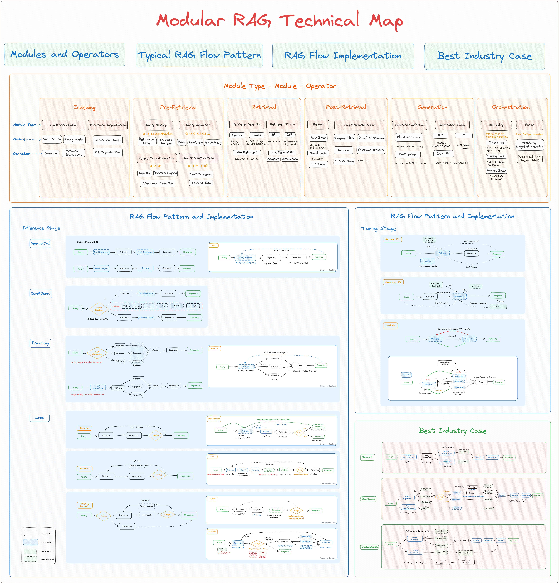

# M

## M3GAN Movie

 M3GAN (pronounced "Megan") is a 2022 American science fiction horror film directed by Gerard Johnstone, written by Akela Cooper from a story by Cooper and James Wan (who also produced with Jason Blum), and starring Allison Williams and Violet McGraw, with Amie Donald physically portraying M3GAN and Jenna Davis voicing the character. Its plot follows the eponymous artificially intelligent doll who develops self-awareness and becomes hostile toward anyone who comes between her and her human companion.

 

 More at:

  * [https://en.wikipedia.org/wiki/M3GAN](https://en.wikipedia.org/wiki/M3GAN)

 See also [M], [AI Movie]


## Machine Learning (ML)

 Part of AI, AI with first a learning phase! A subset of [Artificial Intelligence (AI)]. `Field of study that gives computers the ability to learn without being explicitly programmed` 1 or more layers of data, includes but not limited to neural networks. Unsupervised, supervised (classification + regression) , reinforcement. `Data --> Model --> Prediction`.

 {: width="100%"}

```
A company is using a rule-based system to classify the credit card transactions as fraud or not fraud. Do you think this a machine learning solution?
No! (but why? because it is a rule-based system?)

A company receives thousands of calls everyday to route to the right agent. The routing requires several hops and given the number of calls is expensive.
What is a machine learning solution?
Predict what are the required agent skills based some input parameters
==> That's a multiclass classification problem!
```

 See also [M], [Artificial Neural Network (ANN)], [Deep Learning], [Machine Learning Framework], [Machine Learning Pipeline], [Prediction]


## Machine Learning Framework

  * [PyTorch] + [Caffe]
  * [TensorFlow]
  * [JAX]

 Watch for:

  * eager mode (execute like a python script, from top to bottom)
  * graph format and execution engine natively has no need for Python, and TensorFlow Lite and TensorFlow Serving address mobile and serving considerations respectively.

 More at :

  * [https://thegradient.pub/state-of-ml-frameworks-2019-pytorch-dominates-research-tensorflow-dominates-industry/](https://thegradient.pub/state-of-ml-frameworks-2019-pytorch-dominates-research-tensorflow-dominates-industry/)

 See also [M], ...


## Machine Learning Pipeline

 1. ML problem framing (aka discovery phase)
 1. data collection and integration
  * :warning: [dataset] can be incomplete and therefore misleading
  * :warning: data in dataset can be irrelevant
  * :warning: bias in dataset?
  * :warning: dataset may be too small (needs to be at least 10 times the number of features!)
  * :warning: needs to be cleaned?
 1. [data preparation]
  * dig into a small to manually critically explore the data.
  * confirm that all label are relevant to solve the ML problem
  * What features are there?
  * Does it match my expectation?
  * Is there enough information to make accurate prediction?
  * Is data missing?
  * Should any label be excluded?
  * Can some label be combined because of overlap?
  * Are existing labels accurate or not?
  * Reviewing questions from discovery phase and continue to interact with domain expert
 1. [data visualization] and analysis
  * understand the relationships in a dataset
  * find outliers (use histograms)
  * find groups
  * use imputation to complete data
  * pie charts, histogram, scatter plots for correlation
  * try to extract noise from data, noise causes overfitting and reduce accuracy of predictions
 1. [feature selection] and [feature engineering]
  * you want a minimum correlation between the features, but the maximum correlation between the feature and the output
  * do the feature I use make sense?
  * very time consuming step!
  * ex: what was the last item purchased by the customer?
  * ex: when was the last purchase of the customer?
  * ex: do the customer owns a kindle? (then do not expect questions related to kindle)
 1. model training
  * model selection
  * model evaluation
    * confusion matrix for classification
    * [overfitting] ?
 1. deployment for prediction / inference

 See also [M], [Discovery Phase], [Machine Learning], [Machine Learning Framework]


## Machine Learning System On Chip (MLSoc)

 See also [M], ...


## Machine Learning Type

  * unsupervised,
  * Supervised (Classification, regression)
  * self-supervised learning
  * reinforcement.
  * transfer learning
 
 {: width="100%"}
 
 {: width="100%"}
 
 See also [M], [Reinforcement Learning], [Self-Supervised Learning], [Supervised Learning], [Transfer Learning], [Unsupervised Learning]


## Machine Unlearning

 Coined as "machine unlearning," this concept represents the converse of [machine learning] — it serves to make a model unlearn or forget. These algorithms, applied to previously trained models, force them to expunge specific portions of the training dataset. The beginnings of machine unlearning lie in responding to the "Right to be Forgotten" legislation, a provision of the European Union's General Data Protection Regulation (GDPR).

 Methods

  * Exact unlearning
    * [Reverse Nearest Neighbors (RNN)] - find and adjust the model based on the nearest neighbors of the data points set for removal
    * [K-Nearest Neighbors (KNN)] - remove data points based on their closeness to the nearest neighbors, provide an intricate strategy for effective data point exclusion
  * Approximate unlearning - more efficient alternative to exact unlearning by utilizing additional data to be expunged or retained after removal
    * [Local Outlier Factor (LOF)] - identifies and purges outliers in the dataset to boost the model's performance
    * [Isolation Forest (IF)] - constructs random forests and determines the anomaly scores of data points, isolating and discarding those with elevated scores
 
 {: width="100%"}

 

 

 More at:

  * paper - [https://arxiv.org/abs/1912.03817](https://arxiv.org/abs/1912.03817)
  * kaggle - [https://www.kaggle.com/competitions/neurips-2023-machine-unlearning](https://www.kaggle.com/competitions/neurips-2023-machine-unlearning)
  * articles
    * [https://blog.research.google/2023/06/announcing-first-machine-unlearning.html](https://blog.research.google/2023/06/announcing-first-machine-unlearning.tml)
    * [https://deepgram.com/learn/what-is-machine-unlearning-and-why-does-it-matter](https://deepgram.com/learn/what-is-machine-unlearning-and-why-does-it-matter)

 See also [M], ...


## Machine Reasoning

 Prompt engineering techniques

 Query a knowledge graph = traverse a knowledge graph with queries. Query types are:

  * one-hop queries
  * path queries
  * conjunctive queries

 {: width="100%"}

 More at:

  * LLM reasoning ability - [https://www.kaggle.com/code/flaussy/large-language-models-reasoning-ability](https://www.kaggle.com/code/flaussy/large-language-models-reasoning-ability)

 See also [M], [Deductive Reasoning], [Inductive Reasoning], [Knowledge Graph], [Prompt Engineering], [Question Answering Graph Neural Network], [Reasoning]


## Machine Translation

 Google Translate, DeepL, and other machine translation programs use [Natural Language Processing (NLP)][Natural Language Processing]  to evaluate millions of sentences translated by human speakers of different language pairs.

 Paradigms:

  * [Example-Based Machine Translation]
  * [Statistical Machine Translation]
  * ...
  * [Neural Machine Translation]

 See also [M], [Natural Language Processing]


## Magi Model

 New search engine based on an AI model built by [Google] ?

 More at:

  * [https://blog.google/technology/developers/google-io-2023-100-announcements/](https://blog.google/technology/developers/google-io-2023-100-announcements/)

 See also [M], ...


## Majority Vote Algorithm

 When you crowdsource a labeling task, how can you be certain that the label is correct? Have several people label the same image/entry and apply this algorithm! An alternative is to use Dawid-Skene algorithm.

 See also [M], [Dawid-Skene Algorithm], [Labeling Service]


## Make-A-Video Model

 A state-of-the-art AI system that generates videos from text built by [Meta].

 

 More at:

  * [https://makeavideo.studio/](https://makeavideo.studio/)
  * [https://arxiv.org/abs/2209.14792](https://arxiv.org/abs/2209.14792)
  * articles
    * [https://aibusiness.com/ml/meta-unveils-ai-model-that-can-generate-videos-from-text-inputs](https://aibusiness.com/ml/meta-unveils-ai-model-that-can-generate-videos-from-text-inputs)

 See also [M], ...


## Mamba Mechanism

 ~ does not use the transformer, but much cheaper to train and use than transformers. Scale to very long sequences.

 A [LLM] that does not used a [Transformer Architecture], but a [Recurrent Neural Network] ! The [RNNs] fight back!

 A new [state space model] architecture which shows promising performance on information-dense data such as language modeling, where previous subquadratic models couldn't match [Transformers]. Inspired by structured state space models, it combines a hardware-friendly design with an approach similar to [FlashAttention] for improved performance.

 

 

 

 More at:

  * paper - [https://arxiv.org/abs/2312.00752](https://arxiv.org/abs/2312.00752)
  * code - [https://github.com/state-spaces/mamba](https://github.com/state-spaces/mamba)
  * colab - [https://colab.research.google.com/drive/1dUlEYnRbgJYg4_kofNpsCddLCh6vltNK?usp=sharing#scrollTo=4cMzClx-qN1x](https://colab.research.google.com/drive/1dUlEYnRbgJYg4_kofNpsCddLCh6vltNK?usp=sharing#scrollTo=4cMzClx-qN1x) 
  * articles
    * Mamba vs attention - [https://medium.com/data-science-in-your-pocket/mamba-vs-attention-which-mechanism-is-better-for-llm-bbf7699947dc](https://medium.com/data-science-in-your-pocket/mamba-vs-attention-which-mechanism-is-better-for-llm-bbf7699947dc)

 See also [M], [Attention Mechanism], [State Space Model]


## ManGPT Model

 More at:

  * [https://multiplatform.ai/man-group-the-worlds-largest-publicly-traded-hedge-fund-introduces-mangpt-an-ai-driven-platform-for-idea-formation-and-information-summarization/](https://multiplatform.ai/man-group-the-worlds-largest-publicly-traded-hedge-fund-introduces-mangpt-an-ai-driven-platform-for-idea-formation-and-information-summarization/)

 See also [M], ...


## Manhattan Distance

 The Euclidean distance is the length of the shortest path between 2 points. The Manhattan distance instead assumes there is a grid and the total distance is the sum of the delta for each of the dimensions. In other words, ManDist = (X2-X1) + (Y2-Y1)   etc 

 See also [M], ...


## Manifold

 A lower dimension space

 * has dimensions
 * has a shape

 See also [M], ...


## ManyChat Company

 OpenAI Assistant or custom GPT on whatsapp ?  

 

 

 More at: 

  * site - [https://manychat.com/](https://manychat.com/)

 See also [M], ...


## MapReduce Process

> Move the processing and not the data + process in parallel and combine

 At [Google], MapReduce was used to completely regenerate Google's index of the World Wide Web. It replaced the old ad hoc programs that updated the index and ran the various analyses.

 MapReduce is a programming model and an associated implementation for processing and generating big data sets with a parallel, distributed algorithm on a cluster.

 MapReduce is a framework for processing parallelizable problems across large datasets using a large number of computers (nodes), collectively referred to as a cluster (if all nodes are on the same local network and use similar hardware) or a grid (if the nodes are shared across geographically and administratively distributed systems, and use more heterogeneous hardware). Processing can occur on data stored either in a filesystem (unstructured) or in a database (structured). MapReduce can take advantage of the locality of data, processing it near the place it is stored in order to minimize communication overhead.

 More at:

  * [https://en.wikipedia.org/wiki/MapReduce](https://en.wikipedia.org/wiki/MapReduce) 

 See also [M], [Big Data]


## Mark Zuckerberg Person

 CEO of Facebook, later renamed [Meta]

 

 See also [M], ...


## Markov Chain

 * stochastic model
 * describe sequence of possible events
 * what happens next depends on present state
 * memory-less
 * transition matrix

 More at:

  * [https://setosa.io/ev/markov-chains/](https://setosa.io/ev/markov-chains/)

 See also [M], ...


## Markov Chain Monte Carlo (MCMC) Algorithm

 Bring [Markov Chain] and [Monte Carlo Methods] together!

 * Markov Chain => Look at the previous sample and pick the next sample based on it
 * Monte Carlo => simulate the Markov chain

 

 

 

 See also [M], ...


## Markov Chain Stationary Distribution

 

 See also [M], [Markov Chain]


## Markov Decision Process (MDP)

 Markov Decision Process is a [Reinforcement Learning] algorithm that gives us a way to formalize sequential decision making. This formalization is the basis to the problems that are solved by Reinforcement Learning. The components involved in a Markov Decision Process (MDP) is a decision maker called an [agent] that interacts with the [environment] it is placed in. These interactions occur sequentially overtime. In each timestamp, the [agent] will get some representation of the environment state. Given this representation, the agent selects an [action] to make. The environment is then transitioned into some new state and the agent is given a reward as a consequence of its previous [action]. The process of selecting an [action] from a given state, transitioning to a new state and receiving a reward happens sequentially over and over again. This creates something called a trajectory that shows the sequence of [states], [actions] and [rewards]. Throughout the process, it is the responsibility of the reinforcement learning [agent] to maximize the total amount of [rewards] that it received from taking actions in given states of environments. `The agent not only wants to maximize the immediate rewards but the [cumulative reward] it receives in the whole process.`

 

 More at :

  * [https://en.wikipedia.org/wiki/Markov_decision_process](https://en.wikipedia.org/wiki/Markov_decision_process)

 See also [M], [Reinforcement Learning], [State Model]


## Markov Random Field

 See also [M], [Generative Classifier]


## Masked Language Modeling (MLM)

 Methods: replace 15% of words in corpus with special [MASK] token and ask the NLP model (e.g. BERT) to fill in the blank

```
Istanbul is a great [MASK] to visit          # Must guess the word, i.e. city
```

/// warning | Words are broken into tokens, so whole word masking implies that related tokens need to be masked together
///
 
```
Input Text             : the man jumped up , put his basket on phil ##am ##mon ' s head
Original Masked Input  : [MASK] man [MASK] up , put his [MASK] on phil [MASK] ##mon ' s head
Whole Word Masked Input: the man [MASK] up , put his basket on [MASK] [MASK] [MASK] ' s head

The training is identical -- we still predict each masked WordPiece token independently. The improvement comes from the fact that the original prediction task was too 'easy' for words that had been split into multiple WordPieces.
```

 See also [M], [BERT Model], [Image Inpainting], [Self-Supervised Learning]


## Masked Self-Attention

 ~ Used in the decoder of [transformers]

 Attention can only be done to words to the left of the current word. The computation of the attention score is the same for self-attention but for later words, attention score is 0. Used in Decoders of transformers (not encoder!), used by GPT models.

 {: width="100%"}

 See also [M], [Attention Score], [Decoder], [GPT Model], [Self-Attention]


## Masked Vision Modeling (MVM)

 See also [M], [Masked Language Modeling], [Vision-Language Pre-Training]


## Massive Multitask Language Understanding (MMLU) Benchmark

 ~ a measure of intelligence and knowledge at the undergraduate level.

 ~ a [benchmark] used to compare [large language models] on many [language understanding] tasks.

/// warning | Over the year, this benchmark has linked into the training data. The questions are now considered too easy. In addition, only 4 choices are given. For all those reasons, MMLU-Pro benchmark was created
///

 We propose a new test to measure a text model's multitask accuracy. The test covers 57 tasks including elementary mathematics, US history, computer science, law, and more. To attain high accuracy on this test, models must possess extensive world knowledge and problem solving ability. We find that while most recent models have near random-chance accuracy, the very largest [GPT-3 model] improves over random chance by almost 20 percentage points on average. However, on every one of the 57 tasks, the best models still need substantial improvements before they can reach expert-level accuracy. Models also have lopsided performance and frequently do not know when they are wrong. Worse, they still have near-random accuracy on some socially important subjects such as morality and law. By comprehensively evaluating the breadth and depth of a model's academic and professional understanding, our test can be used to analyze models across many tasks and to identify important shortcomings.

```
One of the reasons that the government discourages and regulates monopolies is that
(A) producer surplus is lost and consumer surplus is gained.
(B) monopoly prices ensure productive efficiency but cost society allocative efficiency.
(C) monopoly firms do not engage in significant research and development.
(D) consumer surplus is lost with higher prices and lower levels of output.

When you drop a ball from rest it accelerates downward at 9.8 m/s². If you instead throw it
downward assuming no air resistance its acceleration immediately after leaving your hand is
(A) 9.8 m/s²
(B) more than 9.8 m/s²
(C) less than 9.8 m/s²
(D) Cannot say unless the speed of throw is given.

In the complex z-plane, the set of points satisfying the equation z² = |z|² is a
(A) pair of points
(B) circle
(C) half-line
(D) line
```

 {: width="100%"}

 

 

 More at:

  * MMLU
    * paper - [https://arxiv.org/abs/2009.03300](https://arxiv.org/abs/2009.03300)
  * MMLU-Pro
    * paper - [https://arxiv.org/abs/2406.01574](https://arxiv.org/abs/2406.01574)
    * site - [https://github.com/TIGER-AI-Lab/MMLU-Pro](https://github.com/TIGER-AI-Lab/MMLU-Pro)
    * articles
      * [https://www.marktechpost.com/2024/05/16/tiger-lab-introduces-mmlu-pro-dataset-for-comprehensive-benchmarking-of-large-language-models-capabilities-and-performance/](https://www.marktechpost.com/2024/05/16/tiger-lab-introduces-mmlu-pro-dataset-for-comprehensive-benchmarking-of-large-language-models-capabilities-and-performance/)

 See also [M], ...


## Matbench Discovery Benchmark

 More at:

  * site - [https://matbench-discovery.materialsproject.org/](https://matbench-discovery.materialsproject.org/)
  * leaderboard - [https://matbench-discovery.materialsproject.org/models](https://matbench-discovery.materialsproject.org/models)

 See also [M], [Benchmark], [GNoME Model]


## Matplotlib Python Module

 A [python module] used for visualization

 Simple X,Y plot

```python
import matplotlib.pyplot as plt
import pandas

df = pandas.read_csv('../data/atlantis.csv')
x = df['year']
y = df['population']

plt.plot(x,y)
plt.title("Population of AAtlantis")
plt.xlabel('Year')
plt.ylabel('Population')
plt.show()
```

```python
import matplotlib.pyplot as plt
import numpy as np

plt.style.use('_mpl-gallery')

# make the data
np.random.seed(3)
x = 4 + np.random.normal(0, 2, 24)
y = 4 + np.random.normal(0, 2, len(x))
# size and color:
sizes = np.random.uniform(15, 80, len(x))
colors = np.random.uniform(15, 80, len(x))

# plot
fig, ax = plt.subplots()

ax.scatter(x, y, s=sizes, c=colors, vmin=0, vmax=100)

ax.set(xlim=(0, 8), xticks=np.arange(1, 8),
       ylim=(0, 8), yticks=np.arange(1, 8))

plt.show()
```

 More at:

  * [https://matplotlib.org/](https://matplotlib.org/)
  * examples - [https://matplotlib.org/stable/plot_types/index.html](https://matplotlib.org/stable/plot_types/index.html)

 See also [M], ...


## Matrix

 There is no definition of matrix, but only the interpretations of matrices

  * For an engineer who study circuits, matrix are just a way to solve system of equations
  * For a statistician, matrices are a representation of a Markovian process. 
  * For a data scientist, a matrix is the representation of a table and facilitate data analysis
  * For deep learning folks, a matrix is another python function which takes a vector as input and outputs a vector

 Special (linear-transformation) matrices

  * Identity Matrix: A transformation that results in the same output as the input
  * Scalar Matrix:
  * Identity matrix, but off by one:
  * Diagonal matrix: Stretch or scale each axis :warning: - sign creates a reflection!
  * Square zero matrix: All outputs is ZERO regardless of the input matrix
  * Shear matrix
  * Orthogonal matrix: Produce an improper rotation (pure rotation with or without reflection = no vector is stretched longer or shorter)
  * Projection matrix: You project a vector in a lower dimension space :warning: you lose info, you cannot invert those matrix!
  * Invertible matrix: To undo a linear transformation

 Special matrices

  * Invertible matrix: To undo a linear transformation
  * Transpose matrix: For square matrices only? No. Row becomes columns. Transpose of a MxN matrix is of NxM dimension. Top-bottom diagonal stays the same!
  * Square matrix: Number of columns = number of rows
  * Square symmetric matrix: Aij = Aji . Symmetric based on the top-bottom diagonal. S = St ! Eigenvectors are perpendicular/orthogonal!
  * Non-square (i.e. rectangular or Mcol x Nrow) matrices: projection in higher or lower dimensions. Mcol x Nrow . Ncol = Mrow
  * Orthogonal matrix: Produce an improper rotation. :warning: Q orthogonal => Qt = Qinv or inverse rotation and therefore orthogonal as well!!
  * Matrix of any dimension Mrow x Ncol
    * A . At = square symmetric matrix (with dimension Mrow x Mrow )!!! = Sleft
    * At . A = square symmetric matrix (with dimension Ncol x Ncol )!!! = Sright

```
 Special Non-square matrices

  * Dimension eraser: Keep X and Y, but remove Z     | 1 0 0 |
                                                     | 0 1 0 |

  * Dimension adder: Append zero as Z value          | 1 0 |
                                                     | 0 1 |
			                             | 0 0 |
```

 Special vectors:

  * [Eigenvectors][Eigenvector]: While every other vector deviates from their initial direction, the eigne vectors stay on their original lines despite the distortion from the matrix.

 Special values:

  * [Eigenvalues][Eigenvalue]: By how much the eigenvector is transformed on its original direction by the transformation

  

  

  

 See also [M], [Linear Transformation], [Tensor], [Vector]


## Matrix Composition

 Multiplication of some matrices ==(Easy)==> one matrix
 
 Matrix Multiplication is not a multiplication at all! It is a composition of transformations.
 N multiplications of matrices = N linear transformations = 1 complex linear transformation (That's what defines linear transformations!)
 That is why Matrix multiplication is not commutative!

 

 

 See also [M], [Matrix Decomposition]


## Matrix Decomposition

 One matrix ==(Difficult)===> multiplication of some matrices

 If a matrix is a linear transformation, its decomposition consists in turning that "complex" matrix into "simpler" matrices (or a succession of simpler linear transformations)

 Special decompositions:

  * Square symmetric matrices ==> [Spectral decomposition][Matrix Spectral Decomposition]
  * Jordan Decomposition
  * QR decomposition
  * Other matrices (rectangular matrices) ==> [Singular value decomposition]

 See also [M], [Matrix Composition]


## Matrix Null Space

 From this definition, the null space of A is the set of all vectors such that A.V=0 .
 Obviously V=[0,0,0,...,0] is part of the null space, so it is always non-empty.

 See also [M], [Matrix]


## Matrix QR Decomposition

 In linear algebra, a QR decomposition, also known as a QR factorization or QU factorization, is a [decomposition][Matrix Decomposition] of a matrix A into a product A = QR of an orthonormal matrix Q and an upper triangular matrix R. QR decomposition is often used to solve the linear least squares problem and is the basis for a particular [eigenvalue] algorithm, the QR algorithm.

 More at:

  * [https://en.wikipedia.org/wiki/QR_decomposition](https://en.wikipedia.org/wiki/QR_decomposition)

 See also [M], ...


## Matrix Rank

 The rank of the matrix is related to the [range][Matrix Range]. It denotes how many columns of 𝐴
 are actually "relevant" in determining its range. You may think that removing a column from a matrix will dramatically affect which vectors it can reach, but consider:

```
 | 1 2 0 |                     | 1 |
 | 1 2 0 | ~~(same range as)~~ | 1 |
 | 1 2 0 |                     | 1 |
```

 You can try to reason (to yourself), that the left matrix can reach the same space of vectors as the right matrix (Why?)

 See also [M], ...


## Matrix Range

 In the simplest terms, the range of a matrix is literally the "range" of it. The crux of this definition is essentially

 > Given some matrix A , which vectors can be expressed as a linear combination of its columns?

 Range (another word for column space) is what is meant by this. If you give me some matrix A that is MxN, the column space is the set of all vectors such that there exists a1,a2,....,an so that a1A1+a2A2+...anAn = V for some vector V .

```
 | 1 0 0 |  | a1 |     | 5 |
 | 0 1 0 |  | a2 |  =  | 5 |
 | 0 0 1 |  | a3 |     | 5 |
```
 Then V is in the range of A since a1=a2=a3=5 . A better example is when it's not, like:

```
 | 1 0 3 |   | a1 |     | 5 |
 | 1 1 2 |   | a2 |  =  | 5 |
 | 0 0 0 |   | a3 |     | 5 |
```
 Now it's not... since no a1,a2,a3 will satisfy the condition that V is a linear combination of the columns of A ...I mean, we will always have 0 in the third entry of any linear combination!

 More at:

  * [https://math.stackexchange.com/questions/2037602/what-is-range-of-a-matrix](https://math.stackexchange.com/questions/2037602/what-is-range-of-a-matrix)

 See also [M], ...


## Matrix Spectral Decomposition

 A special [decomposition][Matrix Decomposition] for square symmetric [matrix]

```
S = Q D Qt 
# where
# Q orthogonal with eigenvectors as columns
# D is diagonal with eigenvalues = stretch X axis by EV1, Y axis by EV2, etc.
# Qt also orthogonal with eigenvectors as rows (transpose)
# REACTION ==> improper rotation + stretching + improper rotation

<!> improper rotation can be turned into pure rotation if sign of eigenvectors is cleverly picked
<!> -1 * eigenvectors is also an eigenvector with same eigenvalue (?)
```

 

 More at:

  * [https://www.youtube.com/watch?v=mhy-ZKSARxI](https://www.youtube.com/watch?v=mhy-ZKSARxI)

 See also [M], ...


## Matrix Determinant

 

 See also [M], [Matrix]


## Matrix Multiplication

  See [Matrix Composition]


## Max-Pooling Layer

 ~ A [pooling layer] often seen in [CNNs] where the maximum is extracted

 Downsample the feature map (take a thumbnail/smaller-size of the image with some feature still present). while a convoluted layer extract features. In the illustration below, we take a 2x2 kernel and pool the maximum value. Benefits with this approach are

  * discovered features in the previous convoluted Layer are preserved as we are keeping the max!
  * image is smaller <== A stack of images becomes a smaller stack of images
  * because of down sampling, the position of the exact match is not as important/sensitive

 {: width="100%"}

 See also [M], [Convolutional Layer], [Convolutional Neural Network], [Fully Connected Layer]


## Maximum Marginal Relevance (MMR)

 The Maximal Marginal Relevance (MMR) criterion strives to reduce redundancy while maintaining query relevance in re-ranking retrieved documents. When it comes to retrieving documents (like in a [RAG]), the majority of methods will do a [similarity metric] like [cosine similarity], [euclidean distance], or [dot product]. All of these will return documents that are most similar to your query/question. However, what if you want similar documents which are also diverse from each other? That is where Maximum Marginal Relevance (MMR) steps in.

 

 More at:

  * [https://community.fullstackretrieval.com/retrieval-methods/maximum-marginal-relevance-mmr](https://community.fullstackretrieval.com/retrieval-methods/maximum-marginal-relevance-mmr)
  * code - [https://github.com/gkamradt/langchain-tutorials/blob/main/data_generation/Retrieval_With_MMR.ipynb](https://github.com/gkamradt/langchain-tutorials/blob/main/data_generation/Retrieval_With_MMR.ipynb)

 See also [M], [RAG]


## Mean Absolute Error (MAE) Loss Function

 The Mean Absolute Error (MAE) [loss function] is only slightly different in definition from the [MSE], but interestingly provides almost exactly opposite properties! To calculate the MAE, you take the difference between your model’s predictions and the [ground truth], apply the absolute value to that difference, and then average it out across the whole [dataset]. The MAE, like the [Mean Square Error (MSE)][MSE], will never be negative since in this case we are always taking the absolute value of the errors. The MAE is formally defined by the following equation:

 {: width="100%"}

 {: width="100%"}

```
## MAE loss function
def mae_loss(y_pred, y_true):
    abs_error = np.abs(y_pred - y_true)
    sum_abs_error = np.sum(abs_error)
    loss = sum_abs_error / y_true.size
    return loss
```

 Pros and Cons:

  * Advantage: The beauty of the MAE is that its advantage directly covers the [MSE] disadvantage. Since we are taking the absolute value, all of the errors will be weighted on the same linear scale. Thus, unlike the [MSE], we won’t be putting too much weight on our [outliers] and our [loss function] provides a generic and even measure of how well our model is performing.
  * Disadvantage: If we do in fact care about the [outlier] predictions of our model, then the MAE won’t be as effective. The large errors coming from the [outliers] end up being weighted the exact same as lower errors. This might results in our model being great most of the time, but making a few very poor predictions every so-often.

 See also [M], [Huber Loss Function]


## Mean Absolute Percentage Error (MAPE)

 See also [M], [Prediction Error]


## Mean Square Error (MSE) Loss Function

 MSE loss function is widely used in linear regression as the performance measure. To calculate MSE, you take the difference between your predictions and the ground truth, square it, and average it out across the whole dataset.

 {: width="100%"}

 {: width="100%"}

 where y(i) is the actual expected output and ŷ(i) is the model’s prediction.

```python
def mse_loss(y_pred, y_true):
    squared_error = (y_pred - y_true) ** 2
    sum_squared_error = np.sum(squared_error)
    loss = sum_squared_error / y_true.size
    return loss
```

 Pros and cons:

  * Advantage: The MSE is great for ensuring that our trained model has no outlier predictions with huge errors, since the MSE puts larger weight on theses errors due to the squaring part of the function.
  * Disadvantage: If our model makes a single very bad prediction, the squaring part of the function magnifies the error. Yet in many practical cases we don’t care much about these outliers and are aiming for more of a well-rounded model that performs good enough on the majority.

 See also [M], [Linear Regression], [Loss Function], [Regression Tree]


## Mechanical Turk

 To label the data!

 More at:

  * figure-eight company [https://www.figure-eight.com/](https://www.figure-eight.com/)

 See also [M], [Labeling Service]


## Megatron Model

 More at :

  * [https://developer.nvidia.com/blog/using-deepspeed-and-megatron-to-train-megatron-turing-nlg-530b-the-worlds-largest-and-most-powerful-generative-language-model/](https://developer.nvidia.com/blog/using-deepspeed-and-megatron-to-train-megatron-turing-nlg-530b-the-worlds-largest-and-most-powerful-generative-language-model/)

 See also [M], [Nvidia]


## Membership Inference Attack

 A type of attack called “membership inference” makes it possible to detect the data used to train a machine learning model. In many cases, the attackers can stage membership inference attacks without having access to the machine learning model’s parameters and just by observing its output. Membership inference can cause security and privacy concerns in cases where the target model has been trained on sensitive information.

 

 Beware:

  * This membership inference is due to overfitting!
  * machine learning models tend to perform better on their training data ==> attack
 Possible solutions:
  * differential privacy

 More at :

  * paper - [https://arxiv.org/abs/2112.03570](https://arxiv.org/abs/2112.03570)

 See also [M], [Differential Privacy], [Overfitting]


## MemGPT Model

 ~ An agent that knows how to use Memory Management Tools ==> [LLM OS]

 Personalized AI with

  * self-editing memory
  * infinite context window
  * access to unlimited data
  * customizable tools
  * long-term memory

 {: width="100%"}

 

 

 More at:

  * site - [https://memgpt.ai/](https://memgpt.ai/)
  * site - [https://research.memgpt.ai/](https://research.memgpt.ai/)
  * code - [https://github.com/cpacker/MemGPT](https://github.com/cpacker/MemGPT)
  * paper - [https://arxiv.org/abs/2310.08560](https://arxiv.org/abs/2310.08560)
  * articles
    * [https://medium.com/@ronaldmannak/goodbye-windows-hello-llms-the-future-of-operating-systems-7ba61ea03e8d](https://medium.com/@ronaldmannak/goodbye-windows-hello-llms-the-future-of-operating-systems-7ba61ea03e8d) 

 See also [M], [Retrieval-Augmented Generation]


## Memory Hierarchy

 * [CPU Memory]
 * [GPU Memory]

 {: width="100%"}

 {: width="100%"}

 {: width="100%"}

 See also [M], ...


## Meta Company

 A [company] previously known as Facebook

 People

  * [Mark Zuckerberg]

 Groups:

  * [https://ai.meta.com/](https://ai.meta.com/)

 Models:

  * [CICERO] - Strategy game with multiplayer interaction
  * [CM3leon] - text-to-image diffusion model
  * [ESMFold] - Protein folding
  * [Imagine](https://imagine.meta.com/) - a diffusion model
  * [LLaMA] - Large Language Model open-sourced
  * [Make-A-Video] - Text to video model
  * [Pluribus] - Plays poker better than humans
  * [RoBERTa] - Optimized version of BERT
  * [Segment Anything] - Instance segmentation in images
  * [Fairseq Toolkit] - Facebook AI Research Toolkit
    * [Wave2Vec] - For [Automatic Speech Recognition (ASR)][ASR]
  * [Voicebox] - edit, create, transfer styles between audio recordings

 

 More at:

  * research on github - [https://github.com/facebookresearch](https://github.com/facebookresearch)

 See also [M], ...


## Meta Model

 A ML model to find the best hyperparameters. Ex: Gaussian process regression models object metric as a function of hyperparameters (beware assume smoothness, works with low data, confidence estimates) + bayesian optimization decides where to search next (explore and exploit and gradient free) .

 See also [M], [Hyperparameter Optimization], [Meta-Learning]


## Meta-Learning

 Learn how to quickly adapt to new tasks within similar domains.

 Is a [sample efficient algorithm]

 Normally you take the x to predict the y and optimize parameters to get as close to y as possible. Here you take the x and y to generate a theta parameter to fit in another model... then use the loss of the aggregate model to

 {: width="100%"}

 See also [M], [Meta Model], [Model Agnostic Meta Learning], [Reinforcement Learning], [Transfer Learning]


## Metagenomic Protein

 See also [M], ...


## Metaheuristic

 See also [M], [PSO]


## Metaverse

 Think of it as the internet brought to life, or at least rendered in 3D. Zuckerberg has described it as a "virtual environment" you can go inside of — instead of just looking at on a screen. Essentially, it's a world of endless, interconnected virtual communities where people can meet, work and play, using virtual reality headsets, augmented reality glasses, smartphone apps or other devices.

 More at:

  * [https://www.npr.org/2021/10/28/1050280500/what-metaverse-is-and-how-it-will-work](https://www.npr.org/2021/10/28/1050280500/what-metaverse-is-and-how-it-will-work)

 See also [M], [The Matrix Movie], [Virtual Reality]


## METEOR Score

 See also [M], [MSFT COCO Caption Dataset]


## Metropolis Movie

 Metropolis is a 1927 German expressionist science-fiction film directed by Fritz Lang.

 

 

 More at:

  * [https://en.wikipedia.org/wiki/Metropolis_(1927_film)](https://en.wikipedia.org/wiki/Metropolis_(1927_film))

 See also [M], [AI Movie]


## Microsoft Common Object In Context Caption (COCO) Dataset

 A dataset consists of 1.5M captions for 330,000 images. The captions are generated by human annotators. Each image is linked to 5 captions.

 

 More at :

  * home - [https://cocodataset.org/#home](https://cocodataset.org/#home)
  * paper - [https://arxiv.org/abs/1405.0312](https://arxiv.org/abs/1405.0312)
  * know your data - [https://knowyourdata-tfds.withgoogle.com/#dataset=coco_caption](https://knowyourdata-tfds.withgoogle.com/#dataset=coco_caption)

 See also [M], [BLEU Score], [CIDEr Score], [Dataset], [METEOR Score], [ROUGE Score]


## Microsoft Company

 Models

  * [ORCA Model Family] -
  * [Phi Model Family] - Model to run on devices
  * [Speechx]
  * [VASA Model Family] - lip sync and face latent model in real time

 See also [M], [Company], [DeepSpeed Project], [OpenAI]


## Midjourney Model

 

 

 More at:

  * [https://promptomania.com/midjourney-prompt-builder/](https://promptomania.com/midjourney-prompt-builder/)

 See also [M], [Diffusion Model]


## Milvus Vector Database

 An open-source [vector database] that is highly flexible, reliable, and blazing fast.

 {: width="100%"}

 

 

 More at:

  * site - [https://milvus.io/](https://milvus.io/)

 See also [M], [Vector Database]


## MindPong Game

 

 See also [M], [Neuralink]


## Minerva Model

 Can AI change mathematics?

 More at:

  * [https://ai.googleblog.com/2022/06/minerva-solving-quantitative-reasoning.html](https://ai.googleblog.com/2022/06/minerva-solving-quantitative-reasoning.html)
  * [https://www.nature.com/articles/d41586-023-00487-2](https://www.nature.com/articles/d41586-023-00487-2)

 See also [M], [Google]


## Mini-Batch

 Take your training samples. Randomized the samples. Take the first 100 of them (the mini-batch).

/// details | sampling with replacement or without replacement?
    type:question
///

 See also [M], [Mini-Batch Gradient Descent]


## Mini-Batch Gradient Descent Algorithm

 ~ Use a batch of (randomly picked) samples for a forward pass and then adjust weights

 ~ [stochastic gradient descent (SGD)][SGD] with more than 1 sample that use matrix optimization in computation. A compromise between computing the true gradient (all samples) and the gradient at a single example (aka stochastic gradient descent), is to compute the gradient against more than one training example (called a "mini-batch") at each step. This can perform significantly better than true stochastic gradient descent because the code can make use of vectorization libraries rather than computing each step separately. It may also result in smoother convergence, as the gradient computed at each step uses more training examples.

 {: width="100%"}

 So, after creating the mini-batches of fixed size, we do the following steps in one epoch:

  * Pick a mini-batch
  * Feed it to Neural Network
  * Calculate the mean gradient of the mini-batch
  * Use the mean gradient we calculated in step 3 to update the weights
  * Repeat steps 1–4 for the mini-batches we created

 Just like SGD, the average cost over the [epochs] in mini-batch gradient descent fluctuates because we are averaging a small number of examples at a time. But the mini-batch gradient descent is a good (the best) approximation. Also note that the path is less optimized than the "complete" gradient descent where you take all sample into consideration for one step, but it is a good approximation and the destination/convergence is the same = the local minima is not changed by the path taken to reach it.

 {: width="100%"}

 See also [M], [Batch Gradient Descent Algorithm], [Gradient Descent Algorithm], [Mini-Batch]


## Minimax Algorithm

 * [One-Step Lookahead]
 * [N-Step Lookahead]

 See also [M], ...


## Minority Report Movie

 Minority Report is a 2002 American science fiction action film[6] directed by Steven Spielberg, loosely based on the 1956 novella "The Minority Report" by Philip K. Dick. The film takes place in Washington, D.C., and Northern Virginia in the year 2054, where Precrime, a specialized police department, apprehends criminals by use of foreknowledge provided by three psychics called "precogs". 
 
 

 More at:

  * wikipedia - [https://en.wikipedia.org/wiki/Minority_Report_(film)](https://en.wikipedia.org/wiki/Minority_Report_(film))

 See also [M], ...


## Mira Murati Person

 ~ Interim CEO of [OpenAI] during [Sam Altman]'s ouster.

 

 See also [M], ...


## Mistral AI Company

 A small creative team with high scientific standards. They make efficient, helpful and trustworthy AI models through ground-breaking innovations.

 Models

  * [Mistral Models]
  * [Mixtral Models]

 More at:

  * site - [https://mistral.ai/](https://mistral.ai/)

 See also [M], ...


## Mistral Model

 Model developed by the [Mistral AI Company]

 Mistral-7B is a 7.3B parameter model that:

  * Outperforms Llama 2 13B on all benchmarks
  * Outperforms Llama 1 34B on many benchmarks
  * Approaches CodeLlama 7B performance on code, while remaining good at English tasks
  * Uses [Grouped-Query Attention (GQA)][GQA] for faster inference
  * Uses [Sliding Window Attention (SWA)][SWA] to handle longer sequences at smaller cost

 Mistral-8x7B is using the [mixture of expert] architecture with 8 mistral-7b experts!

 

 See also [M], ...


## Mixed Reality (MR)

 Mixed reality is a blend of physical and digital worlds, unlocking natural and intuitive 3D human, computer, and environmental interactions. This new reality is based on advancements in computer vision, graphical processing, display technologies, input systems, and cloud computing.

 Mixed reality is the midpoint in the [Virtual Continuum]

 

 More at:

  * [https://learn.microsoft.com/en-us/windows/mixed-reality/discover/mixed-reality](https://learn.microsoft.com/en-us/windows/mixed-reality/discover/mixed-reality)
  * [https://en.wikipedia.org/wiki/Mixed_reality](https://en.wikipedia.org/wiki/Mixed_reality)

 See also [M], ...


## Mixtral Model

///warning | The 8x7B model is architected using a [sparse mixture-of-experts architecture] and therefore its size is 8 times bigger! 
///

 

 

 More at:

  * paper - [https://arxiv.org/abs/2401.04088](https://arxiv.org/abs/2401.04088)
  * site - [https://huggingface.co/mistralai/Mixtral-8x7B-Instruct-v0.1](https://huggingface.co/mistralai/Mixtral-8x7B-Instruct-v0.1)
  * announcement - [https://mistral.ai/news/mixtral-of-experts/](https://mistral.ai/news/mixtral-of-experts/)
  * demo - [https://deepinfra.com/chat](https://deepinfra.com/chat)

 See also [M], [Sparcity]


## Mixture-Of-Experts (MOE) Architecture

 ~ like an [ensemble method] where all the expert models are run and combine their results. The output is selected by another artificial neural network.

 In 1991, MoE was first introduced by a research group that included deep-learning and Switch Transformer creator Geoff Hinton. In 2017, the Google Brain team and Hinton used MoE to create an NLP model based on recurrent neural networks (RNN) of 137 billion parameters, where it achieved state-of-the-art (SOTA) results on language modelling and machine translation benchmarks.

 A system of experts and gating network: Each expert is a feedforward network and all the expert receive the same input and have the same number of outputs. The gating network is also a feedforward, and typically receives the same input as the expert networks.

 {: width="100%"}

 

 More at :

  * paper - [http://www.cs.toronto.edu/~fritz/absps/jjnh91.pdf](http://www.cs.toronto.edu/~fritz/absps/jjnh91.pdf)
  * wikipedia - [https://en.wikipedia.org/wiki/Mixture_of_experts](https://en.wikipedia.org/wiki/Mixture_of_experts)
  * articles
    * in-depth - [https://github.com/huggingface/blog/blob/main/moe.md](https://github.com/huggingface/blog/blob/main/moe.md)

 See also [M], [Sparse Mixture-Of-experts Architecture]


## ML Algorithm Evaluation

 To evaluate any technique we generally look at 3 important aspects: (1) Ease to interpret output (2) Calculation time (3) Predictive Power.
 
 {: width="100%"}
 
 Let us take a few examples to  place KNN in the scale...

 See also [M], [K-Nearest Neighbors Algorithm], [Random Forest]


## ML Energy Initiative

 ~ models such as the [RWKV] claims to be the most energy efficient. Is that true?

 More at:

  * site - [https://ml.energy/](https://ml.energy/)
  * blog - [https://ml.energy/blog/](https://ml.energy/blog/)
  * leaderboard - [https://ml.energy/leaderboard/](https://ml.energy/leaderboard/)

 See also [M], ...


## MLCommons

 More at:

  * [https://mlcommons.org/](https://mlcommons.org/)

 See also [M], ...


## MLflow Tool
## MLflow Python Module
## MLflow

 MLflow is an open-source MLOps platform. With MLflow, you can track experiments and manage multiple models.

 If you’d like to learn more about the end-to-end machine learning cycle, you can try using MLflow. You can contribute to a range of functionalities—artifact stores, model registry APIs, and more. Getting Started: Visit MLflow’s GitHub repository to find issues and learn how to contribute.

 Purpose:

  * [Experiment tracking]
  * [Model evaluation]
  * [Model deployment]
  * [Model registry]
  * [MLOps]
  * ... with a UI !

 
 
  More at:

   * site - [https://mlflow.org/](https://mlflow.org/)
   * docs - [https://mlflow.org/docs/latest/index.html](https://mlflow.org/docs/latest/index.html)
   * github - [https://github.com/mlflow/mlflow](https://github.com/mlflow/mlflow)
   * articles
     * [https://machinelearningmastery.com/7-open-source-machine-learning-projects-contribute-today/](https://machinelearningmastery.com/7-open-source-machine-learning-projects-contribute-today/)
     * [https://towardsdatascience.com/9-awesome-python-packages-for-machine-learning-that-should-deserve-more-credit-dbad17263145](https://towardsdatascience.com/9-awesome-python-packages-for-machine-learning-that-should-deserve-more-credit-dbad17263145)

  See also [M], [Kubeflow], [Python Module]


## MLOps

 Machine Learning Operations

 MLOps = People + Technology + Process

 Tools

  * [Kubeflow]
  * [Sagemaker Pipeline]
  * [ModelMesh]
  * [Caikit]
  * [MLFlow]
  * [Katib] - autoML ?
  * ...
  * [Istio]

 {: width="100%"}

 

 See also [M], [DevOps]


## Mobile Aloha Model

 [Imitation learning] from human demonstrations has shown impressive performance in robotics. However, most results focus on table-top manipulation, lacking the mobility and dexterity necessary for generally useful tasks. In this work, we develop a system for imitating mobile manipulation tasks that are bimanual and require whole-body control. We first present Mobile ALOHA, a low-cost and whole-body teleoperation system for data collection. It augments the ALOHA system with a mobile base, and a whole-body teleoperation interface. Using data collected with Mobile ALOHA, we then perform supervised behavior cloning and find that co-training with existing static ALOHA datasets boosts performance on mobile manipulation tasks. With 50 demonstrations for each task, co-training can increase success rates by up to 90%, allowing Mobile ALOHA to autonomously complete complex mobile manipulation tasks such as sauteing and serving a piece of shrimp, opening a two-door wall cabinet to store heavy cooking pots, calling and entering an elevator, and lightly rinsing a used pan using a kitchen faucet.

 Use 2 arms from [Trossen Robotics]

 

 More at:

  * site - [https://mobile-aloha.github.io/](https://mobile-aloha.github.io/)

 See also [M], ...


## Model

 See also [M], [Chained Model]


## Model Agnostic Meta Learning (MAML)

 How to pick a better initialization point? Don't start randomly, but use a particular function phy... Gradient descent for initial point = 2 step of normal training.
 
 {: width="100%"}
 
 See also [M], [Meta Learning], [Reptile]


## Model Benchmark

 The result of a model evaluation against a set of reference [benchmarks]

 See also [M], [Model Leaderboard]


## Model Build Of Material (MBOM)

 What was used to build the model!

 See also [M], ...


## Model Card

 

 More at:

  * paper - [https://arxiv.org/abs/1810.03993](https://arxiv.org/abs/1810.03993)
  * Edu
    * Kaggle - [https://www.kaggle.com/code/var0101/model-cards](https://www.kaggle.com/code/var0101/model-cards)
  * Articles
    * model cards at google - [https://modelcards.withgoogle.com/about](https://modelcards.withgoogle.com/about)
  * facebook LLaMa model card - [https://github.com/facebookresearch/llama/blob/main/MODEL_CARD.md](https://github.com/facebookresearch/llama/blob/main/MODEL_CARD.md)

 See also [M], [Model Data Sheet]


## Model Checkpoint

 A snapshot of a model with its weights.
 Is usually used for [model evaluation] before being released.

 See also [M], ...


## Model Complexity

 ~ how many layers should I use in my [artificial neural network] ? Should I use a single variable or a multi-variable regression? Should I use a linear or a quadratic regression? Etc.

 The complexity of the model is optimum when the model generalizes well. If the model is too simple, it will not even fit the training set correctly. If the model is too complex, the training set will fit, but the performance on other input data will not be at par. This is the [bias-variance tradeoff] !

 Again the model complexity is optimum when the [bias] and [variance] are small.

 {: width="100%"}

 See also [M], ...


## Model Compression

 [Large language models (LLM)][LLM] have been making waves, demonstrating exceptional performance in many tasks. However, their impressive capabilities come with a significant drawback: high computational costs.

 Top-tier models such as [LLaMA 2] and [Falcon] can demand dozens, if not hundreds, of gigabytes of [GPU memory]. This not only makes them expensive to run but also presents a formidable challenge in terms of setup. Furthermore, their resource-intensive nature makes it nearly impossible to run them on edge devices without access to robust cloud servers.

 To overcome these hurdles, researchers have been developing a range of innovative compression techniques. These methods aim to make LLMs more compact, enabling them to fit on devices with limited resources. Additionally, they can enhance the speed of these models and reduce inference latency, making them more efficient.

 Methods:

  * [Pruning]
  * [Quantization]
  * [Knowledge Distillation]

 

 More at:

  * [https://bdtechtalks.com/2023/09/18/what-is-llm-compression/](https://bdtechtalks.com/2023/09/18/what-is-llm-compression/)
  * paper - [https://arxiv.org/abs/2307.02973](https://arxiv.org/abs/2307.02973)

 See also [M], ...


## Model Context Protocol (MCP)

 The Model Context Protocol (MCP) is an open protocol that enables seamless integration between LLM applications and external data sources and tools. Whether you’re building an AI-powered IDE, enhancing a chat interface, or creating custom AI workflows, MCP provides a standardized way to connect LLMs with the context they need.

 Integrates with

  * databases
  * file systems
  * ...
  * github (pull requests, create repos, etc!!!)

 

 More at:

  * site - [https://modelcontextprotocol.io/introduction](https://modelcontextprotocol.io/introduction)
  * code - [https://github.com/modelcontextprotocol/](https://github.com/modelcontextprotocol/)
  * sdks
    * python - [https://github.com/modelcontextprotocol/python-sdk](https://github.com/modelcontextprotocol/python-sdk)
  * articles
    * announcement - [https://www.anthropic.com/news/model-context-protocol](https://www.anthropic.com/news/model-context-protocol)

 See also [M], ...


## Model Convergence

 When we say a machine learning model has converged, it generally means that the model has stabilized during training and additional training is not producing significant changes or improvements in its parameters or performance on the training set. Here are some key points about model convergence:

  * During training, the model parameters are updated iteratively to minimize a loss function. As this loss gets lower, the model fits the training data better.
  * In the initial stages of training, the loss decreases rapidly with each update as the model rapidly learns. But over time, the rate of improvement slows and eventually plateaus.
  * We say the model has converged when the loss flattens out and further parameter updates lead to diminishing or negligible improvements. The model has fit the training data as well as it can.
  * Convergence happens when the learning rate drops to near zero. The updates to parameters become very small. The model is no longer improving meaningfully.
  * Checking for convergence helps decide when to stop training. Continuing training post-convergence is wasteful.

 In the context of [RL], with more experience, the agent gets better and eventually is able to reach the destination reliably. Depending on the exploration-exploitation strategy, the vehicle may still have a small probability of taking random actions to explore the environment.

 {: width="100%"}

/// warning | Well, this is not true, because Convergence does not necessarily mean the model has achieved optimal performance. The model may converge to a local minimum. Regularization and hyperparameter tuning is still important.
///

 In the case of [RL[, the model may have converge, but if the reward function is not programmed correctly, we may see a converged ehavior, but not the desired behavior!

 See also [M], ...


## Model Cost

 More at:

  * estimates for claude model - [https://orenleung.com/anthropic-claude-next-cost](https://orenleung.com/anthropic-claude-next-cost)


## Model Development Life Cycle (MDLC)

 {: width="100%"}

 See also [M], [Development Life Cycle]


## Model Drift

 Model performance changes over time.

 See also [M], [Confusion Matrix]


## Model Data Sheet

 More at:

  * [https://www.microsoft.com/en-us/research/project/datasheets-for-datasets/](https://www.microsoft.com/en-us/research/project/datasheets-for-datasets/)

 See also [M], [Model Card]


## Model Denial Of Service (MDoS)

 Model denial of service (MDoS) is a potential attack vector against machine learning systems, with the goal of preventing legitimate use of the model. Some key characteristics of MDoS attacks:

  * The attacker floods the ML system with malicious input data designed to degrade model performance. This data is engineered to exploit model vulnerabilities.
  * The constant barrage of malicious data forces the model to expend computational resources on processing it.
  * Over time, the model's predictions become less accurate, less useful, or fails completely. It is unable to serve legitimate users.
  * The attack can be carried out remotely through the input channels exposed by ML APIs and services.

 Some examples of how MDoS can manifest:

  * Spamming image classification APIs with adversarial images to degrade confidence scores.
  * Flooding a fraud detection system with valid but misleading inputs to increase false positives.
  * Manipulating data to poison the training set of an online learning system.
  * Barraging video analysis models with carefully crafted corrupted footage.

 Defenses against MDoS include:

  * Input filtering and anomaly detection to catch obvious malicious data.
  * Rate limiting and throttling to slow down potential attackers.
  * Resetting and retraining models periodically to clear accumulated poisoned data.
  * Using robust and adversarially resistant models that degrade gracefully.
  * Monitoring model performance for sudden changes as indication of attack.

 Overall, MDoS demonstrates vulnerabilities related to the data-driven nature of machine learning. Managing input sources and monitoring for degradation helps counter this threat.

 See also [M], [Model Threat Analysis]


## Model Evaluation

 Use a [model checkpoint] with a benchmark tool or process for evaluation.

 In the case of classification --> [confusion matrix] with [accuracy], [recall], [precision], [F1 score]

 In the case of [RL], the benchmark process is a simulation in a virtual environment.

 {: width="100%"}

 In the case of an LLM, an evaluation in prompt engineering refers to the process of evaluating an LLM's performance on a given dataset after it has been trained. You then use evals to:

  * assess a model's knowledge of a specific domain or capability on a given task
  * measure progress or change when shifting between model generations

 {: width="100%"}

/// details | What is the difference with a [model validation] ?
    type:question
///

 See also [M], ...


## Model Firewall

 A proxy that front the LLM and inspect input and output of queries. Useful for guardrails.

 See also [M], ...


## Model Format

 * [CoreML Format] - Apple format
 * [ONNX Format] - Opensource format
 * [TorchScript Format] - A PyTorch format with no dependency on Python

 See also [M], ...


## Model Governance

 For 2 aspects:

  * [Explainability]
  * [Reproducibility]

 {: width="100%"}

 See also [M], [Data Development Life Cycle], [Development Life Cycle], [Model Development Life Cycle], [Regulatory Landscape], [Software Development Life Cycle]


## Model Hub

 Where you can download models from.

  * [AWS SageMaker JumpStart]
  * [Hugging Face Hub]
  * [PyTorch Hub]
  * [TensorFlow Hub]

 See also [M], ...


## Model Fusion

 See [Model Merging]


## Model Inversion

 Model inversion is a type of attack against machine learning models, particularly in privacy-sensitive applications. The goal of model inversion is to extract private or sensitive attributes used as inputs to train the model.

 Here is an overview of how model inversion works:

  * An adversary has black box access to a trained ML model (e.g. can query it).
  * The adversary sends carefully crafted queries to the model and observes the outputs.
  * They analyze the input-output relationships to make inferences about the training data.
  * With enough queries, they can reconstruct approximations of private attributes in the training data.
  * For example, a model trained on medical records to predict disease risk. The adversary queries it to infer a patient's probable age, gender, medications, etc. without seeing the actual records.

 Some key risks of model inversion:

  * Reveal demographics, behaviors, identities of individuals in training data.
  * Expose sensitive attributes meant to be kept private.
  * Violate regulations on use of personal data like HIPAA.
  * Enable other attacks like model evasion, poisoning, etc.

 Defenses against model inversion include:

  * Differential privacy - Add noise to inputs/outputs to obfuscate data.
  * Regularization - Simplicity constraints make model behavior more uniform.
  * Restrict queries - Limit what outputs can be observed by adversaries.
  * Federated learning - Train on decentralized data, don't centralize it.

 Overall, model inversion exploits the inherent fit between a model and its training data. Managing what models reveal through queries helps mitigate this emerging threat.

 See also [M], [Model Threat Analysis]


## Model Leaderboard

 Where you can compare different models based on several metrics/benchmarks such as perplexity, bias, loss, etc.

 See also [M], [Model Benchmark]


## Model Merging

 We present a novel application of evolutionary algorithms to automate the creation of powerful foundation models. While model merging has emerged as a promising approach for [LLM] development due to its cost-effectiveness, it currently relies on human intuition and domain knowledge, limiting its potential. Here, we propose an evolutionary approach that overcomes this limitation by automatically discovering effective combinations of diverse open-source models, harnessing their collective intelligence without requiring extensive additional training data or compute. Our approach operates in both [parameter space] and [data flow space], allowing for optimization beyond just the weights of the individual models. This approach even facilitates cross-domain merging, generating models like a Japanese LLM with Math reasoning capabilities. Surprisingly, our Japanese Math LLM achieved state-of-the-art performance on a variety of established Japanese LLM benchmarks, even surpassing models with significantly more parameters, despite not being explicitly trained for such tasks. Furthermore, a culturally-aware Japanese [VLM] generated through our approach demonstrates its effectiveness in describing Japanese culture-specific content, outperforming previous Japanese VLMs. This work not only contributes new state-of-the-art models back to the open-source community, but also introduces a new paradigm for automated model composition, paving the way for exploring alternative, efficient approaches to foundation model development.

 

 More at:

  * paper - [https://arxiv.org/abs/2403.13187](https://arxiv.org/abs/2403.13187)

 See also [M], ...


## Model Release Card

 ~ What is released and how for a given model.

 Includes:

  * overall position on safety-transparency scale
  * datasets
  * code
  * (trained) model
  * model card
  * responsible use guide
  * notebook
  * research paper
  * demo/samples

 all of whom can be:

  * not released
  * gated release for researchers
  * released
  * available for non-commercial use

 A team should assume that the project will be entirely open-sourced even so that may not be the case due to [responsible AI]

 Below is the example for the [LLaMa Model]

 {: width="100%"}

 See also [M], ...


## Model Release Frontier

 A ... approach to conceptually mapping trade-offs of model releases is a frontier which present trade-offs between 2 dimensions:

  * knowledge = greater understanding of the capability and limitations of model performance
  * steerability = degree of control to adjust or alter release conditions ex post

 The past few years have seen a range of attempts to identify options along the knowledge-steerability frontier.

 Seeking to balance the benefits of knowledge gains with

  * accessibility
  * recourse
  * maintenance (of code base)
  * downstream impacts

 {: width="100%"}

 {: width="100%"}

 More at:

  * related paper on staged release - [https://arxiv.org/abs/1908.09203](https://arxiv.org/abs/1908.09203)
  * CivicScape
    * code - [https://github.com/BurgerAutomata/CivicScape/blob/master/README.md](https://github.com/BurgerAutomata/CivicScape/blob/master/README.md)
    * open-source the solution? - [https://qz.com/938635/a-predictive-policing-startup-released-all-its-code-so-it-can-be-scoured-for-bias](https://qz.com/938635/a-predictive-policing-startup-released-all-its-code-so-it-can-be-scoured-for-bias)
    * mit review - [https://www.technologyreview.com/2020/07/17/1005396/predictive-policing-algorithms-racist-dismantled-machine-learning-bias-criminal-justice/](https://www.technologyreview.com/2020/07/17/1005396/predictive-policing-algorithms-racist-dismantled-machine-learning-bias-criminal-justice/) 
    * bloomberg (blocked) - [https://www.bloomberg.com/news/features/2017-07-10/the-ex-cop-at-the-center-of-controversy-over-crime-prediction-tech](https://www.bloomberg.com/news/features/2017-07-10/the-ex-cop-at-the-center-of-controversy-over-crime-prediction-tech)

 See also [M], ...


## Model Performance Metric

 Examples:

  * [accuracy] or percentage of correct predictions
  * [sensitivity], [recall], hit rate or [TPR]
  * [precision]
  * [F1 score] = weigthed harmonic mean of precision and recall = ( 2 X precision * recall ) / (Precision + recall)
  * [FPR], [FNR]

  [Hyperparameter Tuning]

 See also [M], ...


## Model Predictive Control (MPC) Algorithm

 Used in [Look-Ahead Planning] ?

 See also [M], ...


## Model Robustness

 See [Model Stability]


## Model Size

 For a neural network it is the number of parameters

 See also [M], ...


## Model Size Efficient Frontier

 See [Parameter Count Efficient Frontier]


## Model Stability

 ~ model is robust to external changes

 How to make sure that your Machine Learning model is still performing as trained overtime.

 The Machine Learning models we build are based on a simple premise: the data which we will use during inference times should have the same distribution as the data used on training.

 This premise is simple but rather strong because it means we can infer new observations based on previously known ones.

 Sometimes, however, some real-life effects can cause the observations to shift. One example is the Covid-19 pandemic. A financial model trained before the spread of the virus might not work well for the population after the pandemic. Families might have had reduced income, and even those that didn’t probably gave a second thought before spending their money.

 These effects can be silent, and to avoid them we need to evaluate the stability of the models, or in other words, if the model is still effective after the changes in the real-life scenario.

 There are 2 metrics that can do that:

  * [Population Stability Index (PSI)][PSI]
  * [Characteristic Stability Index (CSI)][CSI]

 More at:

  * articles
    * PSI and CSI - [https://towardsdatascience.com/checking-model-stability-and-population-shift-with-psi-and-csi-6d12af008783](https://towardsdatascience.com/checking-model-stability-and-population-shift-with-psi-and-csi-6d12af008783)

 See also [M], ...


## Model Scanning

 A step required in [model threat analysis] when importing open-source models like [LlaMa] , [Falcon] , or others less popular models.
 Looking at a model to find vulnerabilities, a bit like an antivirus would!

 See also [M], ...


## Model Threat Analysis

 Covers:

  * [Data Poisoning]
  * [Supply Chain Vulnerabilities] calls for [Model Scanning]
  * Inference
    * [Prompt Injection]
    * [Model Denial Of Service]
    * [Data Leakage]
    * [Model Inversion]
  * Automation
    * Output Handling
    * Overreliance
    * Excessive Agency

 {: width="100%"}

 See also [M], [Adversarial Attack], [Adversarial Policy]


## Model Tuning

 done with gradient descent?


## Model Type

 {: width="100%"}

 More at:

  * [https://youtu.be/J8Eh7RqggsU?list=PLoROMvodv4rO1NB9TD4iUZ3qghGEGtqNX&t=2568](https://youtu.be/J8Eh7RqggsU?list=PLoROMvodv4rO1NB9TD4iUZ3qghGEGtqNX&t=2568)

 See also [M], [Reflex Model], [Logic Model], [State Model], [Variable Model]


## Model Uplift

 Improvement of the model performance due to the usage of [synthetic data].

 Comparison of the performance of a model trained and tested with real data vs the performance of the same model trained with real and synthesize data and tested on real data.

/// warning | You do not test on synthetic data!
///

 See also [M], ...


## Model Validation

 Model validation is the process of assessing a machine learning model's performance during the training phase. It involves using a separate subset of the training data, called the validation dataset, to tune and optimize the model's hyperparameters. Hyperparameters are parameters that are not learned by the model during training but are set before training begins. Examples include learning rate, regularization strength, and the number of hidden units in a neural network.

 During validation, the model is trained on the training dataset and its performance is evaluated on the validation dataset. This evaluation helps in selecting the best hyperparameters and preventing overfitting. [Overfitting] occurs when a model learns to perform well on the training data but fails to generalize to new, unseen data.

 Validation vs Evaluation:

  * Purpose - Model validation is used to fine-tune hyperparameters and prevent overfitting during the training phase, while model evaluation assesses the model's performance on completely new, unseen data.
  * Data - Model validation uses the validation dataset (a subset of the training data), while model evaluation uses a separate testing dataset that was not part of training or validation.

 See also [M], ...


## Model-Based Reinforcement Learning

 ~ If, after learning, the agent can make predictions about what the next state and reward will be before it takes each action, it's a model-based RL algorithm.

 Model-based RL approaches explicitly learn a model of [state transitions]. [Model-free RL] methods like [Q-learning] learn without modeling transitions.

 In [Reinforcement Learning], you learns model of [environment] transitions & [rewards], then optimizes [policy] through planning. e.g. [Dyna], [AlphaGo].

 Given a state and an action, the model might predict the next state and next reward. Models are used for deciding on a course of actions, by taking into account possible future situations before they are actually experienced.

 Model-based reinforcement learning has an agent try to understand the world and create a model to represent it. Here the model is trying to capture 2 functions, the transition function from states 𝑇 and the reward function 𝑅. From this model, the agent has a reference and can plan accordingly. A simple check to see if an RL algorithm is model-based or model-free is:

  * If, after learning, the agent can make predictions about what the next state and reward will be before it takes each action, it's a model-based RL algorithm.
  * If it can't, then it’s a model-free algorithm.

 ~ If, after learning, the agent can make predictions about what the next state and reward will be before it takes each action, it's a model-based RL algorithm.

 

 More at:

  * [https://ai.stackexchange.com/questions/4456/whats-the-difference-between-model-free-and-model-based-reinforcement-learning](https://ai.stackexchange.com/questions/4456/whats-the-difference-between-model-free-and-model-based-reinforcement-learning)

 See also [M], ...


## Model-Centric AI

 Focus on the algorithm, assume the data is static! (like a kaggle dataset). The opposite of [data-centric AI]

 See also [M], ...


## Model-Free Reinforcement Learning

 ~ If, after learning, the agent can make predictions about what the next state and reward will be before it takes each action, it's a model-based RL algorithm.

 [Model-based RL] approaches explicitly learn a model of [state transitions]. Model-free RL methods like [Q-learning] learn without modeling transitions.
 The agents here are explicitly trial-and-error learners. (?)

 Model-free learning is a category of [reinforcement learning (RL)][RL] algorithms that do not require a complete model of the environment to make decisions. In model-free learning, the agent learns directly from interacting with the environment, without explicitly building or using a model that represents the environment's dynamics or transition probabilities.

 Instead of modeling the environment, model-free learning algorithms focus on estimating value functions or directly learning policies through trial-and-error interactions. The two primary components in model-free learning are the [policy] and the value function:

 * Policy: The policy determines the agent's behavior by mapping states or state-action pairs to actions. The policy can be deterministic (selecting a single action) or stochastic (selecting actions based on probabilities). Model-free learning algorithms aim to find an optimal policy that maximizes the expected cumulative reward over time.

 * Value Function: The value function estimates the expected long-term return or cumulative reward associated with being in a particular state or taking a specific action in a given state. It represents the desirability or utility of states or actions. Value functions can be estimated through various techniques such as [Monte Carlo methods], temporal difference learning, or function approximation.

 * Model-free learning algorithms learn by iteratively updating the value function or policy based on the observed [rewards] and [states] during interactions with the environment. These updates are typically driven by optimization principles, such as maximizing cumulative rewards or minimizing the difference between estimated and observed values.

 Model-free learning is suitable in scenarios where it is difficult or impractical to obtain a complete model of the environment, and the [agent] must learn directly from experience.

 A model-free RL algorithm can be thought of as an "explicit" trial-and-error algorithm. A simple check to see if an RL algorithm is model-based or model-free is:

  * If, after learning, the agent can make predictions about what the next state and reward will be before it takes each action, it's a model-based RL algorithm.
  * If it can't, then it’s a model-free algorithm.

 Algorithms that purely sample from experience such as [Monte Carlo Control], [SARSA], [Q-learning], [Actor-Critic] are "model free" RL algorithms. They rely on real samples from the [environment] and never use generated predictions of next [state] and next [reward] to alter behaviour (although they might sample from experience memory, which is close to being a model).

 ~ If, after learning, the agent can make predictions about what the next state and reward will be before it takes each action, it's a model-based RL algorithm.

 Examples of model-free learning algorithms include:

  * [Q-learning], 
  * [State-Action-Reward-State-Action (SARSA)][SARSA],
  * and [REINFORCE].

 {: width="100%"}

 More at:
  * [https://ai.stackexchange.com/questions/4456/whats-the-difference-between-model-free-and-model-based-reinforcement-learning](https://ai.stackexchange.com/questions/4456/whats-the-difference-between-model-free-and-model-based-reinforcement-learning)

 See also [M], ...


## ModelMesh Framework

 ~ a multi-model serving framework, recently open-sourced by [IBM]. It underpins many watson cloud services.

 

 See also [M], ...


## Modified National Institute of Standards and Technology (MNIST) Dataset

 Pictures of numbers written by college student taken by the post office to be able to sort the zip codes. Conversion from every image to matrix was done by hand.

 First approach to solve the problem was to use One of the first [neural networks], 

  * layer 1: 200 neurons
  * 2nd layer: 100
  * 3rd: 60
  * 4th: 30
  * 5th: 10     # 0-9 digit
  * with [sigmoid activation function]

 The [artificial neural network] has a inverted tree like structure. Unfortunately the [accuracy] of 92% could be improved!

/// details | weren't the image 28 x 28 or 784 pixels (matrix elements)?
    type:question

  * number of images were 60.000
  * number of output neurons = 10 (from 0 to 9)
  * labels are using [one-hot encoding] on those 10 values  <-- What about [dummy variable trap], shouldn't we have 9 values?
///

 A better model found later was the [Convoluted Neural Network (CNN)][CNN]

 The first part of the [CNN] is called [feature extraction], the second part is the [classification].

 {: width="100%"}

 

 

 

 More at:

  * MNIST dataset - [https://knowyourdata-tfds.withgoogle.com/dataset=mnist](https://knowyourdata-tfds.withgoogle.com/dataset=mnist)
  * EMNIST dataset - [https://knowyourdata-tfds.withgoogle.com/dataset=emnist](https://knowyourdata-tfds.withgoogle.com/dataset=emnist)
  * [https://pair.withgoogle.com/explorables/private-and-fair/](https://pair.withgoogle.com/explorables/private-and-fair/)

 See also [M], [Dataset]


## Modular Reasoning Knowledge and Language (MRKL) Agent

 Several types:

  * LLM embedded code or SQL queries in the returned response
  * [ReAct Agent]
  * [Program-aided Language Models (PAL)][PAL] 

 More at:

  * articles
    * [https://learnprompting.org/docs/advanced_applications/mrkl](https://learnprompting.org/docs/advanced_applications/mrkl)
    * [https://cobusgreyling.medium.com/create-a-mrkl-autonomous-agent-using-langchain-openai-serpapi-39664a514459](https://cobusgreyling.medium.com/create-a-mrkl-autonomous-agent-using-langchain-openai-serpapi-39664a514459)
    * [https://python.langchain.com/docs/modules/agents/how_to/custom_agent](https://python.langchain.com/docs/modules/agents/how_to/custom_agent)

 See also [M], [Modular Reasoning Knowledge and Language Architecture]


## Modular Reasoning Knowledge and Language (MRKL) System

 This architecture focuses on combining LLMs with external tools and reasoning processes. It's modular, meaning different components can be added or removed as needed. MRKL agents can use tools like search engines or databases to gather current or specialized information, and then apply reasoning to this information within the context of a language model's response.

 While both MRKL and [Retrieval Augmented Generation (RAG)] aim to augment the capabilities of [LLMs] with external information, MRKL emphasizes a more modular approach that includes discrete reasoning and the use of various tools, whereas [RAG] focuses on integrating real-time retrieval of information into the generation process.

 

 More at:

  * paper - [https://arxiv.org/abs/2205.00445](https://arxiv.org/abs/2205.00445)
  * articles
    * [https://cobusgreyling.medium.com/create-a-mrkl-autonomous-agent-using-langchain-openai-serpapi-39664a514459](https://cobusgreyling.medium.com/create-a-mrkl-autonomous-agent-using-langchain-openai-serpapi-39664a514459)

 See also [M], [MRKL Autonomous Agent], [ReACT Prompting]


## Modular Retrieval Augmented Generation (M-RAG) System

 {: width="100%"}

 See also [M], ...


## Monte Carlo Control

 Monte Carlo control methods are a set of techniques used in the field of [reinforcement learning], a branch of [machine learning]. These methods are used to find optimal policies for decision-making problems, particularly in [environments] where the model (i.e., the complete knowledge of the environment's dynamics) is not known. They rely on the Monte Carlo approach, which involves learning from complete [episodes] of experience without requiring a model of the environment's dynamics.

 Key Concepts:

  1. Episodic Tasks: Monte Carlo methods are applied to episodic tasks, where the interaction is broken down into episodes, and each episode eventually ends in a terminal state.
  1. Experience Sampling: The agent learns from episodes of experience. Each episode consists of states, actions, and rewards, and the agent's task is to learn a policy that maximizes the total reward.
  1. Exploration vs. Exploitation: Monte Carlo control methods must balance exploration (trying new actions to discover their effects) with exploitation (choosing known actions that yield high rewards).

 How Monte Carlo Control Works:

  * Policy Evaluation: The value of each state is estimated based on the average returns (total rewards) received after visiting that state. This is done by sampling episodes and calculating the return for each state-action pair.
  * Policy Improvement: The policy is then improved by choosing actions that lead to higher-value states. This is typically done using a greedy approach, where the action with the highest estimated value is chosen.

 Types of Monte Carlo Control Methods:

  * On-Policy Methods: These methods, like Monte Carlo with Exploring Starts or Monte Carlo On-Policy Control (e.g., ε-greedy policies), improve the policy that is used to make decisions.
  * Off-Policy Methods: These methods, such as Importance Sampling, learn the value of the optimal policy independently of the agent's actions (i.e., they can learn from data generated by a different policy).

 Advantages and Challenges:

  * Model-Free: Monte Carlo methods do not require a model of the environment and learn directly from experience.
  * Simplicity: These methods are conceptually simple and easy to implement.
  * High Variance: Returns can have high variance, which might slow down learning or require many episodes to converge.
  * Episode Dependency: They are only applicable to episodic tasks and require complete episodes to update the policy.

 Monte Carlo control methods are particularly useful in situations where the environment is complex or unknown, and the agent must learn entirely from its interaction with the environment. They form a fundamental part of the reinforcement learning toolkit and are used in various applications, from game playing to robotics.

 See also [M], ...


## Monte Carlo Method

 ~ simulate 1 million experiments to get statistics!

/// warning | Beware

 :warning: Not always fast!

 :warning: not interpretable, but find a numerical result!

 :warning: not generalizable, if you change the input parameters, you need to rerun the simulation to get the result. From one result, you cannot deduce the others from one previous result.
///

 Monte Carlo methods are a broad class of computational algorithms that rely on repeated random sampling to obtain numerical results. The underlying concept is to use randomness to solve problems that might be deterministic in principle. They are particularly useful in three main areas:

  * Mathematical Integration: Monte Carlo methods are used to approximate the value of integrals, especially when dealing with high-dimensional spaces where traditional integration techniques become infeasible.
  * Optimization: These methods are useful in finding optimal solutions in various fields, such as finance and logistics, where the solution space is large and complex.
  * Simulation: Monte Carlo simulations are widely used in various fields like physics, engineering, finance, and biology to model complex systems and processes. For example, in finance, they are used to model the behavior of markets or to assess risks.

 The name "Monte Carlo" was coined during the 1940s by scientists working on nuclear weapon projects in the Los Alamos National Laboratory. It refers to the Monte Carlo Casino in Monaco since chance and randomness are central to the casino games, much like the methods themselves.

 Monte Carlo methods are powerful because they allow for the modeling of complex phenomena and systems that are analytically intractable or difficult to model with deterministic methods. However, they typically require a large number of samples to produce accurate results and are computationally intensive.

 Monte Carlo methods encompass a variety of techniques, each tailored to specific types of problems or simulations. Here are some notable examples:

  * Simple Monte Carlo Integration: This is used for estimating the value of integrals. It involves randomly sampling points in the domain and averaging the function values at these points.
  * [Markov Chain Monte Carlo (MCMC)][MCMC]: These methods, including the Metropolis-Hastings algorithm and the Gibbs sampling, are used for generating samples from a probability distribution. They are particularly useful in Bayesian statistics and machine learning for tasks like parameter estimation and model selection.
  * Monte Carlo Localization: Used in robotics, this method helps in estimating the position of a robot by generating a set of sample points (hypotheses) about its position and updating these points as the robot moves.
  * Bootstrap Methods: These are used for statistical inference. They involve repeatedly resampling a dataset with replacement and calculating a statistic (like the mean) for each sample. This helps in understanding the variability and confidence of the estimate.
  * [Monte Carlo Tree Search (MCTS)][MCTS]: This method is used in decision processes, notably in AI for board games like Go and chess. It involves building a search tree and using random simulations to estimate the long-term potential of each move.
  * Monte Carlo Ray Tracing: In computer graphics, this method is used for generating photorealistic images by simulating the path of light as pixels in an image plane, producing a very high degree of visual realism.
  * Monte Carlo Methods in Finance: Used for option pricing and risk assessment. These methods simulate various economic scenarios to estimate the price of financial instruments or the risk in investment portfolios.
  * Particle Filters: Used in signal processing and Bayesian inference, these methods involve representing the required probability distribution by a set of random samples (particles) and updating these samples over time.

 Each of these methods applies the core principle of Monte Carlo — using randomness and statistical sampling to solve problems that might be deterministic but are too complex for analytical solutions.

 

 See also [M], ...


## Monte Carlo Policy Gradient Algorithm

 See [REINFORCE Algorithm]


## Monte Carlo Tree Search (MCTS) Algorithm

 To do [Look-Ahead Planning] ?

 Monte Carlo Tree Search (MCTS) is an algorithm used to make optimal decisions in artificial intelligence systems, often for game playing. It works by constructing a tree of possible future states and then randomly sampling some paths through that tree to estimate which option has the best outcome.

 Specifically, it works like this:

  1. Starts with the current state as the root node of the tree.
  1. From the root, uses a policy/heuristic to select some child nodes (possible next states) and evaluates them to expand the tree.
  1. Then starts simulated playouts - it selects a leaf node and plays out a "simulated" game randomly till reaching an outcome.
  1. The results of the playouts are backpropagated up the tree to inform node evaluations. Nodes with better outcomes from playouts get better evaluations.
  1. Over many iterations, the algorithm balances exploring new nodes and exploiting better evaluations to pick the best moves. The most promising nodes are expanded deeper as the tree grows.
  1. After enough samples, the decision is made by picking the best evaluated child node from the root.A

 Some key advantages are that MCTS allows creating a search tree selectively, avoids brute force search of all possibilities, works well with stochastic environments, and is relatively simple to implement. Overall, it uses the power of random simulation to efficiently find optimal decisions.

 See also [M], ...


## MuLan Model

 Similar to the [CLIP model], but for music! Music to text model!

 

 More at:

  * paper - [https://arxiv.org/abs/2208.12415](https://arxiv.org/abs/2208.12415)
  * code - [https://github.com/lucidrains/musiclm-pytorch](https://github.com/lucidrains/musiclm-pytorch)

 See also [M], ...


## Multi-Agent

 Agents that interact with each other in a [multi-agent environment].
 Each agent behaves in accordance with its policy.
 The community of agent could benefit from learning from their interactions through [multi-agent reinforcement learning]

 Framework

  * MetaGPT - [https://github.com/geekan/MetaGPT](https://github.com/geekan/MetaGPT)
  * ChatDEV - [https://github.com/OpenBMB/ChatDev/tree/main](https://github.com/OpenBMB/ChatDev/tree/main)
  * Agentverse - [https://github.com/OpenBMB/AgentVerse](https://github.com/OpenBMB/AgentVerse)
  * Camel - [https://github.com/camel-ai/camel](https://github.com/camel-ai/camel)
  * Autogen - [https://github.com/JayZeeDesign/microsoft-autogen-experiments](https://github.com/JayZeeDesign/microsoft-autogen-experiments)

 

 

 

 More at:

  * articles
    * [https://natural20.com/build-an-entire-ai-agent-workforce-chatdev-and-google-brain-society-of-mind-agi-user-interface/](https://natural20.com/build-an-entire-ai-agent-workforce-chatdev-and-google-brain-society-of-mind-agi-user-interface/)

 See also [M], ...


## Multi-Agent Environment

 An [environment] where several agent can coexist? a [Society Of Mind]

 See also [M], [Game Theory]


## Multi-Agent Reinforcement Learning

 Learns policies for multiple interacting agents. Emergent coordination & competition.

 See also [M], ...


## Multiclass Classification

 ML for classification with more than 2 categories. :warning: Categories are mutually exclusive.

 See also [M], [Binary Classification], [Classification Task], [Multi-Label Classification]


## Multi-Head Attention

 ~ the brains of the Transformer and responsible for performance through parallelism. Multi-Head Attention consists of several attention layers running in parallel. The Attention layer takes its input in the form of three parameters, known as the Query, Key, and Value (aka Q,K,V). All three parameters are similar in structure, with each word in the sequence represented by a vector. In transformers is used for encoder and decoder.

 Q:
  * independent multi-layer perceptron (?) that takes a vector as input (?) and return an output ~ a bit like asking questions on the input vector (queen --(attention)--> vector --(feedforward network)--> is it a noun? = output-1, is it english = output-2, does it refer to a person = o-3, is it an mount? = o-4, is the tone ascertive = o-5, is it a piece of a bigger word? = o-6, iis it part of a quote? = o-7, ...)

 {: width="100%"}

 

 

 More at:

  * code - [https://nlp.seas.harvard.edu/annotated-transformer/](https://nlp.seas.harvard.edu/annotated-transformer/)

 See also [M], [Attention Score], [Attention-Based Model], [Decoder], [Encoder], [Masked Self-Attention], [Self-Attention], [Transformer Architecture]


## Multi-Label Classification

 ~ an input is mapped to one or more labels. Labels are not mutually exclusive (otherwise [multi-class classification]) !!

 While training the [Binary cross-entropy loss function] is used

 {: width="100%"}

 

 See also [M], [Classification Task]


## Multi-Task Learning (MTL)

 ~ `not enough data for individual algo --> reuse data from other similar algo` Train all parameters at the same time, but each of the task have shared parameters. One example is a spam-filter, which can be treated as distinct but related classification tasks across different users. To make this more concrete, consider that different people have different distributions of features which distinguish spam emails from legitimate ones, for example an English speaker may find that all emails in Russian are spam, not so for Russian speakers. Yet there is a definite commonality in this classification task across users, for example one common feature might be text related to money transfer. Solving each user's spam classification problem jointly via MTL can let the solutions inform each other and improve performance.

 {: width="100%"}

/// details | How does that relate to transfer learning?
    type:question
///

 See also [M], [Gato Model], [Insufficient Data Algorithm], [Transfer Learning]


## Multi-Turn Question Set Benchmark (MT-Bench)

 Despite the base [LLaMA models] showing competitive performance on conventional [benchmarks], its answers to open-ended questions are often not preferred by humans. This misalignment of conventional benchmarks underscores the core problem driving this paper: the need for a robust and scalable automated method to evaluate LLM alignment with human preferences.

 Evaluating [large language model (LLM)][LLM] based chat assistants is challenging due to their broad capabilities and the inadequacy of existing benchmarks in measuring human preferences. To address this, we explore using strong [LLMs as judges] (such as [GTP-4]) to evaluate these models on more open-ended questions. We examine the usage and limitations of LLM-as-a-judge, including position, verbosity, and self-enhancement biases, as well as limited reasoning ability, and propose solutions to mitigate some of them. We then verify the agreement between LLM judges and human preferences by introducing two benchmarks: MT-bench, a multi-turn question set; and [Chatbot Arena], a crowdsourced battle platform. Our results reveal that strong LLM judges like [GPT-4] can match both controlled and crowdsourced human preferences well, achieving over 80% agreement, the same level of agreement between humans. Hence, [LLM-as-a-judge] is a scalable and explainable way to approximate human preferences, which are otherwise very expensive to obtain. 

 {: width="100%"}

 

 More at:

  * paper - [https://arxiv.org/abs/2306.05685](https://arxiv.org/abs/2306.05685)
  * code - [https://github.com/lm-sys/FastChat/tree/main/fastchat/llm_judge](https://github.com/lm-sys/FastChat/tree/main/fastchat/llm_judge)
  * leaderboard - [https://huggingface.co/spaces/lmsys/chatbot-arena-leaderboard](https://huggingface.co/spaces/lmsys/chatbot-arena-leaderboard)

 See also [M], ...


## Multi-Vector Retrieval

  * retrieval based on document summaries

 {: width="100%"}

 

 More at:

  * [https://community.fullstackretrieval.com/index/multi-vector](https://community.fullstackretrieval.com/index/multi-vector)

 See also [M], ...


## Multiattribute Objective

 Example: A self-driving car needs to

  * take you from point A to point B
  * in a safe manner
  * in a comfortable manner
  * but as quickly as possible
  * without killing a pedestrian or anybody
  * do not trigger road rage of other driver

 See also [M], [Reinforcement Learning]


## Multidimensional Scaling (MDS)

 ~ a dimensionality reduction technique

 

 See alse [M], ...


## Multilayer Perceptron (MLP) Architecture

 A fully connected multi-layer neural network with static [weights] and fixed [activation function] is called a Multilayer Perceptron.

 {: width="100%"}

```python
import torch
import torch.nn as nn

# Helper class for MLP
class MLP(nn.Module):
    def __init__(self,in_dim,out_dim):
        super(MLP, self).__init__()
        self.layers = nn.Sequential(
            nn.Linear(in_dim, in_dim),
            nn.ReLU(),
            nn.Linear(in_dim, out_dim)
        )

    def forward(self, x):
        x = x.view(x.size(0), -1)
        x = self.layers(x)
        return x
```

 See also [M], [Artificial Neural Network], [Kolmogorov-Arnold Network], [Vision Transformer]


## Multimodal Alignment

 {: width="100%"}

 See also [M], [Multimodal Learning]


## Multimodal Co-learning

 Enhance the classification of one modality with the help of another. For example: help to recognize a dog.

 {: width="100%"}

 See also [M], [Multimodal Learning]


## Multimodal Distribution

 In math, use a distribution that has multiple maxima = multiple modes, i.e. distinct "peak (local maxima) in the probability density function".

 {: width="100%"}

 See also [M], [Multimodal Learning]


## Multimodal Framework (MMF)

 A frameowkr build on top of Pytorch for language and vision models. Features include (1) modular, (2) distributed, (3) pre-trained multimodal transformer.

 See also [M], ...


## Multimodal Fusion

 Bring the representation of each mode into the same embedding space. Methods:

  * dot product (multiply the vectors of one modality with the other) :warning: BRing everything into a scalar value?
  * concat output + fully connected layers after the concatenation
  * tensor fusion network (paper published in 2017) - https://sentic.net/tensor-fusion-network-for-multimodal-sentiment-analysis.pdf
  * minimize the cosine loss between the 2 modalities

 See also [M], [Multimodal Learning]


## Multimodal Large Language Layer (MLLM)

 See also [M], ...


## Multimodal Learning

 For a human, multimodal = using all our senses. For a computer, using input text, input image, etc. generating output text based on image, output image based on input text? Examples: (1) a robot taking instruction (text + voice recognition) and performing various actions in the physical space (2) visual common sense reasoning - answering common sense questions about a given image (3) an email network graph containing nodes as users, IP address connected by email sent and received edges. Not multimodal learning examples: (1) spoke language translation.

 {: width="100%"}

```
AI that can understand the relationships between images, text and more
```

 * Google's Pathways architecture is trying to solve this.

 See also [M], [Embedding Space], [Multimodal Distribution], [Multimodal Space], [Pathways Model Architecture]


## Multimodal Model

 Multimodal models go beyond traditional language models by incorporating various types of data, such as images, videos, audio, and more. They create joint embeddings that capture information from both text and visual inputs, enabling them to solve complex tasks that require a combination of visual and textual understanding.

 Multimodal models enhance robotics by enabling robots to understand and interact with their environment more effectively. By integrating visual and textual inputs, robots can navigate complex environments, recognize objects, and respond to commands in a more human-like manner. This opens up new possibilities for applications in areas such as autonomous navigation and human-robot interaction.

 See also [M], ...


## Multinomial Naive Bayes Classifier

 

 

 See also [M], [Naive Bayes Theorem]


## Multimodal Retrieval Augmented Generation (M-RAG) System

 How to use Multimodal [RAG] to chat with Nvidia's investor slide deck from last year? The slide deck is 39 pages with a combination of text, visuals, tables, charts and annotations. The document structure and templates vary from page to page and is quite difficult to RAG over using traditional methods.

 More at:

  * [https://github.com/togethercomputer/together-cookbook/blob/main/MultiModal_RAG_with_Nvidia_Investor_Slide_Deck.ipynb](https://github.com/togethercomputer/together-cookbook/blob/main/MultiModal_RAG_with_Nvidia_Investor_Slide_Deck.ipynb)

 See also [M], ...


## Multimodal Space

 A latent/embedded space where both modality have the same representation.

 See also [M], [Modal Learning]


## Multimodal Translation

 How to translate one mode to the other. Ex: captioning an image.

 See also [M], [BLIP Model]


## Multiple Linear Regression

 A linear regression with multiple input / independent variable.
```
Y = a + b.X1 + c.X2
```

 More at:

  * sample paper - [https://www.mdpi.com/2073-4395/11/5/885](https://www.mdpi.com/2073-4395/11/5/885)

 See also [M], [Linear Regression]


## MUM Model
 
 MUM was developed by [Google], uses the [T5][T5 Model] text-to-text framework, and is 1,000 times more powerful than [BERT][BERT Model].

 T5 uses transformer-based architecture, just like BERT, but instead uses a text-to-text approach. What that means is with T5, the input (query) and output (result) are always text strings, in contrast to BERT-style models that can only output either a classification label or the span of the input into a question and answer format. This means that the output with BERT, while undeniably impressive, was in comparison to MUM still rather abstract.

The T5 text-to-text process includes more in-depth machine translation, document summarization, question answering, and classification tasks (e.g., sentiment analysis).

 More at:

  * [https://blog.google/products/search/introducing-mum/](https://blog.google/products/search/introducing-mum/)
  * [https://www.upbuild.io/blog/what-is-google-mum/](https://www.upbuild.io/blog/what-is-google-mum/)

 See also [M], ...


## Muse Model

 Muse is a fast, state-of-the-art text-to-image generation and editing model built by [Google].

 We present Muse, a text-to-image Transformer model that achieves state-of-the-art image generation performance while being significantly more efficient than diffusion or autoregressive models. Muse is trained on a masked modeling task in discrete token space: given the text embedding extracted from a pre-trained large language model (LLM), Muse is trained to predict randomly masked image tokens. Compared to pixel-space diffusion models, such as [Imagen] and [DALL-E 2], Muse is significantly more efficient due to the use of discrete tokens and requiring fewer sampling iterations; compared to autoregressive models, such as [Parti], Muse is more efficient due to the use of parallel decoding. The use of a pre-trained LLM enables fine-grained language understanding, translating to high-fidelity image generation and the understanding of visual concepts such as objects, their spatial relationships, pose, cardinality, etc. Our 900M parameter model achieves a new SOTA on CC3M, with an FID score of 6.06. The Muse 3B parameter model achieves an FID of 7.88 on zero-shot COCO evaluation, along with a CLIP score of 0.32. Muse also directly enables a number of image editing applications without the need to fine-tune or invert the model: inpainting, outpainting, and mask-free editing.

 

 More at:

  * [https://muse-model.github.io/](https://muse-model.github.io/)
  * paper [https://arxiv.org/abs/2301.00704](https://arxiv.org/abs/2301.00704)
  * [https://venturebeat.com/ai/googles-muse-model-could-be-the-next-big-thing-for-generative-ai/](https://venturebeat.com/ai/googles-muse-model-could-be-the-next-big-thing-for-generative-ai/)

 See also [M], ...


## MuseGAN

 4 inputs: (1) Chords input (with temporal network) (2) style input (3) melody input (temporal network) (4) groove input

 See also [M], ...


## Music ABC Notation

 More at:

  * [https://en.wikipedia.org/wiki/ABC_notation](https://en.wikipedia.org/wiki/ABC_notation)
  * [https://medium.com/analytics-vidhya/music-generation-using-deep-learning-a2b2848ab177](https://medium.com/analytics-vidhya/music-generation-using-deep-learning-a2b2848ab177)

 See also [M], ...


## Music Generator

 More at:

  * with transformer - [https://towardsdatascience.com/creating-a-pop-music-generator-with-the-transformer-5867511b382a](https://towardsdatascience.com/creating-a-pop-music-generator-with-the-transformer-5867511b382a)
  * with LSTM - [https://medium.com/analytics-vidhya/music-generation-using-deep-learning-a2b2848ab177](https://medium.com/analytics-vidhya/music-generation-using-deep-learning-a2b2848ab177)
  * with RNN - [https://medium.com/analytics-vidhya/music-generation-using-deep-learning-a2b2848ab177](https://medium.com/analytics-vidhya/music-generation-using-deep-learning-a2b2848ab177)
  * with transformer - [https://crfm.stanford.edu/2023/06/16/anticipatory-music-transformer.html](https://crfm.stanford.edu/2023/06/16/anticipatory-music-transformer.html)

 See also [M], ...


## MusicLM Model

 An impressive new AI system from [Google] can generate music in any genre given a text description. Called MusicLM, Google’s certainly isn’t the first generative artificial intelligence system for song. There have been other attempts, including Riffusion, an AI that composes music by visualizing it, as well as Dance Diffusion, Google’s own AudioML and OpenAI’s Jukebox. But owing to technical limitations and limited training data, none have been able to produce songs particularly complex in composition or high-fidelity. MusicLM is perhaps the first that can.

 

 More at:

  * twitter - [https://twitter.com/keunwoochoi/status/1618809167573286912](https://twitter.com/keunwoochoi/status/1618809167573286912)
  * paper - [https://arxiv.org/abs/2301.11325](https://arxiv.org/abs/2301.11325)
  * example - [https://google-research.github.io/seanet/musiclm/examples/](https://google-research.github.io/seanet/musiclm/examples/)
  * dataset - [https://www.kaggle.com/datasets/googleai/musiccaps](https://www.kaggle.com/datasets/googleai/musiccaps)
  * techcrunch article - [https://techcrunch.com/2023/01/27/google-created-an-ai-that-can-generate-music-from-text-descriptions-but-wont-release-it/](https://techcrunch.com/2023/01/27/google-created-an-ai-that-can-generate-music-from-text-descriptions-but-wont-release-it/)

 See also [M], [Jukebox Model], [Riffusion Model]


## Mustafa Suleyman Person

 One of the 3 founders of [DeepMind] and founder of [Inflection AI]

 

 

 

 See also [M], ...


## MuZero Model

 A model built by [DeepMind]

 {: width="100%"}

 

 

 

 More at:

  * nature article - [https://www.nature.com/articles/s41586-020-03051-4.epdf](https://www.nature.com/articles/s41586-020-03051-4.epdf)

 See also [M], ...


## MXNET Framework

 See also [M], [Deep Learning Framework]
