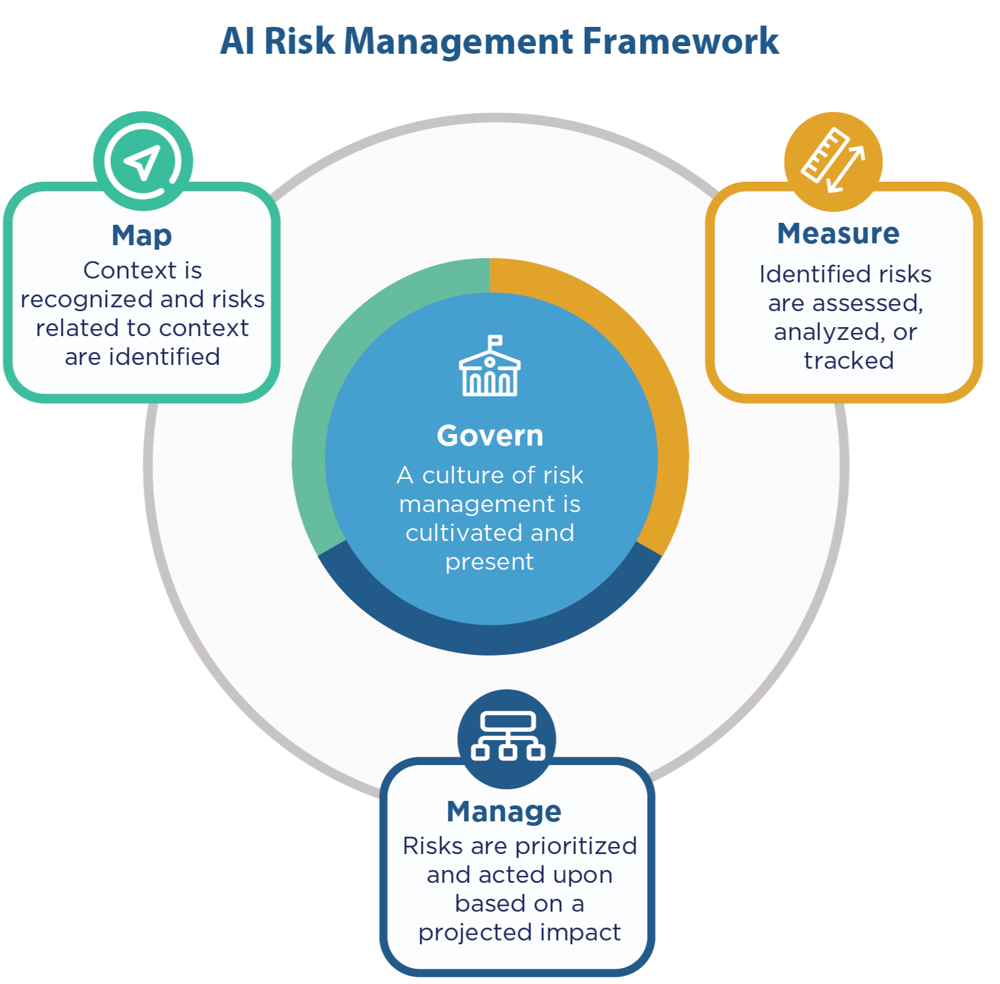
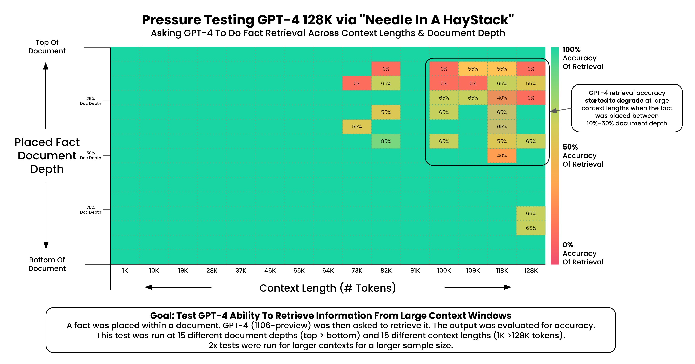

# N

## N-Gram

 ~ used to predict the next word based on the last (N-1) words

 An N-Gram is a connected string of N items from a sample of text or speech. The N-Gram could be comprised of large blocks of words, or smaller sets of syllables. N-Grams are used as the basis for functioning N-Gram models, which are instrumental in natural language processing as a way of predicting upcoming text or speech.

 {: width="100%"}

 N-Gram models are uses in natural language processing as a tool for modeling probable upcoming sequences of characters, also known as trigrams or 3-grams. An example is the phrase, "Good Afternoon," which breaks down to the trigrams "Goo","d A", "fte", etc. In machine translation models, however, N-Gram models are usually used in conjunction with Bayesian inference, leading to a more accurate prediction.

 See also [N], [Bigram], [Natural Language Programming]


## N-Gram Model

 A model that uses [N-grams] to predict the probability for the next word.

 See also [N], ...


## N-Step Lookahead

 More at:

  * [https://www.kaggle.com/code/alexisbcook/n-step-lookahead](https://www.kaggle.com/code/alexisbcook/n-step-lookahead)

 See also [N], ...


## Naive Bayes Classifier

 When most people want to learn about Naive Bayes, they want to learn about the [Multinomial Naive Bayes Classifier].

 However, just know that there is another commonly used version of Naive Bayes, called [Gaussian Naive Bayes Classifier]

 See also [N], ...


## Naive Bayes Theorem

 uses the [Bayes’ Theorem] and assumes that all predictors are independent. In other words, this classifier assumes that the presence of one particular [feature] in a class doesn’t affect the presence of another one.
 
```
p(X1,X2) = p(X2 | X1) * p(X1)
In Naive Bayes, p(X2) is independent from p(X1), in other words p(X2|X1) = p(X2).
Therefore
p(X1,X2) = p(X2) * p(X1)

If we generalize
p(X1,X2, ..., Xn) = p(X1) * p(X2) * ... * p(Xn)
```

 More at: 

  * [https://medium.com/becoming-human/naive-bayes-theorem-d8854a41ea08](https://medium.com/becoming-human/naive-bayes-theorem-d8854a41ea08)

 See also [N], [Naive Bayes Classifier]


## Naive Classifier

 A "naive classifier" in machine learning is a simple [classification] algorithm that makes predictions based on the most frequent class in the training dataset. This type of classifier is considered "naive" because it ignores all other attributes in the data and assumes that the best prediction is simply the class that has appeared most often in the past.

 For example, if you're trying to classify emails into "spam" and "not spam", and 80% of your training emails are "not spam", then the naive classifier will predict every new email as "not spam" regardless of its content. This approach is obviously oversimplified and often not very effective in practice, but it can serve as a baseline to compare more complex models against.

 The term "naive classifier" is different from "[Naive Bayes classifier]", which is a more sophisticated probabilistic classifier based on applying Bayes' theorem with strong (naive) independence assumptions between the features.

 See also [C], ...


## Naive Retrieval Augmented Generation (Naive RAG)

 {: width="100%"}

 More at:

  * [https://github.com/Tongji-KGLLM/RAG-Survey](https://github.com/Tongji-KGLLM/RAG-Survey)

 See also [N], ...


## Named Entity Recognition (NER)

 A standard [NLP] problem which involves spotting named entities (people, places, organizations etc.) from a chunk of text, and classifying them into a predefined set of categories. Some of the practical applications of NER include:

  * Scanning news articles for the people, organizations and locations reported.
  * Providing concise features for search optimization: instead of searching the entire content, one may simply search for the major entities involved.
  * Quickly retrieving geographical locations talked about in Twitter posts.

 {: width="100%"}

 See also [N], [Benchmark], [Entity Extraction]


## Nash Equilibrium

 In [Game Theory], ...

 More at:

  * [https://www.deepmind.com/blog/game-theory-insights-into-asymmetric-multi-agent-games](https://www.deepmind.com/blog/game-theory-insights-into-asymmetric-multi-agent-games)
  * [https://www.deepmind.com/blog/game-theory-as-an-engine-for-large-scale-data-analysis](https://www.deepmind.com/blog/game-theory-as-an-engine-for-large-scale-data-analysis)
  * [https://en.wikipedia.org/wiki/Nash_equilibrium](https://en.wikipedia.org/wiki/Nash_equilibrium)

 See also [N], ...


## National Artificial Intelligence Advisory Committee (NAIAC)

 The National AI Advisory Committee (NAIAC) consists of experts with a broad and interdisciplinary range of AI-relevant experience from across the private sector, academia, non-profits, and civil society.

 Example report or recommendation to enhance AI literacy in the USA::

 

 More at:

  * site - [https://ai.gov/naiac/](https://ai.gov/naiac/)
  * reports - [https://ai.gov/naiac/](https://ai.gov/naiac/)

 See also [N], ...


## National Artificial Intelligence Research Resource (NAIRR)

 ~ output of the CREATE AI Act of 2023 bill

 The NAIRR Pilot aims to connect U.S. researchers and educators to computational, data, and training resources needed to advance AI research and research that employs AI. Federal agencies are collaborating with government-supported and non-governmental partners to implement the Pilot as a preparatory step toward an eventual full NAIRR implementation.

 

 More at:

  * site - [https://nairrpilot.org/]
  * S.2714 bill - [https://www.congress.gov/bill/118th-congress/senate-bill/2714/text](https://www.congress.gov/bill/118th-congress/senate-bill/2714/text)

 See also [N], [NSF AI Education Act]


## National Institute of Standards and Technology (NIST)

 * Author of the [NIST AI Risk Management Framework (NIST AI RMF)] in 01/15/2023
 * In the [US department of commerce](https://www.commerce.gov/)
 * Entity that runs the [US AI Safety Institute] as specified in the landmark 11/1/2023 White House [executive order]

 More at:

  * site - [https://www.nist.gov/](https://www.nist.gov/)

 See also [N], ...


## NIST AI Risk Management Framework (NIST AI RMF)

 ~ Written by [NIST], the AI RMF is voluntary guidance to improve the ability to incorporate trustworthiness considerations into the design, development, use and evaluation of AI products, services and systems. Version 1.0 was released in January 2023.

 {: width="100%" }

 

 More at:

  * site - [https://airc.nist.gov/home](https://airc.nist.gov/home)
  * [https://aibusiness.com/responsible-ai/microsoft-offers-support-on-responsible-ai-deployments](https://aibusiness.com/responsible-ai/microsoft-offers-support-on-responsible-ai-deployments)

 See also [N], ...


## National Science Foundation (NSF)

 * Founding source
   * D Research Learning - [https://www.nsf.gov/div/index.jsp?div=DRL](https://www.nsf.gov/div/index.jsp?div=DRL)

 See also [N], [AI4K12]


## NSF AI Education Act

 More at:
  * articles
    * [https://seattlemedium.com/cantwell-introduces-bipartisan-ai-legislation-the-ai-education-act-of-2024/](https://seattlemedium.com/cantwell-introduces-bipartisan-ai-legislation-the-ai-education-act-of-2024/)

 See also [N], [National Artificial Intelligence Research Resource]


## Natural Intelligence

 See also [N], [Artificial Intelligence]


## Natural Language Generation

 See also [N], [Casual Language Modeling], [Decoder], [GPT Model]


## Natural Language Processing (NLP)

 A huge percentage of the world’s data and knowledge is in some form of human language. Can you imagine being able to read and comprehend thousands of books, articles and blogs in seconds? Obviously, computers can’t yet fully understand human text but we can train them to do certain tasks. For example, we can train our phones to autocomplete our text messages or to correct misspelled words. We can even teach a machine to have a simple conversation with a human. Natural Language Processing (NLP) is not a machine learning method per se, but rather a widely used technique to prepare text for machine learning. Think of tons of text documents in a variety of formats (word, online blogs, ….). Most of these text documents will be full of typos, missing characters and other words that needed to be filtered out. NLP applications includes:

  * Machine Translation (!Seq2Seq Models)
  * Question Answering
  * Semantic Search
  * Sentiment Analysis
  * Spam filtering
  * Text Summarization
  * Virtual Assistants (i.e chatbots)

 But also :

  * Classification ...
  * Language modeling (prediction analysis)
  * Topics ...

 Sample applications

  * A bot that converse with you in another language
  * A bot that correct your grammar
  * A/B testing for the content of call to action on website
  * Spam filtering

 See also [N], [BERT Model], [Chain-Of-Thought Prompting], [GPT Model], [Machine Translation], [NLTK], [Question Answering], [Sentiment Analysis], [Seq2Seq Model], [Spam Detection], [Sentiment Analysis], [Spam Filtering], [Text Summarization], [Virtual Assistant]


## NLP Metric

 A metric is applied to one input-output pair. The metric returns a score often evaluated against human output.

  * [BLEU] - for machine translation (and summarization)
  * [ROUGE] - for machine summarization (and translation)

 See also [N], ...


## Natural Language Reinforcement Learning (NLRL)

 NLRL is about adapting [Reinforcement Learning (RL)][RL] concepts to work in a space where the key element is natural language. In NLRL, the core parts of RL like goals, strategies, and evaluation methods are redefined using natural language. Combined with LLMs, NLRL becomes practical and can be implemented either through simple prompts or by tweaking the model’s parameters.

 NLRL involves training AI models to perform language-related tasks through a reward-based system, where the model learns by receiving feedback on its actions.

 Applications:

  * Text generation where the model learns to produce better quality text based on feedback
  * Dialogue systems that learn from human interactions
  * Language-based games and problem-solving tasks
  * Question answering systems that improve through interaction

 Key Components:

  * State: Usually represents the current context or language input
  * Action: The model's response or generated text
  * Reward: Feedback on how well the model performed
  * Policy: The strategy for generating responses

 Common Approaches:

  * Using human feedback to train language models
  * Self-play, where models learn by interacting with themselves
  * Learning from demonstrations (inverse reinforcement learning)

 Challenges:

  * Defining appropriate reward functions for language tasks
  * Handling the large, discrete action space of natural language
  * Dealing with delayed rewards in extended conversations
  * Maintaining coherence and consistency in generated responses

 {: width="100%"}

 

 More:

  * paper - [https://arxiv.org/abs/2411.14251v1](https://arxiv.org/abs/2411.14251v1)

 See also [N], ...

## Natural Language Toolkit (NLTK)

 Before [transformers][Transformer Architecture], the most popular package for [processing text][NLP] was NLTK (Natural Language ToolKit), created by researchers at [Stanford University]. The simplest way to map text into a numerical representation is to compute the frequency of each word within each text document. Think of a matrix of integers where each row represents a text document and each column represents a word. This matrix representation of the word frequencies is commonly called [Term Frequency Matrix (TFM)][TFM]. From there, we can create another popular matrix representation of a text document by dividing each entry on the matrix by a weight of how important each word is within the entire corpus of documents. We call this method [Term Frequency Inverse Document Frequency (TFIDF)][TF-IDF] and it typically works better for machine learning tasks.

 Examples of applications

  * [Sentiment analysis]
  * ....

 More at:

  * home - [https://www.nltk.org/](https://www.nltk.org/)
  * code - [https://github.com/nltk/nltk](https://github.com/nltk/nltk)
  * wiki - [https://github.com/nltk/nltk/wiki](https://github.com/nltk/nltk/wiki)

 See also [N], [NLP], ...


## Natural Language Interpretation (NLI)

 See [Natural Language Understanding]


## Natural Language Inference (NLI)

 See [Natural Language Understanding]


## Natural Language Supervision (NLS)

 See also [N], [CLIP Model]


## Natural Language Understanding (NLU)

 Natural-language understanding (NLU) is a subtopic of natural-language processing in artificial intelligence that deals with machine reading comprehension (Intent, slots ~ Alexa). Natural-language understanding is considered an AI-hard problem. There is considerable commercial interest in the field because of its application to automated reasoning, machine translation, question answering, news-gathering, text categorization, voice-activation, archiving, and large-scale content analysis. A popular json libary for this is snip-NLU.
 
```
"What will be the weather in paris at 9pm?"                     # Utterance = Input question to SNIP assistant ~ Alexa

# Transformed into
{
   "intent": {
      "intentName": "searchWeatherForecast",                    # NLU intent = sequence label or sequence classification (Name of the backend app/function on Alexa?)
      "probability": 0.95
   },
   "slots": [                                                   # Slot = NLU entities + NLU variables ?
      {
         "value": "paris",
         "entity": "locality",
         "slotName": "forecastLocality"
      },
      {
         "value": {
            "kind": "InstantTime",
            "value": "2018-02-08 20:00:00 +00:00"
         },
         "entity": "snips/datetime",                            # Entity ?
         "slotName": "forecastStartDatetime"
      }
   ]
}
```

 See also [N], [Autoencoding Model], [Entity Extraction]


## Needle In A Haystack (NIAH) Benchmark

 A way to evaluate the performance of a language model based on its [context window].

 {: width="100%"}

 

 

 More at:

  * announcement - [https://twitter.com/GregKamradt/status/1722386725635580292](https://twitter.com/GregKamradt/status/1722386725635580292)
  * papers
    * lost in the middle - [https://arxiv.org/abs/2307.03172](https://arxiv.org/abs/2307.03172)

 See also [N], ...


## Negative Attribute

 Attribute to which the object needs to be the furthest away. Ex if you are trying to find a cat in a set of images, use a white noise image to describe negative attributes.

 See also [N], [Attribute], [Positive Attribute]


## Neo4J Graph Database

 * Query language = GDS
 * Java application

 

 See also [N], ...


## NeMo Toolkit

 ~ a toolkit developed by [Nvidia] for conversational AI

 

 See also [N], ...


## Neocognitron

 An improvement on the [cognitron]

 The neocognitron is a hierarchical, multilayered [artificial neural network] proposed by Kunihiko Fukushima in 1979. It has been used for Japanese handwritten character recognition and other pattern recognition tasks, and served as the inspiration for [convolutional neural networks].

 The neocognitron was inspired by the model proposed by Hubel & Wiesel in 1959. They found two types of cells in the visual primary cortex called simple cell and complex cell, and also proposed a cascading model of these two types of cells for use in pattern recognition tasks.

 The neocognitron is a natural extension of these cascading models. The neocognitron consists of multiple types of cells, the most important of which are called S-cells and C-cells. The local features are extracted by S-cells, and these features' deformation, such as local shifts, are tolerated by C-cells. Local features in the input are integrated gradually and classified in the higher layers. The idea of local feature integration is found in several other models, such as the [Convolutional Neural Network] model, the [Scale-Invariant Feature Transform (SIFT)][SIFT] method, and the [Histogram of Oriented Gradient (HoG)][HoG] method.

There are various kinds of neocognitron. For example, some types of neocognitron can detect multiple patterns in the same input by using backward signals to achieve selective attention.

 

 

 See also [N], ...


## Neptune AI Company

 An AI [company]

 More at:

  * [https://neptune.ai/blog](https://neptune.ai/blog) 

 See also [N], ...


## Netflix Company

 See also [N], [Netflix Prize]


## Netflix Prize

 The [Netflix] Prize was an open competition for the best collaborative filtering algorithm to predict user ratings for films, based on previous ratings without any other information about the users or films, i.e. without the users being identified except by numbers assigned for the contest.

 The competition was held by [Netflix], an online DVD-rental and video streaming service, and was open to anyone who is neither connected with [Netflix] (current and former employees, agents, close relatives of [Netflix] employees, etc.) nor a resident of certain blocked countries (such as Cuba or North Korea). On September 21, 2009, the grand prize of US$1,000,000 was given to the BellKor's Pragmatic Chaos team which bested [Netflix]'s own algorithm for predicting ratings by 10.06%.

 

 More at:

  * [https://en.wikipedia.org/wiki/Netflix_Prize](https://en.wikipedia.org/wiki/Netflix_Prize)

 See also [N], ...


## Netlify Company

 More at:

  * [https://www.netlify.com/](https://www.netlify.com/)

 See also [N], ...


## Neural Architecture Search

 Find the best neural network architecture to use for the model.

 See also [N], [Artificial Neural Network], [AutoML]


## Neural Information Processing Systems (NeurIPS) Conference

 The most important [AI Conference] related to [Deep Learning].
 This conference is help in December.

 Normal 2 tracks:

  * deadlines
    * for abstract submission is 5/5
    * for full  submission is 5/12
  * reviewed by 3-5 researchers
  * written discussion between reviewers and authors
  * papers judged on correctness, originality, and usefulness
  * submissions are anonymous

 High-school track:

  * deadline for submission is 6/27
  * ML for social impact
  * Work done entirely and only by high school students
  * Non-anonymous submission
  * No discussion with the authors, no feedback provided
  * Winners invited at an award ceremony at NeurIPS
  * Accepted papers will NOT be in the proceedings of NeurIPS

 Spotlight = A video/webinar should accompany your paper

 

 More at:

  * site - [https://neurips.cc/](https://neurips.cc/)
  * wikipedia - [https://en.wikipedia.org/wiki/Conference_on_Neural_Information_Processing_Systems](https://en.wikipedia.org/wiki/Conference_on_Neural_Information_Processing_Systems)
  * Reference
    * paper checklist - [https://neurips.cc/public/guides/PaperChecklist](https://neurips.cc/public/guides/PaperChecklist)
  * 2024
    * call for papers - [https://neurips.cc/Conferences/2024/CallForPapers](https://neurips.cc/Conferences/2024/CallForPapers)
    * call for high school projects - [https://neurips.cc/Conferences/2024/CallforHighSchoolProjects](https://neurips.cc/Conferences/2024/CallforHighSchoolProjects)
    * call for competitions - [https://neurips.cc/Conferences/2024/CallForCompetitions](https://neurips.cc/Conferences/2024/CallForCompetitions)
    * call for tutorials - [https://neurips.cc/Conferences/2024/CallForTutorials](https://neurips.cc/Conferences/2024/CallForTutorials)
    * call for datasets - [https://neurips.cc/Conferences/2024/CallForDatasetsBenchmarks](https://neurips.cc/Conferences/2024/CallForDatasetsBenchmarks)
    * call for workshop - [https://neurips.cc/Conferences/2024/CallForWorkshops](https://neurips.cc/Conferences/2024/CallForWorkshops)
    * call for socials - [https://neurips.cc/Conferences/2024/CallforSocials](https://neurips.cc/Conferences/2024/CallforSocials)
    * call for creative AI - [https://neurips.cc/Conferences/2024/CallForCreativeAI](https://neurips.cc/Conferences/2024/CallForCreativeAI)
  * 2023
    * [https://www.youtube.com/watch?v=-DVxfa9U5ZI](https://www.youtube.com/watch?v=-DVxfa9U5ZI)
    * [https://www.youtube.com/watch?v=oUqnvQm_k9M&list=PL1v8zpldgH3oSAgfPxj0T-N25n3quozCb](https://www.youtube.com/watch?v=oUqnvQm_k9M&list=PL1v8zpldgH3oSAgfPxj0T-N25n3quozCb)
  * 2022
    * [https://www.youtube.com/watch?v=RezLE5WzKuY](https://www.youtube.com/watch?v=RezLE5WzKuY)
  * yearly proceeding 

 See also [N], ...


## Neural Information Retrieval (IR) Model

 Neural Information Retrieval (Neural IR) models are a class of information retrieval models that utilize neural network architectures to enhance various aspects of the information retrieval process. Information retrieval involves finding relevant documents or information from a large collection based on a user's query or information need. Neural IR models leverage the power of neural networks to improve the effectiveness and efficiency of this retrieval process.

 These models aim to capture complex relationships between queries and documents, as well as exploit contextual and semantic information that might be challenging to capture using traditional retrieval models. Neural IR models have been applied to various tasks within the information retrieval domain, including search engines, recommendation systems, question-answering systems, and more.

 See also [N], [Information Retrieval]


## Neural Machine Translation (NMT)

 Neural machine translation (NMT) is an approach to machine translation that uses an [artificial neural network] to predict the likelihood of a sequence of words, typically modeling entire sentences in a single integrated model.

 They require only a fraction of the memory needed by traditional [statistical machine translation (SMT)][Statistical Machine Translation] models.

 Its main departure is the use of [vector] representations ("[embeddings][Word Embedding]", "continuous space representations") for words and internal states. 

 More at:

  * [https://en.wikipedia.org/wiki/Neural_machine_translation](https://en.wikipedia.org/wiki/Neural_machine_translation)

 See also [N], [Google Translate Model]


## Neural Network

 * If your neural network consists of [Biological Neuron], see [Brain]
 * If your neural network consists of [Artificial Neuron], see [Artificial Neural Network] or [Convolutional Neural Network]

 See also [N], ...


## Neural Network Interpretability

 There is a growing sense that neural networks need to be interpretable to humans. The field of neural network interpretability has formed in response to these concerns. As it matures, two major threads of research have begun to coalesce: [feature visualization] and [ feature attribution].

 See also [N], ...


## Neural Ordinary Differential Equation (ODE)

 

 

 

 

 More at:

  * paper - [https://arxiv.org/abs/1806.07366](https://arxiv.org/abs/1806.07366)
  * code - [https://github.com/rtqichen/torchdiffeq](https://github.com/rtqichen/torchdiffeq)
  * people
    * David Duvenaud - [https://www.cs.toronto.edu/~duvenaud/](https://www.cs.toronto.edu/~duvenaud/) 

 See also [N], [ResNet Model]


## Neural Radiance Field (NeRF)

 Execute a 3D-view synthesis based on several 2D pictures/images 

   * Can help to build [Depth Maps]

 Overfit a neural network to a complete scene.

  * The scene is in the weights

 

 

 More at:

  * paper - [https://arxiv.org/abs/2003.08934](https://arxiv.org/abs/2003.08934)

 See also [N], [Voxel]


## Neural Retriever

 

 More at:

  * paper - [https://arxiv.org/abs/2205.16005](https://arxiv.org/abs/2205.16005)

 See also [N], ...


## Neural Scaling Law

 Here is the empirical observation: "Bigger model with more data and more compute keeps getting better!"

  * Better = Validation loss has a lower error rate

 Lines

  * [Compute Efficient Frontier]
  * [Dataset Size Efficient Frontier]
  * [Parameter Count Efficient Frontier] or model size

 {: width="100%"}

 As a result:

 {: width="100%"}

 Also opportunity cost for GPU compute (what is the best way to spend that compute to achieve lower loss?)
 With more compute, you can 3 Possibilities:

  1. Train with more data
  2. Train on the same data multiple times
  3. or Make model larger   <<====== SURPRISING WINNER! (won't ANN with too many layers overfit data?)

 As model gets bigger, the model becomes more sample efficient (more learning is done by sample)

 {: width="100%"}

 **The thing about [GPT-3] that makes it so important is that it provides evidence that as long as we keep increasing the model size, we can keep driving down the loss, possibly right up until it hits the [Shannon entropy][Entropy] of text. No need for clever architectures or complex handcrafted [heuristics]. Just by scaling it up we can get a better language model, and a better language model entails a better world model**

 


 We study empirical scaling laws for language model performance on the [cross-entropy loss]. The loss scales as a power-law with model size, dataset size, and the amount of compute used for training, with some trends spanning more than seven orders of magnitude. Other architectural details such as network width or depth have minimal effects within a wide range. Simple equations govern the dependence of overfitting on model/dataset size and the dependence of training speed on model size. These relationships allow us to determine the optimal allocation of a fixed compute budget. Larger models are significantly more [sample-efficient][Sample Efficiency], such that optimally compute-efficient training involves training very large models on a relatively modest amount of data and stopping significantly before convergence.

 

 

 We investigate the optimal model size and number of tokens for training a transformer language model under a given compute budget. We find that current large language models are significantly undertrained, a consequence of the recent focus on scaling language models whilst keeping the amount of training data constant. By training over 400 language models ranging from 70 million to over 16 billion parameters on 5 to 500 billion tokens, we find that for compute-optimal training, the model size and the number of training tokens should be scaled equally: for every doubling of model size the number of training tokens should also be doubled. We test this hypothesis by training a predicted compute-optimal model, Chinchilla, that uses the same compute budget as Gopher but with 70B parameters and 4× more more data. Chinchilla uniformly and significantly outperforms Gopher (280B), GPT-3 (175B), Jurassic-1 (178B), and Megatron-Turing NLG (530B) on a large range of downstream evaluation tasks. This also means that Chinchilla uses substantially less compute for fine-tuning and inference, greatly facilitating downstream usage. As a highlight, Chinchilla reaches a state-of-the-art average accuracy of 67.5% on the MMLU benchmark, greater than a 7% improvement over Gopher.

 


 More at:

  * 2022/03/29 
    * paper - [https://arxiv.org/abs/2203.15556](https://arxiv.org/abs/2203.15556)
  * 2020/10/28
    * paper - [https://arxiv.org/abs/2010.14701](https://arxiv.org/abs/2010.14701)
  * 2020/01/23
    * announcement - [https://openai.com/index/scaling-laws-for-neural-language-models/](https://openai.com/index/scaling-laws-for-neural-language-models/)
    * paper - [https://arxiv.org/abs/2001.08361](https://arxiv.org/abs/2001.08361)
  * articles
    * evolution of scaling law for LLM - [https://medium.com/@lmpo/the-evolution-of-scaling-laws-for-llms-aeb6ae64f6f1](https://medium.com/@lmpo/the-evolution-of-scaling-laws-for-llms-aeb6ae64f6f1)

 See also [N], [Artificial Neural Network], [Statistical Model]


## Neural Style Transfer (NST)

 Use for generating images. * Only 2 images, the base and the style image, with pre-trained VGG. * Perform back-propagation base image pixels, updating transfer style. * 3 loss functions: content, style, total variance.


## Neural Topic Modeling (NTM)

 An unsupervised learning algorithm that is used to organize a corpus of documents into topics that contain word groupings based on their statistical distribution. Documents that contain frequent occurrences of words such as "bike", "car", "train", "mileage", and "speed" are likely to share a topic on "transportation" for example. Topic modeling can be used to classify or summarize documents based on the topics detected or to retrieve information or recommend content based on topic similarities. The topics from documents that NTM learns are characterized as a latent representation because the topics are inferred from the observed word distributions in the corpus. The semantics of topics are usually inferred by examining the top ranking words they contain. Because the method is unsupervised, only the number of topics, not the topics themselves, are prespecified. In addition, the topics are not guaranteed to align with how a human might naturally categorize documents. // Topic modeling provides a way to visualize the contents of a large document corpus in terms of the learned topics. Documents relevant to each topic might be indexed or searched for based on their soft topic labels. The latent representations of documents might also be used to find similar documents in the topic space. You can also use the latent representations of documents that the topic model learns for input to another supervised algorithm such as a document classifier. Because the latent representations of documents are expected to capture the semantics of the underlying documents, algorithms based in part on these representations are expected to perform better than those based on lexical features alone. // Although you can use both the Amazon SageMaker NTM and LDA algorithms for topic modeling, they are distinct algorithms and can be expected to produce different results on the same input data.

 See also [N], [LDA], [Unsupervised Learning]


## Neural Winter

 A period between 1998 and 2007, where research in deep learning dropped off due to limitations on data and compute. Before 1998 = academic research. After 2007 GPUs are broadly available (CUDA, etc).


## Neuralink Company

 A [company] that focuses on brain computer interfaces

 

 See also [N], [Brain Computer Interface], [MindPong Game]


## Next Sentence Prediction (NSP)

 Pretrain a [CLS] token in [BERT][BERT Model] by performing a classification task. Did sentence B come directly after sentence A? Yes or No ? A classification problem with softmax function on is_next and not_next (sum of probabilities = 1).
 
```
A: Istanbul is a great city to visit
B: I was just there
```

 See also [N], [Softmax Function]


## Next Word Prediction

 See also [N], [Self-Supervised Learning]


## Node

 See [Artificial Neuron]


## Node Classification

 Node classification refers to the task of assigning labels or categories to nodes in a graph. Some key points about node classification on graphs:

  * Graphs represent data as networks with nodes (vertices) and edges (connections between nodes). For example, a social network graph has people as nodes and their friend connections as edges.
  * In node classification, we want to infer a label or category for nodes based on the graph structure and node attributes. Common node labels may correspond to demographic information, interests, roles, etc.
It is a form of semi-supervised machine learning, where some nodes have labels and others do not. The labels propagate across graph connections to infer labels for the unlabeled nodes.
  * Algorithms for node classification use techniques like embedding nodes based on graph structure, then training a classifier on the embeddings and available labels. Examples include label propagation, Graph Neural Networks (GNNs), etc.
  * Node classification has applications in social network analysis, recommender systems, knowledge graphs, bioinformatics, and anywhere where graph-structured data is available but node attributes need to be inferred.

 In summary, node classification involves using a graph structure to predict or infer the label or category of nodes, when only some nodes have known labels available for training. It allows predicting properties of nodes by learning over connections in the graph.

 See also [N], [Graph]


## Node2Vec Model

 A method used for [Graph Embeddings]

 

 More at:

  * notebook - [https://github.com/vatsal220/medium_articles/blob/main/n2v/n2v.ipynb](https://github.com/vatsal220/medium_articles/blob/main/n2v/n2v.ipynb)
  * article(s)
    * [https://towardsdatascience.com/node2vec-explained-db86a319e9ab](https://towardsdatascience.com/node2vec-explained-db86a319e9ab)
    * [https://towardsdatascience.com/complete-guide-to-understanding-node2vec-algorithm-4e9a35e5d147(https://towardsdatascience.com/complete-guide-to-understanding-node2vec-algorithm-4e9a35e5d147)

 See also [N], [DeepWalk], [FastRP], [Skip-Gram Model]


## Noise

 Add to an input to turn the same input going through a given model into different output.

 See also [N], [Noise Vector]


## Noise Vector

 A latent noise vector is also passed in as an input and this is responsible for ensuring that there is a flavor to each output generated by the generator, even when the same input is provided.

 See also [N], [Noise], [U-Net Generator]


## Non-deterministic Polynomial-time Hard (NP-Hard)

 NP-hard (Non-deterministic Polynomial-time hard) is a term used in computational complexity theory to describe a class of decision problems that are at least as difficult to solve as the hardest problems in the class NP (Non-deterministic Polynomial-time).

Informally, a problem is NP-hard if it is at least as hard as the hardest problems in NP, which are problems that can be solved by a non-deterministic Turing machine in polynomial time. However, NP-hard problems may not necessarily be in NP.

In practical terms, solving an NP-hard problem would require an exponentially increasing amount of time as the problem size increases. This makes it impractical to solve such problems using traditional computational methods.

Some well-known NP-hard problems include the traveling salesman problem, the knapsack problem, and the Boolean satisfiability problem. The complexity of these problems makes them useful in cryptography and computer security, where they are used to create encryption algorithms that are difficult to break.

 See also [N], [Dartmouth Workshop]


## Non-Linear Regression

 More at:

  * [https://medium.com/@toprak.mhmt/non-linear-regression-4de80afca347](https://medium.com/@toprak.mhmt/non-linear-regression-4de80afca347)

 See also [N], [Linear Regression], [Polynomial Regression], [Regression]


## Non-Symbolic AI

 ~ Focuses on learning patterns from data ( as [Neural Networks] or [LLM] do)
 
 This is opposite to [symbolic AI] where system works with [rules].


 Key characteristics:

  * Implicit representation of knowledge in network weights or parameters - only connection between <words> for LLM
  * Learning from data rather than explicit programming - no logic
  * Often uses neural networks, deep learning, or statistical methods - statistical based
  * Generally less interpretable ("black box" systems) - no understanding
  * Examples include deep learning models, [convolutional neural networks], and many [machine learning algorithms]

 Main differences with symbolic AI:

  * Knowledge representation: Symbolic AI uses explicit symbols and [rules], while non-symbolic AI uses distributed representations.
  * Learning: Symbolic AI often requires manual knowledge engineering, while non-symbolic AI learns from data.
  * Interpretability: Symbolic AI systems are generally more interpretable, while non-symbolic AI systems can be more opaque.
  * Flexibility: non-symbolic AI tends to be more flexible and better at handling uncertainty and noisy data.

 It's worth noting that modern AI research often combines elements of both approaches, leading to hybrid systems that aim to leverage the strengths of both symbolic and non-symbolic methods.

 See also [N], ...


## Normalization

 * NUMBER NORMALIZATION

  Collapse inputs to be between 0 and 1

 * TEXT NORMALIZATION

 ~ remove accents, capital letters, special characters, character mapping, etc to make sure the number of unknown tokens is small before being fed to the [tokenization] model

 :warning: even though the normalization step only change/remove characters, it has the potential to change the meaning of the sentence, by changing one word into another with a different meaning! ==> not all normalizations are suitable for all [corpus]

 

 More at:

  * Hugging Face course - [https://huggingface.co/learn/nlp-course/chapter6/4](https://huggingface.co/learn/nlp-course/chapter6/4)

 See also [N], ...


## Normalizing

 See also [N], ...


## NotebookLM Utility

 More at:

  * site - [https://notebooklm.google/](https://notebooklm.google/)
  * articles
    * [https://www.wired.com/story/googles-notebooklm-ai-ultimate-writing-assistant/](https://www.wired.com/story/googles-notebooklm-ai-ultimate-writing-assistant/)
  * notebooks
    * [https://github.com/togethercomputer/together-cookbook/blob/main/PDF_to_Podcast.ipynb](https://github.com/togethercomputer/together-cookbook/blob/main/PDF_to_Podcast.ipynb)

 See also [N], ...


## Numpy Python Module

 A [Python module] for ...

  * mathematical, logical and shape manipulations
  * sorting and selecting
  * basic linear algebra
  * basic statistical operations
  * random simulation

 Optimization over list comes from

  * data type is known (and enforced!) <== major difference between a list and an array!
  * data is stored in blocks
  * new optimized methods for arrays

```
my_array = np.array(my_list)     # Create an array from a list
type(my_array)                   # numpy.ndarray
my_array(4)                      # Access element in array

my_2d_array = np.array([my_list], np.int8)  # Specify non-default type (default is np.int32)
my_2d_array(0,2)                            # Access element in 2D array

my_3d_array = np.array([[[1,2],[3,4]],[[5,6].[7,8]]])
my_3d_array.ndim                 # Number of dimensions or 3
my_3d_array.dtype                # Type of the elements or int32 (default type)
my_3d_array.size                 # Numbers of element or 8
my_3d_array.shape                # number of rows, columns, 3rd dim or (2, 2, 2) ?
                                 # First is number of of brackets?
                                 # Last is number of elements in inner list?
my_3d_array[0,1,2] = 4           # Set new value, beware of type!

my_array = np.array(my_set)      # A set ~ {1,2,3,4,4} with unique elements only!
                                 # Array size is 1 ?

my_array = np.zeros((2,5))       # 5 innermost dimension, dtype = float64 !

range_array = np.arange(100)     # Create an array starting at 0, ending at 99

linspace_array = np.linspace(1,10,5)  # Start at 1, end at 10, with 5 linearly spaced values!
                                      # or 1, 3.25, 5.5, 7.75, 10  (step is 2.25)

empty_array = np.empty((2,3))    # Empty array of 2 rows and 3 columns
                                 # Elements are set to whatever value in set in memory (memo is not overwritten? ~ randomized values?

empty_like_array = np.empty_like(my_3d_array)     # Empty array with same dimension as input array

identity_array = np.identity(5)  # 2d square matrix with 1s on diagonal

orig_array = np_arrange(99)      # 99 elements, 0 to 98 with dim 1
orig_array.size                  # 99
reshaped_array = orig_array.reshape(3,33)  # Dim is 

ravel_array = reshaped_array.ravel()      # Flatten the array in 1dim with shape of 99

# row, columns, depth, etc = axis0, axis1, axis2, etc...
my_array.sum()                   # Sum of all the elements
my_array.sum(axis=0)             # Sum of elements in same rows
my_array.sum(axis=1)             # Sum of elements in same columns

my_array.nbytes
my_array.T                       # Transpose in 2 or more dimensions
my_array.flat                    # Return an Iterator object to be used in for loops!

my_array.argmin()                # Return index where minimum is present (in flattened array)
my_array.argmax()                #        index       maximum
my_array.min()                   # Return value of minimum in array
my_array.max()                   #        value    maximum

arr1 + arr2                      # Addition element by element of 2 arrays
arr1 * arr2                      # Multiplication element by element of 2 arrays
arr1.sqrt()                      # Square root of elements

np.where(arr1>4)                 # Return a tuple with all X and all Y where this is true
np.count_non_zero(arr1)          #
np.nonzero(arr3)                 #

import matplotlib.pyplot as plt
plt.plot(arr)                    # Plot array with X = index and Y = value in array

from skimage import io
photo = io.imread("file.jpg")
photo
type(photo)
photo.shape                      # Ydim, Xdim, RGB_depth
plt.imshow(photo)
plt.imshow(photo[:,::-1]         # Mirror on Y index 
plt.imshow(photo[::-1])          # Mirror on X index
plt.imshow(photo[1000:2500, 800:2000])  # Croping
plt.imshow(photo[::20, ::20])           # Pixelization ? Compress array?
masked_photo = np.where(phto>150, 255, 0)
plt.imshow(masked_photo)
plt.imshow(photo[:,:,0].T)       # Multiple transformation at once!

```

 See also [N], ...


## Nvidia Company

 People:

  * [Jensen Huang] - Founder and CEO

 Research:

  * [SegFormer] - Image segmentation using the [transformer architecture]

 Models

  * [Audio2Face] - change lips and face based on recording of a voice
  * [Chat with RTX](https://www.nvidia.com/en-us/ai-on-rtx/chat-with-rtx-generative-ai/) - Your Personalized AI Chatbot
  * [Fugatto] - transform text prompts into audio
  * [Isaac Gym] - environment for RL
  * [Megatron] - NLP large language model
  * [Nemo Toolkit] - Toolkit for conversational AI
  * [Picasso] - image diffusion model
  * [RIVA] - text-to-speech model
  * [VIMA] - multi-modal ? model for robots?

 SDK

  * [TensorRT SDK]

 Metaverse

  * [Omniverse] : The metaverse by Nvidia!

 Hardware:

  * [DGX-1] : First system built for machine learning processing

 

 

 

 More at :

  * [https://blogs.nvidia.com/blog/2022/12/16/top-five-nvidia-ai-videos/](https://blogs.nvidia.com/blog/2022/12/16/top-five-nvidia-ai-videos/)
  * repo - [https://github.com/NVlabs](https://github.com/NVlabs/SegFormer)

 See also [N], [Company]
