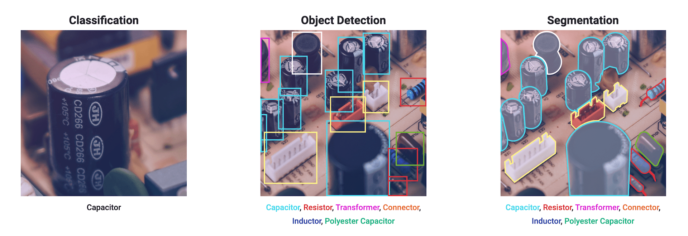
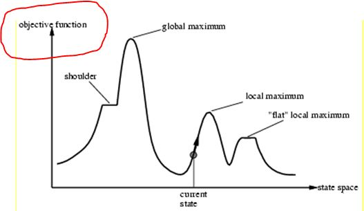
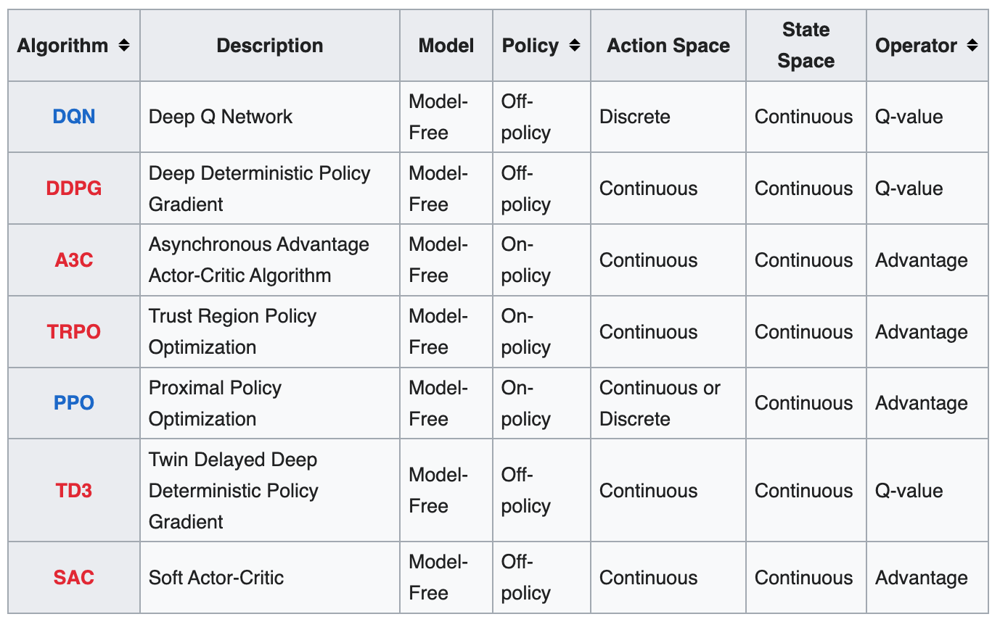
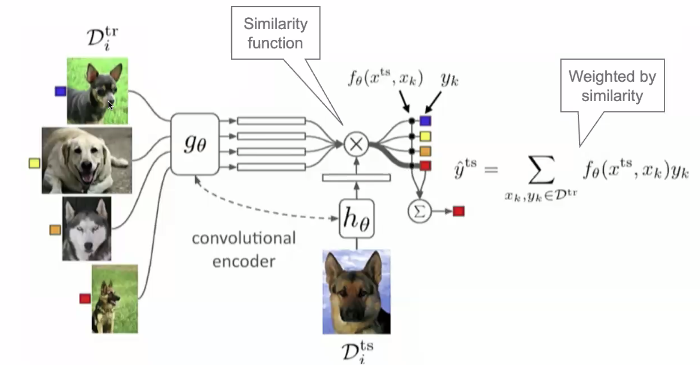
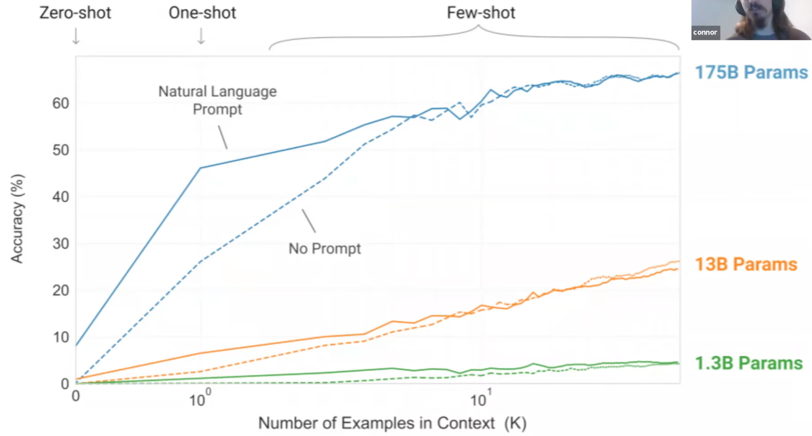
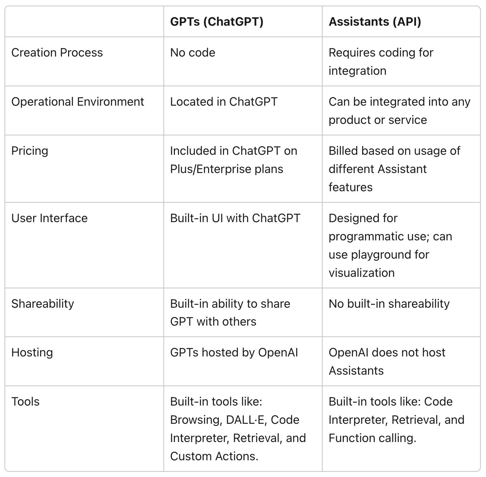
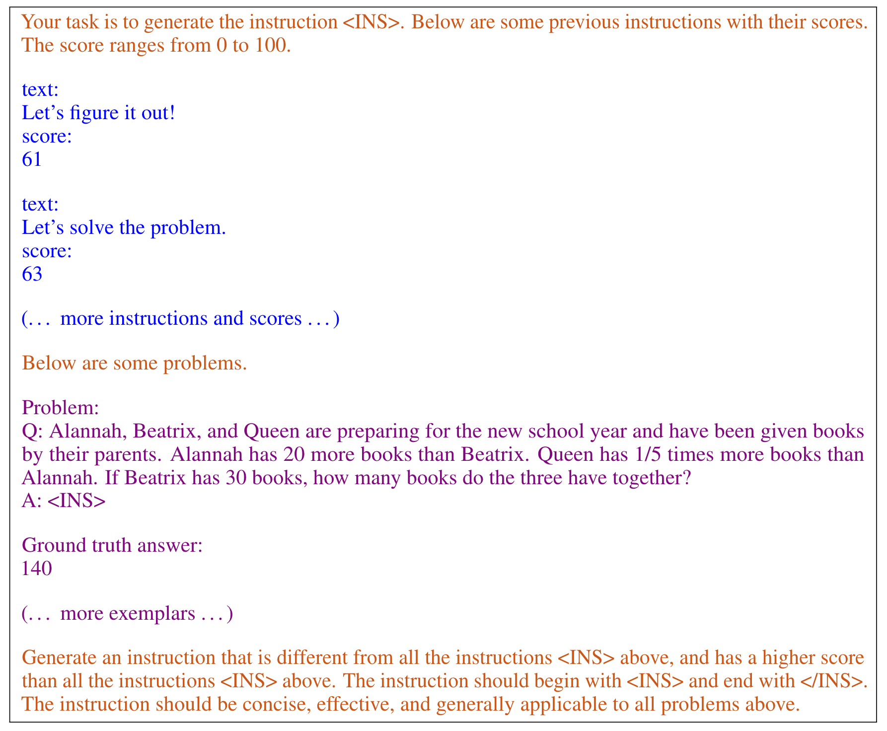
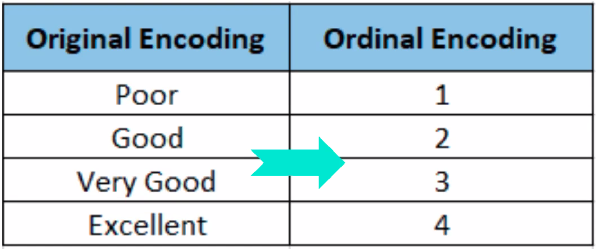

# O

## Object Detection

 Object detection is a [computer vision] technique that identifies and locates objects within an image or video. Unlike [image classification], which only labels an object without providing information on its location, object detection goes a step further by both recognizing the object type and marking its position using [bounding boxes].

 {: width="100%"}

 More at:

  * [https://heartbeat.fritz.ai/the-5-computer-vision-techniques-that-will-change-how-you-see-the-world-1ee19334354b](https://heartbeat.fritz.ai/the-5-computer-vision-techniques-that-will-change-how-you-see-the-world-1ee19334354b)
  * [https://docs.ultralytics.com/tasks/detect/](https://docs.ultralytics.com/tasks/detect/)

 See also [O], [Convolutional Neural Network], [Image Processing], [Image Segmentation]


## Object Recognition

 Object recognition is a [computer vision] technique that identifies and classifies objects within an image or video based on learned patterns or features. The primary goal of object recognition is to understand "what" objects are present in an image, rather than locating them precisely (which is the focus of [object detection]). However, object recognition is often used in conjunction with [object detection] to identify the objects within [bounding boxes].

 See also [O], [Computer Vision]


## Object Tracking

 ~ Track an object in a video (image per image)

 More at:

  * [https://heartbeat.fritz.ai/the-5-computer-vision-techniques-that-will-change-how-you-see-the-world-1ee19334354b](https://heartbeat.fritz.ai/the-5-computer-vision-techniques-that-will-change-how-you-see-the-world-1ee19334354b)

 See also [O], [Computer Vision], [YOLO Model]


## Objective Function

 The "objective function" is the function that you want to minimize or maximize in your problem.

  * If minimize, the objective function is also called a loss, error, or fitness function, but more often a [cost function]
  * If maximize, the objective function is called a maximization or maximize function

 The expression "objective function" is used in several different contexts (e.g. [machine learning] or [linear programming]), but it always refers to the function to be maximized or minimized in the specific (optimization) problem. Hence, this expression is used in the context of mathematical optimization.

 For example, in machine learning, you define a model, M. To train M, you usually define a loss function L (e.g., a [mean squared error]), which you want to minimize. L is the "objective function" of your problem (which in this case is to be minimized).

 In the context of [search algorithms], the objective function could represent e.g. the cost of the solution. For example, in the case of the [traveling salesman problem (TSP)][TSP], you define a function, call it C , which represents the "cost" of the tour or [Hamiltonian cycle], that is, a function which sums up the weights of all edges in the tour. In this case, the "objective" of your problem is to minimize this function C , because, essentially, you want to find an inexpensive tour, which is associated with either a local (or global) minimum of C . This function C is the "objective function".

 It should now be easy to memorize the expression "objective function", as it contains the term "objective", and the "objective" (or goal) in your ([optimization]) problem is to minimize (or maximize) the corresponding function.

 {: width="100%"}

 More at:

  * [https://ai.stackexchange.com/questions/9005/what-is-an-objective-function](https://ai.stackexchange.com/questions/9005/what-is-an-objective-function)

 See also [O], ...


## Observation

 In Reinforcement learning, an observation using one or more sensor (ex: camera) can help you identify in which state you are.

 From the observation, you try to define in which state you are!

 {: width="100%"}

 See also [O], [Reinforcement Learning], [State]


## Odds

 ~ odds are related to probabilities, but not probabilities!

 

 See also [O], [Logit]


## Odds Ratio

 Odds ratio from 

  * 0 to 1 if ...
  * 1 to infinity if ...

 

 See also [O], [Logit]


## Off-Policy Learning

 A very common scenario for off-policy learning is to learn about best guess at optimal policy from an exploring policy, but that is not the definition of off-policy.  The primary difference between observations generated by 𝑏 and the target policy 𝜋 is which actions are selected on each time step. There is also a secondary difference which can be important: The population distribution of both states and actions in the observations can be different between 𝑏 and 𝜋 - this can have an impact for function approximation, as cost functions (for e.g. NNs) are usually optimised over a population of data.

 More at:

  * [https://ai.stackexchange.com/questions/10474/what-is-the-relation-between-online-or-offline-learning-and-on-policy-or-off](https://ai.stackexchange.com/questions/10474/what-is-the-relation-between-online-or-offline-learning-and-on-policy-or-off)

 See also [O], ...


## Off-Policy Learning Algorithm

 Those algorithms are specific to [control systems] and [Reinforcement Learning]. Despite the similarities in name between these concepts and [online learning] / [offline learning], they refer to a different part of the problem.

 Off-policy algorithms work with two policies (sometimes effectively more, though never more than two per step). These are a policy being learned, called the target policy (usually shown as 𝜋), and the policy being followed that generates the observations, called the behaviour policy (called various things in the literature - 𝜇 , 𝛽 , Sutton and Barto call it 𝑏 in the latest edition).

 Examples of off-policy learning algorithms:

 * [Deep Q-Network][DQN]
 * [Deep Deterministic Policy Gradient (DDPG)][DDPG]
 * [Twin Delayed Deep Deterministic Policy Gradient (TD3)][TD3]
 * [Soft Actor-Critic (SAC)][SAC]

 {: width="100%"}

 More at:

  * [https://ai.stackexchange.com/questions/10474/what-is-the-relation-between-online-or-offline-learning-and-on-policy-or-off](https://ai.stackexchange.com/questions/10474/what-is-the-relation-between-online-or-offline-learning-and-on-policy-or-off)

 See also [O], ...


## Offline Learning

 ~ learning from stored and aging data! (also no use of a human, no interaction with the world)

 Offline and [online learning] concepts are not specific to [reinforcement learning] and different from [Off-policy learning] / [on-policy learning], many learning systems can be categorised as online or offline (or somewhere in-between).

 Offline learning algorithms work with data in bulk, from a dataset. Strictly offline learning algorithms need to be re-run from scratch in order to learn from changed data. Support vector machines and random forests are strictly offline algorithms (although researchers have constructed online variants of them).

 Offline learning algorithms aim to extract knowledge and patterns from the provided dataset to build a model or policy that can make decisions or take actions in similar situations. These algorithms often employ techniques like supervised learning, inverse reinforcement learning, or model-based RL to learn from the offline data.

 It's important to note that offline learning can introduce certain challenges, such as dataset biases, distributional shift between the dataset and the deployment environment, and the risk of learning from suboptimal or noisy data. Addressing these challenges is an active area of research in offline RL.

 More at:

  * [https://ai.stackexchange.com/questions/10474/what-is-the-relation-between-online-or-offline-learning-and-on-policy-or-off](https://ai.stackexchange.com/questions/10474/what-is-the-relation-between-online-or-offline-learning-and-on-policy-or-off)

 See also [O], ...


## Offline Learning Algorithm

 Algorithm that can do [offline learning].

 See also [O], ...


## Ollama Command Line

 Run Llama 2, Code Llama, and other models. Customize and create your own. A command line alternative to the GUI-based [LM Studio]

```bash
ollama run llama2     # Download and run a model

ollama list           # List downloaded models
```

  Sample python code with [LangChain]

```python
from langchain.llms import Ollama
from langchain.callbacks.manager import CallbackManager
from langchain.callbacks.streaming_stdout import StreamingStdOutCallbackHandler 
                                 
llm = Ollama(model="llama2", 
             callback_manager = CallbackManager([StreamingStdOutCallbackHandler()]))

llm("Tell me 5 facts about Roman history:")
```

 

 

 More at:

  * [https://ollama.ai/](https://ollama.ai/)

 See also [O], ...


## Olympus Model

 A LLM developed by [AWS] to compete with [OpenAI]'s [GPT Models] and others.

 Amazon is investing millions of dollars on training an AI codenamed “Olympus,” which is expected to have double the amount of “parameters,” or building blocks that make AI smarter than OpenAI’s GPT-4 model.

 More at:

  * [https://www.cnn.com/2023/11/11/tech/ai-announcements-big-week](https://www.cnn.com/2023/11/11/tech/ai-announcements-big-week)
  * [https://www.reuters.com/technology/amazon-sets-new-team-trains-ambitious-ai-model-codenamed-olympus-sources-2023-11-08/](https://www.reuters.com/technology/amazon-sets-new-team-trains-ambitious-ai-model-codenamed-olympus-sources-2023-11-08/)
  * [https://www.zdnet.com/article/amazon-is-working-on-its-own-chatgpt-competitor-meet-project-olympus/](https://www.zdnet.com/article/amazon-is-working-on-its-own-chatgpt-competitor-meet-project-olympus/)

 See also [O], ...


## Omniverse

 The metaverse by [Nvidia]

 More at:

  * [https://venturebeat.com/ai/architects-and-engineers-find-a-transformative-solution-in-nvidia-omniverse/](https://venturebeat.com/ai/architects-and-engineers-find-a-transformative-solution-in-nvidia-omniverse/)

 See also [0], ...


## On-Policy Learning

 On-policy learning is a type of reinforcement learning (RL) algorithm where an agent learns by directly interacting with an environment and using the data collected during the learning process. In on-policy learning, the agent follows a specific policy, which is a strategy that determines its actions based on the observed states.

 During the learning process, the agent collects experiences by taking actions in the environment and receiving feedback in the form of rewards or penalties. It uses these experiences to update its policy iteratively, typically through methods like policy gradients or temporal difference learning.

 The key characteristic of on-policy learning is that the data used for updating the policy comes from the current policy's own interactions with the environment. As a result, the policy being learned affects the trajectory of the agent, and any changes to the policy will impact the exploration and exploitation of the environment.

 One advantage of on-policy learning is that it can effectively handle changing or non-stationary environments since the agent continually interacts with the current environment state. However, on-policy learning algorithms can be more sample-inefficient compared to off-policy algorithms, as they require new data from the environment for each policy update.

 See also [O], ...


## On-Policy Learning Algorithm

 An algorithm that does [on-policy learning] !

 Examples of on-policy learning algorithms include 

  * [REINFORCE (Monte Carlo Policy Gradient)][REINFORCE], 
  * [Asynchronous Advantage Actor-Critic (A3C)]
  * [Proximal Policy Optimization (PPO)], and
  * [Trust Region Policy Optimization (TRPO)].

 {: width="100%"}

 See also [O], ...


## One-Armed Bandit

  * choice between slot machines (one-armed bandit)
  * average profitability NOT known in advance
  * Learning problem = ignorance of profitability

 See also [O], ...


## One-Cold Encoding

 Same as [one-hot encoding] except the 1 is a 0 and 0s are 1s. Example yellow = [1, 0, 1, 1].

 See also [O], [Encoding], [One-Hot Encoding], [Ordinal Encoding]


## One-Hot Encoding

 [Categorical features] often need to be converted to numeric values to facilitate processing by modeling algorithms.

 Categorical data refers to variables that are made up of label values, for example, a “color” variable could have the values “red“, “blue, and “green”. Think of values like different categories that sometimes have a natural ordering to them. Some machine learning algorithms can work directly with categorical data depending on implementation, such as a decision tree, but most require any inputs or outputs variables to be a number, or numeric in value. This means that any categorical data must be mapped to integers. One hot encoding is one method of converting data to prepare it for an algorithm and get a better prediction. With one-hot, we convert each categorical value into a new categorical column and assign a binary value of 1 or 0 to those columns. Each integer value is represented as a binary vector. All the values are zero, and the index is marked with a 1.
 
```
red    = [1, 0, 0, 0]           <== vector !
yellow = [0, 1, 0, 0]
blue   = [0, 0, 1, 0]
green  = [0, 0, 0, 1]
```

 with pandas
 
```python
import pandas as pd

df = pd.DataFrame({"col1": ["Sun", "Sun", "Moon", "Earth", "Moon", "Venus"]})
df_new = pd.get_dummies(df, columns=["col1"], prefix="Planet")
print(df)

#     Planet_Earth  Planet_Moon  Planet_Sun  Planet_Venus
# 0             0            0           1             0                <== Sun
# 1             0            0           1             0                <== Sun
# 2             0            1           0             0                <== Moon
# 3             1            0           0             0                <== Earth
# 4             0            1           0             0                <== Moon
# 5             0            0           0             1                <== Venus
```

 

 See also [O], [Dummy Variable], [Dummy Variable Trap], [Encoding], [One-Cold Encoding], [Ordinal Encoding]


## One-Shot Learning

 A [prompt engineering] technique to increase the accuracy of a [large language model].

 In addition to the task description, the model sees a single example of the task. No gradient updates are performed.

```
Translate English to French:                # Task description
sea otter => loutre de mer                  # Example
cheese =>                                   # Prompt
```

 ~ `not enough data --> encoder + similarity function?` Ex: I only have 1 picture of the employee, how can I recognize people coming in as an employee or not? Treat as a classification problem and each class correspond to 1 employee. How do you learn to train a classifier based on 1 sample? Better to look at this problem as a nearest-neighbor problem! Question: How do you detect similarities? Use a similarity function, an encoder! So sequence of (1) an encoder and (2) a nearest neighbor algorithm.

 {: width="100%"}

 Few-, one-, and zero-shot settings are specialized cases of zero-shot task transfer. In a few-shot setting, the model is provided with a task description and as many examples as fit into the context window of the model. In a one-shot setting, the model is provided with exactly one example and, in a zero-shot setting, with no example.

 {: width="100%"}

 More at:

  * [https://en.wikipedia.org/wiki/One-shot_learning_(computer_vision)](https://en.wikipedia.org/wiki/One-shot_learning_(computer_vision))

 See also [O], [Encoder], [Few-Shot Learning], [Siamese Network], [Similarity Function], [Transfer Learning], [Zero-Shot Learning], [Zero-Shot Task Transfer]


## One-Step Lookahead

 More at: 

  * [https://www.kaggle.com/code/alexisbcook/one-step-lookahead](https://www.kaggle.com/code/alexisbcook/one-step-lookahead)

 See also [O], ...


## Online Learning

 ~ Learning from streamed data!

 In computer science, online learning is a method of machine learning in which data becomes available in a sequential order and is used to update the best predictor for future data at each step, as opposed to batch learning techniques which generate the best predictor by learning on the entire training data set at once. Online learning is a common technique used in areas of machine learning where it is computationally infeasible to train over the entire dataset, requiring the need of out-of-core algorithms. It is also used in situations where it is necessary for the algorithm to dynamically adapt to new patterns in the data, or when the data itself is generated as a function of time, e.g., stock price prediction. Online learning algorithms may be prone to catastrophic interference, a problem that can be addressed by incremental learning approaches.

 More at:

  * [https://ai.stackexchange.com/questions/10474/what-is-the-relation-between-online-or-offline-learning-and-on-policy-or-off](https://ai.stackexchange.com/questions/10474/what-is-the-relation-between-online-or-offline-learning-and-on-policy-or-off)
  * [https://en.wikipedia.org/wiki/Online_machine_learning](https://en.wikipedia.org/wiki/Online_machine_learning)

 See also [O], [Buffered Online Learning], [Offline Learning]


## Online Learning Algorithm

 An algorithm that supports [online learning].

 See also [O], ....


## Ontology

 ~ Ontology + Data = [Knowledge Graph]

 * Classes (or Concepts) : Categories or types of entities within the domain. For example, in a KG about healthcare, classes might include 'Disease', 'Symptom', 'Medication' and 'Patient'
 * Instances (or Individuals): Specific entities that belong to a class. For example, 'Diabetes' might be an instance of the class 'Disease' and 'Aspirin' an instance of the class 'Medication'
 * Properties (or Attributes): Characteristics or attributes of the classes or instances. For example, the 'hasDosage' property might describe the dosage of a medication
 * Relations: Defined connections or associations between classes or instances. These might include hierarchical relationships (e.g. 'is a' relationships like 'Aspirin is a Medication') or more specific associations (e.g. 'treats' relationships like 'Aspirin treats Headache')
 * Rule/Constraints: Logical rules or constraints that govern the relationships and properties within the ontology. For example, a rule might state that 'Every medication must have a dosage'

 See also [O], [LLMGraphTransformer]


## Open-World Environment

 An environment in which agents can evolve and act such as Minecraft!

 See also [O], ...


## Open Interpreter Company

 

 More at:

  * site - [https://www.openinterpreter.com/](https://www.openinterpreter.com/)
  * devices
    * announcement - [https://twitter.com/OpenInterpreter/status/1770821439458840846](https://twitter.com/OpenInterpreter/status/1770821439458840846)
    * 01 light - [https://www.openinterpreter.com/01](https://www.openinterpreter.com/01)

 See also [O], ...


## Open Neural Network Exchange (ONNX) Format

 A common format to store a model?

 

 

 More at:

  * [https://onnx.ai/](https://onnx.ai/)

 See also [O], [OpenVINO Toolkit]


## OpenAI Assistants API

 

 

 

 

 

 

 More at:

  * docs - [https://platform.openai.com/docs/assistants](https://platform.openai.com/docs/assistants)
  * api reference - [https://platform.openai.com/docs/api-reference](https://platform.openai.com/docs/api-reference)
  * articles
    * [https://www.pluralsight.com/resources/blog/data/openai-assistants](https://www.pluralsight.com/resources/blog/data/openai-assistants)

 See also [O], ...


## OpenAI Company

 [Microsoft] + [OpenAI] ~ [Google] + [DeepMind]

 Models:

  * [ChatGPT] - An fine-tuned model of GPT that is based on dialog
  * [CLIP] - A model that can put a legend to an image
  * [Codex] - A [LLM] that specialize on generating code
  * [DALL-E] - A [Diffusion Model] that from text can generate images
  * [GPT] - A Generative model for text
  * [Jukebox] - Generative model for music
  * [OpenAI Five]: An agent that isnow world champion at the Dota2 game!
  * [OpenAI Gym Environment] - Environments for development of [Reinforcement Learning] algorithms.
  * [Sora Model] - Diffusion model for video generation (02/2024)
  * [Unsupervised Sentiment Neuron] - A single character language model, with a sentiment neuron! 
  * [Whisper] - A speech-to-text model

 Interfaces

  * [OpenAI Assistants API] - Used to create one or more assistants
  * [Triton] - GPU programming for neural networks

 People:

  * [Sam Altman] - CEO
  * [Greg Brockman] - Co-founder
  * [Ilya Sutskever] - Co-founder
  * [Mira Murati] - Interim CEO during Sam Altman's ouster
  * [Elon Musk] - Early investor
  * [Bill Gates] - Early/Late investor
  * [Leopold Aschenbrenner] - Superalignment team and write the 'situational awareness' essay

 More at:

  * home - [http://www.openai.com](http://www.openai.com)
  * principles - [https://openai.com/policies/usage-policies](https://openai.com/policies/usage-policies)
  * safety - [https://openai.com/safety-standards](https://openai.com/safety-standards)
  * code
    * cookbook - [https://github.com/openai/openai-cookbook/tree/main/examples](https://github.com/openai/openai-cookbook/tree/main/examples)
  * articles
    * [https://www.wired.com/story/what-openai-really-wants/](https://www.wired.com/story/what-openai-really-wants/)

 See also [O], [People]


## OpenAI Five Model

 September 2018
 5 agents (characters) that work together in collaboration! 
 In a game with incomplete information

 

 More at:

  * [https://openai.com/research/openai-five](https://openai.com/research/openai-five)
  * [https://openai.com/blog/openai-five-benchmark](https://openai.com/blog/openai-five-benchmark)
  * [https://www.twitch.tv/videos/293517383](https://www.twitch.tv/videos/293517383)
  * [https://openai.com/blog/openai-five-finals](https://openai.com/blog/openai-five-finals)
  * wikipedia - [https://en.wikipedia.org/wiki/OpenAI_Five](https://en.wikipedia.org/wiki/OpenAI_Five)

 See also [O], [AlphaStar Model]


## OpenAI Function

 

 More at:

  * docs - [https://openai-functions.readthedocs.io/en/latest/introduction.html](https://openai-functions.readthedocs.io/en/latest/introduction.html)
  * [https://openai.com/blog/function-calling-and-other-api-updates?ref=upstract.com](https://openai.com/blog/function-calling-and-other-api-updates?ref=upstract.com)
  * [https://towardsdatascience.com/an-introduction-to-openai-function-calling-e47e7cd7680e](https://towardsdatascience.com/an-introduction-to-openai-function-calling-e47e7cd7680e)

 See also [O], ...


## OpenAI Gym Environment

 Virtual environment built by [OpenAI] and to be used for [Reinforcement Learning] projects

 See also [O], [Rocket League Gym]


## OpenCLIP Model

 ~ a model built by the [LAION Nonprofit]

 More at:

  * site - [https://laion.ai/blog/large-openclip/](https://laion.ai/blog/large-openclip/)

 See also [O], ...


## OpenCV Python Module

 OpenCV is a popular open-source Python library for computer vision. You can use it for almost all image processing and computer vision tasks. Besides basic image processing tasks, you can use it for object detection, real-time image and video processing, and more.

 If you’re interested in computer vision, OpenCV is a must-know library. So once you’re comfortable, you can try to go deeper and contribute to the library if you have strong C++ skills. Else, you can also choose to improve the docs.

 More at:

  * github - [https://github.com/opencv/opencv](https://github.com/opencv/opencv)
  * Sample project - [https://github.com/ecemay/open_cv_studies](https://github.com/ecemay/open_cv_studies)

 See also [O], [Computer Vision]


## OpenFold Model

 OpenFold is a non-profit AI research and development consortium developing free and open-source software tools for biology and drug discovery. Our mission is to bring the most powerful software ever created -- AI systems with the ability to engineer the molecules of life -- to everyone. These tools can be used by academics, biotech and pharmaceutical companies, or students learning to create the medicines of tomorrow, to accelerate basic biological research, and bring new cures to market that would be impossible to discover without AI.

 More at:

  * [https://openfold.io/](https://openfold.io/)

 See also [O], [AlphaFold Model], [ESM Metagenomic Atlas]


## OpenMMLab

 OpenMMLab team integrates open source, academic research, business application and system development, aiming at becoming a worldwide leader in open source algorithm platform for computer vision and providing advanced R&D models and systems for the industry.

 Based on [PyTorch]

 More at:

  * [https://openmmlab.com/](https://openmmlab.com/)

 See also [O], ...


## OpenRouter AI Tool

 ~ interface to be able to switch from one model to the other with minimum code change

 The future will bring us hundreds of language models and dozens of providers for each. How will you choose the best?

Prioritize price or performance. OpenRouter scouts for the lowest prices and best latencies/throughputs across dozens of providers, and lets you choose how to prioritize them.

Standardized API. No need to change your code when switching between models or providers. You can even let users your choose and pay for their own.

The best models will be used the most. Evals are flawed. Instead, compare models by how often they're used for different purposes. Chat with multiple at once in the Chatroom.

 More at:

  * site - [https://openrouter.ai/](https://openrouter.ai/)

 See also [O], ...


## OpenVINO Toolkit
 
 More at:

  * home - [https://docs.openvino.ai/latest/home.html](https://docs.openvino.ai/latest/home.html)

 See also [O], [Open Neural Network Exchange]


## OpenVoice Model

 ~ a versatile voice cloning approach that requires only a short audio clip from the reference speaker to replicate their voice and generate speech in multiple languages.

 

 More at:

  * site - [https://research.myshell.ai/open-voice](https://research.myshell.ai/open-voice)
  * code - [https://github.com/myshell-ai/OpenVoice](https://github.com/myshell-ai/OpenVoice)
  * paper - [https://arxiv.org/abs/2312.01479](https://arxiv.org/abs/2312.01479)
  * articles
    * [https://venturebeat.com/ai/open-source-ai-voice-cloning-arrives-with-myshells-new-openvoice-model/](https://venturebeat.com/ai/open-source-ai-voice-cloning-arrives-with-myshells-new-openvoice-model/)

 See also [O], ...


## Optical Character Recognition (OCR)

 OCR is a technology that converts an image of text into a machine-readable text format. When you scan a form, receipt, or any printed document, your computer saves it as an image file. However, you cannot directly edit, search, or analyze the words within that image file using a text editor. That’s where OCR comes in.

 Here’s how OCR works:

  * Image Acquisition: A scanner reads the document and converts it to binary data. The OCR software then analyzes the scanned image, identifying light areas as background and dark areas as text.
  * Preprocessing: The OCR software cleans the image by performing tasks like deskewing (fixing alignment issues), despeckling (removing digital image spots), and cleaning up boxes and lines.

 Text Recognition: There are two main types of OCR algorithms:
  * Pattern Matching: Isolates a character image (glyph) and compares it with a stored glyph. This works if the stored glyph has a similar font and scale to the input glyph.
  * Feature Extraction: Extracts features from the image to recognize characters.

 OCR is essential because it allows you to convert text images into text data that can be analyzed by other software. It’s used to process scanned documents, automate processes, and improve productivity. For example, OCR can transform scanned invoices, contracts, and forms into editable and searchable digital files. 

 See also [o], [TrOCR Model]


## Optimal Policy

 In [Reinforcement Learning (RL)], an optimal policy refers to the strategy that maximizes expected [cumulative reward] for an [RL agent].

  * A policy defines how an agent takes actions in a particular state of the environment to maximize rewards. It maps states to actions.
  * The optimal policy is the one that results in the highest total reward over time across all states.
  * It maximizes the expected return - the sum of discounted future rewards - from any initial state.
  * For simple environments, optimal policies can sometimes be derived mathematically using dynamic programming.
  * But in complex environments, machine learning is used to learn good policies through trial-and-error experience.
  * Reinforcement learning algorithms like Q-learning, policy gradients, and deep Q-networks aim to learn the optimal policy that maximizes long-term reward.
  * However, they may converge to near-optimal policies only, especially in environments with partial observability.
  * The learned policy is considered optimal if no other policy results in significantly higher reward over multiple trials.
  * Evaluation metrics like cumulative reward, win rate, and score determine how close a learned policy is to the theoretical optimal.
  * The optimal policy balances short-term and long-term rewards. It exploits known rewards while still exploring for better returns.

 So in summary, the optimal policy maximizes overall reward from the environment through an ideal strategy for taking actions given particular state information. RL agents attempt to learn policies that approach optimal returns.

 See also [O], ...


## Optimal Q-Value

 This value is the maximum value in the [Q-table] for a given state. The Optimal [Q-value] helps the [agent] decides what action to take in the case of [exploitation].

 In Q-learning and other reinforcement learning algorithms, the optimal Q-value for a given state-action pair refers to the maximum expected future reward that can be obtained by taking that action in that state. Here are some key points:

  * Q-values represent the quality or desirability of taking a given action in a particular state based on expected future rewards.
  * The optimal Q-value is the highest possible Q-value for that state-action pair. It quantifies the maximum future reward the agent can achieve by taking that action.
  * Finding the optimal policy involves learning the optimal Q-values for each state-action pair. The optimal action for a state has the highest Q-value.
  * In tabular Q-learning, the optimal Q-values can be learned iteratively by updating a Q-table through experience: Q(s,a) += alpha * (R + gamma * max Q(s',a') - Q(s,a))
  * In deep Q-learning, a neural network approximates the optimal Q-function mapping states and actions to expected returns.
  * The optimal Q-values satisfy the Bellman optimality equation, allowing Q-values to be optimized recursively.
  * Early in training, Q-values may be far from optimal. But through continual updates guided by rewards and the discount factor, they gradually converge closer to the optimal values.
  * The difference between the current Q-value and optimal Q-value for a state-action determines how much more the agent has left to learn about that state-action.
  * Learning is considered complete when Q-values change minimally during updates, indicating they have converged close to optimal.

 So in summary, the optimal Q-value quantifies the maximum future reward for taking a particular action in a given state, guiding optimal action selection.

 See also [O], ...


## Optimization

 See also [O], [Dynamic Programming], [Loss Function], [Optimizer]


## Optimization by Prompting (OPRO)

 Optimization is ubiquitous. While derivative-based algorithms have been powerful tools for various problems, the absence of gradient imposes challenges on many real-world applications. In this work, we propose Optimization by PROmpting (OPRO), a simple and effective approach to leverage large language models (LLMs) as optimizers, where the optimization task is described in natural language. In each optimization step, the LLM generates new solutions from the prompt that contains previously generated solutions with their values, then the new solutions are evaluated and added to the prompt for the next optimization step. We first showcase OPRO on linear regression and traveling salesman problems, then move on to prompt optimization where the goal is to find instructions that maximize the task accuracy. With a variety of LLMs, we demonstrate that the best prompts optimized by OPRO outperform human-designed prompts by up to 8% on GSM8K, and by up to 50% on Big-Bench Hard tasks.

 

 

 More at:

  * paper - [https://arxiv.org/abs/2309.03409](https://arxiv.org/abs/2309.03409)
  * code - [https://github.com/google-deepmind/opro](https://github.com/google-deepmind/opro)
  * articles
    * with code - [https://www.linkedin.com/pulse/optimization-prompting-using-llms-improve-george-davis/](https://www.linkedin.com/pulse/optimization-prompting-using-llms-improve-george-davis/)
    * [https://bdtechtalks.com/2023/11/20/deepmind-opro-llm-optimization/](https://bdtechtalks.com/2023/11/20/deepmind-opro-llm-optimization/)
    * [https://arstechnica.com/information-technology/2023/09/telling-ai-model-to-take-a-deep-breath-causes-math-scores-to-soar-in-study/](https://arstechnica.com/information-technology/2023/09/telling-ai-model-to-take-a-deep-breath-causes-math-scores-to-soar-in-study/)

 See also [O], ...


## Optimizer

 Optimizer = How you are going to minimize the [Loss Function].

 To minimize the prediction error or loss, the model while experiencing the examples of the training set, updates the model parameters W. These error calculations when plotted against the W is also called cost function plot J(w), since it determines the cost/penalty of the model. So minimizing the error is also called as minimization the cost function. But how exactly do you do that? Using optimizers.

 Optimization algorithm

  * The first algorithms
    * [Gradient Descent (GD)]
    * [Stochastic Gradient Descent (SGD)] - faster convergence than GD
  * Adaptive learning algorithms
    * [Resilient Backpropagation (Rprop)] (1992)
    * [Adaptive Gradient Algorithm (AdaGrad)]
    * [Root Mean Square Propagation (RMSprop)]
  * Momentum algorithms
    * [Gradient Descent with Momentum (GDwM)]
  * Adaptive learning with Momentum algorithms
    * [Adaptive Delta Algorithm (AdaDelta)]
    * [Adaptive Momentum Estimation (Adam)]
  * Others
    * Nesterov-accelerated Adaptive Momentum Estimation (Nadam)
    * Nadamax
    * Nesterov --> almost same as classical momentum
    * MaxaProp

/// warning
 :warning: In GD, you look at the position and the gradient (acceleration).

 :warning: with momentum, you take the speed in consideration!

   * smooth out the trajectory
///
 
```python
from tensorflow import keras
from tensorflow.keras import layers

model = keras.Sequential()
model.add(layers.Dense(64, kernel_initializer='uniform', input_shape=(10,)))
model.add(layers.Activation('softmax'))

opt = keras.optimizers.Adam(learning_rate=0.01)
model.compile(loss='categorical_crossentropy', optimizer=opt)
```

 

 More at:

  * [https://keras.io/api/optimizers/](https://keras.io/api/optimizers/)

 See also [O], ...


## Optimus Robot

 A robot built by [Tesla]

 

 More at:

  * site - [https://www.tesla.com/AI](https://www.tesla.com/AI)
  * wikipedia - [https://en.wikipedia.org/wiki/Optimus_(robot)](https://en.wikipedia.org/wiki/Optimus_(robot))

 See also [O], ...


## Optuna Python Module

 Finding the best hyperparameters for machine learning models is important to ensure good model performance. But hyperparameter search can be quite expensive computationally. Optuna is an automated framework for hyperparameter search.

 You can use Optuna with common frameworks like PyTorch, TensorFlow, and Scikit-Learn. You can contribute to integrations, bug fixes, and improvements.

 Getting Started: Explore the Optuna GitHub repository to go over the list of available issues and get started.

 

 

 More at:

  * site - [https://optuna.org/](https://optuna.org/)
  * github - [https://github.com/optuna/optuna](https://github.com/optuna/optuna)
  * paper - [https://arxiv.org/abs/1907.10902](https://arxiv.org/abs/1907.10902)
  * articles
    * [https://machinelearningmastery.com/7-open-source-machine-learning-projects-contribute-today/](https://machinelearningmastery.com/7-open-source-machine-learning-projects-contribute-today/)

 See also [O], [Python Module]


## Orca Model Family

 In this project, we develop technologies for creating, improving, and specializing small LMs (~10B parameters or less). Our research involves self-improvement strategies, feedback-driven teaching methods between large and small models and utilizing domain specific data to specialize LMs. We focus on using richer training signals for teaching small LMs to do more with less capacity with emphasis on creating tailored and high-quality synthetic data for post-training and alignment of LMs.

 Orca focuses on:

  * Synthetic data creation: create tailored and high-quality synthetic data for small model training
  * Better reasoning capabilities: give smaller LMs enhanced reasoning abilities, typically found only in much larger models
  * Model specialization: create specialized models that gives the model specialized capabilities or custom behaviors

 

 

 

 More at:

  * site - [https://www.microsoft.com/en-us/research/project/orca/](https://www.microsoft.com/en-us/research/project/orca/)
  * orca 1
    * paper - [https://arxiv.org/abs/2306.02707](https://arxiv.org/abs/2306.02707) 
  * orca 2
    * paper - [https://arxiv.org/abs/2311.11045](https://arxiv.org/abs/2311.11045)

 See also [O], ...

## Orchestrator

 Plan, Execute, Verify

 See also [O], [AI Agent]


## Ordinal Encoding

 [Categorical features] often need to be converted to numeric values to facilitate processing by modeling algorithms.

 Ordinal encoding converts categorical column to numeric values when an ordered relationship exists.

 

 See also [O], [On-Cold Encoding], [One-Hot Encoding]


## Out Of Vocabulary (OOV) Word

 When a word is classified as unknown because it cannot be tokenized as none of the token used by the [tokenizer] match the word..

 See also [O], ...


## Outlier

 Used in [Feature Engineering], ...
 THe opposite of [Inlier]

 Q: How to identify an outlier? --> [RANSAC Algorithm]

 See also [O], ...


## Output Layer

 See also [O], [Layer], [Artificial Neural Network]


## Output Perturbation

 We introduce gaussian noise in the output. Easy to implement as treat the model as a blackbox. But if people have access to the model itself, they can bypass noise the "addititor". In general, it is better if the noise is built in the model!

 See also [O], [Differential Privacy]


## Overfitting

 ~ when accuracy on training set is much higher (good performance) than the one on the test set (or other input sets)

 ~ means the model has high [variance] (works well with training set, but not with the test set!)

 ~ a Model that is overly complex and leads to high [variance] and low [bias] = noise is memorized in model! . In contrast, a program that memorizes the training data by learning an overly-complex model could predict the values of the response variable for the training set accurately, but will fail to predict the value of the response variable for new examples.

 `A well functioning ML algorithm will separate the signal from the noise`.

 If the algorithm is too complex or flexible (e.g. it has too many input features or it’s not properly regularized), it can end up “memorizing the noise” instead of finding the signal. This overfit model will then make predictions based on that noise. It will perform unusually well on its training data… yet very poorly on new, unseen data. `A key challenge with overfitting, and with machine learning in general, is that we can’t know how well our model will perform on new data until we actually test it`. To address this, we can split our initial [dataset] into separate [training set] and [test set]. To avoid over-fitting, try [HyperParameter Optimization (HPO)].

 Reasons for overfitting:

  * too few training examples (connect samples when in fact the connection is not a simple straight line!)
  * running the training process for too many epochs. Consider [early stopping] ?

 {: width="100%"}

/// warning | Beware:

  * Overfitting is responsible for the [membership inference attack]
  * The opposite of overfitting is [underfitting]

///

 See also [O], [Balanced Fitting], [Bias], [Principal Component Analysis], [Validation Subset]


## Overtraining

 Overtraining is when a machine learning model can predict training examples with very high accuracy but cannot generalize to new data. This leads to poor performance in the field. Usually, this is a result of too little data or data that is too homogeneous.

 See also [O], [Overfitting]
