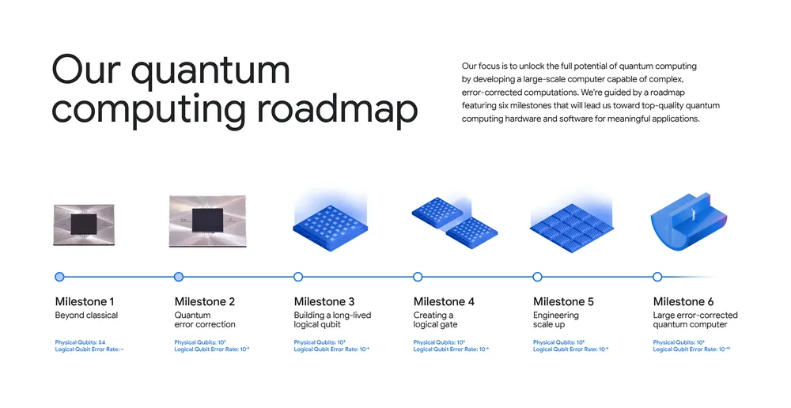

# Q

## Q-Function

 See also [Q], ...


## Q-Learning Algorithm

 Q-learning is a [reinforcement learning algorithm] that enables an agent to learn an optimal policy for making decisions in an [environment]. It is specifically designed for problems with discrete [state] and [action] spaces.

 In Q-learning, the agent learns by iteratively updating a value function called the Q-function, which represents the expected cumulative reward for taking a particular action in a given state. The [Q-function] is represented as a table or a function that maps state-action pairs to their corresponding [Q-values].

 During the learning process, the [RL agent] interacts with the environment by taking [actions] based on its current [policy]. After each [action], it receives a [reward] and transitions to a new [state]. The [RL agent] updates the [Q-value] of the previous state-action pair using the [reward] received and the estimated maximum [Q-value] of the possible [actions] in the next [state].

 The Q-learning algorithm uses a form of temporal difference learning known as the [Bellman equation] to update [Q-values]. By repeatedly updating the [Q-values] over multiple iterations, the [RL agent] gradually converges towards the [optimal Q-values], which lead to the best possible [policy] for maximizing long-term rewards.

 Once the [Q-values] have converged or reached a satisfactory level of performance, the [RL agent] can use the learned [Q-function] to determine the best [action] to take in any given state. This allows the [RL agent] to make optimal decisions and solve the [reinforcement learning] problem in the [environment].

 Q-learning has been successfully applied in various domains, including game playing, robotics, and [control systems], where an [RL agent] needs to learn from trial-and-error interactions to achieve a specific goal.

 More at:

  * code - [https://github.com/simoninithomas/Deep_reinforcement_learning_Course/tree/master/Q%20learning](https://github.com/simoninithomas/Deep_reinforcement_learning_Course/tree/master/Q%20learning)

 See also [Q], [Deep Q-Learning]


## Q-Network

 See [Deep Q-Network]


## Q-Star Model

 A rumored model developed by [OpenAI] that has achieve [AGI]
 
 This model is supposedly based on [Q-Learning] and [A-Star]

 

 See also [Q], ...


## Q-Table

 The Q-Table is updated during the environment exploration. The Q-Table is used as is during the environment exploitation.

 {: width="100%"}

 Reinforcement Learning involves managing state-action pairs and keeping a track of value (reward) attached to an action to determine the optimum policy. This method of maintaining a state-action-value table is not possible in real-life scenarios when there are a larger number of possibilities. Instead of utilizing a table, we can make use of Neural Networks to predict values for actions in a given state.

 See also [Q], ...


## Q-Value

 The cell value in the [Q-table] that correspond for the state-action pair. Note that the Q-value is [reward] + discounted Q-value (or future rewards) for expected destination state.

/// warning |
  * At initialization, all Q-values in the Q-tables are initialized at 0, because nothing is known about the environment.
  * In Contrast to Reward, which implies a short-term gain, Value refers to the long-term return with discount.
///

 See also [Q], [Optimal Q-Value]


## Q-Value Function

 The q-value function, or action-value function, is a core concept in reinforcement learning. Here are some key points:

  * For a given state s and action a, the q-value q(s,a) represents the expected future reward for taking action a from state s.
  * More formally, it gives the expected discounted return starting from s, taking a, and following the optimal [policy] thereafter.
  * The optimal q-function q*(s,a) gives the maximum attainable q-value for each [state-action pair] by following the optimal policy.
  * Q-learning and other RL algorithms aim to learn good approximations of the optimal q-function. This allows identifying the best action in any state.
  * With a learned q-function, the [agent] can achieve optimal behavior by simply selecting the [action] with the highest q-value in each [state].
  * The optimal q-function satisfies the [Bellman equation], allowing [q-values] to be updated recursively in RL algorithms.
  * [Deep Q-Networks (DQN)][DQN] use neural networks to approximate q-values for problems with large state spaces like Atari games.
  * The max operator in the Bellman equation induces overestimation bias during q-learning, which algorithms aim to correct.

 So in summary, the q-value function is key for reinforcement learning agents to evaluate long-term returns and identify optimal actions in each state. Learning q-values is a core RL technique.

 See also [Q], ...


## Q-Value Loss Function

```
Loss = converged_Q-Value - optimum_Q-value          <== but do we know converged_Q-value ???!??
```

 See also [Q], [Huber Loss Function]


## Quadratic Regression

 See also [Q], [Polynomial Regression], [Regression]


## Quantization

 LLMs like GPT-3 typically store their parameters as floating-point values. At half-precision, each parameter occupies two bytes, leading to a model the size of GPT-3 requiring hundreds of gigabytes of memory. Quantization, a [model compression] technique, converts these parameters into single-byte or smaller integers, significantly reducing the size of an LLM.

 Quantization has gained popularity as it enables open-source LLMs to run on everyday devices like laptops and desktop computers. GPT4All and Llama.cpp are two notable examples of quantized LLMs that have leveraged this technique effectively.

 Quantization can be applied at various stages of the model’s training cycle:

  * [Quantization-Aware Training (QAT)]
  * [Quantization-Aware Fine-Tuning (QAFT)]
  * [Post-Training Quantization (PTQ)]

 More at:

  * [https://bdtechtalks.com/2023/09/18/what-is-llm-compression/](https://bdtechtalks.com/2023/09/18/what-is-llm-compression/)

 See also [Q], ...

## Quantization Error

 Quantization error is the difference between the analog signal and the closest available digital value at each sampling instant from A/D converter. Quantization error also introduces noise,to the sample signal. Relations The higher the resolution of A/D converter, the lower the quantization error and the smaller the quantization noise.


## Quantization-Aware Fine-Tuning (QAFT)

 A [quantization] method that is another approach where a pre-trained high-precision model is adapted to maintain its quality with lower-precision weights. Techniques like [QLoRA] and [parameter-efficient and quantization-aware adaptation (PEQA)][PEQA] are commonly used for QAFT.

 More at:

  * [https://bdtechtalks.com/2023/09/18/what-is-llm-compression/](https://bdtechtalks.com/2023/09/18/what-is-llm-compression/)

 See also [Q], [Model Compression]


## Quantization-Aware Training

 A [quantization] method where quantization is integrated into the training process. This approach allows the model to learn low-precision representations from the start, mitigating the precision loss caused by quantization. However, the downside of QAT is that it requires training the model from scratch, which can be resource-intensive and costly.

 More at:

  * [https://bdtechtalks.com/2023/09/18/what-is-llm-compression/](https://bdtechtalks.com/2023/09/18/what-is-llm-compression/)

 See also [Q], [Model Compression]


## Quantization-Aware Training (QAT)

 See also [Q], ...


## Quantized And Low-Rank Adaptation (QLoRA) Fine-Tuning

 ~ An improved version of [LoRA fine-tuning] that can run on a single [GPU]

 We present QLoRA, an efficient finetuning approach that reduces memory usage enough to finetune a 65B parameter model on a single 48GB GPU while preserving full 16-bit finetuning task performance. QLoRA backpropagates gradients through a frozen, 4-bit quantized pretrained language model into Low Rank Adapters~(LoRA). Our best model family, which we name Guanaco, outperforms all previous openly released models on the Vicuna benchmark, reaching 99.3% of the performance level of ChatGPT while only requiring 24 hours of finetuning on a single GPU. QLoRA introduces a number of innovations to save memory without sacrificing performance: (a) 4-bit NormalFloat (NF4), a new data type that is information theoretically optimal for normally distributed weights (b) double quantization to reduce the average memory footprint by quantizing the quantization constants, and (c) paged optimziers to manage memory spikes. We use QLoRA to finetune more than 1,000 models, providing a detailed analysis of instruction following and chatbot performance across 8 instruction datasets, multiple model types (LLaMA, T5), and model scales that would be infeasible to run with regular finetuning (e.g. 33B and 65B parameter models). Our results show that QLoRA finetuning on a small high-quality dataset leads to state-of-the-art results, even when using smaller models than the previous SoTA. We provide a detailed analysis of chatbot performance based on both human and GPT-4 evaluations showing that GPT-4 evaluations are a cheap and reasonable alternative to human evaluation. Furthermore, we find that current chatbot benchmarks are not trustworthy to accurately evaluate the performance levels of chatbots. A lemon-picked analysis demonstrates where Guanaco fails compared to ChatGPT. We release all of our models and code, including CUDA kernels for 4-bit training.

 

 

 

 

 More at:

  * paper - [https://arxiv.org/abs/2305.14314](https://arxiv.org/abs/2305.14314)
  * github - [https://github.com/artidoro/qlora](https://github.com/artidoro/qlora)
  * ARticle(s)
    *4-bit quatization - [https://huggingface.co/blog/4bit-transformers-bitsandbytes](https://huggingface.co/blog/4bit-transformers-bitsandbytes)
    * github - [https://github.com/huggingface/blog/blob/main/4bit-transformers-bitsandbytes.md](https://github.com/huggingface/blog/blob/main/4bit-transformers-bitsandbytes.md)
    * colab - [https://colab.research.google.com/drive/1BiQiw31DT7-cDp1-0ySXvvhzqomTdI-o?usp=sharing](https://colab.research.google.com/drive/1BiQiw31DT7-cDp1-0ySXvvhzqomTdI-o?usp=sharing)

 See also [Q], ...


## Quantized Signal

 {: width="100%"}

 See also [Q], [Quantizer]


## Quantizer

 {: width="100%"}

 See also [Q], [Quantized Signal]


## Quantum Advantage

 ~ refers to the point where [quantum computers] perform tasks more efficiently or cost-effectively than classical computers for practical, real-world applications. Unlike [quantum supremacy], which is about demonstrating raw computational superiority for specific theoretical problems, quantum advantage focuses on delivering tangible benefits in solving useful problems.

 | Aspect	    | Quantum Supremacy	| Quantum Advantage |
 | ---          | ---               | ---               |
 | Definition   | Quantum computers outperform classical ones on specific, abstract tasks. | Quantum computers provide a practical advantage for real-world applications.|
 | Scope        | Demonstration-focused, often on problems of limited practical value. | Application-focused, solving useful problems in industries like healthcare, finance, and logistics.|
 | Milestone    | A proof of concept showcasing computational superiority. | A step toward widespread adoption of quantum computing. |
 | Practicality	| Not necessarily practical or applicable to industry. | Direct impact on solving real-world challenges. |

 {: width="100%"}

 More at:

  * [https://blog.google/technology/research/google-willow-quantum-chip/](https://blog.google/technology/research/google-willow-quantum-chip/)

 See also [Q], ...


## Quantum AI

 See also [Q], [Quantum Machine Learning]


## Quantum Computer

 * 1994 - Shor's algorithm and cryptography standards

 

 More at:

  * willow - [https://blog.google/technology/research/behind-the-scenes-google-quantum-ai-lab/](https://blog.google/technology/research/behind-the-scenes-google-quantum-ai-lab/)

 See also [Q], [Quantum AI]


## Quantum Machine Learning (QML)

 See also [Q], ...


## Quantum Supremacy

 ~ the point at which a [quantum computer] can perform a calculation that is practically impossible for classical computers to achieve in any reasonable amount of time. It marks a significant milestone in quantum computing, demonstrating that quantum machines can solve specific problems faster than even the most powerful supercomputers.

 In essence, quantum supremacy is a pivotal benchmark showing the capabilities of quantum technology, though it is only an early step toward broader applications.

 {: width="100%"}

 More at:

  * [https://blog.google/technology/research/google-willow-quantum-chip/](https://blog.google/technology/research/google-willow-quantum-chip/)

 See also [Q], ...


## Question Answering (QA)

 The Stanford Question Answering Dataset (SQuAD) v1.1 is a collection of 100k crowdsourced question/answer pairs. Given a question and a passage from Wikipedia containing the answer, the task is to predict that answer text span in the passage. SQuAD v2.0 extends SQuAD v1.1 prolem definition by allowing for the possibility that no short answer exists in the provided paragraph, making the problem more realistic.
 
```python
from transformers import BertForQuestionAnswering, AutoTokenizer

modelname = 'deepset/bert-base-cased-squad2'

model = BertForQuestionAnswering.from_pretrained(modelname)      # Transferred learning ? Yes, possibly
tokenizer = AutoTokenizer.from_pretrained(modelname)             # Transferred learning ? No, just import!

from transformers import pipeline
ask_question = pipeline('question-answering', model=model, tokenizer=tokenizer)

context = "The Intergovernmental Panel on Climate Change (IPCC) is a scientific intergovernmental body under the auspices of the United Nations, set up at the request of member governments. It was first established in 1988 by two United Nations organizations, the World Meteorological Organization (WMO) and the United Nations Environment Programme (UNEP), and later endorsed by the United Nations General Assembly through Resolution 43/53. Membership of the IPCC is open to all members of the WMO and UNEP. The IPCC produces reports that support the United Nations Framework Convention on Climate Change (UNFCCC), which is the main international treaty on climate change. The ultimate objective of the UNFCCC is to \"stabilize greenhouse gas concentrations in the atmosphere at a level that would prevent dangerous anthropogenic [i.e., human-induced] interference with the climate system\". IPCC reports cover \"the scientific, technical and socio-economic information relevant to understanding the scientific basis of risk of human-induced climate change, its potential impacts and options for adaptation and mitigation.\""

answer = ask_question({
    'question': 'What organization is the IPCC a part of?',
    'context': context
})


# RETURNS 'answer' as a JSON OBJECT
{'score': 0.4881587028503418,
 'start': 118,
 'end': 132,
 'answer': 'United Nations'}
```

  

  

  * Extractive Q&A = find the answer in the context (context is passed in the prompt!)
  * Abstractive Q&A = find the answer inside or outside of the context

 See also [Q], [BERT Model], [GPT Model], [Logit], [Natural Language Processing]


## Question Answering Graph Neural Network (QA-GNN)

 A QA LLM NLP used to generate a graph which is then merged with a Knowledge Graph.... to finally answer the question. 
 :warning: LLM is one of the best method to extract entities from text.

 

 More at:

  * [https://ai.stanford.edu/blog/qagnn/](https://ai.stanford.edu/blog/qagnn/)

 See also [Q], [Entity Extraction], [Graph Neural Network], [Knowledge Graph], [Machine Reasoning], [Question Answering]


## Quora Company

 A Q&A internet company that is jumping in the AI race with the poe interface.

 Quora is a question-and-answer platform where users can ask questions and get answers from a community of users. It was founded in 2009 by two former Facebook employees and has since grown to become one of the largest question-and-answer platforms on the internet. Users can ask any question they have on any topic, and other users can answer the question, provide comments, and upvote or downvote answers. Quora also allows users to follow topics and other users, which can help them discover new questions and answers that are relevant to their interests. Quora is known for its high-quality answers, which are often written by experts in their respective fields.

 More at:

  * announcement - [https://quorablog.quora.com/Poe-1](https://quorablog.quora.com/Poe-1)
  * POE web UI - [https://poe.com/](https://poe.com/)

 See also [Q], ...

## Qwen Model Family

 The Qwen team aims at chasing artificial general intelligence and now focuses on building generalist models, including large language models and large multimodal models. We embrace opensource and previously we have released the Qwen model series, including the language models, e.g., Qwen-7B , Qwen-14B, and Qwen-72B, as well as their chat models, and multimodal models, such as Qwen-VL and Qwen-Audio. Additionally, we have built web service and APP for users to benefit from the assistance of Qwen for your daily work and life. We are a group of people with diverse talents and interests. 

 More at:

  * site - [https://qwenlm.github.io/](https://qwenlm.github.io/)
  * blog
    * Qwen2-MAth - [https://qwenlm.github.io/blog/qwen2-math/](https://qwenlm.github.io/blog/qwen2-math/)
