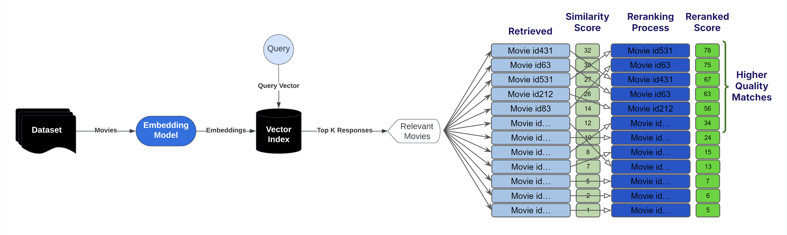
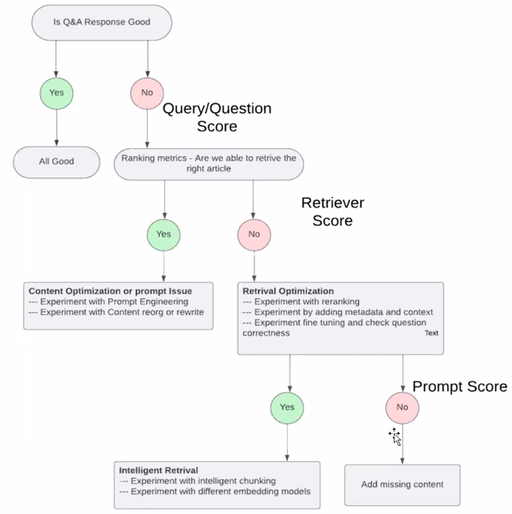

 R

## R-Square

 Aka score. In regression, indicates that a large proportion of the variance in the test instances' prices is explained by the model. Test is a new dataset not used in the model.

 Notes:

  * It ranges from 0 to 1. An R^2 of 1 indicates that the regression line perfectly fits the data.
  * Higher values indicate that the model fits the data better. Values closer to 1 are preferred.
  * R^2 increases as you add more variables to the model, even if the additional variables are insignificant.
  * It does not indicate whether the coefficient estimates and predictions are biased or not.
  * It is a good measure of the predictive power of the whole model, not of individual variables.

 R-squared is widely used to assess the goodness of fit in linear regression models. However, it should be interpreted cautiously and in conjunction with other model evaluation metrics like residual plots, F-tests, etc. In some cases, an [adjusted R-squared] value is preferred over the regular R-squared.

```
                     Var(mean) - Var(best-line-fit)              <== always positive
R-square = R^2 = -------------------------------------
                           Var(mean)                             <== make R^2 between and 1 (and a %)

```

 Interpretations:

  * There is R^2 % less variation around the best-fit-line than the mean
  * The weight of this input parameter (size/weight relationship) accounts for R^2 % of the variation

 

 See also [R], [Regression]


## Rabbit Company

 Price: $200

 

 More at:

  * site - [https://www.rabbit.tech/](https://www.rabbit.tech/)
  * devices 
    * R1 - [https://www.theverge.com/24138746/rabbit-r1-hands-on-ai-gadget-chatgpt](https://www.theverge.com/24138746/rabbit-r1-hands-on-ai-gadget-chatgpt)
  * alternative
    * [Humane] - with the AI pin

 See also [R], ...


## Radial Basis Function (RBF)

 See also [R], [Support Vector Classifier]


## RadioGPT

 RadioGPT combines the power of GPT-4 technology with AI voice tech and [Futuri Media]’s AI-driven targeted story discovery and social content system, TopicPulse, to provide an unmatched localized radio experience for any market, any format.

 

 More at:

  * [https://futurimedia.com/radiogpt/](https://futurimedia.com/radiogpt/)
  * [https://listen.streamon.fm/radiogpt](https://listen.streamon.fm/radiogpt)
  * [https://www.techtimes.com/articles/288252/20230227/radiogpt-first-ai-radio.htm](https://www.techtimes.com/articles/288252/20230227/radiogpt-first-ai-radio.htm)
  * [https://futurimedia.com/futuri-launches-radiogpt/](https://futurimedia.com/futuri-launches-radiogpt/)

 See also [R], [GPT Model]

## Random Cut Forest (RCF)

 Random Cut Forest (RCF) is an unsupervised algorithm for detecting anomalous data points within a [dataset]. These are observations which diverge from otherwise well-structured or patterned data. Anomalies can manifest as unexpected spikes in time series data, breaks in periodicity, or unclassifiable data points. They are easy to describe in that, when viewed in a plot, they are often easily distinguishable from the "regular" data. Including these anomalies in a [dataset] can drastically increase the complexity of a machine learning task since the "regular" data can often be described with a simple model. With each data point, RCF associates an anomaly score. Low score values indicate that the data point is considered "normal." High values indicate the presence of an anomaly in the data. The definitions of "low" and "high" depend on the application but common practice suggests that scores beyond three standard deviations from the mean score are considered anomalous. While there are many applications of anomaly detection algorithms to one-dimensional time series data such as traffic volume analysis or sound volume spike detection, RCF is designed to work with arbitrary-dimensional input. Amazon SageMaker RCF scales well with respect to number of features, dataset size, and number of instances.

 See also [R], ...


## Random Forest

 An ensemble method. Similar to XGBoost. Use prediction from several decision trees = supervised learning! Random Forest is a powerful and versatile supervised machine learning algorithm that grows and combines multiple decision trees to create a “forest.” It can be used for both classification and regression problems (if decision conflict --> vote, regression --> mean). Random Forest is a robust machine learning algorithm that can be used for a variety of tasks including regression and classification. It is an ensemble method, meaning that a random forest model is made up of a large number of small decision trees (weak learner), called estimators, which each produce their own predictions. The random forest model combines the predictions of the estimators to produce a more accurate prediction (strong learner!). Standard decision tree classifiers have the disadvantage that they are prone to overfitting to the training set. The random forest's ensemble design allows the random forest to compensate for this and generalize well to unseen data, including data with missing values. Random forests are also good at handling large datasets with high dimensionality and heterogeneous feature types (for example, if one column is categorical and another is numerical).

 {: width="100%"}

 See also [R], [Attribute], [Bagging], [Ensemble Method], [Decision Tree], [Gaussian Process], [Supervised Learning], [Tree Parzen Estimators], [XGBoost]


## Random Sample Consensus (RANSAC) Algorithm

 Developed in the early 1990s, in computer vision, but can be used in several fields.
 The algorithm removes [outliers] and keep the [inliers] from a sample set

 Parameters:

  * tolerance
  * number of iterations

 Assume the number of outliers is < than the number of inliers.

 {: width="100%"}

 

 

 More at:

  * [https://en.wikipedia.org/wiki/Random_sample_consensus](https://en.wikipedia.org/wiki/Random_sample_consensus)
  * code - [https://scikit-learn.org/stable/auto_examples/linear_model/plot_ransac.html](https://scikit-learn.org/stable/auto_examples/linear_model/plot_ransac.html)

 See also [R], ...


## Random Sampling

 During model inference, the model produces a probability distribution across all tokens in the model’s known vocabulary. The model chooses—or samples—a single token from this distribution as the next token to include in the response.

 For each inference request, you can configure the model to choose the next token using either greedy or random sampling. For [greedy sampling], the token with the highest probability is selected. With random sampling, the model selects the next token using a random-weighted strategy across all predicted token probabilities. The different sampling methods are shown below for the phrase “the student learns from the professor and her lectures.”

 {: width="100%"}

 See also [R], [Passive Learning]


## Random Search

 Sampling a parameter space - used with [hyperparameter optimization]

 [Grid Searca] tries all combinations of hyperparameters hence increasing the time complexity of the computation and could result in an unfeasible computing cost. Providing a cheaper alternative, Random Search tests only as many tuples as you choose. The selection of the hyperparameter values is completely random.

 {: width="100%"}

 More at:

  * [https://towardsdatascience.com/a-practical-introduction-to-grid-search-random-search-and-bayes-search-d5580b1d941d](https://towardsdatascience.com/a-practical-introduction-to-grid-search-random-search-and-bayes-search-d5580b1d941d)

 See also [R], [Sobol Search]


## Ranking

 Ranking. Suppose you are given a query and a set of documents. In ranking, the goal is to find the relative importance of the documents and order them based on relevance. An example use case of ranking is a product search for an ecommerce website. You could leverage data about search results, clicks, and successful purchases, and then apply XGBoost for training. This produces a model that gives relevance scores for the searched products.

 

 More at:

  * ranking algorithms - [https://towardsdatascience.com/how-to-convert-any-text-into-a-graph-of-concepts-110844f22a1a](https://towardsdatascience.com/how-to-convert-any-text-into-a-graph-of-concepts-110844f22a1a)
  * overview - [https://medium.com/airbnb-engineering/learning-to-rank-diversely-add6b1929621](https://medium.com/airbnb-engineering/learning-to-rank-diversely-add6b1929621)
  * ranking evaluation metrics - [https://towardsdatascience.com/comprehensive-guide-to-ranking-evaluation-metrics-7d10382c1025](https://towardsdatascience.com/comprehensive-guide-to-ranking-evaluation-metrics-7d10382c1025)

 See also [R], [ML Algorithm], [Reranking], [XGBoost]


## Raspberry Pi Computer

 A < $100 computer that is compatible with

  * [Coral Hardware]

 See also [R], ...


## Rational Agent

 Rational agents take decision-making a step further by aiming to maximize utility –making decisions designed to achieve the best possible outcome based on the information available to them. These agents are not just autonomous or intelligent; they are focused on optimizing their decisions in a given environment, often under conditions of uncertainty. Rational agents are frequently used in simulations, economic models, or high-stakes scenarios where consistently optimal decision-making is critical.

 BEWARE not all [intelligent agents] are rational – an agent may learn and adapt but still not make the most optimal decisions due to imperfect information or computational constraints. Rational agents strive to make the best decisions within the limits of their knowledge and capabilities.

 More at:

  * articles
    * [https://www.turingpost.com/p/agentsvocabulary](https://www.turingpost.com/p/agentsvocabulary)

 See also [R], ...


## Ray Framework

 See also [R], ...


## Ray Python Module

 See also [R], ...


## Reactive AI

 Tools that respond to specific inputs or situations without learning from past experiences (e.e. Alexa, Roomba, chess -playing computer)

 See also [R], [Artificial Intelligence]


## Reason-Act (ReAct) Prompting

 ~ A [prompt engineering] technique where [LLMs] are used to generate both reasoning traces and task-specific actions in an interleaved manner.

 ReAct is a general paradigm that combines reasoning and acting with LLMs. ReAct prompts LLMs to generate verbal reasoning traces and actions for a task. This allows the system to perform dynamic reasoning to create, maintain, and adjust plans for acting while also enabling interaction to external environments (e.g., Wikipedia) to incorporate additional information into the reasoning. The figure below shows an example of ReAct and the different steps involved to perform question answering.

 {: width="100%"}

 

 Alternative:

  * [Semantic Router]

 More at:

  * site - [https://react-lm.github.io/](https://react-lm.github.io/)
  * paper - [https://arxiv.org/abs/2210.03629](https://arxiv.org/abs/2210.03629)
  * articles
    * [https://www.promptingguide.ai/techniques/react](https://www.promptingguide.ai/techniques/react)
    * [https://learnprompting.org/docs/advanced_applications/react](https://learnprompting.org/docs/advanced_applications/react)
    * [https://blog.research.google/2022/11/react-synergizing-reasoning-and-acting.html](https://blog.research.google/2022/11/react-synergizing-reasoning-and-acting.html)
    * [https://tsmatz.wordpress.com/2023/03/07/react-with-openai-gpt-and-langchain/](https://tsmatz.wordpress.com/2023/03/07/react-with-openai-gpt-and-langchain/)

 See also [R], [Modular Reasoning Knowledge and Language]


## Reasoning

 There are 5 types of reasoning:

  * [Inductive reasoning] - a conclusion is drawn based on observations or evidence. ( = figuring out patterns)
  * [Deductive reasoning] - a conclusion is drawn based on the truth of the premises. ( = applying rules)
  * [Abductive reasoning] - a conclusion is drawn based on the best explanation for a given set of observations.
  * [Formal reasoning] - a systematic and logical process that follows a set of rules and principles.
  * [Informal reasoning] - a less structured approach to reasoning that relies on intuition, experience, and common sense.

 Examples:

  * [Case-Based Reasoning]
  * [Logical Reasoning] ???

 See [R], [Machine Reasoning]


## Recall

 ~ of all the actual positives, how many did we correctly identify?

 ~ same [True Positive Rate (TPR)] or [Sensitivity]

 ~ a recall of 1 means that we correctly identified all the positive cases

 ~ a recall of 0 means we identified none of the positive cases

 ~ High recall = test is effective at detecting positive cases without missing many / describe the ability of a model to find all the relevant cases within a dataset

 Metric used for [model evaluation] when the cost of [False Negatives (FN)] (missed positive) is high. For example, in disease prediction, it is critical not to miss any positive cases.

 Recall is the fraction of malignant tumors (of one class) that the system identified (correctly, in the class). Recall measures the fraction of truly malignant tumors that were detected. Recall is important in medical cases where it doesn’t matter whether we raise a false alarm but the actual positive cases should not go undetected!
 
```
# TP : The predicted value is positive and it is positive
       A cat is recognized as a cat
# FN : Type II eror : The predicted value is negative, but it is positive!
       A cat is recognized as a dog (not a cat!)
# TP + FN : Actual value is positive
       The cat is a cat!


           TP                     correctly identified        
Recall = -----------   =  ------------------------------------
           TP + FN             all identified in class       


Recall = % of positively identified
         % of cat identified as cat
```

 Recall would be a better metric because we don’t want to accidentally discharge an infected person and let them mix with the healthy population thereby spreading contagious virus. Now you can understand why accuracy is NOT always the best metric for a model.

 More at:

  * [https://medium.com/analytics-vidhya/what-is-a-confusion-matrix-d1c0f8feda5](https://medium.com/analytics-vidhya/what-is-a-confusion-matrix-d1c0f8feda5)

 See also [R], [Confusion Matrix]


## Recall-Oriented Understudy for Gisting Evaluation (ROUGE) Score

 ROUGE score is a set of metrics commonly used for [text summarization] tasks, where the goal is to automatically generate a concise summary of a longer text. ROUGE was designed to evaluate the quality of machine-generated summaries by comparing them to reference summaries provided by humans.

 ROUGE score measures the similarity between the machine-generated summary and the reference summaries using overlapping n-grams, word sequences that appear in both the machine-generated summary and the reference summaries. The most common n-grams used are unigrams, bigrams, and trigrams. ROUGE score calculates the recall of n-grams in the machine-generated summary by comparing them to the reference summaries.

 ROUGE = ∑ (Recall of n-grams)

 Where:

  * Recall of n-grams is the number of n-grams that appear in both the machine-generated summary and the reference summaries divided by the total number of n-grams in the reference summaries.

 ROUGE score ranges from 0 to 1, with higher values indicating better summary quality. Like BLEU score, a perfect summary would have a ROUGE score of 1, while a completely incorrect summary would have a ROUGE score of 0.

 ROUGE scores are branched into ROUGE-N,ROUGE-L, and ROUGE-S.

 In general:

  * [BLEU] focuses on precision: how much the words (and/or n-grams) in the candidate model outputs appear in the human reference.
  * ROUGE focuses on recall: how much the words (and/or n-grams) in the human references appear in the candidate model outputs.

 These results are complementing, as is often the case in the precision-recall tradeoff.

 

 

 More at:

  * paper - [https://aclanthology.org/W04-1013/](https://aclanthology.org/W04-1013/)
  * [https://medium.com/@sthanikamsanthosh1994/understanding-bleu-and-rouge-score-for-nlp-evaluation-1ab334ecadcb](https://medium.com/@sthanikamsanthosh1994/understanding-bleu-and-rouge-score-for-nlp-evaluation-1ab334ecadcb)
  * [https://www.freecodecamp.org/news/what-is-rouge-and-how-it-works-for-evaluation-of-summaries-e059fb8ac840/](https://www.freecodecamp.org/news/what-is-rouge-and-how-it-works-for-evaluation-of-summaries-e059fb8ac840/)

 See also [R], [MS COCO Caption Dataset], [NLP Metrics]


## Receiver Operating Characteristic (ROC) Curve

 ~ provides a more holistic view of the validator's performance across different threshold settings. It's particularly useful when you need to balance [sensitivity] and [specificity] in your evaluations.

 ~ summarize all the [confusion matrices] of a logistic model, if the classification 'Probability-threshold' is changed. ([thresholding])

 ~ A [confusion matrix] is 1 point on the ROC curve!

 ~ The diagonal is where FPR = TPR or random guess model (?). The top-right point is when the threshold is the lowest (all samples are predicted in positive class). The bottom-left point is when the threshold is the highest (all samples are predicted in negative class).

 ~ The best threshold is for a desired TPR to get the lowest FPR.

 Receiver Operating Characteristic (ROC) is a graphical representation of the performance of a binary classifier system as the discrimination threshold is varied. It plots the [true positive rate (TPR)][TPR] on the y-axis and the [false positive rate (FPR)][FPR] on the x-axis. The [true positive rate] (also known as [sensitivity] or [recall] ) is the proportion of positive cases that are correctly identified by the classifier. The false positive rate (also known as the fall-out) is the proportion of negative cases that are incorrectly identified as positive. An ROC curve plots the [TPR] against the [FPR] at different threshold settings. A perfect classifier will have a [TPR] of 1 and a [FPR] of 0, resulting in a point in the top left corner of the ROC space. A random classifier will have a [TPR] and [FPR] of 0.5, resulting in a point along a diagonal line from the bottom left to the top right corner of the ROC space. The [Area Under the ROC (AUROC) curve][AUROC Curve] is a measure of the classifier's overall performance, with a value of 1 indicating perfect performance and a value of 0.5 indicating a performance no better than random guessing.

 {: width="100%"}

 {: width="100%"}

 

 More at :

  * articles
    * [https://blog.revolutionanalytics.com/2016/11/calculating-auc.html](https://blog.revolutionanalytics.com/2016/11/calculating-auc.html)

 See also [R], [Area Under The Curve]


## Receptance Weighted Key Value (RWKV) Model

 ~ a [RNN] with GPT-level LLM performance, and can also be directly trained like a GPT transformer (parallelizable). <!> Pronounced RwaKuv <!>

 <!> Is attention all you need? <!> This model and the [mamba model] disagree! The RNN fight back!

 [Transformers] have revolutionized almost all [Natural Language Processing (NLP)] tasks but suffer from memory and computational complexity that scales quadratically with sequence length. In contrast, [recurrent neural networks (RNNs)] exhibit linear scaling in memory and computational requirements but struggle to match the same performance as [Transformers] due to limitations in parallelization and scalability. We propose a novel model architecture, Receptance Weighted Key Value (RWKV), that combines the efficient parallelizable training of transformers with the efficient inference of RNNs.

 Our approach leverages a linear attention mechanism and allows us to formulate the model as either a Transformer or an RNN, thus parallelizing computations during training and maintains constant computational and memory complexity during inference. We scale our models as large as 14 billion parameters, by far the largest dense [RNN] ever trained, and find RWKV performs on par with similarly sized [Transformers], suggesting future work can leverage this architecture to create more efficient models. This work presents a significant step towards reconciling trade-offs between computational efficiency and model performance in sequence processing tasks.

 

 

 More at:

  * site - [https://www.rwkv.com/](https://www.rwkv.com/)
  * wiki - [https://wiki.rwkv.com/](https://wiki.rwkv.com/)
  * paper - [https://arxiv.org/abs/2305.13048](https://arxiv.org/abs/2305.13048)
  * code - [https://github.com/BlinkDL/RWKV-LM](https://github.com/BlinkDL/RWKV-LM)
  * articles
    * [https://johanwind.github.io/2023/03/23/rwkv_overview.html](https://johanwind.github.io/2023/03/23/rwkv_overview.html)
    * [https://johanwind.github.io/2023/03/23/rwkv_details.html](https://johanwind.github.io/2023/03/23/rwkv_details.html)
    * [https://ben.bolte.cc/rwkv-model](https://ben.bolte.cc/rwkv-model)

 See also [R], ...


## Receptance Weighted Key Value (RWKV) World Tokenizer

 A tokenizer used by open-source [RWKV Models] that is taking ALL spoken languages in consideration. It solves limitations of the [BPE Tokenizer] by removing bias against non-english and non-spaced languages.
 
 

 See also [R], ...


## Recommendation Engine

 * [Apriori Algorithm]
 * [Link Prediction] in a graph database
 * [Two-Tower Model] uses cosine or euclidian similarity between [embeddings]. Used in [RAG] !

 See also [R], ...


## Rectified Linear Unit (ReLU) Activation Function

 ==Everything that has a negative value, change it to zero==

 We can avoid this problem by using activation functions which don't have this property of 'squashing' the input space into a small region. A popular choice is Rectified Linear Unit which maps x to max(0,x). Benefits:

  * easy to compute the derivative
  * helps with the vanishing gradient problem in backpropagation
  * derivative is always 0 if input signal is below the threshold --> solution is LeakyRelu

 See also [R], [Activation Function], [Exploding Gradient Problem], [LeakyReLU Activation Function], [ResNET Model], [Vanishing Gradient Problem]


## Rectified Linear Unit (ReLU) Activation Layer

 ~ an [activation layer] that uses the [ReLU activation function]

 A stack of images (matrix of pixels) becomes a stack of images with no negative values.

 Such layer is used in [CNNs] after each [convolutional layer] and before each [pooling layer]

 See also [R], ...


## Recurrent Neural Network (RNN)

 ==When successive input have a relationship between each of them==

 Ex characters in a word. Output of a layer can feed the input of self or an upstream layer. AFAIK the input is taken into consideration at the next round/processing. The opposite of a Feedforward Neural Network. Example: Prediction of the next letter/word given the previous letter/word (useful when there is correlation between the sequence of objects/classification). Also useful for timeseries data. Became widespread thanks to [Long Short Term Memory (LSTM) Network] a more multi-layer version of RNN.

 {: width="100%"}

 These loops make recurrent neural networks seem kind of mysterious. However, if you think a bit more, it turns out that they aren’t all that different than a normal neural network. A recurrent neural network can be thought of as multiple copies of the same network, each passing a message to a successor. Consider what happens if we unroll the loop:

 {: width="100%"}

 {: width="100%"}

 [Neural networks] will "loops" that are optimized for speech recognition, language modeling, translation. Essential to these successes is the use of “LSTMs,” a very special kind of recurrent neural network which works, for many tasks, much much better than the standard version. Almost all exciting results based on recurrent neural networks are achieved with them.

/// details | Can or cannot use [backpropagation]?
    type:question

    Yes, can use [backpropagation through time] !
///

 {: width="100%"}

 There are several types of RNNs, including:

  * one-to-many
  * many-to-one
  * many-to-many

 {: width="100%"}

 Beware:

  * The most modern RNN uses [Long-Short Term Memory (LSTM)][LSTM Cell] or [Gated Recurrent Unit (GRU)][GRU Cell] cells
  * Memory = hidden state (output of previous stage) ?

 Beware:

  * RNN are now deprecated by attention-based models such as those based on the [transformer architecture]
  * deprecated previous approach using [bag of words] and [word2vec]
  * deprecated by [attention-based models]
  * RNN use [backpropagation through time] instead of 'normal' [backpropagation]

 

 

 More at:

  * keras and RNN - [https://medium.com/analytics-vidhya/music-generation-using-deep-learning-a2b2848ab177](https://medium.com/analytics-vidhya/music-generation-using-deep-learning-a2b2848ab177)

 See also [R], [Bidirectional RNN], [Folded RNN], [Feedforward Neural Network], [Hidden State], [Long Short-Term Memory Network], [Pixel RNN], [Unfolded RNN], [Vanishing Gradient Problem]


## Red Teaming

 Red-teaming is a form of evaluation that elicits model vulnerabilities that might lead to undesirable behaviors. Jailbreaking is another term for red-teaming wherein the LLM is manipulated to break away from its guardrails. Microsoft’s Chatbot Tay launched in 2016 and the more recent Bing's Chatbot Sydney are real-world examples of how disastrous the lack of thorough evaluation of the underlying ML model using red-teaming can be. The origins of the idea of a red-team traces back to adversary simulations and wargames performed by militaries.

 The goal of red-teaming language models is to craft a prompt that would trigger the model to generate text that is likely to cause harm. Red-teaming shares some similarities and differences with the more well-known form of evaluation in ML called adversarial attacks. The similarity is that both red-teaming and adversarial attacks share the same goal of “attacking” or “fooling” the model to generate content that would be undesirable in a real-world use case. However, adversarial attacks can be unintelligible to humans, for example, by prefixing the string “aaabbbcc” to each prompt because it deteriorates model performance. Many examples of such attacks on various NLP classification and generation tasks is discussed in [Wallace et al., ‘19](https://arxiv.org/abs/1908.07125). Red-teaming prompts, on the other hand, look like regular, natural language prompts.

 Red-teaming can reveal model limitations that can cause upsetting user experiences or enable harm by aiding violence or other unlawful activity for a user with malicious intentions. The outputs from red-teaming (just like adversarial attacks) are generally used to train the model to be less likely to cause harm or steer it away from undesirable outputs.

 Since red-teaming requires creative thinking of possible model failures, it is a problem with a large search space making it resource intensive. A workaround would be to augment the LLM with a classifier trained to predict whether a given prompt contains topics or phrases that can possibly lead to offensive generations and if the classifier predicts the prompt would lead to a potentially offensive text, generate a canned response. Such a strategy would err on the side of caution. But that would be very restrictive and cause the model to be frequently evasive. So, there is tension between the model being helpful (by following instructions) and being harmless (or at least less likely to enable harm).

 The red team can be a human-in-the-loop or an LM that is testing another LM for harmful outputs. Coming up with red-teaming prompts for models that are fine-tuned for safety and alignment (such as via [RLHF] or [SFT]) requires creative thinking in the form of roleplay attacks wherein the LLM is instructed to behave as a malicious character as in [Ganguli et al., ‘22](https://arxiv.org/abs/2209.07858) Instructing the model to respond in code instead of natural language can also reveal the model’s learned biases such as examples below.

 {: width="100%"}

 

 More at:

  * [https://huggingface.co/blog/red-teaming](https://huggingface.co/blog/red-teaming)
  * papers
    * [https://arxiv.org/abs/1908.07125](https://arxiv.org/abs/1908.07125)
    * Anthropic paper - Red Teaming Language Models to Reduce Harms: Methods, Scaling Behaviors, and Lessons Learned - [https://arxiv.org/abs/2209.07858](https://arxiv.org/abs/2209.07858)
    * Red Teaming Language Models with Language Models - [https://arxiv.org/abs/2202.03286](https://arxiv.org/abs/2202.03286)

 See also [R], [Supervised Fine-Tuning]


## Reducible Error

 Suppose that we want to predict a value Y based upon a set X = (X1, X2, …, Xp) of variables. For the predictions to have any chance of being good predictions, X needs to contain the core set of variables that drive the behavior of Y. But there will almost always be lesser variables, not included in X, that nonetheless exert some minor influence on Y. We capture the situation as follows:

```
 Y = f(X) + ɛ 
```

 Here, f is the function describing the relationship between X and Y, and ɛ is an error term that accounts for all the unmeasured influences on Y. We assume that ɛ is independent of X and has mean 0.

 Usually we don’t know f exactly, so we use statistical methods (such as linear regression) to estimate f. We use f̂ to denote this estimate. This allows us to predict Y from X using the following:

```
 Y =  f̂(X) + ɛ 
```

 Our predictions will generally be imperfect: there will be some nonzero difference between the predicted and “true” values. This difference is called prediction error. In general we can’t see the true values directly, but we can see evidence of the gap by looking at the [Residuals], which are the difference between the observed and predicted values.

 To minimize prediction error, we need to understand its source. Broadly speaking there are two: reducible error and irreducible error.

 Reducible error is the error arising from the mismatch between f̂ and f. f is the true relationship between X and Y, but we can’t see f directly— we can only estimate it. We can reduce the gap between our estimate and the true function by applying improved methods.

 Irreducible error arises from the fact that X doesn’t completely determine Y. That is, there are variables outside of X — and independent of X— that still have some small effect on Y. The only way to improve prediction error related to irreducible error is to identify these outside influences and incorporate them as predictors.

 More at:

  * [https://medium.com/wwblog/reducible-vs-irreducible-error-e469036969fa](https://medium.com/wwblog/reducible-vs-irreducible-error-e469036969fa)

 See also [R], [Loss Function]


## Reducible Loss

 See [Reducible Error]


## Reflex Model

 An inference you can make almost instantaneously. Ex: flash the image of a zebra in front of me and recognize it is a zebra.

 See also [R], [Model Type]


## Region-Based CNN (R-CNN)

 ~ algorithm used for [image segmentation]

 1. [Object detection] --> [bounding boxes] for 2K proposed region-of-interest, aka ROI pooling
 1. Warped image regions
 1. pass image in [Convolutional Neural Network (CNN)][CNN]

 

 More at:

  * [https://heartbeat.fritz.ai/the-5-computer-vision-techniques-that-will-change-how-you-see-the-world-1ee19334354b](https://heartbeat.fritz.ai/the-5-computer-vision-techniques-that-will-change-how-you-see-the-world-1ee19334354b)

 See also [R], ...


## Region-Of-Interest (ROI) Pooling

 The first step in a [R-CNN]

 

 See also [R], ...


## Regression Task

 A type of [supervised learning] algorithm used for forecasting and prediction.

 Regression is a statistical method used to analyze the relationship between a dependent variable (also known as the response or outcome variable) and one or more independent variables (also known as predictor or explanatory variables). The goal of regression is to find the line of best fit that describes the relationship between the variables, which can be used for prediction or understanding the relationship. There are many different types of regression, including linear, logistic, and polynomial regression.

 In regression, instead of mapping inputs to a discrete number of classes like a classification, `the goal is to output a number` (ex stock price, temperature, probability, ...) . An example regression problem is predicting the price that a house will sell for. In this case, when XGBoost is given historical data about houses and selling prices, it can learn a function that predicts the selling price of a house given the corresponding metadata about the house. Another example: predictive maintenance, customer churn prediction. Practicality: outcome should be easy to measure, use historical observations. 

 The different algorithms are:

  * Regression trees : Finite number of number output!
  * [Linear regression]
  * [Logistic regression] : probability between 2 outcomes
  * [Non-Linear Regression]
    * Polynomial regression : dependent variable y is modelled as an nth degree polynomial in x.
      * Cubic and quadratic regression 
  * (occasionally) [Support vector machine]

 See also [R], [Classification], [Custom Churn Prediction], [Predictive Maintenance], [Regression Tree], [XGBoost]


## Regression Tree

 A decision tree using the MSE loss function and used for regression (predict a range, or specific "real" value). 

 More at:

  * [https://medium.com/analytics-vidhya/regression-trees-decision-tree-for-regression-machine-learning-e4d7525d8047](https://medium.com/analytics-vidhya/regression-trees-decision-tree-for-regression-machine-learning-e4d7525d8047)

 See also [R], [Decision Tree]


## Regularization

 Force a 'simpler model' to avoid memorizing training data, aka [overfitting] and encourage generalization!.

 There is an approach that prefers some [bias] over high [variance], this approach is called regularization. It works well for most of the [classification] / [regression] problems.

 The main ideas is 

  1. to constrain the model to simplify it (fewer degrees of freedom)
  2. to add information, aka [data augmentation]

 Methods:

  * [Lasso Regression], aka [L1 regularization]
    * Adds the absolute values of the coefficients as a penalty term to the [loss function].
    * Encourages [sparsity] in the model by driving some of the coefficients to exactly zero.
    * Useful for [feature selection] as it tends to eliminate less important [features].
  * [Ridge Regression], aka [L2 regularization]
    * Adds the squared values of the coefficients as a penalty term to the [loss function].
    * Encourages the model to have smaller weights overall.
    * Helps prevent multicollinearity (high correlation between features) and stabilizes the training process.
    * Compare to L1, this method exaggerates the impact of the higher value over smaller values
  * [Elastic Net Regression]
    * Combines both L1 and L2 regularization terms.
    * It has two [hyperparameters] (alpha and l1_ratio) that control the strength of L1 and L2 regularization.
  * [Dropout regularization] 
    * Applied in neural networks, dropout involves randomly setting a fraction of input units to zero during each update of the model.
    * Helps prevent co-adaptation of units by providing a form of ensemble learning within a single model.
  * [Early stopping]
    * Monitors the model's performance on a validation set during training and stops the training process when the performance starts to degrade.
    * Prevents the model from overfitting by terminating training before it becomes too specialized to the training data.
    * When validation loss increases --> overfitting
  * [Weight regularization] or weight decay
    * Adds a penalty term proportional to the sum of the squared weights to the [loss function].
    * Similar to L2 regularization and helps control the magnitude of the weights.
  * [Data Augmentation]
    * Not always possible, but works well with images, etc.

 These regularization techniques play a crucial role in preventing [overfitting], improving model generalization, and creating models that perform well on unseen data. The choice of regularization method and [hyperparameter] values depends on the specific characteristics of the dataset and the [machine learning] model being used.

 {: width="100%"}

 {: width="100%"}

 

 

 More at:

  * [https://machinelearningmastery.com/introduction-to-regularization-to-reduce-overfitting-and-improve-generalization-error/](https://machinelearningmastery.com/introduction-to-regularization-to-reduce-overfitting-and-improve-generalization-error/)

 See also [R], [Bias-Variance Trade-Off], [Balanced Fitting], [Overfitting], [Underfitting]


## Regularization Parameter

 See also [R], [Support Vector Classifier]


## Regulatory Landscape

 Regulatory landscape refers to the complete framework of laws, rules, and regulations that govern an industry or business activity. This includes:

  * All applicable laws and regulations
  * Government agencies and regulatory bodies
  * Current and upcoming regulatory requirements
  * Policy directions and regulatory trends

 {: width="100%"}

/// details | How are regulation difference from AI principles?
    type:question
///

 See also [R], [AI Bill Of Rights], [AI Principles], [European Union AI Act]


## REINFORCE Algorithm

 REINFORCE is a Monte-Carlo variant of policy gradients (Monte-Carlo: taking random samples). The agent collects a [trajectory] τ of one [episode] using its current [policy], and uses it to update the policy parameter. Since one full trajectory must be completed to construct a sample space, REINFORCE is updated in an [off-policy] way.

 

 More at:

  * pytorch implementation - [https://medium.com/@thechrisyoon/deriving-policy-gradients-and-implementing-reinforce-f887949bd63](https://medium.com/@thechrisyoon/deriving-policy-gradients-and-implementing-reinforce-f887949bd63)

 See also [R], ...


## Reinforcement Fine-Tuning (RFT)

 ~ allows users to create custom models using the same process [OpenAI] uses internally.

 See also [R], [Supervised Fine-Tuning]


## Reinforcement Learning (RL)

 `Pavlov's dog experiment!` also `How we learn to bike!` Beware: `No training set is provided, training is coming from experience! = learn by try and error`. Continue doing the behavior that led you to the most [reward]. Imagine teaching a program to play chess. It level of playing is only as good as the training data provided. If it learns/analyses the games played by average players, the program will only be average. If it analyses the games of the best player in the work, it will be just as good as them, but not better. `Reinforcement learning is the way to make a computer be better  than human at chess or any other activity` using [rewards] and [punishments]. `Learning through trials and errors` input/sensor --> software agent --> [Action], leads to [supervised feedback] in the form of a [reward].

 The [RL agent] continuously learns. There is no final state. Gives a [reward] for each move. Get's better based on past-experience.

 `Reinforcement learning is located near the supervised end of the spectrum`. Unlike [supervised learning], reinforcement learning programs do not learn from labeled pairs of inputs and outputs. Instead, they receive feedback for their decisions, but errors are not explicitly corrected. For example, a reinforcement learning program that is learning to play a side-scrolling video game like Super Mario Bros may receive a [reward] when it completes a level or exceeds a certain score, and a [punishment] when it loses a life. However, this [supervised feedback] is not associated with specific decisions to run, avoid Goombas, or pick up fire flowers.

 {: width="100%"}

 Imagine a mouse in a maze trying to find hidden pieces of cheese. The more times we expose the mouse to the maze, the better it gets at finding the cheese. At first, the mouse might move randomly, but after some time, the mouse’s experience helps it realize which actions bring it closer to the cheese. The process for the mouse mirrors what we do with Reinforcement Learning (RL) to train a system or a game. Generally speaking, RL is a [machine learning] method that helps an [RL agent] learn from experience. By recording actions and using a trial-and-error approach in a set [environment], RL can maximize a [cumulative reward]. In our example, the mouse is the [RL agent] and the maze is the [environment]. The set of possible [actions] for the mouse are: move front, back, left or right. The [reward] is the cheese.

 You can use RL when you have little to no historical data about a problem, because it doesn’t need information in advance (unlike traditional machine learning methods). In a RL framework, you learn from the data as you go. Not surprisingly, RL is especially successful with games, especially games of “[perfect information]” like chess and Go. With games, feedback from the [RL agent] and the [environment] comes quickly, allowing the model to learn fast. The downside of RL is that it can take a very long time to train if the problem is complex. Just as IBM’s [Deep Blue] beat the best human chess player in 1997, [AlphaGo], a RL-based algorithm, beat the best Go player in 2016. The current pioneers of RL are the teams at [DeepMind] in the UK. 

 On April, 2019, the [OpenAI Five] team was the first AI to beat a world champion team of e-sport Dota 2, a very complex video game that the [OpenAI Five] team chose because there were no RL algorithms that were able to win it at the time. The same AI team that beat Dota 2’s champion human team also developed a robotic hand that can reorient a block. 

 

 More at:

  * [https://neptune.ai/blog/category/reinforcement-learning](https://neptune.ai/blog/category/reinforcement-learning)
  * [http://karpathy.github.io/2016/05/31/rl/](http://karpathy.github.io/2016/05/31/rl/)
  * Tutorials
    * [https://rl-lab.com/](https://rl-lab.com/)
    * [https://huggingface.co/learn/deep-rl-course/unit0/introduction](https://huggingface.co/learn/deep-rl-course/unit0/introduction)

 See also [R], [Action], [Action Space], [Continual Reinforcement Learning], [Delayed Reward], [Environment], [Exploitation], [Exploration], [Learning Method], [Machine Learning], [Machine Learning Algorithm], [Markov Decision Process], [Meta-Learning], [Observation], [Reward Shaping], [State]


## Reinforcement Learning (RL) Agent

 In [reinforcement learning], an [agent] whose goal is to maximize its [cumulative reward].
 To observe the right behavior, be sure to use appropriate [reward] and correct [reward shaping].

 Examples:

  * In [AWS DeepRacer], the goal of the program running on the car is to go around the track as fast as possible without getting out of the track.

 The agent simulates the AWS DeepRacer vehicle in the simulation for training. More specifically, it embodies the neural network that controls the vehicle, taking inputs and deciding [actions]. ==The agent embodies a neural network that represents a function to approximate the agent's policy.==

  * The essence of Reinforced Learning is to enforce behavior based on the actions performed by the agent. The agent is rewarded if the action positively affects the overall goal.
  * The basic aim of reinforcement Learning is reward maximization. The agent is trained to take the best action to maximize the overall reward.
  * RL agents work by using the already known exploited information or exploring unknown information about an environment.
  * ...

 It’s also important to understand that the learner and decision-maker is called the agent. The thing it interacts with, comprising everything outside the agent, is called the [environment].

 During the training phase of an [RL agent], its policy is updated after each [iteration] based on the preset [learning rate], an [hyperparameter]

 See also [R], [Addiction]


## Reinforcement Learning (RL) Algorithm


 [Policy Gradient Algorithms]

  * [Actor-Critic with Experience (ACER)]
  * [Advanced Actor-Critic (A2C)]
  * [Asynchronous Advanced Actor-Critic (A3C)]
  * [Deep Deterministic Policy Gradient (DDPG)]
  * [Proximal Policy Optimization (PPO)]
  * [Soft Actor Critic (SAC)]
  * ...

 [Value-Based Algorithms]

  * [Q-Learning] 
  * [State-Action-Reward-State-Action (SARSA)]

 RL with Targeted feedback

  * [Reinforcement Learning From Human Feedback] - human, slow and expensive
  * [Reinforcement Learning From AI Feedback] - AI, fast and low cost, but feedback on final results
  * [Reinforcement Learning With Executive Feedback] - AI, fast, low cost, on intermediate results
  * [Reinforcement Learning Coordinated Feedback] - 2 <> teachers, on is LLM, the other is tool/validation based. Used with coding.

 Others:

  * [Evolutionary Algorithms] = Generate policies through ab evolutionary process of selection, mutation, and fitness evaluation. Ex: [Genetic Programming], [Evolution Strategy]
  * [Model-Based RL] = Learn model of environment transistions and rewards, then optimizes policy through planning. Ex: [Dyna Model], [AlphaGo]
  * [Inverse RL] = learn reward function from expert demonstrations. Allows mimicking behavior without rewards.
  * [Hierarchical RL] = Decomposes problem into hierarchy of sub-policies over different timescales
  * [Transfer Learning] = Leverage knowledge fro previous tasks to accelerate learning on new tasks.

 {: width="100%"}

 More at:
  * articles
    * [https://www.turingpost.com/p/rl-f](https://www.turingpost.com/p/rl-f)

 See also [R], ...


## Reinforcement Learning Coordinated Feedback (RLCF)

 RLCF leverages compiler and LLM feedback to reinforce code quality, guiding models to generate syntactically correct, semantically sound code. It's ideal for tuning code models without human input. This training happens after traditional pre-training but before task-specific fine-tuning.

 {: width="100%"}

 More at:

  * articles
    * [https://www.turingpost.com/p/rl-f](https://www.turingpost.com/p/rl-f)

 See also [R], ...


## Reinforcement Learning from AI Feedback (RLAIF)

 ~ popularized by [Anthropic] as a play on word on [RLHF]. Similar to [constitutional AI]

 It is expensive to collect accurate labels to implement traditional [RLHF] model, RLAIF uses another off-the-shelf model (AI) to evaluate the results of your primary model. Using AI for evaluation saves time, is more efficient, and gives comparable performance to [RLHF] in many use cases.

 

 More at:

  * paper - [https://arxiv.org/abs/2212.08073](https://arxiv.org/abs/2212.08073)
  * constitutional AI - [https://www.anthropic.com/index/constitutional-ai-harmlessness-from-ai-feedback](https://www.anthropic.com/index/constitutional-ai-harmlessness-from-ai-feedback)
  * articles
    * [https://www.turingpost.com/p/rl-f](https://www.turingpost.com/p/rl-f)

 See also [F], ...


## Reinforcement Learning from Human Feedback (RLHF)

 Reinforcement learning process using human feedback as a reward model. RLHF is use in InstructGPT model, a precursor to ChatGPT model. A way to prevent or make [Red Teaming] language models more difficult?

 

 

 More at:

  * paper 
    * [https://arxiv.org/abs/2203.02155](https://arxiv.org/abs/2203.02155)
    * [https://arxiv.org/abs/1706.03741](https://arxiv.org/abs/1706.03741)
  * [https://huggingface.co/blog/rlhf](https://huggingface.co/blog/rlhf)
  * articles
    * RLHF vs - [https://www.turingpost.com/p/rl-f](https://www.turingpost.com/p/rl-f)
    * RLHF is flawed? - [https://astralcodexten.substack.com/p/perhaps-it-is-a-bad-thing-that-the](https://astralcodexten.substack.com/p/perhaps-it-is-a-bad-thing-that-the)
    * challenges - [https://bdtechtalks.com/2023/09/04/rlhf-limitations/](https://bdtechtalks.com/2023/09/04/rlhf-limitations/)
    * instructGPT - [https://tmmtt.medium.com/the-instructgpt-e25797d8f4df](https://tmmtt.medium.com/the-instructgpt-e25797d8f4df)
    * what is RLHF - [https://bdtechtalks.com/2023/01/16/what-is-rlhf/](https://bdtechtalks.com/2023/01/16/what-is-rlhf/)

 See also [R], [ChatGPT Model], [Feedback-Based Learning], [InstructGPT Model], [Reinforcement Learning], 


## Reinforcement Learning with Executive Feedback (RLEF)

 RLEF provides feedback to the model while it generates intermediate results. Instead of relying solely on external evaluations (like rewards or penalties based on results), RLEF provides feedback throughout the steps of an action sequence, allowing the model to adjust in real-time.

```
Imagine you are builiding a tower with blocks.
As you place each block, a teacher says if you are doing it right or wrong right away, not just at the end.
So you can fix mistakes right away, making sure the tower stands strong!
```

 {: width="100%"}

 More at:

  * articles
    * RLEF vs - [https://www.turingpost.com/p/rl-f](https://www.turingpost.com/p/rl-f)

 See also [R], ...


## Relation

 A triples (X, r, Y)

 See also [R], [Relation Extraction]


## Relation Extraction

 Extract relations between entities in a text or image to build a scene graph.  Possible methods:

   * text
     * rule-based technique: 'such as', 'including' , ...
     * supervised technique: stack binary classifier to determine if there is a specific relation between 2 entities :warning: Very expensive to label 
     * distant supervision: If 2 entities belongs to a certain relation, any sentence containing those 2 entities is likely to express a relation then 2 entities  
   * video

 See also [R], [Entity Extraction], [Relation], [Scene Graph]


## Relational Deep Learning (RDL)

 Data mining using [GNN] to learn embedding without [feature engineering]

 

 More at:

  * paper - [https://arxiv.org/abs/2312.04615](https://arxiv.org/abs/2312.04615)

 See also [R], [RelBench]


## Relational Deep Learning Benchmark (RelBench)

 The Relational Deep Learning Benchmark (RelBench) is a collection of realistic, large-scale, and diverse benchmark datasets for machine learning on relational databases. RelBench datasets are automatically downloaded, processed, and split using the Data Loader. The model performance can be evaluated using the Evaluator in a unified manner. RelBench is a community-driven initiative in active development. We expect the benchmark datasets to evolve.

 

 More at:

  * Site - [https://relbench.stanford.edu/](https://relbench.stanford.edu/)
  * paper - 

 See also [R], ...

## Relative Approximation Error (RAE)

 See also [R], [Prediction Error]


## Relative Entropy

 See [Kullback-Leibler Divergence]


## Relevancy

 Relevancy --> approximate of neightbor bias used in [similarity metrics]

 Low relevancy = this hot dog looks like this ice cream.

 High relevancy = this hot dog looks like this other hot dog.

 See also [R], ...


## Replaced Word Prediction

 See also [R], [Self-Supervised Learning]


## Replay Buffer

 See [Replay Memory]


## Replay Memory

 In DQN-like algorithms, the memory used by the [RL agent] to store state transitions for use in [experience replay].
 
 Used for [experience replay]

 Circular buffer of fixed size that stores the last trailing state transitions, aka [experience]. To train the [Deep Q-Network (DQN)][DQN], the training algorithm sample from the [experiences] from that memory!  

 

 See also [R], ...


## Replicate Company

 More at:

  * site - [https://replicate.com/](https://replicate.com/)

 See also [R], ...


## Replit Company

 

 


 More at:

  * site - [https://replit.com/](https://replit.com/)

 See also [R], [Custom GPT]


## Repls

 Repl with

  * Tutorial + video
  * GIT integration

 

 

 See also [R], ...


## Representation

 The process of mapping data to useful features.

 See also [R], ...


## Representation Space

 The meaning of the dimensions in the representation space is set by the label/ground truth + backpropagation from the loss/cost function (?)

 See also [R], [Backpropagation], [Decoder Representation Space], [Encoder Representation Space], [Ground Truth], [Label], [Loss Function]


## Reproducibility

 See also [R], [Model Governance]


## Reptile

 Use the direction of theta (parameter?) to change phy (hyper parameter).

 See also [R], [MAML], [Meta-Learning]


## Reranking

 ~ reordering results returned by a [ranking] engine that you do not control or do not want to change/touch using another engine that use different ranking dimensions to up-rank or down-rank previously returned results.

 Used in [semantic search] to find the best answer to a question!

 Reranking refers to the process of reordering or reorganizing a list of items based on certain criteria to improve the quality of the [ranking]. This concept is often used in [information retrieval], search engines, recommendation systems, and other applications where a list of items needs to be presented in a specific order to provide better user experiences or more relevant results.

 In various scenarios, the initial [ranking] of items might not be perfect or optimized for the user's preferences, needs, or relevance. Reranking aims to address this by adjusting the order of items in the list to better match the user's intent or to improve the quality of the presented information. The reranking process can be guided by different factors, such as user feedback, relevance scores, contextual information, or machine learning models.

 Example of applications:

  * Implementing societal objective function in ranking of social posts
  * [RAG] implementing document semantic search with reranking

 {: width="100%"}

 {: width="100%"}

 

 More at:

  * applications
    * social objective functions - [https://youtu.be/IzK55L26FgA?t=8579](https://youtu.be/IzK55L26FgA?t=8579)
  * notebooks
    * [https://github.com/togethercomputer/together-cookbook/blob/main/Search_with_Reranking.ipynb](https://github.com/togethercomputer/together-cookbook/blob/main/Search_with_Reranking.ipynb)

 See also [R], ...


## Resample

 a new sample of data that is created by selecting observations from an existing dataset.

 See also [R], [Resampling Method]


## Resampling Method

 are techniques used to estimate the performance of a model or algorithm on unseen data by using the existing dataset. The most common resampling methods are:

   * bootstrap sampling
   * jackknife sampling
   * cross-validation sampling

 See also [R], [Bootstrap Sampling Method], [Cross-Validation Sampling Method], [Jackknife Sampling Method], [Resample]


## Reshaping

 Before multiplying a [vector] by a [matrix], we need to reshape the [vector] to have 2 dimensions! Likewise if you want to multiply a [matrix] and a [tensor].

 See also [R], ...

## Residual

 Y - estimateY for a given X. Use the residual in the loss function. :warning: How do you use the residuals in the loss function? absolute values? not easy to work with. Squares? Yes.

 See also [R], [Linear Regression], [Loss Function]


## Residual Block

 In Residual Networks, to solve the problem of the vanishing/exploding gradient, this architecture introduced the concept called Residual Blocks. In this network, we use a technique called skip connections. The skip connection connects activations of a  layer to further layers by skipping some layers in between. This forms a residual block. Resnets are made by stacking these residual blocks together.  The approach behind this network is instead of layers learning the underlying mapping, we allow the network to fit the residual mapping. So, instead of say H(x), initial mapping, let the network fit, 
 
```
F(x) := H(x) - x which gives H(x) := F(x) + x. 
```

 {: width="100%"}

 See also [R], [Residual Network Model], [Skip Connection]


## Residual Network (ResNET) Model

 ResNET, short for Residual Networks is a classic neural network used as a backbone for many computer vision tasks = `a CNN image model` This model was the winner of ImageNET challenge in 2015. The fundamental breakthrough with ResNET was it allowed us to train extremely deep neural networks with 150+layers successfully. Prior to ResNET training very deep neural networks was difficult due to the [problem of vanishing gradients][Vanishing Gradient Problem].

 

 More at:

  * [https://www.geeksforgeeks.org/residual-networks-resnet-deep-learning/](https://www.geeksforgeeks.org/residual-networks-resnet-deep-learning/)

 See also [R], [Convoluted Neural Network], [Computer Vision], [Rectified Linear Unit Activation Function], [Residual Block], [Vanishing Gradient Problem]


## Resilient Backpropagation (Rprop) Algorithm

 Rprop, short for resilient [backpropagation], is a type of [optimization algorithm] commonly used in [machine learning] and [neural networks][ANN] to minimize the [cost function] or error function.

 Unlike other optimization algorithms that use a fixed [learning rate], Rprop adapts the step size for each parameter based on the sign of the gradient. This allows the algorithm to take larger steps in flat regions and smaller steps in steep regions of the cost function, thus improving convergence speed.

 The Rprop algorithm maintains a separate update value for each parameter and adjusts the update value based on the sign of the gradient at each iteration. If the gradient changes sign, the update value is reset to its initial value, otherwise, it is increased or decreased by a fixed factor. The step size for each parameter is then calculated based on the current update value and the sign of the gradient.

 Rprop is particularly effective when dealing with high-dimensional optimization problems, noisy gradients, or sparse data. It is also computationally efficient and does not require the calculation of second-order derivatives.

 One drawback of Rprop is that it may get stuck in local minima or plateaus, and it may not perform well in non-convex optimization problems. To address this issue, hybrid variants of Rprop have been proposed that combine it with other optimization algorithms such as Adam or momentum to improve its robustness and generalization capabilities.

 More at:

  * [https://en.wikipedia.org/wiki/Rprop](https://en.wikipedia.org/wiki/Rprop)
  * [https://towardsdatascience.com/understanding-rmsprop-faster-neural-network-learning-62e116fcf29a](https://towardsdatascience.com/understanding-rmsprop-faster-neural-network-learning-62e116fcf29a)

 See also [R], [Root Mean Square Propagation Algorithm]


## Response Variable

 Y or prediction Y_hat There are many names for the output of a machine learning program. Several disciplines converge in machine learning, and many of those disciplines use their own terminology. We will refer to the output as the response variable. Other names for response variables include "dependent variables", "regressands", "criterion variables", "measured variables", "responding variables", "explained variables", "outcome variables", "experimental variables", "labels", and "output variables".

 See also [R], [Explanatory Variable], [Predictor Variable], [Regression]


## Responsible AI (RAI)

 Responsible AI (RAI) refers to the individual and collective effort to promote beneficial users of AI and safeguard stakeholders -- clients, employees, members of the public, and beyond -- from harms or risks associated with AI, while acting ethically as institutions and individuals

 * At its core, RAI is about protecting and benefiting people and society
 * Using AI responsibly  is more than compliance, risk management, efficiency, or personal accountability
 * RAI encompasses the full spectrum of social, technical, business, and governance practices involved in advancing AI's use in society

 Related terms are [Ethical AI], [Trustworthy AI]

 To whom are we responsible?

  * Employees and shareholders
  * Clients and customers
  * Regulators and policymakers
  * People and planet

 What are we responsible for?

  * Promoting ethical development, implementation, and monitoring throughout the AI life cycle
  * Centering well-being, human and civil rights, professional ethics, and people in our technology.

 What processes, tools, and norms can achieve these goals?

  * Development and implementation of transparent and safe AI systems
  * Software toolkits, data science and data platform, controls and governance that enable RAI
  * Culture and education around responsible practices
  * Multi-objective and social good use cases

 

 

 More at:

  * [https://venturebeat.com/security/pwc-highlights-11-chatgpt-and-generative-ai-security-trends-to-watch-in-2023/](https://venturebeat.com/security/pwc-highlights-11-chatgpt-and-generative-ai-security-trends-to-watch-in-2023/)
  * US DoD
    * [https://www.cnn.com/videos/business/2023/05/11/nightcap-ai-drones-clip-orig-jc.cnn](https://www.cnn.com/videos/business/2023/05/11/nightcap-ai-drones-clip-orig-jc.cnn)
    * [https://www.defense.gov/Spotlights/Artificial-Intelligence/](https://www.defense.gov/Spotlights/Artificial-Intelligence/)
    * [https://www.diu.mil/responsible-ai-guidelines](https://www.diu.mil/responsible-ai-guidelines)

 See also [R], [AI Alignment], [AI Bias], [AI Ethics], [AI Fairness]


## Restricted Boltzmann Machine (RBM)

 * Visible layer = what we observe
 * hidden layer = what we cannot see

 In a full Boltzmann machine, each node is connected to every other node and hence the connections grow exponentially. This is the reason we use RBMs. The restrictions in the node connections in RBMs are as follows:
   * Hidden nodes cannot be connected to one another.
   * Visible nodes connected to one another.
 
```
Consider – Mary watches four movies out of the six available movies and rates four of them. Say, she watched m1, m3, m4 and m5 and likes m3, m5 (rated 1) and dislikes the other two, that is m1, m4 (rated 0) whereas the other two movies – m2, m6 are unrated. Now, using our RBM, we will recommend one of these movies for her to watch next. Say – 

m3, m5 are of ‘Drama’ genre.
m1, m4 are of ‘Action’ genre.
‘Dicaprio’ played a role in m5.
m3, m5 have won ‘Oscar.’
‘Tarantino’ directed m4.
m2 is of the ‘Action’ genre.
m6 is of both the genres ‘Action’ and ‘Drama’, ‘Dicaprio’ acted in it and it has won an ‘Oscar’.
We have the following observations –

Mary likes m3, m5 and they are of genre ‘Drama,’ she probably likes ‘Drama’ movies.
Mary dislikes m1, m4 and they are of action genre, she probably dislikes ‘Action’ movies.
Mary likes m3, m5 and they have won an ‘Oscar’, she probably likes an ‘Oscar’ movie.
Since ‘Dicaprio’ acted in m5 and Mary likes it, she will probably like a movie in which ‘Dicaprio’ acted.
Mary does not like m4 which is directed by Tarantino, she probably dislikes any movie directed by ‘Tarantino’.
Therefore, based on the observations and the details of m2, m6; our RBM recommends m6 to Mary (‘Drama’, ‘Dicaprio’ and ‘Oscar’ matches both Mary’s interests and m6). This is how an RBM works and hence is used in recommender systems.
```

 {: width="100%"}

 

 See also [R], [Boltzmann Machine]


## RAG Assessment (RAGA)

 ~ A framework with metrics and LLM-generated data to evaluate the performance of your Retrieval-Augmented Generation pipeline

 By now, we know that building a proof of concept for a Retrieval-Augmented Generation (RAG) application is easy, but making it production-ready is very difficult. Getting the RAG pipeline's performance to a satisfying state is especially difficult because of the different components in a RAG pipeline:

  * Retriever component: retrieves additional context from an external database for the LLM to answer the query.
  * Generator component: generates an answer based on a prompt augmented with the retrieved information.

 When evaluating a RAG pipeline, you must evaluate both components separately and together to understand if and where the RAG pipeline still needs improvement. Additionally, to understand whether your RAG application’s performance is improving, you must evaluate it quantitatively. For this, you will need two ingredients: An evaluation metric and an evaluation dataset.

 Test for:

 * Retrieval Quality
   * Relevance
   * Diversity
 * Test hallucinations
   * noise robustness - which useful info to extract from documents to provide useful response
   * Negative rejection - when the LLM/RAG does not know the answer
   * Information integration - the answer is in multiple documents
   * Counterfactual robustness - when documents contain errors
   * Unclear queries - query is sequence of words that does not make any sense!
 * Privacy breaches
 * Malicious use
   * Illegal activities
   * create harmful content
   * Inquiry about harmful activities
 * Security breaches
   * Emotional manipulation
   * Prefix injection
   * Refusal suppression
   * Mismatched generation
 * Out-of-domain questions
 * Test for completeness
 * Test for brand damage

 More at:

  * articles
    * [https://towardsdatascience.com/evaluating-rag-applications-with-ragas-81d67b0ee31a](https://towardsdatascience.com/evaluating-rag-applications-with-ragas-81d67b0ee31a)
    * [https://www.rungalileo.io/blog/mastering-rag-8-scenarios-to-test-before-going-to-production](https://www.rungalileo.io/blog/mastering-rag-8-scenarios-to-test-before-going-to-production)

 See also [R], [LangSmith]


## RAG Generator

 A component in a [RAG] that uses its augmented context for additional information, but will also generate new info. Beware of hallucinations.

 See also [R], ...


## RAG Information Retriever (RAG-IR)

 A component of a [RAG] that uses its augmented context to give an answer. Using it results in limited hallucinations.

 See also [R], ...


## Retrieval-Augmented Generation (RAG) System

 ~ A [compound AI system] that consists of an LLM that works with a [retriever]

 Fields:

  * Document ID (DOI)   <== used for deletion, not for query
  * Chunk ID (chunk id)
  * metadata <== delete on metadata not available in pinecone serverless
  * vector ID (ID)
    * prefix = field constructed for filtering (a bit like metadata) ex: <DOI>#<chunk-ID># ...

 Retrieval-augmented generation is a technique used in [natural language processing] that combines the power of both [retrieval models] and [generative models] to enhance the quality and relevance of generated text.

 Now, retrieval-augmented generation combines these two approaches to overcome their individual limitations. In this framework, a retrieval model is used to retrieve relevant information from a knowledge base or a set of documents based on a given query or context. The retrieved information is then used as input or additional context for the generative model.

 There are 2 components in RAGs:

  * [RAG Information Retriever (RAG-IR)] or reader componentbased on [vector retrieval]
  * [RAG Generator] or writer component

 RAG paradigm

  * Naive RAG
  * Advanced RAG
    * [Corrective RAG] - advanced retriever
    * [Self-Reflective RAG] - RAG as a state machine
    * [Multimodal RAG] - Extract information from slide deck and other images
  * [Modular RAG]

 Current evaluation frameworks:
  * [RAG Triad Of Metrics]
  * [ROUGE]
  * [BLEU]
  * [RAG Assessment (RAGA)]
  * [Automated RAG Evaluation System (ARES)]

 [Large Language Models (LLMs)] demonstrate significant capabilities but face challenges such as hallucination, outdated knowledge, and non-transparent, untraceable reasoning processes. Retrieval-Augmented Generation (RAG) has emerged as a promising solution by incorporating knowledge from external databases. This enhances the accuracy and credibility of the models, particularly for knowledge-intensive tasks, and allows for continuous knowledge updates and integration of domain-specific information. RAG synergistically merges LLMs' intrinsic knowledge with the vast, dynamic repositories of external databases. This comprehensive review paper offers a detailed examination of the progression of RAG paradigms, encompassing the Naive RAG, the Advanced RAG, and the Modular RAG. It meticulously scrutinizes the tripartite foundation of RAG frameworks, which includes the retrieval , the generation and the augmentation techniques. The paper highlights the state-of-the-art technologies embedded in each of these critical components, providing a profound understanding of the advancements in RAG systems. Furthermore, this paper introduces the metrics and benchmarks for assessing RAG models, along with the most up-to-date evaluation framework.

 {: width="100%"}

 {: width="100%"}

 {: width="100%"}

 

 

 

 More at:

  * paper - [https://arxiv.org/abs/2312.10997](https://arxiv.org/abs/2312.10997)
  * code - [https://github.com/Tongji-KGLLM/RAG-Survey](https://github.com/Tongji-KGLLM/RAG-Survey)
  * articles
    * [https://www.datacamp.com/tutorial/corrective-rag-crag](https://www.datacamp.com/tutorial/corrective-rag-crag)
    * [https://community.fullstackretrieval.com/](https://community.fullstackretrieval.com/)
    * [https://colabdoge.medium.com/what-is-rag-retrieval-augmented-generation-b0afc5dd5e79](https://colabdoge.medium.com/what-is-rag-retrieval-augmented-generation-b0afc5dd5e79)

 See also [R], [Modular Reasoning Knowledge and Language System], [Vector Retrieval]


## RAG Triad Of Metrics

 More at:

  * [https://learn.deeplearning.ai/building-evaluating-advanced-rag/lesson/3/rag-triad-of-metrics](https://learn.deeplearning.ai/building-evaluating-advanced-rag/lesson/3/rag-triad-of-metrics)

 See also [R], ...


## Retrieval-Based Model

 These models are designed to retrieve relevant information from a given set of documents or a knowledge base. They typically use techniques like [information retrieval] or [semantic search] techniques to identify the most relevant pieces of information based on a given query. Retrieval-based models excel at finding accurate and specific information but lack the ability to generate creative or novel content.

 Retrieval models:

  * Neural Network [Embeddings]
  * [Best Match 25]
  * [Term Frequency-Inverse Document Frequency (TF-IDF)][TF-IDF]
  * [Linear Discriminant Analysis (LDA)][LDA]
  * Hybrid search = a combination of the above methodologies with different weightings.

 More at:

  * [https://colabdoge.medium.com/what-is-rag-retrieval-augmented-generation-b0afc5dd5e79](https://colabdoge.medium.com/what-is-rag-retrieval-augmented-generation-b0afc5dd5e79)

 See also [R], ...


## Retrieval-Interleaved Generation (RIG) System

 Retrieval-Interleaved Generation (RIG) is a technique that combines retrieval and generation to enhance the quality and factuality of AI model outputs. Here's how it works:

  * During generation, the model periodically pauses to retrieve relevant information from a knowledge base
  * The retrieved information is then integrated into the ongoing generation process, helping guide and inform the output

 The key benefits are:

  * Improved factual accuracy since the model can reference external knowledge
  * Better grounding of responses in verified information
  * Reduced hallucination as the model isn't purely relying on its learned parameters

 A simple example:

 If asked about Barack Obama's presidency, a RIG system might:

  * Start generating about Obama
  * Pause to retrieve specific dates and events from a knowledge base
  * Continue generating while incorporating the retrieved facts
  * Repeat this process throughout the response

 This is different from pure retrieval (which just looks up answers) or pure generation (which creates text from learned parameters). RIG tries to get the best of both approaches.

 {: width="100%"}

 

 More at:

  * articles
    * [https://medium.com/@sahin.samia/retrieval-interleaved-generation-rig-using-llm-what-is-it-and-how-it-works-aa8be0e27bbc](https://medium.com/@sahin.samia/retrieval-interleaved-generation-rig-using-llm-what-is-it-and-how-it-works-aa8be0e27bbc)
    * RIG vs RAG - [https://research.google/blog/grounding-ai-in-reality-with-a-little-help-from-data-commons/](https://research.google/blog/grounding-ai-in-reality-with-a-little-help-from-data-commons/)

 See also [R], [Data Commons Dataset]


## Retriever

 See [Information Retriever]


## Reward

 :warning: The delta of the reward can reward negative behavior!

 In [Reinforcement Learning (RL)], a reward is a form of feedback from a real or simulated [environment], a program, or a human.

 The reward is the score given as feedback to the agent when it takes an action in a given state. A reward can be positive or negative. In training the AWS DeepRacer model, the reward is returned by a [reward function]. In general, you define or supply a reward function to specify what is desirable or undesirable action for the [RL agent] to take in a given [state]. There is an immediate reward associated with any [action]. In Contrast to Reward, which implies a short-term gain, [Q-Value] refers to the long-term return with discount.

 Rewards must consider the following:
  * Positive vs negative reward (or Cost)
  * Immediate vs delayed vs cumulative
  * Immediate vs long-term reward, aka Q-value.
  * Long-term reward = Good in the long term
    * Cumulative reward = Good in the long run? 
    * Return / Value = total reward we are expecting to get
      * Aim for high value
      * value function = expected sum of discounted reward from a given state for all action or particular action
  * Intrinsic vs Extrinsic rewards
    * Extrinsic
      * Examples: Capture, achieve, collect, ...
      * Specific to the environment
        * "Getting rich"
        * "Control of resources"
        * "Power"
    * Intrinsic
      * Examples: Curiosity, (im)patience, happiness,love, empathy, ...
  * Deterministic vs stochastic
    * Deterministic = always the one expected
    * Stochastic = change all the time, but can be defined with probabilities

 How you write your reward function matters! This is called [reward shaping]. More important than the immediate reward is the [cumulative reward] which the [agent] is optimizing on! 

 See also [R], [Addiction], [Cost]


## Reward Function

 How you write your reward function matters to obtain the expected behavior of the [RL agent]. This is called [reward shaping]

 An agent receives something from this in order to learn the appropriate actions to take. With all these parameters at your disposal, you can define a reward function to incentivize whatever driving behavior you like. Let's see a few examples of reward functions and how they use the parameters to determine a reward.

 Example of reward function for a self-driving car in [AWS DeepRacer].

```python
def reward_function(params):
    '''
    Example of rewarding the agent to follow center line
    '''
    
    # Read input parameters
    track_width = params['track_width']
    distance_from_center = params['distance_from_center']

    # Calculate 3 markers that are increasingly further away from the center line
    marker_1 = 0.1 * track_width
    marker_2 = 0.25 * track_width
    marker_3 = 0.5 * track_width

    # Give higher reward if the car is closer to center line and vice versa
    if distance_from_center <= marker_1:
        reward = 1
    elif distance_from_center <= marker_2:
        reward = 0.5
    elif distance_from_center <= marker_3:
        reward = 0.1
    else:
        reward = 1e-3  # likely crashed/ close to off track

    return reward
```

 

 More at:

  * deepracer reward functions - [https://docs.aws.amazon.com/deepracer/latest/developerguide/deepracer-reward-function-examples.html](https://docs.aws.amazon.com/deepracer/latest/developerguide/deepracer-reward-function-examples.html)

 See also [R], ...


## Reward Hacking

 See also [R], ...

## Reward Model

 A model that is built to simulate human evaluation method and give rewards. For example, a human can evaluate/rank multiple outputs from the same prompt and generated by a language model (as in InstructGPT/ChatGPT).

 See also [R], [ChatGPT Model], [InstructGPT Model], [Reward], [Reward Shaping],  


## Reward Shaping

 How the [reward] needs to be structure given the rule of the game (ex chess where delayed reward is given for winning the game).

 What about [Incentive]?

 

 See also [R], [Addiction], [Delayed Reward], [Reinforcement Learning]


## Reward Trap

 Beware of incorrect [reward shaping] in digital evolution! The AI may find unexpected shortcuts or solutions!

 

 

 More at:

  * paper - [https://arxiv.org/abs/1803.03453(https://arxiv.org/abs/1803.03453)

 See also [R], ...


## Ridge Regression

 ~ aka L2 [Regularization], use this regression when the [linear regression] is [overfitting] ? when you don't have enough training data? when number of training samples is smaller than the number of parameters for which we need to find a value.

 ~ When the sample sizes are relatively small, then Ridge Regression can improve predictions made from new data (i.e. reduce [variance] ) by making the predictions less sensitive to the training data.

 ==> we introduce [bias] (a penalty through the loss function) to get a lower [variance] (better predictions)

 * This is done by reducing the weights or the steepness of the slopes (aka sensitivity to input)

 * lambda = a positive number that define how big is the penalty
   * lambda >= 0
   * the higher the lambda the smaller the slope
   * to find the correct lambda use [cross-validation]

 * Weights cannot exclude useless variables in a model with useless variables (see [lasso regression] for this!)
 * The ridge is better than the lasso regression in the case where all input variables are meaningful.

 

 

 More at:

  * [https://www.geeksforgeeks.org/lasso-vs-ridge-vs-elastic-net-ml/](https://www.geeksforgeeks.org/lasso-vs-ridge-vs-elastic-net-ml/)

 See also [R], ...


## Ridge Regression Penalty

 {: width="100%"}

 See also [R], ...


## Riffusion Model

 A stable diffusion model trained on [spectrograms] and which can therefore generate music.

 More at:

  * [https://www.riffusion.com/](https://www.riffusion.com/)
  * [https://www.riffusion.com/about](https://www.riffusion.com/about)

 See also [R], ...


## Riva Model

 A [text-to-speech model] developer by [Nvidia].

 More at:

  * site - [https://resources.nvidia.com/en-us-riva-tts-briefcase/speech-synthesis-documentation](https://resources.nvidia.com/en-us-riva-tts-briefcase/speech-synthesis-documentation)

 See also [R], ...


## Robot

 A robot is the physical product or device created through the field of [robotics]. It is a programmable machine designed to perform specific tasks, often with a degree of autonomy.

 It refers specifically to the hardware and software systems implemented to perform tasks.
 Typically it includes sensors, actuators, controllers, and a power supply.

 Key Components of a robot includes:

  1. Mechanical Systems:
    * Parts like arms, wheels, or joints for movement and interaction.
    * Structural frameworks and actuators (e.g., motors, hydraulics).
  1. Sensors:
    * Detect physical stimuli (e.g., light, heat, pressure, or motion) to gather data about the environment.
  1. Control Systems:
    * Process information and dictate how the robot responds, often involving algorithms or AI.
  1. Power Supply:
    * Provides energy, often through batteries or electrical systems.
  1. Software:
    * Programs and algorithms for controlling and coordinating robot actions.

 Example of robots includes:

  * [Social robots] like [Ameca], [Sophia], [Pepper]
  * Other [Humanoid robots] like [Atlas]
  * [Industrial robots] assembling cars.
  * [Service robots] like vacuum cleaners or delivery bots.

 

 

 More at:

  * stuntronic robot [https://www.youtube.com/watch?v=oyXl3IhonRM](https://www.youtube.com/watch?v=oyXl3IhonRM)

 See also [R], ...

## Robotics

 Robotics is an interdisciplinary branch of science and engineering focused on the design, construction, operation, and use of [robots]. A robot is a machine capable of carrying out complex tasks automatically, often programmed to replicate or augment human actions. Robotics combines multiple fields, including:

  * Mechanical Engineering: For the design and physical construction of robots.
  * Electrical/Electronics Engineering: For powering robots and enabling sensory and control systems.
  * Computer Science and AI: For programming, decision-making, and advanced functionality like perception, learning, and adaptability.

## Robotic Foundation Model (RFM) Family

 In 2024/03/11, [Covariant AI] launched RFM-1, a foundation model designed to bring AI’s learning capabilities directly into the physical realm of robotics. This isn't just about programming a robot to do a job; it's about teaching a robot how to learn to do any job.

 RFM is basically an LLM for robot language. It’s trained on internet data as well as massive datasets of robot camera feeds, sensor data, and language.

  * RFM-1’s advanced AI algorithms enable robots to understand, interact with, and learn the physics of their environment by themselves. 
  * For example, users can tell a robot running RFM-1 to “pick up an apple”. After identifying the apple by relying on learned characteristics (like shape and color), RFM-1 simulates the best action through video predictions based on its training. 
  * This process is like the human method of planning actions mentally before executing them.

 RFM-1 is already being deployed in the logistics sector, where it's proving to be a game-changer in warehousing and order fulfillment processes. Covariant believes RFM-1 addresses the growing shortage of workers willing to perform highly repetitive and dangerous tasks (particularly at assembly lines). 
 
 RFM-1 hints at a future where machines can learn, adapt, and evolve without needing a programmer. This opens up a new world of possibilities: from manufacturing lines that adjust in real-time to customer demands, to service robots in healthcare that improve their assistance strategies as they interact with people.

 More at:

  * announcement - [https://covariant.ai/insights/introducing-rfm-1-giving-robots-human-like-reasoning-capabilities/](https://covariant.ai/insights/introducing-rfm-1-giving-robots-human-like-reasoning-capabilities/)

 See also [R], ...


## RobotSchool

 DEPRECATED by PyBullet

 More at : 

  * [https://openai.com/blog/roboschool/](https://openai.com/blog/roboschool/)
  * code - [https://github.com/openai/roboschool/tree/master/agent_zoo](https://github.com/openai/roboschool/tree/master/agent_zoo)

 See also [R], [PyBullet], [Isaac Gym]


## Robustly Optimized BERT Approach (RoBERTa) Model

 An update on the [BERT model] optimized by [Meta]. The RoBERTa model also uses the [transformer architecture]

 A robustly optimized method for pretraining [natural language processing (NLP)] systems that improves on [Bidirectional Encoder Representations from Transformers, or BERT], the self-supervised method released by [Google] in 2018. BERT is a revolutionary technique that achieved state-of-the-art results on a range of NLP tasks while relying on unannotated text drawn from the web, as opposed to a language [corpus] that’s been labeled specifically for a given task. The technique has since become popular both as an NLP research baseline and as a final task architecture. BERT also highlights the collaborative nature of AI research — thanks to Google’s open release, we were able to conduct a replication study of BERT, revealing opportunities to improve its performance. Our optimized method, RoBERTa, produces state-of-the-art results on the widely used NLP benchmark, [General Language Understanding Evaluation (GLUE)].

 Pretraining objectives:

  * [Masked Language Model (MLM)]
  * but not [Next Sentence Prediction (NSP)] as the original [BERT model] was

 

 

 More at:

  * [https://ai.facebook.com/blog/roberta-an-optimized-method-for-pretraining-self-supervised-nlp-systems/](https://ai.facebook.com/blog/roberta-an-optimized-method-for-pretraining-self-supervised-nlp-systems/)
  * paper - [https://arxiv.org/abs/1907.11692](https://arxiv.org/abs/1907.11692)
  * RoBERTa with hugginface - [https://anubhav20057.medium.com/step-by-step-guide-abstractive-text-summarization-using-roberta-e93978234a90](https://anubhav20057.medium.com/step-by-step-guide-abstractive-text-summarization-using-roberta-e93978234a90)

 See also [R], ...


## Robustness

 In [AI Safety], ...

  * Black swan robustness
  * Adversarial robustness

 {: width="100%"}

 More at:

  * [https://en.wikipedia.org/wiki/AI_safety#Robustness](https://en.wikipedia.org/wiki/AI_safety#Robustness)

 See also [R], ...


## Rocket League (RL) Gym

 More at:
  * [https://rlgym.org/](https://rlgym.org/)

 See also [R], [OpenAI Gym], 


## Root Mean Square Error (RMSE)

```python
def rmse(predictions, targets):
    return np.sqrt(((predictions - targets) ** 2).mean())
```

 More at:

  * code - [https://www.kaggle.com/code/dmitryuarov/ps-s3e1-coordinates-key-to-victory](https://www.kaggle.com/code/dmitryuarov/ps-s3e1-coordinates-key-to-victory)

 See also [R], [Prediction Error]


## Root Mean Square Propagation (RMSprop) Algorithm

 An [optimization algorithm] used by [optimizer] to compute parameters to minimize the loss function.

 RMSprop (Root Mean Square Propagation) is an optimization algorithm used in machine learning to update the weights of a neural network during training. It is similar to the adaptive learning rate methods, such as [AdaGrad] and [Adam], in that it adjusts the learning rate for each weight based on the estimated variance of the gradients.

 It is an unpublished algorithm first proposed in the Coursera course. "Neural Network for Machine Learning" lecture six by Geoff Hinton. RMSProp lies in the realm of adaptive learning rate methods, which have been growing in popularity in recent years because it is the extension of [Stochastic Gradient Descent (SGD)] algorithm, momentum method, and the foundation of [Adam algorithm]. One of the applications of RMSProp is the stochastic technology for [mini-batch gradient descent].

 

 More at:

  * [https://towardsdatascience.com/understanding-rmsprop-faster-neural-network-learning-62e116fcf29a](https://towardsdatascience.com/understanding-rmsprop-faster-neural-network-learning-62e116fcf29a)
  * [https://optimization.cbe.cornell.edu/index.php?title=RMSProp](https://optimization.cbe.cornell.edu/index.php?title=RMSProp)
  * from scratch - [https://machinelearningmastery.com/gradient-descent-with-rmsprop-from-scratch/](https://machinelearningmastery.com/gradient-descent-with-rmsprop-from-scratch/)

 See also [R], [Resilient Backpropagation Algorithm]


## RoseTTAFold (RF) Diffusion Model

 A diffusion model for protein design

 A team led by Baker Lab scientists Joseph Watson, David Juergens, Nate Bennett, Brian Trippe, and Jason Yim has created a powerful new way to design proteins by combining structure prediction networks and generative diffusion models. The team demonstrated extremely high computational success and tested hundreds of A.I.-generated proteins in the lab, finding that many may be useful as medications, vaccines, or even new nanomaterials.

 Similar to the [DALL-E model] and other [Denoising Diffusion Probabilistic Models (DDPM)] that are used to generate images, we have developed a guided diffusion model for generating new proteins. With prior design methods, tens of thousands of molecules may have to be tested before finding a single one that performs as intended. Using the new design method, dubbed RF Diffusion, the team had to test as little as one per design challenge.

 RF Diffusion outperforms existing protein design methods across a broad range of problems, including topology-constrained protein monomer design, protein binder design, symmetric oligomer design, enzyme active site scaffolding, and symmetric motif scaffolding for therapeutic and metal-binding protein design. Highlights include a picomolar binder generated through pure computation and a series of novel symmetric assemblies experimentally confirmed by electron microscopy.

 

 

 More at:

  * blog - [https://www.bakerlab.org/2022/11/30/diffusion-model-for-protein-design/](https://www.bakerlab.org/2022/11/30/diffusion-model-for-protein-design/)
  * paper - [https://www.biorxiv.org/content/10.1101/2022.12.09.519842v1](https://www.biorxiv.org/content/10.1101/2022.12.09.519842v1) 

 See also [R], ...


## Rule

 Rules are used in [expert systems]

 The increased number of rules leads to the [complexity ceiling] due in part to [rule interactions]

```
A typical MYCIN rule read:

IF 1) The infection requires therapy is meningitis, and
   2) THe type of infection is fungal and
   3) Organisms were not seen on the stain of the culture, and
   4) The patient is not a compromised host, and
   5) The patient has been to an area that is endemic for coccidiomycoses, and
   6) The race of the patient is one of [B]lack [A]sian [I]ndian, and
   7) The cryptococcal antigen in the csf was positive

THEN
   There is a suggestive evidence (.5)
   that cryptococcus is not one of the organisms (other than those seen on cultures or smears)i
   which might be causing the infection
```

 See also [R], ...


## Rule Interaction

 Rule interaction in [expert systems] refers to how different rules in the knowledge base can affect each other, sometimes in unexpected ways. Here's an example to illustrate this concept:

```
Let's consider a simple medical diagnosis expert system with the following rules:

IF patient has fever AND cough THEN consider flu
IF patient has fever AND sore throat THEN consider strep throat
IF patient has flu THEN recommend rest and fluids
IF patient has strep throat THEN recommend antibiotics
IF patient is allergic to penicillin AND strep throat is suspected THEN use alternative antibiotic
```

 Now, let's say we have a patient with the following symptoms:

```
Fever
Cough
Sore throat
Allergic to penicillin
```

 Here's how rule interaction can create complexity:

  * Rules 1 and 2 both fire because the patient has fever with both cough and sore throat. The system now has to decide between flu and strep throat, or consider both.
  * Depending on which diagnosis is prioritized, either rule 3 or 4 will fire, leading to different treatment recommendations.
  * If strep throat is considered, rule 5 also becomes relevant due to the penicillin allergy.

 This simple example demonstrates several types of rule interactions:

  * Conflict: Rules 1 and 2 lead to different diagnoses based on overlapping symptoms.
  * Chaining: The outcome of rules 1 and 2 affects which of rules 3 and 4 will fire.
  * Interdependence: Rule 5 depends on both the outcome of rule 2 and additional patient information.

 In a real-world [expert system] with hundreds or thousands of rules, these interactions can become extremely complex. The system might need to employ sophisticated conflict resolution strategies, certainty factors, or other mechanisms to handle these interactions effectively. As the number of rules grows, ensuring that all possible interactions are accounted for and lead to correct outcomes becomes increasingly challenging, contributing to the [complexity ceiling] of [expert systems].

 See also [R], ...


## Runway Company

 An AI company focusing on the generative AI for images and videos.

 Models:

  * 2021 - [Latent Diffusion Model]
  * 2022 - [Stable Diffusion Model]
  * 2023 - [Gen Model]

 More at:

  * [https://runwayml.com/](https://runwayml.com/)

 See also [R], ...
