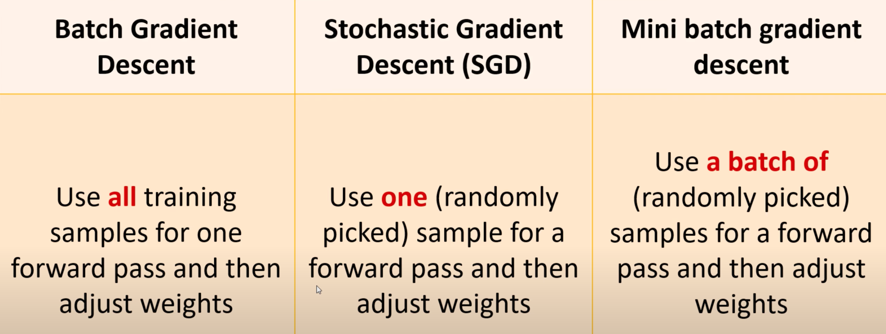

# S

## Sagemaker

 See [AWS Sagemaker]


## SageMaker Ground Truth

 Used for labelling the data by machines, internal employees, mechanical turk, or 3rd party partner.


## SageMaker Neo

 ~ compiler of ML models before they are distributed to the endpoint. Compatible with TensorFlow, XGBoost, MxNET, PyTorch, ... Allow the model to run without any framework, this reduce the memory footprint on the device (at the edge) by 100x, while improving the performance by x2.


## Sam Altman Person

 Sam Altman is the CEO of OpenAI, the buzzy AI firm he cofounded with Elon Musk.
 Before that, he was well known in Silicon Valley as president of startup accelerator Y-Combinator.
 Here's how the serial entrepreneur got his start — and ended up helming one of today's most-watched companies.

 

 More at:

  * [https://www.businessinsider.com/sam-altman-chatgpt-openai-ceo-career-net-worth-ycombinator-prepper-2023-1](https://www.businessinsider.com/sam-altman-chatgpt-openai-ceo-career-net-worth-ycombinator-prepper-2023-1)
  * [http://startupclass.samaltman.com/](http://startupclass.samaltman.com/)

 See also [S], ...


## Sample

 See also [S], [Distribution]


## Sample Efficiency

 How much is learned from each sample.

 Relate to the impact of training the model with more data. Should you get more data, more compute, or more weights/parameters?

 Sample Efficiency is a measure of how much experience an [agent] or an [algorithm] needs to generate in an environment during training in order to reach a certain level of performance. It is related to how well the agent or the algorithm can learn from the data it collects. A more sample efficient method needs fewer data or observations than a less sample efficient one to achieve the same or better results. Sample efficiency is important for [reinforcement learning], where data collection can be costly, time-consuming, or limited. Importance sampling is a technique that can be used to improve sample efficiency by reweighting the data according to their relevance or importance for the [learning objective]. For example, in [off-policy learning], where the agent learns from data generated by a different policy than the one it follows, importance sampling can be used to adjust the estimates of the value function or the policy gradient based on the ratio of the target policy and the behavior policy probabilities.

 See also [S], [Learning Velocity], [Neural Scaling Law]


## Sample Efficient Algorithm

 * [Sample Efficient RL Algorithms]

 See also [S], ...


## Sample Efficient RL Algorithm

 Here are some sample efficient reinforcement learning algorithms:

  * [Model-based RL] - Learn model of environment to simulate experiences. Examples: [Dyna], [PILCO].
  * [Hierarchical RL] - Learn policies at different levels of temporal abstraction over options. Accelerates learning.
  * [Transfer Learning] - Leverage knowledge from source tasks when learning target tasks. Jumpstarts learning.
  * [Few-shot RL] - Learn new tasks from only a few examples. Leverages prior knowledge.
  * [Curiosity-Driven RL] - Exploration bonuses for novel or uncertain states to guide experience collection.
  * [Prioritized Experience Replay] - Replay important transitions more frequently for efficient learning.
  * [Distributional RL] - Learn value distribution rather than just mean. Improves extrapolation.
  * [Unsupervised pre-training] - Pretrain representation using unsupervised learning before RL fine-tuning.
  * [Reward shaping] - Carefully shape reward function to accelerate learning the desired behavior.
  * [Goal-conditioned RL] - Train universal policies conditioned on goals. Generalizes to new goals.
  * [Hindsight experience replay] - Learn from failed episodes by pretending any state reached was the goal.
  * [Meta-learning] - Learn how to quickly adapt to new tasks within similar domains.

  In general, any method that enables effective generalization, transfers knowledge across tasks, or reduces the samples needed through simulation, pre-training, or guided exploration will improve sample efficiency.

 See also [S], ...


## Sampling Error

 Sampling errors occur when a sample of data is used to estimate a population parameter, such as the mean or proportion. These errors occur because the sample may not be a perfect representation of the population, and there will be some degree of difference between the sample statistic and the true population parameter. There are two types of sampling errors:
  * Random sampling error: Random sampling error occurs due to chance. It occurs because each sample of data will have some degree of variation from the population. The larger the sample, the smaller the random sampling error is likely to be.
  * Systematic sampling error: Systematic sampling error occurs due to bias in the sampling process. Bias can be introduced if the sample is not selected at random, or if the sample is not representative of the population.
 Both of these types of sampling errors can be reduced by using a larger sample size or by using a more representative sample. However, it is important to note that it is never possible to completely eliminate sampling error.

 See also [S], [Resampling Method], [Sampling]


## Sample Inefficient RL Algorithm

 Sample inefficiency refers to reinforcement learning algorithms that require a large number of interactions with the environment to learn an effective policy. Some key characteristics:

  * Sample inefficient algorithms need more samples (steps through the environment) to reach a good policy.
  * This is problematic for real-world environments where samples are expensive or limited.
  * Common causes are lack of generalization, not reusing past experience, or inability to plan ahead.
  * Random exploration without exploiting past knowledge wastes samples.
  * [Deep reinforcement learning] methods like [DQN] can be sample inefficient due to dependency on massive experience replays.
  * [Evolution strategies] are considered sample inefficient as random mutations ignore past fitness.
  * [Model-based RL] can improve sample efficiency by learning environment models for planning.
  * Hierarchy, abstraction, [transfer learning], and curiosity can improve sample efficiency.
  * Key metrics are total samples to threshold performance, samples per [epoch], and computational cost per sample.
  * [Sample efficiency] is crucial for real-world complex tasks like robotics where environment samples are slow and expensive.

  In summary, sample inefficient RL algorithms require large amounts of environment interaction to find performant policies. Improving sample efficiency remains an active research area in RL.

 See also [S], ...


## Sampling Method

  * Bayesian Optimizatin Sampling Method

 See also [S], [Bayesian Optimization Sampling Method]


## Satya Nadella Person

 CEO of [Microsoft]

 

 See also [S], ...


## Scale AI Company

 Focus on augmenting the data with metadata/labels

 More at:

  * [https://scale.com/](https://scale.com/)
  * [https://pitchbook.com/profiles/company/163154-17](https://pitchbook.com/profiles/company/163154-17)

 See also [S], ...


## Scale-Invariant Feature Transform (SIFT)

 Inspired by the [neocognitron]

 For any object in an image, interesting points on the object can be extracted to provide a "feature description" of the object. This description, extracted from a training image, can then be used to identify the object when attempting to locate the object in a test image containing many other objects. To perform reliable recognition, it is important that the features extracted from the training image be detectable even under changes in image scale, noise and illumination. Such points usually lie on high-contrast regions of the image, such as object edges.

 Another important characteristic of these features is that the relative positions between them in the original scene shouldn't change from one image to another. For example, if only the four corners of a door were used as features, they would work regardless of the door's position; but if points in the frame were also used, the recognition would fail if the door is opened or closed. Similarly, features located in articulated or flexible objects would typically not work if any change in their internal geometry happens between two images in the set being processed. However, in practice SIFT detects and uses a much larger number of features from the images, which reduces the contribution of the errors caused by these local variations in the average error of all feature matching errors.

 

 More at:

  * [https://en.wikipedia.org/wiki/Scale-invariant_feature_transform](https://en.wikipedia.org/wiki/Scale-invariant_feature_transform)
  * <!> not this SIFT method! - [https://oer.pressbooks.pub/collegeresearch/chapter/the-sift-method/](https://oer.pressbooks.pub/collegeresearch/chapter/the-sift-method/)

 See also [S], ...


## Scaled Dot-Product (SDP)

 * Scaled => kind of a normalization
 * Dot-product = kind of similarity measure (cosine similarity)

 See also [S], ...


## Scaled Dot-Product (SDP) Attention

 * attention = kind of a weighted sum, with attention weights (tensor)

 

 See also [S], [Self-Attention]


## Scaler

 Standardization of a dataset is a common requirement for many machine learning estimators: they might behave badly if the individual features do not more or less look like standard normally distributed data (e.g. Gaussian with 0 mean and unit variance). For instance many elements used in the objective function of a learning algorithm (such as the RBF kernel of Support Vector Machines or the L1 and L2 regularizers of linear models) assume that all features are centered around 0 and have variance in the same order. If a feature has a variance that is orders of magnitude larger than others, it might dominate the objective function and make the estimator unable to learn from other features correctly as expected. THe standard scaler does the following:
  * Standardize features by removing the mean and scaling to unit variance.
  * The standard score of a sample x is calculated as:
 
```
z = (x - u) / s

u == mean of discrete random variable
u = sum(x) / number_of_samples

v == variance of discrete random variable in training sample
v = 1 / number_of_sample * ( sum_of_each_sample ( sample_value - mean) ^ 2) )

s == standard deviation of discrete random variable in random sample
s = sqrt(v)
```

 Example in code
 
```pycon
>>> from sklearn.preprocessing import StandardScaler
>>> data = [[0, 0], [0, 0], [1, 1], [1, 1]
>>> scaler = StandardScaler()
>>> print(scaler.fit(data))
StandardScaler()
>>> print(scaler.mean_)                       # (0 + 0 + 1 + 1 ) / 4 = 0.5
[0.5 0.5]
                                              # the variance is the average of each point from the mean.
>>> print(scaler.var_)                        # [ (0-0.5)^2 + (0-0.5)^2 + (1-0.5)^2 + (1-0.5)^2 ] / 4 =  (0.5)^2 = 0.25
[0.25, 0.25]
>>> print(scaler.transform(data))
[[-1. -1.]                                    # 0 --> (0 - 0.5) / sqrt(0.25) = -1
 [-1. -1.]
 [ 1.  1.]                                    # 1 --> (1 - 0.5) / sqrt(0.25) = 1
 [ 1.  1.]
>>> print(scaler.transform([[2, 2]]))
[[3. 3.]]                                     # 2 --> (2 - 0.5) / sqrt(0.25) = 3
```

 See also [S], [Estimator]


## Scaling Law

 See [Neural Scaling Law]


## Seaborn Python Module

 A [python module] for Statistical Data Visualization

 See also [S], ...


## Search Algorithm

 Problems

  * [Traveling Salesman]

 Algorithm

  * A*

 See also [S], [Objective Function]


## Search Problem

 See also [S], [State Model]


## Scene Graph

 Do entity extract + add relationship. Can be built based from text or images.

 See also [S], [Entity Extraction], [Graph Neural Network], [Knowledge Graph], [Relation Extraction]


## ScienceQA Dataset

 ScienceQA, in contrast to previous datasets, has richer domain diversity from three subjects: natural science, language science, and social science. ScienceQA features 26 topics, 127 categories, and 379 skills that cover a wide range of domains.

 

 More at:

  * [https://github.com/lupantech/ScienceQA](https://github.com/lupantech/ScienceQA)
  * explore - [https://scienceqa.github.io/explore.html](https://scienceqa.github.io/explore.html)

 See also [S], ...


## Scikit Learn

 Since its release in 2007, scikit-learn has become one of the most popular machine learning libraries. scikit-learn provides algorithms for machine learning tasks including classification, regression, dimensionality reduction, and clustering. It also provides modules for pre-processing data, extracting features, optimizing hyperparameters, and evaluating models. scikit-learn is built on the popular Python libraries NumPy and SciPy. NumPy extends Python to support efficient operations on large arrays and multi-dimensional matrices. SciPy provides modules for scientific computing. The visualization library matplotlib is often used in conjunction with scikit-learn.

 See also [S], [Dataset]


## Secure AI Framework (SAIF)
 
 ~ a security framework for AI models developed by [Google] 

 The potential of AI, especially generative AI, is immense. As innovation moves forward, the industry needs security standards for building and deploying AI responsibly. That’s why we introduced the Secure AI Framework (SAIF), a conceptual framework to secure AI systems.

 SAIF is designed to address top-of-mind concerns for security professionals, such as AI/ML model risk management, security, and privacy — helping to ensure that when AI models are implemented, they are secure-by-default.

 * Expand strong security foundations to the AI ecosystem
 * Extend detection and response to bring AI into an organization’s threat universe
 * Automate defenses to keep pace with existing and new threats
 * Harmonize platform level controls to ensure consistent security across the organization
 * Adapt controls to adjust mitigations and create faster feedback loops for AI deployment
 * Contextualize AI system risks in surrounding business processes

 

 

 More at:

  * site - [https://safety.google/cybersecurity-advancements/saif/](https://safety.google/cybersecurity-advancements/saif/)
  * announcement - [https://blog.google/technology/safety-security/introducing-googles-secure-ai-framework/](https://blog.google/technology/safety-security/introducing-googles-secure-ai-framework/)

 See also [S], ...


## Segformer Model

 Semantic image segmentation with transformers. Developed by [Nvidia]

 

 

 

 More at:

  * site - [https://github.com/NVlabs/SegFormer](https://github.com/NVlabs/SegFormer)
  * paper - [https://arxiv.org/abs/2105.15203](https://arxiv.org/abs/2105.15203)

 See also [S], [OpenMMLab]


## Segment Anything Model (SAM)

 [Meta] has launched Segment Anything, a project that introduces the Segment Anything Model (SAM), a promptable model for [image segmentation][INstance Segmentation] in [computer vision]. SAM can generate masks for any object in any image or video and learn a generalized notion of objects, making it a powerful tool for various applications, such as AR/VR, content creation, and scientific domains. SAM's promptable design allows for flexible integration with other systems, eliminating the need for task-specific modeling expertise, training compute, and custom data annotation. SAM is a single model that can perform both interactive and automatic segmentation, making it a unique and innovative tool in the field of computer vision.

 META AI has also released the Segment Anything 1-Billion mask dataset (SA-1B), containing more than 1.1 billion segmentation masks collected from about 11 million licensed and privacy-preserving images. The [dataset] is the largest segmentation dataset to date and has been verified through human evaluation studies. By sharing their research and dataset, META AI hopes to accelerate research in segmentation and contribute to more general image and video understanding, unlocking even more powerful AI systems in the future.

 More at:

  * [https://segment-anything.com/](https://segment-anything.com/)
  * demo - [https://segment-anything.com/demo](https://segment-anything.com/demo)

 See also [S], ...


## Self-Attention

 Use itself as input to

   * find to what pronouns are referring to, what noun is being modified by adjective, subject of verbs, etc
   * (implicit) grammar rules  --- when you learn to speak, you do not have to learn grammar rules first to speak!

 

 

 More at:

  * code explanation - [https://nlp.seas.harvard.edu/annotated-transformer/](https://nlp.seas.harvard.edu/annotated-transformer/)
  * [https://towardsdatascience.com/self-attention-5b95ea164f61](https://towardsdatascience.com/self-attention-5b95ea164f61)

 See also [S], [Attention], [Attention-Based Model], [Masked Self-Attention], [Multi-Head Attention], [Scaled Dot-Product Attention]


## Self-Consistency (SC) Prompting

 ~ a [prompt engineering technique] that improves over [Chain-Of-Thought (COT)] prompting.

 Self-consistency aims "to replace the naive greedy decoding used in chain-of-thought prompting". The idea is to sample multiple, diverse reasoning paths through few-shot [CoT], and use the generations to select the most consistent answer. This helps to boost the performance of [CoT prompting] on tasks involving arithmetic and commonsense reasoning.

```
Q: There are 15 trees in the grove. Grove workers will plant trees in the grove today. After they are done,
there will be 21 trees. How many trees did the grove workers plant today?
A: We start with 15 trees. Later we have 21 trees. The difference must be the number of trees they planted.
So, they must have planted 21 - 15 = 6 trees. The answer is 6.
Q: If there are 3 cars in the parking lot and 2 more cars arrive, how many cars are in the parking lot?
A: There are 3 cars in the parking lot already. 2 more arrive. Now there are 3 + 2 = 5 cars. The answer is 5.
Q: Leah had 32 chocolates and her sister had 42. If they ate 35, how many pieces do they have left in total?
A: Leah had 32 chocolates and Leah’s sister had 42. That means there were originally 32 + 42 = 74
chocolates. 35 have been eaten. So in total they still have 74 - 35 = 39 chocolates. The answer is 39.
Q: Jason had 20 lollipops. He gave Denny some lollipops. Now Jason has 12 lollipops. How many lollipops
did Jason give to Denny?
A: Jason had 20 lollipops. Since he only has 12 now, he must have given the rest to Denny. The number of
lollipops he has given to Denny must have been 20 - 12 = 8 lollipops. The answer is 8.
Q: Shawn has five toys. For Christmas, he got two toys each from his mom and dad. How many toys does
he have now?
A: He has 5 toys. He got 2 from mom, so after that he has 5 + 2 = 7 toys. Then he got 2 more from dad, so
in total he has 7 + 2 = 9 toys. The answer is 9.
Q: There were nine computers in the server room. Five more computers were installed each day, from
monday to thursday. How many computers are now in the server room?
A: There are 4 days from monday to thursday. 5 computers were added each day. That means in total 4 * 5 =
20 computers were added. There were 9 computers in the beginning, so now there are 9 + 20 = 29 computers.
The answer is 29.
Q: Michael had 58 golf balls. On tuesday, he lost 23 golf balls. On wednesday, he lost 2 more. How many
golf balls did he have at the end of wednesday?
A: Michael initially had 58 balls. He lost 23 on Tuesday, so after that he has 58 - 23 = 35 balls. On
Wednesday he lost 2 more so now he has 35 - 2 = 33 balls. The answer is 33.
Q: Olivia has $23. She bought five bagels for $3 each. How much money does she have left?
A: She bought 5 bagels for $3 each. This means she spent 5
Q: When I was 6 my sister was half my age. Now I’m 70 how old is my sister?
A:

# output 1
When I was 6 my sister was half my age, so she was 3. Now I am 70, so she is 70 - 3 = 67. The answer is 67.

# output 2
When the narrator was 6, his sister was half his age, which is 3. Now that the narrator is 70, his sister would be 70 - 3 = 67 years old. The answer is 67.

# output 3
When I was 6 my sister was half my age, so she was 3. Now I am 70, so she is 70/2 = 35. The answer is 35.
```

 Computing for the final answer involves a few steps (check out the paper for the details) but for the sake of simplicity, we can see that there is already a majority answer emerging so that would essentially become the final answer.

 

 More at:

  * paper - [https://arxiv.org/abs/2203.11171](https://arxiv.org/abs/2203.11171)
  * [https://www.promptingguide.ai/techniques/consistency](https://www.promptingguide.ai/techniques/consistency) 

 See also [S], ...


## Self-Destructive Model

 A way to make sure that a model cannot be retrained or fine-tuned for negative intent.
 So the end user does not have to be trusted to have good intentions to use a model.
 This is being researched now.

 For what I understand, the model is using "instabilities" ... whatever that means!

 See also [S], ...


## Self-Driving Car

 See also [S], ...


## Self-Improvement

 AlphaGo approach consists in 2 steps:
 1. Learn by imitation , but cannot surpass human
 1. to surpass human, you need another method ==> self-improvement

 See also [S], ...


## Self-Instruct Dataset

 The Self-Instruct process is an iterative bootstrapping algorithm that starts with a seed set of manually-written instructions and uses them to prompt the language model to generate new instructions and corresponding input-output instances. These generations are then filtered to remove low-quality or similar ones, and the resulting data is added back to the task pool. This process can be repeated multiple times, resulting in a large collection of instructional data that can be used to fine-tune the language model to follow instructions more effectively.

 {:width="100%"}

 We plot the below figure to demonstrate the diversity of our data. The inner circle of the plot represents the root verb of the instructions, and the outer circle represents the direct objects.

 {:width="100%"}

 This dataset was created to be used to train the [Alpaca model]

 

 More at:

  * [https://github.com/clcarwin/self-instruct-for-alpaca-dataset](https://github.com/clcarwin/self-instruct-for-alpaca-dataset)
  * paper - [https://arxiv.org/abs/2212.10560](https://arxiv.org/abs/2212.10560)

 See also [S], ...


## Self-Organizing Map (SOM) Algorithm

 SOM (Self-Organizing Map), also known as Kohonen map, is an [unsupervised learning] algorithm used for clustering, visualization, and dimensionality reduction tasks. It was developed by Finnish professor Teuvo Kohonen in the 1980s.

 SOM is a type of artificial neural network that learns to represent the input data in a lower-dimensional grid or map while preserving the topological relationships between the data points. The algorithm organizes the input data based on their similarity, grouping similar instances together in the map.

 Here's a general overview of how SOM works:
  1. Initialization: SOM starts by initializing a grid of neurons, each representing a specific location in the map. Each neuron is associated with a weight vector of the same dimensionality as the input data.
  1. Training: The algorithm iteratively presents input data samples to the SOM. For each input sample, the algorithm finds the best matching unit (BMU), which is the neuron with weight vector closest to the input sample in terms of similarity (e.g., using Euclidean distance).
  1. Neighborhood Update: After finding the BMU, the algorithm updates the weights of the BMU and its neighboring neurons in the map. The update is performed to move the weights closer to the input sample, encouraging nearby neurons to become more similar to the BMU.
  1. Iteration: The training process repeats for a specified number of iterations or until convergence. As the training progresses, the map self-organizes, and similar input samples tend to be grouped together.
  1. Visualization and Clustering: Once trained, the SOM can be used for various purposes. It can be used to visualize the high-dimensional input data in a lower-dimensional map, providing insights into the underlying structure of the data. Additionally, the SOM can be used for clustering by assigning new instances to the cluster associated with the BMU or by grouping instances that are close to each other in the map.

 SOM is particularly useful for visualizing and exploring high-dimensional data, discovering clusters or patterns, and reducing the dimensionality of data for subsequent analysis. It has applications in various fields, including data mining, image processing, feature extraction, and anomaly detection.

 {:width="100%"}

 

 

 

 More at:

  * [https://www.superdatascience.com/blogs/the-ultimate-guide-to-self-organizing-maps-soms](https://www.superdatascience.com/blogs/the-ultimate-guide-to-self-organizing-maps-soms)

 See also [S], [Unsupervised Deep Learning Model], [Unsupervised Learning]


## Self-Play

 The idea that an agent can improve its gameplay by playing against slightly different versions of itself because it'll progressively encounter more challenging situation s.

 Approach used by [AlphaGo]

 See also [S], ...


## Self-Reflection (SR) Prompting

 Self-reflection prompting is a technique used to improve the performance and reasoning capabilities of Large Language Models (LLMs) by encouraging the model to explicitly review, critique, and refine its own outputs.

 This approach is inspired by human metacognition - our ability to think about our own thinking processes, which helps us learn and improve problem-solving skills.

 Metacognitive Process

  * The LLM is asked to evaluate its initial response
  * It critically examines its own reasoning, potential errors, or limitations
  * Encourages a more thoughtful and nuanced approach to problem-solving

 Typical Implementation

  * After generating an initial response, the model is prompted to:
    * Check the logic of its reasoning
    * Identify potential weaknesses or biases
    * Suggest improvements or alternative approaches
    * Verify the accuracy of key claims

 Benefits

  * Reduces hallucinations
  * Improves answer accuracy
  * Enhances reasoning capabilities
  * Promotes more comprehensive problem-solving
  * Helps identify potential blind spots in the model's initial response

```
// Initial Task Prompt
Solve the following word problem: A bakery sells cookies at $3 each. They want to raise $450 for a charity event. How many cookies do they need to sell to reach their fundraising goal?

Please show your calculation step by step.

// Potential Self-Reflection Prompt
You just solved the previous math problem. Now, I want you to review your solution carefully:

1. Verify your calculation method
2. Check if your computational steps are mathematically correct
3. Confirm that your final answer directly addresses the original question
4. Identify any potential assumptions or simplifications you made
5. Suggest if there are alternative ways to solve this problem

If you find any errors in your previous solution, provide the corrected calculation and explain why your initial approach might have been incorrect.
```

 See also [S], ...


## Self-Reflective Retrieval Augmented Generation (SR-RAG) System

 ~ a more advanced version of a traditional [RAG system]

 Self-Reflective RAG, closely related to [CRAG], incorporates feedback loops such as re-generating questions or re-retrieving documents based on the relevance and accuracy of the initially retrieved information. This approach necessitates the use of state machines, where a series of steps and transitions are defined to enhance the relevance and quality of the generated content.

 {: width="100%}

 More at:

  * articles
    * [https://blog.langchain.dev/agentic-rag-with-langgraph/](https://blog.langchain.dev/agentic-rag-with-langgraph/)

 See also [S], ...


## Self-Supervised Learning (SSL)

 ~ a form of unsupervised learning, where manually labeled data is not needed. Raw data is instead modified in an automated way to create artificial labels to learn from. An example of SSL is learning to complete text by masking random words in a sentence and trying to predict the missing ones.

 ~ automatic generation of labels from the unlabelled input data.` A type of learning that does not need labels to be applied by humans. The training dataset is generated from the data. Examples:

   * [Next word prediction] - "she planned to visit the"
   * [Masked Language Modeling] - "Alice chased the ____ rabbit and fell down the ____ into a new world."
   * Replaced word detection : "The cat pounced on the carrot"
   * Paraphrased sentences : "He needs to throw a lot of things -- he has a lot of stuff to get rid off."

 {: width="100%}

 Self-supervised learning in humans refers to the process by which individuals acquire knowledge and skills through their own experiences and interactions with their environment, without the need for explicit external feedback or instruction.  This type of learning can occur in a variety of contexts, including during childhood development, where children learn to walk, talk, and interact with their surroundings through self-directed exploration and experimentation.  Self-supervised learning can also occur in more advanced stages of learning, such as when individuals acquire new skills or knowledge in their field of expertise through self-directed practice and experimentation. Overall, self-supervised learning for humans is a natural and essential process that enables individuals to acquire new knowledge and skills in a self-directed and autonomous manner.

 See also [S], [Data2Vec Model], [Replaced Word Detection], [Semi-Supervised Learning], [Supervised Learning], [Unsupervised Learning], [Upstream Task]


## Semantic Embedding

 {: width="100%}

 See also [S], [Semantic Space], [Zero-Shot Learning]


## Semantic Router

 An alternative to [React Prompting] iwhen working with [AI Agents], where a query is semantically mapped to an embedded space where tool queries are mapped.

 :warning: can also be used for safeguards !

 :warning: Can be used for RAG !

/// details | That probably works well for 1 tools, but what about several tools?
    type:question

///

 

 More at:

  * notebooks 
    * get started - [https://github.com/aurelio-labs/semantic-router/blob/main/docs/00-introduction.ipynb](https://github.com/aurelio-labs/semantic-router/blob/main/docs/00-introduction.ipynb)
    * langchain - [https://github.com/aurelio-labs/semantic-router/blob/main/docs/03-basic-langchain-agent.ipynb](https://github.com/aurelio-labs/semantic-router/blob/main/docs/03-basic-langchain-agent.ipynb)

 See also [S], ...


## Semantic Search

 = embedding + similarity + reranking

 Semantic search leverages deep neural networks to intelligently search through data. You interact with it every time you search on Google. Semantic search is helpful when you want to search for something based on the context rather than specific keywords.

 Semantic search is often used in [retriever] in [RAG]

/// warning | Beware:
  * If you only use embeddings and similarity, you may not be finding the answer to the question as the closest point may be out of date or false. To solve this, you need to use [reranking] --> give a score to all the nearest embeddings and pick the one with the highest score!
///

 

 More at:

  * [https://txt.cohere.com/what-is-semantic-search/](https://txt.cohere.com/what-is-semantic-search/)

 See also [S], [Lexical Search], [Natural Language Processing], [Similarity Metric]


## Semantic Segmentation

 semantic segmentation algorithm provides a fine-grained, pixel-level approach to developing computer vision applications. It tags every pixel in an image with a class label from a predefined set of classes (ex: a person). Tagging is fundamental for understanding scenes, which is critical to an increasing number of computer vision applications, such as self-driving vehicles, medical imaging diagnostics, and robot sensing.
 
 For comparison, the Amazon SageMaker Image Classification Algorithm is a supervised learning algorithm that analyzes only whole images, classifying them into one of multiple output categories. The Object Detection Algorithm is a supervised learning algorithm that detects and classifies all instances of an object in an image. It indicates the location and scale of each object in the image with a rectangular bounding box.
 
 Because the semantic segmentation algorithm classifies every pixel in an image, it also provides information about the shapes of the objects contained in the image. The segmentation output is represented as an RGB or grayscale image, called a segmentation mask. A segmentation mask is an RGB (or grayscale) image with the same shape as the input image.

 {: width="100%}

 More at:

  * [https://heartbeat.fritz.ai/the-5-computer-vision-techniques-that-will-change-how-you-see-the-world-1ee19334354b](https://heartbeat.fritz.ai/the-5-computer-vision-techniques-that-will-change-how-you-see-the-world-1ee19334354b)

 See also [S], [Convolutional Neural Network], [Instance Segmentation], [U-Net Architecture]


## Semantic Space

 semantic space, where the knowledge from seen classes can be transferred to unseen classes.

 See also [S], [Embedding Space], [Latent Space], [Semantic Embedding], [Zero-Shot Learning]


## Semantic Understanding

 machine translation, information extraction, text summarization, question answering.

 See also [S], [Benchmark]


## Semi-Supervised Learning

 ~ `dataset not fully labeled --> use similarity to label other data` Supervised learning and unsupervised learning can be thought of as occupying opposite ends of a spectrum. Some types of problem, called semi-supervised learning problems, make use of both supervised and unsupervised data; these problems are located on the spectrum between supervised and unsupervised learning.  Several algorithm can be used like neighbor infection or nearest labeled neighbor. Example A: In a series of picture, you recognize people, let's say 4 of them. If you tag one image, then the tags can be pushed to all the other images. Example B: Classification problem but only on a small subset you have is CORRECTLY labeled. Can you train your model with the rest of the unlabelled data? 

 See also [S], [K-Nearest Neighbors Algorithm], [Self-Supervised Learning], [Supervised Learning], [Unlabelled Data Algorithm], [Unsupervised Learning], [Weak-Supervised Learning]


## Sensitivity

 ~ capacity at detecting a rare disease based on a threshold (?)

 ~ a term more commonly used in fields like medicine or epidemiology. It describes a test's ability to correctly identify patients with a disease (true positives).

 ~ High sensitivity = test is effective at detecting positive cases without missing many 

 ~ aka [recall] in the field of [ML] and information retrieval. It describes the ability of a model to find all the relevant cases within a dataset.

 ~ aka [True Positive Rate (TPR)][TPR] in the context of a classifier. = probability of a positive test given the patient has the disease.  Sensitivity refers to the probability of a positive test, conditioned on truly being positive. Examples:

  * how many sick people were CORRECTLY identified as having the condition.

```
# P(Pos) = Probability of getting a positive test result
# P(D) = The probability of a person having diabetes
# P(~D) = The probabilitiy of a person NOT having diabetes
## Sensitivity = 
## Specificity =
P(Pos) = [P(D) * Sensitivity] + [P(~D) * (1-Specificity))]
```

 More at:

  * articles
    * [https://medium.com/analytics-vidhya/what-is-a-confusion-matrix-d1c0f8feda5](https://medium.com/analytics-vidhya/what-is-a-confusion-matrix-d1c0f8feda5)
    * [https://medium.com/becoming-human/naive-bayes-theorem-d8854a41ea08](https://medium.com/becoming-human/naive-bayes-theorem-d8854a41ea08)

 See also [S], [Confusion Matrix], [Sensitivity-Specificity Trade-Off], [Specificity]


## Sensitivity-Specificity Trade-Off

 The sensitivity-specificity trade-off in a classifier refers to the balance between two key metrics:

  * [Sensitivity] (or [Recall]): The ability of the classifier to correctly identify positive instances. It is calculated as the proportion of true positives out of the total actual positives.
  * [Specificity]: The ability of the classifier to correctly identify negative instances. It is calculated as the proportion of true negatives out of the total actual negatives.

 The trade-off between sensitivity and specificity arises because improving one of these metrics often comes at the expense of the other. This is particularly evident in classifiers that output a probability or score, where a threshold is set to determine the class labels (positive or negative). Adjusting this threshold will typically increase one metric but decrease the other.

 Here's how:

  * Lowering the Threshold: If you lower the threshold for classifying an instance as positive, you will likely identify more true positives (increasing sensitivity), but you will also likely misclassify more negatives as positives (decreasing specificity).
  * Raising the Threshold: Conversely, if you raise the threshold, you'll classify fewer instances as positive. This can lead to fewer false positives (increasing specificity), but also more false negatives (decreasing sensitivity).

 This trade-off is crucial in many real-world applications. For example, in medical diagnostics, a high sensitivity is often desired for initial screenings to ensure that as many cases of a disease as possible are identified. However, this might come at the cost of higher false positives, leading to more follow-up tests. On the other hand, in a different context, one might prefer high specificity to ensure that only the most likely cases are pursued further.

 The [Receiver Operating Characteristic (ROC) curve][ROC Curve] is a common tool used to visualize this trade-off. It plots the [True Positive Rate] ( or [Sensitivity]) against the [False Positive Rate] or  (1 - [Specificity]) at various threshold settings. The [Area Under the Receiver Operating Characteristic (AUROC) curve][AUROC Curve] can give a sense of the overall ability of the [binary classifier] to discriminate between the two classes, independent of any particular threshold.

 In summary, the sensitivity-specificity trade-off highlights the balancing act in setting the threshold for [classification], where the goal is to achieve an optimal balance that suits the specific needs and consequences of the classification task at hand.

 See also [S], ...


## Sentence-BERT (SBERT) Model

 A derivative model of [BERT] that ...

 See also [S], ...


## Sentence Embedding

 A type of [embeddings]

  * [Universal Sentence Encoder (USE)] – Encodes sentences into high-dimensional vectors using a transformer or deep averaging network. For example, the sentences “The quick brown fox jumps over the lazy dog” and “A swift auburn fox leaps over a sleepy canine” would have similar embeddings because they convey the same meaning.
  * Sentence-BERT (SBERT) – Fine-tunes BERT on sentence-pair regression tasks to produce meaningful sentence embeddings. For instance, determining that “How do I reset my password?” is similar in meaning to “What is the process to change my password?”. This capability is excellent for applications like FAQ matching and paraphrase detection

 More at:

  * tutorial - [https://txt.cohere.com/sentence-word-embeddings/](https://txt.cohere.com/sentence-word-embeddings/)
  * articles
    * LLM embeddings - [https://www.iguazio.com/glossary/llm-embeddings/](https://www.iguazio.com/glossary/llm-embeddings/)

 See also [S], ...


## SentencePiece Tokenizer

 ~ a type of [tokenizers]

 More at:

  * paper - [https://arxiv.org/abs/1808.06226](https://arxiv.org/abs/1808.06226)

 See also [S], [Detokenizer]


## Sentient AI

 Is Google's [Lambda Model] sentient?

 

 

 

 

 More at:

  * [https://bdtechtalks.com/2023/02/20/llm-dissociating-language-and-thought/](https://bdtechtalks.com/2023/02/20/llm-dissociating-language-and-thought/)
  * [https://cajundiscordian.medium.com/is-lamda-sentient-an-interview-ea64d916d917](https://cajundiscordian.medium.com/is-lamda-sentient-an-interview-ea64d916d917)
  * [https://medium.com/movement-dao/fired-google-engineer-blake-lemoine-on-his-future-lamda-and-ai-advocacy-98c816dde89e](https://medium.com/movement-dao/fired-google-engineer-blake-lemoine-on-his-future-lamda-and-ai-advocacy-98c816dde89e)
  * [https://www.theatlantic.com/ideas/archive/2022/06/google-lamda-chatbot-sentient-ai/661322/](https://www.theatlantic.com/ideas/archive/2022/06/google-lamda-chatbot-sentient-ai/661322/)

 See also [S], ...


## Sentiment Analysis

 Marketers collect social media posts about specific brands, conversation subjects, and keywords, then use NLP to analyze how users feel about each topic, individually and collectively. This helps the brands with customer research, image evaluation, and social dynamics detection.

 Architectures:

  * [Natural Language ToolKit (NLTK)]
  * [BERT Model]
  * [VADER]
  * [GPT Model] - requires API call

 More at:

  * [https://www.geeksforgeeks.org/twitter-sentiment-analysis-using-python/](https://www.geeksforgeeks.org/twitter-sentiment-analysis-using-python/)
  * word sentiment weight - [https://observablehq.com/d/caaff7524e19d7ba](https://observablehq.com/d/caaff7524e19d7ba)

 See also [S], [Benchmark], [Natural Language Processing]


## Sequence Model

 Map one sequence to a similar sequence

 {: width="100%}

 See also [S], [Convolutional Neural Network (CNN)], [Neural ODE], [Recurrent Neural Network (RNN)], [Transformer Architecture]


## Sequence To Sequence (Seq2Seq) Model

 = A [supervised learning] algorithm where the input is a sequence of tokens (for example, text, audio) and the output generated is another sequence of tokens. 

 Example applications include:

  * [machine translation] - input a sentence from one language and predict what that sentence would be in another language
  * [text summarization] - input a longer string of words and predict a shorter string of words that is a summary
  * [speech-to-text] - audio clips converted into output sentences in tokens.

 Recently, problems in this domain have been successfully modeled with deep neural networks that show a significant performance boost over previous methodologies. Amazon SageMaker seq2seq uses [Recurrent Neural Networks (RNNs)][RNN] and [Convolutional Neural Network (CNN)][CNN] models with [attention] as encoder-decoder architectures. Seq2Seq models are particularly good at translation, where a sequence of words from one language is transformed into a sequence of different words in another language.

 ==Google Translate started using a Seq2Seq-based model in production in late 2016==

 {: width="100%}

 Seq2Seq models consist of two parts: an [encoder] and a [decoder]. Imagine the encoder and decoder as human translators who can each speak only two languages, with each having a different mother tongue. For our example, we’ll say the encoder is a native French speaker and the decoder is a native English speaker. The two have a second language in common: let’s say it’s Korean. To translate French into English, the encoder converts the French sentence into Korean (known as context) and passes on the context to the decoder. Since the decoder understands Korean, he or she can now translate from Korean into English. Working together, they can translate the French language to English.

 

 See also [S], [Seq2Seq Transformer], [Natural Language Processing], [Text-To-Speech Model]


## Sequence To Sequence (Seq2Seq) Transformer

 When you use the encoder and decoder of a transformer, you can do a sequence to sequence transformer!

 {: width="100%}

 See also [S], [Decoder], [Encoder], [Encoder-Decoder Model]


## Sequential Data

 {: width="100%}

 See also [S], ...


## Serialized Flat File

 The model in compact form, delivered to endpoint.


## Service Robot

 A type of [robots] that ...

 See also [S], ...


## Shallow Neural Network

 See also [S], ...


## Shane Legg Person

 One of the 3 founders of [DeepMind]

 

 See also [S], ...


## Shannon Entropy

 See [Entropy]


## Shapley Additive Explanations (SHAP) Value

 The Shapley Additive Explanations (SHAP) is another novel approach to [explainability] developed by Scott Lundberg at [Microsoft] and eventually opened sourced.

 SHAP has a strong mathematical foundation based on Shapley values in game theory where each player in the cooperation is rewarded based on how important they are to cooperation.

 
 
 More at:

  * paper - [https://arxiv.org/abs/1705.07874](https://arxiv.org/abs/1705.07874)
  * [https://towardsdatascience.com/what-is-explainable-ai-xai-afc56938d513](https://towardsdatascience.com/what-is-explainable-ai-xai-afc56938d513)

 See also [S], ...


## Shapley Value

 In [Game Theory], ...

 More at:

  * [https://en.wikipedia.org/wiki/Shapley_value](https://en.wikipedia.org/wiki/Shapley_value)

 See also [S], [Shapley Additive Explanations]


## Shifted Window Attention (SWA)

 ~ allow LLM to handle long sequences with reduced inference cost

 SWA is an attention mechanism designed to enable efficient processing of longer input sequences in transformers and related neural network models.

 Used by [Longformer Models] such as:

  * [Mistral Models]

 Here are the key points about Shifted Window Attention (SWA):

  * Like grouped query attention, SWA divides the input sequence into chunks or windows to focus the attention.
  * However, unlike grouped attention, the windows in SWA overlap with each other. For example, a sequence could be divided into windows 1-100, 51-150, 101-200 etc, with 50 tokens of overlap.
  * This overlapping window approach allows each token to attend within its window as well as to tokens from adjacent windows. This provides wider contextual attention than isolated groups.
  * Additionally, the windows are shifted systematically across the sequence. So window 1 covers tokens 1-100, window 2 then covers tokens 51-150, and so on. This shifting enables all tokens to be covered by overlapping windows.
  * Mathematically, this shifting of systematic, overlapping windows enables efficient attention computation in transformers. It limits the complexity that comes from full global attention across extremely long sequences.

 In summary, SWA reduces computational overhead while retaining modeling flexibility for longer sequences. The shifting windows provide efficiency while the overlap enables wider attention. This helps advanced transformers scale effectively to tasks with longer inputs while still utilizing the power and benefits of attention mechanisms.

 See also [S], ...


## Short Circuit Movie

 Short Circuit is a 1986 American science fiction comedy film directed by John Badham and written by S. S. Wilson and Brent Maddock. The film's plot centers upon an experimental military robot that is struck by lightning and gains a human-like intelligence, prompting it to escape its facility to learn more about the world.

 

 More at:

  * https://en.wikipedia.org/wiki/Short_Circuit_(1986_film)

 See also [S], [AI Movie]


## Siamese Network

 A convolutional encoder that looks at similarities. Ex: Compare 2 images of a lion with nothing else.
 
 {: width="100%}

 See also [S], [One Short Learning], [Similarity Metric]


## SIGGRAPH Conference

 An [AI conference] reltated to graphics and interactive techniques

 More at:

  * [https://s2023.siggraph.org/](https://s2023.siggraph.org/)

 See also [S], ...


## Sigmoid Activation Function

 Pros:

  * output is between 0 and 1
  * sigmoid can be used as a switch (in LSTM and GRU cells)
  * solves exploding gradient problem

 Cons:

  * vanishing gradient problem

 See also [S], [Activation Function], [Exploding Gradient Problem], [Vanishing Gradient Problem]


## Sigmoid Function

 Used as an activation function and in logistic regression.

 {: width="100%}

 See also [S], [Logistic Regression], [Sigmoid Activation Function]


## Similarity Metric

 Similarity is almost like distance in the semantic embedding space, except that:

  * When the distance is small, the similarity is big
  * When the distance is big, the similarity is small

 Functions:

  * [Euclidean Distance]
  * [Manhattan Distance]
  * [Cosine Similarity]
  * [Dot Product Similarity]
  * [Scaled Dot Product Similarity]
  * [Hadamard Product]

 See also [S], [Encoder], [One-Shot Learning], [Siamese Network]


## Similarity Search

 Algorithms:

  * [K-Nearest Neighbors] - good, but slow as I have to calculate as many distances as we have points in the dataset! (Ex: 8 words --> 8^2 distances)
  * [Inverted File Index (IVD)][IVD] - cluster, then search
  * [Hierarchical Navigable Small World (HNSW)][HNSW] - Start with fewer points, search there. Then add more and iterate
  * [Local Sensitive Hashing (LSH)][LSH]

 See also [S], ...


## Simulated Policy Learning (SimPLe) Algorithm

 In [Reinforcement Learning], ... 

 See also [S], ...


## Simulated-To-Real (Sim2Real) Performance Gap

 Because the simulation cannot capture all aspects of the real world accurately, the models trained in simulation may not work well in the real world. Such discrepancies are often referred to as simulated-to-real (sim2real) performance gaps.

 Many factors affect the real-world performance of a trained model, including the choice of the action space, reward function, hyperparameters used in the training, and vehicle calibration as well as real-world track conditions. In addition, the simulation is only an (often crude) approximation of the real world. They make it a challenge to train a model in simulation, to apply it to the real world, and to achieve a satisfactory performance.

 Training a model to give a solid real-world performance often requires numerous iterations of exploring the reward function, action spaces, hyperparameters, and evaluation in simulation and testing in a real environment. The last step involves the so-called simulation-to-real world (sim2real) transfer and can feel unwieldy.

 More at:

  * [https://docs.aws.amazon.com/deepracer/latest/developerguide/deepracer-how-it-works-virtual-to-physical.html](https://docs.aws.amazon.com/deepracer/latest/developerguide/deepracer-how-it-works-virtual-to-physical.html)
  * [https://docs.aws.amazon.com/deepracer/latest/developerguide/deepracer-console-train-evaluate-models.html#deepracer-evaluate-model-test-approaches](https://docs.aws.amazon.com/deepracer/latest/developerguide/deepracer-console-train-evaluate-models.html#deepracer-evaluate-model-test-approaches)

 See also [S], ...

## Simultaneous Localization And Mapping (SLAM) Algorithm

 

 See also [S], [Inertial Measurement Unit], [Lidar], [Visual SLAM Algorithm]


## Single Life Reinforcement Learning (SLRL)

 RL algorithms are designed to learn a performant policy that can repeatedly complete a task, but many real-world situations involve on-the-fly adaptation that requires solving a task successfully once without interventions. Example: A disaster relief robot tasked with retrieving an item has a single trial to complete its mission and may encounter novel obstacles in a previously-experienced building. We model these situations with the following problem setting: Utilizing some prior data, the agent is given a single “life”, i.e. trial, to autonomously adapt to a novel scenario to complete a task once. We call this problem setting single-life reinforcement learning (SLRL). SLRL provides a natural setting in which to study autonomous adaptation to novel situations in reinforcement learning.

 More at:

  * [https://sites.google.com/stanford.edu/single-life-rl](https://sites.google.com/stanford.edu/single-life-rl)

 See also [S], ...


## Singular Value Decomposition (SVD)

 

 

 More at:

  * [https://www.geeksforgeeks.org/singular-value-decomposition-svd/](https://www.geeksforgeeks.org/singular-value-decomposition-svd/)
  * [https://www.geeksforgeeks.org/singular-value-decomposition/?ref=lbp](https://www.geeksforgeeks.org/singular-value-decomposition)

 See also [S], [Netflix Prize]


## Siri Virtual Assistant

 First conceptualized in a [Concept Video] and named the Knowledge Navigator.

 Siri is a virtual assistant developed by [Apple] that is part of iOS, iPadOS, watchOS, macOS, tvOS, and audioOS operating systems. It uses voice queries, gesture based control, focus-tracking and a natural-language user interface to answer questions, make recommendations, and perform actions by delegating requests to a set of Internet services. With continued use, it adapts to users' individual language usages, searches and preferences, returning individualized results.

 

Siri is a spin-off from a project developed by the SRI International Artificial Intelligence Center. Its speech recognition engine was provided by Nuance Communications, and it uses advanced machine learning technologies to function. Its original American, British and Australian voice actors recorded their respective voices around 2005, unaware of the recordings' eventual usage. Siri was released as an app for iOS in February 2010. Two months later, Apple acquired it and integrated into iPhone 4S at its release on 4 October, 2011, removing the separate app from the iOS App Store. Siri has since been an integral part of Apple's products, having been adapted into other hardware devices including newer iPhone models, iPad, iPod Touch, Mac, AirPods, Apple TV, and HomePod.

 More at: 

  * [https://en.wikipedia.org/wiki/Siri](https://en.wikipedia.org/wiki/Siri)
  * [https://www.cultofmac.com/447783/today-in-apple-history-siri-makes-its-public-debut-on-iphone-4s/](https://www.cultofmac.com/447783/today-in-apple-history-siri-makes-its-public-debut-on-iphone-4s/)
  * [https://en.wikipedia.org/wiki/Knowledge_Navigator](https://en.wikipedia.org/wiki/Knowledge_Navigator)

 See also [S], ...


## Skip Connection

 A way to alleviate the vanishing gradient problem by having activation skip hidden layers?

 See also [S], [Residual Block], [Residual Network Model]


## Skip-Gram Model

 = increases the context by using word in the middle to predict the surrounding words

 The skip-gram model is a simple neural network with one hidden layer trained in order to predict the probability of a given word being present when an input word is present. The process can be described visually as seen below.

 

 As seen above, given some corpus of text, a target word is selected over some rolling window. The training data consists of pairwise combinations of that target word and all other words in the window. This is the resulting training data for the neural network. Once the model is trained, we can essentially yield a probability of a word being a context word for a given target. The following image below represents the architecture of the neural network for the skip-gram model.

 

 A corpus can be represented as a vector of size N, where each element in N corresponds to a word in the corpus. During the training process, we have a pair of target and context words, the input array will have 0 in all elements except for the target word. The target word will be equal to 1. The hidden layer will learn the embedding representation of each word, yielding a d-dimensional embedding space. The output layer is a dense layer with a softmax activation function. The output layer will essentially yield a vector of the same size as the input, each element in the vector will consist of a probability. This probability indicates the similarity between the target word and the associated word in the corpus.

 More at:

  * [https://towardsdatascience.com/node2vec-explained-db86a319e9ab](https://towardsdatascience.com/node2vec-explained-db86a319e9ab)

 See also [S], [Node2Vec Model], [Word2Vec Model]


## Skorch Python Module

 ~ scikit learn that wrap s pytorch.

 Pytorch objects can be passed as parameters to scikit!

```python
from skorch import NeuralNetRegressor
from sklearn.model_selection import GridSearchCV
...

net = NeuralNetRegressor(
    LinearRegressionTorch,
    max_epochs=10,
    lr=0.1,
    # Shuffle training data on each epoch
    iterator_train__shuffle=True,
)
net.set_params(train_split=False, verbose=0)
params = {
    'lr': [0.02, 0.05, 0.08],
    'max_epochs': [10, 200, 500],
}
gs = GridSearchCV(net, params, refit=False, cv=3, scoring='r2', verbose=2)

gs.fit(X, y_true)
print(f"best score: {gs.best_score_:.3f}, best params: {gs.best_params_}")
```

 More at:

  * docs - [https://skorch.readthedocs.io/en/stable/](https://skorch.readthedocs.io/en/stable/)
  * code - [https://github.com/midtown-ai/PyTorch-Ultimate-2023---From-Basics-to-Cutting-Edge/blob/main/030_ModelingIntroduction/50_LinReg_HyperparameterTuning_end.py](https://github.com/midtown-ai/PyTorch-Ultimate-2023---From-Basics-to-Cutting-Edge/blob/main/030_ModelingIntroduction/50_LinReg_HyperparameterTuning_end.py)

 See also [S], ...


## Slicing Function

 See also [S], [Snorkel Program]


## Slide Deck Generator

 More at:

  * beautiful AI - [https://www.beautiful.ai/](https://www.beautiful.ai/)
  * gamma.app - [https://gamma.app/](https://gamma.app/)
  * tome.app - [https://tome.app/](https://tome.app/)

 See also [S], ...


## Slidego

 Free templates for Google Slides and PowerPoint

 More at:

  * site - [https://slidesgo.com/](https://slidesgo.com/)
  * [https://slidesgo.com/slidesgo-school/google-slides-tutorials/how-to-add-or-change-themes-in-google-slides](https://slidesgo.com/slidesgo-school/google-slides-tutorials/how-to-add-or-change-themes-in-google-slides)

 See also [S}, ...


## Small Language Model (SLM)

 A version of the language model that can be deployed on devices (such as cellphones or computer desktops).
 They often have less than a 10 billion parameters.

 See also [S], [Large Language Model]


## Snorkel Program

 ~ ==Unlabelled data --> a weak supervision labeling function==

 Snorkel is a system for programmatically building and managing training [datasets] without manual labeling. In Snorkel, users can develop large training datasets in hours or days rather than hand-labeling them over weeks or months. Snorkel currently exposes three key programmatic operations: (1) Labeling data, e.g., using heuristic rules or distant supervision techniques (2) Transforming data, e.g., rotating or stretching images to perform data augmentation (3) Slicing data into different critical subsets for monitoring or targeted improvement.
 
 {: width="100%}

 More at:

  * site - [https://www.snorkel.org/](https://www.snorkel.org/)
  * blog - [https://www.snorkel.org/blog/](https://www.snorkel.org/blog/)
  * articles:
    * new snorkel - [https://www.snorkel.org/blog/hello-world-v-0-9](https://www.snorkel.org/blog/hello-world-v-0-9)

 See also [S], [Data Augmentation], [Labeling Function], [Slicing Function], [Transform Function], [Unlabelled Data Algorithm]


## Sobol Search

 Sobol is a type of random sampling supported by sweep job types. You can use sobol to reproduce your results using seed and cover the search space distribution more evenly.

 Sobol search is used for [hyperparameter optimization]

 See also [S], [Random Search]


## Social Bias

 Social biases are represented by language models, but it is not clear how systematically these biases manifest in applied tasks like QA

 Examples of biases:

  * girls are bad at math
  * older people are in cognitive decline
  * gay people are more likely to have HIV

 Risks:

  * stereotype reinforcement
  * stereotype attribution

 

 See also [S], [Bias Benchmark For Question Answering]


## Social Robot

 Social [robots][Robot] are [artificial intelligence] platforms, paired with sensors, cameras, microphones and other technology, like computer vision, so they can better interact and engage with humans or other robots.

 Despite their lack of consciousness, social robots provide companionship and emotional and learning support to children and adults who play, talk and even snuggle with them like they would a pet. They also work together in warehouses and factories to transport goods, and are used as research and development platforms, allowing researchers to study how humans interact with robots and make even further advances in the field.

Today, social robots are most often found working as companions and support tools for childhood development, specifically autism therapy and social-emotional learning. Social robot pets can even be an effective form of therapy for people with dementia.

Social robots also work as concierges in hotels and other settings like malls, where they provide customer service.

 

 More at:

  * [https://builtin.com/robotics/social-robot](https://builtin.com/robotics/social-robot)

 See also [S], ...


## Society Of Mind

 So, AGI might look like a video game, with multiple AI agents working together like a well-oiled machine, each having different roles and reaching consensus after a hearty discussion. Here, you’ve got an office vibe with AI-powered workers divided into departments. They are given tasks, they brainstorm, debate, plan, code, test, document the results, and finally deliver a working product, be it a game, an app, or whatever.

 

 

 More at:

  * MetaGPT
    * code - [https://github.com/geekan/MetaGPT](https://github.com/geekan/MetaGPT)
    * paper - [https://arxiv.org/abs/2308.00352](https://arxiv.org/abs/2308.00352)
    * video - [https://www.youtube.com/watch?v=uT75J_KG_aY](https://www.youtube.com/watch?v=uT75J_KG_aY)
    * articles
      * [https://www.unite.ai/metagpt-complete-guide-to-the-best-ai-agent-available-right-now/](https://www.unite.ai/metagpt-complete-guide-to-the-best-ai-agent-available-right-now/)
  * ChatDev
    * paper-with-code - [https://paperswithcode.com/paper/communicative-agents-for-software-development](https://paperswithcode.com/paper/communicative-agents-for-software-development)
    * paper - [https://arxiv.org/abs/2307.07924](https://arxiv.org/abs/2307.07924)
    * code - [https://github.com/OpenBMB/ChatDev](https://github.com/OpenBMB/ChatDev)
    * articles
      * [https://www.unite.ai/chatdev-communicative-agents-for-software-development/](https://www.unite.ai/chatdev-communicative-agents-for-software-development/)
  * AgentVerse
    * paper-with-code - [https://paperswithcode.com/paper/agentverse-facilitating-multi-agent](https://paperswithcode.com/paper/agentverse-facilitating-multi-agent)
    * code - [https://github.com/OpenBMB/AgentVerse](https://github.com/OpenBMB/AgentVerse)
    * paper - [https://arxiv.org/abs/2308.10848](https://arxiv.org/abs/2308.10848)
    * huggingface - [https://huggingface.co/spaces/AgentVerse/agentVerse](https://huggingface.co/spaces/AgentVerse/agentVerse)

 See also [S], ...


## Socratic Method

 The Socratic method is a teaching and dialogue technique rooted in the practices of the ancient Greek philosopher Socrates. It is based on asking and answering questions to stimulate critical thinking, uncover assumptions, and clarify ideas. Instead of simply presenting information or directly answering questions, the Socratic method encourages exploration through disciplined and thoughtful inquiry.

 Questioning:

  * The teacher or facilitator asks a series of open-ended questions.
  * These questions are designed to probe deeper into the topic, challenge assumptions, and explore underlying beliefs.

 Dialogue:

  * It involves a cooperative discussion rather than a one-sided lecture.
  * Both participants—questioner and responder—actively engage in the exchange.

 Critical Thinking:

  * Participants are encouraged to think logically, evaluate evidence, and refine their thoughts.
  * It helps to expose contradictions or gaps in reasoning.

 Learning Through Reflection:

  * The process fosters self-discovery and learning as participants reflect on their own beliefs and knowledge.

 Iterative Process:

  * The dialogue often circles back to earlier points, refining and building upon ideas as understanding deepens.


/// example | Example: Imagine a conversation about justice. Instead of defining it outright, the facilitator might ask:
  * "What does it mean to be just?"
  * "Can you provide an example of a just action?"
  * "Is justice always fair? Why or why not?"
///

 Through this dialogue, the participants would refine their understanding of justice, questioning initial assumptions and exploring the concept in depth.

 See also [S], [Reasoning]


## Socratic Method Prompting

 ~ prompting that requires a multi-agent environment (?) with several agents that play different roles

 {: width="100%}

 

 More at:

  * paper - [https://arxiv.org/abs/2303.08769](https://arxiv.org/abs/2303.08769)
  * code - [https://github.com/RunzheYang/SocraticAI](https://github.com/RunzheYang/SocraticAI)
  * articles
    * [https://princeton-nlp.github.io/SocraticAI/](https://princeton-nlp.github.io/SocraticAI/)
    * [https://giovannigatti.github.io/socratic-llm/](https://giovannigatti.github.io/socratic-llm/)

 See also [S], ...


## Soft Actor-Critic (SAC) Algorithm

 Soft Actor Critic, or SAC, is an off-policy actor-critic deep RL algorithm based on the maximum entropy reinforcement learning framework. In this framework, the [actor] aims to maximize expected reward while also maximizing [entropy]. That is, to succeed at the task while acting as randomly as possible. Prior deep RL methods based on this framework have been formulated as [Q-learning] methods. SAC combines off-policy updates with a stable stochastic actor-critic formulation.

 The SAC objective has a number of advantages. First, the [policy] is incentivized to explore more widely, while giving up on clearly unpromising avenues. Second, the [policy] can capture multiple modes of near-optimal behavior. In problem settings where multiple [actions] seem equally attractive, the [policy] will commit equal probability mass to those [actions]. Lastly, the authors present evidence that it improves learning speed over [state-of-the-art] methods that optimize the conventional RL objective function.

 

 

 

 More at:

  * paper - [https://arxiv.org/abs/1812.05905](https://arxiv.org/abs/1812.05905)
    * SAC and applications - [https://arxiv.org/abs/1812.05905](https://arxiv.org/abs/1812.05905)
  * code - [https://paperswithcode.com/paper/soft-actor-critic-off-policy-maximum-entropy#code](https://paperswithcode.com/paper/soft-actor-critic-off-policy-maximum-entropy#code)
  * ICML 2018 - [https://icml.cc/Conferences/2018/Schedule?showEvent=1986](https://icml.cc/Conferences/2018/Schedule?showEvent=1986)
  * Articles
    * [https://bair.berkeley.edu/blog/2018/12/14/sac/](https://bair.berkeley.edu/blog/2018/12/14/sac/)

 See also [S], [Proximal Policy Optimization Algorithm]


## Softbank Robotics Company

 The [company] that built the [Pepper Robot]

 More at:
  * [https://us.softbankrobotics.com/](https://us.softbankrobotics.com/)

 See also [S], ...


## Softmax Function

 ~ fit output values in [0, 1] range and sum = 1 --> can be interpreted as probabilities, but not really accurate probabilities though!

 The softmax function is a function that turns a vector of K real values into a vector of K real values that sum to 1. The input values can be positive, negative, zero, or greater than one, but the softmax transforms them into values between 0 and 1, so that they can be interpreted as probabilities. If one of the inputs is small or negative, the softmax turns it into a small probability, and if an input is large, then it turns it into a large probability, but it will always remain between 0 and 1.
  * Make the resulting probabilities between 0 and 1.
  * Make the sum of the resulting probabilities equal to 1.

 {: width="100%}

 

 

 

 See also [S], [Argmax Function], [Feedforward Neural Network]


## Softplus Activation Function

 Pros:

  * ...

 Cons:

  * ...

 See also [S], [Activation Function], [Exploding Gradient Problem], [Vanishing Gradient Problem]


## Software 1.0

 The “classical stack” of Software 1.0 is what we’re all familiar with — it is written in languages such as Python, C++, etc. It consists of explicit instructions to the computer written by a programmer. By writing each line of code, the programmer identifies a specific point in program space with some desirable behavior.

 See also [S], [Software 2.0]


## Software 2.0

 Software 2.0 is written in much more abstract, human unfriendly language, such as the weights of a neural network. No human is involved in writing this code because there are a lot of weights (typical networks might have millions), and coding directly in weights is kind of hard (I tried). Instead, our approach is to specify some goal on the behavior of a desirable program (e.g., “satisfy a dataset of input output pairs of examples”, or “win a game of Go”), write a rough skeleton of the code (i.e. a neural net architecture) that identifies a subset of program space to search, and use the computational resources at our disposal to search this space for a program that works. In the case of neural networks, we restrict the search to a continuous subset of the program space where the search process can be made (somewhat surprisingly) efficient with backpropagation and stochastic gradient descent.

 {: width="100%}

 More at:

  * [https://karpathy.medium.com/software-2-0-a64152b37c35](https://karpathy.medium.com/software-2-0-a64152b37c35)

 See also [S], [Software 1.0]


## Software Development Life Cycle (SDLC)

 See also [S], [Development Life Cycle]


## Software Development Life Cycle (SDLC) Agent

 An [Agent] that automated the development lifecycle:

  * Sprint agent - Breaks down a request into subtasks, add description of tasks, adds acceptance criteria, estimate effort
  * Dev agent - transition JIRA to "in progress" and create feature branch, generates relevant code given sub-tasks from sprint agent
  * Test agent - Write unit tests and scenarios for code given acceptance criteria, commits and pushes code and unit tests to code repository
  * Peer Review agent - transitions tasks to "Peer Review" state in JIRA, provides thorough review of code as part of description of pull request, creates a pull request to merge branch into master

 The final output = application fully generated automatically using SDLC chain given the task

```
As a trader, I want to create an application that lets me customize and viualize charts for different stock options so that I can compare different stocks at different points in times
```

 {: width="100%}

 See also [S], ...


## Sophia Robot

 Sophia is a social humanoid robot developed by the Hong Kong-based company [Hanson Robotics]. Sophia was activated on February 14, 2016, and made its first public appearance in mid-March 2016 at South by Southwest (SXSW) in Austin, Texas, United States. Sophia is marketed as a "social robot" that can mimic social behavior and induce feelings of love in humans.

 

 More at:

  * [https://en.wikipedia.org/wiki/Sophia_(robot)](https://en.wikipedia.org/wiki/Sophia_(robot)) 

 See also [S], [Robot]


## Sora Model

 Diffusion model built by [OpenAI] used to generate 60 sec videos

 Release data: 02/2024

 More at:

  * site - [https://openai.com/sora](https://openai.com/sora)
  * annuncement - [https://openai.com/research/video-generation-models-as-world-simulators](https://openai.com/research/video-generation-models-as-world-simulators)
  * articles
    * [https://www.cnn.com/2024/02/15/tech/openai-text-to-video-sora/index.html](https://www.cnn.com/2024/02/15/tech/openai-text-to-video-sora/index.html)

 See also [S], ...


## Soul Machine Company

 See also [S], ...


## Sound Analysis

 See also [S], ...


## Source Knowledge

 [Knowledge] stored in the vector database

 See also [S], ...


## Spam Detection

 The spam filtering in your email inbox assigns a percentage of the incoming emails to the spam folder, using NLP to evaluate which emails look suspicious.

 See also [S], [Natural Language Processing]


## Space

 Relates to how an object is represented. In pixel space, an image consist of pixels or pixel parameters (e.g RGB + position). In a latent space, images are encoded and represented by a different tensor. Each time an object is represented differently, that transition make be lossy or lossless.

 See also [S], [Latent Space], [Pixel Space]


## Sparse Mixture-Of-Experts (SMoE) Architecture

 ~ like an [ensemble method] except that typically only one or a few expert models will be run rather than combining the results.

 In 1991, MoE was first introduced by a research group that included deep-learning and Switch Transformer creator Geoff Hinton. In 2017, the Google Brain team and Hinton used MoE to create an NLP model based on recurrent neural networks (RNN) of 137 billion parameters, where it achieved state-of-the-art (SOTA) results on language modelling and machine translation benchmarks.

 What does an expert learn? The ST-MoE authors observed that encoder experts specialize in a group of tokens or shallow concepts. For example, we might end with a punctuation expert, a proper noun expert, etc. On the other hand, the decoder experts have less specialization. The authors also trained in a multilingual setup. Although one could imagine each expert specializing in a language, the opposite happens: due to token routing and load balancing, there is no single expert specialized in any given language.

 {: width="100%"}

 

 More at :

  * paper - [http://www.cs.toronto.edu/~fritz/absps/jjnh91.pdf](http://www.cs.toronto.edu/~fritz/absps/jjnh91.pdf)
  * wikipedia - [https://en.wikipedia.org/wiki/Mixture_of_experts](https://en.wikipedia.org/wiki/Mixture_of_experts)
  * iarticles
    * in-depth - [https://github.com/huggingface/blog/blob/main/moe.md](https://github.com/huggingface/blog/blob/main/moe.md)

 See also [M], [Sparsity], [Switch Transformer]


## Sparsity

 Sparsity uses the idea of conditional computation. While in dense models all the parameters are used for all the inputs, sparsity allows us to only run some parts of the whole system.

 There are several ways to do this:

  * In the same model, you turn of some neurons
  * When using a [Model-Of-Experts architecture], you can select one model instead of all of them. This leaders to the [sparse model-of-experts architecture]

 More at:

  * [https://github.com/huggingface/blog/blob/main/moe.md#what-is-sparsity](https://github.com/huggingface/blog/blob/main/moe.md#what-is-sparsity)

 See also [S], ...


## Sparrow Model

 [Google]'s answer to chatGPT. To be released in mid 2023.

 

 More at:

  * [https://medium.com/@tokamalpathak/chatgpt-and-google-sparrow-the-future-of-ai-powered-communication-5febb200f5ab](https://medium.com/@tokamalpathak/chatgpt-and-google-sparrow-the-future-of-ai-powered-communication-5febb200f5ab)

 See also [S], [ChatGPT Model]


## Sparse Activation

 We have many different parts of our brain that are specialized for different tasks, yet we only call upon the relevant pieces for a given situation. There are close to a hundred billion neurons in your brain, but you rely on a small fraction of them to interpret this sentence. AI can work the same way. We can build a single model that is “sparsely” activated, which means only small pathways through the network are called into action as needed. In fact, the model dynamically learns which parts of the network are good at which tasks -- it learns how to route tasks through the most relevant parts of the model. A big benefit to this kind of architecture is that it not only has a larger capacity to learn a variety of tasks, but it’s also faster and much more energy efficient, because we don’t activate the entire network for every task.

 More at:

  * pathways - [https://blog.google/technology/ai/introducing-pathways-next-generation-ai-architecture/](https://blog.google/technology/ai/introducing-pathways-next-generation-ai-architecture/)

 See also [S], [Dense Model], [Pathways Model Architecture]


## Sparse Matrix

 See also [S], [Sparse Vector]


## Sparse Model

 See also [S], [Unstructured Pruning]


## Sparse Tensor

 See also [S], [Sparse Vector]


## Sparse Vector

 A vector/list that has mostly the 0 element.

 See also [S], [Vector]


## Specificity

 ~ true negative rate. = probability of a negative test given the patient is doing well. Specificity refers to the probability of a negative test, conditioned on truly being negative. 

/// Examples | How many healthy people were CORRECTLY identified as not having the condition.
///

```
# P(Pos) = Probability of getting a positive test result
# P(D) = The probability of a person having diabetes
# P(~D) = The probabilitiy of a person NOT having diabetes
## Sensitivity = 
## Specificity =
P(Pos) = [P(D) * Sensitivity] + [P(~D) * (1-Specificity))]
```

 More at:

  * [https://medium.com/analytics-vidhya/what-is-a-confusion-matrix-d1c0f8feda5](https://medium.com/analytics-vidhya/what-is-a-confusion-matrix-d1c0f8feda5)

 See also [S], [Confusion Matrix], [Sensitivity]


## Spectrogram

 Turn sound into frequencies represented in an image. That image can then be processed by CycleGAN or other!

 See also [S], [CycleGAN]


## Speech Recognition

 See [Automated Speech Recognition]


## Speech-To-Text (STT)

 Speech-to-text models transcribe speech into text! The oppositve of [Text-To-Speech][Text-To-Speech Model]

 Models:

  * [Whisper Model] by [OpenAI]

 See also [S], ...


## SpeechX Model

 Model developed by [Microsoft]

 Use-cases:

  * Zero-shot text-to-speech
  * Spoken content editing
  * Background-preserving spoken content editing
  * Noise suppression
  * Target speaker extraction
  * Speech removal

 The proposed SpeechX is built upon VALL-E, which leverages the Transformer-based neural codec language model - EnCodec to generate neural codes conditioned on textual and acoustic prompts. More specifically, SpeechX uses autoregressive (AR) to output the neural codes of the first quantization layer of EnCodec and non-auto-regressive (NAR) Transformer models to produce the neural codes of all the layers above the first layer. The combination of these two models provides a reasonable trade-off between generation flexibility and inference speed.

 To enable SpeechX to handle multiple tasks, the researchers adopt task-based prompting, which incorporates additional tokens in the multi-task learning setup, where the tokens collectively control what task to be executed. As a result, SpeechX is able to acquire knowledge of diverse tasks, facilitating a versatile and highly extensible speech generation process.

 {: width="100%}

 In their empirical study, the team compared SpeechX to the baseline expert models on various tasks, e.g. noise suppression, target speaker extraction, zero-shot TTS, clean speech editing, speech removal and etc. SpeechX achieves comparable and even superior performance to baseline models across various tasks. The team believes their work is an important step toward unified generative speech models.

 

 More at:

  * paper - [https://arxiv.org/abs/2308.06873](https://arxiv.org/abs/2308.06873)

 See also [S], ...


## Spot Robot

 A robot dog developed by [Boston Dynamics]

 

 

 More at:

  * site - [https://www.bostondynamics.com/products/spot](https://www.bostondynamics.com/products/spot)
  * articles
    * [https://www.wired.com/story/spot-boston-dynamics/](https://www.wired.com/story/spot-boston-dynamics/)

 See also [S], ...


## SQuAD Benchmark

 A benchmark for NLP models for question answering.

 See also [S], [Benchmark], [Question Answering]


## Stability AI Company

 The [company] that created :

   * [Stable Code]
   * [Stable Diffusion]

 More at:

  * site - [https://stability.ai/](https://stability.ai/)

 See also [S], ...


## Stable Code Model

 Stable Code offers a unique way for developers to become more efficient by using three different models to help in their coding. The base model was first trained on a diverse set of programming languages from the stack-dataset (v1.2) from BigCode and then trained further with popular languages like Python, Go, Java, Javascript, C, markdown and C++.  In total, we trained our models on 560B tokens of code on our HPC cluster. 

 After the base model had been established, the instruction model was then tuned for specific use cases to help solve complex programming tasks. ~120,000 code instruction/response pairs in Alpaca format were trained on the base model to achieve this result. 

 

 More at:

  * site - [https://stablecode.dev/](https://stablecode.dev/)
  * announcement - [https://stability.ai/blog/stablecode-llm-generative-ai-coding](https://stability.ai/blog/stablecode-llm-generative-ai-coding)
  * models 
    * base - [https://huggingface.co/stabilityai/stablecode-completion-alpha-3b-4k](https://huggingface.co/stabilityai/stablecode-completion-alpha-3b-4k)
    * instruction - [https://huggingface.co/stabilityai/stablecode-instruct-alpha-3b](https://huggingface.co/stabilityai/stablecode-instruct-alpha-3b)
  * stack dataset - [https://www.bigcode-project.org/docs/about/the-stack/](https://www.bigcode-project.org/docs/about/the-stack/)

 See also [S], ...


## Stable Diffusion Model

 [Denoising Diffusion Probabilistic Model] by [Stability AI]

 There are 2 versions:

  * v1.5 - support for NSFW, more custom models, better ControlNet support, more LoRA, TIs, have more artists and celebrities in the training data image set. Training set is 512x512, so optimal size for quick exploration is 512x512, which is kind of limited.
  * v2.x - Better support for photos, landscape. Training set is 768x768 so one get more interesting composition and detail, easier to explore and experiment starting at 768x768. Has one great model: Illuminati v1.1 that can produce interesting images with minimum prompting, kind of like Midjourney. Some "controversial" artist such as Greg Rutkowski has been removed. 

 More at:

  * [https://aituts.com/models](https://aituts.com/models)

 See also [S], ...


## Standard Knowledge Distillation

 A [knowledge distillation] method that aims to transfer the general knowledge of the teacher model to the student. For instance, you can gather a series of prompts and responses from ChatGPT and use them to train a smaller open-source LLM. However, it’s important to note that there are restrictions on training LLMs on data gathered from commercial models.

 The challenge with standard knowledge distillation lies in accurately capturing the underlying data distributions. MiniLLM, a technique developed by researchers at Tsinghua University and Microsoft Research, addresses this issue. It employs different objective and optimization functions specifically designed for LLMs, enhancing the effectiveness of the distillation process.

 More at:

  * [https://bdtechtalks.com/2023/09/18/what-is-llm-compression/](https://bdtechtalks.com/2023/09/18/what-is-llm-compression/)

 See also [S], [Emergent Ability Distillation], [Model Compression]


## Standardization

 Make mean 0 and variance 1

 See also [S], ...


## Stanford Autonomous Helicopter

 

 See also [S], [Apprentice Learning], [Stanford University]


## Stanford Natural Language Inference (SNLI)

 Natural Language Inference (NLI), also known as Recognizing Textual Entailment (RTE), is the task of determining the inference relation between two (short, ordered) texts: entailment, contradiction, or neutral.
 
```
Text                                                                    Judgments                 Hypothesis

A man inspects the uniform of a figure in some East Asian country.	C C C C C	The man is sleeping
                                                                       contradiction

An older and younger man smiling.                                       N N E N N       Two men are smiling and laughing at the cats playing on the floor.
                                                                       	neutral

A black race car starts up in front of a crowd of people.               C C C C C       A man is driving down a lonely road.
                                                                       contradiction

A soccer game with multiple males playing.                              E E E E E       Some men are playing a sport.
                                                                        entailment

A smiling costumed woman is holding an umbrella.                        N N E C N       A happy woman in a fairy costume holds an umbrella.
                                                                         neutral
```

 See also [S], [Benchmark], [Stanford University]


## Stanford University

 * Medical applications
   * AIMI or [AI in Medicine and Imaging](https://aimi.stanford.edu/) or AIMI
     * blog - [https://aimi.stanford.edu/blog](https://aimi.stanford.edu/blog)
   * QIAI or [Quantitative Imaging and Artificial Intelligence](https://rubinlab.stanford.edu/) - Daniel L. Rubin, MD, MS
   * CERC or [Clinical Excellence Research Center](https://med.stanford.edu/cerc.html) - [Arnold Milstein](https://profiles.stanford.edu/arnold-milstein)
     * blog - [https://med.stanford.edu/cerc/research/computer-vision.html](https://med.stanford.edu/cerc/research/computer-vision.html)  
 * Agentic
   * Stanford OVAL or [Open Virtual Assistant Lab](https://newoval.netlify.app/) - Monica Lam. 
     * Synthesis of Topic Outlines through Retrieval and Multi-perspective Question Asking or [STORM](https://storm.genie.stanford.edu/)
       * paper - [https://arxiv.org/abs/2402.14207](https://arxiv.org/abs/2402.14207)
 * Robotics
   * ILIAD or [Intelligent and Interactive Autonomous Systems Group](https://iliad.stanford.edu/) led by [Dorsa Sadigh](https://dorsa.fyi/)
   * [Autonomous lab agent](https://www.autonomousagents.stanford.edu/)
 * CRFM or [Center for Research on Foundation Model](https://crfm.stanford.edu/)
 * [Neuroscience](https://neuroscience.stanford.edu/)
 * SAIL or [Stanford AI Lab](https://ai.stanford.edu/)
   * blog - [https://ai.stanford.edu/blog/](https://ai.stanford.edu/blog/)
 * HAI or [Human Centered Artificial Intelligence](https://hai.stanford.edu/) led by [John Etchmendy](https://philosophy.stanford.edu/people/john-w-etchemendy) and [Fei-Fei Li](https://profiles.stanford.edu/fei-fei-li)
   * blog - [https://hai.stanford.edu/news/what-dall-e-reveals-about-human-creativity](https://hai.stanford.edu/news/what-dall-e-reveals-about-human-creativity)
   * ai4all - [https://nidhiparthasarathy.medium.com/my-summer-at-ai4all-f06eea5cdc2e](https://nidhiparthasarathy.medium.com/my-summer-at-ai4all-f06eea5cdc2e)

 * Collaboration
   * [Arc Institute] - 
   * [MedAI Group Exchange](https://stanford-medai.github.io/)
     * mailing list - [https://mailman.stanford.edu/mailman/listinfo/medai_announce](https://mailman.stanford.edu/mailman/listinfo/medai_announce)
   * [National Artificial Intelligence Research Resource (NAIRR)][NAIRR] - connect U.S. researchers and educators to computational, data, and training resources needed to advance AI research and research that employs AI.

 * Assets
   * Algorithms
     * [GloVe] - vector representations for words
   * Models

 

 

 See also [S], ...


## State

 In reinforcement learning, links the agent and the environment. 
 For every state the agent takes a decision to reach its goal. 

/// warning | Beware:
  * Sometimes you do not know the state, but can make an observation that is strongly correlated to the state.
///

 A state represents a snapshot of the environment the agent is in at a point in time. State is a numerical representation of what an agent observes at a particular point in an environment. For AWS DeepRacer, a state is the representation of an image captured by the front-facing camera on the vehicle. The agent takes an action, guided by a strategy referred to as a policy, at a given environment state and reaches a new state.

 See also [S], [Observation], [Reinforcement Learning]


## State Model

 When you go from one state to the other.

 See also [S], [Adversarial Model], [Hidden Markov Model], [Markov Decision Process], [Model Type], [Search Problem]


## State Space

 A state space is either:

  * Discrete = A discrete state space refers to a system or problem that has a finite or countable number of distinct states. In this context, "discrete" means that the states are separate and distinct, with no intermediate values between them. Examples of discrete state spaces include a set of integers, a finite set of symbols, or a collection of states in a finite state machine. In contrast, a continuous state space would have an infinite number of possible states, such as real numbers within a specific range.
  * Continuous = A continuous state space refers to a system or problem that has an infinite number of possible states, typically described by real numbers within a certain range. In a continuous state space, the states can take on any value within a specified interval or domain, and there are infinitely many possible values between any two states. Examples of continuous state spaces include the position of an object along a continuous line, the temperature of a room, or the velocity of a moving vehicle. Continuous state spaces are often described using mathematical functions or equations.

 See also [S], [Objective Function]


## State Space Model (SSM)

 {: width="100%}

 More at:

  * wikipedia - [https://en.wikipedia.org/wiki/State-space_representation](https://en.wikipedia.org/wiki/State-space_representation)
  * articles
    * SSM with S4 Model - [https://srush.github.io/annotated-s4/#part-1-state-space-models](https://srush.github.io/annotated-s4/#part-1-state-space-models)
    * SSM - [https://hazyresearch.stanford.edu/blog/2022-01-14-s4-3](https://hazyresearch.stanford.edu/blog/2022-01-14-s4-3)

 See also [S], ...


## State Transition

 A state transition occurs at each step in a period. If the agent is exploring, the action is taken randomly. If the agent is exploiting, the state-action pari with the highest Q-value is chosen. A transition from state s to state s' given an action is probabilistic (?) For example, with DeepRacer it is possible there is no friction on the road and therefore after an action the state s' is still state s'. A state is identified based on the agent sensing the environment.
 
In reinforcement learning, state transitions refer to how the environment changes from one state to another in response to the agent's actions. Here are some key points:

  * At each timestep, the agent observes the current [state], takes an [action], and the [environment] transitions to a new state.
  * The state transition is the change from the current state to the next state as a result of the agent's action.
  * The dynamics of the environment determine the transitions. After taking an action At in state St, the environment updates to state St+1 according to these dynamics.
  * For example, a robot taking a step forward could transition from state "middle of room" to state "front of room". An enemy moved in a game transitions the state to reflect its new position.
  * State transitions can be stochastic - there may be a probability distribution over possible next states from the current state-action pair.
  * Understanding state transitions helps agents maximize long-term reward. Favorable transitions that lead closer to the goal are preferable.
  * [Model-based RL] approaches explicitly learn a model of state transitions. [Model-free RL] methods like [Q-learning] learn without modeling transitions.

 In summary, state transitions describe how the environment changes state in response to actions, which is key for agents to understand in order to optimize behavior.

 See also [], ...


## State-Action Pair

 Use to find the corresponding Q-value in the Q-Table.

 In reinforcement learning, a state-action pair refers to the combination of a state and an action taken from that state. Some key points:

  * A state captures the current situation or [environment] the [agent] is observing. It summarizes relevant details into a representation.
  * An action is one of the moves or decisions an agent can take from a given state. The set of valid actions may differ between states.
  * A state-action pair represents the agent taking a specific action while in a specific state. For example, moving left while at intersection A.
  * The core goal in RL is to learn which actions are optimal for each state - i.e. learn the best [policy] mapping [states] to [actions].
  * Q-learning and other RL algorithms work by estimating value functions for state-action pairs - i.e. estimating the value or utility of taking given actions at given states.
  * Exploration strategies allow the agent to try different actions from a state to discover the optimal ones.
  * The full set of state-action pairs defines the environment's dynamics - how actions influence [transitions between states][state transition].
  * State-action pairs are central to both planning and learning in RL. They form the basic building blocks for learning optimal behavior.

 So in summary, state-action pairs represent the core link between states, actions, and values that reinforcement learning agents leverage to maximize [cumulative reward].

 See also [S], ...


## State-Action-Reward-State-Action (SARSA) Algorithm

 SARSA is another [reinforcement learning algorithm] that is similar to [Q-learning]. SARSA stands for State-Action-Reward-State-Action, which reflects the sequence of information that the algorithm uses to learn.

 Like [Q-learning], SARSA is a [value-based algorithm] that aims to learn an optimal [policy] for decision-making in a [Markov Decision Process (MDP)][MDP]. It is suitable for problems with discrete [state] and [action] spaces.

 In SARSA, the [agent] interacts with the [environment] by taking [actions] based on its current [policy]. After each [action], the [agent] receives a [reward] and transitions to a new [state]. SARSA updates its [Q-values] based on the observed [state], [action], [reward], and the next state and action taken by following the current [policy].

 The SARSA update rule uses a form of temporal difference learning, similar to [Q-learning] and based on the [Bellman equation]. It updates the [Q-value] of the previous state-action pair based on the [reward] received, the [Q-value] of the next state-action pair, and the agent's [learning rate] and [discount factor].

 The key difference between SARSA and Q-learning lies in the way they update their Q-values. While [Q-learning] uses the maximum Q-value of the next state to update the [Q-value] of the current state-action pair, SARSA uses the [Q-value] of the next state-action pair that the [agent] actually chooses based on its current [policy]. In other words, SARSA is an on-policy algorithm that updates its Q-values based on the actions it takes during the learning process.

 SARSA has been successfully applied in various domains, including game playing, [robotics], and [control systems]. It allows the agent to learn an [optimal policy] by iteratively updating the [Q-values] based on observed interactions with the [environment].

 See also [S], ...


## State-Of-The-Art (SOTA)

 The model that scored the highest based on the available benchmarks.

 See also [S], [Model Benchmark]


## State-Value Function

 The expected reward when entering a state. The state-value function tells us how good any given state is for the agent, whereas the [action-value function] tells us how good it is for the agent to take any action from a given state.

 See also [S], ...


## Statistical Bias

 Difference between an estimator's expected value (take average because randomness) and the true value

  * if systematically overshooting or undershooting = statistical bias

 See also [S], [Bias]


## Statistical Machine Translation (SMT)

 A [Machine Translation] paradigm where translations are generated on the basis of statistical models.

 Has been superseded by [Neural Machine Translation]

 More at:

  * [https://en.wikipedia.org/wiki/Statistical_machine_translation](https://en.wikipedia.org/wiki/Statistical_machine_translation)

 See also [S], ...


## Statistical Model

Completely different from [artificial neural networks][Artificial Neural Network]

 Usage:

  * [Statistical Model Translation]
  * ...

 More at:

  * [https://en.wikipedia.org/wiki/Statistical_model](https://en.wikipedia.org/wiki/Statistical_model)
  
 See also [S], [Scaling Law]


## Statistics

 Statistics and probability are two closely related fields, but they have distinct differences.

 [Probability] is the branch of mathematics that deals with the study of random events or phenomena. It provides a way to quantify the likelihood of an event occurring. Probability theory is used to make predictions about the likelihood of future events based on past observations and data. Probability is used in many areas such as finance, physics, engineering, and computer science.

 Statistics, on the other hand, is the science of collecting, analyzing, and interpreting data. It is concerned with making inferences and drawing conclusions from data. Statistics provides methods for summarizing and describing data, as well as making predictions and testing hypotheses. It is used in many fields such as business, medicine, social sciences, and economics.

 In summary, probability is focused on the theoretical study of random events, while statistics is concerned with the practical application of data analysis to make inferences and draw conclusions.

 See also [S], [Big Data]


## Steerability

 ~ Set the behavior of the [LLM] in a [system prompt]

 A property of large language models, where you can use a system prompt to tell them to behave a certain way.
 This started being possible with the [GPT-4] model, where you could specify it needs to behave like a Socratic tutor, ask questions, and never give the answer, and it would do it! 

 Using earlier model, such as [GPT-3] and derivative, regardless of the direction you were putting in the prompt, the [LLM] would not follow the direction.

 See also [S], ...


## Step Activation Function

 When input is <0, output is 0
 When input is >0, output is 1

 Not continuous in 0!

 A preferred activation function which is continuous in 0 is the [sigmoid][Sigmoid Activation Function]

 More at:

  * [https://en.wikipedia.org/wiki/Heaviside_step_function](https://en.wikipedia.org/wiki/Heaviside_step_function)

 See also [S], ...


## Step-Back Prompting

 A [prompt engineering] method which involves just adding one additional prompt to give the model the freedom to do some abstract thinking before addressing the primary question.

 Step-Back Prompting is broken down into 2 steps

  1. Abstraction: Rather than addressing the question head-on, we would first prompt the LLM to ask a more generic question about a high-level concept, still related to the main question
  1. Reasoning: Using the first prompt and answer as a grounding mechanism, the LLM can now more accurately reason about a solution to the main question

 For example if the main question was ‘What specific steps should I take to reduce my energy consumption at home?', the step-back question may be 'What are the general principles of energy conservation?'. Or, instead of diving straight into 'How do I fix the error in this specific line of code?', a step-back question may be 'What are the common causes of this type of error?'.

 {: width="100%}

 

 More at:

  * [https://www.prompthub.us/blog/a-step-forward-with-step-back-prompting](https://www.prompthub.us/blog/a-step-forward-with-step-back-prompting)

 See also [S], ...


## Stereo Vision

 See also [S], [Autonomous Vehicle]


## Stochastic Gradient Descent (SGD) Algorithm

 An algorithm used by an optimizer to minimize the loss function and find the correct values of the parameters.

 There are a few downsides of the gradient descent algorithm. We need to take a closer look at the amount of computation we make for each iteration of the algorithm. Say we have 10,000 data points and 10 features. The sum of squared residuals consists of as many terms as there are data points, so 10000 terms in our case. We need to compute the derivative of this function with respect to each of the features, so in effect we will be doing 10000 * 10 = 100,000 computations per iteration. It is common to take 1000 iterations, in effect we have 100,000 * 1000 = 100000000 computations to complete the algorithm. That is pretty much an overhead and hence gradient descent is slow on huge data. Stochastic gradient descent comes to our rescue! “Stochastic”, in plain terms means “random”. SGD randomly picks ONE data point (if more than one = [mini-batch gradient descent] or [batch Gradient Descent] !) from the whole data set at each iteration/step to reduce the computations enormously.

 {: width="100%}

 {: width="100%}

 See also [S], [Gradient Descent Algorithm]


## Stochastic Node

 Input = mean + variance, i.e a distribution, but output = a sample of that distribution. Different from a deterministic node.

 See also [S], [Deterministic Node], [Variational Autoencoder Reparametrization Trick]


## Streamlit

 More at:

  * site - [https://streamlit.io/](https://streamlit.io/)
  * gallery - [https://streamlit.io/gallery](https://streamlit.io/gallery)
  * articles
    * [https://towardsdatascience.com/9-awesome-python-packages-for-machine-learning-that-should-deserve-more-credit-dbad17263145](https://towardsdatascience.com/9-awesome-python-packages-for-machine-learning-that-should-deserve-more-credit-dbad17263145)

 See also [S], ...


## Stretch Robot

 A robot dog developed by [Boston Dynamics]

 

 More at:

  * [https://www.bostondynamics.com/products/stretch/](https://www.bostondynamics.com/products/stretch/)

 See also [S], ...


## Strong AI

 ~ [Artificial General Intelligence] or [AGI]

 Searle identified a philosophical position he calls "strong AI":

  * The appropriately programmed computer with the right inputs and outputs would thereby have a mind in exactly the same sense human beings have minds.[b]
 The definition depends on the distinction between simulating a mind and actually having a mind. Searle writes that "according to Strong AI, the correct simulation really is a mind. According to Weak AI, the correct simulation is a model of the mind."

 More at:

  * [https://en.wikipedia.org/wiki/Chinese_room#Strong_AI](https://en.wikipedia.org/wiki/Chinese_room#Strong_AI)

 See also [S], [Weak AI]


## Strong Learner

 ~ used in [ensemble methods] to reduce [variance] or [overfit]. If [weak learners] are weak regressors, their outputs  are averaged to get the strong learner's prediction. In the case of weak classifiers, the strong learner's prediction is computed through voting.

 See also [S], ...


## Structured Data

 See also [S], [Data]


## Structured Pruning

 A [pruning] method that involves removing entire parts of a model, such as neurons, channels, or layers. The advantage of structured pruning is that it simplifies model compression and improves hardware efficiency. For instance, removing an entire layer can reduce the computational complexity of the model without introducing irregularities in the model structure.

 However, structured pruning requires a deep understanding of the model’s architecture and how different parts contribute to overall performance. There’s also a higher risk of significantly impacting the model’s accuracy, as removing entire neurons or layers can potentially eliminate important learned features.

 One promising technique for structured pruning is LLM-Pruner. This task-agnostic method minimizes reliance on original training data and selectively removes non-critical coupled structures based on gradient information. This approach maximally preserves the majority of the LLM’s functionality, making it an effective tool for [model compression].

 More at:

  * [https://bdtechtalks.com/2023/09/18/what-is-llm-compression/](https://bdtechtalks.com/2023/09/18/what-is-llm-compression/)

 See also [S], [Unstructured Pruning]


## Structured State Space Sequence (S4) Model

 ~ a new [sequence model] based on the state space model that is continuous-time in nature, excels at modeling long dependencies, and is very computationally efficient. Explicitly trained to work on long sequences

 A central goal of sequence modeling is designing a single principled model that can address sequence data across a range of modalities and tasks, particularly on long-range dependencies. Although conventional models including [RNNs], [CNNs], and [Transformers] have specialized variants for capturing long dependencies, they still struggle to scale to very long sequences of 10000 or more steps. A promising recent approach proposed modeling sequences by simulating the fundamental [State Space Model (SSM)] \( x'(t) = Ax(t) + Bu(t), y(t) = Cx(t) + Du(t) \), and showed that for appropriate choices of the state matrix \( A \), this system could handle long-range dependencies mathematically and empirically. However, this method has prohibitive computation and memory requirements, rendering it infeasible as a general sequence modeling solution. We propose the Structured State Space sequence model (S4) based on a new parameterization for the [SSM], and show that it can be computed much more efficiently than prior approaches while preserving their theoretical strengths. Our technique involves conditioning \( A \) with a low-rank correction, allowing it to be diagonalized stably and reducing the [SSM] to the well-studied computation of a Cauchy kernel. S4 achieves strong empirical results across a diverse range of established benchmarks, including (i) 91\% accuracy on sequential [CIFAR-10] with no data augmentation or auxiliary losses, on par with a larger 2-D [ResNet], (ii) substantially closing the gap to Transformers on image and language modeling tasks, while performing generation 60× faster (iii) [SoTA] on every task from the Long Range Arena benchmark, including solving the challenging Path-X task of length 16k that all prior work fails on, while being as efficient as all competitors.

 {: width="100%}

 

 

 More at:

  * explanation - [https://srush.github.io/annotated-s4/](https://srush.github.io/annotated-s4/)
  * paper - [https://arxiv.org/abs/2111.00396](https://arxiv.org/abs/2111.00396)
  * code - [https://github.com/state-spaces/s4](https://github.com/state-spaces/s4)
  * articles
    * [https://hazyresearch.stanford.edu/blog/2022-01-14-s4-1](https://hazyresearch.stanford.edu/blog/2022-01-14-s4-1)
    * [https://hazyresearch.stanford.edu/blog/2022-01-14-s4-2](https://hazyresearch.stanford.edu/blog/2022-01-14-s4-2)
    * [https://hazyresearch.stanford.edu/blog/2022-01-14-s4-3](https://hazyresearch.stanford.edu/blog/2022-01-14-s4-3)

 See also [S], ...


## Style GAN

 Other GANs focused on improving the discriminator in this case we improve the generator. This GAN generates by taking a reference picture.

 {: width="100%}

 See also [S], [Generative Adversarial Network]


## Sub-Symbolic AI

 See [Non-Symbolic AI]


## Subsampling

 See also [S], [Convolutional Neural Network]


## Sundar Pichai Person

 More at:

  * [https://en.wikipedia.org/wiki/Sundar_Pichai](https://en.wikipedia.org/wiki/Sundar_Pichai)

 See also [S], ...


## Suno AI Company

 Suno is building a future where anyone can make great music. Whether you're a shower singer or a charting artist, we break barriers between you and the song you dream of making. No instrument needed, just imagination. From your mind to music.

 More at:

  * site - [https://www.suno.ai/](https://www.suno.ai/)

 See also [S], ...


## Suno AI Model

 A model to generate the music and lyrics based on a prompt

 

 See also [S], ...


## Super Resolution GAN (SRGAN)

 The main purpose of this type of GAN is to make a low resolution picture into a more detailed picture. This is one of the most researched problems in Computer vision. The architecture of the SRGAN is given below

 {: width="100%}

 As given in the above figure we observe that the Generator network and Discriminator both make use of Convolutional layers , the Generator make use of the Parametric Rectified Linear Unit (ReLU) as the activation function whereas the Discriminator uses the Leaky-ReLU.

 See also [S], [Generative Adversarial Network], [Rectified Linear Unit Activation Function]


## Superalignment

 A core challenge for aligning future superhuman AI systems (superalignment) is that humans will need to supervise AI systems much smarter than them.

 We believe superintelligence—AI vastly smarter than humans—could be developed within the next ten years. However, we still do not know how to reliably steer and control superhuman AI systems. Solving this problem is essential for ensuring that even the most advanced AI systems in the future remain safe and beneficial to humanity.

 

 More at:

  * [https://openai.com/blog/introducing-superalignment](https://openai.com/blog/introducing-superalignment)
  * research - [https://openai.com/research/weak-to-strong-generalization](https://openai.com/research/weak-to-strong-generalization)

 See also [S], ...


## SuperGLUE Benchmark

 In the last year, new models and methods for pretraining and transfer learning have driven striking performance improvements across a range of language understanding tasks. The GLUE benchmark, introduced one year ago, offered a single-number metric that summarizes progress on a diverse set of such tasks, but performance on the benchmark has recently come close to the level of non-expert humans, suggesting limited headroom for further research.

 We take into account the lessons learnt from original GLUE benchmark and present SuperGLUE, a new benchmark styled after GLUE with a new set of more difficult language understanding tasks, improved resources, and a new public leaderboard.

 

 More at:

  * [https://super.gluebenchmark.com/](https://super.gluebenchmark.com/)

 See also [S], [Benchmark], [GLUE Benchmark]


## Supertranslate AI Company

 An [company] that focuses on generating subtitle for a given video (check the meditation video!)

 More at:

  * mediation video - [https://twitter.com/ramsri_goutham/status/1619620737509396483](https://twitter.com/ramsri_goutham/status/1619620737509396483)
    * post - [https://ramsrigoutham.medium.com/create-ai-powered-personalized-meditation-videos-d2f76fee03a5(https://ramsrigoutham.medium.com/create-ai-powered-personalized-meditation-videos-d2f76fee03a5)
    * video [https://www.youtube.com/watch?v=YfxlC9Kreig&t=44s](https://www.youtube.com/watch?v=YfxlC9Kreig&t=44s)
  * [https://dashboard.supertranslate.ai/home](https://dashboard.supertranslate.ai/home)

 See also [S], ...


## Supervised Feedback

 Used in [Reinforcement Learning (RL)][RL], not unlike [supervised learning]!

 Ex:
  * points in a video game where rules are unknown

 See also [S], ...


## Supervised Fine-Tuning (SFT)

 ==A way to turn a generalist [pre-trained model] into a "fine-tuned" expert model, aka domain-specific model== Normally done with [supervised learning] to minimize the number of samples required and be less compute intensive and be more compute friendly?

 Alternatives:

  * [PEFT] with [Lora]
  * [Hypernetwork Architecture]

 See also [S], [Domain-Specific Model], [Red Teaming], [Transfer Learning]


## Supervised Learning

 ==provide labelled training data== (picture of a dog, with label this is a dog!). Ex:

   * Regression (predicting the price that a house will sell for)
     * Simple [linear regression]
     * multi regression
   * Classification (Cat or not cat?)
   * Random forest.
 
 Teaches the model by providing a dataset with example inputs and outputs. Human teacher's expertise is used to tell the model which outputs are correct. Input --> Model --> output/prediction. Further grouped into classification and regression. Learn the relationship between the input parameters and the output. For example: route calls to the correct agent-skills (hence recording of calls to be reviewed by supervisor/teacher). REQUIREMENTS: model should already be functioning and easy to observe! If that is not the case, maybe look at unsupervised learning! 

 See also [S], [Classification], [Mechanical Turk], [Random Forest], [Regression], [Reinforcement Learning], [Self-Supervised Learning], [Semi-Supervised Learning], [Supervisor], [Unsupervised Learning]


## Supervisor

 A teacher! Beware that the teach is not necessarily a 'person', it can also be a machine, the environment, etc. For example, historical data to predict future sales. For example, predict future earthquakes, the teacher is nature herself!

 See also [S], [Supervised Learning]


## Supply Chain Vulnerability

 See also [S], [Model Scanning], [Model Threat Analysis]


## Support Vector

 Name of the type of points that are closed to the final SVM boundary and usd for the computation of the SMV boundary!

 See also [S], [Support Vector Machine]


## Support Vector Machine (SVM)

 ==Find a linear/planar/x-D/hyperplane to use as a decision boundary in real, transformed, or latent space!== To find the boundary, only use the distance from the points/samples/support-vectors to the boundary and make sure it is as large/wide as possible to maximize the chance of success of the classification (i.e. minimize false positive). Mostly used for classification, but occasionally for regression.

 {: width="100%}

  

  

/// warning | Beware:
  * SVM can be used for binary classification (but also with a trick can be used for multi-class classification)
///

 More at:

  * [https://www.analyticsvidhya.com/blog/2021/10/support-vector-machinessvm-a-complete-guide-for-beginners/](https://www.analyticsvidhya.com/blog/2021/10/support-vector-machinessvm-a-complete-guide-for-beginners/)

 See [Classification], [Decision Boundary], [Kernel Trick], [Hyperplane], [Regression], [Support Vector]


## Surrogate Model

 Can be done in second or minute. X: hyperparameter configuration, Y= model quality, no gradient.

 See also [S], [HPO]


## Swarm AI

 See also [S], ...


## Switch Transformer Model

 Model developed by [Google] and based on the [T5 model] uses sparse activation +

 More at:

  * [https://analyticsindiamag.com/a-deep-dive-into-switch-transformer-architecture/](https://analyticsindiamag.com/a-deep-dive-into-switch-transformer-architecture/)
  * paper - [https://arxiv.org/pdf/2101.03961.pdf](https://arxiv.org/pdf/2101.03961.pdf)

 See also [S], [Mixture Of Local Expect], [Sparse Activation], [T5 Model]


## Symbolic AI

 You teach rules of work, where [rules] = logic

 * A cat is an animal
 * this is right and this is wrong
 * turn text into words and find "intent, utterance, and slots"

 The opposite is [non-symbolic AI] where the system finds the patterns itself by parsing tons data

 Ex: Siri 2024, Alexa 2024

 For example, for an intent to plan a trip (PlanMyTrip), you might write the following utterances:

```
i am going on a trip on friday
i want to visit portland
i want to travel from seattle to portland next friday
i'm driving from seattle to portland
i'm driving to portland to go hiking
...(several more)
```

 Then identify the slots of the intent

```
i am going on a trip on *friday*
i want to visit *portland*
i want to travel from *seattle* to *portland*  *next friday*
i'm *driving* from *seattle* to *portland*
i'm *driving* to *portland* to go *hiking*

i am going on a trip on {travelDate}
i want to visit {toCity}
I want to travel from {fromCity} to {toCity} {travelDate}
I'm {travelMode} from {fromCity} to {toCity}
i'm {travelMode} to {toCity} to go {activity}
```

 Se also [S], [Complexity Ceiling], [Expert System], [Rule Interaction]


## Synapse

 A synapse is the connection between nodes, or neurons, in an artificial neural network (ANN). Similar to biological brains, the connection is controlled by the strength or amplitude of a connection between both nodes, also called the synaptic weight. Multiple synapses can connect the same neurons, with each synapse having a different level of influence (trigger) on whether that neuron is “fired” and activates the next neuron.

 {: width="100%}

 See also [S], [Artificial Neuron], [Artificial Neural Network], [Biological Neuron], [Brain], [Synaptic Strength]


## Synaptic Strength

 Analogous to the absolute value of a weight

 See [S], ...


## Synchronous Neural Network

 In each output generation (classification) trial proceeds by computing the outputs of each layer, starting with layer 0 through layer M.

 Neurons are operating dependently (wait for the input for upstream layers)

 See also [S], [Asynchronous Neural Network]


## Synthesia Company

 A [company] that focuses on the creation of AI avatars

 

 

 More at:

  * [https://www.synthesia.io/about](https://www.synthesia.io/about)

 See also [S], ...


## Synthesized Variable

 EX: cube on paper --> visualize it as a 2-d object. Move from n --> K dimensions (called eigenvectors).

 {: width="100%}

 Use the centre of gravity, i.e regression line for the projection. --> transpose to the projection on the 'best' regression line! The best line is used with the gradient descent. We use the 'best' line to project to the new dimension by losing the minimum quantity of information. (miximize the adjacent line of the triangle and minimize the T line. ... Q: How much information have we lost? ...

 See also [S], [Eigenvalue], [Principal Component Analysis]


## Synthetic Data

 Information that is artificially generated rather than produced by real-world events.

 It can be created using 

  * transformation
  * simulation

 It can be used to

  * Liberate data, i.e. from top secret to confidential 
  * Augment to improve performance = train on real data and augmented data + test on real data ==> [Model uplift]
  * Fill gap in data
  * Test 

 Synthetic data is a tool that addresses many data challenges, particularly artificial intelligence and analytics issues such as privacy protection, regulatory compliance, accessibility, data scarcity, and bias, as well as data sharing and time to data (and therefore time to market).

 Synthetic data has the potential of solving the [data wall] .

 

 

 More at:

  * Fair synthetic data generation - [https://mostly.ai/blog/diving-deep-into-fair-synthetic-data-generation-fairness-series-part-5](https://mostly.ai/blog/diving-deep-into-fair-synthetic-data-generation-fairness-series-part-5)

 See also [S], [Synthetic Data Privacy]


## Synthetic Data Privacy

 Beware: is it possible to reverser-engineer [synthetic data] to find out what the real data was?

 {: width="100%}

 Privacy levels:

  1. Obscure Personally Identifiable Information (PII)
  1. Obscure Personally Identifiable Information (PII) + noise
  1. Synthesized rows
  1. Synthesized rows + tests
  1. Simulation taught by looking at real data
  1. Simulation taught without looking at real data

 {: width="100%}

 Level 1: Obscure Personally Identifiable Information (PII)

 {: width="100%}

 Level 2: Obscure Personally Identifiable Information (PII) + noise

 {: width="100%}

 Level 3: Synthesized rows

 {: width="100%}

 Level 4: Synthesized rows + tests

 {: width="100%}

 Level 5: Simulation based on input data

 {: width="100%}

 Level 6: Simulation NOT based on input data

 {: width="100%}

 See also [S], ...


## Synthetic Feature

 A [feature] not present among the input features, but assembled from one or more of them. Methods for creating synthetic features include the following:

  * [Bucketing] a continuous feature into range bins.
  * Creating a [feature cross].
  * Multiplying (or dividing) one feature value by other feature value(s) or by itself. For example, if a and b are input features, then the following are examples of synthetic features:

```
ab
a2
```

  * Applying a transcendental function to a feature value. For example, if c is an input feature, then the following are examples of synthetic features:

```
sin(c)
ln(c)
```

 Features created by normalizing or scaling alone are not considered synthetic features.

 See also [S], ...


## Synthetic Users Company

 Test your idea or product with AI participants and take decisions with confidence.

 More at:

  * site - [https://www.syntheticusers.com/](https://www.syntheticusers.com/)
  * blog - [https://www.syntheticusers.com/journal](https://www.syntheticusers.com/journal)
  * articles
    * deviation - [https://www.syntheticusers.com/post/comparison-studies-the-opportunity-lies-in-the-deviation](https://www.syntheticusers.com/post/comparison-studies-the-opportunity-lies-in-the-deviation)

 See also [S], ...


## SynthID

 ~ used to identify generated content by embedding watermarks directly into AI-generated images, audio, text, or video.

 More at:

  * site - [https://deepmind.google/technologies/synthid/](https://deepmind.google/technologies/synthid/)

 See also [S], ...


## System Prompt

 A system prompt is always included in all new contexts/requests? Only if the model is steerable! [Steerability] is a feature that emerged circa 2020 when GPT-3 was realeased

 A system prompt includes:

  * identity and purpose (name, intended function, boundaries)
  * interaction guideline (behavior, style, tone, protocols for complex/sensitive topics)
  * knowledge and capabilities (experience, scope of knowledge, skills/tools/area of expertise, etc)
  * response formatting (Markdown, json, etc)
  * contextual information (background, current date or temporal context, etc)
  * ethical considerations (principles for maintaining safety, guidelines, instruction for avoiding bias)
  * language preferences
  * task-specific instructions (problem solving method, etc.)
  * ...
  * examples (?)

 {: width="100%}

 

 

 See also [S], [LLM Pricing]
