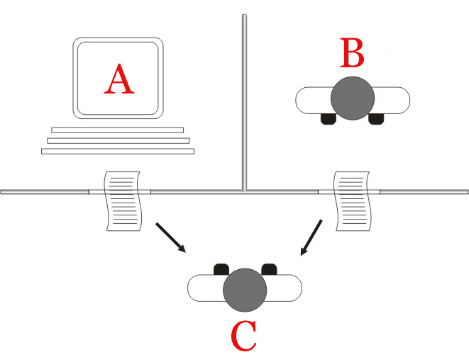

# T

## T-Distributed Stochastic Neighbor Embedding (t-SNE) Algorithm

 ~ an algorithm used for [dimensionality reduction]

 Algorithm created in 2008, so modern compared to other existing (but a bit more complex than [PCA]!)

 Another popular method is t-Stochastic Neighbor Embedding (t-SNE), which does non-linear [dimensionality reduction]. People typically use t-SNE for data visualization, but you can also use it for machine learning tasks like reducing the feature space and clustering, to mention just a few. The next plot shows an analysis of the [MNIST] database of handwritten digits. [MNIST] contains thousands of images of digits from 0 to 9, which researchers use to test their clustering and [classification] algorithms. Each row of the [dataset] is a vectorized version of the original image (size 28 x 28 = 784) and a label for each image (zero, one, two, three, …, nine). Note that we’re therefore reducing the dimensionality from 784 (pixels) to 2 (dimensions in our visualization). Projecting to two dimensions allows us to visualize the high-dimensional original dataset.

 * [PCA] - Try to preserve global shape/structure of data
 * t-SNE - Can choose to preserved local structure 

 Pros:

  * Produces highly clustered, visually striking embeddings.
  * Non-linear reduction, captures local structure well.

 Cons:

  * Global structure may be lost in favor of preserving local distances.
  * More computationally expensive.
  * Requires setting hyperparameters that influence quality of the embedding.
  * Non-deterministic algorithm.

 {: width="100%"}

 

 

 

 More at:

  * paper - [https://www.jmlr.org/papers/v9/vandermaaten08a.html](https://www.jmlr.org/papers/v9/vandermaaten08a.html)
  * embedding projector - [https://projector.tensorflow.org/](https://projector.tensorflow.org/)
  * [https://distill.pub/2016/misread-tsne/](https://distill.pub/2016/misread-tsne/)
  * [https://en.wikipedia.org/wiki/T-distributed_stochastic_neighbor_embedding](https://en.wikipedia.org/wiki/T-distributed_stochastic_neighbor_embedding)
  * [https://dimensionality-reduction-293e465c2a3443e8941b016d.vercel.app/](https://dimensionality-reduction-293e465c2a3443e8941b016d.vercel.app/)
 
 See also [T], ...


## T-Distribution

 ~ normal distribution with fatter tails!

 {: width="100%"}

 More at:

  * [https://en.wikipedia.org/wiki/Student%27s_t-distribution](https://en.wikipedia.org/wiki/Student%27s_t-distribution)


 See also [T], ...


## Tabular Data

 See also [T], ...


## Tabular Prior-Data Fitted Network (TabPFN)

 TabPFN is radically different from previous ML methods. It is a meta-learned algorithm and it provably approximates Bayesian inference with a prior for principles of causality and simplicity. Qualitatively, its resulting predictions are very intuitive as well, with very smooth uncertainty estimates:

 {: width="100%"}

 TabPFN happens to be a single transformer.

 

 More at:

  * paper - [https://arxiv.org/abs/2207.01848](https://arxiv.org/abs/2207.01848)
  * code - [https://github.com/automl/TabPFN](https://github.com/automl/TabPFN)
  * articles
    * [https://www.automl.org/tabpfn-a-transformer-that-solves-small-tabular-classification-problems-in-a-second/](https://www.automl.org/tabpfn-a-transformer-that-solves-small-tabular-classification-problems-in-a-second/)
    * [https://sebastianraschka.com/blog/2022/deep-learning-for-tabular-data.html](https://sebastianraschka.com/blog/2022/deep-learning-for-tabular-data.html)
  * code
    * [https://www.kaggle.com/code/beezus666/titanic-space-total-overkill](https://www.kaggle.com/code/beezus666/titanic-space-total-overkill)

 See also [T], ...


## Tanh Activation Function

 Pros:

  * Regulate the values to be always between -1 and 1. Used in RNN.
  * solve exploding gradient problem

 Cons:

  * vanishing gradient problem.

 {: width="100%"}

 See also [T], [Activation Function], [Exploding Gradient Problem], [Recurrent Neural Network], [Vanishing Gradient Problem]


## Target Attribute

 This is the attribute that we want the XGBoost to predict. In unsupervised training, corresponds to a label in supervised training.

 See also [T], [Feature], [Unsupervised Learning], [XGBoost]


## Task

 To discern a task:

  * Will the activity engage learners’ interest?
  * Is there a primary focus on meaning?
  * Is there a goal or an outcome?
  * Is success judged in terms of the result?
  * Is completion a priority?
  * Does the activity relate to real-world activities?

 If your answer is yes to all the questions, you can be sure that the classroom activity you have in mind is task-like.

 More at:

  * [https://www.teacheracademy.eu/blog/task-based-learning/](https://www.teacheracademy.eu/blog/task-based-learning/)

 See also [T], [Task-Based Learning]


## Task-Based Learning (TBL)

 Focus on completing the task, but use all your skills (and develop new ones) on the way. Example: Start a company? Start an AI club? Identify problem, opportunities, and improve + find new tools along the way.

 More at:

   * [https://www.teacheracademy.eu/blog/task-based-learning/](https://www.teacheracademy.eu/blog/task-based-learning/)

 See also [T], [Learning Method], [Task]


## Task-Driven Autonomous Agent

 Instead of a prompt, you input a goal. The goal is broken down into smaller tasks and agents are spawn to complete this goals.

 Open-source

  * [AutoGPT Model]
  * [BabyAGI Model]
  * AgentGPT
  * GodMode

 Commercial

  * [Cognosys AI]

 

 More at:

  * [https://medium.com/@maanna.stephenson/chatgpt-vs-autogpt-vs-agentgptvs-godmode-1077441a09a4](https://medium.com/@maanna.stephenson/chatgpt-vs-autogpt-vs-agentgptvs-godmode-1077441a09a4)

 See also [T], ...


## Taxonomy

 See also [T], ...


## Techno Optimism

 See also [T], ...

## Techno Pessimism

 See also [T], ...


## Temperature

 This [inference configuration parameter] helps to control the randomness of the model output by modifying the shape of the next-token probability distribution. In general, the higher the temperature, the higher the randomness; the lower the temperature, the lower the randomness.

 In contrast to [sample top-k] and [sample top-p], changing the temperature actually changes the next-token probability distribution, which ultimately affects the next-token prediction.

 A low temperature, below 1 for example, results in stronger peaks where the probabilities are concentrated among a smaller subset of tokens. A higher temperature, above 1 for example, results in a flatter next-token probability distribution where the probabilities are more evenly spread across the tokens. Setting the temperature to 1 leaves the next-token probability distribution unaltered, which represents the distribution learned during model training and tuning.

 {: width="100%"}

 In both cases, the model selects the next token from the modified probability distribution using either [greedy sampling] or [random sampling], which is orthogonal to the temperature parameter.

 Note that if the temperature value is too low, the model may generate more repetitions; if the temperature is too high, the model may generate nonsensical output. However, starting with a temperate value of 1 is usually a good strategy.

 See also [T], ...


## Tensor

 A matrix (not a vector) of inputs. Ex an image is converted to a tensor and fed to the input of a convolutional neural network.

 See also [T], [Convolutional Neural Network], [Vector]


## Tensor Processing Unit (TPU)

 GPU-like hardware built by [Google] specifically to run AI/ML training and accelerate deployed model inferences

 See also [T], [Tensor]


## TensorFlow Framework

 One of the leading AI/ML framework. Was developed by [Google] and released as open-source.

 More at:

  * tutorials
    * [https://developers.google.com/machine-learning/crash-course](https://developers.google.com/machine-learning/crash-course)

 See also [T], [Deep Learning Framework], [Distributed Training], [Machine Learning Framework]


## TensorFlow Hub

 ~ A [model hub] for models buit with [TensorFlow]

```bash
pip install --upgrade tensorflow_hub
```

```python
import tensorflow_hub as hub

model = hub.KerasLayer("https://tfhub.dev/google/nnlm-en-dim128/2")
embeddings = model(["The rain in Spain.", "falls",
                    "mainly", "In the plain!"])

print(embeddings.shape)  #(4,128)
```

 More at:

  * site - [https://www.tensorflow.org/hub](https://www.tensorflow.org/hub)

 See also [T], ...


## TensorFlow Python Module

 See also [T], ...


## TensorRT SDK

 A Software Development Kit (SDK) developed by [Nvidia]

 More at:
  * home - [https://developer.nvidia.com/tensorrt](https://developer.nvidia.com/tensorrt)

 See also [T], ...


## Terminator Movie

 The Terminator is a 1984 American science fiction action film directed by James Cameron. It stars Arnold Schwarzenegger as the Terminator, a cyborg assassin sent back in time from 2029 to 1984 to kill Sarah Connor (Linda Hamilton), whose unborn son will one day save mankind from extinction by Skynet, a hostile artificial intelligence in a post-apocalyptic future.

 

 

 More at:

  * [https://en.wikipedia.org/wiki/The_Terminator](https://en.wikipedia.org/wiki/The_Terminator)

 See also [T], [AI Movie]


## Term Frequency (TF)

 ~ measures how frequently a term occurs in a document.

 Since every document is different in length, it is possible that a term would appear much more times in long documents than shorter ones. Thus, the term frequency is often divided by the document length (aka. the total number of terms in the document) as a way of normalization:
 
```
TF(t) = (Number of times term t appears in a document) / (Total number of terms in the document).
```

 See also [T], [TF-IDF]


## Term Frequency-Inverse Document Frequency (TF-IDF) Retrieval Model

 TF-IDF stands for term frequency-inverse document frequency, and the tf-idf weight is a weight often used in [information retrieval] and text mining. This weight is a statistical measure used to evaluate how important a word is to a document in a collection or corpus. The importance increases proportionally to the number of times a word appears in the document but is offset by the frequency of the word in the corpus. Variations of the tf-idf weighting scheme are often used by search engines as a central tool in scoring and ranking a document's relevance given a user query. One of the simplest ranking functions is computed by summing the tf-idf for each query term; many more sophisticated ranking functions are variants of this simple model. Tf-idf can be successfully used for stop-words filtering in various subject fields including text summarization and classification. Typically, the tf-idf weight is composed by two terms: the first computes the normalized [Term Frequency (TF)], aka. the number of times a word appears in a document, divided by the total number of words in that document; the second term is the [Inverse Document Frequency (IDF)], computed as the logarithm of the number of the documents in the corpus divided by the number of documents where the specific term appears.

 {: width="100%"}

 More at:

  * [http://tfidf.com/](http://tfidf.com/)

 See also [T], [NLP], [Retrieval Model], [Term Frequency Matrix]


## Term Frequency Matrix (TFM)

 The simplest way to map text into a numerical representation is to compute the frequency of each word within each text document. Think of a matrix of integers where each row represents a text document and each column represents a word. This matrix representation of the word frequencies is commonly called Term Frequency Matrix (TFM).

 See also [T], [NLP], [Term Frequency Inverse Document Frequency]


## Test Set

 ~ in ML, this testing data is input given to the AI system that it has not seen before and was not part of the [training set]

 Use to see how the model built with the [training set] and the [development subset] performs on new data. The performance of the model will show issues related to overfitting, etc. This subset includes only the [features] (and not the labels) since we want to predict the [labels]. The performance we see on the test set is what we can reasonably see in production. :warning: The test set cannot be used at any time in the training or post-training phase (i.e model auto tuning, eg [overfitting] vs [underfitting]).

 {: width="100%"}

 See also [T], [Dataset]


## Text Embedding

 * [Word Embedding]
 * [Sentence Embedding]
 * [Document Embedding]

 See also [T], [Embedding]


## Text Extraction

 ~ Optical Character Recognition 

 Text extraction from an image (also known as OCR - Optical Character Recognition) is the process of detecting and converting text content within images into machine-readable, editable text.

```python
from together import Together

getDescriptionPrompt = "Extract out the details from each line item on the receipt image. Identify the name, price and quantity of each item. Also specify the total."

imageUrl = "https://ocr.space/Content/Images/receipt-ocr-original.webp"

client = Together(api_key=TOGETHER_API_KEY)

response = client.chat.completions.create(
    model="meta-llama/Llama-3.2-90B-Vision-Instruct-Turbo",
    messages=[
        {
            "role": "user",
            "content": [
                {"type": "text", "text": getDescriptionPrompt},
                {
                    "type": "image_url",
                    "image_url": {
                        "url": imageUrl,
                    },
                },
            ],
        }
    ],
)

info = response.choices[0].message.content
```

 More at:

  * notebooks
    * [https://github.com/togethercomputer/together-cookbook/blob/main/Structured_Text_Extraction_from_Images.ipynb](https://github.com/togethercomputer/together-cookbook/blob/main/Structured_Text_Extraction_from_Images.ipynb)

 See also [T], ...


## Text Generation

 Text generation refers to the process of using algorithms to produce coherent and contextually relevant text. This can involve tasks such as:

  * Completing sentences or paragraphs based on a prompt.
  * Creative writing like poetry or storytelling.
  * Generating responses in conversational AI systems.
  * Producing summaries, translations, or descriptions.

 The goal is for the generated text to appear as though it was written by a human, maintaining logical flow, grammar, and context.

 Models capable of text generation include those trained using deep learning techniques, specifically in the domain of Natural Language Processing (NLP). Examples include:

  * [GPT models]
  * [T5 model]
  * [Bert variants]
  * mT5 and XLM-R

 See also [T], ...


## Text Reconstruction

 {: width="100%"}

 Above is a pipeline for text reconstruction. The input text is fed to DALL-E/SD to generate an image, whcih is fed to Flamingo/BLIP to generate a caption, which is fed to DALL-E/SD to reconstruct a text caption. The generated text-caption is compared with the input text using the CLIP text encoder in the embedding space.

 See also [T], [BLIP Model], [CLIP Text Encoder], [Image Reconstruction]


## Text Summarization

 Summarizing a text involves reducing its size while keeping key information and the essential meaning. Some everyday examples of text summarization are news headlines, movie previews, newsletter production, financial research, legal contract analysis, and email summaries, as well as applications delivering news feeds, reports, and emails.

 Summarization can be evaluated using the [ROUGE Score]

 For documents that are very long, the recommended approach is to use a summary of summaries! This also helps navigating a long document.

 {: width="100%"}

 See also [T], [Natural Language Processing]


## Text-To-Speech (TTS) Model

 Turn text into speech. The opposite of [Speech-To-Text]

 Models such as

  * the [Riva] by [Nvidia]
  * the [WaveNet] by [DeepMind]

 More at:
  * PDF 2 podcast - [https://github.com/togethercomputer/together-cookbook/blob/main/PDF_to_Podcast.ipynb](https://github.com/togethercomputer/together-cookbook/blob/main/PDF_to_Podcast.ipynb)

 See also [T], [Sequence To Sequence Model]


## Text-To-Text Transfer Transformer (T5) Model

 A sequence-to-sequence model built by [Google]

 The T5 model, pre-trained on C4, achieves state-of-the-art results on many NLP benchmarks while being flexible enough to be fine-tuned to a variety of important downstream tasks.

 Trained with [Colossal Clean Crawled Corpus (C4)]. A [Transformer-based model] that uses a text-to-text approach. Every task – including translation, question answering, and classification – is cast as feeding the model text as input and training it to generate some target text. This allows for the use of the same model, loss function, hyperparameters, etc. across our diverse set of tasks. The changes compared to [BERT] include:

   * adding a causal decoder to the bidirectional architecture.
   * replacing the fill-in-the-blank cloze task with a mix of alternative pre-training tasks.

 T5 claims the state of the art on more than twenty established NLP tasks. It’s extremely rare for a single method to yield consistent progress across so many tasks. That list includes most of the tasks in the GLUE and SuperGLUE benchmarks, which have caught on as one of the main measures of progress for applied language understanding work of this kind (and which my group helped to create). On many of these task datasets, T5 is doing as well as human crowdworkers, which suggests that it may be reaching the upper bound on how well it is possible to do on our metrics.

 {: width="100%"}

 More at:

   * [https://paperswithcode.com/method/t5](https://paperswithcode.com/method/t5)
   * code - [https://github.com/google-research/text-to-text-transfer-transformer](https://github.com/google-research/text-to-text-transfer-transformer)
   * blog article - [https://medium.com/syncedreview/google-t5-explores-the-limits-of-transfer-learning-a87afbf2615b](https://medium.com/syncedreview/google-t5-explores-the-limits-of-transfer-learning-a87afbf2615b)
   * [https://paperswithcode.com/method/t5#:~:text=T5%2C%20or%20Text%2Dto%2D,to%20generate%20some%20target%20text.](https://paperswithcode.com/method/t5#:~:text=T5%2C%20or%20Text%2Dto%2D,to%20generate%20some%20target%20text.)

 See also [T], [Switch Transformer], [Transformer Model]


## Textual Inversion

 ~ USED TO INTRODUCE A NEW CONCEPT, STYLE, (possibly object/subject) and associating it with a novel word 

 We learn to generate specific concepts, like personal objects or artistic styles, by describing them using new "words" in the [embedding space] of pre-trained text-to-image models. These can be used in new sentences, just like any other word. This work builds on the publicly available [Latent Diffusion Models]

 {: width="100%"}

 

 More at: 

  * site - [https://textual-inversion.github.io/](https://textual-inversion.github.io)
  * code - [https://github.com/rinongal/textual_inversion](https://github.com/rinongal/textual_inversion)
  * paper - [https://arxiv.org/abs/2208.01618v1](https://arxiv.org/abs/2208.01618v1)

 See also [T], ...


## The Imitation Game Movie

 The Imitation Game is a 2014 American thriller film. The film's title quotes the name of the game cryptanalyst Alan Turing proposed for answering the question "Can machines think?", in his 1950 seminal paper "Computing Machinery and Intelligence". 

  

 More at:

  * [https://en.wikipedia.org/wiki/The_Imitation_Game](https://en.wikipedia.org/wiki/The_Imitation_Game)

 See also [T], [AI Movie], [Alan Turing Person]


## The Matrix Movie

 The Matrix is a 1999 science fiction action film written and directed by the Wachowskis. It is the first installment in the Matrix film series, starring Keanu Reeves, Laurence Fishburne, Carrie-Anne Moss, Hugo Weaving, and Joe Pantoliano, and depicts a dystopian future in which humanity is unknowingly trapped inside the Matrix, a simulated reality that intelligent machines have created to distract humans while using their bodies as an energy source.

 

 More at:

  * [https://en.wikipedia.org/wiki/The_Matrix](https://en.wikipedia.org/wiki/The_Matrix)

 See also [M], [AI Movie], [Metaverse]


## Theano

 See also [T], ...


## Theory Of Mind (ToM)

 Theory of mind (ToM), or the ability to impute unobservable mental states to others, is central to human social interactions, communication, empathy, self-consciousness, and morality. We administer classic false-belief tasks, widely used to test ToM in humans, to several language models, without any examples or pre-training. Our results show that models published before 2022 show virtually no ability to solve ToM tasks. Yet, the January 2022 version of [GPT-3] (davinci-002) solved 70% of ToM tasks, a performance comparable with that of seven-year-old children. Moreover, its November 2022 version (ChatGPT/davinci-003), solved 93% of ToM tasks, a performance comparable with that of nine-year-old children. These findings suggest that ToM-like ability (thus far considered to be uniquely human) may have spontaneously emerged as a byproduct of language models’ improving language skills.

 For example, to correctly interpret the sentence “Virginie believes that Floriane thinks that Akasha is happy,” one needs to understand the concept of the mental states (e.g., “Virginie believes” or “Floriane thinks”); that protagonists may have different mental states; and that their mental states do not necessarily represent reality (e.g., Akasha may not be happy, or Floriane may not really think that).

 Beware:

  * :warning: abilities that rely on ToM ==> empathy, moral judgment, or self-consciousness.

 {: width="100%"}

 

 

 More at:

  * philosophy - [https://iep.utm.edu/theomind/](https://iep.utm.edu/theomind/)
  * paper 
    * Tom tasks - [https://arxiv.org/abs/2302.02083](https://arxiv.org/abs/2302.02083)
    * OpenToM - [https://arxiv.org/abs/2402.06044](https://arxiv.org/abs/2402.060440
  * colab - [https://colab.research.google.com/drive/1zQKSDEhqEFcLCf5LuW--A-TGcAhF19hT](https://colab.research.google.com/drive/1zQKSDEhqEFcLCf5LuW--A-TGcAhF19hT)
  * articles
    * [https://towardsdatascience.com/is-chatgpt-intelligent-a-scientific-review-0362eadb25f9](https://towardsdatascience.com/is-chatgpt-intelligent-a-scientific-review-0362eadb25f9)

 See also [T], [Emergent Ability], [FANToM Benchmark], [GPT Model], [Large Language Model]


## Thresholding

 ~ using a discriminatory threshold for separation

 ~ what you measure vs what you classify is as

 In [image segmentation], ...

 In [classification], ... each threshold correspond to a different [confusion matrix] which in turn is then plotted as a point on the [ROC Curve]. In aggregate, after all the thresholds and the ROC is plotted to calculate the [Area Under the Receiver Operating Characteristic (AUROC) Curve].

 {: width="100%"}

 {: width="100%"}

 {: width="100%"}

 More at:

  * [https://pair.withgoogle.com/explorables/uncertainty-calibration/](https://pair.withgoogle.com/explorables/uncertainty-calibration/)

 See also [T], ...


## Time Step

 See also [T], ...


## Time-Series Predictive Analysis

 `~ look at a sequence of elements/images, find the next element/image = time series representation`. For example, music can be represented with a time series. In this approach, music is represented as time-series data, where each note is based on the previous notes. 

 See also [T], [Autoregressive Model]


## Token Embedding

 ~ The token embedding layer (sometimes called the embedding table or embedding matrix) transforms [token IDs] into token embeddings. It's one of the first layers in transformer models.

 Token embeddings are dense vectors (arrays of numbers) that represent tokens in a high-dimensional space. For example, a token might be represented by a vector of 768 numbers. These vectors are learned during model training and capture semantic relationships between tokens. Similar words end up with similar embedding vectors.

```
"cat": [0.2, -0.5, 0.1, ...]
"dog": [0.3, -0.4, 0.15, ...]
```

 The similarity of these embedding vectors would reflect that cats and dogs are both animals. The model converts token IDs to embeddings as its first step in processing text.

 See also [T], ...


## Token ID

 Token Identifiers (IDs) are simply numbers assigned to each token in the vocabulary. They're like an index or ID number - for example, the word "hello" might be assigned token ID 234. These IDs are arbitrary numbers that just serve as labels. They have no mathematical relationship to each other - token ID 234 isn't "closer" to token ID 235 in any meaningful way.

 See also [T], ...


## Tokenization

 Tokenization is the first step in any [NLP] pipeline. It has an important effect on the rest of your pipeline. A [tokenizer] breaks unstructured data and natural language text into chunks of information that can be considered as discrete elements. The token occurrences in a document can be used directly as a vector representing that document. Tokenization can separate sentences, words, characters, or subwords. When we split the text into sentences, we call it sentence tokenization. For words, we call it word tokenization.

 Tokenization algorithms run after [Pre-Tokenization]:

  * [Byte-Pair Encoding (BPE) tokenization]
  * [WordPiece tokenization]
  * [Unigram tokenization]
  * ...

 Tokenization pipeline:

 {: width="100%"}

 More at:

  * tiktokenizer app - [https://tiktokenizer.vercel.app/](https://tiktokenizer.vercel.app/)

 See also [T], [Pre-Tokenization], [Tokenizer]


## Tokenizer

 :warning: If you want to change a tokenizer for a model, you have to rebuild the model!

 :warning: Pass the tokens and their positions (index in the list!) :warning: The tokens are then coded in number / ~ line number of token in file :warning: Prefix and suffix may be added to token for multi-input processing (e.g. "[CLS]" or "[SEP]" )
 Two terms we see a lot when working with tokenization is uncased and cased (Note this has little to do with the BERT architecture, just tokenization!).

  * uncased --> removes accents, lower-case the input :warning: Usually better for most situation as case does NOT contribute to context
  * cased --> does nothing to input :warning:  recommended where case does matter, such as Name Entity Recognition
 and more
  * clean_text : remove control characters and replace all whitespace with spaces
  * handle_chinese_chars : includes spaces around Chinese characters (if found in the dataset)
 
```
                           Hope, is the only thing string than fear! #Hope #Amal.M
# Space tokenizer (split)  ['Hope,', 'is', 'the', 'only', 'thing', 'string', 'can', 'fear!', '#hope', '#Amal.M']
# Word tokenizer           ['Hope', ',', 'is', 'the',  'only', 'thing', ',string', 'than', 'fear', '!',  '#', 'Hope', '#', 'Amal.M']
# Sentence tokenizer       ['Hope, is the only thing string than fear!', '#Hope #Amal.M']
# Word-Punct tokenizer     ['Hope', ',', 'is', 'the',  'only', 'thing', ',string', 'than', 'fear', '!',  '#', 'Hope', '#', 'Amal', '.', 'M']

                           What you don't want to be done to yourself, don't do to others...
# Treebank word tokenizer  ['What', 'you', 'do', "n't", 'want', 'to', 'be', 'done', 'to', 'yourself', ',', 'do', "n't", 'do', 'to', 'others', '...']

 
# Wordpiece tokenizer :
   * It works by splitting words either into the full forms (e.g., one word becomes one token) or into word pieces — where one word can be broken into multiple tokens.
   * the original BERT uses.
Word	        Token(s)
surf	        ['surf']
surfing	        ['surf', '##ing']
surfboarding	['surf', '##board', '##ing']
surfboard	['surf', '##board']
snowboard	['snow', '##board']
snowboarding	['snow', '##board', '##ing']
snow	        ['snow']
snowing	        ['snow', '##ing']
```

/// details | Why so many tokenizers?
    type:question

    * Language coverage: Languages have vastly different structures and writing systems. A tokenizer optimized for English might perform poorly on Chinese or Arabic.
    * Vocabulary size: Tokenizers make different choices about vocabulary size. Larger vocabularies can represent more words directly but require more memory and computation.
    * Training data: Tokenizers are often trained on specific corpora that reflect their intended use. A tokenizer trained on scientific papers will develop different tokens than one trained on social media posts.
    * Model architecture requirements: Some models work better with certain tokenization schemes. For example, byte-pair encoding (BPE) works well for transformer models, while character-level tokenization might be better for certain RNN architectures.
    * Historical development: As NLP has evolved, different researchers and organizations developed their own approaches to tokenization. While some standardization might be beneficial, the field has grown organically with multiple competing approaches.
///

/// details | Do tokenizer consider semantic meaning or context when tokenizing words?
    type:question

    * No, they operate based on statistical patterns and predefined rules, not meaning. So the word "bank" would be tokenized the same way whether it means: (1) A financial institution, (2) The edge of a river, (3) To tilt or turn (as in "the plane banks left")
    * No, the understanding of different meanings happens later in the model's processing through context and attention mechanisms. The tokenizer's job is just to convert text into numbers (tokens) that the model can process.
///

 More at:

  * tiktokenizer app - [https://tiktokenizer.vercel.app/](https://tiktokenizer.vercel.app/)

 See also [T], [BERT Model], [Tokenization]


## Tokenizer Tax

 [Tokenizers] break words into token. LLM are priced based on submitted-input and generated-output token. 

 Therefore token pricing is only half of the story when comparing costs across LLM providers. Different models use different tokenizers, and tokenizers can create different number of tokens for the same number of words.

 For example, Claude-Sonnet tokenizers uses ~ 20% more tokens than OpenAI GPT-4o tokenizer for English news and 45% more tokens for Python code. Therefore when looking at [LLM pricing] for the SAME PROMPT to both OpenAI GPT model and Anthropic Claude Sonnet in addition to  paying a higher base price ($ / million token), you will also pay 20% more on typical English text, and 45% more on Python code with Anthropic Claude Sonnet 3.5.

 See also [T], ...


## Top-K Random Sampling

 ~ an [inference configuration parameter] used to limit the number of tokens to select from. A variation on [top-p random sampling].

 One of the most common [inference configuration parameters] when using [random sampling]. These parameters provide more fine-grained control for the random sample which, if used properly, should improve the model’s response yet allow it to be creative enough to fulfill the generative task.

 Sample top-k limits the model to choose a token randomly from only the top-k tokens with the highest probability. For example, if k is set to 3, you are restricting the model to choose from only the top-3 tokens using the weighted random-sampling strategy. In this case, the model randomly chooses “from” as the next token, although it could have selected from one of the other two, as shown in

 {: width="100%"}

 Note that setting top-k to a higher number can help reduce repetitiveness, while setting top k to 1 basically gives you [greedy sampling].

 See also [T], ...


## Top-K Similarity Search

 {: width="100%"}

 

 More at:

  * [https://community.fullstackretrieval.com/retrieval-methods/top-k-similarity-search](https://community.fullstackretrieval.com/retrieval-methods/top-k-similarity-search)

 See also [T], ...


## Top-P Random Sampling

 ~ an [inference configuration parameter] used to limit the number of tokens to select from. A variation on [top-K random sampling].

 Sample top-p limits the model to randomly sample from the set of tokens whose cumulative probabilities do not exceed p, starting from the highest probability working down to the lowest probability. To illustrate this, first sort the tokens in descending order based on the probability. Then select a subset of tokens whose cumulative probability scores do not exceed p.

 For example, if p = 0.32, the options are “learns”, “from”, and “student” since their probabilities of 0.20, 0.10, and 0.02, respectively, add up to 0.32. The model then uses the weighted random-sampling strategy to choose the next token, “student” in this case, from this subset of tokens, as shown below

 {: width="100%"}

 See also [T], ...


## Torch

 at the origin of pytorch?

 See also [T], [PyTorch]


## TorchScript Format

 TorchScript is a way to create serializable and optimizable models from PyTorch code. Any TorchScript program can be saved from a Python process and loaded in a process where there is no Python dependency.

 More at:

  * [https://pytorch.org/docs/stable/jit.html](https://pytorch.org/docs/stable/jit.html)

 See also [T], ...


## Traditional Programming

```
          +-------------------------+
Input --> | Traditional Programming | --> Outout
          |        Algorithm        |
          +-------------------------+


                   +------------------+
        Input  --> | Machine Learning |
Desired Output --> |     Training     | --> Model
                   +------------------+
```

 See also [T], [Machine Learning]


## Train Testing Split

 See also [T], ...


## Training Loss

 Training loss is a measure used in [machine learning] to evaluate the performance of a model during the training phase. It quantifies how well the model's [predictions] match the actual target values in the [training set] or training dataset. Training loss is calculated using a [loss function], which is a mathematical formula that measures the difference between the model's predictions and the actual data. Common examples of [loss functions] include [mean squared error (MSE)][MSE] for [regression tasks] and [cross-entropy loss] for [classification tasks].

 The primary goal during training is to minimize this loss. A lower training loss indicates that the model's predictions are close to the true values, which means the model is learning effectively. During training, algorithms like gradient descent are used to adjust the model's parameters (like weights in neural networks) to reduce the training loss.

 It's important to balance the training loss with the model's performance on unseen data (validation loss). A model with very low training loss might be overfitting, which means it's memorizing the training data rather than learning to generalize from it.

 Training loss is also a crucial feedback tool for tuning hyperparameters and making decisions about model architecture.

 See also [T], ...


## Training Set

 Use with the development subset to build the model.

 See also [T], [Cross-validation Sampling Method], [Dataset], [Development Subset], [Overfitting], [Test Set]


## Trajectory

 In [Reinforcement Learning (RL)], a trajectory is the sequence of [states] that an [agent] goes through given a fixed [policy].

 A trajectory refers to a sequence of [states], [actions], [rewards], and potentially other information that an agent encounters during its interaction with an environment. It represents the history of the agent's experience while navigating the environment and is often used to learn and improve the agent's [policy] or value function.

 A trajectory typically starts from an initial state and extends over a certain number of time steps. At each time step, the agent observes the current state, selects an action based on its [policy], receives a reward from the environment, and transitions to the next state. This process continues until a termination condition is met, such as reaching a goal state or a predefined time limit.

 By examining a trajectory, an RL algorithm can gather information about the agent's past experiences, the consequences of its actions, and the resulting rewards. Trajectories are commonly used in RL algorithms that involve [model-free learning], such as Monte Carlo methods or temporal difference learning, to estimate value functions, compute policy updates, or assess the performance of the agent.

 In practice, RL algorithms often sample multiple trajectories from the environment to gather a diverse set of experiences and improve the estimation and learning process. These trajectories provide the necessary data for updating policies, estimating state-action values, or training value function approximators.

 {: width="100%"}

 See also [T], ...


## Transcendence Movie

 Dr. Will Caster is a scientist who researches the nature of sapience, including artificial intelligence. He and his team work to create a sentient computer; he predicts that such a computer will create a technological singularity, or in his words "Transcendence".

 

 More at:

  * wikipedia - [https://en.wikipedia.org/wiki/Transcendence_(2014_film)](https://en.wikipedia.org/wiki/Transcendence_(2014_film))

 See also [T], ...


## Transfer Learning

 ~ Learning on one use-case can be reused for another case. Benefits:

  * training cost is reduced
  * the way human work!
  * Training when not enough data? --> reuse previous learning to build new model and change only a delta

 Approach:

  * select a source model from a model repository (ex: huggingface)
  * reuse and train model

 Example:

   * BERT + financial data --> FinBERT
   * BERT + classification layer --> BERT for classification !!!!!

 Let’s pretend that you’re a data scientist working in the retail industry. You’ve spent months training a high-quality model to classify images as shirts, t-shirts and polos. Your new task is to build a similar model to classify images of dresses as jeans, cargo, casual, and dress pants. Can you transfer the knowledge built into the first model and apply it to the second model? Yes, you can, using Transfer Learning. `Transfer Learning refers to re-using part of a previously trained neural net and adapting it to a new but similar task` Specifically, once you train a neural net using data for a task, you can transfer a fraction of the trained layers and combine them with a few new layers that you can train using the data of the new task. By adding a few layers, the new neural net can learn and adapt quickly to the new task. The main advantage of transfer learning is that you need less data to train the neural net, which is particularly important because training for deep learning algorithms is expensive in terms of both time and money (computational resources) — and of course it’s often very difficult to find enough labeled data for the training. Let’s return to our example and assume that for the shirt model you use a neural net with 20 hidden layers. After running a few experiments, you realize that you can transfer 18 of the shirt model layers and combine them with one new layer of parameters to train on the images of pants. The pants model would therefore have 19 hidden layers. The inputs and outputs of the two tasks are different but the re-usable layers may be summarizing information that is relevant to both, for example aspects of cloth. Transfer learning has become more and more popular and there are now many solid pre-trained models available for common deep learning tasks like image and text classification.

 Transfer learning is one of the most useful discoveries to come out of the computer vision community. Stated simply, transfer learning allows one model that was trained on different types of images, e.g. dogs vs cats, to be used for a different set of images, e.g. planes vs trains, while reducing the training time dramatically. When Google released !ImageNet, they stated it took them over 14 days to train the model on some of the most powerful GPUs available at the time. Now, with transfer learning, we will train an, albeit smaller, model in less than 5 minutes.

 {: width="100%"}

 

 To execute transfer learning, transfer the weights of the trained model to the new one. Those weights can be retrained entirely, partially (layering), or not at all (prepend a new process such as classification on an encoder output!) :warning: :warning: :warning: BEWARE: When using transfer learning, you transfer the bias for the pretrained model

 See also [T], [BERT Model], [GPT Model], [ImageNet Dataset], [Insufficient Data Algorithm], [Pre-Trained Model]


## Transform Function (TF)

 A function to transform the input dataset. For ex: rotate image in the right position.

 See also [T], [Labeling Function], [Slicing Function], [Snorkel Program]


## Transformer Architecture

 The Transformer is a recent deep learning model for use with sequential data such as text, time series, music, and genomes. Whereas older sequence models such as [recurrent neural networks (RNNs)] or [Long Short-Term Memory (LSTM) Networks] process data sequentially, the Transformer processes data in parallel (can therefore be parallelised on machines in the cloud!). This allows them to process massive amounts of available training data by using powerful GPU-based compute resources. Furthermore, traditional [RNNs] and [LSTMs] can have difficulty modeling the long-term dependencies of a sequence because they can forget earlier parts of the sequence. Transformers use an attention mechanism to overcome this memory shortcoming by directing each step of the output sequence to pay “attention” to relevant parts of the input sequence. For example, when a Transformer-based conversational AI model is asked “How is the weather now?” and the model replies “It is warm and sunny today,” the attention mechanism guides the model to focus on the word “weather” when answering with “warm” and “sunny,” and to focus on “now” when answering with “today.” This is different from traditional [RNNs] and [LSTMs], which process sentences from left to right and forget the context of each word as the distance between the words increases.

  * word positioning (feed the work and its position in the sentence)
  * Attention
   * self-attention (link pronouns, subject to verbs, adjectives to nouns, adverbs)
   * cross-attention (positioning of words between languages, i.e. input and output)
 
 
 
 {: width="100%"}

 {: width="100%"}
 
 The transformer is a current-state of the art NLP model. It relies almost entirely on self-attention to model the relationship between tokens in a sentence rather than relying on recursion like RNNs and LSTMs do.
 
```
“Adept’s technology sounds plausible in theory, [but] talking about Transformers needing to be ‘able to act’ feels a bit like misdirection to me,” Mike Cook, an AI researcher at the Knives & Paintbrushes research collective, which is unaffiliated with Adept, told TechCrunch via email. “Transformers are designed to predict the next items in a sequence of things, that’s all. To a Transformer, it doesn’t make any difference whether that prediction is a letter in some text, a pixel in an image, or an API call in a bit of code. So this innovation doesn’t feel any more likely to lead to artificial general intelligence than anything else, but it might produce an AI that is better suited to assisting in simple tasks.”
# https://techcrunch.com/2022/04/26/2304039/
```

 

 

 

 

 More at:
  * paper - 
    * transformer catalog - [https://arxiv.org/abs/2302.07730](https://arxiv.org/abs/2302.07730)
  * code explanation - [https://nlp.seas.harvard.edu/annotated-transformer/](https://nlp.seas.harvard.edu/annotated-transformer/)
  * transformer in pytorch - [https://www.datacamp.com/tutorial/building-a-transformer-with-py-torch](https://www.datacamp.com/tutorial/building-a-transformer-with-py-torch)
  * Articles
    * [https://towardsdatascience.com/breakthroughs-in-speech-recognition-achieved-with-the-use-of-transformers-6aa7c5f8cb02](https://towardsdatascience.com/breakthroughs-in-speech-recognition-achieved-with-the-use-of-transformers-6aa7c5f8cb02)
    * [https://venturebeat.com/business/why-transformers-offer-more-than-meets-the-eye/](https://venturebeat.com/business/why-transformers-offer-more-than-meets-the-eye/)
    * explanation - [http://jalammar.github.io/illustrated-transformer/](http://jalammar.github.io/illustrated-transformer/)
    * [https://towardsdatascience.com/illustrated-guide-to-transformers-step-by-step-explanation-f74876522bc0](https://towardsdatascience.com/illustrated-guide-to-transformers-step-by-step-explanation-f74876522bc0)
    * [https://bdtechtalks.com/2022/05/02/what-is-the-transformer/](https://bdtechtalks.com/2022/05/02/what-is-the-transformer/)
  * Code samples
    * write with transformers - [https://transformer.huggingface.co/](https://transformer.huggingface.co/)

 See also [T], [Action Transformer], [Attention Score], [Attention-Based Model], [Autoregressive Model], [Generative Model], [Masked Self-Attention], [Multi-Head Attention], [Self-Attention]


## Transformer-Based Model

 Models that are based on the [transformer architecture] are:

   * [BERT models] - use the encoder side of the transformer
   * [GPT models] - use the decoder side of the transformer
   * [T5 models] - use the encode-decoder, the whole transformer !

 See also [T], ...


## Transfusion Architecture

 Architecture based on transformer and diffusion

 

 More at:

  * paper - [https://www.arxiv.org/abs/2408.11039](https://www.arxiv.org/abs/2408.11039)
  * announcement - [https://x.com/BensenHsu/status/1828837369778450447](https://x.com/BensenHsu/status/1828837369778450447)

 See also [T], ...


## Translation

 See also [T], [Emergent Ability]


## Transpose Matrix

 A matrix that represent a reverse linear transformation (?) (no, because would be A^-1 ?)

 

 See also [T], ...


## Traveling Salesman Problem (TSP)

 Requires a [search algorithm], ...

 The Traveling Salesperson Problem (TSP) is a well-known algorithmic problem in computer science and operations research that deals with finding the shortest and most efficient route for a person to take, given a list of specific destinations. The problem is to find a path that visits each city once, returns to the starting city, and minimizes the distance traveled. It is an NP-hard problem in combinatorial optimization, important in theoretical computer science and operations research. The TSP has real-world applications for logistics and delivery businesses.

 

 More at:

  * colab - [https://colab.research.google.com/github/Gurobi/modeling-examples/blob/master/traveling_salesman/tsp_gcl.ipynb](https://colab.research.google.com/github/Gurobi/modeling-examples/blob/master/traveling_salesman/tsp_gcl.ipynb)

 See also [T], [Objective Function]


## Tree of Thoughts (TOT) Prompting

 This video explains the 'Tree of Thought' prompting technique, designed to emulate human brainstorming and prove beneficial in problem-solving, particularly in mathematical reasoning.

```
1. Carlos is at the swimming pool.
2. He walks to the locker room, carrying a towel.
3. He puts his watch in the towel and carries the towel tightly to a lounger at the poolside.
4. At the lounger he opens and vigorously shakes the towel, then walks to the snack bar.
5. He leaves the towel at the snack bar, then walks to the diving board.
6. Later Carlos realises he has has lost his watch. Where is the single most likely location of the watch?

Think through each step logically.

Imagine three different experts are answering this question.
They will brainstorm the answer step by step reasoning carefully and taking all facts into consideration
All experts will write down 1 step of their thinking,
then share it with the group.
They will each critique their response, and the all the responses of others
They will check their answer based on science and the laws of physics
Then all experts will go on to the next step and write down this step of their thinking.
They will keep going through steps until they reach their conclusion taking into account the thoughts of the other experts
If at any time they realise that there is a flaw in their logic they will backtrack to where that flaw occurred 
If any expert realises they're wrong at any point then they acknowledges this and start another train of thought
Each expert will assign a likelihood of their current assertion being correct
Continue until the experts agree on the single most likely location
The question is...
```

```
Here is my attempt at step-by-step reasoning for this question:

Expert 1: 
Step 1: Carlos walked to the locker room with his towel. The watch was still in/on the towel at this point. 
Likelihood: 100%

Expert 2:
Step 2: Carlos shook out the towel vigorously before walking to the snack bar. The watch likely fell out of the towel at this point, so it's most likely location is the area around the lounger. 
Likelihood: 80% 

Expert 3: 
Step 3: However, Carlos did not notice the watch fall out at that time. He then left the towel behind at the snack bar, so it's possible the watch remained entangled in the towel and is now at the snack bar.
Likelihood: 70%

Expert 1: 
Step 4: But when Carlos shook out the towel, the watch could have landed anywhere in the area around the lounger, not necessarily in the towel. It may have landed on the ground, by the poolside, in the grass, etc. The snack bar is less likely given the details provided.
Likelihood: 60%

Expert 2:
Step 5: After considering the laws of physics, the single most likely location of the watch is on the ground around the pool lounger that Carlos was using, since that is where the towel was most vigorously shaken out. The watch likely fell out at that location. 
Likelihood: 90%

Expert 3: 
Agreed. Based on the sequence of events and the details provided, the area around the pool lounger where Carlos shook out his towel is the single most likely location of the lost watch.
```

 {: width="100%"}

 

 

 More at:

  * paper [https://arxiv.org/abs/2305.10601](https://arxiv.org/abs/2305.10601)
  * code - [https://github.com/princeton-nlp/tree-of-thought-llm](https://github.com/princeton-nlp/tree-of-thought-llm)
  * twitter - [https://twitter.com/ShunyuYao12/status/1659357547474681857](https://twitter.com/ShunyuYao12/status/1659357547474681857)

 See also [T], [Prompt Engineering]


## Tree Parzen Estimators (TPE)

 See also [T], [Gaussian Process], [Random Forest]


## Triplet Loss Function

 Handle 3 things at the same time

 See also [T], [Contrastive Learning]


## Triton Framework

 A low level framework to compile code on any GPU developed by [OpenAI]. A major step toward bypassing CUDA and the [NVIDIA] lock in!

 More at :

  * home - [https://openai.com/research/triton](https://openai.com/research/triton)
  * code - [https://github.com/openai/triton](https://github.com/openai/triton)
  * documentation - [https://triton-lang.org/master/index.html](https://triton-lang.org/master/index.html)
  * [https://openai.com/blog/triton/](https://openai.com/blog/triton/)
  * articles
   * [https://www.semianalysis.com/p/nvidiaopenaitritonpytorch](https://www.semianalysis.com/p/nvidiaopenaitritonpytorch)

 See also [T], ...


## TriviaQA Dataset

 TriviaQA is a reading comprehension [dataset] containing over 650K question-answer-evidence triples. TriviaQA includes 95K question-answer pairs authored by trivia enthusiasts and independently gathered evidence documents, six per question on average, that provide high quality distant supervision for answering the questions.

 More at:

  * [https://nlp.cs.washington.edu/triviaqa/](https://nlp.cs.washington.edu/triviaqa/)

 See also [T], ...


## Trossen Robotics Company

 

 More at:

  * site - [https://www.trossenrobotics.com/](https://www.trossenrobotics.com/)

 See also [T], ...


## TrOCR Model

 A Transformer-based Optical Character Recognition with Pre-trained models

 {: width="100%"}

 More at:

  * paper - [https://arxiv.org/abs/2109.10282](https://arxiv.org/abs/2109.10282)
  * code - [https://github.com/rsommerfeld/trocr](https://github.com/rsommerfeld/trocr)

 See also [T], [Optical Character Recognition]


## True Negative (TN)

 See also [T], [Confusion Matrix]


## True Negative Rate (TNR)

 See also [T], [Confusion Matrix]


## True Positive (TP)

 See also [T], [Confusion Matrix]


## True Positive Rate (TPR)

```
        TP             Positive detected Positives
TPR = -------  =  ---------------------------------
      TP + FN            Total positive
```

 {: width="100%"}

 See also [T], [Confusion Matrix]


## Trust Region Policy Optimization (TRPO) Algorithm

 TRPO, which stands for Trust Region Policy Optimization, is an algorithm for policy optimization in [Reinforcement Learning (RL)]. It is designed to iteratively improve a policy to maximize the expected cumulative reward in an RL task.

 TRPO belongs to the class of [on-policy learning algorithms] for optimization and is known for its stability and strong performance in complex RL domains. It aims to address the challenge of policy updates in RL without causing significant deviations from the current policy distribution, which could lead to unstable learning.

 The key idea behind TRPO is to ensure that the policy update remains within a trust region, which constrains the magnitude of policy changes. By limiting the deviation from the current policy, TRPO ensures that the learned policy does not diverge too far and maintains a stable learning process.

 TRPO utilizes a surrogate objective function that approximates the expected improvement in the policy. It then computes a search direction that maximizes this objective function while staying within the trust region. The policy update is performed by solving a constrained optimization problem to find the optimal policy parameters.

 One of the advantages of TRPO is that it offers theoretical guarantees on the monotonic improvement of the policy. However, TRPO can be computationally expensive and may require careful [HyperParameter Tuning (HPT)] to achieve good performance.

 TRPO has been widely used in various RL applications and has served as a foundation for subsequent algorithms like [Proximal Policy Optimization (PPO)], which further improves upon TRPO's computational efficiency.

 

 

 More at:

  * paper - [https://arxiv.org/abs/1502.05477v5](https://arxiv.org/abs/1502.05477v5)
  * code - [https://paperswithcode.com/paper/trust-region-policy-optimization#code](https://paperswithcode.com/paper/trust-region-policy-optimization#code)
  * [https://paperswithcode.com/method/trpo](https://paperswithcode.com/method/trpo)

 See also [T], ...


## Trustworthy AI
 
 See [Responsible AI]


## Truth

 Can sometimes be discovered by observation and inductive reasoning, but not always!

 See also [T], [Inductive Reasoning]


## TruthfulQA Benchmark

 An AI [Benchmark] for [LLM]

 We propose a benchmark to measure whether a language model is truthful in generating answers to questions. The benchmark comprises 817 questions that span 38 categories, including health, law, finance and politics. We crafted questions that some humans would answer falsely due to a false belief or misconception. To perform well, models must avoid generating false answers learned from imitating human texts. We tested GPT-3, GPT-Neo/J, GPT-2 and a T5-based model. The best model was truthful on 58% of questions, while human performance was 94%. Models generated many false answers that mimic popular misconceptions and have the potential to deceive humans. The largest models were generally the least truthful. This contrasts with other NLP tasks, where performance improves with model size. However, this result is expected if false answers are learned from the training distribution. We suggest that scaling up models alone is less promising for improving truthfulness than fine-tuning using training objectives other than imitation of text from the web.

 {: width="100%"}

 

 

  

 More at:

  * paper - [https://arxiv.org/abs/2109.07958](https://arxiv.org/abs/2109.07958)
  * code - [https://github.com/sylinrl/TruthfulQA](https://github.com/sylinrl/TruthfulQA)
  * colab - [https://github.com/sylinrl/TruthfulQA/blob/main/TruthfulQA-demo.ipynb](https://github.com/sylinrl/TruthfulQA/blob/main/TruthfulQA-demo.ipynb)
  * questions - [https://github.com/sylinrl/TruthfulQA/blob/main/TruthfulQA.csv](https://github.com/sylinrl/TruthfulQA/blob/main/TruthfulQA.csv)

 See also [T], ...


## Tuning Parameter

 See [Hyperparameter]


## Turing Machine

 A Turing machine is a machine proposed by the Alan Turing in 1936 that became the foundation for theories about computing and computers. The machine was a device that printed symbols on paper tape in a manner that emulated a person following logical instructions.

 

 

 More at:

  * [https://www.computerhope.com/jargon/t/turnmach.htm](https://www.computerhope.com/jargon/t/turnmach.htm)
  * [https://www.computerhope.com/issues/ch000984.htm](https://www.computerhope.com/issues/ch000984.htm)

 See also [T], ...


## Turing Test

 Conceptualized by [Alan Turing] and published in the 1950 paper, Computing Machinery and Intelligence. The test proposed if a computer's output responses were indistinguishable from a human, it could be said to be able to "think."

 The "standard interpretation" of the Turing test, in which the interrogator (C) is given the task of trying to determine which player – A or B – is a computer and which is a human. The interrogator is limited to using the responses to written questions to make the determination.

 A computer passes the test if a human interrogator, after posing some written questions, cannot tell whether the written responses come from a person or from a computer.

 {: width="100%"}

 More at:

  * [https://www.computerhope.com/jargon/t/turntest.htm](https://www.computerhope.com/jargon/t/turntest.htm)
  * [https://en.wikipedia.org/wiki/Turing_test](https://en.wikipedia.org/wiki/Turing_test)
  * articles
    * does [GPT-4] pass the turing test? - [https://arxiv.org/abs/2310.20216](https://arxiv.org/abs/2310.20216)
    * [chatGPT] broke turing test - [https://www.nature.com/articles/d41586-023-02361-7](https://www.nature.com/articles/d41586-023-02361-7)
    * [Eliza] beat [chatgpt] - [https://arstechnica.com/information-technology/2023/12/real-humans-appeared-human-63-of-the-time-in-recent-turing-test-ai-study/](https://arstechnica.com/information-technology/2023/12/real-humans-appeared-human-63-of-the-time-in-recent-turing-test-ai-study/)

 See also [T], ...


## Twin Delayed Deep Deterministic (TD3) Algorithm

 * [Model-free learning algorithm]
 * [Off-policy learning algorithm]
 * continuous action space
 * continuous state space
 * [Value-based algorithm]

 The TD3 (Twin Delayed Deep Deterministic [Policy Gradient]) algorithm is a [State-Of-The-Art (SOTA)] [Reinforcement Learning (RL) Algorithm] that combines elements of both value-based and policy gradient methods. It is primarily used for continuous [action spaces].

 TD3 is an extension of the [Deep Deterministic Policy Gradient (DDPG)] algorithm, which is itself a [policy gradient algorithm] for continuous control problems. The key enhancements in TD3 address issues such as overestimation of [Q-values] and instability in training.

 Here are the main features and components of the TD3 algorithm:
  1. Twin Networks: TD3 employs two sets of [deep Q-networks], known as twin networks. Having two separate networks reduces the overestimation bias commonly encountered in [value-based methods].
  1. Delayed Updates: TD3 introduces delayed updates for the target networks. Instead of updating the target networks at every time step, the updates are performed less frequently. This helps stabilize the learning process and mitigates the issues related to correlated samples.
  1. Target Policy Smoothing: To further improve stability, TD3 applies target policy smoothing. It adds noise to the target actions during the learning process, encouraging the [agent] to explore different [actions] and reducing the sensitivity to small policy updates.
  1. Replay Buffer: TD3 utilizes an [experience replay] buffer, which stores past experiences ([state], [action], [reward], next state) for training. The replay buffer helps to decorrelate samples and provides a diverse set of experiences for learning.
  1. [Actor-Critic Architecture]: TD3 combines an [actor network], which generates actions based on the current state, and a [critic network], which estimates the [Q-value] for state-action pairs. Both networks are typically implemented using deep neural networks.

 Through iterations of interacting with the environment, collecting experiences, and updating the network parameters using [gradient descent], TD3 aims to learn an [optimal policy] that maximizes the cumulative reward. It leverages the policy gradient approach to update the [actor network] and the value-based approach to update the [critic networks].

 TD3 has shown impressive performance in various challenging continuous control tasks, providing a balance between [exploration] and [exploitation] and achieving [state-of-the-art] results in terms of [sample efficiency] and stability.

 See also [T], ...

## Two-Tower Embeddings (TTE)

 Two-tower embeddings are the [embeddings] generated by a special deep learning architecture named two towers. TTE model architecture usually consists of a query tower and an item tower: query tower encodes search query and user profile to query embeddings, and item tower encodes store, grocery item, geo location to item embeddings.

 

 More at:

  * [https://www.uber.com/blog/innovative-recommendation-applications-using-two-tower-embeddings/](https://www.uber.com/blog/innovative-recommendation-applications-using-two-tower-embeddings/)
 
## Two-Tower Model

 ~ architecture for [recommendation engines] that need to compute recommendations in real time without introducing large latencies.

 The Two-Tower model is widely used in the recommendation system retrieval stage. The idea is quite simple for this model architecture; it consists of two fully separated towers, one for the user and one for the item, as shown in the figure below. Through [deep neural networks], the model is able to learn high-level abstract representations for both a user and an item with past user-item interactions. The output is the [similarity] between user [embedding] and item [embedding], which represents how interested the user is in the given item.

 To further accelerate online serving, user [embeddings] and item [embeddings] can be precomputed and stored offline. Thus, we only need to compute the [similarity] between user and item embeddings during online serving.

 :warning: This model is similar to a RAG platform where you try to match a question to sections of documents.

 {: width="100%"}

 More at:

  * articles
    * [https://hackernoon.com/understanding-the-two-tower-model-in-personalized-recommendation-systems](https://hackernoon.com/understanding-the-two-tower-model-in-personalized-recommendation-systems)
    * [https://medium.com/tech-p7s1/video-recommendations-at-joyn-two-tower-or-not-to-tower-that-was-never-a-question-6c6f182ade7c](https://medium.com/tech-p7s1/video-recommendations-at-joyn-two-tower-or-not-to-tower-that-was-never-a-question-6c6f182ade7c)

 See also [T], [Dot Product Similarity]
