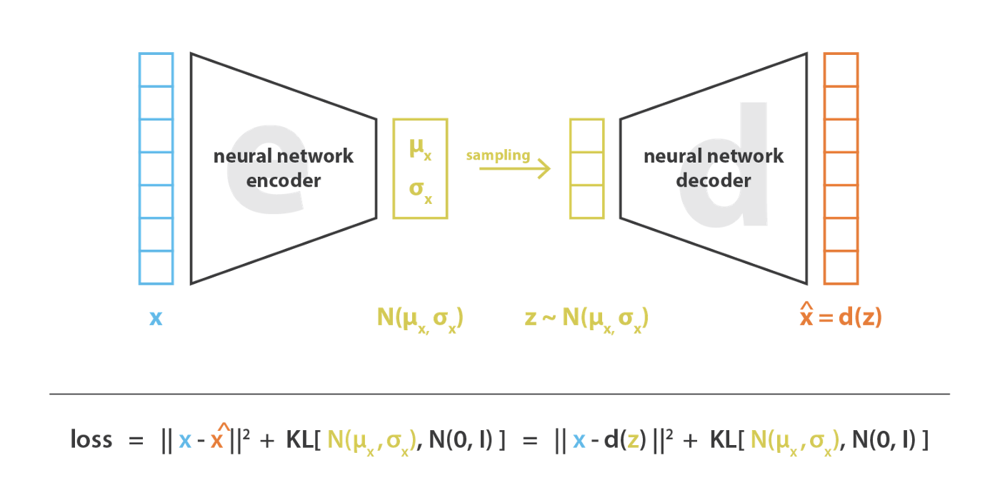

# V

## Valence Aware Dictionary and sEntiment Reasoner (VADER) Python Module

 VADER is a lexicon and rule-based feeling analysis instrument that is explicitly sensitive to suppositions communicated in web-based media. VADER utilizes a mix of lexical highlights (e.g., words) that are, for the most part, marked by their semantic direction as one or the other positive or negative. Thus, VADER not only tells about the Polarity score yet, in addition, it tells us concerning how positive or negative a conclusion is.

 More at:

  * [https://www.analyticsvidhya.com/blog/2021/06/vader-for-sentiment-analysis/](https://www.analyticsvidhya.com/blog/2021/06/vader-for-sentiment-analysis/)
  * [https://www.geeksforgeeks.org/python-sentiment-analysis-using-vader/](https://www.geeksforgeeks.org/python-sentiment-analysis-using-vader/)

 See also [V], [Sentiment Analysis]


## Validation Set

 ~ Used to find the proper complexity of the model that is the balance between the bias and variance a.k.a. [bias-variance tradeoff]

 Double training data split!

  * In python you train_test_plit twice !
  * At the end you have a [Training Set], [Validation Set], and a [Test Set]

 Why a validation set?

  * Used for validation during training
  * Help avoid [overfitting] (and [underfitting] ?)
  * ... 
  * Used to find the proper balance for the [bias-variance tradeoff]

 Ratios ?

  * 80 - 10 - 10
  * 70 - 15 - 15

 The validation set is used to fine-tune the hyperparameters of the model, a.k.a. [Hyperparameter Optimization (HPO)], and is considered a part of the training of the model. The model only sees this data for evaluation but does not learn from this data, providing an objective unbiased evaluation of the model. Validation dataset can be utilized for [regression] as well by interrupting training of model when loss of validation dataset becomes greater than loss of training dataset .i.e. reducing [bias] and [variance]. This data is approximately 10-15% of the total data available for the project but this can change depending upon the number of [hyperparameters] .i.e. if model has quite many hyperparameters then using large validation set will give better results. Now, whenever the [accuracy] of model on validation data is greater than that on training data then the model is said to have generalized well. 

 More at:

  * [https://www.geeksforgeeks.org/training-vs-testing-vs-validation-sets/](https://www.geeksforgeeks.org/training-vs-testing-vs-validation-sets/)
  * [https://en.wikipedia.org/wiki/Training,_validation,_and_test_data_sets#Validation_data_set](https://en.wikipedia.org/wiki/Training,_validation,_and_test_data_sets#Validation_data_set)

 See also [V], ...


## Value

 In [Reinforcement Learning], ...

 See also [V], ...


## Value-Based Algorithm

 ~ a class of [Reinforcement Learning Algorithms]

 See also [V], ...


## Vanilla

 The most basic version of a model

 See also [V], ...


## Vanilla GAN

 The Vanilla GAN is the simplest type of [Generative Adversarial Network (GAN)] made up of the generator and discriminator , where the classification and generation of images is done by the generator and discriminator internally which both use the [Multilayer Perceptron (MLP) Architecture]. The generator captures the data distribution meanwhile , the discriminator tries to find the probability of the input belonging to a certain class, finally the feedback is sent to both the generator and discriminator after calculating the loss function , and hence the effort to minimize the loss comes into picture.

 See also [V], ...


## Vanishing Gradient Problem

  = a problem that arises because of the loss of information in backpropagation with forward activation function (sigmoid, etc). Vanishing Gradient Problem is a difficulty found in training certain Artificial Neural Networks with gradient based methods (e.g Back Propagation). In particular, this problem makes it really hard to learn and tune the parameters of the earlier layers in the network. This problem becomes worse as the number of layers in the architecture increases. :warning: This is not a fundamental problem with neural networks - it's a problem with gradient based learning methods caused by certain activation functions. Let's try to intuitively understand the problem and the cause behind it. 

   * Problem ==> Gradient based methods learn a parameter's value by understanding how a small change in the parameter's value will affect the network's output. If a change in the parameter's value causes very small change in the network's output - the network just can't learn the parameter effectively, which is a problem. This is exactly what's happening in the vanishing gradient problem -- the gradients of the network's output with respect to the parameters in the early layers become extremely small. That's a fancy way of saying that even a large change in the value of parameters for the early layers doesn't have a big effect on the output. Let's try to understand when and why does this problem happen. 
   * Cause ==> Vanishing gradient problem depends on the choice of the activation function. Many common activation functions (e.g sigmoid or tanh) 'squash' their input into a very small output range in a very non-linear fashion. For example, sigmoid maps the real number line onto a "small" range of [0, 1], especially with the function being very flat on most of the number-line. As a result, there are large regions of the input space which are mapped to an extremely small range. In these regions of the input space, even a large change in the input will produce a small change in the output - hence the gradient is small. :warning: This becomes much worse when we stack multiple layers of such non-linearities on top of each other. For instance, first layer will map a large input region to a smaller output region, which will be mapped to an even smaller region by the second layer, which will be mapped to an even smaller region by the third layer and so on. As a result, even a large change in the parameters of the first layer doesn't change the output much.

 To minimize this problem, you can try to

  * use the ReLU activation function over the sigmoid ones. ReLU which NOT cause a small derivative if >= 0.
  * reduce the number of layers in the network (minimize total loss by reducing the number of times the signal goes through an activation function), 
  * use batch normalization (don't reach the outer edges of the sigmoid function) = work in a regime (input value range) where the derivative is not zero 
  * change model architecture
  * and/or use residual networks as they provide residual connections straight to earlier layers. The residual connection directly adds the value at the beginning of the block, x, to the end of the block (F(x)+x). This residual connection doesn’t go through activation functions that “squashes” the derivatives, resulting in a higher overall derivative of the block.

 More at 

  * [https://towardsdatascience.com/the-vanishing-gradient-problem-69bf08b15484](https://towardsdatascience.com/the-vanishing-gradient-problem-69bf08b15484)
  * [https://www.quora.com/What-is-the-vanishing-gradient-problem](https://www.quora.com/What-is-the-vanishing-gradient-problem)
  * [https://en.wikipedia.org/wiki/Vanishing_gradient_problem](https://en.wikipedia.org/wiki/Vanishing_gradient_problem)

 See also [V], [Activation Function], [Batch Normalization], [Exploding Gradient Problem], [Rectified Linear Unit], [Residual Network Model]


## Variable

 See also [V], ...


## Variable Model

 See also [V], [Bayesian Network], [Constraint Satisfaction Problem], [Model Type]


## Variable Type

  * Continuous variable
  * Discrete variable

 See also [V], [Continuous Variable], [Discrete Variable]


## Variance

 ~ the amount that the [prediction] will change if you change the training data

 :warning: a lot of flexibility in the model causes high variance.

 :warning: models such as [random Forests] and [Neural Networks] tend to have high variance

 How dispersed your predicted values are. Low variance high bias = underfitting. High variance + low bias = overfitting.

 See also [V], [Bias], [Overfitting], [Underfitting], 


## Variational Autoencoder (VAE)

 VAEs are autoencoders (encoder + latent space + decoder) that encode inputs as distributions instead of points and whose latent space “organisation” is regularised by constraining distributions returned by the encoder to be close to a standard Gaussian. :warning: In the Autoencoder bottleneck, you have 2 vectors: (1) the mean vector, (2) the variance vector of the distributions. The input of the decoder is a sample of the distributions.

 {: width="100%"}

  * first, the input is encoded as distribution over the latent space
  * second, a point from the latent space is sampled from that distribution
  * third, the sampled point is decoded and the reconstruction error can be computed
  * finally, the reconstruction error is backpropagated through the network 

 

 Why are VAE better than simple autoencoder? ==> making the generative process possible 

```
## VAE LOSS FUNCTION = RECONSTRUCTION LOSS - KL DIVERGENCE
```

 {: width="100%"}

/// warning | Backpropagation cannot be done with VAE!

, because of the sampling between the encoder and decoder. The solution is to use the "reparameterization trick
///

 More at:

  * [https://towardsdatascience.com/understanding-variational-autoencoders-vaes-f70510919f73 ](https://towardsdatascience.com/understanding-variational-autoencoders-vaes-f70510919f73)
  * [https://jaan.io/what-is-variational-autoencoder-vae-tutorial/](https://jaan.io/what-is-variational-autoencoder-vae-tutorial/)

 See also [V], [Autoencoder], [Autoencoder Type], [Disentangled Variational Autoencoder], [Generative Model], [Kullback-Leibler Divergence], [Latent Space], [Variational Autoencoder Reparameterization Trick], [Vector Quantized Variational Autoencoder]


## Variational Autoencoder Reparameterization Trick

 Because in a variational autoencoder, you sample the output of the encoder to feed the decoder, you cannot use backpropagation. The solution to this is to use this reparametrization trick.

 {: width="100%"}

 More at:

  * [https://youtu.be/rZufA635dq4?t=1401](https://youtu.be/rZufA635dq4?t=1401)
  * [https://towardsdatascience.com/reparameterization-trick-126062cfd3c3](https://towardsdatascience.com/reparameterization-trick-126062cfd3c3)

 See also [V], [Backpropagation], [Deterministic Node], [Stochastic Node], [Variational Autoencoder]


## VASA Model Family

 Lifelike Audio-Driven Talking Faces Generated in Real Time developed by [Microsoft]

 

 

 More at:

  * VASA-1 
    * site - [https://www.microsoft.com/en-us/research/project/vasa-1/](https://www.microsoft.com/en-us/research/project/vasa-1/)
    * paper - [https://arxiv.org/abs/2404.10667](https://arxiv.org/abs/2404.10667)

 See also [V], ...


## Vector

 ~ a great way to represent unstructured data!

 A 1 column matrix (akak a list!) that represent all the inputs to a neural network or a summary of all the values of the features. Not a [tensor] (matrix).

 See also [V], [Dot Product], [Feature], [Sparse Vector], [Vector Database]


## Vector Database

 ~ a great way to store unstructured data

 A vector database indexes and stores vector embeddings for fast retrieval and similarity search.

 2 types:

  * bolt-on means you have a traditional DB (eg postgresql) and then the company added on a vector index (eg pgvector)
  * purpose-built = a vector DB that is built oly for vectors

 Being able to search across images, video, text, audio, and other forms of unstructured data via their content rather than human-generated labels or tags is exactly what vector databases were meant to solve. When combined with powerful machine learning models, vector databases such as Milvus have the ability to revolutionize e-commerce solutions, recommendation systems, computer security, pharmaceuticals, and many other industries. A vector database is a fully managed, no-frills solution for storing, indexing, and searching across a massive dataset of unstructured data that leverages the power of embeddings from machine learning models. A vector database should have the following features:

  * scalability and tunability,
  * multi-tenancy and data isolation,
  * a complete suite of APIs, and
  * an intuitive user interface/administrative console.

 Databases

  * Vector Databases
    * [Chroma] - in-memory ? can also use sqlite backend!
    * [Milvus]
    * [Pinecone]
  * KV store
    * [Redis]
  * Others
    * [Qdrant]
    * [Vespa]
    * [Weaviate]

 Alternatives

  * np.array
  * traditional databases

 Use cases

  * Long-term memory for LLMs
  * Semantic search: search based on the meaning or context
  * Similarity search for text, images, audio, or video data
  * Recommendation engine (recommend items similar to past purchases)

 

 

 

 

 More at:

  * vector retrieval paper - [https://arxiv.org/abs/2401.09350](https://arxiv.org/abs/2401.09350)
  * [https://www.pinecone.io/learn/vector-database/](https://www.pinecone.io/learn/vector-database/)
  * article(s)A
    * [https://frankzliu.com/blog/a-gentle-introduction-to-vector-databases](https://frankzliu.com/blog/a-gentle-introduction-to-vector-databases)
    * part 1 - [https://arupnanda.medium.com/lowdown-on-vector-databases-a4c8ddcf5d1d](https://arupnanda.medium.com/lowdown-on-vector-databases-a4c8ddcf5d1d)
    * part 2 - [https://arupnanda.medium.com/lowdown-on-vector-databases-ec39fe70a17](https://arupnanda.medium.com/lowdown-on-vector-databases-ec39fe70a17)
    * part 3 - [https://arupnanda.medium.com/lowdown-on-vector-databases-be93a8dd82d8](https://arupnanda.medium.com/lowdown-on-vector-databases-be93a8dd82d8)

 See also [V], [Representation Space], [Vector], [Vector Search Library]


## Vector Embedding

 More at:

  * [https://frankzliu.com/blog/a-gentle-introduction-to-vector-databases](https://frankzliu.com/blog/a-gentle-introduction-to-vector-databases)

 See also [V], [Vector Database]


## Vector Indexing

 See also [V], [Vector Database]


## Vector Quantized Generative Adversarial Network (VQ-GAN)

 

 More at:

  * colab - [https://colab.research.google.com/drive/1lx9AGsrh7MlyJhK9UrNTK8pYpARnx457?usp=sharing](https://colab.research.google.com/drive/1lx9AGsrh7MlyJhK9UrNTK8pYpARnx457?usp=sharing)
  * [https://medium.com/nightcafe-creator/vqgan-clip-tutorial-a411402cf3ad](https://medium.com/nightcafe-creator/vqgan-clip-tutorial-a411402cf3ad)

 See also [V], [Generative Adversarial Network]


## Vector Quantized Variational Autoencoder (VQ-VAE)

 Vector Quantized Variational Autoencoder (VQVAE) extends the standard autoencoder by adding a discrete codebook component to the network. The codebook is basically a list of vectors associated with a corresponding index.

 {: width="100%"}

 It is used to quantize the bottleneck of the autoencoder; the output of the encoder network is compared to all the vectors in the codebook, and the codebook vector closest in euclidean distance is fed to the decoder. Mathematically this is written as 
 
```
z_q(x)=\text{argmin}_i ||z_e(x)-e_i||_2 
# where z_e(x) is the encoder vector for some raw input x
# e_i is the ith codebook vector
# and z_q(x) is the resulting quantized vector that is passed as input to the decoder.
```

 This argmin operation is a bit concerning, since it is non-differentiable with respect to the encoder. But in practice everything seems to work fine if you just pass the decoder gradient directly through this operation to the encoder (i.e. set its gradient to 1 wrt the encoder and the quantized codebook vector; and to 0 wrt all other codebook vectors). The decoder is then tasked with reconstructing the input from this quantized vector as in the standard autoencoder formulation.

 More at :

  * home - [https://paperswithcode.com/method/vq-vae](https://paperswithcode.com/method/vq-vae)
  * paper -  
  * code - [https://github.com/deepmind/sonnet/blob/v2/sonnet/src/nets/vqvae.py](https://github.com/deepmind/sonnet/blob/v2/sonnet/src/nets/vqvae.py)
  * sample - [https://sites.google.com/view/videogen](https://sites.google.com/view/videogen)
  * [https://ml.berkeley.edu/blog/posts/vq-vae/](https://ml.berkeley.edu/blog/posts/vq-vae/)

 See also [V], [Codebook], [Variational Autoencoder]


## Vector Retrieval

 * [Multi-Vector Retrieval]
 * [Parent Document Retrieval]

 More at:

  * [https://arxiv.org/abs/2401.09350](https://arxiv.org/abs/2401.09350)

 See also [V], ...


## Vector Search Library

 projects such as FAISS, ScaNN, and HNSW are lightweight ANN libraries rather than managed solutions. The intention of these libraries is to aid in the construction of vector indices – data structures designed to significantly speed up nearest neighbor search for multi-dimensional vectors. If your dataset is small and limited, these libraries can prove to be sufficient for unstructured data processing, even for systems running in production. However, as dataset sizes increase and more users are onboarded, the problem of scale becomes increasingly difficult to solve. Vector databases also operate in a totally different layer of abstraction from vector search libraries - vector databases are full-fledged services, while ANN libraries are meant to be integrated into the application that you’re developing. In this sense, ANN libraries are one of the many components that vector databases are built on top of, similar to how Elasticsearch is built on top of Apache Lucene.

 See also [V], [Vector], [Vector Database]


## Vector Search Plugin

 An increasing number of traditional databases and search systems, such as Clickhouse and Elasticsearch, include built-in vector search plugins. Elasticsearch 8.0, for example, includes vector insertion and ANN search functionality that can be called via restful API endpoints. The problem with vector search plugins should be clear as night and day - these solutions do not take a full-stack approach to embedding management and vector search. Instead, these plugins are meant to be enhancements on top of existing architectures, thereby making them limited and unoptimized. Developing an unstructured data application atop a traditional database would be like trying to fit lithium batteries and electric motors inside a frame of a gas-powered car - not a great idea! To illustrate why this is, let’s go back to the list of features that a vector database should implement (from the first section). Vector search plugins are missing two of these features - tunability and user-friendly APIs/SDKs.

 See also [V], [Vector], [Vector Database]


## Vector Space

 In AI and machine learning, a vector space is a mathematical space where vectors—ordered sets of numbers—represent various forms of data. Each [vector] in this space can represent things like words, images, data points, or even features of a [dataset]. These spaces are important because they enable algorithms to operate on data in a structured way, making it easier to measure similarity, apply transformations, and find patterns. Here's a deeper look at how they’re used:

  1. **Representation of Data**: Data in machine learning is often represented in numerical form as vectors. For instance, each point in a dataset can be thought of as a vector where each element represents a feature. In natural language processing (NLP), words are often represented as vectors (like in Word2Vec or GloVe embeddings) that capture semantic meaning based on their relationships to other words.
  2. **Operations in Vector Spaces**: In AI, vector spaces allow for mathematical operations like addition, scaling, and finding angles (cosine similarity), which can indicate how similar two vectors are. For example, in NLP, the vectors for "king" and "queen" are often close in the vector space, reflecting their semantic similarity.
  3. **Training and Transformations**: Machine learning models operate on data in vector spaces by learning patterns and transformations in this space. For example, in neural networks, layers apply transformations to move data through different vector spaces to identify features and relationships in the data.
  4. **Dimensionality Reduction**: Techniques like [Principal Component Analysis (PCA)][PCA] and [t-Distributed Stochastic Neighbor Embedding (t-SNE)][t-SNE] reduce high-dimensional vector spaces into lower dimensions, helping visualize data and speed up computations while retaining meaningful structure.

 So, vector spaces form the foundation of data representation in AI/ML, enabling models to learn, compare, and make decisions based on the relationships between data points within these spaces.

 See also [V], ...

 
## Vector Space Collision

 Here is a brief overview of vector space collisions in machine learning:

  * In machine learning models like [word embeddings] or [recommendation engines], items are often represented as vectors in a high-dimensional vector space.
  * The vectors are positioned in the space such that similar items are close together based on certain metrics like [cosine similarity]. This allows detecting similarities between items by looking at the distance between their vector representations.
  * A vector space collision happens when two very different items end up having very similar vector representations. Their embeddings collide and become indistinguishable in the vector space.
  * This can happen when the vector space is too low-dimensional to capture all the nuanced differences between items. It can also happen when the training data is insufficient or biased.
  * Collisions are problematic because they cause the model to think very different items are highly similar based on their vector locations. This leads to poor performance on similarity tasks.
  * Techniques to mitigate collisions include using higher dimensionality, regularization, better sampling strategies, and contrastive training methods that explicitly optimize vectors to be distinct. Overall, collisions indicate limitations in the representational capacity of the vector space.

 See also [V], ...


## Veo Model Family

 ~ Sora but built by [Google]

 Veo creates videos with realistic motion and high quality output, up to 4K.

 

 

 More at:

  * veo 2 - [https://deepmind.google/technologies/veo/veo-2/](https://deepmind.google/technologies/veo/veo-2/)
  * co-lead - [https://x.com/shlomifruchter](https://x.com/shlomifruchter)

 See also [V], ...


## Viam Model

 Developed by [Nvidia], ...

 More at:

  * [https://www.viam.com/](https://www.viam.com/)

 See also [V}, ...


## Vicuna Model

More at:

 * [https://lmsys.org/blog/2023-03-30-vicuna/](https://lmsys.org/blog/2023-03-30-vicuna/)

 See also [V], ...


## Video Generator

 Generate a video from

  * a text prompt
  * a website
  * ....

 More at:

  * videogen.app - [https://app.videogen.io/](https://app.videogen.io/)
  * runway Gen 2 - [https://research.runwayml.com/gen2](https://research.runwayml.com/gen2)
  * SORA - 
  * [Veo] by [Google]

 See also [V], ...


## Video Joint-Embedding Predictive Architecture (V-JEPA)

 A method for [Join-Embedding Predictive Architecture (JEPA)] in 02/2024

 More at:

  * [https://ai.meta.com/blog/v-jepa-yann-lecun-ai-model-video-joint-embedding-predictive-architecture/](https://ai.meta.com/blog/v-jepa-yann-lecun-ai-model-video-joint-embedding-predictive-architecture/)
  * code - [https://github.com/facebookresearch/jepa](https://github.com/facebookresearch/jepa)

 See also [V], ...


## Video Pre-Training (VPT) Model

 

 

 More at:

  * paper - [https://arxiv.org/abs/2206.11795](https://arxiv.org/abs/2206.11795)
  * code - [https://github.com/openai/Video-Pre-Training](https://github.com/openai/Video-Pre-Training)
  * blog post - [https://openai.com/blog/vpt/](https://openai.com/blog/vpt/)

 See also [V], [Inverse Dynamics Model], [Reinforcement Learning]


## Video Restoration

 

 More at:

  * [https://www.youtube.com/@NASS_0/videos](https://www.youtube.com/@NASS_0/videos)

 See also [V], ...


## Video Summarization

 More at:

  * with claude 3 - [https://github.com/hundredblocks/transcription_demo](https://github.com/hundredblocks/transcription_demo)
    * twitter challenge - [https://twitter.com/karpathy/status/1760740503614836917](https://twitter.com/karpathy/status/1760740503614836917)
    * input - [https://www.youtube.com/watch?v=zduSFxRajkE](https://www.youtube.com/watch?v=zduSFxRajkE)
    * output - [https://hundredblocks.github.io/transcription_demo/](https://hundredblocks.github.io/transcription_demo/)

 See also [V], ...


## Video-To-Video (VTV) Model

 

 See also [V], ...


## VIMA Model

 A model built by [Nvidia]

 

 See also [V], ...


## Virtual Assistant

 All the Alexas, Siris, Google Assistants, and customer support chatbots of the world fall into this category. They use NLP to understand, analyze, and prioritize user questions and requests, and respond to them quickly and correctly.

 See also [V], [Natural Language Processing]


## Virtual Continuum

 Mixed reality blends both physical and digital worlds. These two realities mark the polar ends of a spectrum known as the virtuality continuum. We refer to this spectrum of realities as the mixed reality spectrum. On one end of the spectrum, we have the physical reality that we as humans exist. On the other end of the spectrum, we have the corresponding digital reality.

 {: width="100%}

 See also [V], [Augmented Reality], [Mixed Reality], [Virtual Reality]


## Virtual Reality (VR)

 VR is a simulated experience that employs pose tracking and 3D near-eye displays to give the user an immersive feel of a virtual world. Applications of virtual reality include entertainment (particularly video games), education (such as medical or military training) and business (such as virtual meetings). Other distinct types of VR-style technology include augmented reality and mixed reality, sometimes referred to as extended reality or XR, although definitions are currently changing due to the nascence of the industry.

 Currently, standard virtual reality systems use either virtual reality headsets or multi-projected environments to generate some realistic images, sounds and other sensations that simulate a user's physical presence in a virtual environment. A person using virtual reality equipment is able to look around the artificial world, move around in it, and interact with virtual features or items. The effect is commonly created by VR headsets consisting of a head-mounted display with a small screen in front of the eyes, but can also be created through specially designed rooms with multiple large screens. Virtual reality typically incorporates auditory and video feedback, but may also allow other types of sensory and force feedback through haptic technology.

 {: width="100%"}

 More at:

  * [https://en.wikipedia.org/wiki/Virtual_reality](https://en.wikipedia.org/wiki/Virtual_reality)

 See also [V], [Metaverse], [Virtual Continuum]


## Visual Geometry Group (VGG) Model

 A model developed by VGG in the Department of Engineering Science, University of Oxford. 

  * VGG-19 = The number 19 stands for the number of layers with trainable weights. 16 [Convolutional layers] with [Max Pooling] and 3 Fully Connected layers. The VGG-19 was trained on the ImageNet challenge (ILSVRC) 1000-class classification task. The network takes a (224, 224, 3) RBG image as the input.

 {: width="100%"}

```python
from keras.applications.vgg16 import VGG16
# load the model
model = VGG16()
# summarize the model
model.summary()

# summarize filter shapes
for layer in model.layers:
   # check for convolutional layer
   if 'conv' not in layer.name:
   continue
   # get filter weights
   filters, biases = layer.get_weights()
   print(layer.name, filters.shape)
```

 

 More at

  * vgg-16 (2015)
    * paper - [https://arxiv.org/abs/1409.1556](https://arxiv.org/abs/1409.1556)
    * keras - [https://machinelearningmastery.com/how-to-visualize-filters-and-feature-maps-in-convolutional-neural-networks/](https://machinelearningmastery.com/how-to-visualize-filters-and-feature-maps-in-convolutional-neural-networks/)
  * articles
    * [https://medium.com/mlearning-ai/image-detection-using-convolutional-neural-networks-89c9e21fffa3](https://medium.com/mlearning-ai/image-detection-using-convolutional-neural-networks-89c9e21fffa3)
    * [https://www.image-net.org/challenges/LSVRC/](https://www.image-net.org/challenges/LSVRC/)
    * [https://becominghuman.ai/what-exactly-does-cnn-see-4d436d8e6e52](https://becominghuman.ai/what-exactly-does-cnn-see-4d436d8e6e52)

 See also [V], [Convolutional Neural Network]


## Vision Arena

 Used for benchmarking multimodal model LLMs in the wild!

 More at: 

  * site - [https://huggingface.co/spaces/WildVision/vision-arena](https://huggingface.co/spaces/WildVision/vision-arena)

 See also [V], ...


## Vision-Language Model (VLM)

 ~ Vision language models are models that can learn simultaneously from images and texts to tackle many tasks, from visual question answering to image captioning.

 Vision language models are broadly defined as multimodal models that can learn from images and text. They are a type of generative models that take image and text inputs, and generate text outputs. Large vision language models have good zero-shot capabilities, generalize well, and can work with many types of images, including documents, web pages, and more. The use cases include chatting about images, image recognition via instructions, visual question answering, document understanding, image captioning, and others. Some vision language models can also capture spatial properties in an image. These models can output bounding boxes or segmentation masks when prompted to detect or segment a particular subject, or they can localize different entities or answer questions about their relative or absolute positions. There’s a lot of diversity within the existing set of large vision language models, the data they were trained on, how they encode images, and, thus, their capabilities.

 {: width="100%"}

 More at:

  * [https://huggingface.co/blog/vlms](https://huggingface.co/blog/vlms)
  * [https://huggingface.co/blog/vision_language_pretraining](https://huggingface.co/blog/vision_language_pretraining)

 See also [V], ...


## Vision-Language Pre-Training (VLP)

 

 See also [V], [Masked Vision Modeling]


## Vision Transformer (ViT) Model

 Used to caption images! Trained on imagNet. Instead of a tokenizer, uses a feature_extractor (image kernels? No, the whole image).

 The Vision Transformer, or ViT, is a model for image classification that employs a Transformer-like architecture over patches of the image. An image is split into fixed-size patches, each of them are then linearly embedded, position embeddings are added, and the resulting sequence of vectors is fed to a standard Transformer encoder. In order to perform classification, the standard approach of adding an extra learnable “classification token” to the sequence is used.

 

 {: width="100%"}

 More at:

  * Scaling Vision Transformers to 22 Billion Parameters (paper) - [https://arxiv.org/abs/2302.05442](https://arxiv.org/abs/2302.05442)

 See also [V], [Feature Extractor], [Tokenizer]


## Visual Grounding

 Visual grounding is the task of localizing concepts referred to by the language onto an image. 

 See also [V], ...


## Visual Language Model (VLM)

 See also [V], [Flamingo Model]


## Visual Simultaneous Localization And Mapping (VSLAM) Algorithm

 Doing [SLAM] but instead of using a [LIDAR] only using video cameras?

 

 See also [V], ...


## Voice Cloning

 Models

  * [OpenVoice]
  * [ElevenLabs]

## Voice Encoder (Vocoder)

 used to transform the generated mel-spectrogram into a waveform.

 

 More at:

  * [https://medium.com/analytics-vidhya/understanding-the-mel-spectrogram-fca2afa2ce53](https://medium.com/analytics-vidhya/understanding-the-mel-spectrogram-fca2afa2ce53)

 See also [V], [Encoder]


## Voicebox Model

 A speech infilling model, where audio style is inferred from audio context, and textual content is specified through transcript

 Applications:

  * Denoising - edit audio track, remove non-white noise
  * Text-only sampling - read from text
  * Zero-shot TTS - style transfer from existing recording to text
  * Cross-lingual style transfer - style transfer from existing voice recording with text extracted from another audio recording to a final audio with changed voice

 

 More at:

  * blog posts
    * [https://about.fb.com/news/2023/06/introducing-voicebox-ai-for-speech-generation/](https://about.fb.com/news/2023/06/introducing-voicebox-ai-for-speech-generation/)
    * [https://ai.meta.com/blog/voicebox-generative-ai-model-speech/](https://ai.meta.com/blog/voicebox-generative-ai-model-speech/)
  * site - [https://voicebox.metademolab.com/](https://voicebox.metademolab.com/)
  *  

## VoiceFlow Company

 

 More at:

  * site - [https://www.voiceflow.com/](https://www.voiceflow.com/)

 See also [V], [Custom GPT]


## Voxel

 A pixel in 3-D

 See also [V], [Neural Radiance Field]
