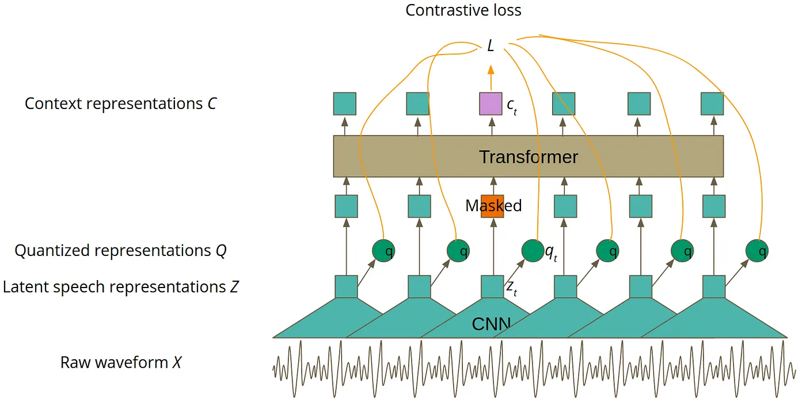
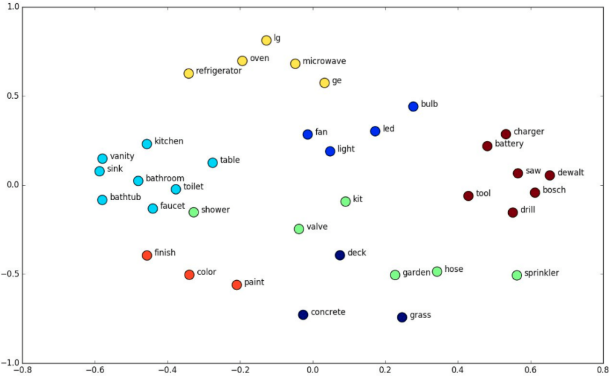

# W

## Wall-E Movie

 Released in 2008 by Pixar, now part of Disney

 

 More at:

  * [https://en.wikipedia.org/wiki/WALL-E](https://en.wikipedia.org/wiki/WALL-E)

 See also [W], [AI Movie]


## WarGames Movie

 WarGames is a 1983 American science fiction techno-thriller film[2] written by Lawrence Lasker and Walter F. Parkes and directed by John Badham. The film, which stars Matthew Broderick, Dabney Coleman, John Wood, and Ally Sheedy, follows David Lightman (Broderick), a young hacker who unwittingly accesses a United States military supercomputer programmed to simulate, predict and execute nuclear war against the Soviet Union.

 

 More at:

  * [https://en.wikipedia.org/wiki/WarGames](https://en.wikipedia.org/wiki/WarGames)

 See also [W], [AI Movie]


## Wav2Letter Model

 Included in the [Fairseq Toolkit] built by [Meta]

 See also [W], ...


## Wav2Vec Model

 Used for [automatic speech recognition].

 As presented in the picture below, the model is trained in two phases. The first phase is in a self-supervised mode, which is done using unlabeled data and it aims to achieve the best speech representation possible. You can think about that in a similar way as you think of word embeddings. Word embeddings also aim to achieve the best representation of natural language. The main difference is that Wav2Vec 2.0 processes audio instead of text. The second phase of training is [supervised fine-tuning (SFT)][SFT], during which labeled data is used to teach the model to predict particular words or phonemes. If you are not familiar with the word ‘phoneme’, you can think about it as the smallest possible unit of sound in a particular language, usually represented by one or two letters.

 {: width="100%"}

 

 

 More at:

  * Wav2vec 2.0 
    * site - [https://ai.facebook.com/blog/wav2vec-20-learning-the-structure-of-speech-from-raw-audio/](https://ai.facebook.com/blog/wav2vec-20-learning-the-structure-of-speech-from-raw-audio/)
    * articles
      * [https://towardsdatascience.com/wav2vec-2-0-a-framework-for-self-supervised-learning-of-speech-representations-7d3728688cae](https://towardsdatascience.com/wav2vec-2-0-a-framework-for-self-supervised-learning-of-speech-representations-7d3728688cae)
  * Wav2vec 1.0 
    * site - [https://ai.facebook.com/blog/wav2vec-state-of-the-art-speech-recognition-through-self-supervision/](https://ai.facebook.com/blog/wav2vec-state-of-the-art-speech-recognition-through-self-supervision/)
    * paper - [https://arxiv.org/abs/1904.05862](https://arxiv.org/abs/1904.05862)

 See also [W], [FairSec ToolKit]


## WaveNet Model

 A [text-to-speech model] built by [DeepMind]

 More at:

  * [https://www.deepmind.com/blog/wavenet-a-generative-model-for-raw-audio](https://www.deepmind.com/blog/wavenet-a-generative-model-for-raw-audio)

 See also [W], ...


## Waymo Company

 A spin-off from [Google]

 

 More at:

  * company site - [https://waymo.com/](https://waymo.com/)
  * wikipedia - [https://en.wikipedia.org/wiki/Waymo](https://en.wikipedia.org/wiki/Waymo)

 See also [W], [Company]


## Weak AI

 Searle identified a philosophical position he calls "strong AI":

  * The appropriately programmed computer with the right inputs and outputs would thereby have a mind in exactly the same sense human beings have minds.[b]
 The definition depends on the distinction between simulating a mind and actually having a mind. Searle writes that "according to Strong AI, the correct simulation really is a mind. According to Weak AI, the correct simulation is a model of the mind."

 More at:

  * [https://en.wikipedia.org/wiki/Chinese_room#Strong_AI](https://en.wikipedia.org/wiki/Chinese_room#Strong_AI)

 See also [W], [Strong AI]

 
## Weak Learner

 ~ anything just better than random guessing!

 Better than random is basically the only requirement for a weak learner. So long as you can consistently beat random guessing, any true [boosting] algorithm will be able to increase the [accuracy] of the final ensemble.

 What weak learner you should choose is then a trade off between 3 factors:

  1. The [bias] of the model. A lower bias is almost always better, but you don't want to pick something that will overfit (yes, boosting can and does overfit)
  1. The training time for the weak learner. Generally we want to be able to learn a weak learner quickly, as we are going to be building a few hundred (or thousand) of them.
  1. The prediction time for our weak learner. If we use a model that has a slow prediction rate, our ensemble of them is going to be a few hundred times slower!

 The classic weak learner is a [decision tree]. By changing the maximum depth of the tree, you can control all 3 factors. This makes them incredibly popular for [boosting]. What you should be using depends on your individual problem, but [decision trees] is a good starting point.

 See also [W], [Gradient Bagging], [Gradient Boosting]

 
## Weak-Supervised Learning

 Data augmentation of supervised learning = augment data when the provided labeled data is small (can be augmented!)!

 See also [W], [Learning Method]

 
## Weak Supervision Labeling Function

 ~ greatly augment data with supervised data.

 See also [W], [Snorkel Program], [Weak-Supervised Learning]


## Web Scaping

 More at:

  * example with beautiful soup - [https://github.com/emayssat/web_scraping](https://github.com/emayssat/web_scraping)

 See also [W], ...

## WebGPT Model

 

 More at:

  * [https://openai.com/research/webgpt](https://openai.com/research/webgpt)
  * paper - [https://arxiv.org/abs/2112.09332](https://arxiv.org/abs/2112.09332)
  * articles
   * [https://www.infoq.com/news/2022/01/openai-webgpt/](https://www.infoq.com/news/2022/01/openai-webgpt/)

 See also [W], [GPT Model]


## WebSim Desktop

 A way to create a desktop application in [WebSim]

 See also [W], ...


## WebSim Tool

 

 More at:

  * site [https://websim.ai/](https://websim.ai/)

 See also [W], ...


## Weight

 The stronger the relative weight (compared to the weights of other inputs), the stronger the relationship/bond/connection (the more important the feature is)

 aka a parameter in an [artificial neural network]

 Learned through [backpropagation] and choice of [loss function]

 See also [W], ...


## Weight Decay

 See [Weight Regularization]


## Weight Regularization

 The effect of weight decay is to encourage the model to prefer smaller weights, thus preventing the model from fitting the training data too closely and improving its ability to generalize to unseen data.

 Weight decay is a regularization technique commonly used in machine learning, especially in the context of neural networks. It is also known as [L2 regularization] or weight regularization. The purpose of weight decay is to prevent [overfitting] by adding a penalty term to the [loss function] that the model minimizes during training.

 In the context of neural networks, the loss function typically consists of two parts: the data-driven loss (such as [Root Mean Squared Error (RMSE)] for regression or [cross-entropy] for classification) and a regularization term. The regularization term penalizes the complexity of the model by adding a term based on the weights.

 See also [W], ...


## Weighted Ensemble Model

 Used several models and weights their outputs based on their accuracy, or [BAU]

 More at:

  * code - [https://www.kaggle.com/code/beezus666/titanic-space-total-overkill](https://www.kaggle.com/code/beezus666/titanic-space-total-overkill)

 See also [W], ...


## Weighted Gini Impurity Index

 See also [W], [Gini Impurity Index], [Forest Of Stumps]


## Weighted Input

 The input signal that is multiplied by its [weight]. Is comparable to a stimulus of an [Artificial Neuron].

 See also [W], ...


## Weights & Biases Company

```python
import wandb
import os

# 1. Set environment variables for the W&B project and tracing.
os.environ["LANGCHAIN_WANDB_TRACING"] = "true" os.environ["WANDB_PROJECT"] = "langchain-tracing"

# 2. Load llms, tools, and agents/chains

llm = OpenAI(temperature=0)
tools = load_tools(["llm-math"], llm=llm)
agent = initialize_agent(
     tools, llm,      agent=AgentType.ZERO_SHOT_REACT_DESCRIPTION,      verbose=True
)

# 3. Serve the chain/agent with all underlying complex llm interactions automatically traced and tracked

agent.run("What is 2 raised to .123243 power?")
```

 More at:

  * site - [https://www.wandb.courses/pages/w-b-courses](https://www.wandb.courses/pages/w-b-courses)
  * course - [https://www.wandb.courses/pages/w-b-courses](https://www.wandb.courses/pages/w-b-courses)

 See also [W], ...


## Whisper Model

 A open-source speech-to-text model developed by [OpenAI] that uses a [transformer architecture].

 Open-sourcing a neural net called Whisper that approaches human level robustness and accuracy on English speech recognition. Can also be used for translation.

```bash
curl https://api.openai.com/v1/audio/transcriptions \
  -H "Authorization: Bearer $OPENAI_API_KEY" \
  -H "Content-Type: multipart/form-data" \
  -F model="whisper-1" \
  -F file="@/path/to/file/openai.mp3"
```

 {: width="100%"}

 

 

 More at:

  * site - [https://openai.com/blog/whisper/](https://openai.com/blog/whisper/)
  * code - [https://github.com/openai/whisper](https://github.com/openai/whisper)
  * paper - 
  * model card - [https://github.com/openai/whisper/blob/main/model-card.md](https://github.com/openai/whisper/blob/main/model-card.md)

 See also [W], ...


## White Box Model

 A white box model is a model whose internals a person can see and reason about. This is subjective, but most people would agree that in a neural network, even if the weights were shown, they don’t give us information about how the model works in such a way as we could usefully describe it, or predict what the model is going to do in the future. So while a neural network is a [Black Box Model], a decision tree is a white box one! White and black box models are concept links to [Explainable AI]

 See also [W], ...


## Wikidata KG

 ~ an open-source [Knowledge Graph] maintained by [Wikimedia]

 

 

 See also [W], ...


## Wikifunction

 A function turns input into output. A function is knowledge and knowledge is power!

  * Allow implementing without English
  * create a new community, bring new people
  * natural language generation library for 300+ languages
  * democratize access to functions

 

 More at: 

  * [https://www.wikifunctions.org](https://www.wikifunctions.org)
  * [https://wikifunctions.beta.wmflabs.org/wiki/Wikifunctions:Main_Page](https://wikifunctions.beta.wmflabs.org/wiki/Wikifunctions:Main_Page)

 See also [W], ...


## Wisdom Of The Crowd

 The idea that averaging the opinions or estimates of a large group of people ("the crowd") often produces surprisingly good results. For example, consider a game in which people guess the number of jelly beans packed into a large jar. Although most individual guesses will be inaccurate, the average of all the guesses has been empirically shown to be surprisingly close to the actual number of jelly beans in the jar.

 [Ensembles] are a software analog of wisdom of the crowd. Even if individual models make wildly inaccurate predictions, averaging the predictions of many models often generates surprisingly good predictions. For example, although an individual [decision tree] might make poor predictions, a [decision forest] often makes very good predictions.

 See also [W], ...


## WizardLM Model

 ~ cost per token is extremely low

 
 

 More at:

  * paper - [https://arxiv.org/abs/2304.12244](https://arxiv.org/abs/2304.12244)
  * code - [https://github.com/nlpxucan/WizardLM](https://github.com/nlpxucan/WizardLM)
  * evol-instruct
    * code - [https://github.com/nlpxucan/evol-instruct](https://github.com/nlpxucan/evol-instruct)

 See also [W], ...


## Wonder Dynamics Company

 Creator of Wonder Studio, an AI tool that automatically animates, lights and composes CG characters into a live-action scene.

 

 More at:

  * site - [https://wonderdynamics.com/#product](https://wonderdynamics.com/#product)

 See also [W], ...

 
## Word Embedding

 ~ a type of [embeddings] for words

 ~ [Represention] of each word in a word set within an embedding vector; that is, representing each word as a vector of floating-point values between 0.0 and 1.0. Words with similar meanings have more-similar representations than words with different meanings. For example, carrots, celery, and cucumbers would all have relatively similar representations, which would be very different from the representations of airplane, sunglasses, and toothpaste.

 ~ `Take a sparse vector as input to a word2vec process and turn into a point in the embedding space, where 2 close related words (in meaning) are close (at a small euclidian distance)`. [TFM] and [TFIDF] are numerical representations of text documents that only consider frequency and weighted frequencies to represent text documents. By contrast, word embeddings can capture the context of a word in a document (e.g. "bank" in bank account and river bank have different embeddings). With the word context, embeddings can quantify the similarity between words, which in turn allows us to do arithmetic with words. [Word2Vec] is a method based on neural nets that maps words in a [corpus] to a numerical vector. We can then use these vectors to find synonyms, perform arithmetic operations with words, or to represent text documents (by taking the mean of all the word vectors in a document). For example, let’s assume that we use a sufficiently big corpus of text documents to estimate word embeddings. Let’s also assume that the words king, queen, man and woman are part of the corpus. Let say that vector(‘word’) is the numerical vector that represents the word ‘word’. To estimate vector(‘woman’), we can perform the arithmetic operation with vectors:
 
```
vector(‘king’) + vector(‘woman’) — vector(‘man’) ~ vector(‘queen’)
```

 Word representations allow finding similarities between words by computing the cosine similarity between the vector representation of two words. The cosine similarity measures the angle between two vectors. We compute word embeddings using machine learning methods, but that’s often a pre-step to applying a machine learning algorithm on top. For instance, suppose we have access to the tweets of several thousand Twitter users. Also suppose that we know which of these Twitter users bought a house. To predict the probability of a new Twitter user buying a house, we can combine [Word2Vec] with a [logistic regression]. You can train word embeddings yourself or get a pre-trained (transfer learning) set of word vectors. To download pre-trained word vectors in 157 different languages, take a look at FastText.

 Context-free examples:

  * Word2Vec – Predicts a word given its context (CBOW) or predicts the context given a word (Skip-gram). For example, in the phrase “The bird sat in the tree,” Word2Vec can learn that “bird” and “tree” often appear in similar contexts, capturing their relationship. This is useful for tasks like word similarity and analogy detection.
  * GloVe (Global Vectors for Word Representation) – Uses matrix factorization techniques on the word co-occurrence matrix to find word embeddings. For instance, GloVe can learn that “cheese” and “mayo” are related to “sandwich” by analyzing the co-occurrence patterns across a large corpus. This approach is great for applications like semantic search and clustering that need to understand broader relationships among words.
  * FastText – An extension of Word2Vec by Facebook, FastText considers subword information, making it effective for morphologically rich languages. It represents words as bags of character n-grams, which helps in understanding rare words and misspellings. For example, it can recognize that “running” and “runner” share a common subword structure.

 Context-full examples:

  * ELMo (Embeddings from Language Models) – Generates word representations that are functions of the entire input sentence, capturing context-sensitive meanings. For example, the word “bark” will have different embeddings in “The dog began to bark loudly” versus “The tree’s bark was rough,” depending on the surrounding words.
  * BERT ([Bidirectional Encoder Representations from Transformers]) – Pre-trains deep bidirectional representations by jointly conditioning on both left and right context in all layers. For example, in the sentence “She went to the bank to deposit money,” BERT uses the preceding words “She went to the” and the following words “to deposit money” to determine that “bank” refers to a financial institution, not a riverbank.

 

 

 More at:

  * tutorial - [https://txt.cohere.com/sentence-word-embeddings/](https://txt.cohere.com/sentence-word-embeddings/)
  * articles
    * LLM embedding - [https://www.iguazio.com/glossary/llm-embeddings/](https://www.iguazio.com/glossary/llm-embeddings/)
    * [https://www.louisbouchard.ai/text-embedding/](https://www.louisbouchard.ai/text-embedding/)
    * [https://towardsdatascience.com/introduction-to-word-embeddings-4cf857b12edc](https://towardsdatascience.com/introduction-to-word-embeddings-4cf857b12edc)

 See also [W], [NLP], ...

 
## Word Embedding Space

 In natural language processing, [word embeddings] are numerical representations of words so that similar words have close representations. So, [word embeddings] lie in a latent space where every word is encoded into a low-dimensional semantic vector. There are many algorithms for learning word embeddings like [Word2Vec] or GloVe (which are both context-free). Other more advanced models are Contextual models, which  instead generate a representation of each word that is based on the other words in the sentence (e.g. "bank" in bank account and river bank have different embeddings) . In the image below, we can see an illustration of the topology of the word embeddings in the latent space:

 {: width="100%"}

 As expected, semantically similar words like the word ‘toilet’ and the word ‘bathroom’ have close [word embeddings] in the latent space.

 More at:

  * [https://towardsdatascience.com/introduction-to-word-embeddings-4cf857b12edc](https://towardsdatascience.com/introduction-to-word-embeddings-4cf857b12edc)

 See also [W], [Input Space], [Latent Space]


## Word Error Rate (WER) Metric

 ~ a common metric of the performance of an [automatic speech recognition] or [machine translation] system.

 The general difficulty of measuring performance lies in the fact that the recognized word sequence can have a different length from the reference word sequence (supposedly the correct one). The WER is derived from the Levenshtein distance, working at the word level instead of the phoneme level. The WER is a valuable tool for comparing different systems as well as for evaluating improvements within one system. This kind of measurement, however, provides no details on the nature of translation errors and further work is therefore required to identify the main source(s) of error and to focus any research effort.

 

 

 More at:

  * wikipedia - [https://en.wikipedia.org/wiki/Word_error_rate](https://en.wikipedia.org/wiki/Word_error_rate)

 See also [W], [BLEU Score], [ROUGE Score]

## Word2Vec Model

 Context-free models such as word2vec or GloVe generate a single "word embedding" representation for each word in the vocabulary, so bank would have the same representation in bank deposit and river bank. Do not take into consideration the context on the right or on the left of the word. ~ Bag of Words. Deprecated by RNN?

 Strategy used:

  * Continuous [Bag Of Words] - use pre and post context to predict what is in the middle
  * [Skip Gram] - increases the context by using the word in the middle to predict the surrounding words

 

 See also [W], [Bag Of Words], [Node2Vec Model], [Recurrent Neural Network], [Word Embedding]

 
## WordNet Dataset

 WordNet is a large lexical database of English. Nouns, verbs, adjectives and adverbs are grouped into sets of cognitive synonyms (synsets), each expressing a distinct concept. Synsets are interlinked by means of conceptual-semantic and lexical relations. The resulting network of meaningfully related words and concepts can be navigated with the browser. WordNet is also freely and publicly available for download. WordNet's structure makes it a useful tool for computational linguistics and natural language processing.

 More at:

  * [https://wordnet.princeton.edu/](https://wordnet.princeton.edu/)

 See also [W], [Dataset], [ImageNet Dataset], [Transfer Learning]


## WordPiece Tokenizer

 ==The tokenizer used by the [BERT model]==

 WordPiece is the tokenization algorithm [Google] developed to pretrain [BERT]. It has since been reused in quite a few [Transformer] models based on [BERT], such as [DistilBERT], MobileBERT, Funnel Transformers, and MPNET. It’s very similar to [BPE] in terms of the training, but the actual tokenization is done differently (Pair scores are computed differently!).

```
## Wordpiece tokenizer :
   * It works by splitting words either into the full forms (e.g., one word becomes one token) or into word pieces — where one word can be broken into multiple tokens.
   * the original BERT uses.
Word            Token(s)
surf            ['surf']
surfing         ['surf', '##ing']
surfboarding    ['surf', '##board', '##ing']
surfboard   ['surf', '##board']
snowboard   ['snow', '##board']
snowboarding    ['snow', '##board', '##ing']
snow            ['snow']
snowing         ['snow', '##ing']
```


```python
from transformers import BertTokenizer

tokenizer = BertTokenizer.from_pretrained('./bert-it')
tokenizer('ciao! come va?')  # hi! how are you?
{
 'input_ids': [2, 13884, 5, 2095, 2281, 35, 3],               # Tokenized input with padding/prefix/suffix
 'token_type_ids': [0, 0, 0, 0, 0, 0, 0],                     # 0 or 1 or ? : Belongs to sentence #0, #1, #?
 'attention_mask': [1, 1, 1, 1, 1, 1, 1]                      # 0 or 1 : 0 if token is padding
}


with open('./bert-it/vocab.txt', 'r') as fp:
    vocab = fp.read().split('\n')
vocab[2], vocab[13884], vocab[5], \
    vocab[2095], vocab[2281], vocab[35], \
        vocab[3]
('[CLS]', 'ciao', '!', 'come', 'va', '?', '[SEP]')
```

 

 More at:

  * huggingface course - [https://huggingface.co/learn/nlp-course/chapter6/6](https://huggingface.co/learn/nlp-course/chapter6/6)
  * BPE vs WordPiece - [https://medium.com/@atharv6f_47401/wordpiece-tokenization-a-bpe-variant-73cc48865cbf](https://medium.com/@atharv6f_47401/wordpiece-tokenization-a-bpe-variant-73cc48865cbf)

 See also [W], ...


## World Artificial Intelligence Cannes Festival (WAICF)

 More at

  * site - [https://www.worldaicannes.com/festival](https://www.worldaicannes.com/festival)
  * articles
    * [https://aibusiness.com/meta/ai-luminary-yann-lecunn-sets-us-straight-on-generative-ai](https://aibusiness.com/meta/ai-luminary-yann-lecunn-sets-us-straight-on-generative-ai)


## World Labs Company

 An AI [company] started by [Fei Fei Li] and building [World Models]

 

 

 More at:

  * site - [https://www.worldlabs.ai/](https://www.worldlabs.ai/)
  * articles
    * [https://www.geeky-gadgets.com/interactive-3d-worlds-from-2d-images/](https://www.geeky-gadgets.com/interactive-3d-worlds-from-2d-images/)

 See also [W], ...


## World Model

 ~ a simulator that predicts how the (3d) environment change in response to actions. 

 A world model is used by an algorithm to make decision.

 Useful to train [embodied agents]

 Examples:

  * chess world model = rules of chess (possible actions + scoring) + description of the board. 
    * inputs:
      * a board state (position of all the pieces)
      * a next proposed move
    * output
      * a new board state
      * points earned or lost by each player (value of the board)
    * algorithm tells you how to make moves by picking the action with the best next board value!

 Known models:

  * [Genie] by [Google]
  * ??? by [World Labs]
  * [OASIS](https://www.decart.ai/) by [Decart](https://x.com/DecartAI)

 More at:

  * articles
    * LLM to LWM - [https://www.forbes.com/councils/forbestechcouncil/2024/01/23/the-next-leap-in-ai-from-large-language-models-to-large-world-models/](https://www.forbes.com/councils/forbestechcouncil/2024/01/23/the-next-leap-in-ai-from-large-language-models-to-large-world-models/)

 See also [W], ...
