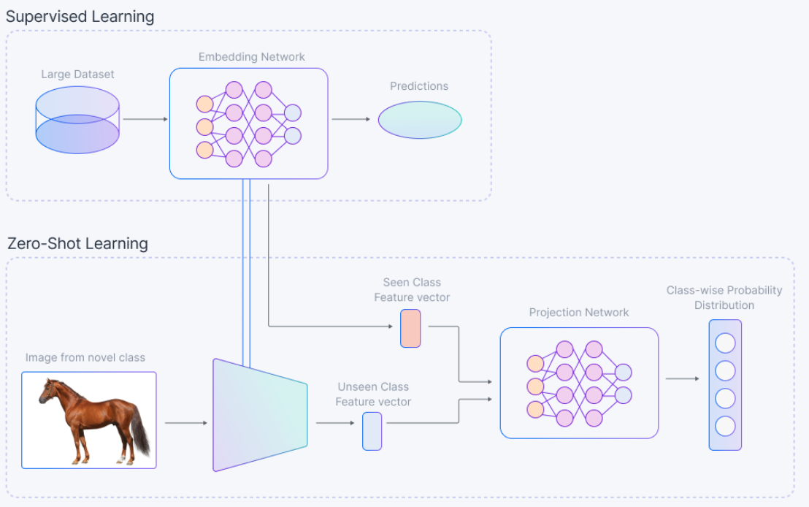

# Z

## Zero ETL

 More at:

  * articles
    * [https://medium.com/starschema-blog/so-whats-all-this-talk-about-zero-etl-integration-aa3b0ca9612b](https://medium.com/starschema-blog/so-whats-all-this-talk-about-zero-etl-integration-aa3b0ca9612b)
    * [https://towardsdatascience.com/zero-etl-chatgpt-and-the-future-of-data-engineering-71849642ad9c](https://towardsdatascience.com/zero-etl-chatgpt-and-the-future-of-data-engineering-71849642ad9c) 

 See also [Z], ...


## Zero Redundancy Optimization (ZeRO)

 [GPU] memory optimization

 More at:

  * [https://towardsdatascience.com/how-to-increase-training-performance-through-memory-optimization-1000d30351c8](https://towardsdatascience.com/how-to-increase-training-performance-through-memory-optimization-1000d30351c8)
  * [https://www.deepspeed.ai/tutorials/zero/](https://www.deepspeed.ai/tutorials/zero/)
  * [https://www.microsoft.com/en-us/research/blog/zero-deepspeed-new-system-optimizations-enable-training-models-with-over-100-billion-parameters/](https://www.microsoft.com/en-us/research/blog/zero-deepspeed-new-system-optimizations-enable-training-models-with-over-100-billion-parameters/)
  * [https://huggingface.co/docs/transformers/main_classes/deepspeed](https://huggingface.co/docs/transformers/main_classes/deepspeed)

 See also [Z], [Activation Checkpointing]


## Zero-Shot Learning

  The model predicts the answer given only a natural language description of the task. No gradient updates are performed.
 
```
Translate English to French              # Task description
cheese =>                                # Prompt
```

 ~ Deductions from examples not seen before. Zero-shot learning is the ability of a model to perform a task without having seen any example of that kind in the past; the model is supposed to understand the task without looking at any examples.  Use near comparables. ==when not enough data --> get info from other source in different format, i.e. words for image==. You have seen many cats and dogs, but you have never seen a horse in the data. Pick attributes of ... ex number of legs. (classification based on the attributes) A horse has fur, 4 legs, in a range of colors, .... you are a horse. You need a predefined map of attributes (maybe by reading an encyclopedia) and look for those attributes in the image classifier. Few-, one-, and zero-shot settings are specialized cases of zero-shot task transfer. In a few-shot setting, the model is provided with a task description and as many examples as fit into the context window of the model. In a one-shot setting, the model is provided with exactly one example and, in a zero-shot setting, with no example.

 {width="100%"}

 In Zero-Shot Learning, the data consists of the following:

  * Seen Classes: These are the data classes that have been used to train the deep learning model.
  * Unseen Classes: These are the data classes on which the existing deep model needs to generalize. Data from these classes were not used during training.
  * Auxiliary Information: Since no labeled instances belonging to the unseen classes are available, some auxiliary information is necessary to solve the Zero-Shot Learning problem. Such auxiliary information should contain information about all of the unseen classes, which can be descriptions, semantic information, or word embeddings.

 {width="100%"}

/// details | To find a horse using a cat-dog model, do we need to build the model using the semantic attributes for the cat and dog? i.e the semantic attribute that will be used to find the horse (ex: has a tail, fur, color is brown, black, or white, etc)
    type: question
///

 More at:

  * [https://www.promptingguide.ai/techniques/zeroshot](https://www.promptingguide.ai/techniques/zeroshot)

 See also [Z], [Data Augmentation], [Few-Shot Learning], [Image Classifier], [Insufficient Data Algorithm], [One-Shot Learning], [Semantic Space], [Zero-Shot Task Transfer]


## Zero-Shot Prompting

 ~ [Zero-shot learning] applied to [prompt engineering]

```
# Prompt
Classify the text into neutral, negative or positive. 
Text: I think the vacation is okay.
Sentiment:

# Output
Neutral
```

 More at:

  * [https://www.promptingguide.ai/techniques/zeroshot](https://www.promptingguide.ai/techniques/zeroshot)

 See also [Z], ...


## Zero-Shot Task Transfer

 Zero-shot task transfer is a setting in which the model is presented with few to no examples and asked to understand the task based on the examples and an instruction. Few-, one-, and zero-shot settings are specialized cases of zero-shot task transfer. In a few-shot setting, the model is provided with a task description and as many examples as fit into the context window of the model. In a one-shot setting, the model is provided with exactly one example and, in a zero-shot setting, with no example.

 See also [Z], [Few-shot Learning], [One-Shot Learning], [Zero-Shot Learning]


## Ziro Studio

 More at:

  * docs - https://zeroui.gitbook.io/ziro-studio
  * UI - https://zirostudio.com/project-info?id=9UH5mwM6X3BdEdS
  * tutorials - https://zirostudio.com/learn
  * overview by Nidhi - https://www.youtube.com/watch?v=yKTtGklyexQ&t=15335s
