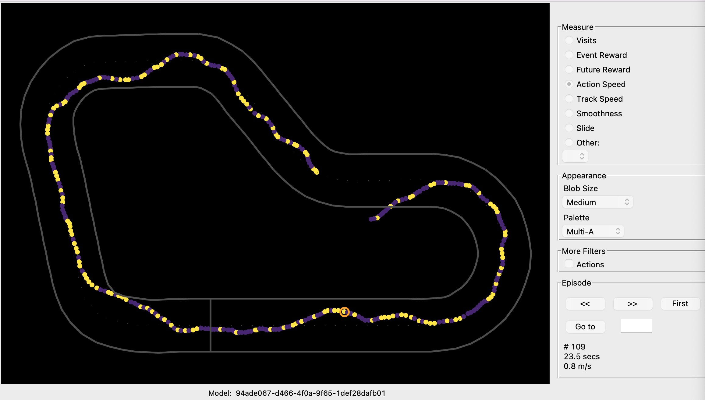
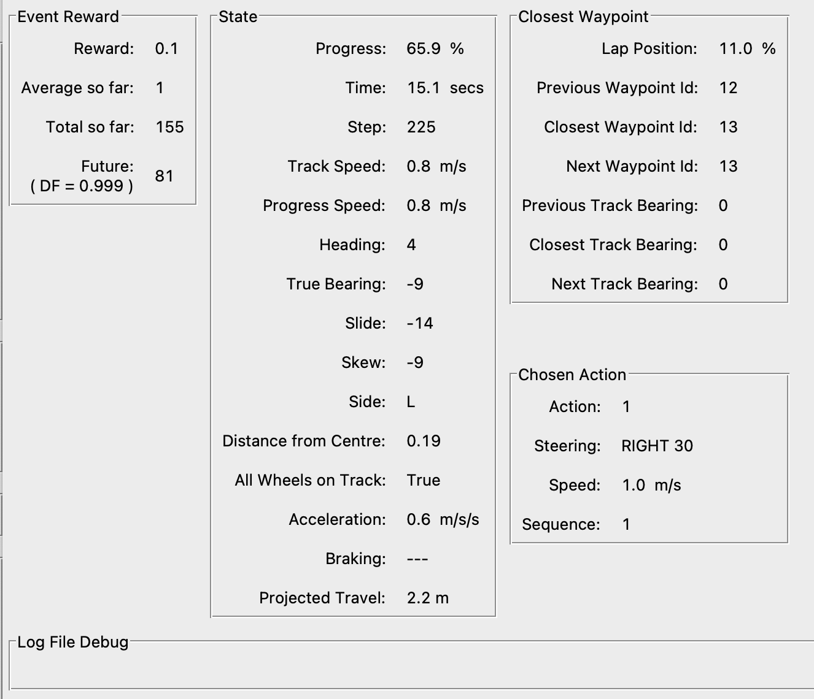

# Getting started with DeepRacer Log Guru


## Links

 * DeepRacer Log Guru (DLG) - [https://github.com/aws-deepracer-community/deepracer-log-guru](https://github.com/aws-deepracer-community/deepracer-log-guru)
   * install docs - [https://github.com/aws-deepracer-community/deepracer-log-guru/blob/master/docs/installation.md](https://github.com/aws-deepracer-community/deepracer-log-guru/blob/master/docs/installation.md)
   * usage docs - [https://github.com/aws-deepracer-community/deepracer-log-guru/blob/master/docs/getting_started.md](https://github.com/aws-deepracer-community/deepracer-log-guru/blob/master/docs/getting_started.md)
   * releases - [https://github.com/aws-deepracer-community/deepracer-log-guru/releases](https://github.com/aws-deepracer-community/deepracer-log-guru/releases)

## Beware

 * Approximate vs exact values!

## Terminology

 Iteration =
  * Update of the policy based on the learning rate
  * The track is split in 20 (number of episodes per iteration) to start from that position

 Episode =
  * Use exploration/exploitation based on training 
  * Different episode can have different length (number of steps)

 Step = 
  * aka experience, event, data point
  * It is a tuple of (s, a, r, s') where s stands for observation (or state) captured by the sensors/camera, a for an action

 * Measure = color used for step/event points
   * Visits
   * Event Reward = reward at the step 
   * Future reward
   * Action speed
   * Track speed = The speed the car is currently traveling at on the track
   * Smoothness
   * Slide
   * Progress Speed = The speed of the car relative to the center line
     * If traveliling along center line = track_speed
     * If car is cutting a corner, then > track_speed
     * If car is going sideways or taking the outside of corner, then < track_speed
   * Acceleration
   * Braking
   * Steering straight
   * Steering left
   * Steering right
   * Skew
   * Projected travel
   * Seconds
 * Appearance
 * More filters
   * Actions
 * Episode
   * Prev
   * Next
   * First
   * Go to


 * Event Reward 
   * Reward = reward computed for step
   * Average so far = for episode? iteration? 
   * Total so far =
   * Future
     * factor discount = 0.999
     * expected future reward value ?

 * State
   * Progress = Progress towards a complete lap as a % in range 0 and 100 for current episode 
   * Time = Duration of episode
   * Step = sample number in this episode
   * Action speed = Speed of the action chosen from the action space
   * Track speed = (Approximate) Measured speed of car in simulated environment
   * Progress speed = (Approximate) Speed in progress or (progress_after - progress_before_step) * track_length / time_step
   * Heading = direction angle :warning: -180 to 180 with 0 is going to the right
   * True Bearing = The actual bearing the car is traveling along which might differ from the heading especially on bends, or if car is out of control (spinning, etc)
   * Slide = drift on left or right (noise) ?
     * Difference in degrees between the heading and true_bearing
     * somehwere between 10 and 20 degs difference marks the change from controlled behaviour to sliding/skiding/spinning
   * Skew = rotation (noise) ?
     * Difference in degrees between track_bearing and true_bearing
     * If following the center line, value is close to 0 (good if straight line)
     * If driving across track, value > 0 (good if cutting corners)
   * Side = L, R of center line
   * Distance from center = 
   * All wheels on track
     * True if one or more wheels are not on the track
     * False otherwise
   * Acceleration =
   * Braking = 
   * Projected travel =

 * Closest waypoint
   * Lap position = % of track as a position
     * 0% = starting position
     * 100% = just before starting line
   * Previous waypoint id =
   * Closest waypoint id =
   * Next waypoint id =
   * Previous track bearing =
   * Closest track bearing = 
   * Next track bearing =

 * Chosen action
   * Action: Action number in model.meta.json file extracted from log file
   * Steering:
     * LEFT = positive steering angle
     * RIGHT = negative steering angle
     * AHEAD = 0 steering angle!
   * Speed:
     * Action speed <= 4.0 m/s (> 4.0 m/s is not accepted in console)
   * Sequence = Counts number of consecutive times the same action has been chosen, including this step (hence always >= 1)

## Installation

 ```
# Download from release section
tar xvzf  deepracer-log-guru-RELEASE_V3.2.25.tar.gz

cd deepracer-log-guru-RELEASE_V3.2.25
python3 -m src.main.guru
 ```

## Download the logs

 Find the logs
  * there are training and evaluation logs
  * there are sagemaker and robomaker logs
  * You need the training logs for the robomaker !

 To download from the console:
  * go to the model pages
  * in the training tab, click on the button "download logs"
  * untar-gz it!

  ```
tar xvzf console-first-training_job_DgEzMxvIS2aah465hkQlmQ_logs.tar.gz
  ```

  * we are only interested in the file in <top_dir>/logs/training/*robomaker.log

  ```
# tar xvzf console-first-training_job_DgEzMxvIS2aah465hkQlmQ_logs.tar.gz --include '*robomaker.log' --strip-components 3
tar xvzf *.tar.gz --include '*robomaker.log' --strip-components 3

ls *.log

training-20230802041103-DgEzMxvIS2aah465hkQlmQ-robomaker.log
 ```

## Import the logs

 * Install DeepRacer Log Guru
   * python 3.19.13
   * pip install install matplotlib==3.3.3 numpy==1.19.3 scipy==1.6.0
   * download log guru [release ](https://github.com/aws-deepracer-community/deepracer-log-guru/releases)

 * once successfuly imported
   * a *robotmaker.log.meta.json files are created with extracted model metadata

 {: width="100%"}

 {: width="100%"}

## Videos

 

 

## Files

### robomaker.log.meta.json

 This file is generated when the corresponding log file is imported in DRG

 ```
\cat training-20230802041103-DgEzMxvIS2aah465hkQlmQ-robomaker.log.meta.json
{
  "model_name": "94ade067-d466-4f0a-9f65-1def28dafb01",
  "world_name": "reinvent_base",
  "race_type": "TIME_TRIAL",
  "job_type": "TRAINING",
  "hyper": {                                        # Hyperparameters
    "batch_size": 64,
    "entropy": 0.01,
    "discount_factor": 0.999,                           # How far ahead to look
    "loss_type": "huber",
    "learning_rate": 0.0003,
    "episodes_per_training_iteration": 0,               # Wrong! Should be 20!
    "epochs": 10
  },
  "episode_stats": {                                # Log information
    "episode_count": 147,                               # Number of episodes
    "iteration_count": 0,                               # 
    "success_count": 8,                                 # Number of episodes that completed successfully
    "average_percent_complete": 25.527781632653063,
    "best_steps": 319,
    "average_steps": 343,
    "worst_steps": 359,
    "best_time": 21.179999999999836,
    "average_time": 22.79387499999997,
    "worst_time": 23.861999999999966,
    "best_distance": 17.274265500723494,
    "average_distance": 17.749222619120275,
    "worst_distance": 18.07723632488707,
    "best_reward": 319.5,                               # Best total reward
    "average_reward": 61.443292517006796,               # Average total reward
    "worst_reward": 6.905000000000001,                  # Smallest total reward
    "training_minutes": 25                              # Training length = stack TTL - 5 min of deployment time
  },
  "action_space": [                                 # Action space
    {
      "speed": 0.5,                                     # Speed of first action
      "steering_angle": -30.0,                          # Steering angle 
      "index": 0                                        # Action index
    },
    {                                                   # Action are ordered from RIGHT-most SLOW-most to
      "speed": 1.0,                                     # ... LEFT-most FAST-most
      "steering_angle": -30.0,
      "index": 1                                        # Action index of 2nd action
    },
    {
      "speed": 0.5,
      "steering_angle": -15.0,
      "index": 2
    },
    {
      "speed": 1.0,
      "steering_angle": -15.0,
      "index": 3
    },
    {
      "speed": 0.5,
      "steering_angle": 0.0,
      "index": 4
    },
    {
      "speed": 1.0,
      "steering_angle": 0.0,
      "index": 5
    },
    {
      "speed": 0.5,
      "steering_angle": 15.0,
      "index": 6
    },
    {
      "speed": 1.0,
      "steering_angle": 15.0,
      "index": 7
    },
    {
      "speed": 0.5,
      "steering_angle": 30.0,
      "index": 8
    },
    {
      "speed": 1.0,                                 # FAST-most and ...
      "steering_angle": 30.0,                       # LEFT-most action !
      "index": 9                                    # Index for last action
    }
  ]
}
 ```

### DRG_config

 This file is generated when DRG is started in the directory it is started in

 ```
deepracer-log-guru-RELEASE_V3.2.25 $ cat DRG_config.json
{
  "log_directory": ".",                             # Last open directory
  "last_open_track": "Vegas_track",                 # Track name in UI
  "calculate_alternate_discount_factors": false,
  "calculate_new_reward": false                     # DRG options
}
 ```

