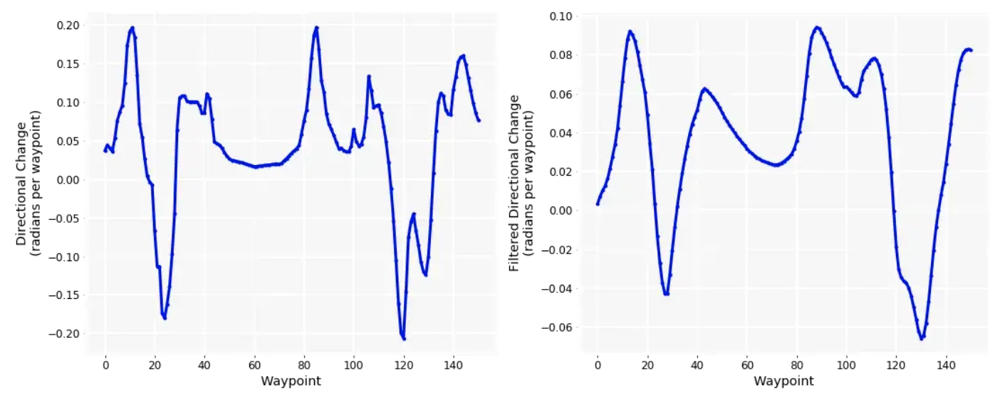
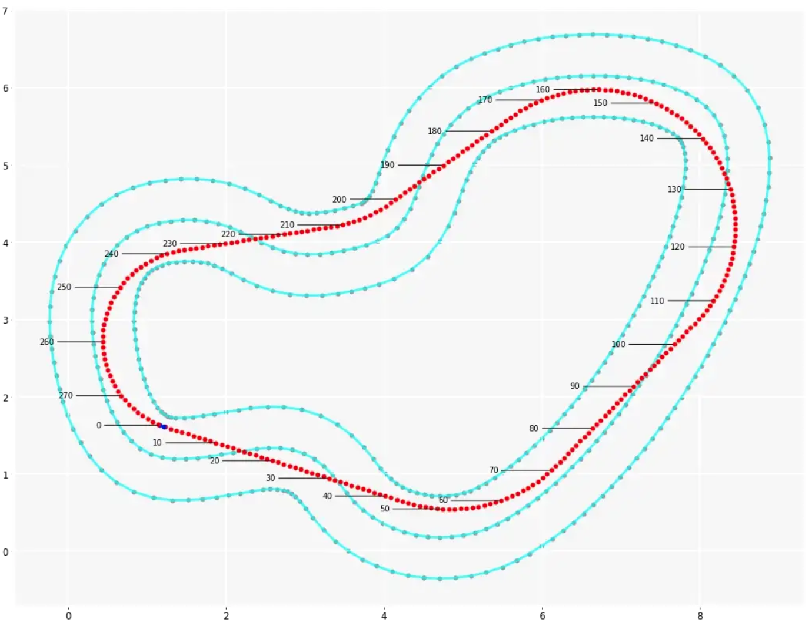

# DeepRacer Track Analysis

## Links

 * shapely - [https://shapely.readthedocs.io/en/stable/reference/shapely.LineString.html#shapely.LineString](https://shapely.readthedocs.io/en/stable/reference/shapely.LineString.html#shapely.LineString)


 * track data 
   * [https://github.com/aws-deepracer-community/deepracer-race-data/tree/main/raw_data/tracks](https://github.com/aws-deepracer-community/deepracer-race-data/tree/main/raw_data/tracks)
 * physical track
   * [https://thecattlecrew.net/2019/02/12/how-to-build-a-deepracer-track/](https://thecattlecrew.net/2019/02/12/how-to-build-a-deepracer-track/)
   * [https://docs.aws.amazon.com/deepracer/latest/developerguide/deepracer-track-examples.html](https://docs.aws.amazon.com/deepracer/latest/developerguide/deepracer-track-examples.html)
   * [https://github.com/awsdocs/aws-deepracer-developer-guide/blob/master/doc_source/deepracer-build-your-track.md](https://github.com/awsdocs/aws-deepracer-developer-guide/blob/master/doc_source/deepracer-build-your-track.md)
   
 * optimal racing line
   * ideal racing line - [https://blog.orium.com/the-best-path-a-deepracer-can-learn-2a468a3f6d64](https://blog.orium.com/the-best-path-a-deepracer-can-learn-2a468a3f6d64)
   * racing line Bayesian optimization paper - [https://arxiv.org/abs/2002.04794](https://arxiv.org/abs/2002.04794)
   * paper - [https://dspace.mit.edu/handle/1721.1/64669](https://dspace.mit.edu/handle/1721.1/64669)
   * paper - [https://www.remi-coulom.fr/Thesis/](https://www.remi-coulom.fr/Thesis/)
   * racing line article - [https://medium.com/adventures-in-autonomous-vehicles/genetic-programming-for-racing-line-optimization-part-1-e563c606e502](https://medium.com/adventures-in-autonomous-vehicles/genetic-programming-for-racing-line-optimization-part-1-e563c606e502)
   * code
     * code - [https://github.com/cdthompson/deepracer-k1999-race-lines](https://github.com/cdthompson/deepracer-k1999-race-lines)
     * same but better - [https://github.com/dgnzlz/Capstone_AWS_DeepRacer/blob/master/Compute_Speed_And_Actions/Race-Line-Calculation.ipynb](https://github.com/dgnzlz/Capstone_AWS_DeepRacer/blob/master/Compute_Speed_And_Actions/Race-Line-Calculation.ipynb)
     * integration - [https://github.com/dgnzlz/Capstone_AWS_DeepRacer/blob/master/Reward_Function/reward_function.py](https://github.com/dgnzlz/Capstone_AWS_DeepRacer/blob/master/Reward_Function/reward_function.py)
     * compute using PSO - [https://github.com/ParsaD23/Racing-Line-Optimization-with-PSO](https://github.com/ParsaD23/Racing-Line-Optimization-with-PSO)

 * optimal action space
   * [https://www.linkedin.com/pulse/aws-deepracer-how-calculate-best-racing-line-compute-actions-chen/](https://www.linkedin.com/pulse/aws-deepracer-how-calculate-best-racing-line-compute-actions-chen/)
   * locked ? [https://towardsdatascience.com/an-advanced-guide-to-aws-deepracer-2b462c37eea](https://towardsdatascience.com/an-advanced-guide-to-aws-deepracer-2b462c37eea) 

## Terminology


 Braking point = where you start braking while entering the curve

 turning point = Passed the braking point, where you start steering and turning in the curve. You drive towards the APEX of the curve
  * car should be still braking

 APEX = Where the car touch the inside of the curve
  * before APEX, car is braking (and possibly start re-accelerating)
  * after APEX, car is accelerating (or maintaining same speed)
  * :warning: when you start re-accelerating is when you open the steering

 Exit point = where you stop turning? Maximum speed at exit if straight line after?
  * to open the exit, use an APEX after the geometric line (turn more first, to accelerate more later)
    * the turn = 1 big turn + 1 straight line! = less time turning than in geometric line
    * brake a bit later (brake point is later), but turn is slower (and accelerate earlier!)

 Racing Line = The trajectory taken by the car on a section of the track.
  1. braking point
  2. turning point
  3. APEX
  4. exit point

 Geometric line
   * mathematical best line
   * the best use of the circuit
   * constant radius using compass
   * every inch of track-outside-inside-outside
   * IF decrease in radius (eg not using all track) = slow speed
   * Geometric line is the fastest line in the corner is in complete isolation

 Segment of corner
   * breaking, turning, apex, and exit points
   * line depends on what follows
   * depends on your car

 The ideal racing line
   * straights are critical
   * APEX later, open up exit
   + less time in corner, more on straight
   + accelerate earlier, full throttle sooner
   + later turning = later braking
   - later turning = higher turn

 The radius if a corner
   * tighter corner --> more focus on exit
   * due to speed - the faster you are going, the slower you will accelerate (air resistance)
   * hairpin more focused on exit (more acceleration to take place)
   * fast curve = keeping up momentum (less acceleration to have / place )


## Direction space

### Directional change analysis

  negative values = right turns

  the circuit requires more pronounced left than right turning = counter clockwise race !

  {: width="100%"}


## Notebook to process track data

```
git clone https://github.com/cdthompson/deepracer-k1999-race-lines
cd deepracer-k1999-race-lines
jupyter notebook
# open Race-Line-Calculation.ipynb
```

## Reading track files

 Track data/files can be found at - [https://github.com/aws-deepracer-community/deepracer-race-data/tree/main/raw_data/tracks](https://github.com/aws-deepracer-community/deepracer-race-data/tree/main/raw_data/tracks)

 To read them:

 ```
import numpy as np

TRACK_NAME = '2022_april_open_ccw                                # Ace Speedway track!
waypoints = np.load("./path/to/file.npy" % TRACK_NAME)

center_line = waypoints[:,0:2]
inner_border = waypoints[:,2:4]
outer_border = waypoints[:,4:6]

print(len(center_line))                       # Number of waypoints
center_line_list_list = center_line.tolist()  # Turn NP.array in list of list
 ```
 Turn into LineString shapely objects
 ```
from shapely.geometry import LineString

ls_center_line = LineString(center_line)      # Convert NP.array into a LineString
ls_inner_border = LineString(inner_border)
ls_outer_border = LineString(outer_border)

line = LineString(list_of_list)               # Turn a list of list into tuples
 ```
 Plot in matplotlib
 ```
import matplotlib.pyplot as plt

fig = plt.figure(1, figsize=(16, 10))
ax = fig.add_subplot(111, facecolor='black')
plt.axis('equal')

# Plot dots and lines between dots for center-line!
x, y = ls_center_line.xy
ax.plot(x, y, '.', color='#999999', zorder=1)
ax.plot(x, y, color='cyan', alpha=0.7, linewidth=3, solid_capstyle='round', zorder=2)
 ```


## Ideal Racing Line

 In simple terms, the ideal racing line is the fastest possible path through a circuit. There are many well-known guidelines for defining an ideal line, but in general, they aim to balance four (often conflicting) goals:
  * Use the full width of the track, to achieve the widest possible turning radius around a curve, because the wider the turn, the faster you can go through it.
  * Keep braking to a minimum (in terms of both deceleration and time) and try to get it all done before you start turning.
  * Accelerate throughout the curve and, if at all possible, exit the curve at full throttle.
  * Drive in a straight line as much as possible, because that maximizes the time you will be driving at top speed.

 Beyond these broad guidelines, defining an ideal line is more art than science; and racing it effectively, depends on everything from the load balancing of the car, to the nature of the circuit, to the reaction time and state of mind of the driver.

  {: width="100%"}

  Articles
   * [https://medium.com/adventures-in-autonomous-vehicles/genetic-programming-for-racing-line-optimization-part-1-e563c606e502](https://medium.com/adventures-in-autonomous-vehicles/genetic-programming-for-racing-line-optimization-part-1-e563c606e502)

  

  

  

  

  

  

  

  

  

  

  

  

  

## F1 and weird racing lines

 

## Waypoint visualization

 

## inner, center, outer lines

### Ace speedway

 Without the rounding, the list of lists is too long!
 ```
# print("inner_border = ", inner_border.tolist())
print("inner_border = ", [[round(x,2), round(y,2)] for x, y in inner_border.tolist()])
 ```
 ```
inner_border =  [[0.15, -2.82], [0.26, -2.88], [0.37, -2.95], [0.52, -3.03], [0.79, -3.17], [1.05, -3.32], [1.32, -3.46], [1.58, -3.61], [1.84, -3.75], [2.11, -3.9], [2.37, -4.04], [2.64, -4.19], [2.9, -4.33], [3.16, -4.48], [3.43, -4.62], [3.69, -4.77], [3.96, -4.91], [4.22, -5.06], [4.48, -5.2], [4.75, -5.35], [5.02, -5.5], [5.29, -5.65], [5.54, -5.81], [5.77, -5.93], [6.01, -6.04], [6.24, -6.11], [6.45, -6.16], [6.66, -6.16], [6.86, -6.13], [7.05, -6.06], [7.24, -5.95], [7.43, -5.81], [7.59, -5.64], [7.75, -5.44], [7.9, -5.23], [8.04, -5.0], [8.16, -4.76], [8.27, -4.51], [8.37, -4.26], [8.46, -3.99], [8.54, -3.72], [8.6, -3.46], [8.65, -3.18], [8.69, -2.91], [8.71, -2.66], [8.7, -2.42], [8.67, -2.18], [8.61, -1.97], [8.52, -1.77], [8.41, -1.61], [8.26, -1.48], [8.08, -1.36], [7.87, -1.26], [7.64, -1.19], [7.38, -1.13], [7.12, -1.09], [6.84, -1.06], [6.56, -1.04], [6.28, -1.03], [6.01, -1.03], [5.73, -1.05], [5.44, -1.08], [5.14, -1.11], [4.82, -1.14], [4.48, -1.15], [4.14, -1.14], [3.8, -1.09], [3.47, -1.02], [3.14, -0.93], [2.83, -0.82], [2.52, -0.7], [2.24, -0.56], [1.95, -0.42], [1.67, -0.27], [1.4, -0.11], [1.13, 0.06], [0.86, 0.23], [0.6, 0.43], [0.34, 0.63], [0.1, 0.85], [-0.14, 1.08], [-0.36, 1.33], [-0.57, 1.59], [-0.76, 1.87], [-0.93, 2.17], [-1.08, 2.48], [-1.21, 2.79], [-1.31, 3.12], [-1.39, 3.44], [-1.44, 3.77], [-1.48, 4.1], [-1.5, 4.42], [-1.51, 4.69], [-1.55, 4.89], [-1.63, 5.07], [-1.75, 5.27], [-1.9, 5.45], [-2.07, 5.63], [-2.27, 5.79], [-2.47, 5.93], [-2.68, 6.04], [-2.89, 6.12], [-3.1, 6.16], [-3.34, 6.16], [-3.63, 6.15], [-3.93, 6.14], [-4.23, 6.14], [-4.53, 6.13], [-4.83, 6.12], [-5.13, 6.11], [-5.44, 6.11], [-5.74, 6.1], [-6.04, 6.09], [-6.35, 6.08], [-6.62, 6.08], [-6.85, 6.05], [-7.1, 5.99], [-7.33, 5.92], [-7.49, 5.84], [-7.61, 5.72], [-7.75, 5.52], [-7.89, 5.3], [-8.02, 5.06], [-8.13, 4.81], [-8.24, 4.55], [-8.34, 4.29], [-8.43, 4.03], [-8.51, 3.76], [-8.58, 3.48], [-8.64, 3.22], [-8.68, 2.95], [-8.7, 2.69], [-8.7, 2.44], [-8.68, 2.21], [-8.63, 2.04], [-8.56, 1.92], [-8.41, 1.8], [-8.2, 1.66], [-7.96, 1.51], [-7.71, 1.37], [-7.46, 1.23], [-7.2, 1.1], [-6.94, 0.98], [-6.67, 0.85], [-6.39, 0.73], [-6.12, 0.6], [-5.83, 0.47], [-5.55, 0.32], [-5.27, 0.16], [-5.01, 0.01], [-4.75, -0.13], [-4.49, -0.28], [-4.23, -0.42], [-3.97, -0.56], [-3.7, -0.71], [-3.44, -0.85], [-3.17, -1.0], [-2.91, -1.14], [-2.64, -1.29], [-2.38, -1.43], [-2.12, -1.58], [-1.85, -1.72], [-1.59, -1.87], [-1.32, -2.01], [-1.06, -2.16], [-0.8, -2.3], [-0.53, -2.45], [-0.27, -2.59], [-0.0, -2.74], [0.15, -2.82]]
 ```

```
# optimum = deserialized
print("optimum = ", [[round(x,2), round(y,2)] for x, y in deserialized.tolist()])
print("optimum = ", optimum.tolist())

optimum =  [[-0.11, -3.29], [0.0, -3.35], [0.12, -3.41], [0.27, -3.5], [0.53, -3.64], [0.8, -3.79], [1.06, -3.93], [1.32, -4.08], [1.59, -4.22], [1.85, -4.37], [2.12, -4.51], [2.38, -4.65], [2.64, -4.79], [2.91, -4.93], [3.17, -5.07], [3.44, -5.2], [3.7, -5.33], [3.97, -5.46], [4.23, -5.58], [4.5, -5.69], [4.76, -5.8], [5.03, -5.9], [5.3, -5.98], [5.56, -6.06], [5.83, -6.12], [6.09, -6.16], [6.35, -6.18], [6.61, -6.17], [6.86, -6.13], [7.09, -6.04], [7.31, -5.92], [7.51, -5.77], [7.7, -5.59], [7.87, -5.4], [8.02, -5.2], [8.16, -4.98], [8.28, -4.76], [8.39, -4.52], [8.49, -4.28], [8.57, -4.04], [8.63, -3.79], [8.68, -3.54], [8.72, -3.29], [8.74, -3.03], [8.75, -2.78], [8.73, -2.53], [8.7, -2.28], [8.63, -2.04], [8.54, -1.81], [8.4, -1.6], [8.22, -1.42], [8.02, -1.27], [7.8, -1.14], [7.57, -1.02], [7.32, -0.93], [7.06, -0.85], [6.79, -0.78], [6.52, -0.72], [6.24, -0.67], [5.96, -0.62], [5.67, -0.57], [5.39, -0.52], [5.1, -0.47], [4.82, -0.41], [4.54, -0.35], [4.25, -0.28], [3.98, -0.21], [3.7, -0.13], [3.43, -0.04], [3.16, 0.06], [2.9, 0.17], [2.64, 0.28], [2.38, 0.41], [2.13, 0.54], [1.89, 0.69], [1.66, 0.84], [1.43, 1.01], [1.21, 1.19], [1.0, 1.37], [0.8, 1.56], [0.6, 1.77], [0.42, 1.98], [0.24, 2.19], [0.06, 2.42], [-0.1, 2.65], [-0.26, 2.88], [-0.42, 3.12], [-0.57, 3.37], [-0.71, 3.61], [-0.86, 3.85], [-1.0, 4.1], [-1.13, 4.34], [-1.27, 4.57], [-1.41, 4.8], [-1.56, 5.03], [-1.72, 5.24], [-1.89, 5.44], [-2.07, 5.63], [-2.28, 5.79], [-2.49, 5.94], [-2.72, 6.06], [-2.97, 6.17], [-3.22, 6.25], [-3.48, 6.33], [-3.75, 6.39], [-4.02, 6.43], [-4.3, 6.46], [-4.57, 6.48], [-4.85, 6.49], [-5.13, 6.48], [-5.41, 6.46], [-5.69, 6.44], [-5.96, 6.4], [-6.24, 6.34], [-6.5, 6.28], [-6.77, 6.2], [-7.02, 6.1], [-7.26, 5.98], [-7.49, 5.84], [-7.69, 5.67], [-7.88, 5.48], [-8.05, 5.28], [-8.19, 5.06], [-8.33, 4.83], [-8.44, 4.59], [-8.54, 4.35], [-8.63, 4.1], [-8.69, 3.85], [-8.75, 3.59], [-8.78, 3.33], [-8.8, 3.07], [-8.8, 2.82], [-8.78, 2.56], [-8.73, 2.31], [-8.64, 2.06], [-8.51, 1.84], [-8.36, 1.62], [-8.19, 1.42], [-7.99, 1.23], [-7.79, 1.05], [-7.57, 0.88], [-7.34, 0.71], [-7.1, 0.55], [-6.85, 0.4], [-6.6, 0.25], [-6.34, 0.1], [-6.08, -0.04], [-5.82, -0.19], [-5.55, -0.33], [-5.29, -0.47], [-5.02, -0.61], [-4.76, -0.76], [-4.49, -0.9], [-4.23, -1.04], [-3.96, -1.18], [-3.7, -1.33], [-3.43, -1.47], [-3.17, -1.61], [-2.9, -1.76], [-2.64, -1.9], [-2.37, -2.05], [-2.11, -2.19], [-1.85, -2.34], [-1.58, -2.48], [-1.32, -2.63], [-1.05, -2.77], [-0.79, -2.92], [-0.53, -3.06], [-0.26, -3.21], [-0.11, -3.29]]
```

```
print("outer_border = ", [[round(x,2), round(y,2)] for x, y in outer_border.tolist()])
print("outer_border = ", outer_border.tolist())

outer_border =  [[-0.37, -3.76], [-0.25, -3.82], [-0.14, -3.88], [0.01, -3.96], [0.27, -4.11], [0.54, -4.25], [0.8, -4.4], [1.07, -4.54], [1.33, -4.69], [1.59, -4.83], [1.86, -4.98], [2.12, -5.12], [2.39, -5.27], [2.65, -5.41], [2.91, -5.56], [3.18, -5.7], [3.44, -5.85], [3.71, -5.99], [3.97, -6.14], [4.23, -6.28], [4.49, -6.42], [4.75, -6.57], [5.01, -6.73], [5.31, -6.89], [5.62, -7.03], [5.96, -7.14], [6.34, -7.22], [6.74, -7.22], [7.12, -7.16], [7.5, -7.03], [7.83, -6.83], [8.13, -6.61], [8.38, -6.35], [8.6, -6.09], [8.8, -5.81], [8.97, -5.51], [9.12, -5.22], [9.26, -4.92], [9.37, -4.61], [9.48, -4.31], [9.57, -3.99], [9.64, -3.67], [9.7, -3.36], [9.75, -3.03], [9.77, -2.68], [9.76, -2.32], [9.71, -1.96], [9.61, -1.6], [9.45, -1.24], [9.21, -0.91], [8.92, -0.64], [8.6, -0.43], [8.26, -0.27], [7.92, -0.16], [7.59, -0.08], [7.26, -0.03], [6.94, 0.01], [6.62, 0.03], [6.29, 0.04], [5.97, 0.03], [5.64, 0.01], [5.33, -0.02], [5.04, -0.05], [4.76, -0.08], [4.49, -0.08], [4.23, -0.07], [3.97, -0.04], [3.72, 0.01], [3.46, 0.08], [3.21, 0.17], [2.95, 0.28], [2.7, 0.4], [2.44, 0.52], [2.19, 0.66], [1.94, 0.8], [1.71, 0.95], [1.47, 1.11], [1.25, 1.27], [1.03, 1.45], [0.82, 1.63], [0.63, 1.82], [0.46, 2.02], [0.29, 2.23], [0.14, 2.45], [0.01, 2.67], [-0.11, 2.9], [-0.2, 3.15], [-0.28, 3.4], [-0.34, 3.66], [-0.39, 3.92], [-0.42, 4.19], [-0.44, 4.47], [-0.45, 4.81], [-0.53, 5.2], [-0.68, 5.56], [-0.88, 5.88], [-1.1, 6.17], [-1.36, 6.42], [-1.63, 6.64], [-1.92, 6.84], [-2.25, 7.01], [-2.6, 7.14], [-2.98, 7.22], [-3.34, 7.23], [-3.66, 7.22], [-3.96, 7.21], [-4.26, 7.2], [-4.56, 7.19], [-4.86, 7.19], [-5.16, 7.18], [-5.46, 7.17], [-5.76, 7.16], [-6.07, 7.16], [-6.36, 7.15], [-6.69, 7.15], [-7.05, 7.1], [-7.39, 7.02], [-7.74, 6.91], [-8.11, 6.71], [-8.41, 6.42], [-8.63, 6.12], [-8.81, 5.83], [-8.97, 5.54], [-9.11, 5.25], [-9.23, 4.95], [-9.35, 4.65], [-9.45, 4.35], [-9.54, 4.04], [-9.62, 3.73], [-9.69, 3.4], [-9.74, 3.07], [-9.77, 2.74], [-9.77, 2.39], [-9.73, 2.01], [-9.61, 1.61], [-9.37, 1.22], [-9.06, 0.95], [-8.77, 0.76], [-8.5, 0.59], [-8.23, 0.44], [-7.95, 0.28], [-7.67, 0.14], [-7.39, 0.01], [-7.11, -0.12], [-6.84, -0.24], [-6.57, -0.37], [-6.3, -0.49], [-6.05, -0.62], [-5.8, -0.76], [-5.54, -0.91], [-5.27, -1.06], [-5.01, -1.21], [-4.74, -1.36], [-4.48, -1.5], [-4.21, -1.64], [-3.95, -1.79], [-3.69, -1.93], [-3.42, -2.08], [-3.16, -2.22], [-2.89, -2.37], [-2.63, -2.51], [-2.37, -2.66], [-2.1, -2.8], [-1.84, -2.95], [-1.57, -3.09], [-1.31, -3.24], [-1.05, -3.38], [-0.78, -3.53], [-0.52, -3.67], [-0.37, -3.76]]
 ```


