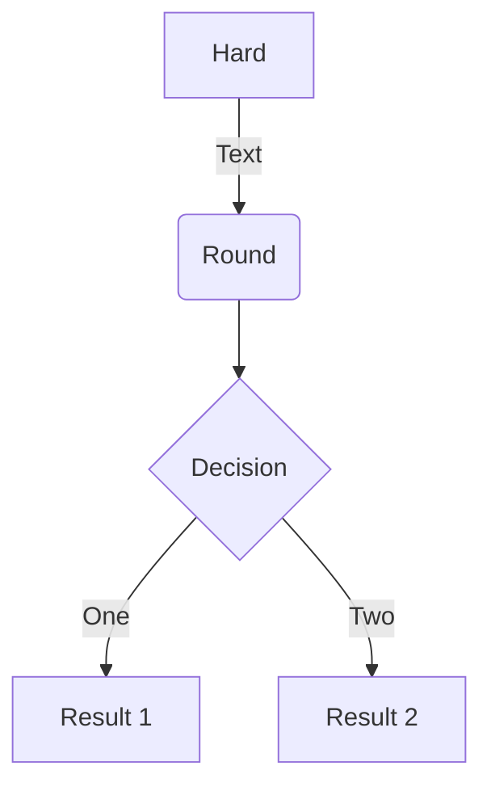
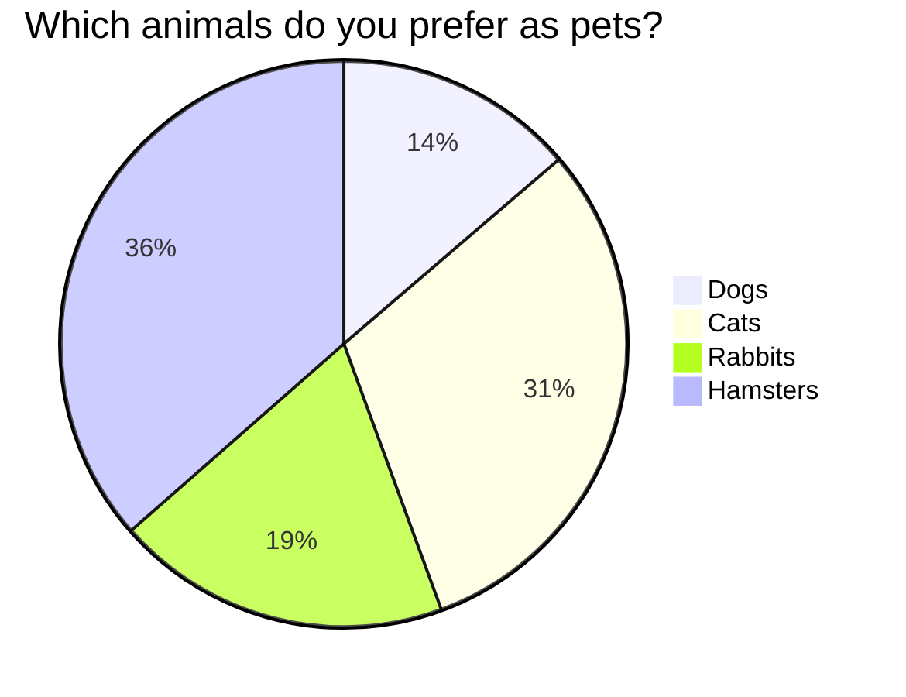
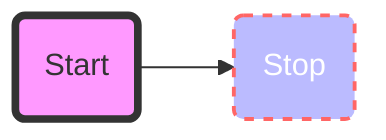

# Custom fences & Mermaid

```custom_fences
graph TD
    A[Hard] -->|Text| B(Round)
    B --> C{Decision}
    C -->|One| D[Result 1]
    C -->|Two| E[Result 2]
```







For more on diagram syntax: https://mermaid.js.org/intro/

