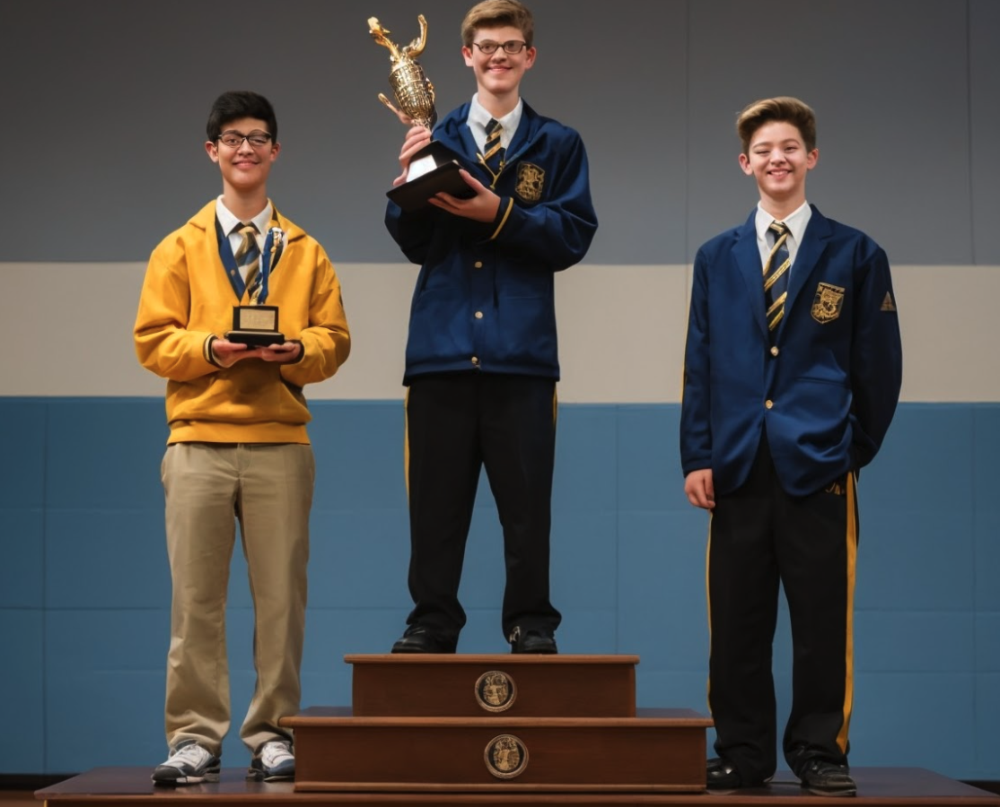
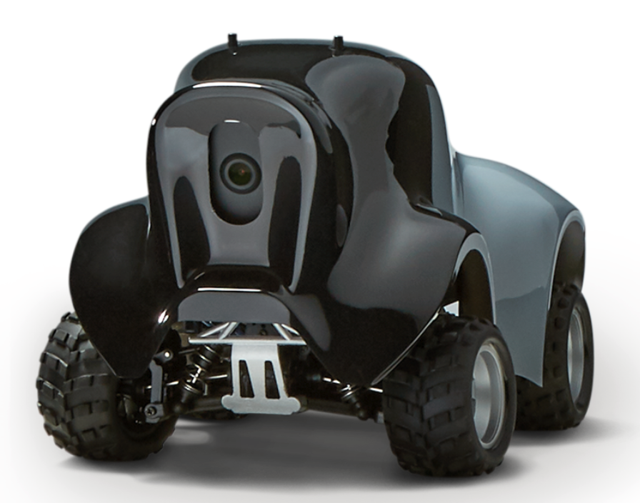

---
hide:
    # - footer
    - navigation
    - toc
---
# AWS DeepRacer Student League {: .center-text }

-   ## Students, start your engines! {: .center-text }

    AWS DeepRacer is the fastest way to embark on your machine learning journey, literally. 

    Middle and high school students, as well as developers of all skill levels, including those with no prior machine learning experience, can benefit from participating in the [DeepRacer Student League](https://docs.aws.amazon.com/deepracer/latest/student-userguide/what-is-deepracer-student-league.html).  By engaging in hands-on training, you will construct self-driving cars to compete for prices and race for glory!

    To get started, join the club and first race against your local classmates and peers. Thereafter, start competiting against other students at the national, regional, and global levels. Races are organized every month. Earn points, prizes, trophies, [scholarshipsi](https://scholarshipamerica.org/amazonfutureengineer/), and most importantly bragging rights!

-   

-   

-   ## Get in pole position to learn {: .center-text }

    In the AI club, using the DeepRacer ecosystem, you will learn the fundamentals of reinforcement learning with educational resources and easy-to-use console and real self-driving RC cars.

    Get started quickly with interactive tutorials and workshops walking step-by-step to the process. We will teach you how to build your first model in minutes.

    Get your hands dirty with the AWS DeepRacer console, and select your environment to train and evaluate models . In this environment, you will build the foundational skill sets to develop autonomous agents with reinforcement learning for any use-case.

-   ## Start in a virtual Environment {: .center-text }

    Test these new found skills in our 3D racing simulator. Experiment with multiple sensor inputs, the latest reinforcement learning algorithms, neural network configurations and simulation to-real domain transfer methods.

    Then get ready to go where the rubber meets the road.

-   

    

-   

-   ## ... then let's get real! {: .center-text }

    AWS DeepRacer is an autonomous 1/18th scale race car designed to test RL models by racing on a physical track. Using cameras to view the track and a reinforcement model to control throttle and steering, the car shows how a model trained in a simulated environment can be transferred to the real-world.

    So are you ready to hack your hardware? Head-to-head racing and object avoidance requires to fully equip your car with stereo cameras and LiDAR sensors. You may know how to program, but do you have what it takes to hack hardware?

    In self-driving car races, there are winners, but many more losers. Which one will you be?

Let's explore this transforming technology. Let's shape the future of AI together.

[Become a member](/forms/membership.md#){ .md-button .md-button--primary style="margin: 5% 10% 5% 10%; text-align: center; width: 40%;"}
[Become a mentor](/forms/mentorship.md#){ .md-button }

For more information, contact us at [ai4all@midtown.ai](mailto:ai4all@midtown.ai)

