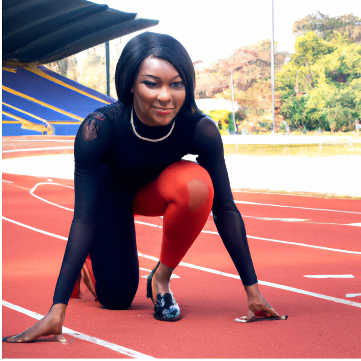

---
hide:
  - footer
  - navigation
  - toc
# previous_page: a.md
# next_page: b.md
---
# Educational Tracks  {: .center-text }

 As a non-profit, we provide an environment for middle and high-school students to safely explore AI through math, projects, use-cases, research, events, and competitions. Beyond mere discussion and theoretical learning, students actively engage with AI, gaining hands-on experience and interpersonal skills.

 If you are interested in becoming a [member](/forms/membership.md){ .shaking } or in helping as a [mentor](/forms/mentorship.md){ .shaking }, we welcome all motivated minds to join and contribute to Midtown AI. 

-   

    ## [Engineering](engineering.md) {: .center-text }

    Through coding labs, data projects, and working on end-to-end AI systems, students will gain applied skills to engineer innovative AI solutions and become proficient AI developers.

-   

    ## [Business+Leadership](business.md) {: style="text-align: center;"}

    Through readings, discussions, workshops, presentations, talks by industry leaders, and hands-on team projects, students will build business and leadership capacities to navigate the rapidly-evolving AI space.

-   

    ## [Research](research.md) {: .center-text }

    Through reading, experiments, presentations, collaborations, and participating in the global research community, students will gain abilities to understand and advance AI research. 

-   

    /// details | The engineering track provides students with technical skills required to build AI systems by ...
        type: question

    * Programming in Python using popular AI libraries like TensorFlow and PyTorch
    * Transforming data - collecting, cleaning, labeling, processing data for AI
    * Using Math fundamentals like linear algebra, calculus, statistics, optimization
    * Training, evaluating and optimizing deep learning models
    * Learning algorithm for computer vision, NLP and speech models for perception tasks
    * Building robots using environment simulations and reinforcement learning
    * Deploying AI model, APIs, using MLOps
    * Leveraging computational resources like GPUs, clusters, cloud computing
    * Building a team to explore real-world datasets and join competitions

    [Tell me more](engineering.md) {: .center-text }
    ///

-   

    /// details | The business+leadership track helps students communicate and unite around a vision by ...
        type: question

    * Understanding the AI industry landscape and market forces
    * Studying AI ethics, governance, and regulations
    * Exploring AI entrepreneurship and starting an AI company/nonprofit
    * Gaining project management skills for leading AI teams
    * Identifying where AI can add value in business processes and services
    * Developing problem framing and requirements gathering abilities
    * Learning AI strategy frameworks and case studies
    * Cultivating strategic thinking and leadership skills to complement technical AI expertise
    * Directing AI engineers to maximize their impact

    [Tell me more](business.md) {: .center-text }
    ///

-   

    /// details | This research track provides students with skills to explore and develop the state-of-the-art by ...
        type: question

    * Reviewing seminal and latest research papers across core topics
    * Implementing research paper algorithms and methods from scratch
    * Keeping up with recent developments
    * Exploring cutting edge research areas like multi-modal learning, self-supervised learning, transformers
    * Designing research experiments
    * Participating in literature reviews, journal clubs, replicating results
    * Attending conferences and workshops to connect with researchers
    * Communicating research ideas clearly in papers, presentations, code
    * Building team projects, replicating papers, or proposing new methods

    [Tell me more](research.md) {: .center-text }
    ///

-   ## [Math Circle](math_circle.md) {: .center-text }

    AI involves a lot of problem solving. Moreover AI is rarely done in isolation. By working through math problems and proofs, middle and high-school students will develop skills similar to those required for building and debugging AI systems. Our math circle allows for student collaboration and teamwork - being able to work together on complex math problems translates well to collaborating on AI projects.

    In the club, students will:

    * Work in teams through math competition-style problems, puzzles and games that require logic, pattern recognition, and problem decomposition.
    * Build strong math skills in areas like linear algebra, statistics, probability, and calculus
    * Discuss the mathematics behind algorithms and optimization techniques.
    * Acquire the mindset of simplifying problems, analyzing them, and finding solutions.

-   

-   

    

-   ## [DeepRacer](deepracer.md) {: .center-text }

    AWS DeepRacer allows middle and high-school students to get hands-on with machine learning by building their own autonomous race car models and compete in races using reinforcement learning.

    In the club, students will:

    * Learn fundamentals of AI, machine learning, and autonomous vehicles
    * Use AWS to train reinforcement learning models to optimize a virtual race car
    * Tune hyperparameters and adjust reward functions to improve model performance
    * Compete in simulated races against other club members
    * Have the opportunity to qualify for the global AWS DeepRacer League virtual circuit

    A good grasp of the core concepts of Python is advised for this track.

Let's explore this transforming technology. Let's shape the future of AI together.

[Become a member](/forms/membership.md#){ .md-button .md-button--primary style="margin: 5% 10% 5% 10%; text-align: center; width: 40%;"}
[Become a mentor](/forms/mentorship.md#){ .md-button }

For more information, contact us at [ai4all@midtown.ai](mailto:ai4all@midtown.ai)

