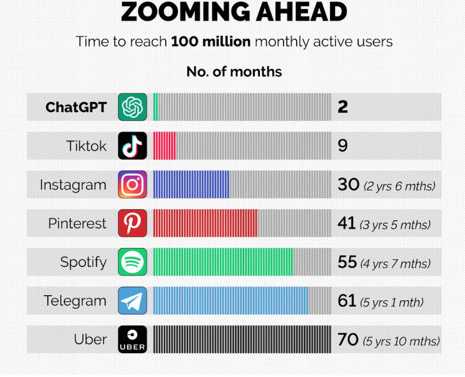
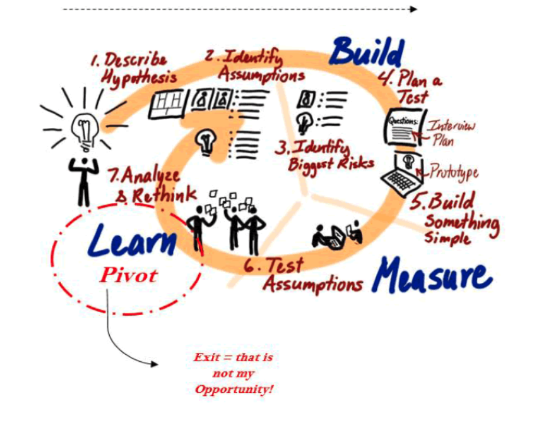

---
hide:
#    - footer
    - navigation
    - toc
---
# Business + Leadership {: .center-text }

-   

-   ## The market disruption {: .center-text }

    We're just 9 months into this ChatGPT experiment, and it's worth noting that ChatGPT has seen incredibly rapid adoption. It reached 1 million users within just 5 days, followed by 100 million users in only 2 months, surpassing even the growth rates of popular applications like TikTok and Instagram. Certainly **middle and high schoolers** took notice.

    In Silicon Valley, a thriving ecosystem of AI startups centered around Large Language Models (LLM) is currently attracting substantial funding from venture capitalists. These startups are poised to disrupt entire markets and industries.

    With the introduction of ChatGPT in November 2022, the world witnessed a nearly instantaneous transformation. This transformation has impacted major industries, including the corporate and education realms. What will the landscape look like 9 years from now when our children, **middle and high schoolers**, graduate?

-   ## Adapt or perish {: .center-text }

    In Silicon Valley, a select group of startup companies has recently secured funding to compete with law firms in producing high-quality contracts at significantly lower costs. To achieve this, they train their Large Language Model in legal language. Now, their LLM is responsible for generating documents and contracts, while lawyers' roles are relegated to meticulous review and proofreading. The concept of prominent lawyers overseeing this work isn't entirely novel. In the legal profession, it's typically not the big-name lawyers who draft content; that task usually falls to paralegals or associates, the more junior members of the team. Now, LLMs are beginning to approximate the work of these junior professionals. What will happen when you or your child graduates from law school and is seeking a job? Young people are almost always the first ones impacted.

-   

-   

-   ## The best career to aim for is ... {: .center-text }

    If you think that the most promising career path for the future is in the field of data or AI engineering, you might be correct and if so, [we got you covered](engineering.md#). However, in 9 years, it's highly probable that the most desirable career will be one that is currently non-existent. 

    So if there is no clear answer to that question, should we go back to the old fashioned approach that everyone follows? Get tutors, to get good grades, to get into a good college, to get a good job, to get a promotion.

    If so, is it even possible to distinguish oneself while conforming to the crowd?

-   ## The mini-entrepreneur {: .center-text }
    
    To truly stand out, an individual has to get out of this "I take, I get, and I extract" mindset and instead embrace one one focus on problem-solving, giving, and assisting others. In our opinion, the best way to do this is to become a mini-entrepreneur.

    Anyone can become a mini-entrepreneur, not necessarily by starting a formal business. Rather, it involves adopting a mindset geared towards creating value. Creating value is a straight forward process involving 3 steps: (1) identifying a group of people, a market segment, (2) understanding their challenges, desires, and problems, and (3) alleviating their pain points by offering new solutions.

    In the context of today's rapidly changing AI technology, new opportunities to generate value continually emerge. Can we harness AI to create value effectively?

-   

-   

-   ## AI, lean startup, and execution {: .center-text }

    AI has the potential to address, solve, and help with significant and complex problems across various domains, such as healthcare, climat change, financial services, transportation, manufacturing, cybersecurity, energy, space exploration, and education.

    With education, can AI personalize learning experiences, automate administrative tasks for educators, and enhance the accessibility of educational resources?

    In this track, middle and high schoolers will learn not only about AI, but also about market segmentation, empathy maps, value proposition, product development, partnerships, and lean startup principles to drive vision and execution.

    Interested? If so [reach out](/forms/membership.md#) , and let's adopt the mini-entrepreneur mindset and grow our potential through leadership.

Let's explore this transforming technology. Let's shape the future of AI together.

[Become a member](/forms/membership.md#){ .md-button .md-button--primary style="margin: 5% 10% 5% 10%; text-align: center; width: 40%;"}
[Become a mentor](/forms/mentorship.md#){ .md-button }

For more information, contact us at [ai4all@midtown.ai](mailto:ai4all@midtown.ai)

