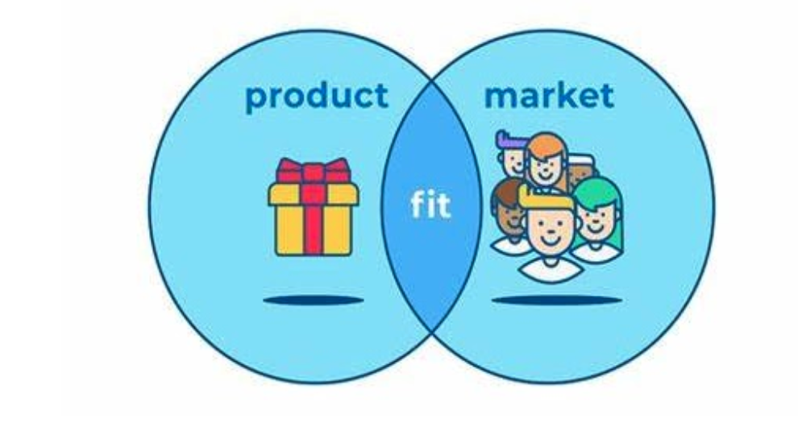
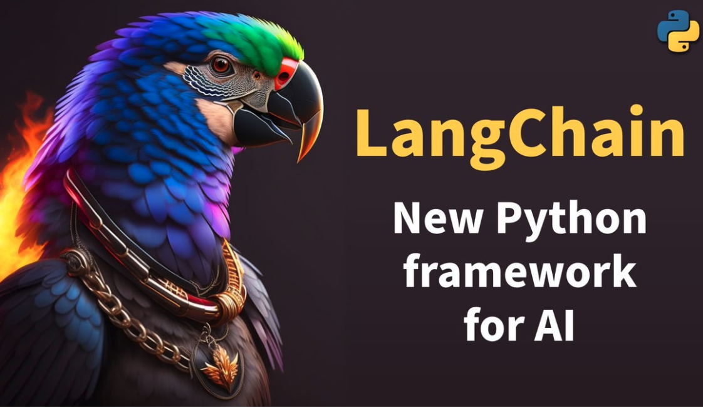

---
hide:
#    - footer
    - navigation
    - toc
---
# Soft and Hard Engineering {: .center-text }

-   ## The brainstorming session {: .center-text }

    In the first session of the 2023 fall program, with the enthusiastic returning students we initiated a brainstorming session to explore potential AI engineering projects. The session started with a splash of creativity. Students shared a plethora of ideas, some serious and some downright funny. Among the humorous concepts were an AI-powered pizza chef, a robot pet psychologist, and even a digital fortune teller.

    While the funny ideas generated laughter, the group gradually transitioned to more serious and impactful concepts. Discussions centered around AI applications in education and how AI could revolutionize the way we, students and humans, learn.

-   

-   

-   ## The AI tutor emerges {: .center-text }

    As the brainstorming continued, the concept of an AI tutor gained momentum. The group collectively imagined an AI tutor capable of instructing across diverse subjects, spanning mathematics, science, history, and languages.  It was an idea that blended innovation with real-world applicability.

    If we were to embark on the creation of an AI tutor, this project would offer us multifaceted benefits. It would serve as a platform for us not only to develop our Python programming skills, but also equip us with a new tool to enhance our own learning experiences.

    Consider the possibilities: We could develop a tutor not for academic shortcuts, but as a genuine aid for our education and scholastic pursuits. Instead of facilitating academic dishonesty, we would be fostering a tool to support our learning journey.

-   ## Commercial potential {: .center-text }

    What made the AI tutor concept even more compelling was its potential for commercialization. The students recognized that an AI tutor could address the educational needs of many, making it not only a valuable learning tool but also a marketable product.

    Can we learn in the AI club [business skills](business.md#) and how to sell a product? 

-   

-   

-   ## Enter LangChain {: .center-text }
    
    Easier said than done! Building an AI tutor is a complex endeavor. Certainly it is essential to stay updated with the latest advancements in AI and education technology. Additionally, it is crucial the AI tutor provides accurate and valuable educational content. 

    After identifying grown up AI engineers, to build our AI tutor we were told to leverage LangChain, a Python framework that enables the development of applications powered by large language-models (LLMs). We were even given pointers and tutorials on how to get started. 

    Do you want to [join](/forms/membership.md#) in the effort? Let's start coding! 

Let's explore this transforming technology. Let's shape the future of AI together.

[Become a member](/forms/membership.md#){ .md-button .md-button--primary style="margin: 5% 10% 5% 10%; text-align: center; width: 40%;"}
[Become a mentor](/forms/mentorship.md#){ .md-button }

For more information, contact us at [ai4all@midtown.ai](mailto:ai4all@midtown.ai)

