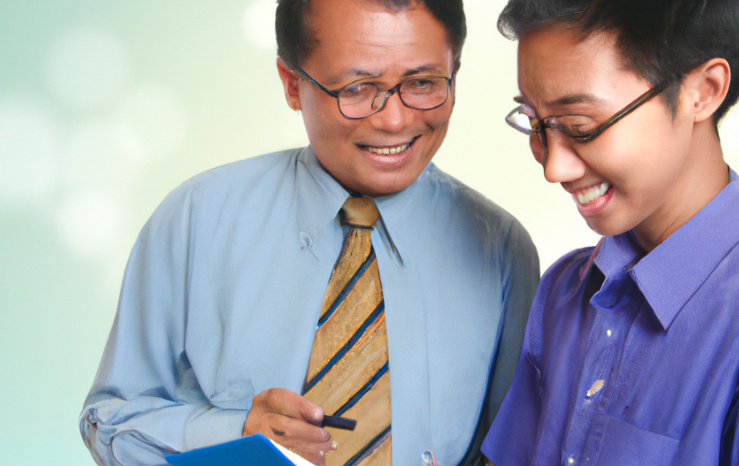

---
hide:
    - navigation
    - toc
#    - footer
---
# Research {: .center-text }

-   ## A semester-long project {: .center-text }

    The Midtown AI research track is a unique opportunity for middle and high school students to engage in hands-on artificial intelligence research. Students work directly with AI experts and mentors to develop and execute an AI-focused research project over the course of a semester or school year.

    This program is modeled on the PAUSD's [Advanced Authentic Research (AAR)](https://aar.pausd.org/) initiative, meaning, we follow a similar timeline including milestones and final deliverables.

-   

-   

-   ## Get paired with a mentor {: .center-text }

    The program aims to ignite student passion in AI while giving them real-world research experience. Students go through a personalized matching process to get paired with mentors in their specific areas.

    We provide the mentor for your area of interest. We carefully match each student with a screened mentor who is an active researcher or practitioner in the student’s area of interest. The mentors come from universities, tech companies, and AI labs.

-   ## Personalized Learning {: .center-text }

    Students complete an application specifying AI topics sparking their curiosity across industries like healthcare, education, sustainability based on personal interests and prior coding or robotics experience. This self-directed process enables participants to shape their own research journey by pursuing niche AI passions from machine learning to computer vision. Matching with mentors possessing applicable expertise and datasets further empowers students to independently yet strategically expand AI literacy and adoption.

-   

-   

-   ## Knowledge and Process {: .center-text }

    Students start by comprehensively reviewing AI literature to understand current innovations and open questions, aided by mentor guidance on scoping a unique, feasible research question. After establishing a methodology, participants collect and examine data through interview, iterative experimentation, analysis, and troubleshooting. Midtown facilitates access to the computing resources, if any, while mentors focus on the research scope and providing expert perspective from their own real-world AI practice. The iterative process balances self-directed exploration with expert feedback.

-   ## Communication of research {: .center-text }

    Students gain skills imperative in the world of AI research by routinely presenting their progress, actively collaborating with peers in discussions and brainstorm sessions, authoring proposals and papers, creating final posters, and participating in a capstone session. Constant opportunities to articulate research through visual, written, and oral formats ensures participants can clearly communicate methodologies, findings, and implications while benefiting from constructive feedback essential to advancement in AI.

-   

Through this supportive yet self-directed research track, students gain valuable skills in AI while exploring career pathways and topics that excite them. The program connects students' existing passions with the real-world process of advancing the field of artificial intelligence.

<iframe src="https://docs.google.com/presentation/d/e/2PACX-1vQHm7Qr9qHFHa2DvHoEkke8nD3-UfKlLMNtu1e-6eQygljF7uHZY1NoJ4sejpmZHxHKMM5qlMTkb5QB/embed?start=true&loop=true&delayms=3000" frameborder="0" width="960" height="569" allowfullscreen="true" mozallowfullscreen="true" webkitallowfullscreen="true"></iframe>

Let's explore this transforming technology. Let's shape the future of AI together.

[Become a member](/forms/membership.md#){ .md-button .md-button--primary style="margin: 5% 10% 5% 10%; text-align: center; width: 40%;"}
[Become a mentor](/forms/mentorship.md#){ .md-button }

For more information, contact us at [ai4all@midtown.ai](mailto:ai4all@midtown.ai)

